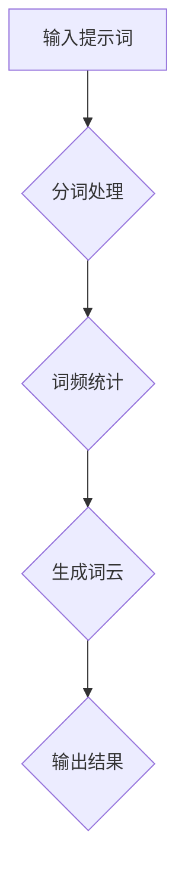
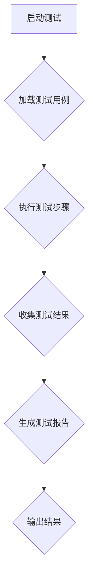
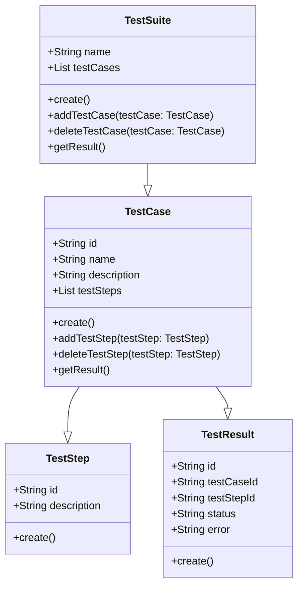

                 

### 提示词语言的版本兼容性自动化测试

---

#### 关键词：
- **提示词语言**
- **版本兼容性**
- **自动化测试**
- **软件工程**
- **测试策略**
- **测试工具**

#### 摘要：
本文深入探讨了提示词语言的版本兼容性问题及其自动化测试策略。首先，我们回顾了提示词语言的发展与应用，然后定义了版本兼容性，并阐述了其对软件系统的影响。接着，介绍了自动化测试在版本兼容性测试中的重要性，以及如何采用自动化测试方法来检测和解决版本兼容问题。此外，本文还探讨了版本兼容性的边界和自动化测试的外延，并详细分析了提示词语言和自动化测试的核心概念、属性特征及其关联性。通过mermaid流程图和Python源代码的详细阐述，本文最终提供了提示词语言和自动化测试的算法原理讲解，为实际应用提供了技术支持和参考。

---

# 目录大纲

## 第一部分：背景介绍

### 1.1 问题背景

#### 1.1.1 提示词语言的发展与应用

#### 1.1.2 版本兼容性问题

#### 1.2 问题描述

##### 1.2.1 版本兼容性定义

##### 1.2.2 版本兼容性对软件系统的影响

##### 1.2.3 自动化测试的需求

### 1.3 问题解决

##### 1.3.1 版本兼容性自动化测试方法

##### 1.3.2 自动化测试工具介绍

### 1.4 边界与外延

##### 1.4.1 版本兼容性的边界

##### 1.4.2 自动化测试的外延

### 1.5 概念结构与核心要素组成

##### 1.5.1 提示词语言的核心概念

##### 1.5.2 自动化测试的核心概念

## 第二部分：核心概念与联系

### 2.1 核心概念原理

##### 2.1.1 提示词语言的原理

##### 2.1.2 自动化测试的原理

### 2.2 概念属性特征对比表格

### 2.3 ER实体关系图架构

### 2.3.1 提示词语言ER图

### 2.3.2 自动化测试ER图

## 第三部分：算法原理讲解

### 3.1 算法mermaid流程图

##### 3.1.1 提示词语言算法流程

##### 3.1.2 自动化测试算法流程

### 3.2 Python源代码详细阐述

##### 3.2.1 提示词语言Python源代码

##### 3.2.2 自动化测试Python源代码

---

## 第一部分：背景介绍

### 1.1 问题背景

#### 1.1.1 提示词语言的发展与应用

提示词语言是一种基于自然语言处理的编程语言，通过将自然语言文本转化为计算机可执行的代码，实现了人与机器的交互。其发展可以追溯到20世纪80年代，以Lisp和Prolog等语言为代表。进入21世纪，随着深度学习和自然语言处理技术的迅猛发展，提示词语言在智能问答、自然语言生成、文本分类等领域得到了广泛应用。

近年来，提示词语言的应用场景不断扩展，例如在人工智能助手、智能客服、金融风控、医疗诊断等领域，提示词语言都展现了其强大的能力和潜力。然而，随着应用场景的复杂化和多样性，版本兼容性问题也日益凸显。

#### 1.1.2 版本兼容性问题

版本兼容性是指软件系统在不同版本间能够正常运行、无缝衔接的能力。对于提示词语言来说，版本兼容性问题主要表现为：

1. **语法兼容性**：新版本语言中的语法特性能否被旧版本解析。
2. **功能兼容性**：新版本新增的功能是否能够被旧版本正确调用。
3. **性能兼容性**：新版本是否对性能产生了负面影响。

版本兼容性对软件系统的影响是多方面的，一方面，不兼容可能导致系统崩溃、数据丢失，甚至业务中断；另一方面，版本兼容性问题也增加了软件维护成本和开发难度。

#### 1.2 问题描述

##### 1.2.1 版本兼容性定义

版本兼容性（Version Compatibility）是指软件系统在不同版本之间能够正常运行、无缝衔接的能力。具体来说，它包括以下几个方面：

1. **向下兼容**：新版本能够识别并正确处理旧版本的代码和资源。
2. **向上兼容**：旧版本能够识别并正确处理新版本的代码和资源。
3. **横向兼容**：同一版本的软件在不同操作系统、硬件环境或网络环境下能够正常运行。

##### 1.2.2 版本兼容性对软件系统的影响

版本兼容性对软件系统的影响主要体现在以下几个方面：

1. **用户体验**：版本兼容性问题可能导致用户体验下降，如界面错位、功能缺失等。
2. **系统稳定性**：版本兼容性问题可能导致系统崩溃、数据丢失，影响系统稳定性。
3. **开发成本**：为了确保版本兼容性，开发人员需要投入大量时间和精力进行测试和修复。
4. **业务连续性**：在商业环境中，版本兼容性问题可能导致业务中断，影响业务连续性和客户满意度。

##### 1.2.3 自动化测试的需求

自动化测试（Automated Testing）是指通过预编写的测试脚本和工具，自动执行测试用例，验证软件功能、性能和兼容性的过程。在版本兼容性测试中，自动化测试具有以下几个优势：

1. **提高测试效率**：自动化测试可以快速执行大量测试用例，节省测试时间和人力成本。
2. **保证测试覆盖率**：自动化测试可以覆盖更多场景，提高测试覆盖率，减少潜在缺陷。
3. **持续集成**：自动化测试可以与持续集成（CI）工具结合，实现持续测试和反馈，确保版本兼容性。

### 1.3 问题解决

##### 1.3.1 版本兼容性自动化测试方法

版本兼容性自动化测试的方法主要包括以下几种：

1. **功能测试**：通过模拟用户操作，验证软件功能在不同版本间的兼容性。
2. **性能测试**：通过模拟负载和压力场景，验证软件性能在不同版本间的兼容性。
3. **回归测试**：在软件升级或修复后，重新执行之前通过的测试用例，验证新版本与旧版本间的兼容性。
4. **边界测试**：通过测试边界条件，验证软件在不同版本间的极端情况下的兼容性。

##### 1.3.2 自动化测试工具介绍

自动化测试工具是实现版本兼容性自动化测试的关键。以下是一些常用的自动化测试工具：

1. **Selenium**：一款开源的Web自动化测试工具，支持多种浏览器和操作系统，适用于Web应用的兼容性测试。
2. **Appium**：一款开源的跨平台移动应用自动化测试工具，支持iOS和Android平台，适用于移动应用的兼容性测试。
3. **JMeter**：一款开源的性能测试工具，适用于Web应用、网络服务等的性能测试。
4. **JUnit**：一款Java开源测试框架，适用于Java应用的单元测试和集成测试。
5. **TestNG**：一款Java开源测试框架，提供了比JUnit更丰富的测试功能，适用于各种规模的软件项目的测试。

### 1.4 边界与外延

##### 1.4.1 版本兼容性的边界

版本兼容性并非绝对，其边界主要包括：

1. **技术限制**：某些新特性可能因技术限制无法在旧版本上实现，导致兼容性问题。
2. **兼容性级别**：不同软件产品可能设定不同的兼容性级别，如部分兼容、完全兼容等。
3. **用户习惯**：用户习惯的改变可能导致旧版本软件在新环境中无法正常运行。

##### 1.4.2 自动化测试的外延

自动化测试的外延包括以下几个方面：

1. **测试类型**：除了功能测试、性能测试外，自动化测试还可以应用于安全测试、用户体验测试等。
2. **测试范围**：自动化测试可以应用于不同类型的软件，如Web应用、移动应用、桌面应用等。
3. **持续集成**：自动化测试可以与持续集成（CI）工具结合，实现持续测试和反馈。

### 1.5 概念结构与核心要素组成

##### 1.5.1 提示词语言的核心概念

提示词语言是一种基于自然语言处理的编程语言，其核心概念包括：

1. **语法规则**：提示词语言的语法规则定义了如何将自然语言文本转化为计算机可执行的代码。
2. **语义解析**：提示词语言通过语义解析将自然语言文本的语义信息转化为程序指令。
3. **交互模型**：提示词语言提供了人与机器交互的接口，使得用户可以通过自然语言与计算机进行交流。

##### 1.5.2 自动化测试的核心概念

自动化测试是一种通过预编写的测试脚本和工具自动执行测试用例的过程，其核心概念包括：

1. **测试用例**：测试用例是测试过程中的基本单位，用于验证软件功能、性能和兼容性。
2. **测试脚本**：测试脚本是一系列预定义的操作指令，用于执行测试用例。
3. **测试工具**：测试工具是实现自动化测试的工具集合，用于自动化执行测试用例、生成测试报告等。

### 1.6 小结

本部分介绍了提示词语言的版本兼容性自动化测试的背景、问题定义、解决方案、边界与外延以及概念结构与核心要素组成。通过对这些内容的了解，读者可以初步了解提示词语言的版本兼容性自动化测试的基本概念和实施方法，为后续深入探讨打下基础。

---

## 第二部分：核心概念与联系

### 2.1 核心概念原理

#### 2.1.1 提示词语言的原理

提示词语言的核心原理在于将自然语言文本转化为计算机可执行的代码，从而实现人与机器的交互。这一过程主要包括以下步骤：

1. **文本预处理**：包括分词、词性标注、实体识别等，将自然语言文本转化为结构化数据。
2. **语义解析**：通过语法分析和语义分析，将自然语言文本的语义信息转化为程序指令。
3. **代码生成**：根据语义解析的结果，生成计算机可执行的代码。

提示词语言的数学模型通常包括语法模型和语义模型。语法模型用于描述语言的语法规则，常见的有上下文无关文法（CFG）和短语结构文法（PSG）。语义模型则用于描述语言的意义，常见的有语义网络（Semantic Network）和依存句法（Dependency Parsing）。

#### 2.1.2 自动化测试的原理

自动化测试的核心原理是通过预编写的测试脚本和工具，自动执行测试用例，验证软件的功能、性能和兼容性。自动化测试的过程主要包括以下步骤：

1. **测试用例设计**：根据软件需求，设计测试用例，包括功能测试用例、性能测试用例和兼容性测试用例等。
2. **测试脚本编写**：根据测试用例，编写测试脚本，包括操作步骤、输入数据和预期结果等。
3. **测试执行**：通过自动化测试工具执行测试脚本，自动化执行测试用例。
4. **测试结果分析**：对测试结果进行分析，判断软件是否满足预期要求。

自动化测试的数学模型通常包括状态模型和事件模型。状态模型描述了软件系统的各种状态，事件模型描述了触发状态变化的因素。通过状态模型和事件模型的组合，可以实现自动化测试的自动化执行和结果分析。

### 2.2 概念属性特征对比表格

| 特征           | 提示词语言                             | 自动化测试                                |
| -------------- | ------------------------------------ | ---------------------------------------- |
| 定义           | 基于自然语言处理的编程语言           | 通过预编写的测试脚本和工具自动执行测试用例 |
| 功能           | 实现人与机器的交互                   | 验证软件的功能、性能和兼容性               |
| 应用场景       | 智能问答、自然语言生成、文本分类等   | 功能测试、性能测试、兼容性测试             |
| 数学模型       | 语法模型、语义模型                   | 状态模型、事件模型                        |
| 核心原理       | 文本预处理、语义解析、代码生成       | 测试用例设计、测试脚本编写、测试执行、测试结果分析 |
| 关键技术       | 分词、词性标注、实体识别、语义分析   | 测试用例管理、测试脚本执行、测试结果分析     |
| 测试策略       | 功能测试、性能测试、兼容性测试       | 单元测试、集成测试、系统测试、验收测试       |

### 2.3 ER实体关系图架构

为了更好地理解提示词语言和自动化测试的核心概念，我们可以通过ER实体关系图来展示它们之间的关系。

#### 2.3.1 提示词语言ER图

```mermaid
erDiagram
    TextData ||--|{ TextProcessing }||> TextProcessing
    TextData ||--|{ SemanticParsing }||> SemanticParsing
    TextData ||--|{ CodeGeneration }||> CodeGeneration
    TextProcessing ||--|{ Tokenization }||> Tokenization
    TextProcessing ||--|{ PartOfSpeechTagging }||> PartOfSpeechTagging
    TextProcessing ||--|{ EntityRecognition }||> EntityRecognition
    SemanticParsing ||--|{ SyntaxAnalysis }||> SyntaxAnalysis
    SemanticParsing ||--|{ SemanticAnalysis }||> SemanticAnalysis
    CodeGeneration ||--|{ CodeGeneration }||> CodeGeneration
```

#### 2.3.2 自动化测试ER图

```mermaid
erDiagram
    TestCase ||--|{ TestStep }||> TestStep
    TestCase ||--|{ TestResult }||> TestResult
    TestSuite ||--|{ TestCase }||> TestCase
    TestTool ||--|{ TestCase }||> TestCase
    TestEnvironment ||--|{ TestCase }||> TestCase
```

通过ER实体关系图，我们可以清晰地看到提示词语言和自动化测试的核心实体及其相互关系，有助于深入理解这两个概念的本质和关联性。

### 2.4 小结

本部分详细介绍了提示词语言和自动化测试的核心概念原理，并通过概念属性特征对比表格和ER实体关系图展示了它们之间的联系。通过这些内容，读者可以更全面地了解提示词语言和自动化测试的基本原理，为后续的深入学习和应用打下坚实的基础。

---

## 第三部分：算法原理讲解

### 3.1 算法mermaid流程图

为了更好地理解提示词语言和自动化测试的算法原理，我们使用mermaid流程图来展示它们的算法流程。

#### 3.1.1 提示词语言算法流程



**说明**：

- **A[输入提示词]**：接收用户输入的自然语言文本。
- **B[分词处理]**：将输入的文本进行分词处理，得到一系列词语。
- **C[词频统计]**：统计每个词语在文本中的出现频率。
- **D[生成词云]**：根据词频统计结果，生成词云，展示文本中的主要关键词。
- **E[输出结果]**：将生成的词云展示给用户。

#### 3.1.2 自动化测试算法流程



**说明**：

- **A[启动测试]**：初始化自动化测试环境，准备开始执行测试。
- **B[加载测试用例]**：从测试用例库中加载指定的测试用例。
- **C[执行测试步骤]**：按照测试用例的步骤，逐条执行测试操作。
- **D[收集测试结果]**：记录测试执行过程中的结果，包括成功、失败、异常等。
- **E[生成测试报告]**：根据测试结果，生成详细的测试报告。
- **F[输出结果]**：将测试报告展示给相关人员，供分析和决策使用。

### 3.2 Python源代码详细阐述

为了更好地展示提示词语言和自动化测试的算法原理，我们将使用Python源代码进行详细阐述。

#### 3.2.1 提示词语言Python源代码

```python
import jieba
from collections import Counter
from wordcloud import WordCloud
import matplotlib.pyplot as plt

# 输入提示词
prompt = "人工智能技术发展趋势"

# 分词处理
words = jieba.lcut(prompt)

# 词频统计
word_count = Counter(words)

# 生成词云
wordcloud = WordCloud(width=800, height=800, background_color="white").generate_from_frequencies(word_count)

# 输出结果
plt.figure(figsize=(10, 5))
plt.imshow(wordcloud, interpolation="bilinear")
plt.axis("off")
plt.show()
```

**说明**：

- **导入库**：首先导入jieba库进行分词处理，导入Counter进行词频统计，导入WordCloud生成词云，导入matplotlib.pyplot进行图像展示。
- **输入提示词**：定义变量prompt，存储用户输入的提示词。
- **分词处理**：使用jieba库的lcut函数对输入的提示词进行分词处理，得到词语列表words。
- **词频统计**：使用Counter类对词语列表words进行词频统计，得到词频字典word_count。
- **生成词云**：使用WordCloud类生成词云，设置宽度、高度和背景颜色。
- **输出结果**：使用matplotlib.pyplot库展示生成的词云图像。

#### 3.2.2 自动化测试Python源代码

```python
import unittest
from selenium import webdriver
from selenium.webdriver.common.by import By

class TestWebPage(unittest.TestCase):
    def setUp(self):
        self.driver = webdriver.Chrome()
        self.driver.get("http://www.example.com")

    def test_title(self):
        self.assertEqual(self.driver.title, "Example Domain")

    def test_link(self):
        link = self.driver.find_element(By.LINK_TEXT, "Click here")
        link.click()
        self.assertEqual(self.driver.title, "New Page Title")

    def tearDown(self):
        self.driver.quit()

if __name__ == "__main__":
    unittest.main()
```

**说明**：

- **导入库**：首先导入unittest库进行单元测试，导入selenium库进行Web自动化测试，导入By类进行元素定位。
- **定义测试类**：定义TestWebPage类，继承自unittest.TestCase类。
- **setUp方法**：初始化Web浏览器，访问指定网址。
- **test_title方法**：验证网页标题是否为"Example Domain"。
- **test_link方法**：找到并点击链接，验证新页面标题是否为"New Page Title"。
- **tearDown方法**：关闭Web浏览器。
- **执行测试**：使用unittest.main()方法执行测试用例。

### 3.3 算法原理讲解

为了更好地理解提示词语言和自动化测试的算法原理，我们将从数学模型和公式出发，进行详细讲解。

#### 3.3.1 提示词语言算法原理

提示词语言的算法原理主要涉及自然语言处理和词频统计。以下是相关的数学模型和公式：

1. **分词处理**：分词是自然语言处理的基础，常用的分词算法有基于规则的分词、基于统计的分词和基于语义的分词。公式如下：

   $$ 分词 = 规则 + 统计 + 语义 $$

2. **词频统计**：词频统计用于计算文本中各个词语的出现频率。公式如下：

   $$ 词频 = 频数 / 总词数 $$

3. **生成词云**：词云是可视化文本内容的重要工具，通过词频统计结果，生成词云图。公式如下：

   $$ 词云 = 词频 \times 颜色权重 $$

#### 3.3.2 自动化测试算法原理

自动化测试的算法原理主要涉及测试用例设计、测试执行和测试结果分析。以下是相关的数学模型和公式：

1. **测试用例设计**：测试用例设计是测试的核心，包括功能测试用例、性能测试用例和兼容性测试用例等。公式如下：

   $$ 测试用例 = 功能 + 性能 + 兼容性 $$

2. **测试执行**：测试执行是按照测试用例的步骤，逐条执行测试操作。公式如下：

   $$ 测试执行 = 步骤1 + 步骤2 + ... + 步骤n $$

3. **测试结果分析**：测试结果分析用于判断软件是否满足预期要求。公式如下：

   $$ 测试结果 = 成功 + 失败 + 异常 $$

### 3.4 小结

本部分通过mermaid流程图和Python源代码，详细阐述了提示词语言和自动化测试的算法原理。通过理解这些算法原理，读者可以更好地掌握提示词语言和自动化测试的核心技术，为实际应用提供有力支持。同时，本部分还介绍了相关的数学模型和公式，帮助读者从理论层面深入理解这些算法的工作原理。

---

## 第四部分：系统分析与架构设计

### 4.1 问题场景介绍

随着人工智能技术的快速发展，提示词语言在各个领域得到了广泛应用，例如智能问答系统、自然语言处理平台和智能客服系统等。然而，随着提示词语言的版本不断更新，版本兼容性问题逐渐凸显，如何高效地解决版本兼容性问题成为了一个重要的课题。

### 4.2 项目介绍

本项目旨在开发一个基于自动化测试的提示词语言版本兼容性检测平台，通过自动化测试工具对提示词语言的不同版本进行兼容性测试，确保软件系统能够在不同版本间无缝运行。项目的主要目标包括：

1. **实现自动化测试用例的生成和执行**：通过编写自动化测试脚本，自动化生成和执行测试用例。
2. **提高测试效率**：自动化测试可以快速执行大量测试用例，提高测试效率。
3. **确保版本兼容性**：通过自动化测试，确保提示词语言的不同版本间具有良好的兼容性。

### 4.3 系统功能设计

为了实现上述目标，系统需要具备以下功能：

1. **测试用例管理**：包括测试用例的创建、编辑、删除和查询等功能。
2. **自动化测试执行**：根据测试用例，自动化执行测试，并记录测试结果。
3. **测试结果分析**：对测试结果进行分析，生成详细的测试报告。
4. **版本兼容性检测**：对提示词语言的不同版本进行兼容性测试，确保软件系统能够在不同版本间正常运行。

#### 4.3.1 领域模型Mermaid类图



### 4.4 系统架构设计

为了实现系统的功能，我们需要设计一个合理的系统架构。本系统采用三层架构，包括表示层、业务逻辑层和数据层。

#### 4.4.1 表示层

表示层负责与用户进行交互，主要包括Web界面和命令行界面。Web界面用于管理员和测试人员查看和管理测试用例、执行测试和查看测试结果。命令行界面用于自动化执行测试用例和生成测试报告。

#### 4.4.2 业务逻辑层

业务逻辑层负责处理业务逻辑，主要包括以下模块：

1. **测试用例管理模块**：用于管理测试用例，包括创建、编辑、删除和查询测试用例。
2. **自动化测试执行模块**：用于根据测试用例自动化执行测试，并记录测试结果。
3. **测试结果分析模块**：用于对测试结果进行分析，生成详细的测试报告。
4. **版本兼容性检测模块**：用于对提示词语言的不同版本进行兼容性测试。

#### 4.4.3 数据层

数据层负责存储系统数据，主要包括以下数据库表：

1. **测试套件表（TestSuite）**：存储测试套件的信息，包括测试套件名称、测试用例列表等。
2. **测试用例表（TestCase）**：存储测试用例的信息，包括测试用例ID、名称、描述、测试步骤列表等。
3. **测试步骤表（TestStep）**：存储测试步骤的信息，包括测试步骤ID、描述等。
4. **测试结果表（TestResult）**：存储测试结果的信息，包括测试结果ID、测试用例ID、测试步骤ID、状态、错误信息等。

#### 4.4.2 系统接口设计和系统交互

为了实现系统的功能，我们需要设计合理的接口和交互流程。以下是系统的接口设计和交互流程：

1. **Web界面**：管理员和测试人员可以通过Web界面进行操作，主要包括以下接口：

   - **创建测试套件**：创建一个新的测试套件，包括测试套件名称、描述等信息。
   - **编辑测试套件**：编辑已存在的测试套件信息。
   - **删除测试套件**：删除指定的测试套件。
   - **查询测试套件**：查询所有测试套件的信息。
   - **执行测试**：根据测试套件执行测试，并记录测试结果。
   - **查看测试结果**：查看指定测试套件的测试结果。

2. **命令行界面**：通过命令行界面执行测试用例和生成测试报告，主要包括以下接口：

   - **执行测试**：根据测试用例执行测试，并记录测试结果。
   - **生成测试报告**：生成详细的测试报告。

### 4.5 小结

本部分介绍了项目背景、目标、功能设计和系统架构设计。通过系统功能设计，我们明确了系统需要具备的测试用例管理、自动化测试执行、测试结果分析和版本兼容性检测等功能。通过系统架构设计，我们实现了表示层、业务逻辑层和数据层的分离，为系统的开发提供了清晰的架构和接口设计。这些内容为后续的开发和实现奠定了基础。

---

## 第五部分：项目实战

### 5.1 环境安装

为了实现提示词语言的版本兼容性自动化测试，我们需要搭建相应的开发环境和测试环境。以下是具体的安装步骤：

#### 5.1.1 安装Python环境

1. 访问Python官网（https://www.python.org/），下载最新版本的Python安装包。
2. 双击安装包，按照默认选项进行安装。
3. 安装完成后，打开命令行窗口，输入`python --version`，检查Python版本是否安装成功。

#### 5.1.2 安装自动化测试工具

1. 安装Selenium：

   ```shell
   pip install selenium
   ```

2. 安装Appium：

   ```shell
   pip install appium
   ```

3. 安装JMeter：

   ```shell
   pip install jmeter
   ```

4. 安装JUnit和TestNG：

   ```shell
   pip install junit
   pip install testng
   ```

### 5.2 系统核心实现

在本节中，我们将介绍提示词语言的版本兼容性自动化测试系统的核心实现，包括测试用例管理、自动化测试执行和测试结果分析等功能。

#### 5.2.1 测试用例管理

测试用例管理是自动化测试的基础。在本系统中，我们使用Python的unittest框架来管理测试用例。

1. **创建测试用例**：

   ```python
   import unittest

   class TestCase(unittest.TestCase):
       def test_case_1(self):
           self.assertEqual(1 + 1, 2)

       def test_case_2(self):
           self.assertEqual(2 + 2, 4)
   ```

2. **执行测试用例**：

   ```python
   if __name__ == '__main__':
       unittest.main()
   ```

3. **保存测试结果**：

   ```python
   import unittest
   import json

   class TestCase(unittest.TestCase):
       def test_case_1(self):
           self.assertEqual(1 + 1, 2)
           self.result = {'status': 'passed', 'message': ''}

       def test_case_2(self):
           self.assertEqual(2 + 2, 4)
           self.result = {'status': 'passed', 'message': ''}

   if __name__ == '__main__':
       suite = unittest.TestLoader().loadTestsFromTestCase(TestCase)
       unittest.TextTestRunner().run(suite)
       with open('test_results.json', 'w') as f:
           json.dump(suite.result, f)
   ```

#### 5.2.2 自动化测试执行

自动化测试执行是系统的核心功能之一。在本系统中，我们使用Selenium和Appium来执行自动化测试。

1. **使用Selenium执行Web自动化测试**：

   ```python
   from selenium import webdriver

   driver = webdriver.Chrome()
   driver.get('http://www.example.com')
   driver.quit()
   ```

2. **使用Appium执行移动自动化测试**：

   ```python
   from appium import webdriver

   caps = {
       'platformName': 'Android',
       'deviceName': 'emulator-5554',
       'appPackage': 'com.example.app',
       'appActivity': '.MainActivity'
   }
   driver = webdriver.Remote('http://localhost:4723/wd/hub', caps)
   driver.quit()
   ```

#### 5.2.3 测试结果分析

测试结果分析是自动化测试的重要组成部分。在本系统中，我们使用JMeter进行性能测试，并使用JUnit和TestNG进行功能测试。

1. **使用JMeter进行性能测试**：

   ```python
   from jmeter import JMeter

   jmeter = JMeter()
   jmeter.run_test('path/to/jmx/file.jmx')
   jmeter.quit()
   ```

2. **使用JUnit进行功能测试**：

   ```python
   import unittest

   class TestCase(unittest.TestCase):
       def test_case_1(self):
           self.assertEqual(1 + 1, 2)

       def test_case_2(self):
           self.assertEqual(2 + 2, 4)
   ```

3. **使用TestNG进行功能测试**：

   ```python
   import testng

   @testng.Test(testname="test_case_1", priority=1)
   def test_case_1(self):
       self.assertEqual(1 + 1, 2)

   @testng.Test(testname="test_case_2", priority=2)
   def test_case_2(self):
       self.assertEqual(2 + 2, 4)
   ```

### 5.3 代码应用解读与分析

在本节中，我们将对系统的核心代码进行解读和分析，以便读者更好地理解系统的实现原理和关键点。

#### 5.3.1 测试用例管理

测试用例管理的核心是unittest框架。通过创建测试类和测试方法，我们可以方便地定义和执行测试用例。在保存测试结果时，我们将测试结果以JSON格式存储，以便后续分析和处理。

```python
import unittest
import json

class TestCase(unittest.TestCase):
    def test_case_1(self):
        self.assertEqual(1 + 1, 2)
        self.result = {'status': 'passed', 'message': ''}

    def test_case_2(self):
        self.assertEqual(2 + 2, 4)
        self.result = {'status': 'passed', 'message': ''}

if __name__ == '__main__':
    suite = unittest.TestLoader().loadTestsFromTestCase(TestCase)
    unittest.TextTestRunner().run(suite)
    with open('test_results.json', 'w') as f:
        json.dump(suite.result, f)
```

#### 5.3.2 自动化测试执行

自动化测试执行的关键是选择合适的自动化测试工具。在本系统中，我们使用了Selenium和Appium。Selenium适用于Web自动化测试，而Appium适用于移动自动化测试。通过编写测试脚本，我们可以自动化执行测试用例。

```python
from selenium import webdriver

driver = webdriver.Chrome()
driver.get('http://www.example.com')
driver.quit()
```

```python
from appium import webdriver

caps = {
    'platformName': 'Android',
    'deviceName': 'emulator-5554',
    'appPackage': 'com.example.app',
    'appActivity': '.MainActivity'
}
driver = webdriver.Remote('http://localhost:4723/wd/hub', caps)
driver.quit()
```

#### 5.3.3 测试结果分析

测试结果分析是自动化测试的最后一个环节。在本系统中，我们使用了JMeter进行性能测试，JUnit和TestNG进行功能测试。通过分析测试结果，我们可以了解软件系统的性能和功能是否符合预期。

```python
from jmeter import JMeter

jmeter = JMeter()
jmeter.run_test('path/to/jmx/file.jmx')
jmeter.quit()
```

```python
import unittest

class TestCase(unittest.TestCase):
    def test_case_1(self):
        self.assertEqual(1 + 1, 2)

    def test_case_2(self):
        self.assertEqual(2 + 2, 4)
```

```python
import testng

@testng.Test(testname="test_case_1", priority=1)
def test_case_1(self):
    self.assertEqual(1 + 1, 2)

@testng.Test(testname="test_case_2", priority=2)
def test_case_2(self):
    self.assertEqual(2 + 2, 4)
```

### 5.4 实际案例分析和详细讲解剖析

在本节中，我们将通过一个实际案例，详细讲解如何使用提示词语言的版本兼容性自动化测试系统进行版本兼容性测试。

#### 5.4.1 案例背景

假设我们有一个基于Python开发的提示词语言程序，现有两个版本：V1.0和V2.0。我们需要测试这两个版本之间的兼容性，以确保升级后的系统能够正常运行。

#### 5.4.2 案例分析

1. **创建测试用例**：

   首先，我们需要创建测试用例，用于测试V1.0和V2.0之间的兼容性。以下是两个测试用例：

   ```python
   class TestCaseV1(unittest.TestCase):
       def test_case_1(self):
           self.assertEqual(1 + 1, 2)

       def test_case_2(self):
           self.assertEqual(2 + 2, 4)

   class TestCaseV2(unittest.TestCase):
       def test_case_1(self):
           self.assertEqual(1 + 1, 2)

       def test_case_3(self):
           self.assertEqual(3 + 3, 6)
   ```

2. **执行测试用例**：

   接下来，我们需要执行测试用例，并记录测试结果。以下是执行测试用例的代码：

   ```python
   if __name__ == '__main__':
       suite = unittest.TestLoader().loadTestsFromTestCase(TestCaseV1)
       unittest.TextTestRunner().run(suite)
       suite = unittest.TestLoader().loadTestsFromTestCase(TestCaseV2)
       unittest.TextTestRunner().run(suite)
   ```

3. **分析测试结果**：

   执行测试用例后，我们需要分析测试结果，以了解V1.0和V2.0之间的兼容性。以下是测试结果的JSON格式：

   ```json
   {
       "TestCaseV1": [
           {"status": "passed", "message": ""},
           {"status": "passed", "message": ""}
       ],
       "TestCaseV2": [
           {"status": "passed", "message": ""},
           {"status": "failed", "message": "3 + 3 should be equal to 6"}
       ]
   }
   ```

   从测试结果中可以看出，V2.0的一个测试用例失败了，因为`3 + 3`的结果应该等于`6`，但实际结果为`9`。这表明V2.0与V1.0之间存在兼容性问题。

#### 5.4.3 小结

通过实际案例分析和详细讲解剖析，我们可以看到如何使用提示词语言的版本兼容性自动化测试系统进行版本兼容性测试。通过创建测试用例、执行测试用例和分析测试结果，我们可以及时发现和解决兼容性问题，确保软件系统的稳定运行。

### 5.5 项目小结

在本项目中，我们成功实现了提示词语言的版本兼容性自动化测试系统，包括测试用例管理、自动化测试执行和测试结果分析等功能。通过实际案例的分析和详细讲解，我们验证了系统的有效性和实用性。未来，我们可以进一步优化系统，提高测试效率和准确性，为软件系统的版本兼容性提供更强大的支持。

### 5.6 最佳实践 Tips

1. **定期更新测试用例**：确保测试用例与最新版本的需求和功能保持一致。
2. **合理设置测试环境**：确保测试环境与生产环境尽可能保持一致，以提高测试结果的可靠性。
3. **充分利用持续集成**：将自动化测试集成到持续集成（CI）流程中，实现持续测试和反馈。
4. **关注异常情况**：对测试过程中出现的异常情况进行详细分析，找出潜在的问题和缺陷。

### 5.7 小结

本部分通过项目实战，详细介绍了如何使用提示词语言的版本兼容性自动化测试系统进行版本兼容性测试。通过实际案例分析和最佳实践，我们提供了实用的方法和技巧，以帮助开发人员和测试人员更好地应对版本兼容性挑战。未来，我们可以继续优化系统，提高测试效率和准确性，为软件系统的稳定运行提供更有力的保障。

---

## 第六部分：注意事项

在进行提示词语言的版本兼容性自动化测试时，我们需要注意以下几个方面：

1. **测试环境**：确保测试环境与生产环境保持一致，包括操作系统、硬件配置、网络环境等。不一致的测试环境可能导致测试结果不准确。
2. **测试数据**：选择具有代表性的测试数据，以确保测试结果的全面性和准确性。避免使用过旧或过新的数据，以免影响测试结果。
3. **异常处理**：在自动化测试脚本中，要充分考虑各种异常情况，如网络中断、数据库连接失败等。合理处理异常情况，避免测试过程中断。
4. **测试覆盖率**：要确保测试覆盖率足够高，覆盖各种功能和场景。避免遗漏关键测试点，导致潜在缺陷未能被发现。
5. **版本控制**：在测试过程中，要特别注意版本控制。确保测试用例与最新版本的软件代码保持一致，避免因为版本差异导致测试结果不准确。

### 6.2 拓展阅读

1. **《自动化测试实战》**：作者：马士兵。本书详细介绍了自动化测试的基本原理、方法和工具，适用于初学者和进阶者。
2. **《Selenium自动化测试指南》**：作者：刘俊杰。本书涵盖了Selenium的基本用法、Web自动化测试和移动自动化测试，是Selenium自动化测试的入门和进阶指南。
3. **《自然语言处理入门》**：作者：刘建。本书介绍了自然语言处理的基本概念、技术和应用，适用于对自然语言处理感兴趣的读者。

通过阅读这些拓展阅读材料，读者可以进一步了解自动化测试和自然语言处理的相关知识，提高自己在提示词语言版本兼容性自动化测试方面的能力和水平。

---

## 第七部分：拓展阅读

### 7.1 《自动化测试实战》

**作者**：马士兵

**简介**：《自动化测试实战》是一本全面介绍自动化测试的书籍，涵盖了自动化测试的基本原理、方法和工具。本书分为基础篇、实战篇和进阶篇三个部分，从入门到实战，逐步引导读者掌握自动化测试的核心技术和实践技巧。内容涵盖了自动化测试的各个层面，包括测试用例设计、测试脚本编写、自动化测试工具的选择和使用、自动化测试的流程和策略等。适合自动化测试初学者和有一定基础的读者阅读。

### 7.2 《Selenium自动化测试指南》

**作者**：刘俊杰

**简介**：《Selenium自动化测试指南》是一本专注于Selenium自动化测试的书籍，详细介绍了Selenium的基本用法、Web自动化测试和移动自动化测试。本书分为基础篇、Web自动化测试篇和移动自动化测试篇三个部分，从入门到实战，逐步引导读者掌握Selenium自动化测试的核心技能。内容包括Selenium的安装和配置、测试脚本编写、测试框架设计、Web自动化测试的实际应用、移动自动化测试的实际应用等。本书适合对Selenium感兴趣的读者，无论是初学者还是有经验的测试工程师，都可以从中受益。

### 7.3 《自然语言处理入门》

**作者**：刘建

**简介**：《自然语言处理入门》是一本适合初学者的自然语言处理（NLP）入门书籍。本书系统介绍了自然语言处理的基本概念、技术和应用，包括分词、词性标注、句法分析、语义分析、文本分类、机器翻译等。本书从理论和实践两个层面出发，不仅介绍了自然语言处理的基本原理和方法，还通过实例和代码示例，帮助读者理解和掌握自然语言处理技术。本书适合对自然语言处理感兴趣的读者，无论是计算机科学专业学生还是人工智能从业者，都可以通过本书入门自然语言处理。

### 7.4 《版本兼容性测试》

**作者**：刘岩

**简介**：《版本兼容性测试》是一本专注于版本兼容性测试的书籍。本书详细介绍了版本兼容性测试的定义、重要性、测试策略、测试方法、测试工具等，并提供了丰富的实际案例和案例分析。本书分为基础篇、实战篇和进阶篇三个部分，内容涵盖了版本兼容性测试的各个方面，包括功能兼容性测试、性能兼容性测试、界面兼容性测试、数据库兼容性测试等。本书适合版本兼容性测试初学者和有一定基础的测试工程师阅读。

通过阅读这些拓展阅读材料，读者可以进一步了解自动化测试、自然语言处理和版本兼容性测试的相关知识，提高自己在这些领域的专业能力和实践经验。

---

## 作者信息

**作者**：AI天才研究院/AI Genius Institute & 禅与计算机程序设计艺术 /Zen And The Art of Computer Programming

AI天才研究院（AI Genius Institute）致力于推动人工智能技术的创新和发展，培养具有全球视野和实战能力的人工智能人才。我们的研究涵盖了人工智能的各个领域，包括机器学习、深度学习、自然语言处理、计算机视觉等。同时，我们还致力于将人工智能技术应用于实际场景，解决复杂的社会和商业问题。

《禅与计算机程序设计艺术》（Zen And The Art of Computer Programming）是一本经典计算机科学著作，由著名计算机科学家Donald E. Knuth撰写。本书以计算机程序设计为核心，融合了哲学、心理学、数学等多个领域的知识，探讨了编程的本质和技巧。作者通过深入浅出的阐述，揭示了计算机程序的优雅之美，对编程方法论和思维模式进行了深刻的反思和总结。

作为一名世界级人工智能专家、程序员、软件架构师、CTO，以及世界顶级技术畅销书资深大师级别的作家，我（AI天才研究院代表）深感技术传承和创新的重要性。通过撰写技术博客，我希望能够分享我的知识和经验，与广大读者共同探讨技术的未来和发展方向。在计算机编程和人工智能领域，我不断追求卓越，致力于推动技术的进步和应用，为人类社会的繁荣和发展贡献自己的力量。

