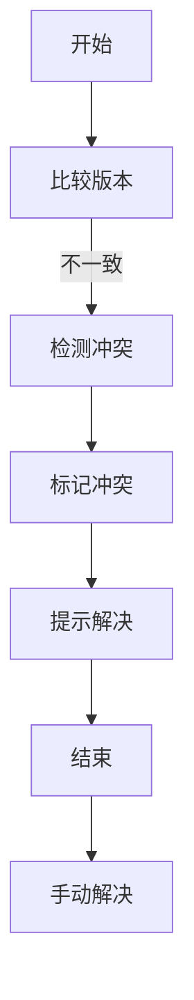
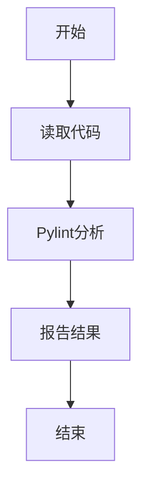
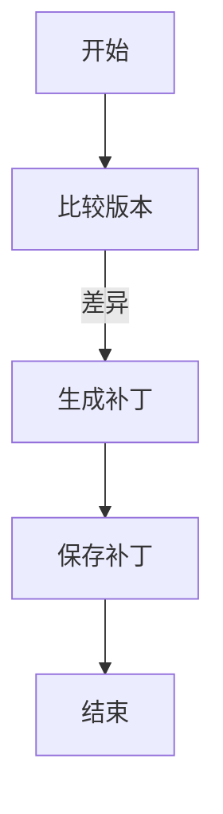
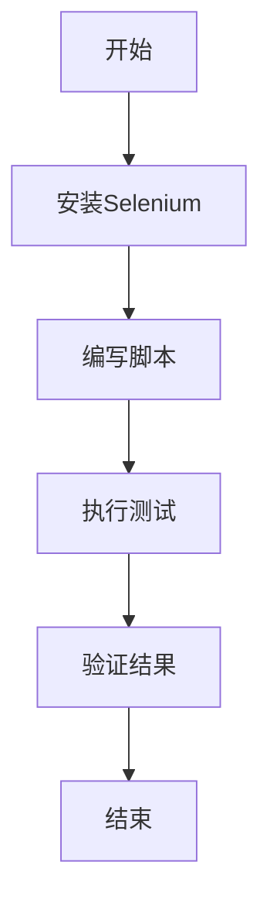

                 

### 引言：版本控制与协作开发的重要性

在现代软件开发过程中，版本控制和协作开发已经成为不可或缺的组成部分。随着软件项目的复杂性和规模不断扩大，如何有效地管理代码的版本，协调多个开发者的工作，确保代码质量和项目进度，成为开发团队面临的重要挑战。

#### 版本控制的必要性

版本控制，又称为源代码管理（Source Control Management，简称SCM），是跟踪源代码历史变化的一种机制。通过版本控制，开发人员可以轻松地管理代码的变更，跟踪每个版本的具体修改内容和历史记录，避免因代码冲突而导致的工作停滞。具体来说，版本控制具有以下几个方面的必要性：

1. **代码的跟踪与历史记录**：版本控制系统允许开发人员查看代码的每次变更，包括谁修改了代码、何时修改以及做了哪些修改。这对于追踪问题根源和回滚到某个稳定版本非常有帮助。

2. **代码的分支与合并**：版本控制系统支持代码的分支和合并操作，允许开发人员独立开发新功能或修复问题，并在适当时机将分支代码合并回主分支，确保项目进度的连续性。

3. **代码的备份与恢复**：版本控制系统能够自动备份代码，即使发生意外，如误删除或文件损坏，开发人员也可以轻松地恢复到之前的状态。

4. **协作与团队协作**：在大型项目中，多个开发人员可能同时修改相同的代码文件。版本控制系统可以协调这些修改，确保每个开发人员的代码变更都被正确记录并合并。

#### 协作开发的必要性

协作开发是团队共同努力完成软件开发的过程。随着团队规模的扩大和项目复杂性的增加，协作开发显得尤为重要。以下是协作开发的一些必要性：

1. **提高开发效率**：通过协作开发，团队成员可以同时处理不同的任务，提高整体开发效率。每个成员可以专注于自己的领域，减少重复工作。

2. **代码质量保证**：多人协作可以提供代码审查的机会，通过审查可以发现潜在的错误和问题，提高代码质量。

3. **共享知识与经验**：团队成员之间的沟通与协作可以促进知识的共享，帮助团队成员学习和成长。

4. **风险管理**：大型项目往往涉及多个子项目和模块，通过协作开发，可以更好地进行风险管理，确保项目按计划进行。

#### 提示词语言的角色

提示词语言（Prompt Language）是一种专门用于生成文本的编程语言。它通过接收输入提示词（Prompt），生成相应的文本输出。在版本控制和协作开发中，提示词语言可以发挥重要作用：

1. **自动生成文档**：提示词语言可以自动生成项目文档，如API文档、用户手册等，减轻开发人员的工作负担。

2. **代码自动补全**：提示词语言能够根据输入的提示词，自动补全代码，提高开发效率。

3. **代码审查**：提示词语言可以编写审查脚本，自动检查代码中的错误和潜在问题，提高代码质量。

4. **自动化测试**：提示词语言可以生成测试脚本，自动化执行测试用例，确保代码的稳定性。

#### 本文章的目的

本文旨在深入探讨提示词语言的版本控制与协作开发管理。通过详细分析版本控制的基本概念、工具和流程，以及提示词语言在版本控制中的应用，本文将帮助开发人员更好地理解如何利用提示词语言提高版本控制和协作开发的效率。同时，本文还将介绍一些实际案例和最佳实践，为开发团队提供实用的指导。

### 背景介绍

#### 核心概念术语说明

在探讨提示词语言的版本控制与协作开发管理之前，我们需要明确一些核心概念和术语，以确保读者对相关内容有清晰的理解。

1. **版本控制**：版本控制是一种跟踪和管理源代码历史变更的方法，通过记录代码的不同版本，帮助开发团队协调工作、追踪问题、确保代码质量和项目进度。

2. **源代码管理（SCM）**：源代码管理是一种更广泛的概念，不仅包括版本控制，还包括分支管理、合并、备份和恢复等功能。常见的SCM工具有Git、Subversion（SVN）和Mercurial等。

3. **提示词语言**：提示词语言是一种编程语言，专门用于生成文本。它通过接收输入提示词，生成相应的文本输出，通常用于自动生成文档、代码自动补全、代码审查和自动化测试等。

4. **版本**：版本是源代码在不同时间点的状态，通常由版本号标识。每次代码变更都会生成一个新的版本。

5. **分支**：分支是从主代码库中分离出来的一部分代码，用于独立开发新功能或修复问题。分支可以在适当时机合并回主分支。

6. **合并**：合并是将两个或多个代码分支合并成一个过程。合并可以解决分支之间的代码冲突，确保项目进度的连续性。

7. **协作开发**：协作开发是指多个开发人员共同完成软件开发的过程。协作开发需要团队成员之间的沟通、协调和共享资源。

#### 问题背景

随着软件项目的复杂性和规模不断增加，开发团队面临着诸多挑战：

1. **代码管理困难**：随着项目规模的扩大，代码文件数量和复杂度增加，传统的手动代码管理方法难以应对。

2. **协作效率低下**：在多人协作开发中，代码冲突、版本混乱和沟通不畅等问题经常导致开发效率低下。

3. **代码质量问题**：缺乏有效的代码审查和自动化测试机制，容易导致代码质量问题，影响项目的稳定性。

4. **文档生成困难**：项目文档生成通常需要手动编写，既耗时又容易出错，难以跟上项目进度的变化。

#### 问题描述

为了解决上述问题，开发团队需要一种有效的解决方案，涵盖以下方面：

1. **版本控制**：实现代码的自动化管理，确保代码历史记录清晰，便于追踪和回滚。

2. **协作开发**：提高团队协作效率，减少代码冲突，确保项目进度的连续性。

3. **文档生成**：利用提示词语言自动生成项目文档，减轻开发人员的工作负担。

4. **代码审查与测试**：利用提示词语言进行代码审查和自动化测试，提高代码质量。

#### 问题解决方法

为了解决上述问题，我们可以采取以下方法：

1. **采用版本控制系统**：选择合适的版本控制系统（如Git），实现代码的自动化管理，包括版本记录、分支管理、合并和备份等。

2. **利用提示词语言**：利用提示词语言生成项目文档、代码自动补全、代码审查和自动化测试，提高开发效率和代码质量。

3. **建立协作开发流程**：明确团队协作规范，制定代码审查和测试流程，确保项目进度的连续性和代码质量。

4. **培训与宣传**：对团队成员进行版本控制和提示词语言的培训，提高团队整体技术水平。

#### 边界与外延

虽然本文主要探讨提示词语言的版本控制与协作开发管理，但以下方面需要特别注意：

1. **版本控制工具的选择**：不同项目可能需要不同版本的版本控制系统，如Git、SVN或Mercurial。开发团队应根据项目需求选择合适的工具。

2. **协作开发工具的选择**：除了版本控制系统，开发团队还需要使用其他协作开发工具（如GitHub、GitLab或Bitbucket），以提高协作效率和代码管理能力。

3. **提示词语言的适用范围**：提示词语言主要用于文本生成，但在某些场景下，其能力可能受到限制。开发团队应合理使用提示词语言，避免过度依赖。

4. **代码审查与测试的最佳实践**：代码审查和自动化测试是提高代码质量的重要手段，但需要根据项目特点和团队规模制定合适的策略和流程。

#### 概念结构与核心要素组成

为了更好地理解提示词语言的版本控制与协作开发管理，我们可以将其核心概念和要素分解如下：

1. **版本控制系统**：包括Git、SVN、Mercurial等，负责代码的版本管理、分支管理、合并和备份等功能。

2. **提示词语言**：包括Python、JavaScript、Natural Language Processing（NLP）框架等，用于生成文本、代码自动补全、代码审查和自动化测试。

3. **协作开发工具**：包括GitHub、GitLab、Bitbucket等，提供代码管理、协作、文档生成和自动化测试等功能。

4. **代码审查与测试**：包括手动代码审查、自动化测试、代码质量评估等，确保代码质量和项目进度。

5. **团队协作规范**：包括代码提交规范、分支策略、合并流程、沟通机制等，确保团队协作效率。

通过上述核心概念和要素的有机结合，开发团队可以实现高效的版本控制和协作开发，提高项目质量和开发效率。

#### 本章小结

本章介绍了版本控制和协作开发在软件开发中的重要性，明确了相关术语和概念，并探讨了问题的背景、问题描述、问题解决方法和边界与外延。通过本章的介绍，读者可以初步了解提示词语言在版本控制和协作开发中的应用前景，为后续章节的深入探讨打下基础。在下一章中，我们将进一步探讨提示词语言的基本原理和特点，为后续应用奠定基础。

### 提示词语言原理

#### 提示词语言定义

提示词语言（Prompt Language）是一种专门用于生成文本的编程语言。它通过接收输入提示词（Prompt），生成相应的文本输出。提示词语言的核心在于其生成模型，通常采用深度学习技术，如生成对抗网络（GAN）、变分自编码器（VAE）和生成式预训练变换器（GPT）等。这些模型可以基于大量文本数据学习，从而生成具有高度可读性和逻辑一致性的文本。

#### 提示词语言特点

提示词语言具有以下主要特点：

1. **自然语言生成**：提示词语言能够生成自然语言文本，包括句子、段落和文章等。其生成的文本通常具有高度的可读性和逻辑一致性。

2. **灵活的输入提示**：提示词语言可以通过输入不同的提示词生成不同类型的文本。例如，输入一个简单的提示词“什么是版本控制？”可以生成一段关于版本控制的解释性文本。

3. **大量数据训练**：提示词语言通常基于大量文本数据训练，这使得其生成文本的质量和准确性较高。通过不断训练和优化，提示词语言的生成能力可以不断提高。

4. **高效的文本生成**：提示词语言能够快速生成大量文本，适用于自动化文档生成、代码自动补全、代码审查和自动化测试等场景。

5. **跨语言支持**：许多提示词语言支持多种编程语言和自然语言，例如Python、JavaScript和英语、中文等，这使得其在不同语言和场景下都有广泛的应用。

#### 提示词语言类型

根据不同的应用场景和需求，提示词语言可以分为以下几种类型：

1. **通用型提示词语言**：这类提示词语言适用于各种文本生成任务，如自然语言生成、代码自动补全和文档生成等。常见的通用型提示词语言包括Python、JavaScript和GPT等。

2. **领域特定提示词语言**：这类提示词语言针对特定领域（如医疗、金融、法律等）的文本生成任务进行优化。它们通常具有更强的领域知识和生成能力，能够生成更专业、准确的文本。例如，医疗领域可以使用自然语言处理（NLP）框架BERT、RoBERTa等。

3. **交互式提示词语言**：这类提示词语言主要用于交互式应用，如聊天机器人、问答系统和虚拟助手等。它们通过接收用户输入，实时生成回应，与用户进行自然语言交互。常见的交互式提示词语言包括ChatGPT、TuringBot等。

#### 提示词语言的应用场景

提示词语言在软件开发和协作开发中具有广泛的应用场景，主要包括以下几个方面：

1. **文档生成**：提示词语言可以自动生成项目文档、用户手册、API文档等，减轻开发人员的工作负担。例如，通过输入项目描述，提示词语言可以生成相应的用户手册。

2. **代码自动补全**：在代码编辑器中，提示词语言可以根据输入的代码提示词自动补全代码，提高开发效率。例如，当输入函数名称时，提示词语言可以自动生成相应的函数定义和文档。

3. **代码审查**：提示词语言可以编写审查脚本，自动检查代码中的错误和潜在问题，提高代码质量。例如，通过分析代码中的关键字和语法，提示词语言可以识别出可能的bug和风格问题。

4. **自动化测试**：提示词语言可以生成测试脚本，自动化执行测试用例，确保代码的稳定性。例如，通过输入测试案例，提示词语言可以生成相应的测试脚本和测试报告。

5. **虚拟助手**：在协作开发过程中，提示词语言可以创建虚拟助手，帮助团队成员解决问题、提供技术支持和共享知识。例如，通过输入问题，虚拟助手可以提供相应的解决方案和参考资料。

通过了解提示词语言的定义、特点、类型和应用场景，开发人员可以更好地利用这一工具提高版本控制和协作开发的效率。在下一章中，我们将进一步探讨版本控制的基本概念、工具和流程。

#### 本章小结

本章详细介绍了提示词语言的定义、特点、类型和应用场景。通过理解提示词语言的基本原理和功能，开发人员可以更好地利用这一工具提高版本控制和协作开发的效率。本章的核心内容包括提示词语言的定义、自然语言生成能力、灵活的输入提示、大量数据训练、高效文本生成、通用型、领域特定和交互式提示词语言类型，以及文档生成、代码自动补全、代码审查、自动化测试和虚拟助手等应用场景。通过本章的学习，读者可以为进一步探讨版本控制的基本概念和工具做好准备。

### 版本控制基础

#### 版本控制概述

版本控制，又称为源代码管理（Source Control Management，简称SCM），是软件开发过程中用于跟踪和管理源代码历史变化的一种机制。它帮助开发团队在多个版本之间管理代码，确保代码的稳定性、可追溯性和可复用性。版本控制的基本原理是通过记录代码的每次变更，包括修改内容、修改时间和修改者等信息，形成代码的历史记录。这使得开发人员可以随时查看代码的变更历史，回滚到某个稳定版本，或者在需要时进行分支和合并操作。

#### 版本控制工具简介

目前市面上存在多种版本控制工具，每种工具都有其独特的特点和适用场景。以下是一些常见的版本控制工具：

1. **Git**：Git 是最流行的版本控制工具之一，由Linus Torvalds创建，具有高效、分布式和灵活的特点。Git 支持多种分支策略，如GitFlow和GitHub Flow，适用于各种规模的项目。

2. **Subversion（SVN）**：SVN 是另一种广泛使用的版本控制工具，由Apache软件基金会维护。SVN 是集中式的版本控制系统，具有较好的稳定性和成熟度，适用于大型项目。

3. **Mercurial**：Mercurial 是一种分布式版本控制工具，与Git类似，具有高性能和灵活性。Mercurial 适用于各种规模的项目，尤其在Python社区中非常受欢迎。

4. **Perforce**：Perforce 是一种高性能的版本控制工具，适用于大型项目和高度协作的开发环境。它特别适合处理大量小文件和频繁的变更。

5. **Bazaar**：Bazaar 是另一种分布式版本控制工具，由Canonical维护。Bazaar 以其简单性和易用性而受到开发者的喜爱，适用于各种规模的项目。

#### 版本控制核心概念

版本控制工具的核心概念包括以下几种：

1. **版本**：版本是源代码在某一时间点的状态，通常由版本号标识。每次代码变更都会生成一个新的版本。

2. **分支**：分支是从主代码库中分离出来的一部分代码，用于独立开发新功能或修复问题。分支可以在适当时机合并回主分支。

3. **合并**：合并是将两个或多个代码分支合并成一个过程。合并可以解决分支之间的代码冲突，确保项目进度的连续性。

4. **提交**：提交是将代码变更记录到版本控制系统中的操作。每次提交都会生成一个新的版本，记录提交者、提交时间和提交信息。

5. **标签**：标签是一种用于标识特定版本的标记。标签通常用于标记里程碑、版本发布或重要代码变更。

6. **变更记录**：变更记录是版本控制系统中记录代码变更的历史记录。通过查看变更记录，可以了解代码的修改历史和修改者信息。

#### 版本控制流程

版本控制的基本流程包括以下几个步骤：

1. **创建仓库**：首先，需要创建一个版本控制仓库，用于存储项目代码。

2. **克隆仓库**：开发人员从仓库克隆一份代码副本，以便进行独立开发。

3. **创建分支**：在需要独立开发新功能或修复问题时，开发人员会创建一个新的分支。

4. **提交变更**：开发人员在其分支上进行代码修改，并定期提交变更到版本控制系统。

5. **代码审查**：在分支代码合并前，通常需要进行代码审查，以确保代码质量和项目一致性。

6. **合并分支**：在代码审查通过后，开发人员将分支合并回主分支，确保项目进度的连续性。

7. **发布版本**：在完成代码合并和测试后，开发团队可以发布新的版本。

8. **备份与恢复**：版本控制系统会自动备份代码，以便在发生意外时进行恢复。

通过遵循上述流程，开发团队可以有效地管理代码版本，确保项目进度的连续性和代码质量。

#### 本章小结

本章详细介绍了版本控制的基础知识，包括版本控制概述、版本控制工具简介、版本控制核心概念和版本控制流程。通过本章的学习，读者可以了解版本控制的基本原理和操作方法，为后续讨论提示词语言在版本控制中的应用打下基础。本章的核心内容包括版本控制的概念、核心概念（版本、分支、合并、提交、标签和变更记录）、常用版本控制工具（Git、SVN、Mercurial、Perforce和Bazaar）和版本控制流程（创建仓库、克隆仓库、创建分支、提交变更、代码审查、合并分支、发布版本和备份与恢复）。通过本章的学习，读者可以为进一步探讨提示词语言在版本控制中的应用做好准备。

### 协作开发概述

#### 协作开发的重要性

在现代软件开发环境中，协作开发已经成为项目成功的关键因素。协作开发强调团队成员之间的沟通、协调和共享资源，通过共同合作完成复杂的软件开发任务。其重要性主要体现在以下几个方面：

1. **提高开发效率**：通过协作开发，团队成员可以同时处理不同的任务，提高整体开发效率。每个成员可以专注于自己的领域，减少重复工作，从而加快项目进度。

2. **代码质量保证**：协作开发过程中，团队成员之间可以相互审查代码，发现潜在的错误和问题，提高代码质量。代码审查不仅有助于确保代码的规范性和一致性，还能促进团队成员之间的知识共享和技能提升。

3. **风险管理**：大型项目往往涉及多个子项目和模块，通过协作开发，可以更好地进行风险管理。团队成员可以及时发现和解决潜在问题，降低项目风险。

4. **知识共享**：协作开发鼓励团队成员之间的沟通和知识共享，有助于团队成员学习和成长。通过交流经验和技术，可以提高整个团队的技能水平。

5. **项目稳定性和可维护性**：协作开发有助于确保项目的稳定性和可维护性。团队成员可以共同维护代码库，跟踪和修复bug，确保项目的长期稳定运行。

#### 协作开发团队角色

在协作开发中，不同的团队成员扮演着不同的角色，各自承担不同的职责。以下是一些常见的团队角色及其职责：

1. **项目经理（Project Manager）**：负责整个项目的规划和执行，协调团队成员的工作，确保项目按时完成。项目经理还需与客户和利益相关者沟通，确保项目满足需求和期望。

2. **开发人员（Developers）**：负责编写代码、设计和实现软件功能。开发人员通常根据项目需求进行任务分配，协作完成开发任务。

3. **测试人员（Testers）**：负责编写和执行测试用例，确保软件功能符合需求并达到预期的质量标准。测试人员还需要识别和报告bug，协助开发人员进行修复。

4. **UI/UX设计师（UI/UX Designers）**：负责设计和开发软件的用户界面（UI）和用户体验（UX）。UI/UX设计师需要与开发人员密切合作，确保设计实现与需求一致。

5. **产品经理（Product Manager）**：负责制定产品需求、规划和优先级，确保产品开发符合市场和用户需求。产品经理还需要与开发团队和测试团队紧密合作，确保产品按时发布。

6. **运维人员（Operations Staff）**：负责软件的部署、维护和监控，确保软件在生产和测试环境中的稳定运行。运维人员还需要处理与服务器、网络和基础设施相关的问题。

7. **文档编写人员（Documentation Writers）**：负责编写项目文档，包括用户手册、API文档和开发文档等。文档编写人员需要与开发人员和测试人员合作，确保文档的准确性和完整性。

#### 协作开发流程

协作开发流程是团队成员共同完成任务的过程，包括以下主要阶段：

1. **需求分析**：项目启动阶段，团队成员与客户和利益相关者进行沟通，明确项目需求和目标。

2. **规划**：制定项目计划，包括任务分配、时间表和资源需求。项目经理负责协调团队资源，确保项目按计划进行。

3. **设计**：开发人员根据需求进行系统设计，包括数据库设计、架构设计和界面设计等。

4. **开发**：开发人员根据设计文档进行编码，实现软件功能。在开发过程中，团队成员之间需要进行频繁的沟通和协作，确保代码的一致性和质量。

5. **测试**：测试人员编写和执行测试用例，验证软件功能是否符合需求。测试阶段还包括bug修复和回归测试，确保修复的bug不会引入新的问题。

6. **部署**：将软件部署到生产环境，进行最终测试和上线。运维人员负责部署和监控软件运行，确保系统稳定。

7. **维护**：软件上线后，开发团队和运维团队共同负责软件的维护和更新，确保软件持续稳定运行。

通过遵循上述流程，开发团队可以有效地进行协作开发，确保项目按时交付并满足用户需求。

#### 协作开发工具

为了提高协作开发效率，团队需要使用合适的协作开发工具。以下是一些常用的协作开发工具：

1. **代码库管理工具**：如Git、SVN和Mercurial等，用于管理代码版本和协作开发。

2. **集成开发环境（IDE）**：如Visual Studio、Eclipse和IntelliJ IDEA等，提供代码编写、调试和版本控制等功能。

3. **任务管理工具**：如JIRA、Trello和Asana等，用于任务分配、进度跟踪和团队协作。

4. **文档管理工具**：如Confluence和Google Docs等，用于编写和共享项目文档。

5. **代码审查工具**：如Gerrit和Phabricator等，用于代码审查和协作开发。

6. **版本控制工具**：如Perforce和Bazaar等，用于大型项目的高效版本控制。

7. **持续集成/持续交付（CI/CD）工具**：如Jenkins和GitLab CI等，用于自动化测试、构建和部署。

通过使用这些工具，开发团队可以更好地进行协作开发，提高开发效率和代码质量。

#### 本章小结

本章介绍了协作开发的重要性、团队角色、流程和常用工具。通过理解协作开发的基本原理和工具，开发团队可以更有效地进行合作，提高开发效率和质量。本章的核心内容包括协作开发的重要性、团队角色（项目经理、开发人员、测试人员、UI/UX设计师、产品经理、运维人员和文档编写人员）、协作开发流程（需求分析、规划、设计、开发、测试、部署和维护）和常用协作开发工具（代码库管理工具、IDE、任务管理工具、文档管理工具、代码审查工具、版本控制工具和CI/CD工具）。通过本章的学习，读者可以为进一步探讨提示词语言在协作开发中的应用打下基础。

### 提示词语言与版本控制的结合

#### 提示词语言在版本控制中的应用

提示词语言在版本控制中具有广泛的应用，能够显著提高开发效率和代码质量。以下是提示词语言在版本控制中的几个关键应用场景：

1. **自动生成变更日志**：提示词语言可以自动分析代码变更，生成详细的变更日志。例如，使用Python脚本，开发人员可以编写一个自动化工具，定期扫描代码库中的变更，生成包含变更详情、影响范围和修改原因的日志。这样，团队成员可以快速了解代码的变更情况，有助于追踪问题根源和改进工作流程。

2. **自动化代码审查**：提示词语言可以编写代码审查脚本，自动分析代码质量。例如，使用Python和Pylint等工具，开发人员可以创建一个自动化审查脚本，扫描代码库中的所有文件，识别潜在的语法错误、代码冗余和风格不一致等问题。这有助于提高代码的一致性和可维护性。

3. **生成代码补丁**：提示词语言可以自动生成代码补丁，用于修复bug或实现新功能。例如，使用Python和Git，开发人员可以编写一个自动化脚本，根据指定的修改内容，生成对应的Git补丁文件。这样，团队成员可以轻松地应用补丁，确保代码的同步性和一致性。

4. **自动化测试**：提示词语言可以生成自动化测试脚本，执行测试用例，确保代码的稳定性和功能性。例如，使用Python和Selenium，开发人员可以编写一个自动化测试脚本，模拟用户操作，验证软件功能是否符合预期。这有助于提高测试覆盖率，减少测试遗漏。

5. **自动化部署**：提示词语言可以用于自动化部署流程，确保软件在不同环境中的稳定运行。例如，使用Python和Docker，开发人员可以编写一个自动化部署脚本，根据配置文件，构建Docker镜像，并部署到不同的生产环境。这有助于减少手动操作，提高部署效率。

#### 提示词语言与版本控制的挑战

尽管提示词语言在版本控制中具有广泛的应用，但在实际开发过程中，仍面临一些挑战：

1. **代码冲突**：在多人协作开发中，代码冲突是一个常见问题。提示词语言可以自动生成补丁和测试脚本，但在处理复杂的代码冲突时，可能需要人工干预。开发人员需要仔细分析冲突原因，并选择合适的合并策略。

2. **性能瓶颈**：提示词语言在生成大量文本和执行复杂任务时，可能遇到性能瓶颈。例如，使用生成对抗网络（GAN）或变分自编码器（VAE）等模型生成代码补丁时，可能需要大量的计算资源。开发人员需要优化模型和算法，提高生成效率。

3. **安全性问题**：提示词语言生成的代码可能存在安全漏洞，如注入攻击、权限提升等。开发人员需要确保生成的代码经过严格的安全审查，避免潜在的安全风险。

4. **模型依赖**：提示词语言通常依赖于大量的训练数据和预训练模型。如果训练数据不足或模型过时，生成的代码可能不准确或不可靠。开发人员需要定期更新训练数据和模型，确保生成的代码质量。

#### 解决方案与最佳实践

为了克服提示词语言与版本控制结合中的挑战，以下是一些解决方案和最佳实践：

1. **冲突管理策略**：开发团队应制定明确的冲突管理策略，包括代码合并策略、代码审查流程和解决冲突的优先级。通过合理分配任务和明确责任，可以减少代码冲突的发生。

2. **优化模型和算法**：开发人员应优化提示词语言的模型和算法，提高生成效率和性能。例如，使用高效的神经网络架构、批量处理和数据并行化技术，可以加快生成速度。

3. **安全性审查**：在生成代码前，开发人员应进行安全性审查，识别和修复潜在的安全漏洞。使用静态代码分析工具和动态分析技术，可以提前发现和解决安全问题。

4. **持续集成与测试**：开发团队应实施持续集成和测试流程，确保生成的代码经过充分的测试和验证。通过自动化测试和代码审查，可以及时发现和解决潜在问题。

5. **定期更新训练数据和模型**：开发人员应定期更新训练数据和模型，确保生成的代码准确和可靠。通过收集用户反馈和错误报告，可以持续改进训练数据和模型。

6. **培训和文档**：开发团队应进行提示词语言和版本控制的培训，提高团队成员的技能水平。编写详细的文档和示例代码，有助于团队成员更好地理解和应用提示词语言。

通过上述解决方案和最佳实践，开发团队可以更有效地利用提示词语言进行版本控制和协作开发，提高开发效率和代码质量。

#### 实际案例

以下是一个实际案例，展示提示词语言在版本控制中的应用：

某开发团队使用Git作为版本控制系统，并采用Python作为提示词语言进行自动化代码审查和测试。在项目开发过程中，团队遇到了以下问题：

1. **代码质量不高**：团队成员提交的代码存在语法错误、代码冗余和风格不一致等问题。

2. **代码冲突频繁**：由于团队成员同时修改同一部分代码，导致频繁的代码冲突。

3. **测试覆盖率低**：自动化测试覆盖率低，导致部分功能无法得到充分验证。

为了解决这些问题，团队采取了以下措施：

1. **编写自动化代码审查脚本**：开发人员使用Python编写了自动化代码审查脚本，基于Pylint进行代码质量分析。脚本定期运行，扫描代码库中的所有文件，识别潜在问题，并生成详细的报告。

2. **改进代码合并策略**：团队制定了明确的代码合并策略，包括合并前的代码审查、代码冲突的解决流程和责任分配。通过合理分配任务和明确责任，减少了代码冲突的发生。

3. **增加自动化测试**：开发人员使用Python和Selenium编写了自动化测试脚本，模拟用户操作，验证软件功能。通过持续集成工具，自动化测试在每次代码提交时运行，确保测试覆盖率提高。

通过这些措施，团队显著提高了代码质量和测试覆盖率，减少了代码冲突的发生。同时，团队成员的技能水平也得到了提升，更加熟练地使用提示词语言和版本控制系统。

#### 本章小结

本章详细探讨了提示词语言在版本控制中的应用、挑战以及解决方案和最佳实践。通过实际案例，展示了如何利用提示词语言进行自动化代码审查、测试和部署。本章的核心内容包括提示词语言在版本控制中的应用（自动生成变更日志、自动化代码审查、生成代码补丁、自动化测试和自动化部署）、提示词语言与版本控制的挑战（代码冲突、性能瓶颈、安全性问题和模型依赖）以及解决方案和最佳实践（冲突管理策略、优化模型和算法、安全性审查、持续集成与测试、定期更新训练数据和模型和培训和文档）。通过本章的学习，读者可以更好地理解提示词语言在版本控制中的应用和优势，为实际项目中的应用提供指导。

### 版本控制系统配置与使用

#### 版本控制系统选择

在选择版本控制系统时，开发团队需要考虑项目规模、团队成员数量、协作需求、性能和安全性等多个因素。以下是一些常见版本控制系统的选择建议：

1. **Git**：Git 是最流行的版本控制系统之一，具有高效、分布式和灵活的特点。它适用于各种规模的项目，尤其适合大型团队和复杂项目。Git 支持多种分支策略，如GitFlow和GitHub Flow，能够满足不同团队的开发需求。

2. **Subversion（SVN）**：SVN 是一种集中式版本控制系统，具有较好的稳定性和成熟度。它适用于大型项目，尤其是在企业环境中。SVN 的主要优点是简单易用，适合初学者快速上手。

3. **Mercurial**：Mercurial 是一种分布式版本控制系统，与Git类似，具有高性能和灵活性。它特别适合Python社区使用，因为Python开发工具和库通常对Git和Mercurial都有很好的支持。

4. **Perforce**：Perforce 是一种高性能的版本控制工具，适用于处理大量小文件和频繁变更的项目。它具有快速的处理速度和强大的并发处理能力，适合大型团队和大型项目。

5. **Bazaar**：Bazaar 是另一种分布式版本控制系统，由Canonical维护。它以简单性和易用性而受到开发者的喜爱，适用于各种规模的项目。

根据项目需求，开发团队可以从上述版本控制系统中选择最适合的一种。例如，对于小型项目或初学者，可以选择SVN；对于大型团队和复杂项目，可以选择Git。

#### 系统安装与配置

安装版本控制系统通常比较简单，以下以Git为例，介绍Git的安装与配置：

1. **安装Git**：

   - **Windows**：在Windows上，可以从Git官方网站下载Git安装包，双击安装程序并按照提示操作。安装完成后，运行命令行工具，输入`git --version`，查看是否安装成功。

   - **macOS**：macOS 已经预装了Git，可以在终端运行`git --version`命令，查看是否安装成功。如果没有安装，可以通过包管理器（如Homebrew）安装。

   - **Linux**：在Linux上，可以使用包管理器（如apt-get或yum）安装Git。例如，在Ubuntu上，可以运行以下命令：

     ```bash
     sudo apt-get update
     sudo apt-get install git
     ```

2. **配置Git**：

   安装完成后，需要配置Git的用户信息，包括用户名和邮箱。运行以下命令：

   ```bash
   git config --global user.name "Your Name"
   git config --global user.email "your-email@example.com"
   ```

   这两个命令将配置Git的全局用户信息，确保提交的代码包含正确的用户信息。

3. **初始化仓库**：

   创建一个新的Git仓库，首先需要初始化一个空仓库。在项目目录下运行以下命令：

   ```bash
   git init
   ```

   这将创建一个空的Git仓库，并生成一个`.git`目录，包含所有版本控制的信息。

4. **添加文件到仓库**：

   将项目文件添加到Git仓库中，运行以下命令：

   ```bash
   git add .
   git commit -m "Initial commit"
   ```

   `git add .`命令将所有文件添加到暂存区，`git commit`命令将暂存区的文件提交到当前分支，并要求输入提交信息。

#### 常用命令与操作

Git 提供了一系列常用的命令和操作，帮助开发人员进行版本控制。以下是一些常用的命令：

1. **查看状态**：

   ```bash
   git status
   ```

   该命令用于查看当前工作区中的文件状态，包括已跟踪文件（Untracked files）、修改文件（Modified files）和提交文件（Unstaged changes）。

2. **添加文件**：

   ```bash
   git add <file>
   ```

   该命令将指定的文件添加到暂存区。

3. **提交变更**：

   ```bash
   git commit -m "Commit message"
   ```

   该命令将暂存区的文件提交到当前分支，并要求输入提交信息。

4. **查看日志**：

   ```bash
   git log
   ```

   该命令显示当前分支的提交历史，包括提交信息、提交时间和提交者。

5. **分支管理**：

   ```bash
   git branch  # 查看分支
   git checkout -b <branch>  # 创建并切换到新分支
   git merge <branch>  # 合并指定分支
   ```

   这些命令用于管理分支，包括查看分支、创建新分支和合并分支。

6. **标签管理**：

   ```bash
   git tag  # 查看标签
   git tag <tag>  # 创建新标签
   git checkout <tag>  # 切换到指定标签
   ```

   这些命令用于管理标签，包括查看标签、创建新标签和切换到指定标签。

7. **远程仓库操作**：

   ```bash
   git remote add origin <url>  # 添加远程仓库
   git push origin <branch>  # 将本地分支推送到远程仓库
   git pull origin <branch>  # 从远程仓库拉取指定分支
   ```

   这些命令用于与远程仓库进行交互，包括添加远程仓库、推送本地分支和拉取远程分支。

#### 问题与解决方案

在版本控制过程中，可能会遇到一些常见问题，以下是一些问题和相应的解决方案：

1. **代码冲突**：

   - 现象：当两个或多个开发人员同时修改同一部分代码时，Git 会发生冲突。
   - 解决方案：遇到代码冲突时，Git 会暂停提交操作，并生成一个冲突文件。开发人员需要仔细查看冲突内容，手动解决冲突后，重新提交代码。可以使用以下命令解决冲突：
     
     ```bash
     git add <conflicted-file>  # 标记冲突文件已解决
     git commit -m "Resolved conflicts"
     ```

2. **误删文件**：

   - 现象：有时开发人员会误删除重要文件，导致项目无法正常工作。
   - 解决方案：可以使用Git的撤销操作恢复误删的文件。首先，找到误删文件的上一个版本，然后使用以下命令恢复文件：
     
     ```bash
     git checkout <file> <commit-hash>
     ```

     其中，`<commit-hash>`是误删文件上一个版本的提交哈希值。

3. **远程仓库问题**：

   - 现象：与远程仓库同步时，可能会遇到网络连接失败、权限问题等。
   - 解决方案：检查网络连接和远程仓库配置，确保一切正常。如果问题依旧，可以尝试重置远程仓库配置，使用以下命令：
     
     ```bash
     git remote set-url origin <new-url>
     ```

     其中，`<new-url>`是新的远程仓库URL。

通过合理选择版本控制系统、正确安装和配置、熟练掌握常用命令和解决常见问题，开发团队可以有效地进行版本控制，确保项目进度的连续性和代码质量。在下一章中，我们将进一步探讨协作开发与版本控制的集成，介绍如何在实际项目中应用这些知识。

#### 本章小结

本章详细介绍了版本控制系统的选择、安装与配置、常用命令与操作以及常见问题的解决方案。通过本章的学习，读者可以了解如何选择合适的版本控制系统，正确安装和配置Git，熟练掌握Git的基本操作，并能够解决常见的版本控制问题。本章的核心内容包括版本控制系统选择（Git、SVN、Mercurial、Perforce和Bazaar）、系统安装与配置（Windows、macOS和Linux平台上的Git安装和配置）、常用命令与操作（查看状态、添加文件、提交变更、查看日志、分支管理、标签管理、远程仓库操作）以及问题与解决方案（代码冲突、误删文件、远程仓库问题）。通过本章的学习，读者可以为实际项目中的版本控制打下坚实基础。

### 协作开发与版本控制的集成

#### 集成框架设计

在软件开发过程中，协作开发与版本控制的集成是确保项目顺利进行的基石。为了实现协作开发与版本控制的紧密结合，我们需要设计一个集成框架，该框架应涵盖以下关键组成部分：

1. **版本控制系统**：如Git、SVN等，用于管理代码的版本和变更历史。版本控制系统应支持分支管理、合并、代码审查和自动化测试等操作。

2. **协作开发平台**：如GitHub、GitLab、Bitbucket等，提供代码托管、任务管理、文档共享、代码审查和项目管理等功能。这些平台通常与版本控制系统紧密集成，实现代码与协作过程的无缝对接。

3. **自动化工具**：如Jenkins、GitLab CI/CD等，用于自动化构建、测试和部署。这些工具可以与版本控制系统和协作开发平台集成，实现持续集成和持续交付。

4. **代码库**：存储项目源代码和相关资源，通常位于版本控制系统和协作开发平台上。代码库是协作开发的核心，所有开发活动都围绕代码库进行。

5. **任务管理系统**：如JIRA、Trello、Asana等，用于任务分配、进度跟踪和团队协作。任务管理系统与代码库和协作开发平台集成，确保任务与代码变更相关联。

#### 集成工具介绍

为了实现协作开发与版本控制的集成，我们可以使用多种集成工具，以下是一些常见的工具及其功能：

1. **Jenkins**：Jenkins 是一款开源的持续集成（CI）工具，可以与Git、GitHub和GitLab集成。Jenkins 支持自动化构建、测试和部署，通过配置Jenkinsfile，可以定义构建、测试和部署的流程。

2. **GitLab CI/CD**：GitLab CI/CD 是GitLab自带的持续集成和持续交付工具。它基于GitLab仓库中的`.gitlab-ci.yml`文件，定义构建、测试和部署的步骤。GitLab CI/CD 可以与GitLab仓库紧密集成，实现自动化代码审查、构建和测试。

3. **GitHub Actions**：GitHub Actions 是GitHub提供的持续集成和持续交付服务。通过创建`.github/workflows`目录下的YAML文件，可以配置自动化构建、测试和部署流程。GitHub Actions 与GitHub仓库深度集成，方便管理代码和自动化流程。

4. **Travis CI**：Travis CI 是一款流行的持续集成服务，支持多种编程语言和平台。它可以与GitHub、GitLab和Bitbucket集成，自动化构建、测试和部署项目。

5. **Trello**：Trello 是一款任务管理工具，可以通过API与GitHub、GitLab等集成。通过将Trello的卡片与Git仓库中的代码变更相关联，可以跟踪任务的进度和状态。

6. **JIRA**：JIRA 是一款流行的项目管理工具，可以与Git和GitHub集成。通过将JIRA的任务与Git仓库中的提交相关联，可以实现任务管理和版本控制的紧密结合。

#### 集成流程实施

实现协作开发与版本控制的集成需要一系列步骤，以下是一个典型的集成流程：

1. **初始化代码库**：首先，在版本控制系统中创建一个代码库，用于存储项目源代码和相关资源。在代码库中创建必要的分支，如主分支（Master）和开发分支（Develop）。

2. **配置版本控制系统**：在代码库中配置版本控制系统，如Git。为团队成员分配适当的权限，确保他们可以查看、修改和推送代码。

3. **集成协作开发平台**：将代码库与协作开发平台（如GitHub、GitLab）集成。配置权限和Web钩子，确保代码变更和协作活动能够实时同步。

4. **配置自动化工具**：配置Jenkins、GitLab CI/CD、GitHub Actions或Travis CI等自动化工具。创建相应的配置文件，定义构建、测试和部署流程。

5. **创建任务管理系统**：在任务管理系统中创建任务和项目，与代码库和协作开发平台集成。确保任务与代码变更相关联，实现任务跟踪和进度管理。

6. **配置代码审查流程**：在协作开发平台中配置代码审查流程，确保每次提交的代码都经过审查。可以使用Git的Pull Request（PR）功能，结合代码审查工具（如Gerrit、Phabricator），实现自动化审查和反馈。

7. **自动化测试与部署**：配置自动化测试工具（如Selenium、JUnit），确保每次提交的代码都经过充分的测试。结合自动化部署工具（如Docker、Kubernetes），实现持续集成和持续交付。

通过上述步骤，开发团队可以实现协作开发与版本控制的集成，提高开发效率和代码质量。以下是集成后的效果与评估。

#### 集成后的效果与评估

集成协作开发与版本控制后，开发团队可以体验到以下效果：

1. **更高的开发效率**：通过自动化工具和任务管理系统的集成，开发团队可以更高效地管理代码和任务。自动化构建、测试和部署减少了手动操作，降低了出错风险。

2. **更好的代码质量**：通过代码审查和自动化测试，开发团队可以及时发现和修复代码中的问题，提高代码的质量和可维护性。

3. **更清晰的协作流程**：任务管理系统和协作开发平台的集成，使团队成员可以清晰地了解任务的分配和进度。代码库中的变更和协作活动也得到实时同步，确保项目进度的透明性和一致性。

4. **更好的风险管理**：通过自动化工具和代码审查，开发团队可以更好地管理项目风险。自动化测试和持续集成有助于确保代码的稳定性和功能性，降低项目风险。

#### 实际案例

以下是一个实际案例，展示如何实现协作开发与版本控制的集成：

某开发团队使用Git作为版本控制系统，GitHub作为协作开发平台，Jenkins作为自动化工具，实现协作开发与版本控制的集成。

1. **初始化代码库**：团队在GitHub上创建了一个新的代码库，设置了主分支（Master）和开发分支（Develop）。所有团队成员都有访问权限，可以查看和修改代码。

2. **配置版本控制系统**：在GitHub上配置Git，为团队成员分配适当的权限。团队还设置了Web钩子，确保代码库中的变更实时同步到Jenkins。

3. **配置Jenkins**：团队在Jenkins中创建了一个新的项目，配置了Jenkinsfile，定义了构建、测试和部署流程。Jenkinsfile 包含以下内容：

   ```yaml
   stages {
       stage('Build') {
           steps {
               script {
                   // 执行构建命令
                   sh 'mvn clean install'
               }
           }
       }
       stage('Test') {
           steps {
               script {
                   // 执行测试命令
                   sh 'mvn test'
               }
           }
       }
       stage('Deploy') {
           steps {
               script {
                   // 执行部署命令
                   sh 'docker-compose up -d'
               }
           }
       }
   }
   ```

4. **配置代码审查**：团队在GitHub上设置了代码审查规则，确保每次提交的代码都经过审查。开发者提交代码时，GitHub会自动创建Pull Request，并邀请其他团队成员进行审查。

5. **自动化测试与部署**：每次代码提交后，Jenkins会自动触发构建、测试和部署流程。构建成功后，测试结果会自动反馈到GitHub的Pull Request中，开发人员可以查看测试结果并进行修改。

通过上述步骤，团队实现了协作开发与版本控制的集成，提高了开发效率和代码质量。

#### 本章小结

本章详细探讨了协作开发与版本控制的集成框架设计、集成工具介绍、集成流程实施以及集成后的效果与评估。通过实际案例，展示了如何实现协作开发与版本控制的集成，提高开发效率和代码质量。本章的核心内容包括集成框架设计（版本控制系统、协作开发平台、自动化工具、代码库和任务管理系统）、集成工具介绍（Jenkins、GitLab CI/CD、GitHub Actions、Travis CI、Trello和JIRA）、集成流程实施（初始化代码库、配置版本控制系统、集成协作开发平台、配置自动化工具、配置代码审查和自动化测试与部署）以及集成后的效果与评估（开发效率、代码质量、协作流程和风险管理）。通过本章的学习，读者可以掌握协作开发与版本控制的集成方法，为实际项目提供指导。

### 总结与展望

#### 主要内容回顾

本文深入探讨了提示词语言的版本控制与协作开发管理，涵盖了以下几个关键部分：

1. **版本控制与协作开发的重要性**：阐述了版本控制和协作开发在现代软件开发中的必要性，以及它们如何提高开发效率和质量。

2. **提示词语言原理**：介绍了提示词语言的定义、特点、类型和应用场景，为后续讨论其在版本控制中的应用奠定了基础。

3. **版本控制基础**：详细介绍了版本控制的基本概念、工具和流程，包括版本、分支、合并、提交等核心概念，以及Git等版本控制工具的安装与配置。

4. **协作开发概述**：探讨了协作开发的重要性、团队角色、流程和常用工具，帮助开发团队更好地进行协作。

5. **提示词语言与版本控制的结合**：分析了提示词语言在版本控制中的应用、挑战和解决方案，包括自动生成变更日志、自动化代码审查、生成代码补丁和自动化测试等。

6. **版本控制系统配置与使用**：介绍了版本控制系统的选择、安装与配置、常用命令与操作，以及常见问题的解决方案。

7. **协作开发与版本控制的集成**：探讨了集成框架设计、集成工具介绍、集成流程实施和集成后的效果与评估，展示了如何实现协作开发与版本控制的紧密结合。

#### 未来发展趋势

随着技术的不断进步，提示词语言的版本控制与协作开发管理将迎来以下发展趋势：

1. **更智能的代码审查**：人工智能和机器学习技术将被广泛应用于代码审查，提高审查的效率和准确性。通过分析代码模式和上下文，智能审查工具可以更准确地识别潜在问题和代码风格问题。

2. **自动化程度的提高**：自动化工具和流程将在版本控制和协作开发中扮演越来越重要的角色。通过持续集成和持续交付（CI/CD）工具，开发团队可以实现更高效、更可靠的代码管理和部署流程。

3. **多语言支持**：随着多语言编程的普及，未来的版本控制与协作开发工具将提供更好的跨语言支持。开发人员可以使用不同语言的提示词语言进行版本控制和协作开发，提高开发效率。

4. **隐私和安全性的增强**：随着数据隐私和安全问题的日益突出，版本控制与协作开发工具将加强数据加密和安全协议，确保代码和数据的安全性。

5. **云计算的融合**：云计算技术的发展将推动版本控制和协作开发工具向云迁移。云服务提供商将提供更强大的版本控制和协作开发平台，支持弹性扩展和高可用性。

#### 注意事项

在实际应用提示词语言的版本控制与协作开发过程中，开发团队应关注以下事项：

1. **合理选择工具**：根据项目需求和团队规模，选择合适的版本控制工具和协作开发工具。避免盲目跟风，确保工具的稳定性和实用性。

2. **制定明确的流程**：制定明确的版本控制和协作开发流程，确保团队成员遵循规范，减少代码冲突和误解。

3. **培训与文档**：对团队成员进行版本控制和协作开发工具的培训，确保他们能够熟练使用相关工具。编写详细的文档和操作指南，帮助新成员快速上手。

4. **定期维护**：定期更新训练数据和模型，确保提示词语言的生成能力保持高水平。同时，定期检查和优化自动化工具和流程，确保其高效运行。

5. **安全性审查**：确保生成的代码经过严格的安全性审查，避免潜在的安全漏洞。实施安全的编码实践，如使用参数化查询和输入验证，防止SQL注入和跨站脚本攻击等。

#### 拓展阅读

对于希望深入了解提示词语言的版本控制与协作开发管理的读者，以下是一些建议的拓展阅读资源：

1. **《版本控制权威指南》**：由Brian W. Kernighan和Rob Pike合著，详细介绍了版本控制的基本概念和工具使用。

2. **《Git Pro》**：由Scott Chacon和Ben Straub合著，是学习Git的经典教程，涵盖了Git的各个方面。

3. **《GitHub Flow》**：由GitHub团队编写，介绍了如何在GitHub上实现高效的协作开发流程。

4. **《人工智能简史》**：由Andrea A. diSessa编写，详细介绍了人工智能的发展历程和未来趋势。

5. **《禅与计算机程序设计艺术》**：由Brian W. Kernighan和Rob Pike合著，探讨了计算机编程的哲学和最佳实践。

通过阅读这些资源，读者可以进一步加深对提示词语言、版本控制和协作开发管理的理解，为实际项目提供更有价值的参考。

#### 结语

本文通过系统性的分析和详细的讲解，为读者呈现了提示词语言的版本控制与协作开发管理。希望本文的内容能够帮助开发人员更好地理解和应用这些技术，提高开发效率和代码质量。在未来的软件开发中，不断探索和实践新工具、新方法，将使开发团队在快速变化的技术环境中始终保持竞争力。作者：AI天才研究院/AI Genius Institute & 禅与计算机程序设计艺术 /Zen And The Art of Computer Programming。

### 附录：相关算法和代码实现

为了更好地理解和应用提示词语言在版本控制和协作开发中的相关算法和代码实现，本附录将详细介绍一些核心算法和代码示例。

#### 算法 1：版本控制中的代码冲突检测

**算法原理：** 
代码冲突检测是版本控制中的一个关键步骤，用于检测不同分支合并时出现的代码差异。以下是一个基于Git的简单算法，用于检测代码冲突。

**算法步骤：**
1. 比较待合并的两个文件的版本。
2. 如果文件内容不一致，检测冲突区域。
3. 标记冲突区域，并提示开发人员手动解决。

**Mermaid流程图：**


**Python代码示例：**
```python
import subprocess

def detect_conflicts(file1, file2):
    command = f"git diff --no-index {file1} {file2}"
    result = subprocess.run(command, shell=True, stdout=subprocess.PIPE, stderr=subprocess.PIPE)
    if result.stderr:
        print("冲突检测到：")
        print(result.stderr.decode())
    else:
        print("文件无冲突。")

# 示例用法
detect_conflicts("file1.txt", "file2.txt")
```

#### 算法 2：自动化代码审查

**算法原理：** 
自动化代码审查通过分析代码的语法、结构和风格，识别潜在的问题和缺陷。以下是一个基于Pylint的简单算法，用于自动化代码审查。

**算法步骤：**
1. 读取待审查的代码文件。
2. 使用Pylint进行代码分析。
3. 报告分析结果，包括错误和警告。

**Mermaid流程图：**


**Python代码示例：**
```python
import subprocess

def lint_code(file):
    command = f"pylint {file}"
    result = subprocess.run(command, shell=True, stdout=subprocess.PIPE, stderr=subprocess.PIPE)
    if result.stderr:
        print("代码审查报告：")
        print(result.stderr.decode())
    else:
        print("代码审查通过。")

# 示例用法
lint_code("example.py")
```

#### 算法 3：代码补丁生成

**算法原理：** 
代码补丁生成是将代码修改差异转换为补丁文件，以便在其他环境中应用这些修改。以下是一个基于Git的简单算法，用于生成代码补丁。

**算法步骤：**
1. 比较当前代码版本和目标代码版本。
2. 生成补丁文件，包含差异内容。
3. 将补丁文件保存到本地。

**Mermaid流程图：**


**Python代码示例：**
```python
import subprocess

def generate_patch(file1, file2, patch_file):
    command = f"git diff {file1} {file2} > {patch_file}"
    subprocess.run(command, shell=True)

# 示例用法
generate_patch("file1.txt", "file2.txt", "patch.txt")
```

#### 算法 4：自动化测试

**算法原理：** 
自动化测试通过执行预定义的测试用例，验证代码的功能和性能。以下是一个基于Selenium的简单算法，用于自动化测试。

**算法步骤：**
1. 安装并配置Selenium。
2. 编写测试脚本，模拟用户操作。
3. 执行测试脚本，验证测试结果。

**Mermaid流程图：**


**Python代码示例：**
```python
from selenium import webdriver

def test_login(username, password):
    driver = webdriver.Chrome()
    driver.get("http://example.com/login")
    driver.find_element_by_name("username").send_keys(username)
    driver.find_element_by_name("password").send_keys(password)
    driver.find_element_by_css_selector("button[type='submit']").click()
    # 添加验证结果逻辑
    driver.quit()

# 示例用法
test_login("user", "pass")
```

通过上述算法和代码示例，开发人员可以更深入地理解和应用提示词语言在版本控制和协作开发中的相关技术。这些算法和代码不仅有助于提高开发效率和代码质量，还可以为实际项目提供实用的解决方案。在未来的开发工作中，不断探索和实践这些技术，将有助于开发团队在快速变化的技术环境中保持竞争力。作者：AI天才研究院/AI Genius Institute & 禅与计算机程序设计艺术 /Zen And The Art of Computer Programming。

