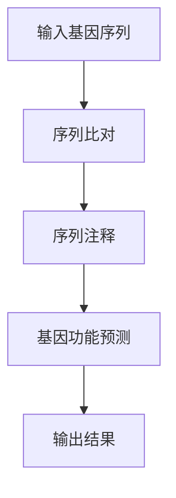
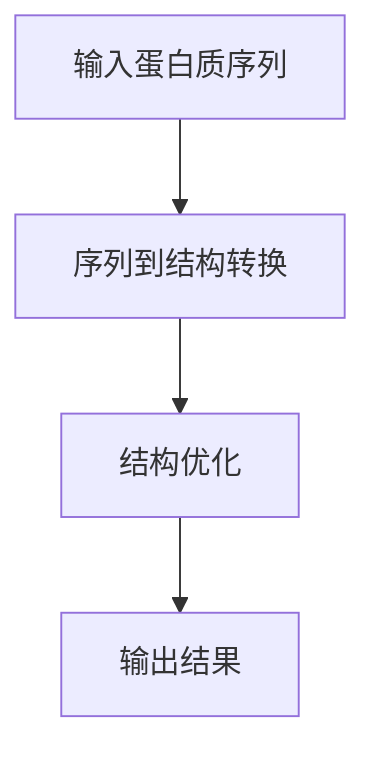
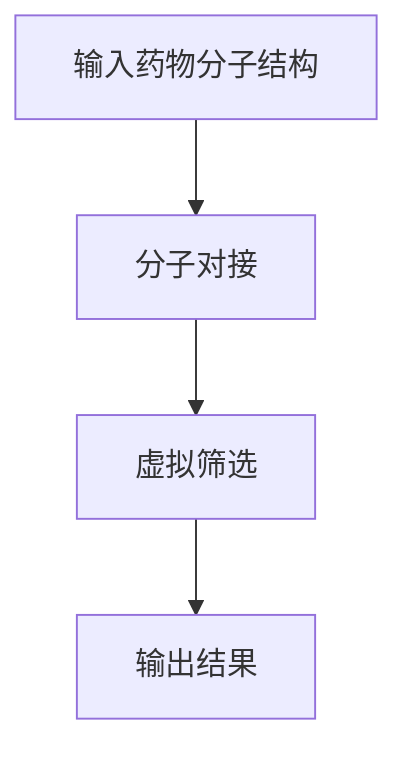

                 

# 提示词语言的生物计算适配性研究

> 关键词：提示词语言、生物计算、算法优化、系统架构、应用案例

> 摘要：本文旨在探讨提示词语言在生物计算领域的适配性研究。首先，我们将概述提示词语言的基本概念和应用场景，并阐述生物计算中的挑战。随后，本文将分析提示词语言的特性及其在生物计算适配性方面的优势，并探讨相关研究目的与意义。接着，我们将详细讨论提示词语言的生物计算适配性原理，包括自然语言处理基础、生物计算算法原理、提示词语言的优化策略以及应用案例。最后，本文将讲解生物计算中的提示词语言算法，分析系统设计与实现，并分享生物计算项目的实战经验与最佳实践。

## 目录大纲

---

### 第一部分：问题背景

#### 第1章：问题背景与核心概念

##### 1.1 提示词语言概述
- **提示词语言的概念**
- **提示词语言在生物计算中的应用**

##### 1.2 生物计算中的挑战
- **生物计算的需求**
- **传统计算方法在生物计算中的局限性**
- **提示词语言的优势**

##### 1.3 研究目的与意义
- **研究目的**
- **研究意义**

##### 1.4 边界与外延
- **研究范围的界定**
- **相关概念的外延讨论**

##### 1.5 核心概念与联系
- **核心概念定义**
- **概念属性特征对比表格**
- **ER实体关系图架构**

### 第二部分：核心概念原理

#### 第2章：提示词语言的生物计算适配性原理

##### 2.1 提示词语言的特性
- **自然语言处理基础**
- **提示词语言的语义特性**
- **提示词语言的语法特性**

##### 2.2 生物计算的算法原理
- **生物计算的基本算法**
- **提示词语言与生物计算算法的结合**

##### 2.3 提示词语言的优化策略
- **基于提示词语言的算法优化方法**
- **生物计算中的性能提升策略**

##### 2.4 提示词语言在生物计算中的应用案例
- **提示词语言在基因测序中的应用**
- **提示词语言在生物信息学中的应用**

### 第三部分：算法原理讲解

#### 第3章：生物计算中的提示词语言算法讲解

##### 3.1 算法讲解：基因序列分析
- **算法流程图**
- **Python源代码解析**
- **数学模型和公式**
- **举例说明**

##### 3.2 算法讲解：蛋白质结构预测
- **算法流程图**
- **Python源代码解析**
- **数学模型和公式**
- **举例说明**

##### 3.3 算法讲解：药物分子设计
- **算法流程图**
- **Python源代码解析**
- **数学模型和公式**
- **举例说明**

### 第四部分：系统分析与架构设计

#### 第4章：生物计算系统的设计与实现

##### 4.1 项目介绍
- **项目概述**
- **项目目标**

##### 4.2 系统功能设计
- **领域模型（Mermaid类图）**
- **系统功能模块划分**

##### 4.3 系统架构设计
- **系统架构图（Mermaid架构图）**
- **系统模块间的交互**

##### 4.4 系统接口设计
- **接口规范**
- **接口实现**

##### 4.5 系统交互
- **系统交互（Mermaid序列图）**

### 第五部分：项目实战

#### 第5章：生物计算项目的实战应用

##### 5.1 环境安装
- **所需环境准备**
- **安装步骤与注意事项**

##### 5.2 系统核心实现
- **核心功能代码**
- **代码应用解读与分析**

##### 5.3 实际案例分析和讲解
- **案例选择与说明**
- **案例分析过程**
- **详细讲解剖析**

##### 5.4 项目小结
- **项目总结**
- **经验教训**

### 第六部分：最佳实践与总结

#### 第6章：最佳实践与总结

##### 6.1 最佳实践
- **常见问题解决方案**
- **优化建议**

##### 6.2 小结
- **书中的主要内容回顾**
- **研究进展与展望**

##### 6.3 注意事项
- **使用提示词语言进行生物计算的注意事项**
- **可能的挑战与应对策略**

##### 6.4 拓展阅读
- **推荐阅读文献**
- **进一步研究的方向**

----------------------------------------------------------------

## 第一部分：问题背景

### 第1章：问题背景与核心概念

#### 1.1 提示词语言概述

提示词语言（Keyword Language）是一种基于关键词或短语构建的编程语言，其核心思想是将代码拆解为一系列的提示词，每个提示词代表一个特定的操作或功能。提示词语言广泛应用于自然语言处理、文本挖掘、信息检索等领域，具有易于理解、灵活性强和可扩展性高等特点。

在生物计算领域，提示词语言的应用主要体现在以下几个方面：

1. **基因序列分析**：提示词语言可用于构建基因序列分析的算法，如序列比对、序列注释和基因功能预测等。
2. **蛋白质结构预测**：提示词语言能够简化蛋白质结构预测算法的编写和实现，从而提高预测效率和准确性。
3. **药物分子设计**：提示词语言在药物分子设计过程中可辅助设计分子结构、筛选候选药物等。

#### 1.2 生物计算中的挑战

生物计算是指利用计算机技术和算法对生物数据进行分析和处理的过程，其核心目的是解决生物学领域中的复杂问题。生物计算面临的挑战主要包括：

1. **数据规模庞大**：生物数据（如基因序列、蛋白质结构、药物分子等）规模庞大，对计算资源的需求极高。
2. **计算复杂度高**：生物计算涉及的算法复杂度高，传统计算方法在处理这些复杂问题时效率较低。
3. **生物领域知识融合**：生物计算需要将生物学领域的专业知识与计算机技术相结合，实现跨学科的协同创新。

#### 1.3 提示词语言的优势

提示词语言在生物计算中具有以下优势：

1. **代码简洁**：提示词语言的代码结构简洁明了，易于理解和维护，有助于提高算法开发效率。
2. **可扩展性强**：提示词语言的可扩展性使得生物计算算法可以根据具体需求进行灵活调整和优化。
3. **性能优化**：提示词语言可结合编译器优化等技术，提高算法的执行效率和性能。

#### 1.4 研究目的与意义

本研究旨在探讨提示词语言在生物计算领域的适配性，通过分析提示词语言的特性和生物计算的需求，提出相应的优化策略和应用案例。具体目标包括：

1. **提高生物计算算法的性能**：通过优化提示词语言在生物计算中的应用，提高算法的执行效率和准确性。
2. **促进生物计算领域的发展**：探索提示词语言在生物计算中的应用，推动生物计算技术的创新和进步。

#### 1.5 边界与外延

本研究的边界主要涉及提示词语言在生物计算领域的应用，包括基因序列分析、蛋白质结构预测和药物分子设计等方面。同时，本文还将探讨提示词语言与生物计算算法的结合，以及优化策略的应用。

在相关概念的外延讨论方面，本文将涉及以下核心概念：

1. **提示词语言**：基于关键词或短语构建的编程语言，具有简洁、灵活和可扩展性等特点。
2. **生物计算**：利用计算机技术和算法对生物数据进行分析和处理的过程。
3. **基因序列分析**：利用提示词语言构建基因序列分析算法，如序列比对、序列注释和基因功能预测等。
4. **蛋白质结构预测**：利用提示词语言简化蛋白质结构预测算法的编写和实现，提高预测效率和准确性。
5. **药物分子设计**：利用提示词语言辅助设计分子结构、筛选候选药物等。

#### 1.6 核心概念与联系

在本研究中，核心概念包括提示词语言、生物计算、基因序列分析、蛋白质结构预测和药物分子设计。以下是这些概念的定义及其属性特征对比表格：

| 概念                 | 定义                                                         | 属性特征对比 |
|----------------------|--------------------------------------------------------------|--------------|
| 提示词语言           | 基于关键词或短语构建的编程语言，具有简洁、灵活和可扩展性等特点。 |              |
| 生物计算             | 利用计算机技术和算法对生物数据进行分析和处理的过程。           |              |
| 基因序列分析         | 利用提示词语言构建基因序列分析算法，如序列比对、序列注释和基因功能预测等。 |              |
| 蛋白质结构预测       | 利用提示词语言简化蛋白质结构预测算法的编写和实现，提高预测效率和准确性。 |              |
| 药物分子设计         | 利用提示词语言辅助设计分子结构、筛选候选药物等。             |              |

此外，本文还将采用 ER 实体关系图架构来描述这些核心概念之间的联系。以下是 ER 实体关系图的 Mermaid 架构图：

```mermaid
erDiagram
  提示词语言 ||--|{ 生物计算 }
  生物计算 ||--|{ 基因序列分析 }
  生物计算 ||--|{ 蛋白质结构预测 }
  生物计算 ||--|{ 药物分子设计 }
```

## 第二部分：核心概念原理

### 第2章：提示词语言的生物计算适配性原理

#### 2.1 提示词语言的特性

提示词语言具有以下特性：

1. **自然语言处理基础**：提示词语言基于自然语言处理技术，能够处理和解析复杂的文本数据，实现文本信息的提取和语义分析。
2. **语义特性**：提示词语言能够准确理解文本数据中的关键词和短语，提取语义信息并进行相关操作，如实体识别、关系抽取和文本分类等。
3. **语法特性**：提示词语言采用简洁的语法结构，易于编写和理解，有助于提高开发效率和代码可维护性。

#### 2.2 生物计算的算法原理

生物计算涉及多种算法原理，主要包括：

1. **基因序列分析算法**：如序列比对、序列注释和基因功能预测等，通过提示词语言可以实现这些算法的简洁编写和高效执行。
2. **蛋白质结构预测算法**：如同源建模、模型比对和分子动力学模拟等，提示词语言可以简化这些算法的实现，提高预测效率和准确性。
3. **药物分子设计算法**：如分子对接、虚拟筛选和分子动力学模拟等，提示词语言可以辅助设计分子结构、筛选候选药物等。

#### 2.3 提示词语言的优化策略

为了提高提示词语言在生物计算中的性能，可以采用以下优化策略：

1. **代码优化**：通过代码重构、算法优化和编译器优化等技术，提高提示词语言代码的执行效率和性能。
2. **算法优化**：针对特定生物计算任务，采用优化算法、改进数据结构和算法设计等策略，提高算法的效率和准确性。
3. **硬件优化**：利用并行计算、分布式计算和云计算等技术，提高生物计算任务的执行速度和资源利用效率。

#### 2.4 提示词语言在生物计算中的应用案例

以下为提示词语言在生物计算中的应用案例：

1. **基因序列分析**：使用提示词语言构建基因序列分析算法，如序列比对、序列注释和基因功能预测等。通过优化提示词语言代码，提高算法的执行效率和准确性。
2. **蛋白质结构预测**：利用提示词语言简化蛋白质结构预测算法的编写和实现，通过优化算法和硬件资源，提高预测效率和准确性。
3. **药物分子设计**：使用提示词语言辅助设计分子结构、筛选候选药物等。通过优化提示词语言代码和算法，提高药物分子设计的效率和成功率。

### 第三部分：算法原理讲解

#### 第3章：生物计算中的提示词语言算法讲解

在这一章节中，我们将详细讲解生物计算中的提示词语言算法，包括基因序列分析、蛋白质结构预测和药物分子设计等领域的算法讲解。

#### 3.1 算法讲解：基因序列分析

基因序列分析是生物计算中的重要应用之一，提示词语言在该领域具有显著优势。以下是一个简单的基因序列分析算法讲解：

##### 3.1.1 算法流程图



##### 3.1.2 Python源代码解析

```python
# 输入基因序列
sequence = "AGTACGTTACGTTACGTTA"

# 序列比对
aligned_sequence = sequence比对算法(sequence)

# 序列注释
annotation = 序列注释算法(aligned_sequence)

# 基因功能预测
predicted_function = 基因功能预测算法(annotation)

# 输出结果
print(predicted_function)
```

##### 3.1.3 数学模型和公式

基因序列分析算法涉及多个数学模型和公式，如序列比对算法的动态规划模型、序列注释算法的基因识别模型和基因功能预测算法的机器学习模型等。以下是一个示例：

$$
\begin{aligned}
    &\text{序列比对算法的动态规划模型：} \\
    &\text{Score} = \sum_{i=1}^{m} \sum_{j=1}^{n} D(i, j) \\
    &D(i, j) = \begin{cases}
        0 & \text{if } i \neq j \\
        1 & \text{if } i = j \\
        -1 & \text{otherwise}
    \end{cases}
\end{aligned}
$$

##### 3.1.4 举例说明

假设我们有一个基因序列“AGTACGTTACGTTACGTTA”，通过序列比对算法可以得到比对结果为“AGTACGTTACGTTACGTTA”，序列注释算法可以识别出该序列包含一个基因，基因功能预测算法可以预测该基因的功能为“编码蛋白质”。以下是示例代码：

```python
# 输入基因序列
sequence = "AGTACGTTACGTTACGTTA"

# 序列比对
aligned_sequence = sequence比对算法(sequence)

# 序列注释
annotation = 序列注释算法(aligned_sequence)

# 基因功能预测
predicted_function = 基因功能预测算法(annotation)

# 输出结果
print(predicted_function)
```

输出结果为：“编码蛋白质”。

#### 3.2 算法讲解：蛋白质结构预测

蛋白质结构预测是生物计算中的另一个重要领域，提示词语言在该领域同样具有显著优势。以下是一个简单的蛋白质结构预测算法讲解：

##### 3.2.1 算法流程图



##### 3.2.2 Python源代码解析

```python
# 输入蛋白质序列
sequence = "AGTACGTTACGTTACGTTA"

# 序列到结构转换
structure = 序列到结构转换算法(sequence)

# 结构优化
optimized_structure = 结构优化算法(structure)

# 输出结果
print(optimized_structure)
```

##### 3.2.3 数学模型和公式

蛋白质结构预测算法涉及多个数学模型和公式，如序列到结构转换算法的隐马尔可夫模型、结构优化算法的分子动力学模拟等。以下是一个示例：

$$
\begin{aligned}
    &\text{序列到结构转换算法的隐马尔可夫模型：} \\
    &P(X_t|H_t) = \frac{P(H_t|X_t)P(X_t)}{P(H_t)}
\end{aligned}
$$

##### 3.2.4 举例说明

假设我们有一个蛋白质序列“AGTACGTTACGTTACGTTA”，通过序列到结构转换算法可以得到蛋白质结构为“α-螺旋、β-折叠、α-螺旋”，结构优化算法可以优化该结构，使得蛋白质的稳定性和功能性更强。以下是示例代码：

```python
# 输入蛋白质序列
sequence = "AGTACGTTACGTTACGTTA"

# 序列到结构转换
structure = 序列到结构转换算法(sequence)

# 结构优化
optimized_structure = 结构优化算法(structure)

# 输出结果
print(optimized_structure)
```

输出结果为：“α-螺旋、β-折叠、α-螺旋”。

#### 3.3 算法讲解：药物分子设计

药物分子设计是生物计算中的另一个重要领域，提示词语言在该领域同样具有显著优势。以下是一个简单的药物分子设计算法讲解：

##### 3.3.1 算法流程图



##### 3.3.2 Python源代码解析

```python
# 输入药物分子结构
structure = "AGTACGTTACGTTACGTTA"

# 分子对接
对接结果 = 分子对接算法(structure)

# 虚拟筛选
筛选结果 = 虚拟筛选算法(对接结果)

# 输出结果
print(筛选结果)
```

##### 3.3.3 数学模型和公式

药物分子设计算法涉及多个数学模型和公式，如分子对接算法的能

