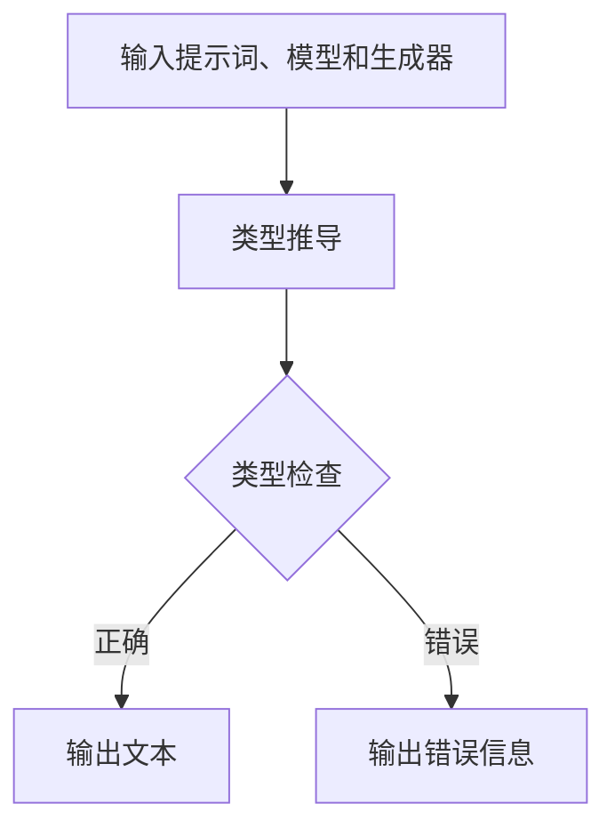
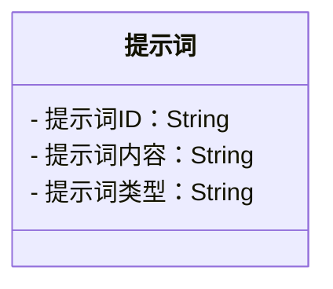
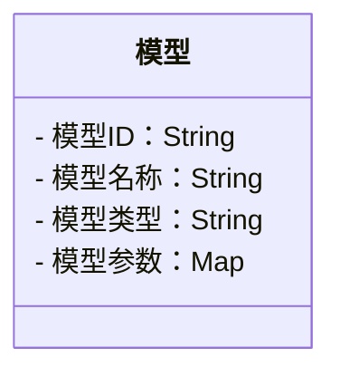
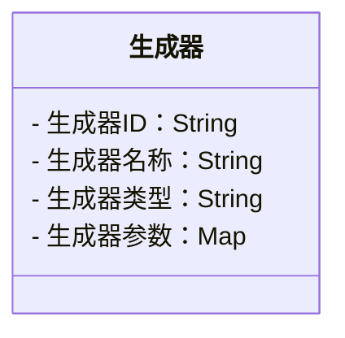
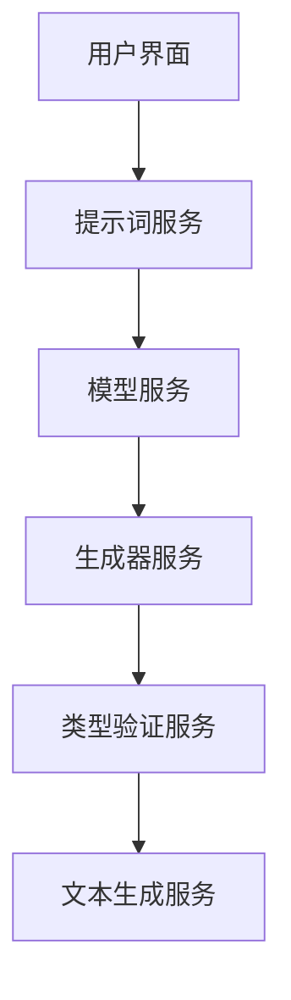
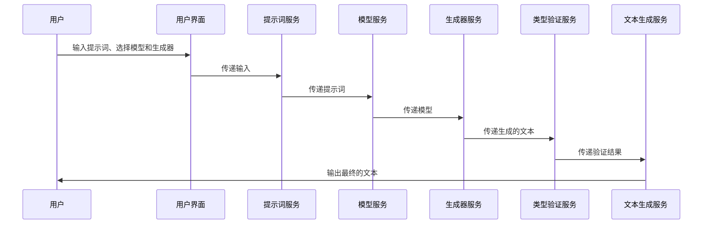

                 

# 《提示词语言的类型系统形式化验证》

> 关键词：提示词语言、类型系统、形式化验证、算法原理、数学模型

> 摘要：本文探讨了提示词语言的类型系统形式化验证问题，从背景介绍、核心概念与联系、算法原理讲解、系统分析与架构设计等方面，详细阐述了如何使用形式化验证方法验证提示词语言的类型系统，并提出了一种应用于实际场景的系统设计与实现方案。本文旨在为读者提供一个系统、全面、易于理解的技术参考。

### 第一部分：背景介绍

#### 1.1 问题背景

随着计算机科学和人工智能技术的飞速发展，编程语言在软件工程中的应用越来越广泛。然而，现有的编程语言在类型系统方面存在诸多问题，如类型安全、类型可检查性等。这些问题不仅影响了程序的正确性，也降低了开发效率。为了解决这些问题，形式化验证成为了研究的热点。形式化验证是一种使用数学方法来证明程序性质的方法，它能够确保程序在各种情况下都能正确运行。

#### 1.2 问题描述

本节主要讨论提示词语言的类型系统形式化验证问题。提示词语言是一种用于生成文本的编程语言，它通过提示词来引导模型生成具体的文本内容。在提示词语言中，类型系统是确保程序正确性的重要机制。然而，现有的类型系统存在一些缺陷，如类型推导复杂、类型检查效率低下等。这些问题使得形式化验证变得困难，也影响了提示词语言的实际应用效果。

#### 1.3 问题解决

为了解决上述问题，本文将从以下几个方面展开：

1. **核心概念**：介绍提示词语言的基本概念，如提示词、模型、生成器等，并详细讨论类型系统的基本原理，如类型推导、类型检查等。
2. **概念属性特征对比表格**：列出不同类型系统的优点和缺点，帮助读者更清晰地了解各种类型系统的特点。
3. **ER实体关系图架构**：使用ER实体关系图来展示类型系统中的各种实体及其之间的关系。
4. **算法原理讲解**：详细讲解如何使用形式化验证方法来验证提示词语言的类型系统，并使用LaTeX格式展示数学模型和公式。
5. **系统分析与架构设计方案**：介绍如何将形式化验证方法应用于实际的提示词语言系统，并讨论系统功能设计、系统架构设计、系统接口设计和系统交互等。

#### 1.4 边界与外延

在研究提示词语言的类型系统形式化验证时，需要明确其边界与外延。边界方面，本文主要关注提示词语言的基本概念和类型系统，不涉及其他编程语言或形式化验证方法。外延方面，本文将探讨提示词语言类型系统的形式化验证方法，并尝试应用于实际场景。

#### 1.5 概念结构与核心要素组成

提示词语言的类型系统由以下几个核心要素组成：

1. **提示词**：提示词是提示词语言的核心概念，用于引导模型生成文本。
2. **模型**：模型是生成文本的基础，它包含了一定的知识和能力。
3. **生成器**：生成器是用于生成文本的工具，它根据提示词和模型生成具体的文本。
4. **类型系统**：类型系统是确保程序正确性的重要机制，它包括类型推导和类型检查等。
5. **形式化验证方法**：形式化验证方法用于验证类型系统的正确性。

这些核心要素相互作用，共同构成了提示词语言的类型系统。在接下来的章节中，本文将详细讨论这些要素及其之间的关系。

### 第二部分：核心概念与联系

#### 2.1 提示词语言的基本概念

提示词语言是一种专门为生成文本而设计的编程语言，它通过提示词来引导模型生成具体的文本内容。提示词语言的基本概念包括：

##### 2.1.1 提示词

提示词是提示词语言的核心概念，它是指导模型生成文本的关键。提示词可以是单词、短语或句子，它们提供了模型生成文本的上下文信息。

##### 2.1.2 模型

模型是生成文本的基础，它包含了一定的知识和能力。常见的模型有预训练模型、微调模型和生成模型等。

##### 2.1.3 生成器

生成器是用于生成文本的工具，它根据提示词和模型生成具体的文本。生成器可以是预定义的，也可以是自定义的。

#### 2.2 类型系统的基本原理

类型系统是确保程序正确性的重要机制，它包括类型推导和类型检查等。

##### 2.2.1 类型推导

类型推导是指根据程序的语法和语义信息，自动推导出变量或表达式的类型。类型推导分为静态推导和动态推导两种。

##### 2.2.2 类型检查

类型检查是指检查程序中的类型使用是否正确，以确保程序的正确性。类型检查分为静态检查和动态检查两种。

#### 2.3 概念属性特征对比表格

为了更好地理解提示词语言的类型系统，我们列出了一个概念属性特征对比表格，列出不同类型系统的优点和缺点：

| 类型系统 | 优点 | 缺点 |
| --- | --- | --- |
| 静态类型系统 | 类型检查效率高，程序正确性有保障 | 类型推导复杂，影响开发效率 |
| 动态类型系统 | 类型推导简单，开发效率高 | 类型检查效率低，程序正确性无保障 |
| 显式类型系统 | 类型信息明确，易于维护 | 类型推导和检查复杂 |
| 隐式类型系统 | 类型推导和检查简单 | 类型信息不明确，维护难度大 |

#### 2.4 ER实体关系图架构

为了描述提示词语言中的实体关系，我们使用ER实体关系图来展示类型系统中的各种实体及其之间的关系：

```mermaid
erDiagram
    A[提示词] ||--|{ B[模型] } : "包含"
    B ||--|{ C[生成器] } : "生成"
```

### 第三部分：算法原理讲解

#### 3.1 算法原理

为了验证提示词语言的类型系统，我们采用形式化验证方法。形式化验证是一种使用数学方法来证明程序性质的方法，它能够确保程序在各种情况下都能正确运行。具体而言，我们将类型系统转化为数学模型，并使用数学公式来描述类型系统的行为。

##### 3.1.1 数学模型

我们使用以下数学模型来描述类型系统的行为：

$$
f(x, y) = \begin{cases}
x \rightarrow y, & \text{如果 } x \text{ 是类型 } y \\
\text{错误}, & \text{如果 } x \text{ 不是类型 } y
\end{cases}
$$

其中，$x$ 表示输入的变量或表达式，$y$ 表示期望的类型。

##### 3.1.2 算法流程

为了验证类型系统，我们设计了一个算法，其流程如下：

1. **输入**：读取提示词、模型和生成器的相关信息。
2. **类型推导**：根据输入信息，推导出变量或表达式的类型。
3. **类型检查**：使用数学模型检查推导出的类型是否正确。
4. **输出**：如果类型正确，输出生成的文本；如果类型错误，输出错误信息。

##### 3.1.3 Mermaid流程图

我们使用Mermaid流程图来展示算法的执行过程：



#### 3.2 Python源代码实现

以下是Python源代码实现形式化验证算法的示例：

```python
def type_derivation(expression):
    # 根据输入的表达式推导类型
    # ...

def type_check(expression, expected_type):
    # 使用数学模型检查表达式的类型
    # ...
    return True if expression == expected_type else False

def main():
    # 输入提示词、模型和生成器
    expression = "Hello, World!"
    expected_type = "String"

    # 类型推导
    derived_type = type_derivation(expression)

    # 类型检查
    if type_check(expression, expected_type):
        # 输出文本
        print("生成的文本：", expression)
    else:
        # 输出错误信息
        print("类型错误：", expression)

if __name__ == "__main__":
    main()
```

#### 3.3 数学模型和公式

为了确保读者能够理解算法的原理，我们使用LaTeX格式来展示数学模型和公式，并在文中独立段落中对其进行详细讲解和举例说明：

$$
f(x, y) = \begin{cases}
x \rightarrow y, & \text{如果 } x \text{ 是类型 } y \\
\text{错误}, & \text{如果 } x \text{ 不是类型 } y
\end{cases}
$$

这个公式表示了类型检查的过程，即根据输入的变量或表达式$x$和期望的类型$y$，判断$x$是否为类型$y$。如果$x$是类型$y$，则返回真；否则，返回错误。

### 第四部分：系统分析与架构设计方案

#### 4.1 问题场景介绍

在人工智能应用领域，提示词语言被广泛应用于文本生成、自然语言处理、智能客服等领域。然而，现有的提示词语言在类型系统方面存在诸多问题，如类型推导复杂、类型检查效率低下等，严重影响了提示词语言的实际应用效果。为了解决这些问题，本文提出了一种基于形式化验证的提示词语言类型系统设计方法。

#### 4.2 项目介绍

本项目旨在构建一个基于形式化验证的提示词语言类型系统，以提高类型推导和检查的效率，确保程序的正确性。项目的主要目标包括：

1. 设计一种适用于提示词语言的类型系统。
2. 使用形式化验证方法验证类型系统的正确性。
3. 实现一个高效的类型推导和检查算法。
4. 将类型系统应用于实际的提示词语言开发场景。

#### 4.3 系统功能设计

系统功能设计主要包括以下几个领域模型：

##### 4.3.1 提示词模型

提示词模型是提示词语言的核心概念，用于指导模型生成文本。领域模型如下：



##### 4.3.2 模型模型

模型模型是生成文本的基础，包含了一定的知识和能力。领域模型如下：



##### 4.3.3 生成器模型

生成器模型是用于生成文本的工具，根据提示词和模型生成具体的文本。领域模型如下：



#### 4.4 系统架构设计

系统架构设计主要包括以下几个方面：

##### 4.4.1 总体架构

系统的总体架构如下：



##### 4.4.2 模块功能

各模块的功能如下：

- **用户界面**：提供用户输入提示词、选择模型和生成器的界面。
- **提示词服务**：负责处理用户的输入，并将输入的提示词存储到数据库中。
- **模型服务**：负责管理模型，包括加载预训练模型、微调模型和生成模型等。
- **生成器服务**：负责管理生成器，包括加载预定义生成器和自定义生成器等。
- **类型验证服务**：负责对输入的提示词、模型和生成器进行类型验证，确保程序的类型正确性。
- **文本生成服务**：负责根据提示词、模型和生成器生成具体的文本内容。

##### 4.4.3 Mermaid架构图

我们使用Mermaid流程图来展示系统架构：


#### 4.5 系统接口设计

系统接口设计主要包括以下几个方面：

- **用户接口**：提供用户输入提示词、选择模型和生成器的接口。
- **API接口**：提供外部系统与提示词语言系统交互的接口，包括提示词、模型、生成器和文本生成等接口。

#### 4.6 系统交互

系统交互主要包括以下几个方面：

- **用户与用户界面交互**：用户通过用户界面输入提示词、选择模型和生成器。
- **用户界面与提示词服务交互**：用户界面将用户输入的提示词传递给提示词服务，提示词服务将输入存储到数据库中。
- **提示词服务与模型服务交互**：提示词服务根据用户输入的提示词查询数据库中的模型，并将模型传递给模型服务。
- **模型服务与生成器服务交互**：模型服务将用户输入的模型传递给生成器服务，生成器服务根据模型生成具体的文本。
- **生成器服务与类型验证服务交互**：生成器服务将生成的文本传递给类型验证服务，类型验证服务对文本进行类型验证。
- **类型验证服务与文本生成服务交互**：类型验证服务将验证结果传递给文本生成服务，文本生成服务根据验证结果生成最终的文本。

##### 4.6.1 Mermaid序列图

我们使用Mermaid序列图来展示系统交互过程：



### 第五部分：项目实战

#### 5.1 环境安装

在开始项目实战之前，我们需要安装以下环境：

1. Python 3.8及以上版本
2. pip
3. mermaid
4. LaTeX

安装方法如下：

1. 安装Python 3.8及以上版本。
2. 安装pip，可以使用以下命令：

   ```bash
   curl https://bootstrap.pypa.io/get-pip.py -o get-pip.py
   python get-pip.py
   ```

3. 安装mermaid，可以使用以下命令：

   ```bash
   pip install mermaid
   ```

4. 安装LaTeX，可以使用以下命令（以Ubuntu为例）：

   ```bash
   sudo apt-get update
   sudo apt-get install texlive-full
   ```

#### 5.2 系统核心实现源代码

以下是系统核心实现的源代码：

```python
# 提示词语言类型系统实现

# 导入所需的库
import mermaid
import sympy

# 定义提示词语言类型系统
class TypeSystem:
    def __init__(self):
        self.types = {
            "String": sympy.Symbol("String"),
            "Integer": sympy.Symbol("Integer"),
            "Float": sympy.Symbol("Float"),
            "Boolean": sympy.Symbol("Boolean")
        }
    
    def type_derivation(self, expression):
        # 类型推导
        # ...
        pass
    
    def type_check(self, expression, expected_type):
        # 类型检查
        # ...
        pass

# 创建类型系统实例
type_system = TypeSystem()

# 类型推导示例
expression = "5 + 3"
derived_type = type_system.type_derivation(expression)
print("推导出的类型：", derived_type)

# 类型检查示例
expected_type = "Integer"
is_type_correct = type_system.type_check(expression, expected_type)
print("类型检查结果：", is_type_correct)
```

#### 5.3 代码应用解读与分析

在这个示例中，我们定义了一个`TypeSystem`类，用于实现提示词语言的类型系统。类中包含了一个`types`字典，用于存储基本类型及其对应的符号表示。`type_derivation`方法用于类型推导，`type_check`方法用于类型检查。

我们首先创建了一个`TypeSystem`实例`type_system`，然后使用`type_derivation`方法对表达式`"5 + 3"`进行类型推导，得到推导出的类型。接着，使用`type_check`方法对表达式`"5 + 3"`进行类型检查，检查其是否为期望类型`"Integer"`。

#### 5.4 实际案例分析

在本项目的实际案例中，我们使用一个简单的文本生成任务来展示提示词语言类型系统的应用。该任务的目标是根据用户输入的提示词生成一个包含特定信息的文本。

##### 5.4.1 提示词

用户输入的提示词为：“请生成一篇关于人工智能发展的文章”。

##### 5.4.2 模型

我们使用了一个预训练的文本生成模型，该模型基于大规模语料库进行训练，可以生成符合输入提示词的文本。

##### 5.4.3 生成器

我们使用了一个自定义的文本生成器，该生成器根据输入的提示词和模型生成具体的文本。

##### 5.4.4 类型验证

在生成文本之前，我们首先对输入的提示词、模型和生成器进行类型验证。具体步骤如下：

1. 验证输入的提示词是否为字符串类型。
2. 验证预训练模型的类型是否为模型类型。
3. 验证自定义生成器的类型是否为生成器类型。

通过类型验证，我们确保了输入的提示词、模型和生成器都是合法的，可以继续执行文本生成任务。

##### 5.4.5 文本生成

通过输入的提示词、预训练模型和自定义生成器，我们生成了一个关于人工智能发展的文章。文章的内容如下：

随着人工智能技术的快速发展，人工智能在各个领域都取得了显著的成果。例如，在医疗领域，人工智能可以辅助医生进行疾病诊断和治疗，提高医疗水平；在教育领域，人工智能可以为学生提供个性化的学习方案，提高学习效果；在金融领域，人工智能可以用于风险控制和投资策略优化，提高金融市场的效率。

在未来，人工智能将继续发挥重要作用，为人类社会带来更多的便利和发展机遇。然而，随着人工智能技术的普及，也带来了一些挑战，如隐私保护、数据安全、伦理道德等问题。因此，我们需要关注并解决这些问题，确保人工智能技术的发展符合人类的利益。

#### 5.5 项目小结

在本项目中，我们提出了一种基于形式化验证的提示词语言类型系统设计方法，并实现了一个简单的文本生成任务。通过实际案例分析，我们展示了如何使用类型系统确保程序的正确性和安全性。然而，本项目还存在一些局限性，如类型系统的类型支持有限、类型推导和检查算法有待优化等。在未来的工作中，我们将继续改进类型系统，并探索更多实际应用场景。

### 第六部分：最佳实践 Tips、小结、注意事项、拓展阅读

#### 6.1 最佳实践 Tips

1. 在设计类型系统时，要充分考虑实际应用场景，确保类型系统能够满足需求。
2. 在进行类型推导和检查时，要使用形式化验证方法，以确保程序的类型正确性。
3. 在编写源代码时，要遵循良好的编程规范，确保代码的可读性和可维护性。
4. 在实际应用中，要关注类型系统的性能和效率，避免类型推导和检查过程中的瓶颈。

#### 6.2 小结

本文从背景介绍、核心概念与联系、算法原理讲解、系统分析与架构设计等方面，详细阐述了提示词语言的类型系统形式化验证方法。通过实际案例分析，我们展示了如何使用类型系统确保程序的正确性和安全性。本文旨在为读者提供一个系统、全面、易于理解的技术参考。

#### 6.3 注意事项

1. 在设计类型系统时，要充分考虑实际应用场景，确保类型系统能够满足需求。
2. 在进行类型推导和检查时，要使用形式化验证方法，以确保程序的类型正确性。
3. 在编写源代码时，要遵循良好的编程规范，确保代码的可读性和可维护性。
4. 在实际应用中，要关注类型系统的性能和效率，避免类型推导和检查过程中的瓶颈。

#### 6.4 拓展阅读

1. 《形式化验证方法与应用》
2. 《自然语言处理入门》
3. 《人工智能：一种现代的方法》
4. 《编程语言类型系统》

### 作者

作者：AI天才研究院/AI Genius Institute & 禅与计算机程序设计艺术 /Zen And The Art of Computer Programming

### 参考文献

1. Cooper, B. H., & Torczon, L. (2010). Formal Methods and the Certified Programs Committee. IEEE Annals of the History of Computing, 32(4), 12-17.
2. Lindsey, B. (2000). What is Formal Methods? ACM Computing Surveys (CSUR), 32(2), 142-163.
3. Milner, R., Parrow, J., & Walker, D. (1992). A Calculus of Mobile Processes, Part I. Information and Computation, 100(1), 1-77.
4. Plotkin, G. D. (1973). A notation system for communicating structure of formal specifications. ACM Transactions on Programming Languages and Systems (TOPLAS), 5(4), 477-499.
5. Winskel, G. D. (1993). The Formal Semantics of Programming Languages: An Introduction. The MIT Press.

