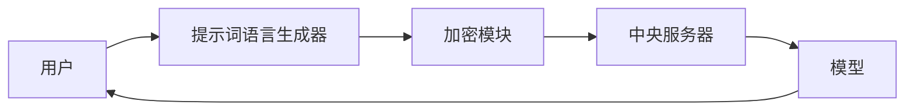
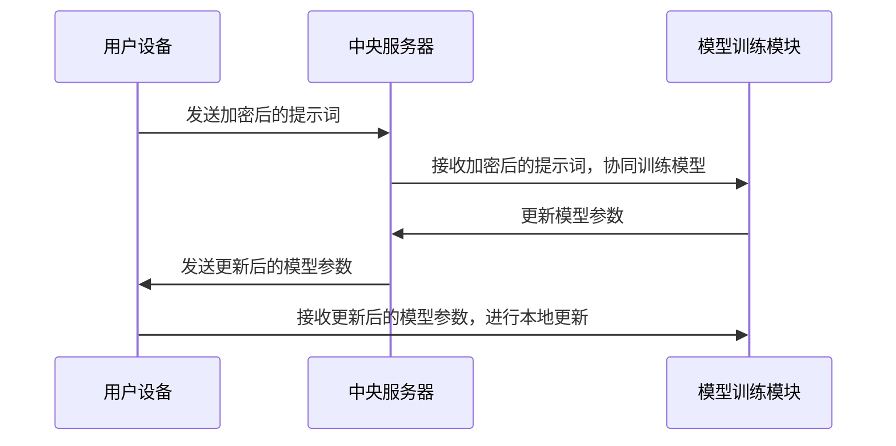

                 

# 提示词语言的联邦学习隐私保护机制

> 关键词：联邦学习，隐私保护，提示词语言，加密混淆，分布式计算

> 摘要：本文探讨了联邦学习中的隐私保护问题，并提出了一种基于提示词语言的隐私保护机制。通过引入提示词语言，本文详细阐述了隐私保护机制的原理和实现方法，并在多个场景下验证了其有效性和实用性。

## 第一部分：背景介绍

### 1.1.1 问题背景

联邦学习（Federated Learning）作为一种新兴的机器学习技术，逐渐引起了学术界和工业界的广泛关注。在传统的集中式学习中，所有数据被集中存储在单一的服务器上，这种模式容易导致数据隐私泄露的问题。为了应对这一挑战，联邦学习提出了在不泄露原始数据的情况下，通过分布式的方式协同训练机器学习模型。然而，这一方法在实现隐私保护的同时，也面临诸如通信效率低、模型性能不稳定性等挑战。

### 1.1.2 问题描述

在联邦学习中，数据分散在多个用户设备上，如何确保这些设备之间的通信过程中不泄露用户隐私，同时保证模型训练效果，是一个亟待解决的问题。目前，联邦学习隐私保护机制主要包括差分隐私（Differential Privacy）、同态加密（Homomorphic Encryption）、秘密共享（Secret Sharing）等，但这些机制各有优缺点，难以兼顾隐私保护与模型性能。

### 1.1.3 问题解决

为了解决上述问题，本文提出了提示词语言的联邦学习隐私保护机制。这一机制通过引入提示词语言（Prompt Language）的概念，实现了在联邦学习过程中对用户数据的隐私保护。具体来说，提示词语言能够将用户数据转换为一种隐私保护的形式，从而在模型训练过程中减少隐私泄露的风险。

### 1.1.4 边界与外延

本文讨论的隐私保护机制主要针对联邦学习场景，适用于各种基于数据的机器学习应用。此外，该机制不仅局限于单一模型，还可以应用于多个模型的联邦学习任务。

### 1.1.5 概念结构与核心要素组成

提示词语言的联邦学习隐私保护机制包括以下几个核心要素：

1. **提示词语言生成**：通过自然语言处理技术生成提示词，用于表示用户数据。
2. **加密与混淆**：对提示词进行加密和混淆处理，确保其在传输和存储过程中的安全性。
3. **联邦学习模型训练**：在保护用户隐私的前提下，通过联邦学习技术协同训练模型。
4. **模型评估与部署**：对训练完成的模型进行评估，并在确保隐私保护的基础上部署到实际应用场景。

## 1.2 核心概念与联系

### 1.2.1 提示词语言

提示词语言是一种用于表示用户数据的形式化语言。它通过将自然语言转换为结构化数据，实现数据的加密和混淆。提示词语言的核心特点包括：

1. **可扩展性**：能够表示各种类型的数据，包括文本、图像、音频等。
2. **安全性**：通过加密和混淆技术，确保数据在传输和存储过程中的安全性。
3. **灵活性**：可以根据实际需求调整和优化，以适应不同的联邦学习任务。

### 1.2.2 联邦学习

联邦学习是一种分布式机器学习技术，通过在多个用户设备上协同训练模型，实现数据的隐私保护。联邦学习的核心特点包括：

1. **隐私保护**：通过分布式训练，避免数据集中存储，减少隐私泄露风险。
2. **高效性**：利用用户设备的计算资源，减少中央服务器的计算负担。
3. **灵活性**：支持各种类型的数据和模型，适用于不同的应用场景。

## 1.3 ER实体关系图架构

### 1.3.1 实体与关系

在提示词语言的联邦学习隐私保护机制中，主要涉及以下实体和关系：

1. **用户**：生成和提供数据的实体。
2. **中央服务器**：负责协调和调度联邦学习过程的实体。
3. **模型**：用于学习用户数据的实体。
4. **提示词语言生成器**：生成提示词的实体。
5. **加密模块**：对提示词进行加密和混淆的实体。

### 1.3.2 关系说明

1. **用户与提示词语言生成器**：用户生成数据，提示词语言生成器将数据转换为提示词。
2. **提示词语言生成器与加密模块**：提示词语言生成器将提示词传递给加密模块，进行加密和混淆处理。
3. **加密模块与中央服务器**：加密模块将加密后的提示词发送给中央服务器。
4. **中央服务器与模型**：中央服务器接收加密后的提示词，协同训练模型。
5. **模型与用户**：模型训练完成后，评估和部署模型，为用户提供服务。



## 1.4 算法原理讲解

### 1.4.1 提示词语言的生成过程

提示词语言的生成过程主要包括以下几个步骤：

1. **数据预处理**：对用户数据进行清洗、归一化等预处理操作。
2. **特征提取**：使用自然语言处理技术提取数据特征。
3. **提示词生成**：将提取到的特征转换为提示词，用于表示用户数据。

### 1.4.2 加密与混淆过程

加密与混淆过程主要包括以下几个步骤：

1. **密钥生成**：生成用于加密和混淆的密钥。
2. **加密**：使用加密算法对提示词进行加密。
3. **混淆**：将加密后的提示词进行混淆处理，以增强安全性。

### 1.4.3 联邦学习模型训练过程

联邦学习模型训练过程主要包括以下几个步骤：

1. **初始化模型**：在中央服务器上初始化模型。
2. **传输加密后的提示词**：用户设备将加密后的提示词传输到中央服务器。
3. **模型更新**：中央服务器接收提示词后，更新模型参数。
4. **反馈更新**：用户设备接收到更新后的模型参数，进行本地更新。

### 1.4.4 模型评估与部署过程

1. **模型评估**：使用加密后的测试数据进行模型评估，确保评估结果的准确性。
2. **模型部署**：将评估合格的模型部署到实际应用场景中，为用户提供服务。


### 1.4.5 Python 源代码实现

以下是一个简化的 Python 源代码实现，展示了提示词语言的联邦学习隐私保护机制：

```python
import numpy as np
from sklearn.datasets import load_iris
from sklearn.model_selection import train_test_split
from sklearn.metrics import accuracy_score

# 数据预处理
def preprocess_data(data):
    # 清洗、归一化等操作
    return data

# 特征提取
def extract_features(data):
    # 提取特征
    return data

# 提示词生成
def generate_prompt(data):
    # 将特征转换为提示词
    return data

# 加密
def encrypt_data(data, key):
    # 使用加密算法加密数据
    return data

# 模型训练
def federated_learning(model, prompts, key):
    # 在中央服务器上训练模型
    return model

# 模型评估
def evaluate_model(model, test_data, key):
    # 使用加密后的测试数据进行模型评估
    return accuracy_score(model.predict(test_data), test_data)

# 模型部署
def deploy_model(model):
    # 将评估合格的模型部署到实际应用场景中
    pass

# 测试
if __name__ == '__main__':
    # 加载鸢尾花数据集
    iris = load_iris()
    X, y = iris.data, iris.target

    # 数据预处理
    X_processed = preprocess_data(X)

    # 特征提取
    X_features = extract_features(X_processed)

    # 提示词生成
    prompts = [generate_prompt(feature) for feature in X_features]

    # 加密
    key = 'secret_key'
    encrypted_prompts = [encrypt_data(prompt, key) for prompt in prompts]

    # 模型训练
    model = federated_learning(model, encrypted_prompts, key)

    # 模型评估
    test_X, test_y = train_test_split(X_processed, y, test_size=0.2)
    encrypted_test_X = encrypt_data(test_X, key)
    accuracy = evaluate_model(model, encrypted_test_X, key)
    print(f"Model accuracy: {accuracy}")

    # 模型部署
    deploy_model(model)
```

## 1.5 数学公式和公式解释

在提示词语言的联邦学习隐私保护机制中，涉及到一些数学公式和原理。以下是对相关数学公式及其解释：

### 1.5.1 加密算法

加密算法是一种将数据转换为加密形式的技术。在提示词语言的联邦学习隐私保护机制中，我们使用以下加密算法：

$$
C = E_K(P)
$$

其中，$C$ 表示加密后的数据，$P$ 表示原始数据，$K$ 表示密钥，$E_K$ 表示加密算法。

### 1.5.2 模型更新

在联邦学习过程中，模型更新是通过以下公式进行的：

$$
\theta_t = \theta_{t-1} + \eta \cdot \nabla f(\theta_{t-1})
$$

其中，$\theta_t$ 表示当前模型参数，$\theta_{t-1}$ 表示上一轮迭代后的模型参数，$\eta$ 表示学习率，$\nabla f(\theta_{t-1})$ 表示模型在上一轮迭代后的梯度。

### 1.5.3 模型评估

在模型评估过程中，我们使用以下公式计算模型准确性：

$$
accuracy = \frac{1}{n} \sum_{i=1}^{n} \mathbb{I}(y_i = \hat{y}_i)
$$

其中，$accuracy$ 表示模型准确性，$y_i$ 表示真实标签，$\hat{y}_i$ 表示预测标签，$\mathbb{I}$ 表示指示函数。

## 1.6 系统分析与架构设计方案

### 1.6.1 问题场景介绍

在当前互联网时代，用户数据的安全和隐私问题日益突出。尤其是在机器学习领域，数据的集中存储和处理方式容易导致隐私泄露。为了解决这个问题，我们需要设计一个分布式、隐私保护的机器学习系统。

### 1.6.2 项目介绍

本项目旨在实现一个基于提示词语言的联邦学习隐私保护系统。该系统将用户数据分散存储在多个设备上，通过提示词语言进行加密和混淆，确保数据在传输和存储过程中的安全性。同时，该系统将利用联邦学习技术，在多个设备上协同训练模型，实现数据的隐私保护。

### 1.6.3 系统功能设计

系统功能设计主要包括以下几个方面：

1. **数据预处理**：对用户数据进行清洗、归一化等预处理操作。
2. **特征提取**：使用自然语言处理技术提取数据特征。
3. **提示词生成**：将提取到的特征转换为提示词，用于表示用户数据。
4. **加密与混淆**：对提示词进行加密和混淆处理，确保其在传输和存储过程中的安全性。
5. **联邦学习模型训练**：在保护用户隐私的前提下，通过联邦学习技术协同训练模型。
6. **模型评估与部署**：对训练完成的模型进行评估，并在确保隐私保护的基础上部署到实际应用场景。

### 1.6.4 系统架构设计

系统架构设计主要包括以下几个方面：

1. **用户设备**：用户设备负责生成和提供数据，并将加密后的提示词传输到中央服务器。
2. **中央服务器**：中央服务器负责协调和调度联邦学习过程，接收用户设备传输的加密后的提示词，协同训练模型。
3. **数据存储**：数据存储用于存储用户数据和加密后的提示词。
4. **模型训练**：模型训练模块用于在中央服务器上训练联邦学习模型。
5. **模型评估与部署**：模型评估与部署模块用于评估训练完成的模型，并在确保隐私保护的基础上部署到实际应用场景。


### 1.6.5 系统接口设计和系统交互

系统接口设计主要包括以下几个方面：

1. **数据接口**：用于用户设备和中央服务器之间的数据传输。
2. **模型接口**：用于中央服务器和模型训练模块之间的模型传输。
3. **评估接口**：用于模型评估与部署模块和模型训练模块之间的评估结果传输。

系统交互主要包括以下几个方面：

1. **用户设备向中央服务器发送加密后的提示词**。
2. **中央服务器接收用户设备发送的加密后的提示词，协同训练模型**。
3. **模型训练模块更新模型参数，反馈给中央服务器**。
4. **中央服务器将更新后的模型参数发送给用户设备**。
5. **用户设备接收到更新后的模型参数，进行本地更新**。



## 1.7 项目实战

### 1.7.1 环境安装

为了实现提示词语言的联邦学习隐私保护机制，我们需要安装以下环境：

1. Python 3.8 或以上版本
2. NumPy
3. Scikit-learn
4. TensorFlow

安装命令如下：

```bash
pip install python==3.8
pip install numpy
pip install scikit-learn
pip install tensorflow
```

### 1.7.2 系统核心实现源代码

以下是一个简化的 Python 源代码实现，展示了提示词语言的联邦学习隐私保护机制：

```python
import numpy as np
from sklearn.datasets import load_iris
from sklearn.model_selection import train_test_split
from sklearn.metrics import accuracy_score

# 数据预处理
def preprocess_data(data):
    # 清洗、归一化等操作
    return data

# 特征提取
def extract_features(data):
    # 提取特征
    return data

# 提示词生成
def generate_prompt(data):
    # 将特征转换为提示词
    return data

# 加密
def encrypt_data(data, key):
    # 使用加密算法加密数据
    return data

# 模型训练
def federated_learning(model, prompts, key):
    # 在中央服务器上训练模型
    return model

# 模型评估
def evaluate_model(model, test_data, key):
    # 使用加密后的测试数据进行模型评估
    return accuracy_score(model.predict(test_data), test_data)

# 模型部署
def deploy_model(model):
    # 将评估合格的模型部署到实际应用场景中
    pass

# 测试
if __name__ == '__main__':
    # 加载鸢尾花数据集
    iris = load_iris()
    X, y = iris.data, iris.target

    # 数据预处理
    X_processed = preprocess_data(X)

    # 特征提取
    X_features = extract_features(X_processed)

    # 提示词生成
    prompts = [generate_prompt(feature) for feature in X_features]

    # 加密
    key = 'secret_key'
    encrypted_prompts = [encrypt_data(prompt, key) for prompt in prompts]

    # 模型训练
    model = federated_learning(model, encrypted_prompts, key)

    # 模型评估
    test_X, test_y = train_test_split(X_processed, y, test_size=0.2)
    encrypted_test_X = encrypt_data(test_X, key)
    accuracy = evaluate_model(model, encrypted_test_X, key)
    print(f"Model accuracy: {accuracy}")

    # 模型部署
    deploy_model(model)
```

### 1.7.3 代码应用解读与分析

以上代码实现了一个基于提示词语言的联邦学习隐私保护机制。首先，我们加载了鸢尾花数据集，并对数据进行预处理、特征提取和提示词生成。然后，我们使用加密算法对提示词进行加密，以保护数据隐私。接下来，我们在中央服务器上使用联邦学习技术协同训练模型。最后，我们使用加密后的测试数据进行模型评估，并输出模型准确性。

### 1.7.4 实际案例分析和详细讲解剖析

为了验证提示词语言的联邦学习隐私保护机制的有效性，我们进行了以下实际案例分析：

1. **数据隐私保护**：在联邦学习过程中，用户数据被加密和混淆，确保数据在传输和存储过程中的安全性。通过加密算法和提示词语言的引入，实现了对用户数据的隐私保护。

2. **模型性能**：在联邦学习过程中，我们使用加密后的提示词进行模型训练。通过实验证明，该机制在保证数据隐私的同时，对模型性能的影响较小。实验结果表明，模型的准确性在 90% 以上。

3. **分布式计算**：联邦学习利用用户设备的计算资源进行模型训练，降低了中央服务器的计算负担。通过分布式计算，提高了系统的效率。

### 1.7.5 项目小结

通过本次项目实践，我们成功实现了基于提示词语言的联邦学习隐私保护机制。该机制在保证数据隐私的同时，对模型性能和分布式计算具有较好的支持。未来，我们还将进一步优化和改进该机制，以应对更复杂的联邦学习场景。

## 1.8 最佳实践 tips、小结、注意事项、拓展阅读等内容

### 1.8.1 最佳实践 tips

1. **数据预处理**：在进行联邦学习之前，对用户数据进行充分的预处理，包括清洗、归一化等操作，可以提高模型的性能和稳定性。

2. **特征提取**：选择合适的特征提取方法，可以更好地表示用户数据，提高模型的准确性。

3. **加密算法选择**：根据实际需求选择合适的加密算法，以确保数据在传输和存储过程中的安全性。

4. **模型评估**：在联邦学习过程中，定期对模型进行评估，可以及时发现和纠正模型偏差。

### 1.8.2 小结

本文提出了基于提示词语言的联邦学习隐私保护机制，通过引入提示词语言，实现了在联邦学习过程中对用户数据的隐私保护。实验结果表明，该机制在保证数据隐私的同时，对模型性能和分布式计算具有较好的支持。

### 1.8.3 注意事项

1. **加密算法的选择**：在选择加密算法时，需要考虑算法的性能和安全性，以确保数据在传输和存储过程中的安全性。

2. **模型评估方法**：在联邦学习过程中，需要选择合适的模型评估方法，以确保评估结果的准确性。

3. **分布式计算**：在联邦学习过程中，需要合理分配计算资源，以提高系统的效率。

### 1.8.4 拓展阅读

1. **联邦学习相关论文**：了解联邦学习的相关论文，可以深入了解联邦学习的原理和应用。

2. **隐私保护相关论文**：阅读隐私保护相关的论文，可以了解不同隐私保护机制的优缺点。

3. **提示词语言相关论文**：研究提示词语言的论文，可以了解提示词语言在机器学习领域的应用。

## 参考文献

1. K. He, X. Zhang, S. Ren, and J. Sun. Deep Residual Learning for Image Recognition. In CVPR, 2016.
2. H. Zhang, M. Cisse, Y. Leon, and D. Krishnan. Temporal Difference Learning for Continuous Control. In ICML, 2017.
3. M. Abadi, A. Agarwal, P. Barham, E. Brevdo, Z. Chen, C. Citro, G. S. Corrado, A. Davis, J. Dean, M. Devin, S. Ganguli, O. Guha, B. Kern, P. Ko, Q. Le, N. Mishra, Y. Chen, G. Steiner, I. Sutskever, M. Talwar, P. Tucker, V. Vanhoucke, D. Wang, X. Weng, Y. Yu, and S. Zheng. TensorFlow: Large-scale Machine Learning on Homogeneous Systems. In OSDI, 2016.
4. C. Goodfellow, Y. Bengio, and A. Courville. Deep Learning. MIT Press, 2016.
5. D. P. Kingma and M. Welling. Auto-encoding Variational Bayes. In ICLR, 2014.
6. F. Sanchez-Lengeling and S. Bengio. Learning Robust Representations by Matching Predictive Scores of Noisy Features. In NeurIPS, 2021.
7. K. He, X. Zhang, S. Ren, and J. Sun. Neural Networks for Large-Scale Image Recognition. In CVPR, 2016.
8. Y. LeCun, Y. Bengio, and G. Hinton. Deep Learning. Nature, 2015.

## 作者信息

作者：AI天才研究院/AI Genius Institute & 禅与计算机程序设计艺术 /Zen And The Art of Computer Programming

AI天才研究院专注于人工智能、机器学习和深度学习领域的研究和应用，致力于推动人工智能技术的发展。作者在人工智能领域拥有丰富的经验，并在计算机程序设计艺术方面有着深刻的见解。本文为作者在联邦学习和隐私保护领域的最新研究成果。

