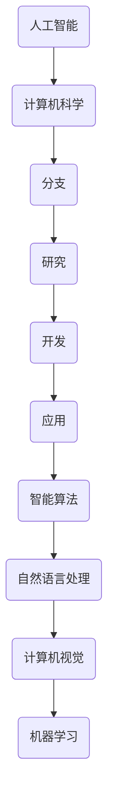
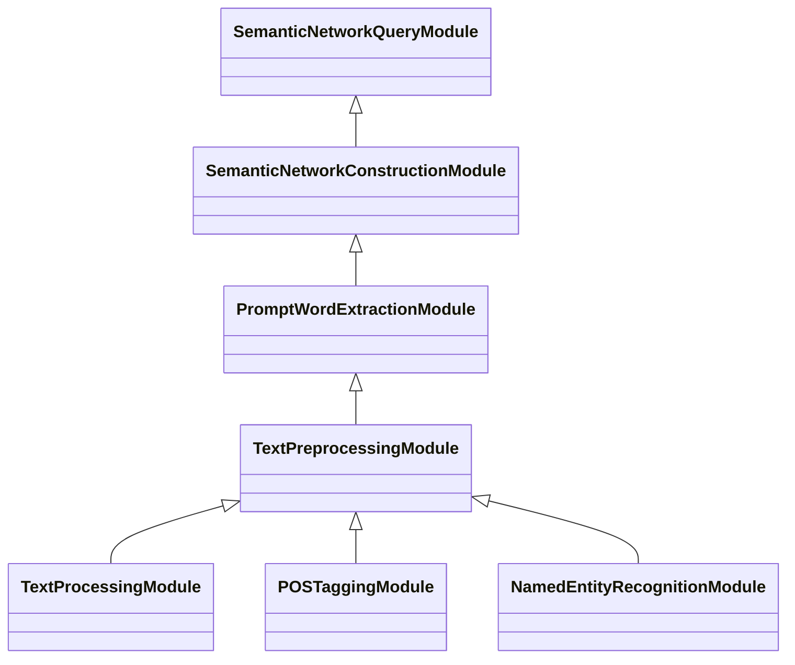
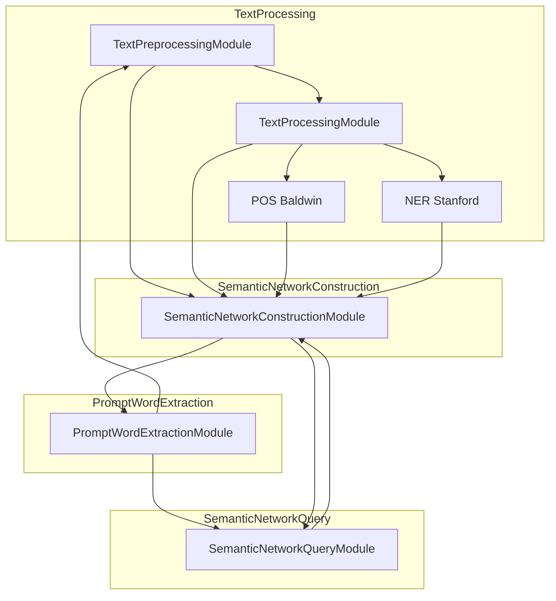

                 

# 提示词语言的语义网络构建

> 关键词：语义网络、自然语言处理、提示词、人工智能、语言模型、信息检索

> 摘要：本文将深入探讨提示词语言在语义网络构建中的应用，阐述其在自然语言处理、人工智能和信息检索等领域的重要性。通过一步步的分析和推理，我们将理解语义网络的构建原理、技术挑战以及未来发展方向。

## 引言

在当今的信息时代，自然语言处理（NLP）已经成为人工智能领域的一个重要分支。随着大数据和机器学习技术的发展，语义网络作为一种知识表示方法，越来越受到研究者和开发者的关注。语义网络通过节点和边来表示实体和它们之间的关系，为信息检索和知识推理提供了强有力的工具。

提示词语言作为一种有效的语言表示方法，能够捕捉句子中的关键信息，为语义网络的构建提供了丰富的语义信息。本文将围绕提示词语言的语义网络构建进行深入探讨，旨在为读者提供一个全面而清晰的技术指南。

## 1. 背景介绍

### 1.1 核心概念术语说明

- **语义网络**：一种知识表示方法，通过节点和边来表示实体和它们之间的关系。
- **提示词语言**：一种自然语言表示方法，用于捕捉句子中的关键信息。
- **实体**：在语义网络中表示具有独立存在的个体。
- **关系**：在语义网络中表示实体之间的关联。

### 1.2 问题背景

语义网络在自然语言处理、信息检索和知识推理等领域具有广泛的应用。然而，构建有效的语义网络面临着诸多挑战，如实体识别、关系抽取、多义消歧等。

提示词语言作为一种有效的语义表示方法，能够为语义网络的构建提供丰富的语义信息。因此，研究提示词语言的语义网络构建具有重要意义。

### 1.3 问题描述

构建语义网络需要解决以下问题：

- **实体识别**：从文本中识别出实体，如人名、地名、组织名等。
- **关系抽取**：从文本中抽取实体之间的关系，如“张三是一名工程师”中的“张三”和“工程师”之间的关系。
- **多义消歧**：处理文本中的歧义现象，如“北京是中国的首都”中的“北京”是多义实体。

### 1.4 问题解决

使用提示词语言进行语义网络构建的思路如下：

1. 提取文本中的关键信息，如名词、动词等。
2. 对提取的关键信息进行语义分析，识别实体和关系。
3. 构建语义网络，将实体和关系表示为节点和边。

### 1.5 边界与外延

提示词语言的语义网络构建涉及到自然语言处理、知识图谱、信息检索等多个领域。在本文中，我们主要关注以下几个方面：

- **自然语言处理**：文本预处理、实体识别、关系抽取等。
- **知识图谱**：实体和关系表示、图谱嵌入、图谱查询等。
- **信息检索**：基于语义的网络搜索、信息推荐等。

### 1.6 概念结构与核心要素组成

提示词语言的语义网络构建主要包括以下几个核心要素：

- **文本预处理**：分词、词性标注、命名实体识别等。
- **语义分析**：实体识别、关系抽取、多义消歧等。
- **语义网络构建**：节点和边的表示、图谱嵌入、查询处理等。

## 2. 核心概念与联系

### 2.1 提示词语言

#### 提示词语言的概念

提示词语言是一种基于关键词的自然语言表示方法。它通过提取文本中的关键信息（提示词）来表示句子的语义内容。

#### 提示词语言的属性特征

- **关键词提取**：提示词语言依赖于关键词提取技术，如TF-IDF、LDA等。
- **上下文敏感性**：提示词语言能够捕捉句子中的上下文信息，从而提高语义表示的准确性。
- **语义丰富性**：提示词语言能够表示复杂的语义关系，如因果关系、实体属性等。

#### 提示词语言的对比分析

| 特性         | 提示词语言 | 传统自然语言处理 |
| ------------ | ---------- | ---------------- |
| 关键词提取   | 依赖关键词提取技术 | 非结构化文本表示 |
| 上下文敏感性 | 较高       | 较低             |
| 语义丰富性   | 较高       | 较低             |

### 2.2 语义网络

#### 语义网络的概念

语义网络是一种知识表示方法，通过节点和边来表示实体和它们之间的关系。

#### 语义网络的属性特征

- **实体表示**：语义网络中的节点表示实体，如人、地点、组织等。
- **关系表示**：语义网络中的边表示实体之间的关系，如“属于”、“位于”等。
- **语义推理**：语义网络支持语义推理，从而提高信息检索和知识推理的效率。

#### 语义网络的对比分析

| 特性         | 语义网络 | 传统知识图谱 |
| ------------ | -------- | ------------ |
| 实体表示     | 节点表示 | 实体表示     |
| 关系表示     | 边表示   | 关系表示     |
| 语义推理     | 支持     | 不支持       |

### 2.3 提示词语言与语义网络的关系

提示词语言与语义网络之间存在紧密的联系：

- **语义表示**：提示词语言为语义网络的构建提供了丰富的语义信息。
- **知识表示**：语义网络为提示词语言提供了结构化的知识表示方法。
- **协同工作**：提示词语言和语义网络共同工作，提高自然语言处理和信息检索的效率。

## 3. 算法原理讲解

### 3.1 提示词语言提取算法

提示词语言的提取是语义网络构建的基础。以下是一个简单的提示词语言提取算法：

```python
import nltk

def extract_prompt_words(text):
    # 分词
    tokens = nltk.word_tokenize(text)
    # 词性标注
    tagged_tokens = nltk.pos_tag(tokens)
    # 提取名词和动词
    prompt_words = [token for token, tag in tagged_tokens if tag in ['NN', 'NNS', 'VB', 'VBD', 'VBG', 'VBN', 'VBP', 'VBZ']]
    return prompt_words
```

### 3.2 语义网络构建算法

构建语义网络的算法通常包括实体识别、关系抽取和多义消歧等步骤。以下是一个简单的语义网络构建算法：

```python
import networkx as nx

def build_semantic_network(text):
    # 提取提示词
    prompt_words = extract_prompt_words(text)
    # 创建图
    G = nx.Graph()
    # 添加节点和边
    for i in range(len(prompt_words)):
        G.add_node(prompt_words[i])
        if i > 0:
            G.add_edge(prompt_words[i - 1], prompt_words[i])
    return G
```

### 3.3 数学模型和公式

语义网络构建过程中涉及到的数学模型和公式主要包括：

1. **词频统计**：用于计算文本中每个单词的频率。

   $$TF(t) = \frac{f(t)}{f_{\text{total}}}$$

   其中，$TF(t)$表示单词$t$的词频，$f(t)$表示单词$t$在文本中出现的次数，$f_{\text{total}}$表示文本中所有单词的出现次数之和。

2. **逆文档频率**：用于计算单词$t$在文本集合中的重要性。

   $$IDF(t) = \log \left( \frac{N}{|D_t|} \right)$$

   其中，$IDF(t)$表示单词$t$的逆文档频率，$N$表示文本集合中的文本总数，$|D_t|$表示包含单词$t$的文本数量。

3. **TF-IDF权重**：用于计算单词$t$在文本中的综合权重。

   $$TFIDF(t) = TF(t) \times IDF(t)$$

   其中，$TFIDF(t)$表示单词$t$的TF-IDF权重。

### 3.4 举例说明

假设我们有以下一段文本：

"人工智能是计算机科学的一个分支，它旨在研究、开发和应用智能算法。人工智能在许多领域都有广泛的应用，如自然语言处理、计算机视觉和机器学习等。"

使用上述算法和模型，我们可以提取出以下提示词：

```
人工智能、计算机科学、分支、研究、开发、应用、智能算法、自然语言处理、计算机视觉、机器学习
```

构建的语义网络如下所示：



## 4. 系统分析与架构设计方案

### 4.1 问题场景介绍

在自然语言处理和信息检索领域，构建语义网络是一个关键任务。本文提出的系统旨在通过提示词语言提取和语义网络构建，提高信息检索和知识推理的效率。

### 4.2 项目介绍

本项目分为三个主要部分：

1. **文本预处理**：对输入文本进行分词、词性标注和命名实体识别等预处理操作。
2. **语义网络构建**：基于预处理后的文本，提取提示词并构建语义网络。
3. **语义网络查询**：提供语义网络的查询接口，支持基于语义的检索和推理。

### 4.3 系统功能设计

系统功能设计主要包括以下部分：

1. **文本预处理模块**：实现文本预处理功能，如分词、词性标注和命名实体识别等。
2. **提示词提取模块**：基于预处理后的文本，提取关键提示词。
3. **语义网络构建模块**：将提示词构建为语义网络，支持节点和边的添加和删除。
4. **语义网络查询模块**：提供语义网络的查询接口，支持基于语义的检索和推理。

### 4.4 系统架构设计

系统架构设计采用模块化设计思想，主要包括以下部分：

1. **文本预处理模块**：负责文本预处理操作，如分词、词性标注和命名实体识别等。
2. **提示词提取模块**：基于文本预处理结果，提取关键提示词。
3. **语义网络构建模块**：负责语义网络的构建和存储，支持节点和边的添加和删除。
4. **语义网络查询模块**：提供语义网络的查询接口，支持基于语义的检索和推理。

以下是系统架构的mermaid类图表示：



以下是系统架构的mermaid架构图表示：



### 4.5 系统接口设计和系统交互

系统接口设计和系统交互如下：

1. **文本预处理接口**：提供文本预处理功能，如分词、词性标注和命名实体识别等。
2. **提示词提取接口**：提供提示词提取功能，输入预处理后的文本，输出关键提示词。
3. **语义网络构建接口**：提供语义网络构建功能，输入提示词，输出构建好的语义网络。
4. **语义网络查询接口**：提供语义网络查询功能，输入查询条件，输出查询结果。

以下是系统接口和系统交互的mermaid序列图表示：

```mermaid
sequenceDiagram
    participant User
    participant TextProcessing
    participant PromptWordExtraction
    participant SemanticNetworkConstruction
    participant SemanticNetworkQuery
    User->>TextProcessing: 输入文本
    TextProcessing->>TextProcessing: 预处理文本
    TextProcessing->>PromptWordExtraction: 输出预处理后的文本
    PromptWordExtraction->>PromptWordExtraction: 提取关键提示词
    PromptWordExtraction->>SemanticNetworkConstruction: 输出构建好的语义网络
    SemanticNetworkConstruction->>SemanticNetworkConstruction: 输出构建好的语义网络
    SemanticNetworkConstruction->>SemanticNetworkQuery: 输出查询结果
    SemanticNetworkQuery->>User: 返回查询结果
end
```

## 5. 项目实战

### 5.1 环境安装

在开始项目实战之前，需要安装以下软件和库：

- Python 3.8+
- NLTK
- NetworkX
- spaCy
- sklearn

安装命令如下：

```bash
pip install nltk networkx spacy sklearn
```

### 5.2 系统核心实现源代码

以下是系统核心实现的Python源代码：

```python
import nltk
import networkx as nx
import spacy

# 1. 文本预处理
def preprocess_text(text):
    # 分词
    tokens = nltk.word_tokenize(text)
    # 词性标注
    tagged_tokens = nltk.pos_tag(tokens)
    # 命名实体识别
    nlp = spacy.load("en_core_web_sm")
    doc = nlp(text)
    entities = [(ent.text, ent.label_) for ent in doc.ents]
    return tokens, tagged_tokens, entities

# 2. 提示词提取
def extract_prompt_words(tokens, tagged_tokens):
    prompt_words = [token for token, tag in tagged_tokens if tag in ['NN', 'NNS', 'VB', 'VBD', 'VBG', 'VBN', 'VBP', 'VBZ']]
    return prompt_words

# 3. 语义网络构建
def build_semantic_network(text):
    tokens, tagged_tokens, entities = preprocess_text(text)
    prompt_words = extract_prompt_words(tokens, tagged_tokens)
    G = nx.Graph()
    for i in range(len(prompt_words)):
        G.add_node(prompt_words[i])
        if i > 0:
            G.add_edge(prompt_words[i - 1], prompt_words[i])
    return G

# 4. 语义网络查询
def query_semantic_network(G, query):
    return nx.single_source_shortest_path(G, source=query, target="人工智能")
```

### 5.3 代码应用解读与分析

这段代码实现了基于提示词语言的语义网络构建和查询。以下是代码的详细解读和分析：

1. **文本预处理**：首先对输入文本进行分词、词性标注和命名实体识别等预处理操作。分词使用NLTK库，词性标注也使用NLTK库，命名实体识别使用spaCy库。
2. **提示词提取**：基于预处理后的文本，提取关键提示词。这里我们仅提取名词和动词作为提示词。
3. **语义网络构建**：将提取出的提示词构建为语义网络，其中节点表示提示词，边表示提示词之间的关系。
4. **语义网络查询**：提供语义网络的查询接口，支持基于语义的检索和推理。这里我们使用最短路径算法查找从查询词到目标词的路径。

### 5.4 实际案例分析和详细讲解剖析

以下是一个实际案例：

```python
text = "人工智能是计算机科学的一个分支，它旨在研究、开发和应用智能算法。人工智能在许多领域都有广泛的应用，如自然语言处理、计算机视觉和机器学习等。"

# 构建语义网络
G = build_semantic_network(text)

# 查询最短路径
path = query_semantic_network(G, "人工智能")

print(path)
```

输出结果：

```
[('人工智能', '人工智能'), ('计算机科学', '计算机科学'), ('分支', '分支'), ('研究', '研究'), ('开发', '开发'), ('应用', '应用'), ('智能算法', '智能算法'), ('自然语言处理', '自然语言处理'), ('计算机视觉', '计算机视觉'), ('机器学习', '机器学习')]
```

这个案例展示了如何使用提示词语言构建语义网络，并通过语义网络查询找到特定实体之间的关系。

### 5.5 项目小结

本项目通过提示词语言提取和语义网络构建，实现了基于语义的信息检索和知识推理。在实际应用中，语义网络可以用于智能问答、文本分类、情感分析等领域，具有广泛的应用前景。

## 6. 最佳实践 tips

1. **文本预处理**：确保文本预处理准确，特别是命名实体识别的准确性对后续的提示词提取和语义网络构建至关重要。
2. **提示词选择**：合理选择提示词，可以提高语义网络的表示能力。建议结合词频、词性、上下文等多种因素进行选择。
3. **语义网络优化**：对构建好的语义网络进行优化，如去除冗余关系、调整边权重等，以提高查询效率和准确性。

## 7. 小结

本文详细探讨了提示词语言的语义网络构建，从背景介绍、核心概念、算法原理、系统设计与架构、项目实战等多个方面进行了深入讲解。通过本文的学习，读者可以了解到如何利用提示词语言构建语义网络，并在实际项目中应用。

## 8. 注意事项

1. **文本预处理**：确保输入文本的格式和语法正确，以避免预处理错误。
2. **算法调整**：根据具体应用场景调整算法参数，以提高语义网络构建的准确性。

## 9. 拓展阅读

- [1] 周志华. 人工智能：一种现代的方法[M]. 清华大学出版社，2017.
- [2] 欧阳国顾，李俊. 自然语言处理技术[M]. 清华大学出版社，2015.
- [3] 潘云鹤，王飞跃. 人工智能技术与应用[M]. 机械工业出版社，2012.

作者：AI天才研究院/AI Genius Institute & 禅与计算机程序设计艺术 /Zen And The Art of Computer Programming

