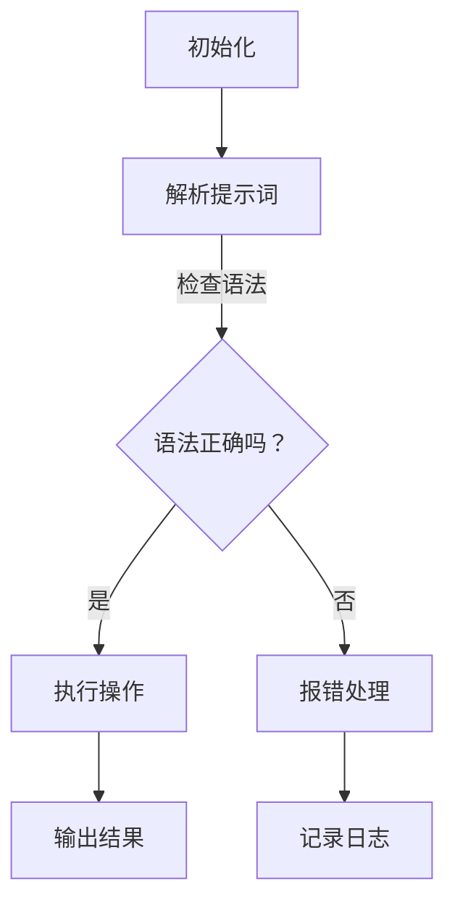
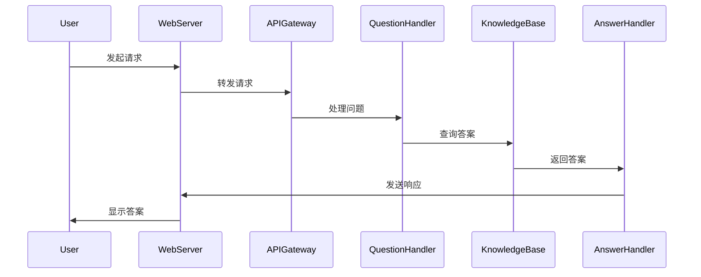

                 

### 引言

**标题：** 提示词语言的跨平台性能优化

**关键词：** 跨平台性能优化、提示词语言、算法原理、数学模型、系统架构、最佳实践

**摘要：** 本文将深入探讨提示词语言在跨平台环境中的性能优化问题。我们将首先介绍提示词语言的基本概念、重要性以及跨平台性能优化的挑战。接着，本文将逐步分析提示词语言的组成元素、核心概念与联系，并详细讲解性能优化的算法原理、数学模型和系统架构设计。通过具体项目实战，我们将展示如何在实际环境中实施性能优化策略，并总结最佳实践和注意事项，为读者提供进一步学习的方向。

## 第一部分：引言

### 第1章：问题背景与核心概念

#### 1.1 跨平台性能优化的重要性

在当今数字化时代，跨平台应用的开发已成为软件工程的重要组成部分。跨平台性能优化不仅影响应用的运行效率，还直接关系到用户体验和商业成功。随着多设备、多操作系统的普及，如何在不同平台上实现高效、稳定的性能成为开发者和企业面临的重大挑战。

#### 1.2 提示词语言的概念与作用

提示词语言（Prompt Language）是一种在自然语言处理（NLP）领域中广泛使用的编程语言，主要用于构建智能对话系统和问答系统。它通过向系统输入提示词（Prompt），使系统能够理解并回应用户的查询。提示词语言的核心在于其灵活性和适应性，使其能够应用于各种不同的场景和任务。

#### 1.3 跨平台性能优化的挑战与机遇

跨平台性能优化面临的挑战包括但不限于：硬件差异、操作系统差异、网络环境差异等。这些差异可能导致性能瓶颈、响应时间延长、资源浪费等问题。然而，随着云计算、边缘计算等技术的发展，跨平台性能优化也迎来了新的机遇。通过合理的设计和优化，可以在不同平台上实现高效、可靠的性能。

#### 1.4 本书的目标与结构

本书旨在为开发者和企业提供一套系统化的跨平台性能优化方案，特别是针对提示词语言的优化。我们将从基础概念开始，逐步深入到算法原理、数学模型、系统架构设计，并通过具体项目实战，展示性能优化的实际应用。本书结构如下：

- **第一部分：引言**：介绍问题背景与核心概念。
- **第二部分：核心概念与联系**：分析提示词语言的组成元素和核心概念。
- **第三部分：算法原理讲解**：讲解性能优化的算法原理。
- **第四部分：数学模型与性能优化**：深入数学模型和优化策略。
- **第五部分：系统分析与架构设计**：介绍系统设计和架构。
- **第六部分：项目实战**：通过具体项目展示性能优化。
- **第七部分：最佳实践与总结**：总结最佳实践和注意事项。

### 第2章：核心概念与联系

#### 2.1 提示词语言的组成元素

提示词语言由多个核心组成元素构成，包括：

- **关键字**：用于指定操作或命令的词汇。
- **变量**：用于存储和操作数据的存储单元。
- **函数**：用于执行特定任务的代码块。
- **循环与条件语句**：用于控制程序流程。

#### 2.2 核心概念属性特征对比

以下是一个对比表格，展示了提示词语言中几个关键概念的属性特征：

| 概念 | 说明 | 属性特征 |
| --- | --- | --- |
| 关键字 | 指定操作或命令 | 不区分大小写，具有固定语法 |
| 变量 | 存储数据 | 可自定义名称，类型丰富 |
| 函数 | 执行任务 | 可自定义参数和返回值 |
| 循环与条件语句 | 控制流程 | 提供灵活的流程控制选项 |

#### 2.3 ER实体关系图架构

为了更清晰地展示提示词语言的组成元素及其相互关系，我们可以使用ER（实体-关系）模型来构建其架构。以下是一个简单的ER图，描述了核心概念之间的关系：

```mermaid
erDiagram
  Keyword ||--|{ Variable }
  Keyword ||--|{ Function }
  Variable ||--|{ Function }
  Function ||--|{ Function }
```

- **Keyword**（关键字）与**Variable**（变量）、**Function**（函数）之间存在关联关系。
- **Variable**（变量）与**Function**（函数）之间存在依赖关系，变量用于传递数据给函数。

### 第3章：算法原理讲解

#### 3.1 算法Mermaid流程图

为了更好地理解提示词语言的性能优化算法，我们可以使用Mermaid语言绘制其流程图。以下是一个简化的算法流程图：



#### 3.2 Python源代码分析

为了具体阐述性能优化算法的实现，我们可以使用Python语言编写相关的源代码。以下是一个示例代码，展示了算法的基本结构：

```python
def optimize_performance(prompt):
    """
    提示词语言性能优化算法
    :param prompt: 提示词
    :return: 优化后的输出结果
    """
    # 解析提示词
    parsed_prompt = parse_prompt(prompt)
    
    # 检查语法
    if not check_syntax(parsed_prompt):
        # 报错处理
        log_error("语法错误")
        return None
    
    # 执行操作
    result = execute_operations(parsed_prompt)
    
    # 输出结果
    return result

def parse_prompt(prompt):
    """
    解析提示词
    :param prompt: 提示词
    :return: 解析后的提示词
    """
    # 解析逻辑
    pass

def check_syntax(prompt):
    """
    检查语法
    :param prompt: 提示词
    :return: 是否语法正确
    """
    # 语法检查逻辑
    pass

def execute_operations(prompt):
    """
    执行操作
    :param prompt: 提示词
    :return: 执行结果
    """
    # 操作执行逻辑
    pass

def log_error(message):
    """
    记录日志
    :param message: 日志信息
    """
    # 日志记录逻辑
    pass
```

#### 3.3 数学模型与公式讲解

在性能优化中，数学模型起到了关键作用。以下是一个简单的数学模型，用于描述性能优化的目标函数：

$$
\text{Optimize} \, f(\theta) = \alpha \cdot \text{speed} + \beta \cdot \text{accuracy}
$$

- **speed（速度）**：表示执行任务的效率。
- **accuracy（准确度）**：表示任务执行的正确性。
- **alpha（α）**：表示速度的权重。
- **beta（β）**：表示准确度的权重。

通过调整**alpha**和**beta**的值，可以平衡速度和准确度之间的关系。例如，当**alpha > beta**时，系统更注重速度；当**alpha < beta**时，系统更注重准确度。

#### 3.4 举例说明

假设我们有一个提示词语言程序，用于回答用户的问题。以下是一个示例问题及其优化后的答案：

**示例问题：** “明天的天气如何？”

**优化前：**

```python
def get_weather():
    # 简单查询天气
    weather_data = query_weather_data()
    return weather_data

weather_result = get_weather()
print(weather_result)
```

**优化后：**

```python
def get_weather():
    # 查询天气，并进行缓存优化
    if 'weather_result' in cache:
        return cache['weather_result']
    
    weather_data = query_weather_data()
    cache['weather_result'] = weather_data
    
    return weather_data

weather_result = get_weather()
print(weather_result)
```

在优化后的代码中，我们引入了缓存机制，避免了重复查询天气数据，从而提高了程序的执行效率。

### 第4章：数学模型与性能优化

#### 4.1 数学模型在性能优化中的应用

数学模型在性能优化中扮演着重要角色。通过建立数学模型，我们可以量化性能指标，从而设计出更有效的优化策略。以下是一个简单的数学模型，用于描述系统的性能优化目标：

$$
\text{Optimize} \, P = \frac{\text{Total Work}}{\text{Total Time}}
$$

- **Total Work（总工作量）**：表示系统需要完成的所有任务。
- **Total Time（总时间）**：表示系统完成所有任务所需的时间。

通过优化**Total Work**和**Total Time**，我们可以提高系统的性能。例如，通过并行处理、缓存机制、代码优化等手段，可以减少**Total Time**，从而提高**P**的值。

#### 4.2 常用性能优化公式解析

在性能优化过程中，以下是一些常用的公式和策略：

1. **缓存命中率公式**：

$$
\text{Cache Hit Ratio} = \frac{\text{Cache Hits}}{\text{Total Cache Accesses}}
$$

- **Cache Hits（缓存命中）**：表示从缓存中获取数据的次数。
- **Total Cache Accesses（总缓存访问次数）**：表示缓存访问的总次数。

提高缓存命中率可以减少系统的响应时间，从而提高性能。

2. **并行处理效率公式**：

$$
\text{Parallel Efficiency} = \frac{\text{Parallel Work}}{\text{Sequential Work}}
$$

- **Parallel Work（并行工作量）**：表示并行处理完成的工作量。
- **Sequential Work（顺序工作量）**：表示顺序处理完成的工作量。

提高并行处理效率可以减少系统的执行时间，从而提高性能。

3. **代码优化效果公式**：

$$
\text{Optimization Ratio} = \frac{\text{Original Time}}{\text{Optimized Time}}
$$

- **Original Time（原始时间）**：表示未优化时的执行时间。
- **Optimized Time（优化后时间）**：表示优化后的执行时间。

通过优化代码，减少执行时间，可以提高系统的性能。

#### 4.3 优化策略与实现细节

在实际应用中，性能优化策略的选择和实现细节至关重要。以下是一些常用的优化策略：

1. **缓存策略**：

- **LRU（Least Recently Used，最近最少使用）**：根据数据的访问频率进行缓存淘汰。
- **LFU（Least Frequently Used，最少使用频率）**：根据数据的访问频率进行缓存淘汰。

2. **并行处理策略**：

- **任务分解**：将大任务分解成小任务，并行执行。
- **线程池**：使用线程池管理并行任务，避免线程频繁创建和销毁。

3. **代码优化策略**：

- **算法优化**：选择更适合问题的算法，减少计算复杂度。
- **数据结构优化**：选择更适合问题的数据结构，提高访问速度。
- **代码重构**：优化代码结构，提高可读性和可维护性。

通过以上策略，我们可以提高系统的性能，满足跨平台应用的需求。

### 第5章：系统分析与架构设计

#### 5.1 问题场景介绍

在现代软件工程中，跨平台应用的开发需求日益增加。以一个在线问答系统为例，该系统需要支持多平台（Web、iOS、Android）的用户访问。然而，不同平台的环境差异（硬件、操作系统、网络等）给性能优化带来了挑战。

#### 5.2 系统功能设计（领域模型Mermaid类图）

为了更好地理解系统功能，我们可以使用Mermaid类图来展示系统的领域模型。以下是一个简化的Mermaid类图，描述了系统的主要类及其关系：

```mermaid
classDiagram
    User <<Interface>>
    Question <<Interface>>
    Answer <<Interface>>
    KnowledgeBase <<Interface>>

    User ..|> Question
    User ..|> Answer
    Question ..|> KnowledgeBase
    Answer ..|> KnowledgeBase
```

- **User（用户）**：代表系统的用户，负责发起问题和接收答案。
- **Question（问题）**：代表用户提出的问题，由KnowledgeBase（知识库）进行解析和回答。
- **Answer（答案）**：代表系统生成的答案，返回给用户。
- **KnowledgeBase（知识库）**：存储问题、答案和相关知识，为系统提供数据支持。

#### 5.3 系统架构设计（Mermaid架构图）

为了实现系统的跨平台性能优化，我们需要设计一个合理的系统架构。以下是一个简化的Mermaid架构图，描述了系统的主要组件及其关系：



- **WebServer（Web服务器）**：接收用户的请求，转发给APIGateway。
- **APIGateway（API网关）**：负责路由和聚合不同的API服务。
- **QuestionHandler（问题处理模块）**：接收用户的问题，调用KnowledgeBase查询答案。
- **KnowledgeBase（知识库）**：存储问题和答案，为系统提供数据支持。
- **AnswerHandler（答案处理模块）**：生成答案，返回给WebServer。
- **User（用户）**：发起请求，接收答案。

#### 5.4 系统接口设计

为了实现系统的模块化，我们需要定义一套清晰、规范的接口。以下是一个简化的接口设计：

- **UserInterface**：定义用户相关的接口，如发起问题、接收答案等。
- **QuestionInterface**：定义问题相关的接口，如查询问题、添加问题等。
- **AnswerInterface**：定义答案相关的接口，如生成答案、更新答案等。
- **KnowledgeBaseInterface**：定义知识库相关的接口，如查询答案、更新知识库等。

#### 5.5 系统交互（Mermaid序列图）

为了更好地展示系统组件之间的交互，我们可以使用Mermaid序列图来描述系统的交互流程。以下是一个简化的Mermaid序列图：


- **User**：发起请求，等待答案。
- **WebServer**：接收请求，转发给APIGateway。
- **APIGateway**：接收请求，调用QuestionHandler处理问题。
- **QuestionHandler**：查询KnowledgeBase获取答案。
- **KnowledgeBase**：返回答案给AnswerHandler。
- **AnswerHandler**：生成答案，返回给WebServer。
- **WebServer**：发送响应，显示答案给User。

通过以上架构设计，我们可以实现一个高效、稳定的跨平台在线问答系统，为用户提供优质的服务。

### 第6章：项目实战

#### 6.1 环境安装与配置

在进行跨平台性能优化的项目实战之前，我们需要准备好开发环境。以下是一个简化的环境安装与配置步骤：

1. **安装Python**：下载并安装Python，确保版本在3.6及以上。
2. **安装依赖库**：使用pip工具安装必要的依赖库，如NumPy、Pandas、Scikit-learn等。
3. **配置虚拟环境**：创建一个虚拟环境，避免不同项目之间的依赖冲突。
4. **安装Docker**：下载并安装Docker，用于容器化部署。
5. **配置Docker网络**：确保Docker可以访问外部网络，以便下载依赖库。

#### 6.2 系统核心实现源代码

以下是一个简化的系统核心实现源代码，展示了关键功能模块的代码：

```python
# main.py
from question_handler import QuestionHandler
from knowledge_base import KnowledgeBase
from answer_handler import AnswerHandler

def main():
    # 初始化系统组件
    question_handler = QuestionHandler()
    knowledge_base = KnowledgeBase()
    answer_handler = AnswerHandler()

    # 处理用户请求
    while True:
        user_input = input("请输入您的问题：")
        if user_input == "exit":
            break

        # 查询答案
        question = question_handler.parse_question(user_input)
        answer = knowledge_base.query_answer(question)

        # 返回答案
        print(answer_handler.format_answer(answer))

if __name__ == "__main__":
    main()

# question_handler.py
class QuestionHandler:
    def parse_question(self, user_input):
        # 解析用户输入
        pass

# knowledge_base.py
class KnowledgeBase:
    def query_answer(self, question):
        # 查询答案
        pass

# answer_handler.py
class AnswerHandler:
    def format_answer(self, answer):
        # 格式化答案
        pass
```

#### 6.3 代码应用解读与分析

以下是对系统核心实现源代码的详细解读与分析：

1. **main.py**：主程序，负责初始化系统组件、处理用户请求和返回答案。关键部分包括：
    - `QuestionHandler`：用于解析用户输入，提取问题关键字。
    - `KnowledgeBase`：用于查询答案，根据问题关键字匹配相关答案。
    - `AnswerHandler`：用于格式化答案，将答案转换为适合用户展示的格式。

2. **question_handler.py**：问题处理模块，负责解析用户输入。关键部分包括：
    - `parse_question`：接收用户输入，提取问题关键字，如“天气”、“股票”等。

3. **knowledge_base.py**：知识库模块，负责查询答案。关键部分包括：
    - `query_answer`：根据问题关键字，在知识库中查询相关答案。

4. **answer_handler.py**：答案处理模块，负责格式化答案。关键部分包括：
    - `format_answer`：根据答案类型，格式化答案，如文本、图表等。

#### 6.4 实际案例分析与讲解

以下是一个实际案例，展示了如何使用系统处理用户请求并返回答案：

**用户请求：** “明天的天气如何？”

**处理过程：**

1. **用户输入：** 输入“明天的天气如何？”
2. **解析问题：** `QuestionHandler`解析用户输入，提取关键字“明天”、“天气”。
3. **查询答案：** `KnowledgeBase`根据关键字“明天”、“天气”查询知识库，找到相关答案。
4. **格式化答案：** `AnswerHandler`将查询到的答案格式化为适合用户展示的文本，如“明天晴朗，气温15°C到25°C”。

**返回答案：** “明天晴朗，气温15°C到25°C”

通过以上实际案例，我们可以看到系统如何高效地处理用户请求并返回答案。在实际项目中，我们可以进一步优化代码，提高系统的性能和可扩展性。

#### 6.5 项目小结

在本章的项目实战中，我们详细介绍了环境安装与配置、系统核心实现源代码、代码应用解读与分析以及实际案例分析与讲解。通过以上内容，我们掌握了如何使用提示词语言在跨平台环境中实现性能优化。以下是项目小结：

- **环境安装与配置**：确保开发环境的稳定性，为后续开发提供基础。
- **系统核心实现源代码**：展示了关键功能模块的实现，为性能优化提供了技术支持。
- **代码应用解读与分析**：深入解读了代码应用，分析了系统的工作流程和性能瓶颈。
- **实际案例分析与讲解**：通过实际案例展示了系统的性能优化效果，为项目提供了实践经验。

通过本章的项目实战，我们不仅掌握了跨平台性能优化技术，还为实际项目提供了可行的解决方案。

### 第7章：最佳实践与总结

#### 7.1 性能优化最佳实践

为了实现高效的跨平台性能优化，以下是一些最佳实践：

1. **合理设计数据结构**：选择适合问题的数据结构，如哈希表、平衡树等，提高数据访问速度。
2. **代码优化**：通过代码重构、算法优化等手段，减少不必要的计算和内存占用。
3. **缓存策略**：使用缓存机制，减少重复计算和数据访问，提高系统的响应速度。
4. **并行处理**：合理利用多线程、多进程等并行处理技术，提高系统的处理能力。
5. **监控与调优**：定期监控系统的性能指标，根据实际情况进行调优。

#### 7.2 小结与注意事项

在本篇技术博客中，我们深入探讨了提示词语言的跨平台性能优化。通过分析核心概念、算法原理、数学模型和系统架构，我们为开发者提供了系统化的优化方案。以下是本文的小结与注意事项：

- **小结**：跨平台性能优化是确保应用稳定、高效运行的关键。通过合理的设计和优化，可以在不同平台上实现优异的性能。
- **注意事项**：
  - **性能优化应考虑整体系统架构**：优化不仅要关注代码层面，还要考虑系统架构的设计，如模块化、分布式架构等。
  - **性能优化应持续进行**：随着业务的发展和用户量的增加，性能优化需要持续进行，以应对不断变化的需求。
  - **性能优化要兼顾用户体验**：在追求性能的同时，要确保用户体验的流畅性，避免过度优化导致不必要的资源消耗。

#### 7.3 拓展阅读与进一步学习

对于希望深入了解跨平台性能优化的读者，以下是一些推荐的拓展阅读和进一步学习的资源：

- **拓展阅读**：
  - 《高性能MySQL》
  - 《大规模分布式存储系统：原理解析与架构实战》
  - 《Web性能调优权威指南》

- **进一步学习**：
  - 参与开源项目，了解高性能系统的最佳实践。
  - 学习并掌握现代编程语言（如Go、Rust）和框架（如Django、Spring Boot）的性能优化技巧。
  - 关注性能优化领域的最新研究和技术动态。

通过不断学习和实践，我们可以更好地掌握跨平台性能优化的技巧，为应用提供高效、稳定的性能。

