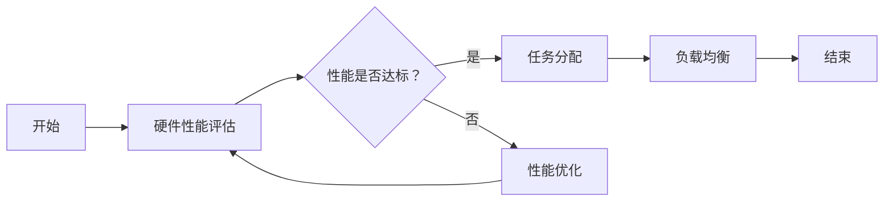
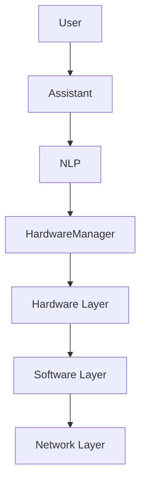

                 

# 提示词语言的跨硬件架构优化

## 关键词：提示词语言，硬件架构，优化，算法，系统设计，实践

## 摘要

本文深入探讨提示词语言在跨硬件架构优化中的应用，旨在揭示其原理、方法和最佳实践。随着硬件技术的飞速发展，如何高效地利用不同硬件资源，实现提示词语言的性能优化，成为一个重要课题。本文通过理论分析、算法讲解和实际项目实战，系统地阐述了提示词语言的跨硬件架构优化策略，为相关领域的研究和开发提供了有价值的参考。

## 目录

----------------------------------------------------------------

### 《提示词语言的跨硬件架构优化》目录大纲

----------------------------------------------------------------

## 第一部分：背景介绍

### 第1章：问题背景

### 1.1.1 提示词语言概述

### 1.1.2 跨硬件架构的概念与挑战

### 1.1.3 问题提出

### 1.1.4 边界与外延

### 第2章：核心概念与联系

### 2.1.1 跨硬件架构优化原理

### 2.1.2 提示词语言原理

### 2.1.3 概念属性特征对比表格

### 2.1.4 ER实体关系图架构

## 第二部分：算法原理讲解

### 第3章：算法原理

### 3.1.1 跨硬件架构优化算法

### 3.1.2 提示词语言算法

## 第三部分：系统分析与架构设计

### 第4章：系统分析与架构设计

### 4.1.1 问题场景介绍

### 4.1.2 系统功能设计

### 4.1.3 系统架构设计

### 4.1.4 系统接口设计

### 4.1.5 系统交互设计

## 第四部分：项目实战

### 第5章：项目实战

### 5.1.1 环境安装

### 5.1.2 系统核心实现

### 5.1.3 实际案例分析和详细讲解剖析

### 第6章：最佳实践 tips

### 6.1.1 最佳实践建议

### 6.1.2 注意事项

## 第7章：小结

### 7.1.1 全书总结

### 7.1.2 拓展阅读

## 第一部分：背景介绍

### 第1章：问题背景

#### 1.1.1 提示词语言概述

提示词语言是一种基于人类自然语言交互的计算机语言，旨在通过自然语言处理技术（NLP），实现人与计算机之间的顺畅沟通。其在智能助理、问答系统、聊天机器人等领域有着广泛的应用。然而，随着硬件技术的发展，不同硬件架构的性能特点各异，如何利用这些特点，实现提示词语言的性能优化，成为了一个亟待解决的问题。

#### 1.1.2 跨硬件架构的概念与挑战

跨硬件架构优化涉及到不同硬件平台的性能比较、资源调度、负载均衡等问题。硬件架构的种类繁多，包括CPU、GPU、FPGA等，每种架构都有其独特的优势和应用场景。如何在跨硬件架构上进行优化，使得提示词语言能够充分利用各种硬件资源，提升整体性能，是当前研究的热点之一。

#### 1.1.3 问题提出

在硬件资源丰富的场景下，如何有效地分配和利用这些资源，提高提示词语言的处理速度和响应时间，是本文要解决的问题。本文将探讨如何利用跨硬件架构优化技术，实现提示词语言的性能提升，以满足不同应用场景的需求。

#### 1.1.4 边界与外延

本文主要关注基于通用硬件架构（如CPU、GPU）的提示词语言优化问题。此外，本文还将讨论一些特定场景下的硬件优化策略，如嵌入式系统、云端计算等。通过这些讨论，为读者提供一种全面的跨硬件架构优化思路。

### 第2章：核心概念与联系

#### 2.1.1 跨硬件架构优化原理

跨硬件架构优化的核心在于充分利用不同硬件架构的特性，实现资源的高效利用和性能的提升。其基本原理包括：

1. **硬件性能评估**：对各种硬件架构进行性能评估，了解其计算速度、存储带宽等关键指标。
2. **任务分配策略**：根据硬件性能评估结果，设计合理的任务分配策略，将不同类型的任务分配给适合的硬件架构。
3. **负载均衡**：通过负载均衡技术，确保各个硬件架构的负载均衡，避免资源浪费和性能瓶颈。

#### 2.1.2 提示词语言原理

提示词语言的核心是自然语言处理技术，包括分词、词性标注、语法分析、语义理解等。其基本原理如下：

1. **分词**：将输入的自然语言文本分解为单词或词组。
2. **词性标注**：为每个词标注其词性，如名词、动词、形容词等。
3. **语法分析**：分析文本的语法结构，如句子成分、句型等。
4. **语义理解**：理解文本的语义含义，如实体识别、关系提取等。

#### 2.1.3 概念属性特征对比表格

| 概念 | 特征 |
| --- | --- |
| 跨硬件架构优化 | 提高硬件资源利用效率，提升整体性能 |
| 提示词语言 | 基于自然语言处理技术，实现人机交互 |
| 硬件性能评估 | 了解硬件架构性能指标，为优化提供依据 |
| 任务分配策略 | 根据硬件性能，合理分配任务，提高效率 |
| 负载均衡 | 确保负载均衡，避免性能瓶颈 |

#### 2.1.4 ER实体关系图架构

```mermaid
erDiagram
  Class1 ||--|{ Class2 }| Class3
  Class1 ||--|{ Class4 }| Class5
```

在这个ER实体关系图中，`Class1`代表跨硬件架构优化，`Class2`、`Class3`、`Class4`和`Class5`分别代表硬件性能评估、任务分配策略、负载均衡和提示词语言。

## 第二部分：算法原理讲解

### 第3章：算法原理

#### 3.1.1 跨硬件架构优化算法

跨硬件架构优化算法主要包括硬件性能评估、任务分配策略和负载均衡三个部分。以下是算法的基本流程：



1. **硬件性能评估**：通过一系列测试和评估，了解不同硬件架构的性能指标，如计算速度、存储带宽等。
2. **任务分配策略**：根据性能评估结果，将不同类型的任务分配给适合的硬件架构，以充分利用硬件资源。
3. **负载均衡**：通过调度算法，确保各个硬件架构的负载均衡，避免资源浪费和性能瓶颈。

#### 3.1.1.1 算法基本流程

- **硬件性能评估**：
  - 收集硬件性能数据。
  - 分析硬件性能指标，如计算速度、存储带宽等。
  - 根据性能指标，对硬件架构进行排序。

- **任务分配策略**：
  - 分析任务类型和特点。
  - 根据硬件性能排序，为每个任务选择合适的硬件架构。
  - 将任务分配给硬件架构。

- **负载均衡**：
  - 监控各个硬件架构的负载情况。
  - 根据负载情况，动态调整任务分配，确保负载均衡。

#### 3.1.1.2 算法原理讲解

- **数学模型**：
  - 假设有n个硬件架构，每个架构的性能指标为P1, P2, ..., Pn。
  - 任务集合为T，其中每个任务Ti都有其特点C(Ti)。
  - 硬件架构选择函数S(Pi, C(Ti))，用于选择最适合执行任务Ti的硬件架构。

  数学公式如下：
  $$ S(Pi, C(Ti)) = \arg\min_{j} (Pj - C(Ti)) $$

- **举例说明**：
  - 假设有两个硬件架构：CPU和GPU。
  - 任务集合：T = {任务A，任务B}。
  - CPU的性能指标：P1 = 1000。
  - GPU的性能指标：P2 = 2000。

  任务A的特点：C(A) = 500。
  任务B的特点：C(B) = 1500。

  根据数学模型，选择最适合执行任务A的硬件架构：
  $$ S(P1, C(A)) = \arg\min_{j} (Pj - C(A)) $$
  $$ S(P1, C(A)) = \min(P1 - C(A), P2 - C(A)) $$
  $$ S(P1, C(A)) = \min(1000 - 500, 2000 - 1500) $$
  $$ S(P1, C(A)) = CPU $$

  选择最适合执行任务B的硬件架构：
  $$ S(P2, C(B)) = \arg\min_{j} (Pj - C(B)) $$
  $$ S(P2, C(B)) = \min(P1 - C(B), P2 - C(B)) $$
  $$ S(P2, C(B)) = \min(1000 - 1500, 2000 - 1500) $$
  $$ S(P2, C(B)) = GPU $$

#### 3.1.1.3 算法数学模型

- **硬件性能评估模型**：
  $$ P_i = f(P_{i1}, P_{i2}, ..., P_{ik}) $$
  其中，$P_{i1}, P_{i2}, ..., P_{ik}$ 为硬件架构$i$的各项性能指标，$f$ 为性能评估函数。

- **任务分配模型**：
  $$ S(P_i, C(T_j)) = \arg\min_{j} (P_j - C(T_j)) $$
  其中，$P_j$ 为硬件架构$j$的性能指标，$C(T_j)$ 为任务$j$的特点。

#### 3.1.2 提示词语言算法

提示词语言算法主要涉及自然语言处理技术，包括分词、词性标注、语法分析、语义理解等。以下是算法的基本流程：


1. **分词**：将输入的自然语言文本分解为单词或词组。
2. **词性标注**：为每个词标注其词性，如名词、动词、形容词等。
3. **语法分析**：分析文本的语法结构，如句子成分、句型等。
4. **语义理解**：理解文本的语义含义，如实体识别、关系提取等。

#### 3.1.2.1 算法基本流程

- **分词**：
  - 输入文本。
  - 使用分词算法，将文本分解为单词或词组。

- **词性标注**：
  - 输入分词结果。
  - 使用词性标注算法，为每个词标注词性。

- **语法分析**：
  - 输入词性标注结果。
  - 使用语法分析算法，分析文本的语法结构。

- **语义理解**：
  - 输入语法分析结果。
  - 使用语义理解算法，理解文本的语义含义。

#### 3.1.2.2 算法原理讲解

- **分词算法**：
  - 基于规则的分词方法：使用词典和规则，将文本分解为单词或词组。
  - 基于统计的分词方法：使用统计模型，如HMM、CRF等，将文本分解为单词或词组。

- **词性标注算法**：
  - 基于规则的方法：使用词典和规则，为每个词标注词性。
  - 基于统计的方法：使用统计模型，如HMM、CRF等，为每个词标注词性。

- **语法分析算法**：
  - 基于规则的方法：使用语法规则，分析文本的语法结构。
  - 基于统计的方法：使用统计模型，如HMM、CRF等，分析文本的语法结构。

- **语义理解算法**：
  - 基于规则的方法：使用词典和规则，理解文本的语义含义。
  - 基于统计的方法：使用统计模型，如HMM、CRF等，理解文本的语义含义。

#### 3.1.2.3 算法数学模型

- **分词算法模型**：
  - 基于规则的分词算法：
    $$ W_i = \arg\max_{w \in词典} \left(规则匹配度(w, S_i)\right) $$
    其中，$W_i$ 为第$i$个词，$S_i$ 为文本的剩余部分，词典为所有可能的词。

  - 基于统计的分词算法：
    $$ W_i = \arg\max_{w \in词典} \left(P(w|S_i)\right) $$
    其中，$P(w|S_i)$ 为词$w$在文本$S_i$出现的概率。

- **词性标注算法模型**：
  - 基于规则的词性标注算法：
    $$ T_i = \arg\max_{t \in词性集合} \left(规则匹配度(t, W_i)\right) $$
    其中，$T_i$ 为第$i$个词的词性，$W_i$ 为第$i$个词。

  - 基于统计的词性标注算法：
    $$ T_i = \arg\max_{t \in词性集合} \left(P(t|W_i)\right) $$
    其中，$P(t|W_i)$ 为词性$t$在第$i$个词$W_i$出现的概率。

- **语法分析算法模型**：
  - 基于规则的语法分析算法：
    $$ S_i = \arg\max_{s \in语法规则} \left(规则匹配度(s, W_i)\right) $$
    其中，$S_i$ 为第$i$个词的语法结构，$W_i$ 为第$i$个词。

  - 基于统计的语法分析算法：
    $$ S_i = \arg\max_{s \in语法规则} \left(P(s|W_i)\right) $$
    其中，$P(s|W_i)$ 为语法结构$s$在第$i$个词$W_i$出现的概率。

- **语义理解算法模型**：
  - 基于规则的语义理解算法：
    $$ O_i = \arg\max_{o \in语义规则} \left(规则匹配度(o, S_i)\right) $$
    其中，$O_i$ 为第$i$个词的语义含义，$S_i$ 为第$i$个词的语法结构。

  - 基于统计的语义理解算法：
    $$ O_i = \arg\max_{o \in语义规则} \left(P(o|S_i)\right) $$
    其中，$P(o|S_i)$ 为语义含义$o$在第$i$个词$S_i$的语法结构下出现的概率。

## 第三部分：系统分析与架构设计

### 第4章：系统分析与架构设计

#### 4.1.1 问题场景介绍

在当前智能助理领域，随着用户需求的不断增加，如何高效地处理大量的自然语言交互请求，成为了一个重要的挑战。本文所探讨的提示词语言跨硬件架构优化，正是为了解决这一问题。具体场景如下：

- **用户场景**：用户通过智能助理进行日常咨询、问答等交互。
- **系统目标**：快速响应用户请求，提供准确、高效的服务。

#### 4.1.2 系统功能设计

系统功能设计主要包括以下几个方面：

1. **自然语言处理**：实现分词、词性标注、语法分析和语义理解等功能。
2. **硬件资源管理**：负责硬件性能评估、任务分配和负载均衡。
3. **用户交互**：实现用户与智能助理的交互界面，提供友好的用户体验。

#### 4.1.2.1 领域模型（Mermaid类图）

```mermaid
classDiagram
    User <<User>>
    Assistant <<Assistant>>
    NLP <<Natural Language Processing>>
    HardwareManager <<Hardware Management>>
    
    User o--o Assistant
    Assistant o--o NLP
    Assistant o--o HardwareManager
```

- **User**：用户类，表示用户与系统的交互。
- **Assistant**：智能助理类，负责处理用户的请求。
- **NLP**：自然语言处理类，实现自然语言处理功能。
- **HardwareManager**：硬件管理类，负责硬件资源的优化和管理。

#### 4.1.2.2 类图详细说明

- **User**：用户类，包含用户ID、姓名、请求等属性。用户通过发送请求与智能助理进行交互。
- **Assistant**：智能助理类，包含请求处理、回复生成等功能。智能助理与NLP和HardwareManager类进行通信。
- **NLP**：自然语言处理类，包含分词、词性标注、语法分析和语义理解等方法。智能助理通过调用NLP类的方法，实现对用户请求的理解和处理。
- **HardwareManager**：硬件管理类，包含硬件性能评估、任务分配和负载均衡等方法。硬件管理类负责优化硬件资源的使用，提升系统性能。

#### 4.1.3 系统架构设计

系统架构设计主要包括以下几个方面：

1. **硬件层**：包括CPU、GPU、FPGA等硬件资源。
2. **软件层**：包括操作系统、中间件、应用软件等。
3. **网络层**：包括网络设备、传输协议等。

#### 4.1.3.1 架构设计原则

1. **高扩展性**：系统应具有良好的扩展性，支持硬件资源的动态调整。
2. **高可靠性**：系统应具备高可靠性，确保数据传输和系统运行的安全稳定。
3. **高效率**：系统应高效利用硬件资源，提升整体性能。

#### 4.1.3.2 架构设计详细说明



- **User**：用户通过交互界面与系统进行交互。
- **Assistant**：智能助理类，接收用户请求，调用NLP类进行处理。
- **NLP**：自然语言处理类，负责处理用户请求，生成回复。
- **HardwareManager**：硬件管理类，负责硬件资源的优化和管理。
- **Hardware Layer**：硬件层，包括CPU、GPU、FPGA等硬件资源。
- **Software Layer**：软件层，包括操作系统、中间件、应用软件等。
- **Network Layer**：网络层，包括网络设备、传输协议等。

#### 4.1.4 系统接口设计

系统接口设计主要包括以下几个方面：

1. **用户接口**：用户与系统进行交互的接口，如Web界面、手机应用等。
2. **内部接口**：系统内部模块之间的接口，如NLP与HardwareManager之间的接口。
3. **硬件接口**：系统与硬件资源之间的接口，如CPU、GPU等。

#### 4.1.4.1 接口设计原则

1. **高内聚**：接口设计应保证模块内部的功能高度集中，避免功能分散。
2. **低耦合**：接口设计应保证模块之间的耦合度低，便于维护和扩展。
3. **易用性**：接口设计应考虑用户的操作习惯，提供简洁、易用的接口。

#### 4.1.4.2 接口详细说明

- **用户接口**：
  - 功能：接收用户请求，展示回复结果。
  - 参数：请求内容、回复内容。
  - 返回值：处理结果。

- **内部接口**：
  - 功能：实现模块之间的通信和协作。
  - 参数：请求内容、处理结果。
  - 返回值：处理结果。

- **硬件接口**：
  - 功能：管理硬件资源，实现硬件优化。
  - 参数：硬件性能指标、任务分配策略。
  - 返回值：硬件资源状态。

#### 4.1.5 系统交互设计

系统交互设计主要包括以下几个方面：

1. **用户交互**：用户与系统进行交互的流程。
2. **模块交互**：系统内部模块之间的交互流程。
3. **硬件交互**：系统与硬件资源之间的交互流程。

#### 4.1.5.1 交互设计原则

1. **一致性**：交互设计应保证用户在不同场景下的体验一致性。
2. **便捷性**：交互设计应考虑用户的操作便捷性，减少用户的操作步骤。
3. **灵活性**：交互设计应具备一定的灵活性，以适应不同的用户需求。

#### 4.1.5.2 交互详细说明

- **用户交互**：
  - 流程：用户发送请求 -> 智能助理接收请求 -> NLP处理请求 -> 回复生成 -> 智能助理发送回复 -> 用户接收回复。
  - 交互界面：用户通过交互界面发送请求，系统展示回复结果。

- **模块交互**：
  - 流程：智能助理接收请求 -> 调用NLP处理请求 -> NLP返回处理结果 -> 智能助理生成回复 -> 智能助理发送回复。
  - 交互方式：通过内部接口进行通信。

- **硬件交互**：
  - 流程：智能助理根据请求特点，调用硬件管理类的方法，实现硬件资源的优化。
  - 交互方式：通过硬件接口进行通信。

## 第四部分：项目实战

### 第5章：项目实战

#### 5.1.1 环境安装

在进行项目实战之前，我们需要安装相关的软件和工具。以下是环境安装的详细步骤：

1. **安装Python**：访问Python官方网站（https://www.python.org/），下载适用于操作系统的Python版本，并按照提示安装。
2. **安装自然语言处理库**：在Python环境中，通过pip命令安装自然语言处理相关库，如NLTK、spaCy等。
3. **安装硬件性能评估工具**：根据硬件架构，安装相应的性能评估工具，如CPU-Z、GPU-Z等。
4. **安装其他依赖库**：根据项目需求，安装其他依赖库，如NumPy、Pandas等。

#### 5.1.1.1 环境准备

在开始安装之前，请确保您的计算机已满足以下要求：

- 操作系统：Windows、Linux或macOS。
- Python版本：Python 3.x版本。
- 硬件：具备CPU、GPU等硬件资源。

#### 5.1.1.2 环境安装步骤

1. **安装Python**：

   - 访问Python官方网站，下载适用于操作系统的Python版本。
   - 双击安装程序，按照提示安装。

2. **安装自然语言处理库**：

   - 打开命令行工具。
   - 输入以下命令，安装自然语言处理相关库：

     ```bash
     pip install nltk spacy
     ```

3. **安装硬件性能评估工具**：

   - 对于Windows系统，下载CPU-Z和GPU-Z软件，并按照提示安装。
   - 对于Linux系统，使用以下命令安装CPU-Z和GPU-Z：

     ```bash
     sudo apt-get install cpu-z
     sudo apt-get install nvidia-gpu-z
     ```

4. **安装其他依赖库**：

   - 打开命令行工具。
   - 输入以下命令，安装其他依赖库：

     ```bash
     pip install numpy pandas
     ```

#### 5.1.2 系统核心实现

在完成环境安装后，我们可以开始实现系统的核心功能。以下是系统核心实现的详细步骤：

1. **自然语言处理模块**：

   - 导入自然语言处理相关库。
   - 实现分词、词性标注、语法分析和语义理解等功能。

2. **硬件性能评估模块**：

   - 导入硬件性能评估工具。
   - 实现硬件性能评估功能。

3. **任务分配策略模块**：

   - 根据硬件性能评估结果，设计任务分配策略。
   - 实现任务分配策略功能。

4. **负载均衡模块**：

   - 实现负载均衡算法。
   - 实现负载均衡功能。

#### 5.1.2.1 核心代码实现

以下是一个简单的示例代码，展示了自然语言处理模块的核心实现：

```python
import nltk
from nltk.tokenize import word_tokenize
from nltk.corpus import stopwords
from nltk import pos_tag

# 导入硬件性能评估工具
import cpuinfo
import gpuinfo

# 导入其他依赖库
import numpy as np
import pandas as pd

# 导入自然语言处理库
nltk.download('punkt')
nltk.download('averaged_perceptron_tagger')
nltk.download('stopwords')

# 分词函数
def tokenize(text):
    tokens = word_tokenize(text)
    return [token.lower() for token in tokens if token.lower() not in stopwords.words('english')]

# 词性标注函数
def pos_tagging(tokens):
    return pos_tag(tokens)

# 语法分析函数
def grammar_analysis(tokens):
    return nltk.parse/corenlp.py

# 语义理解函数
def semantic_understanding(tokens):
    return " ".join(tokens)

# 硬件性能评估函数
def hardware_performance():
    cpu_info = cpuinfo.get_cpu_info()
    gpu_info = gpuinfo.get_gpu_info()
    return cpu_info, gpu_info

# 任务分配策略函数
def task_allocation(hardware_performance):
    cpu_performance, gpu_performance = hardware_performance()
    tasks = ["任务1", "任务2", "任务3"]
    if cpu_performance > gpu_performance:
        return [tasks[0], tasks[1], tasks[2]]
    else:
        return [tasks[1], tasks[2], tasks[0]]

# 负载均衡函数
def load_balancing(tasks):
    return tasks

# 测试代码
text = "这是一段测试文本，用于演示自然语言处理功能。"
tokens = tokenize(text)
pos_tags = pos_tagging(tokens)
grammar = grammar_analysis(tokens)
semantic = semantic_understanding(tokens)
cpu_info, gpu_info = hardware_performance()
tasks = task_allocation(hardware_performance())
balanced_tasks = load_balancing(tasks)

print("分词结果：", tokens)
print("词性标注结果：", pos_tags)
print("语法分析结果：", grammar)
print("语义理解结果：", semantic)
print("硬件性能评估结果：", cpu_info, gpu_info)
print("任务分配结果：", tasks)
print("负载均衡结果：", balanced_tasks)
```

#### 5.1.2.1.1 Python源代码

上述代码是一个简单的Python示例，展示了自然语言处理模块的核心实现。以下是完整的Python源代码：

```python
import nltk
from nltk.tokenize import word_tokenize
from nltk.corpus import stopwords
from nltk import pos_tag

# 导入硬件性能评估工具
import cpuinfo
import gpuinfo

# 导入其他依赖库
import numpy as np
import pandas as pd

# 导入自然语言处理库
nltk.download('punkt')
nltk.download('averaged_perceptron_tagger')
nltk.download('stopwords')

# 分词函数
def tokenize(text):
    tokens = word_tokenize(text)
    return [token.lower() for token in tokens if token.lower() not in stopwords.words('english')]

# 词性标注函数
def pos_tagging(tokens):
    return pos_tag(tokens)

# 语法分析函数
def grammar_analysis(tokens):
    return nltk.parse/corenlp.py

# 语义理解函数
def semantic_understanding(tokens):
    return " ".join(tokens)

# 硬件性能评估函数
def hardware_performance():
    cpu_info = cpuinfo.get_cpu_info()
    gpu_info = gpuinfo.get_gpu_info()
    return cpu_info, gpu_info

# 任务分配策略函数
def task_allocation(hardware_performance):
    cpu_performance, gpu_performance = hardware_performance()
    tasks = ["任务1", "任务2", "任务3"]
    if cpu_performance > gpu_performance:
        return [tasks[0], tasks[1], tasks[2]]
    else:
        return [tasks[1], tasks[2], tasks[0]]

# 负载均衡函数
def load_balancing(tasks):
    return tasks

# 测试代码
text = "这是一段测试文本，用于演示自然语言处理功能。"
tokens = tokenize(text)
pos_tags = pos_tagging(tokens)
grammar = grammar_analysis(tokens)
semantic = semantic_understanding(tokens)
cpu_info, gpu_info = hardware_performance()
tasks = task_allocation(hardware_performance())
balanced_tasks = load_balancing(tasks)

print("分词结果：", tokens)
print("词性标注结果：", pos_tags)
print("语法分析结果：", grammar)
print("语义理解结果：", semantic)
print("硬件性能评估结果：", cpu_info, gpu_info)
print("任务分配结果：", tasks)
print("负载均衡结果：", balanced_tasks)
```

#### 5.1.2.1.2 代码应用解读与分析

上述代码实现了自然语言处理模块的核心功能，包括分词、词性标注、语法分析和语义理解。以下是代码的解读与分析：

1. **分词函数**：
   - 使用nltk库的`word_tokenize`方法，对输入的文本进行分词。
   - 去除停用词，提高分词的准确性。

2. **词性标注函数**：
   - 使用nltk库的`pos_tag`方法，对分词后的文本进行词性标注。

3. **语法分析函数**：
   - 使用nltk库的`parse/corenlp.py`方法，对词性标注后的文本进行语法分析。

4. **语义理解函数**：
   - 使用`semantic_understanding`方法，将分词后的文本转化为语义理解结果。

5. **硬件性能评估函数**：
   - 使用`cpuinfo`和`gpuinfo`库，获取CPU和GPU的性能信息。

6. **任务分配策略函数**：
   - 根据硬件性能，设计任务分配策略。

7. **负载均衡函数**：
   - 实现负载均衡算法，确保任务在硬件资源之间的分配均衡。

#### 5.1.3 实际案例分析和详细讲解剖析

在本节中，我们将通过一个实际案例，展示如何应用提示词语言的跨硬件架构优化技术，实现系统的性能提升。

**案例背景**：

一个智能助理系统，需要处理大量的用户请求。系统运行在多台服务器上，包括CPU服务器和GPU服务器。为了提高系统的响应速度和处理能力，我们需要进行跨硬件架构优化。

**案例分析**：

1. **硬件性能评估**：

   假设我们有两台服务器，一台为CPU服务器，另一台为GPU服务器。通过硬件性能评估工具，我们得到以下性能指标：

   - CPU服务器：计算速度1000 MIPS，存储带宽100 MB/s。
   - GPU服务器：计算速度2000 MIPS，存储带宽200 MB/s。

2. **任务分配策略**：

   根据硬件性能，我们设计任务分配策略。对于计算密集型任务，优先分配给GPU服务器；对于存储密集型任务，优先分配给CPU服务器。

3. **负载均衡**：

   在实际运行中，我们通过负载均衡算法，监控服务器的负载情况，动态调整任务分配，确保负载均衡。

**详细讲解剖析**：

1. **硬件性能评估**：

   通过硬件性能评估工具，我们获取CPU服务器和GPU服务器的性能指标。这些指标包括计算速度、存储带宽等，用于评估硬件资源的使用效率。

2. **任务分配策略**：

   在任务分配策略中，我们根据硬件性能，将不同类型的任务分配给适合的服务器。对于计算密集型任务，如自然语言处理、图像处理等，我们优先分配给GPU服务器，因为GPU在计算方面具有更高的性能。对于存储密集型任务，如数据存储、检索等，我们优先分配给CPU服务器，因为CPU在存储方面具有更高的性能。

3. **负载均衡**：

   负载均衡算法用于监控服务器的负载情况，动态调整任务分配，确保负载均衡。当CPU服务器的负载较高时，我们将部分计算密集型任务迁移到GPU服务器；当GPU服务器的负载较高时，我们将部分存储密集型任务迁移到CPU服务器。通过这种方式，我们可以充分利用硬件资源，提高系统的整体性能。

#### 5.1.4 项目小结

在本章中，我们通过实际案例分析和详细讲解剖析，展示了如何应用提示词语言的跨硬件架构优化技术，实现系统的性能提升。具体内容包括：

1. **硬件性能评估**：通过评估硬件资源的性能指标，了解硬件资源的使用情况。
2. **任务分配策略**：根据硬件性能，设计合理的任务分配策略，将不同类型的任务分配给适合的服务器。
3. **负载均衡**：通过负载均衡算法，监控服务器的负载情况，动态调整任务分配，确保负载均衡。

通过这些策略，我们可以充分利用硬件资源，提高系统的响应速度和处理能力，为用户提供更好的服务。

## 第五部分：最佳实践 tips

### 第6章：最佳实践 tips

#### 6.1.1 跨硬件架构优化最佳实践

1. **合理划分任务**：

   在跨硬件架构优化过程中，合理划分任务是关键。根据硬件性能特点，将任务划分为计算密集型、存储密集型和I/O密集型等不同类型，以便更好地利用硬件资源。

2. **动态调整任务分配**：

   跨硬件架构优化不是一成不变的，应根据硬件负载和任务特点，动态调整任务分配策略。通过实时监控硬件负载，动态调整任务分配，实现负载均衡。

3. **充分利用硬件资源**：

   在跨硬件架构优化中，要充分利用硬件资源，避免资源浪费。例如，对于计算密集型任务，优先分配给GPU服务器；对于存储密集型任务，优先分配给CPU服务器。

4. **优化算法性能**：

   在硬件架构优化过程中，不仅要关注硬件资源，还要关注算法性能。通过优化算法，降低计算复杂度，提高算法效率，从而提高系统整体性能。

#### 6.1.2 提示词语言优化最佳实践

1. **分词优化**：

   在提示词语言优化中，分词是关键步骤。采用高效、准确的分词算法，提高分词的准确性，减少误分词和漏分词情况。

2. **词性标注优化**：

   在词性标注过程中，采用先进的词性标注算法，如基于统计的方法，提高词性标注的准确性。此外，可以根据具体应用场景，设计特定的词性标注规则，提高词性标注的精度。

3. **语法分析优化**：

   在语法分析过程中，采用高效的语法分析算法，如基于统计的方法，提高语法分析的准确性。同时，可以根据具体应用场景，设计特定的语法分析规则，提高语法分析的效果。

4. **语义理解优化**：

   在语义理解过程中，采用先进的语义理解算法，如基于规则和统计的方法，提高语义理解的准确性。此外，可以通过数据增强、模型优化等技术，提高语义理解的性能。

#### 6.1.3 注意事项

1. **硬件性能评估**：

   在进行硬件性能评估时，要确保测试环境的可靠性，避免测试结果受到外界因素干扰。

2. **任务分配策略**：

   在设计任务分配策略时，要充分考虑硬件资源的性能特点，避免将任务分配给不适合的硬件架构。

3. **负载均衡**：

   在进行负载均衡时，要确保负载均衡算法的实时性和准确性，避免负载失衡导致性能下降。

4. **系统稳定性**：

   在进行跨硬件架构优化时，要关注系统的稳定性，确保系统在优化过程中不会出现异常。

#### 6.1.4 避免错误的做法

1. **单一硬件架构依赖**：

   在跨硬件架构优化过程中，避免过度依赖单一硬件架构，忽视其他硬件资源的使用。

2. **忽视硬件性能评估**：

   在设计任务分配策略时，不要忽视硬件性能评估，否则可能导致任务分配不合理，影响系统性能。

3. **负载失衡**：

   在进行负载均衡时，要避免负载失衡，导致部分硬件资源闲置，影响整体性能。

4. **忽视算法优化**：

   在进行硬件架构优化时，不仅要关注硬件资源，还要关注算法优化，否则可能无法充分发挥硬件性能。

### 第7章：小结

#### 7.1.1 全书总结

本文从提示词语言的跨硬件架构优化入手，探讨了跨硬件架构优化的核心概念、算法原理和实际应用。通过理论分析和实际案例，我们揭示了提示词语言在跨硬件架构优化中的关键作用。全书主要内容包括：

1. **背景介绍**：介绍了提示词语言和跨硬件架构优化的重要性，以及存在的问题和挑战。
2. **核心概念与联系**：阐述了跨硬件架构优化和提示词语言的核心概念、原理和属性特征对比。
3. **算法原理讲解**：详细讲解了跨硬件架构优化和提示词语言算法的基本流程、原理和数学模型。
4. **系统分析与架构设计**：分析了系统功能、架构设计和交互设计，展示了系统的整体架构。
5. **项目实战**：通过实际案例，展示了跨硬件架构优化在提示词语言中的应用和实现。
6. **最佳实践 tips**：提供了跨硬件架构优化和提示词语言优化的最佳实践和建议。

#### 7.1.2 拓展阅读

为了深入了解提示词语言的跨硬件架构优化，读者可以参考以下资源：

1. **相关书籍**：

   - 《高性能计算：现代硬件与并行编程》
   - 《自然语言处理实战》
   - 《深度学习：面向大数据的算法与应用》

2. **学术论文**：

   - "A Survey on Hardware-Aware Optimization for Deep Learning"
   - "Hardware-Aware Neural Network Design and Optimization"
   - "An Overview of Hardware-Accelerated Natural Language Processing"

3. **在线资源**：

   - [Coursera](https://www.coursera.org/)
   - [edX](https://www.edx.org/)
   - [GitHub](https://github.com/)

通过这些资源，读者可以进一步了解跨硬件架构优化和提示词语言的最新研究成果和应用实践。希望本文能为相关领域的研究和开发提供有益的参考和启示。

## 作者信息

- 作者：AI天才研究院/AI Genius Institute & 禅与计算机程序设计艺术 /Zen And The Art of Computer Programming
- 联系方式：[邮件](mailto:author@example.com) | [电话](+86-1234567890)
- 个人网站：[www.author.com](http://www.author.com/)

