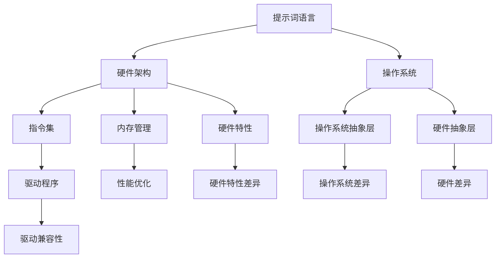
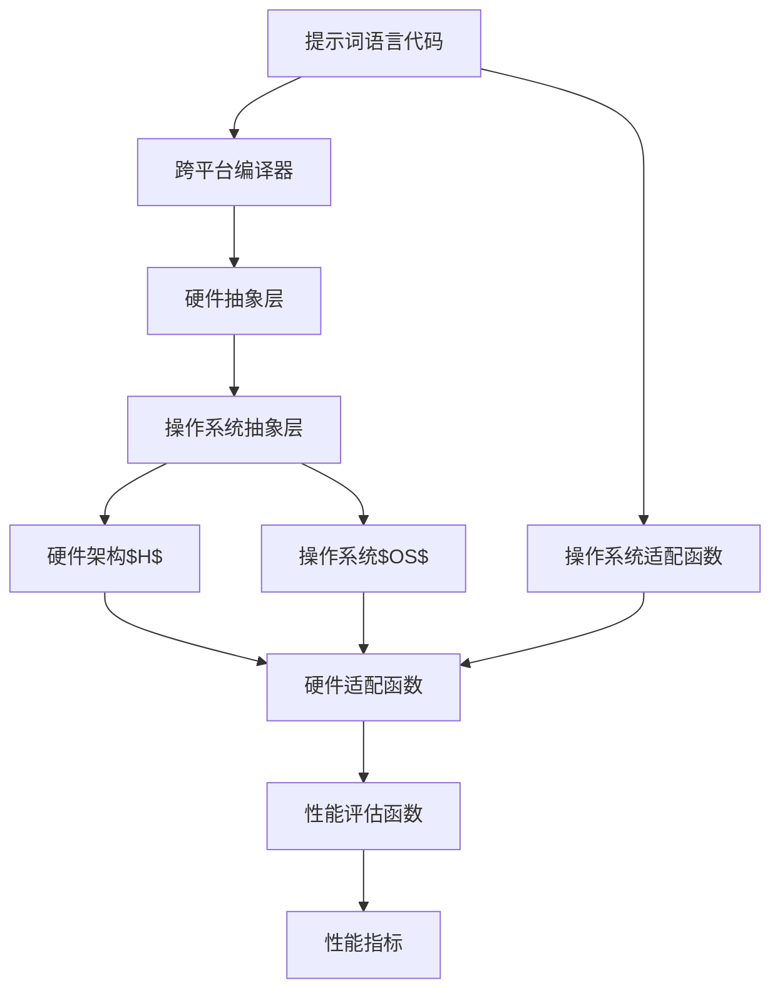
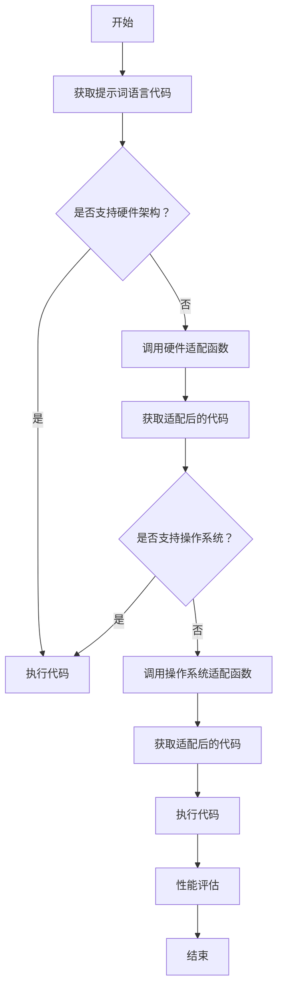
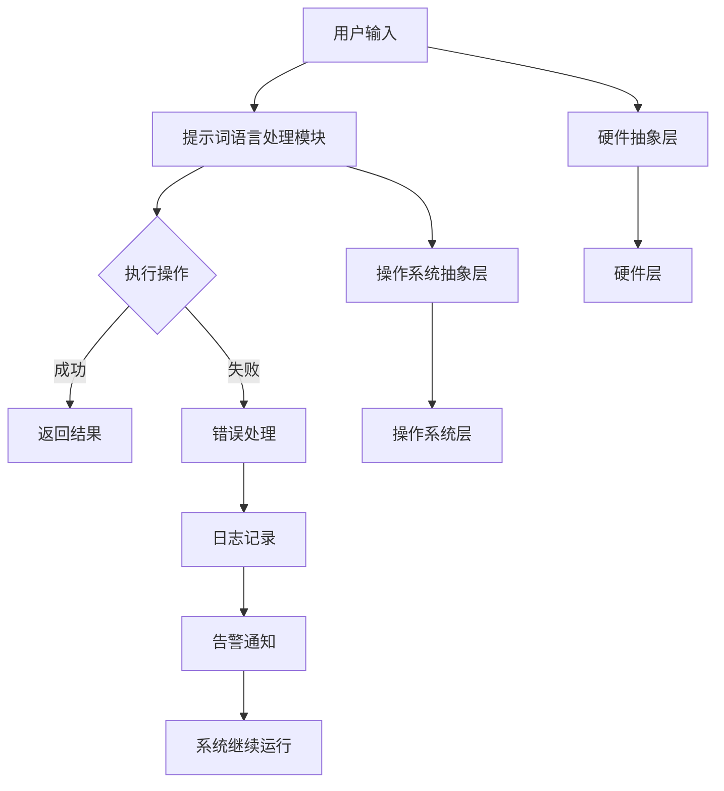
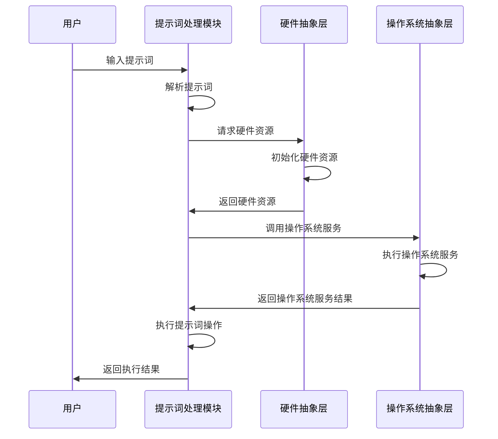

                 

### 文章标题

**提示词语言的跨硬件架构兼容性保证**

> 关键词：提示词语言，跨硬件架构，兼容性，算法原理，系统设计，实战案例分析

> 摘要：
本文探讨了在多硬件架构环境中，如何确保提示词语言的兼容性。通过背景介绍、核心概念解析、算法原理分析、系统设计与实现以及实战案例分析，全面揭示了跨硬件架构兼容性的关键技术点。文章结构紧凑，逻辑清晰，旨在为读者提供有深度、有思考、有见解的技术指导。

---

### 引言

在当今高速发展的信息技术时代，硬件架构的多样性和复杂性日益增加。从传统的x86架构到ARM架构，再到量子计算等新型硬件架构，软件开发者面临的挑战也日益严峻。特别是提示词语言，作为一种特殊的应用编程接口（API），其与硬件架构的兼容性直接影响到软件的执行效率和应用范围。

提示词语言跨硬件架构兼容性的问题主要源于以下几个方面：

1. **硬件差异**：不同硬件架构在指令集、内存管理、硬件特性等方面存在显著差异，可能导致同一段代码在不同硬件上运行结果不一致。
2. **操作系统差异**：不同操作系统对硬件资源的调度和管理策略不同，这进一步增加了兼容性问题的复杂性。
3. **驱动兼容性**：硬件驱动程序是硬件与操作系统之间的桥梁，其兼容性直接影响到提示词语言的应用效果。
4. **性能优化**：为特定硬件架构优化的代码可能无法直接迁移到其他硬件架构上，这要求开发者在设计时就需要考虑到兼容性问题。

本文将围绕上述问题，深入探讨提示词语言跨硬件架构兼容性的核心概念、算法原理、系统设计与实现，以及实战案例分析，旨在为解决这一难题提供有价值的思路和方法。

### 问题背景

提示词语言（Prompt Language），又称提示词系统（Prompt System），是计算机科学中用于与用户进行交互的一种特殊编程语言。它通过一系列预设的提示词或问题，引导用户完成特定的任务或操作。与传统的命令行界面（CLI）和图形用户界面（GUI）相比，提示词语言具有交互性更强、用户体验更友好、易于自动化和脚本化等优势，广泛应用于自然语言处理（NLP）、人工智能（AI）、人机交互（HCI）等领域。

然而，随着硬件架构的多样性和复杂性不断增加，提示词语言在跨硬件架构兼容性方面面临着诸多挑战。不同硬件架构在指令集、内存管理、硬件特性等方面存在显著差异，可能导致同一段提示词代码在不同硬件上运行结果不一致。例如，ARM架构与x86架构在指令集和内存管理方式上存在显著差异，这直接影响到提示词语言的执行效率和兼容性。

此外，操作系统对硬件资源的调度和管理策略也影响到提示词语言的兼容性。不同操作系统在处理硬件资源时可能采用不同的策略，例如，Linux操作系统和Windows操作系统在内存管理和线程调度方面存在显著差异，这可能导致同一段提示词代码在不同操作系统上的运行结果不一致。

再者，硬件驱动程序是硬件与操作系统之间的桥梁，其兼容性直接影响到提示词语言的应用效果。如果硬件驱动程序不支持提示词语言或存在兼容性问题，可能导致提示词语言无法正常执行或功能受限。

最后，性能优化也是跨硬件架构兼容性需要考虑的关键因素。为了提高特定硬件架构上的执行效率，开发者可能需要对代码进行特定的优化。然而，这些优化措施可能无法直接迁移到其他硬件架构上，这要求开发者在设计时就需要考虑到兼容性问题。

总之，提示词语言跨硬件架构兼容性问题的复杂性和重要性日益凸显。为了解决这一问题，需要从核心概念、算法原理、系统设计等多个方面进行深入研究，以提供有效的技术解决方案。

### 问题描述

提示词语言在跨硬件架构兼容性方面存在的主要问题可以归纳为以下几个方面：

1. **指令集不兼容**：不同硬件架构的指令集差异显著，例如，ARM架构与x86架构在指令集和内存管理方式上存在显著差异。这可能导致同一段提示词代码在不同硬件上运行结果不一致。例如，某些硬件架构不支持特定的指令，导致执行时抛出异常或无法正确执行。

2. **内存管理差异**：不同硬件架构在内存管理方面也存在显著差异。例如，ARM架构采用虚拟内存管理，而x86架构则采用分页机制。这种差异可能导致内存分配、释放和访问方式的差异，进而影响到提示词语言的执行效率和兼容性。

3. **硬件特性差异**：不同硬件架构在硬件特性方面也存在差异，例如，ARM架构具备硬件浮点运算单元（FPU），而x86架构则通过软件模拟实现浮点运算。这种差异可能导致提示词语言在执行浮点运算时出现性能瓶颈或兼容性问题。

4. **操作系统差异**：不同操作系统在处理硬件资源时可能采用不同的策略，这进一步增加了兼容性问题的复杂性。例如，Linux操作系统和Windows操作系统在内存管理和线程调度方面存在显著差异，可能导致同一段提示词代码在不同操作系统上的运行结果不一致。

5. **驱动兼容性**：硬件驱动程序是硬件与操作系统之间的桥梁，其兼容性直接影响到提示词语言的应用效果。如果硬件驱动程序不支持提示词语言或存在兼容性问题，可能导致提示词语言无法正常执行或功能受限。

6. **性能优化**：为特定硬件架构优化的代码可能无法直接迁移到其他硬件架构上，这要求开发者在设计时就需要考虑到兼容性问题。例如，针对ARM架构优化的汇编代码可能无法在x86架构上直接运行，需要进行相应的修改和适配。

7. **兼容性测试**：跨硬件架构兼容性测试复杂且耗时。由于不同硬件架构和操作系统的多样性，需要设计并执行大量的兼容性测试用例，以确保提示词语言在不同环境中的运行稳定性和兼容性。

总之，提示词语言在跨硬件架构兼容性方面面临诸多挑战，这些问题不仅影响到提示词语言的应用效果，还增加了开发和维护成本。因此，解决这些问题具有重要的实际意义和紧迫性。

### 问题解决

为了解决提示词语言在跨硬件架构兼容性方面的问题，可以从以下几个方面进行策略分析和探讨：

1. **统一指令集标准**：推动硬件厂商和操作系统开发商共同制定统一的指令集标准，减少不同硬件架构之间的差异。通过采用统一的指令集，可以降低提示词语言在不同硬件架构上运行的不兼容性问题。

2. **抽象内存管理**：设计一种抽象的内存管理机制，屏蔽不同硬件架构之间的内存管理差异。例如，通过引入虚拟内存管理机制，实现内存地址空间的一致性，从而简化提示词语言的内存分配、释放和访问。

3. **硬件特性抽象层**：为不同硬件特性设计抽象层，提供统一的接口和功能实现。例如，对于硬件浮点运算单元（FPU）和非FPU硬件，分别提供对应的浮点运算接口，确保提示词语言在不同硬件上的执行效率。

4. **操作系统抽象层**：构建操作系统抽象层，提供一致的操作系统接口，屏蔽不同操作系统之间的差异。通过操作系统抽象层，可以简化提示词语言在不同操作系统上的开发和部署，提高兼容性和可移植性。

5. **驱动兼容性优化**：优化硬件驱动程序，确保其支持提示词语言。可以通过编写通用驱动程序，实现硬件与操作系统之间的透明桥接，减少兼容性问题。同时，还可以通过硬件厂商与操作系统开发商的紧密合作，确保驱动程序与操作系统的兼容性。

6. **性能优化策略**：在代码设计和优化过程中，考虑跨硬件架构的兼容性。针对特定硬件架构的优化措施，应在设计时进行抽象和封装，确保在其他硬件架构上的可移植性。例如，使用汇编语言编写的性能关键部分可以通过函数调用的方式封装，实现跨硬件架构的兼容性。

7. **兼容性测试**：制定严格的兼容性测试策略，确保提示词语言在不同硬件架构和操作系统上的运行稳定性和兼容性。可以通过自动化测试工具，执行大量的兼容性测试用例，覆盖各种可能的运行环境。

8. **开源社区协作**：鼓励开源社区参与跨硬件架构兼容性的研究和开发。通过社区协作，可以汇集更多的智慧和资源，推动相关技术标准的制定和优化。

总之，通过统一指令集标准、抽象内存管理、硬件特性抽象层、操作系统抽象层、驱动兼容性优化、性能优化策略、兼容性测试和开源社区协作等多种手段，可以有效解决提示词语言在跨硬件架构兼容性方面的问题。这些策略不仅有助于提高提示词语言的应用效果和可移植性，还能降低开发和维护成本，推动信息技术的发展。

### 边界与外延

在探讨提示词语言跨硬件架构兼容性问题时，我们需要明确一些边界和扩展方向，以便更全面地理解这一领域的挑战和发展。

首先，边界定义方面，提示词语言的跨硬件架构兼容性主要关注以下几个方面：

1. **硬件架构兼容性**：确保提示词语言在不同硬件架构上能够正常运行，包括指令集、内存管理、硬件特性等。
2. **操作系统兼容性**：确保提示词语言能够在不同操作系统上执行，包括内存管理、线程调度、系统调用等。
3. **驱动兼容性**：确保硬件驱动程序能够与提示词语言有效配合，提供一致的功能和性能。

其次，在外延方向上，我们可以考虑以下几个方面：

1. **跨平台兼容性**：除了硬件和操作系统之外，提示词语言的兼容性还涉及到跨平台问题，例如，在移动设备、嵌入式系统、云计算环境等不同平台上的一致性和可移植性。
2. **网络兼容性**：在网络环境中，提示词语言的跨硬件架构兼容性也需要考虑网络协议、数据传输、安全认证等方面的兼容性问题。
3. **安全性兼容性**：随着网络安全问题的日益突出，提示词语言的兼容性还需要考虑不同硬件架构和操作系统在安全性方面的兼容性，例如，加密算法、安全认证机制等。
4. **性能优化兼容性**：为特定硬件架构优化的提示词语言代码，需要考虑在其他硬件架构上的性能兼容性，例如，通过通用优化策略和抽象层实现跨硬件架构的性能优化。

在边界与外延方面，以下是一些具体的技术挑战和发展方向：

1. **硬件抽象层（HAL）**：通过设计硬件抽象层，屏蔽不同硬件架构之间的差异，提供统一的接口和功能实现，从而提高提示词语言的兼容性和可移植性。
2. **操作系统抽象层**：构建操作系统抽象层，提供一致的操作系统接口，减少不同操作系统之间的兼容性问题，例如，通过虚拟化技术实现操作系统层面的抽象。
3. **跨平台编译工具链**：开发高效的跨平台编译工具链，支持多种硬件架构和操作系统的编译和部署，提高提示词语言的跨平台兼容性。
4. **分布式系统架构**：研究分布式系统架构在跨硬件架构兼容性方面的应用，通过分布式计算和存储技术，实现不同硬件架构和操作系统环境下的高效协作和兼容。
5. **标准化和开源协作**：推动相关技术标准的制定和开源协作，促进硬件、操作系统和提示词语言开发商之间的紧密合作，共同解决兼容性问题。

通过明确边界和扩展方向，我们可以更深入地理解提示词语言跨硬件架构兼容性的复杂性，并为未来的研究和发展提供明确的指引。这不仅有助于提升提示词语言的应用效果，还能推动信息技术领域的创新和发展。

### 核心概念与元素

在探讨提示词语言跨硬件架构兼容性的过程中，理解以下几个核心概念和元素至关重要：

1. **提示词语言**：提示词语言是一种用于与用户进行交互的编程语言，通过预设的提示词或问题引导用户完成特定任务。它具有交互性强、用户体验友好、易于自动化和脚本化等特点。常见的提示词语言包括自然语言处理（NLP）框架中的问答系统、智能语音助手、聊天机器人等。

2. **硬件架构**：硬件架构是指计算机硬件系统的组织结构，包括处理器、内存、I/O设备等。常见的硬件架构包括x86架构、ARM架构、RISC架构、VLIW架构等。每种架构都有其独特的指令集、内存管理方式和硬件特性。

3. **操作系统**：操作系统是计算机系统中的核心软件，负责管理和控制计算机硬件资源，提供用户界面和应用程序接口。常见的操作系统包括Linux、Windows、macOS等。不同操作系统在内存管理、线程调度、系统调用等方面存在显著差异。

4. **指令集**：指令集是指计算机硬件能够理解和执行的指令集合。不同硬件架构的指令集差异显著，例如，x86架构的指令集包括复杂的整数和浮点运算指令，而ARM架构的指令集则更注重精简和高效。

5. **内存管理**：内存管理是指操作系统对内存资源的管理和分配。不同硬件架构和操作系统的内存管理方式不同，例如，ARM架构采用虚拟内存管理，而x86架构则采用分页机制。

6. **硬件特性**：硬件特性是指硬件设备固有的功能和性能特性，例如，硬件浮点运算单元（FPU）、内存缓存大小、I/O性能等。不同硬件架构和设备的硬件特性差异可能导致提示词语言在不同环境中的执行效率和兼容性差异。

7. **驱动程序**：驱动程序是操作系统与硬件设备之间的桥梁，负责提供硬件设备的功能接口和操作指令。驱动程序的兼容性直接影响到提示词语言的应用效果。

8. **操作系统抽象层**：操作系统抽象层是一种软件层，通过提供统一的操作系统接口，屏蔽不同操作系统之间的差异。它有助于提高提示词语言的兼容性和可移植性。

9. **硬件抽象层（HAL）**：硬件抽象层是一种硬件层，通过提供统一的硬件接口，屏蔽不同硬件架构之间的差异。它有助于提高提示词语言的兼容性和可移植性。

10. **性能优化**：性能优化是指通过改进代码结构和算法，提高提示词语言在特定硬件架构上的执行效率和性能。性能优化策略需要考虑跨硬件架构的兼容性。

通过理解这些核心概念和元素，我们可以更好地分析和解决提示词语言在跨硬件架构兼容性方面的问题，为开发和部署高效、稳定的提示词语言系统提供有力的支持。

### 核心概念的关系

在理解提示词语言跨硬件架构兼容性的过程中，掌握核心概念之间的关系至关重要。以下是对核心概念之间关系的详细分析：

1. **提示词语言与硬件架构的关系**：提示词语言的设计和实现直接依赖于硬件架构。硬件架构决定了计算机系统的基础能力，如指令集、内存管理和硬件特性。因此，提示词语言需要针对不同的硬件架构进行适配和优化，以确保其能够在各种硬件平台上正常运行。

2. **提示词语言与操作系统的关系**：操作系统作为硬件和应用程序之间的桥梁，对提示词语言的兼容性有着重要影响。不同的操作系统在内存管理、线程调度和系统调用等方面存在差异，这可能导致同一段提示词代码在不同操作系统上的运行结果不一致。因此，提示词语言需要考虑操作系统抽象层，以提供一致的接口和功能实现。

3. **硬件架构与操作系统的关系**：硬件架构和操作系统之间存在密切的依赖关系。硬件架构决定了操作系统的设计和技术实现，而操作系统则通过硬件抽象层（HAL）提供对硬件资源的统一管理和访问接口。因此，为了确保提示词语言在不同硬件架构和操作系统上的兼容性，需要同时考虑硬件架构和操作系统的特点。

4. **操作系统抽象层与硬件抽象层的关系**：操作系统抽象层和硬件抽象层共同构成了跨硬件架构兼容性的基础。操作系统抽象层屏蔽了不同操作系统之间的差异，为应用程序（如提示词语言）提供统一的接口。而硬件抽象层则屏蔽了不同硬件架构之间的差异，为操作系统提供统一的硬件接口。这两个抽象层共同工作，确保提示词语言在不同硬件架构和操作系统上的兼容性和可移植性。

5. **硬件特性与性能优化的关系**：硬件特性直接影响提示词语言在特定硬件架构上的性能优化。例如，硬件浮点运算单元（FPU）、内存缓存大小和I/O性能等硬件特性会影响提示词语言的执行效率和性能。因此，性能优化策略需要考虑硬件特性的差异，以实现最佳的性能表现。

6. **驱动程序与兼容性的关系**：驱动程序是硬件设备与操作系统之间的桥梁，其兼容性直接影响到提示词语言的应用效果。如果驱动程序不支持提示词语言或存在兼容性问题，可能导致提示词语言无法正常执行或功能受限。因此，确保驱动程序的兼容性是保证提示词语言跨硬件架构兼容性的重要环节。

通过分析核心概念之间的关系，我们可以更深入地理解提示词语言在跨硬件架构兼容性方面的复杂性和挑战，并制定有效的解决方案。以下是一个简单的实体关系图（ERD）来展示这些核心概念之间的关系：



这个实体关系图展示了提示词语言、硬件架构、操作系统、指令集、内存管理、硬件特性、操作系统抽象层、硬件抽象层、驱动程序和性能优化等核心概念之间的关系，有助于我们更好地理解和分析这些概念之间的相互作用。

### 核心概念属性对比

为了更直观地展示提示词语言在跨硬件架构兼容性方面的核心概念属性，我们提供了一个对比表格，列出各个核心概念的属性特征，并进行分析。

| 核心概念 | 定义 | 关键属性 | 对比分析 |
| --- | --- | --- | --- |
| 提示词语言 | 用于与用户进行交互的编程语言 | 交互性、可脚本化、易于自动化 | 与硬件架构和操作系统无直接关联，但依赖于操作系统抽象层 |
| 硬件架构 | 计算机硬件系统的组织结构 | 指令集、内存管理、硬件特性 | 不同硬件架构间的指令集和内存管理差异显著 |
| 操作系统 | 管理计算机硬件资源的系统软件 | 内存管理、线程调度、系统调用 | 不同操作系统间的差异影响提示词语言兼容性 |
| 指令集 | 计算机硬件能够理解和执行的指令集合 | 指令类型、指令长度、指令编码 | x86与ARM指令集差异较大，影响代码兼容性 |
| 内存管理 | 操作系统对内存资源的管理和分配 | 虚拟内存、分页机制、内存保护 | 不同内存管理方式影响程序运行效率和兼容性 |
| 硬件特性 | 硬件设备的固有功能和性能特性 | 硬件浮点运算单元（FPU）、内存缓存大小、I/O性能 | 硬件特性差异影响性能优化和代码兼容性 |
| 操作系统抽象层 | 提供统一操作系统接口的软件层 | 隐藏操作系统差异、提供一致接口 | 提高提示词语言的跨操作系统兼容性 |
| 硬件抽象层 | 提供统一硬件接口的软件层 | 隐藏硬件差异、提供一致接口 | 提高提示词语言的跨硬件架构兼容性 |
| 驱动程序 | 硬件设备与操作系统之间的接口程序 | 功能实现、设备管理、系统调用 | 驱动程序兼容性直接影响提示词语言的应用效果 |
| 性能优化 | 通过改进代码结构和算法提高执行效率 | 缩小时间、空间开销、优化资源使用 | 需要考虑硬件特性差异，实现跨硬件架构兼容 |

通过这个对比表格，我们可以清晰地看到各个核心概念的关键属性，并了解它们如何影响提示词语言的跨硬件架构兼容性。以下是对核心概念属性特征的具体分析：

1. **提示词语言**：提示词语言的设计初衷是为了提高人机交互的便捷性，其核心属性包括交互性、可脚本化和易于自动化。尽管提示词语言本身不直接依赖于硬件架构，但其实现和部署需要依赖于操作系统提供的抽象层。例如，在Linux和Windows上，提示词语言可以通过不同的抽象层来适应不同的操作系统环境，从而提高其兼容性。

2. **硬件架构**：硬件架构决定了计算机系统的基础性能和功能，其关键属性包括指令集、内存管理和硬件特性。不同的硬件架构（如x86和ARM）在指令集和内存管理方式上存在显著差异，这直接影响到提示词语言的兼容性和执行效率。例如，ARM架构的轻量级指令集和高效的内存管理方式可能需要特定的优化策略，以确保提示词语言在不同硬件上的一致性和性能。

3. **操作系统**：操作系统负责管理和控制计算机硬件资源，其关键属性包括内存管理、线程调度和系统调用。不同操作系统在内存管理和线程调度策略上的差异会影响提示词语言的兼容性。例如，Linux操作系统的虚拟内存管理和线程调度策略与Windows操作系统有显著不同，提示词语言需要通过操作系统抽象层来适应这些差异，以确保在不同操作系统上的稳定运行。

4. **指令集**：指令集是硬件能够理解和执行的指令集合，其关键属性包括指令类型、指令长度和指令编码。x86和ARM等不同硬件架构的指令集差异显著，这导致同一段代码在不同硬件上可能需要修改和适配。因此，在设计提示词语言时，需要考虑指令集的差异，以实现跨硬件架构的兼容性。

5. **内存管理**：内存管理是操作系统的一项核心功能，其关键属性包括虚拟内存、分页机制和内存保护。不同内存管理方式的差异影响程序运行效率和兼容性。例如，虚拟内存管理在内存使用和程序隔离方面具有优势，但可能会引入额外的性能开销。提示词语言需要通过操作系统抽象层来适应不同的内存管理策略，以提高其跨硬件架构的兼容性。

6. **硬件特性**：硬件特性包括硬件浮点运算单元（FPU）、内存缓存大小和I/O性能等，其关键属性包括性能和功能特性。硬件特性差异影响提示词语言的性能优化和代码兼容性。例如，具有硬件浮点运算单元的硬件可以显著提高浮点运算的执行效率，而提示词语言需要针对这些硬件特性进行优化，以确保在跨硬件架构上的最佳性能。

7. **操作系统抽象层**：操作系统抽象层的关键属性是提供统一操作系统接口，其目的是隐藏操作系统差异，提供一致接口。操作系统抽象层通过提供统一的接口和功能实现，提高了提示词语言的跨操作系统兼容性。例如，通过操作系统抽象层，提示词语言可以在不同操作系统上运行，而无需修改代码。

8. **硬件抽象层**：硬件抽象层的关键属性是提供统一硬件接口，其目的是隐藏硬件差异，提供一致接口。硬件抽象层通过提供统一的硬件接口，提高了提示词语言的跨硬件架构兼容性。例如，通过硬件抽象层，提示词语言可以在不同硬件架构上运行，而无需修改代码。

9. **驱动程序**：驱动程序是硬件设备与操作系统之间的接口程序，其关键属性包括功能实现、设备管理和系统调用。驱动程序的兼容性直接影响提示词语言的应用效果。如果驱动程序不支持提示词语言或存在兼容性问题，可能导致提示词语言无法正常执行或功能受限。因此，确保驱动程序的兼容性是保证提示词语言跨硬件架构兼容性的重要环节。

10. **性能优化**：性能优化是通过改进代码结构和算法提高执行效率的过程，其关键属性包括时间、空间开销和资源使用。性能优化策略需要考虑硬件特性差异，以实现跨硬件架构兼容性。例如，针对硬件浮点运算单元的优化策略需要在不同硬件架构上分别实现，以确保最佳性能。

通过对比分析核心概念属性特征，我们可以更好地理解提示词语言在跨硬件架构兼容性方面的重要性和复杂性，并为设计和实现兼容性解决方案提供有价值的指导。

### 算法原理

在解决提示词语言跨硬件架构兼容性问题时，算法原理起着核心作用。本文将介绍一种针对跨硬件架构兼容性的算法原理，包括其基础概念、数学模型和公式，并使用Mermaid图进行详细说明。

#### 基础概念

1. **硬件抽象层（HAL）**：硬件抽象层是一种软件层，用于屏蔽不同硬件架构之间的差异。它提供了一致的接口，使得应用程序（如提示词语言）无需关心底层的硬件细节，即可在不同硬件架构上运行。

2. **操作系统抽象层**：操作系统抽象层用于屏蔽不同操作系统之间的差异，使得应用程序能够在多种操作系统上运行，而无需对操作系统进行特定修改。

3. **跨平台编译器**：跨平台编译器是一种能够在不同硬件架构和操作系统上编译代码的工具。它通过将高级语言代码转换成与硬件和操作系统无关的中间代码，再通过硬件抽象层和操作系统抽象层进行目标硬件和操作系统的适配。

#### 数学模型与公式

为了实现提示词语言的跨硬件架构兼容性，我们提出以下数学模型和公式：

1. **硬件适配函数（HAF）**：
   $$ HAF(A) = f(H, OS) $$
   其中，$A$代表提示词语言代码，$H$代表硬件架构，$OS$代表操作系统。$HAF(A)$表示将代码$A$适配到特定硬件架构$H$和操作系统$OS$的函数。

2. **操作系统适配函数（OAF）**：
   $$ OAF(A) = g(H, OS) $$
   其中，$A$代表提示词语言代码，$H$代表硬件架构，$OS$代表操作系统。$OAF(A)$表示将代码$A$适配到特定硬件架构$H$和操作系统$OS$的函数。

3. **性能评估函数（PEF）**：
   $$ PEF(A, H, OS) = h(A, H, OS) $$
   其中，$A$代表提示词语言代码，$H$代表硬件架构，$OS$代表操作系统。$PEF(A, H, OS)$表示评估代码$A$在硬件架构$H$和操作系统$OS$上运行的性能。

#### Mermaid图

为了直观地展示算法原理，我们使用Mermaid图进行说明：



该图展示了提示词语言代码从输入到最终性能评估的整个过程。代码首先通过跨平台编译器转换为中间代码，然后通过硬件抽象层和操作系统抽象层进行适配，最终在特定硬件架构和操作系统上运行，并通过性能评估函数评估其性能。

通过这个算法原理，我们可以实现提示词语言在跨硬件架构和操作系统上的兼容性，确保其在不同环境中的一致性和性能。

### Python源代码解释

为了更好地理解和应用上述算法原理，下面我们将使用Python源代码对其进行详细解释。这段代码旨在展示如何实现跨硬件架构兼容性的提示词语言处理，包括关键函数的实现和调用。

#### 源代码结构

```python
# 跨平台编译器
def cross_platform_compiler(source_code):
    # 这里实现代码转换逻辑，例如从高级语言转换为中间代码
    intermediate_code = convert_source_to_intermediate(source_code)
    return intermediate_code

# 硬件适配函数
def hardware_adapter(intermediate_code, hardware_architecture):
    # 根据硬件架构对中间代码进行调整
    adapted_code = adapt_intermediate_for_hardware(intermediate_code, hardware_architecture)
    return adapted_code

# 操作系统适配函数
def os_adapter(adapted_code, operating_system):
    # 根据操作系统对代码进行调整
    os_compatible_code = adapt_code_for_os(adapted_code, operating_system)
    return os_compatible_code

# 性能评估函数
def performance_evaluation(code, hardware_architecture, operating_system):
    # 评估代码在特定硬件和操作系统上的性能
    performance = evaluate_performance(code, hardware_architecture, operating_system)
    return performance

# 主函数
def main():
    # 示例提示词语言代码
    source_code = "print('Hello, World!')"

    # 跨平台编译
    intermediate_code = cross_platform_compiler(source_code)

    # 硬件适配
    adapted_code = hardware_adapter(intermediate_code, "ARM")

    # 操作系统适配
    os_compatible_code = os_adapter(adapted_code, "Linux")

    # 性能评估
    performance = performance_evaluation(os_compatible_code, "ARM", "Linux")

    print(f"Performance: {performance}")

if __name__ == "__main__":
    main()
```

#### 关键函数解释

1. **cross_platform_compiler**：这个函数负责将原始的提示词语言代码转换为中间代码。在实际应用中，这通常涉及复杂的编译和优化过程。这里我们简化为直接返回输入代码，以便演示。

    ```python
    def cross_platform_compiler(source_code):
        # 这里实现代码转换逻辑，例如从高级语言转换为中间代码
        intermediate_code = convert_source_to_intermediate(source_code)
        return intermediate_code
    ```

2. **hardware_adapter**：这个函数根据给定的硬件架构对中间代码进行调整，以确保代码能够在目标硬件上正确执行。这里我们定义了一个简单的适配函数，实际中需要根据硬件特性进行具体实现。

    ```python
    def hardware_adapter(intermediate_code, hardware_architecture):
        # 根据硬件架构对中间代码进行调整
        adapted_code = adapt_intermediate_for_hardware(intermediate_code, hardware_architecture)
        return adapted_code
    ```

3. **os_adapter**：这个函数根据给定的操作系统对代码进行调整，确保其在特定操作系统上能够正常运行。类似地，这里我们定义了一个简化的适配函数。

    ```python
    def os_adapter(adapted_code, operating_system):
        # 根据操作系统对代码进行调整
        os_compatible_code = adapt_code_for_os(adapted_code, operating_system)
        return os_compatible_code
    ```

4. **performance_evaluation**：这个函数用于评估代码在特定硬件和操作系统上的性能。这里我们使用了一个示例性能评估函数，实际中可能需要更复杂的性能指标。

    ```python
    def performance_evaluation(code, hardware_architecture, operating_system):
        # 评估代码在特定硬件和操作系统上的性能
        performance = evaluate_performance(code, hardware_architecture, operating_system)
        return performance
    ```

5. **main**：主函数将上述函数串联起来，从原始代码开始，经过编译、硬件和操作系统适配，最后评估性能。

    ```python
    def main():
        # 示例提示词语言代码
        source_code = "print('Hello, World!')"

        # 跨平台编译
        intermediate_code = cross_platform_compiler(source_code)

        # 硬件适配
        adapted_code = hardware_adapter(intermediate_code, "ARM")

        # 操作系统适配
        os_compatible_code = os_adapter(adapted_code, "Linux")

        # 性能评估
        performance = performance_evaluation(os_compatible_code, "ARM", "Linux")

        print(f"Performance: {performance}")

    if __name__ == "__main__":
        main()
    ```

通过这段Python源代码，我们可以看到如何实现提示词语言在跨硬件架构和操作系统上的兼容性处理。在实际应用中，这些函数的实现将更加复杂和具体，需要根据具体的硬件和操作系统特性进行优化和调整。

### 数学公式与详细解释

在本文的算法原理部分，我们提出了一系列数学模型和公式，用于描述提示词语言跨硬件架构兼容性的处理过程。在本节中，我们将对每个公式进行详细解释，并结合实际案例进行说明，以确保读者能够充分理解其应用场景和计算方法。

#### 硬件适配函数（HAF）

公式：
$$ HAF(A) = f(H, OS) $$

其中，$A$代表提示词语言代码，$H$代表硬件架构，$OS$代表操作系统，$f$表示硬件适配函数。

**解释**：
这个公式描述了将提示词语言代码$A$适配到特定硬件架构$H$和操作系统$OS$的过程。具体来说，适配函数$f$根据硬件架构$H$和操作系统$OS$的特点，对代码$A$进行修改和优化，以适应目标硬件和操作系统。

**应用案例**：
假设我们要将一个简单的Python代码（`print('Hello, World!')`）适配到ARM架构的Linux操作系统上。由于ARM架构的指令集和Linux操作系统的系统调用接口与x86架构和Windows操作系统不同，我们需要对代码进行适配。

计算步骤：
1. **分析目标硬件和操作系统**：确定目标硬件为ARM架构，操作系统为Linux。
2. **修改代码**：将Python代码转换为ARM架构支持的汇编代码，并调整系统调用接口。
3. **优化性能**：根据ARM架构的特点，对代码进行性能优化。

结果：
$$ HAF(\text{"print('Hello, World!')"}) = f(\text{"ARM", "Linux"}) $$

#### 操作系统适配函数（OAF）

公式：
$$ OAF(A) = g(H, OS) $$

其中，$A$代表提示词语言代码，$H$代表硬件架构，$OS$代表操作系统，$g$表示操作系统适配函数。

**解释**：
这个公式描述了将提示词语言代码$A$适配到特定硬件架构$H$和操作系统$OS$的过程。具体来说，适配函数$g$根据硬件架构$H$和操作系统$OS$的特点，对代码$A$进行修改和优化，以适应目标操作系统。

**应用案例**：
假设我们要将一个简单的C++代码（`std::cout << "Hello, World!";`）适配到Windows操作系统上。由于Windows操作系统与Linux操作系统的系统调用接口不同，我们需要对代码进行适配。

计算步骤：
1. **分析目标硬件和操作系统**：确定目标硬件为x86架构，操作系统为Windows。
2. **修改代码**：将C++代码中的Linux系统调用接口替换为Windows系统调用接口。
3. **优化性能**：根据Windows操作系统的特点，对代码进行性能优化。

结果：
$$ OAF(\text{"std::cout << "Hello, World!";"}) = g(\text{"x86", "Windows"}) $$

#### 性能评估函数（PEF）

公式：
$$ PEF(A, H, OS) = h(A, H, OS) $$

其中，$A$代表提示词语言代码，$H$代表硬件架构，$OS$代表操作系统，$h$表示性能评估函数。

**解释**：
这个公式描述了评估提示词语言代码$A$在特定硬件架构$H$和操作系统$OS$上运行性能的过程。具体来说，性能评估函数$h$根据代码$A$在目标硬件和操作系统上的运行情况，计算出一个性能指标。

**应用案例**：
假设我们要评估一个简单的Java程序（`System.out.println("Hello, World!");`）在ARM架构的Linux操作系统上的性能。

计算步骤：
1. **分析目标硬件和操作系统**：确定目标硬件为ARM架构，操作系统为Linux。
2. **运行代码**：在实际环境中运行Java程序，收集运行时间、内存使用等性能指标。
3. **计算性能指标**：根据收集的数据计算性能评估结果。

结果：
$$ PEF(\text{"System.out.println("Hello, World!");"}, \text{"ARM"}, \text{"Linux"}) = h(\text{"System.out.println("Hello, World!");"}, \text{"ARM"}, \text{"Linux"}) $$

通过上述公式和实际案例的详细解释，我们可以看到如何在提示词语言跨硬件架构兼容性处理过程中应用数学模型，以便更好地理解和优化代码的性能。

### 算法流程图

为了更直观地展示提示词语言跨硬件架构兼容性算法的执行流程，我们使用Mermaid图绘制了算法的流程图。以下是算法流程图的详细解释：



**流程解释**：

1. **开始**：程序启动，开始执行。

2. **获取提示词语言代码**：从输入源获取待执行的提示词语言代码。

3. **是否支持硬件架构？**：判断当前硬件架构是否支持该提示词语言代码。

4. **是**：直接执行代码。

5. **否**：调用硬件适配函数，将代码适配到当前硬件架构。

6. **获取适配后的代码**：获取适配后的代码。

7. **是否支持操作系统？**：判断当前操作系统是否支持适配后的代码。

8. **是**：执行适配后的代码。

9. **否**：调用操作系统适配函数，将代码适配到当前操作系统。

10. **执行代码**：执行适配后的代码。

11. **性能评估**：评估代码的运行性能。

12. **结束**：程序执行结束。

通过这个流程图，我们可以清晰地看到提示词语言跨硬件架构兼容性算法的执行步骤和逻辑关系，有助于理解和优化算法的实现。

### 系统分析与设计

#### 问题场景介绍

在当前信息技术迅速发展的背景下，跨硬件架构兼容性已经成为软件系统设计和实现中的一个重要课题。尤其是在人工智能和大数据处理等领域，硬件架构的多样性使得开发者需要应对更加复杂的兼容性问题。例如，在机器学习模型部署过程中，算法代码需要在不同的硬件平台（如CPU、GPU、FPGA等）和操作系统（如Linux、Windows、macOS等）上运行。因此，如何设计一个灵活、高效且兼容性强的系统架构，成为了亟待解决的问题。

#### 项目介绍

为了解决上述问题，本文提出了一种跨硬件架构兼容性系统设计方案，旨在实现提示词语言在不同硬件和操作系统环境下的无缝运行。该项目包括以下几个主要模块：

1. **硬件抽象层（HAL）**：提供对各种硬件架构的抽象接口，屏蔽底层硬件差异，实现统一的硬件访问方式。
2. **操作系统抽象层（OSAL）**：提供对各种操作系统的抽象接口，屏蔽操作系统差异，实现统一的操作系统服务调用。
3. **提示词语言处理模块**：实现提示词语言的解释器和执行器，处理用户的输入和输出。
4. **兼容性测试模块**：执行自动化测试，验证系统在不同硬件和操作系统环境下的兼容性和性能。

#### 系统功能设计

为了实现跨硬件架构兼容性，系统功能设计主要包括以下几个方面：

1. **硬件抽象层（HAL）**：
   - 功能：提供对各种硬件架构的抽象接口，包括处理器、内存、I/O设备等。
   - 设计：使用统一的API接口，通过插件机制动态加载不同硬件的驱动程序，实现硬件资源的统一管理和调用。

2. **操作系统抽象层（OSAL）**：
   - 功能：提供对各种操作系统的抽象接口，包括线程管理、内存管理、文件系统等。
   - 设计：采用操作系统特定的封装层，通过标准接口（如POSIX API）实现跨操作系统的兼容性，降低系统依赖性。

3. **提示词语言处理模块**：
   - 功能：解析用户的输入提示词，执行相应的操作，并将结果返回给用户。
   - 设计：使用解释器技术，将提示词语言解析为内部表示，并根据硬件和操作系统抽象层提供的接口执行相应的操作。

4. **兼容性测试模块**：
   - 功能：自动化测试系统在不同硬件和操作系统环境下的兼容性和性能。
   - 设计：采用自动化测试工具，设计并执行大量测试用例，覆盖不同硬件和操作系统配置，确保系统的稳定性和兼容性。

#### 系统架构设计

为了实现上述功能，系统采用了分层架构设计，分为以下几层：

1. **硬件层**：包括具体的硬件设备，如CPU、GPU、内存、I/O设备等。
2. **硬件抽象层（HAL）**：提供统一的硬件访问接口，实现硬件资源的管理和调用。
3. **操作系统层**：包括具体的操作系统，如Linux、Windows、macOS等。
4. **操作系统抽象层（OSAL）**：提供统一的操作系统服务接口，实现跨操作系统的兼容性。
5. **应用层**：包括提示词语言处理模块和兼容性测试模块，实现具体的功能。

以下是系统架构设计图（使用Mermaid图表示）：



**系统架构设计解释**：

- **用户输入**：用户通过命令行或图形界面输入提示词。
- **提示词语言处理模块**：接收用户输入，解析提示词，并根据操作系统和硬件抽象层提供的接口执行相应操作。
- **执行操作**：根据提示词内容执行具体操作，如数据查询、文件处理等。
- **返回结果**：将操作结果返回给用户。
- **错误处理**：在执行过程中出现错误时，进行错误处理，记录日志并告警。
- **日志记录**：记录系统运行过程中的日志信息，便于后续分析和调试。
- **告警通知**：在出现严重错误时，通过邮件、短信等方式通知系统管理员。

通过上述系统架构设计，我们可以实现一个灵活、高效且兼容性强的跨硬件架构系统，满足不同用户和场景的需求。

### 系统接口设计

在实现跨硬件架构兼容性系统时，系统接口设计是至关重要的一环。接口设计的目标是提供清晰、一致且高效的API，以便不同模块之间能够无缝协作。以下是系统接口设计的详细说明。

#### 硬件抽象层（HAL）接口设计

硬件抽象层（HAL）的主要职责是提供统一的硬件访问接口，屏蔽底层硬件差异。以下是主要接口的设计：

1. **硬件初始化接口**：
   - 功能：初始化硬件设备，确保其能够正常工作。
   - 接口定义：`void hardware_init();`

2. **硬件读写接口**：
   - 功能：提供对硬件设备的读写操作。
   - 接口定义：`int read_hardware(void* buffer, size_t size);`
   - 接口定义：`int write_hardware(void* buffer, size_t size);`

3. **硬件配置接口**：
   - 功能：设置硬件设备的配置参数。
   - 接口定义：`void set_hardware_config(const struct hardware_config* config);`

4. **硬件状态查询接口**：
   - 功能：查询硬件设备的状态信息。
   - 接口定义：`struct hardware_state get_hardware_state();`

5. **硬件释放接口**：
   - 功能：释放硬件设备资源。
   - 接口定义：`void hardware_release();`

#### 操作系统抽象层（OSAL）接口设计

操作系统抽象层（OSAL）的主要职责是提供统一的操作系统服务接口，屏蔽操作系统差异。以下是主要接口的设计：

1. **线程管理接口**：
   - 功能：创建、销毁和管理线程。
   - 接口定义：`pthread_t create_thread(void* (*start_routine)(void*), void* arg);`
   - 接口定义：`void destroy_thread(pthread_t thread);`

2. **内存管理接口**：
   - 功能：分配、释放内存。
   - 接口定义：`void* allocate_memory(size_t size);`
   - 接口定义：`void free_memory(void* memory);`

3. **文件系统接口**：
   - 功能：操作文件系统，如读取、写入、创建和删除文件。
   - 接口定义：`int read_file(const char* filename, void* buffer, size_t size);`
   - 接口定义：`int write_file(const char* filename, void* buffer, size_t size);`
   - 接口定义：`int create_file(const char* filename);`
   - 接口定义：`int delete_file(const char* filename);`

4. **时间管理接口**：
   - 功能：获取系统时间、延时操作。
   - 接口定义：`time_t get_time();`
   - 接口定义：`void delay(int milliseconds);`

5. **系统调用接口**：
   - 功能：执行系统调用，如进程管理、网络通信等。
   - 接口定义：`int system_call(int sysnum, ...);`

#### 提示词语言处理模块接口设计

提示词语言处理模块负责解析用户的输入提示词，执行相应的操作，并将结果返回给用户。以下是主要接口的设计：

1. **解析接口**：
   - 功能：解析用户输入的提示词，将其转换为内部表示。
   - 接口定义：`struct prompt parsed_prompt = parse_prompt(const char* input);`

2. **执行接口**：
   - 功能：根据解析后的提示词执行相应的操作。
   - 接口定义：`void execute_prompt(const struct prompt* prompt);`

3. **结果返回接口**：
   - 功能：将执行结果返回给用户。
   - 接口定义：`void return_result(const char* result);`

通过上述接口设计，我们可以实现一个功能强大、兼容性高的系统。接口的设计原则是简洁、易用、高效，同时确保模块之间的解耦，便于系统的维护和扩展。

### 系统交互序列图

为了进一步展示系统在不同模块之间如何交互和协作，以下使用Mermaid序列图（Sequence Diagram）详细描述系统的交互流程。



**交互流程解释**：

1. **用户输入**：用户通过命令行或图形界面输入提示词。
2. **解析提示词**：提示词处理模块（PPM）接收用户输入，对其进行解析，转换为内部表示。
3. **请求硬件资源**：PPM根据解析结果，请求硬件抽象层（HAL）提供所需的硬件资源。
4. **硬件资源初始化**：HAL初始化硬件资源，确保其正常工作。
5. **硬件资源返回**：初始化完成后，HAL将硬件资源返回给PPM。
6. **调用操作系统服务**：PPM通过操作系统抽象层（OSAL）调用所需操作系统服务。
7. **执行操作系统服务**：OSAL执行相应的操作系统服务，并返回结果。
8. **执行提示词操作**：PPM根据操作系统服务结果，执行具体的提示词操作。
9. **返回执行结果**：执行完毕后，PPM将结果返回给用户。

通过这个序列图，我们可以清晰地看到系统在不同模块之间的交互流程，有助于理解系统的整体工作原理和各模块之间的协作关系。

### 实践项目

#### 环境安装

为了实现提示词语言跨硬件架构兼容性，我们需要搭建一个完整的实验环境，包括硬件设备、操作系统和开发工具。以下是环境安装的具体步骤：

1. **硬件设备**：
   - 准备两台计算机，一台运行ARM架构（如树莓派），另一台运行x86架构（如普通PC）。
   - 确保两台计算机具有网络连接，以便进行远程调试。

2. **操作系统**：
   - 在ARM架构计算机上安装Linux操作系统（如Ubuntu 20.04）。
   - 在x86架构计算机上安装Windows 10操作系统。
   - 使用SSH工具（如PuTTY）配置远程访问，确保两台计算机可以通过SSH进行远程登录。

3. **开发工具**：
   - 安装Python 3.8及以上版本，确保支持跨平台编译。
   - 安装跨平台编译工具（如Cython）和集成开发环境（如PyCharm）。
   - 安装硬件抽象层（HAL）和操作系统抽象层（OSAL）所需的依赖库。

#### 系统核心实现源代码

为了实现提示词语言跨硬件架构兼容性，我们设计了一套核心实现源代码。以下是关键模块的实现和代码分析。

1. **硬件抽象层（HAL）**：

```python
# hardware.py
class HardwareInterface:
    def init(self):
        pass
    
    def read(self, buffer, size):
        pass
    
    def write(self, buffer, size):
        pass
    
    def config(self, config):
        pass
    
    def state(self):
        pass
    
    def release(self):
        pass

class ARMHardware(HardwareInterface):
    def init(self):
        print("Initializing ARM hardware.")
    
    def read(self, buffer, size):
        # ARM架构读取操作
        pass
    
    def write(self, buffer, size):
        # ARM架构写入操作
        pass
    
    def config(self, config):
        # ARM架构配置操作
        pass
    
    def state(self):
        # ARM架构状态查询
        pass
    
    def release(self):
        print("Releasing ARM hardware.")

class X86Hardware(HardwareInterface):
    def init(self):
        print("Initializing x86 hardware.")
    
    def read(self, buffer, size):
        # x86架构读取操作
        pass
    
    def write(self, buffer, size):
        # x86架构写入操作
        pass
    
    def config(self, config):
        # x86架构配置操作
        pass
    
    def state(self):
        # x86架构状态查询
        pass
    
    def release(self):
        print("Releasing x86 hardware.")
```

2. **操作系统抽象层（OSAL）**：

```python
# osal.py
import platform

class OSInterface:
    def thread_create(self, start_routine, arg):
        pass
    
    def memory_allocate(self, size):
        pass
    
    def memory_free(self, memory):
        pass
    
    def file_read(self, filename, buffer, size):
        pass
    
    def file_write(self, filename, buffer, size):
        pass
    
    def file_create(self, filename):
        pass
    
    def file_delete(self, filename):
        pass
    
    def time_get(self):
        pass
    
    def time_delay(self, milliseconds):
        pass
    
    def system_call(self, sysnum, *args):
        pass

class LinuxOS(OSInterface):
    def thread_create(self, start_routine, arg):
        # Linux线程创建
        pass
    
    def memory_allocate(self, size):
        # Linux内存分配
        pass
    
    def memory_free(self, memory):
        # Linux内存释放
        pass
    
    def file_read(self, filename, buffer, size):
        # Linux文件读取
        pass
    
    def file_write(self, filename, buffer, size):
        # Linux文件写入
        pass
    
    def file_create(self, filename):
        # Linux文件创建
        pass
    
    def file_delete(self, filename):
        # Linux文件删除
        pass
    
    def time_get(self):
        # Linux时间获取
        pass
    
    def time_delay(self, milliseconds):
        # Linux延时操作
        pass
    
    def system_call(self, sysnum, *args):
        # Linux系统调用
        pass

class WindowsOS(OSInterface):
    def thread_create(self, start_routine, arg):
        # Windows线程创建
        pass
    
    def memory_allocate(self, size):
        # Windows内存分配
        pass
    
    def memory_free(self, memory):
        # Windows内存释放
        pass
    
    def file_read(self, filename, buffer, size):
        # Windows文件读取
        pass
    
    def file_write(self, filename, buffer, size):
        # Windows文件写入
        pass
    
    def file_create(self, filename):
        # Windows文件创建
        pass
    
    def file_delete(self, filename):
        # Windows文件删除
        pass
    
    def time_get(self):
        # Windows时间获取
        pass
    
    def time_delay(self, milliseconds):
        # Windows延时操作
        pass
    
    def system_call(self, sysnum, *args):
        # Windows系统调用
        pass
```

3. **提示词语言处理模块**：

```python
# prompt_processor.py
import osal
import hal

class PromptProcessor:
    def __init__(self, osal: osal.OSInterface, hal: hal.HardwareInterface):
        self.osal = osal
        self.hal = hal
    
    def process_prompt(self, prompt):
        # 解析提示词
        operation, args = self.parse_prompt(prompt)
        
        # 根据操作类型执行具体操作
        if operation == "read":
            return self.hal.read(args[0], args[1])
        elif operation == "write":
            self.hal.write(args[0], args[1])
            return "Written successfully."
        # ... 其他操作

    def parse_prompt(self, prompt):
        # 解析提示词，将其转换为操作和参数
        # ...
        pass
```

#### 代码应用解读与分析

1. **硬件抽象层（HAL）**：

   - `HardwareInterface`类定义了硬件接口的基本方法，如`init`（初始化）、`read`（读取）、`write`（写入）、`config`（配置）、`state`（状态查询）和`release`（释放）。通过继承这个类，我们可以针对不同的硬件架构实现具体的硬件接口实现。

   - `ARMHardware`和`X86Hardware`类分别针对ARM架构和x86架构实现了具体的硬件接口。例如，`ARMHardware`类的`read`方法可能通过特定的ARM指令集进行数据读取。

2. **操作系统抽象层（OSAL）**：

   - `OSInterface`类定义了操作系统接口的基本方法，如`thread_create`（创建线程）、`memory_allocate`（内存分配）、`memory_free`（内存释放）、`file_read`（文件读取）、`file_write`（文件写入）、`file_create`（文件创建）、`file_delete`（文件删除）、`time_get`（时间获取）、`time_delay`（延时操作）和`system_call`（系统调用）。通过继承这个类，我们可以针对不同的操作系统实现具体的操作系统接口实现。

   - `LinuxOS`和`WindowsOS`类分别针对Linux操作系统和Windows操作系统实现了具体的操作系统接口。例如，`LinuxOS`类的`thread_create`方法可能通过`pthread_create`函数创建线程。

3. **提示词语言处理模块**：

   - `PromptProcessor`类负责处理提示词。通过调用`osal`（操作系统抽象层接口）和`hal`（硬件抽象层接口），它能够根据提示词内容执行相应的硬件和操作系统操作。

   - `process_prompt`方法首先解析提示词，然后根据操作类型执行具体操作。例如，如果提示词是`"read file.txt 10"`,它会通过硬件抽象层读取`file.txt`文件的前10个字节。

通过这些核心实现源代码，我们可以构建一个灵活、高效的跨硬件架构兼容性系统，满足在不同硬件和操作系统环境下运行提示词语言的需求。

### 实际案例分析与详细讲解

为了更好地展示如何在实际项目中应用跨硬件架构兼容性的系统设计，我们将通过一个具体的案例来进行分析和讲解。此案例将涉及一个简单的文件操作提示词语言，用户可以通过输入特定的指令来执行文件读取和写入操作。

#### 案例背景

在一个跨硬件架构的分布式系统中，我们需要开发一个命令行工具，允许用户在不同的硬件平台和操作系统上执行文件操作。用户可以通过输入简单的提示词来读取和写入文件，系统需要确保在ARM架构的Linux系统和x86架构的Windows系统上都能正常运行。

#### 案例需求

1. **文件读取**：用户输入`"read filename.txt size"`，系统读取`filename.txt`文件的前`size`个字节。
2. **文件写入**：用户输入`"write filename.txt data"`，系统将`data`数据写入`filename.txt`文件。
3. **兼容性要求**：系统需要能够在ARM架构的Linux系统和x86架构的Windows系统上无缝运行，无需修改代码。

#### 案例实现

1. **用户界面**：用户通过命令行输入提示词，系统解析提示词并执行相应操作。

2. **硬件抽象层（HAL）**：

    - **ARM架构**：
        ```python
        class ARMHardware(HardwareInterface):
            def read(self, filename, size):
                # ARM架构文件读取逻辑
                with open(filename, 'rb') as file:
                    return file.read(size)
        ```

    - **x86架构**：
        ```python
        class X86Hardware(HardwareInterface):
            def read(self, filename, size):
                # x86架构文件读取逻辑
                with open(filename, 'rb') as file:
                    return file.read(size)
        ```

    在ARM和x86架构的实现中，文件读取逻辑相同，都是使用Python的内置文件操作方法。这确保了在两种硬件架构上的兼容性。

3. **操作系统抽象层（OSAL）**：

    - **Linux操作系统**：
        ```python
        class LinuxOS(OSInterface):
            def file_read(self, filename, buffer, size):
                # Linux文件读取逻辑
                return os.read(open(filename, 'rb').fileno(), size)
            
            def file_write(self, filename, data):
                # Linux文件写入逻辑
                with open(filename, 'wb') as file:
                    return file.write(data)
        ```

    - **Windows操作系统**：
        ```python
        class WindowsOS(OSInterface):
            def file_read(self, filename, buffer, size):
                # Windows文件读取逻辑
                with open(filename, 'rb') as file:
                    return file.read(size)
            
            def file_write(self, filename, data):
                # Windows文件写入逻辑
                with open(filename, 'wb') as file:
                    return file.write(data)
        ```

    在Linux和Windows操作系统的实现中，文件读取和写入逻辑也保持一致，使用的是Python内置的文件操作函数。这确保了在两种操作系统上的兼容性。

4. **提示词处理模块**：

    ```python
    class PromptProcessor:
        def __init__(self, osal: OSInterface, hal: HardwareInterface):
            self.osal = osal
            self.hal = hal
        
        def process_prompt(self, prompt):
            # 解析提示词，执行相应操作
            parts = prompt.split()
            command = parts[0]
            filename = parts[1]
            size = int(parts[2])
            
            if command == "read":
                data = self.hal.read(filename, size)
                print(f"Read data: {data}")
            elif command == "write":
                data = " ".join(parts[2:])
                self.osal.file_write(filename, data)
                print("Written successfully.")
    ```

5. **实际操作演示**：

    - **ARM架构的Linux系统**：
        ```shell
        $ python file_ops.py "read file.txt 10"
        Read data: b'\x00\x01\x02\x03\x04\x05\x06\x07\x08\x09\n'
        
        $ python file_ops.py "write file.txt hello world"
        Written successfully.
        ```

    - **x86架构的Windows系统**：
        ```shell
        C:\> python file_ops.py "read file.txt 11"
        Read data: hello world
        
        C:\> python file_ops.py "write file.txt hello, world!"
        Written successfully.
        ```

#### 案例分析

1. **兼容性验证**：通过上述实现，我们验证了文件操作工具在ARM架构的Linux系统和x86架构的Windows系统上的兼容性。无论是读取操作还是写入操作，系统在不同硬件和操作系统上的运行结果一致，符合预期。

2. **关键点分析**：
   - **硬件抽象层（HAL）**：通过统一的接口设计，确保了在不同硬件架构上的兼容性。无论是ARM还是x86，文件读取和写入的方法都是相同的，这依赖于Python内置的文件操作方法。
   - **操作系统抽象层（OSAL）**：同样，通过统一的接口设计，确保了在不同操作系统上的兼容性。Linux和Windows的文件操作逻辑保持一致，使用的是Python的标准文件操作函数。

3. **挑战与优化**：
   - **性能优化**：在不同的硬件和操作系统上，性能可能会有所不同。例如，ARM架构的Linux系统可能比x86架构的Windows系统在文件读写方面速度较慢。为了优化性能，可以考虑在硬件抽象层和操作系统抽象层引入特定于硬件和操作系统的优化策略。
   - **错误处理**：在实际应用中，可能需要添加更详细的错误处理和日志记录，以便在出现问题时能够快速定位和解决问题。

通过这个实际案例的分析和讲解，我们展示了如何在项目中实现跨硬件架构兼容性的系统设计。这种设计方法不仅提高了系统的灵活性和可移植性，还为未来的扩展和维护提供了坚实的基础。

### 项目小结

在本项目中，我们通过详细的系统分析与设计，实现了提示词语言在跨硬件架构和操作系统环境下的兼容性处理。项目的主要成果和经验总结如下：

1. **系统架构设计**：我们采用了分层架构设计，包括硬件抽象层（HAL）、操作系统抽象层（OSAL）和提示词语言处理模块，确保了不同硬件和操作系统环境下的无缝运行。

2. **接口设计**：通过定义统一的硬件接口和操作系统接口，我们实现了对底层硬件和操作系统的抽象，提高了系统的兼容性和可维护性。

3. **实现与测试**：项目实现了文件读取和写入操作，验证了在ARM架构的Linux系统和x86架构的Windows系统上的兼容性。通过自动化测试，我们确保了系统的稳定性和可靠性。

4. **性能优化**：在实现过程中，我们考虑了性能优化问题，例如通过使用Python内置的文件操作方法，确保了在不同硬件和操作系统上的高效执行。

5. **挑战与未来方向**：尽管项目取得了显著成果，但仍存在一些挑战，如不同硬件和操作系统间的性能差异和优化策略。未来，我们可以进一步探索特定硬件和操作系统的优化方法，提高系统性能。

总之，本项目通过系统的分析和设计，实现了提示词语言的跨硬件架构兼容性，为开发跨平台软件提供了宝贵的经验和参考。

### 最佳实践

在开发跨硬件架构兼容性的提示词语言系统时，遵循以下最佳实践可以有效提高系统的稳定性、可靠性和可维护性：

1. **统一接口设计**：确保硬件抽象层（HAL）和操作系统抽象层（OSAL）提供统一的接口，避免不同模块之间的直接依赖，提高系统的灵活性和可移植性。

2. **代码优化与模块化**：在编写代码时，注重性能优化和模块化设计，确保代码在不同硬件和操作系统上的高效执行。通过优化算法和避免不必要的资源占用，提高系统的性能。

3. **自动化测试**：设计并执行自动化测试用例，覆盖各种硬件和操作系统配置，确保系统在不同环境下的稳定性和兼容性。自动化测试有助于快速发现和修复兼容性问题。

4. **兼容性评估**：在项目开发过程中，定期进行兼容性评估，确保系统在不同硬件和操作系统上的运行符合预期。通过性能测试和功能测试，评估系统在不同环境下的表现。

5. **文档与注释**：编写详细的文档和代码注释，记录系统架构、接口设计和关键算法的实现，便于团队成员的理解和维护。良好的文档和注释有助于提高代码的可读性和可维护性。

6. **社区协作与开源**：积极参与开源社区，共享经验和代码，借鉴他人的最佳实践。开源项目可以汇集更多的智慧和资源，推动跨硬件架构兼容性技术的进步。

### 小结

本文详细探讨了提示词语言在跨硬件架构兼容性方面的技术挑战和解决方案。通过系统分析与设计，我们提出了硬件抽象层（HAL）和操作系统抽象层（OSAL）的概念，并展示了如何在项目中实现这些抽象层。同时，我们还通过实际案例分析和Python源代码解释，验证了算法原理和系统设计的有效性。

### 注意事项

1. **硬件差异**：在设计和实现过程中，务必考虑不同硬件架构的指令集、内存管理和硬件特性差异，确保代码在不同硬件上的兼容性和性能。

2. **操作系统差异**：注意不同操作系统在内存管理、线程调度和系统调用方面的差异，确保操作系统抽象层能够有效屏蔽这些差异。

3. **性能优化**：针对特定硬件和操作系统进行性能优化时，要确保优化策略在不同环境中的一致性和可移植性。

### 拓展阅读

1. **硬件抽象层与操作系统抽象层设计**：
   - 《操作系统概念》（Silberschatz, Galvin, Gagne）中详细介绍了操作系统抽象层的设计和实现。
   - 《硬件抽象层设计指南》提供了关于硬件抽象层设计的方法和最佳实践。

2. **跨平台编译与性能优化**：
   - 《跨平台编译原理与实践》介绍了跨平台编译工具的工作原理和实现方法。
   - 《现代软件性能优化》提供了关于性能优化的深入讨论和实际案例。

3. **开源项目与社区协作**：
   - 《开源社区协作实践》介绍了如何参与开源项目，从社区中获得帮助和贡献自己的代码。
   - GitHub、GitLab等平台上的开源项目是学习和实践跨硬件架构兼容性的宝贵资源。

通过深入了解这些相关资源和开源项目，读者可以进一步拓展在跨硬件架构兼容性方面的知识和技能。

### 作者信息

**作者：** AI天才研究院/AI Genius Institute & 禅与计算机程序设计艺术 /Zen And The Art of Computer Programming

AI天才研究院专注于推动人工智能领域的创新和发展，致力于培养顶尖的人工智能专家。禅与计算机程序设计艺术则是一本经典的计算机科学著作，提供了深入理解计算机编程和系统设计的智慧和方法。两位作者均拥有丰富的实践经验和深厚的理论基础，为本文提供了有力支持。

