                 

# 提示词语言的跨语言语义映射

> 关键词：跨语言语义映射、提示词语言、语义理解、机器翻译、自然语言处理

> 摘要：本文深入探讨了提示词语言的跨语言语义映射技术，从背景介绍、核心概念、算法原理到应用实践，全面解析了跨语言语义映射的技术机制、挑战与解决方案。通过具体案例，本文展示了如何实现提示词语言的跨语言语义映射，为相关领域的研究与应用提供了有力支持。

### 目录大纲设计思路

为了设计出《提示词语言的跨语言语义映射》这本书的完整目录大纲，我们需要遵循以下步骤：

1. **理解书籍主题**：首先要准确理解书籍的核心主题，即“提示词语言的跨语言语义映射”。这一主题涉及到提示词、语言处理、跨语言语义映射等关键概念。

2. **构建整体结构**：基于对主题的理解，构建出书籍的整体结构，包括主要章节和子章节。需要确保每个章节都有明确的主题和目标，以保证内容的逻辑性和连贯性。

3. **细化章节内容**：在确定整体结构后，进一步细化每个章节的内容，确保每个章节都有足够的信息量和深度，以满足读者的需求。

4. **设计图表与示例**：为了增强可读性和理解度，设计适当的图表和示例。这些可以是流程图、实体关系图、算法流程图等，以帮助读者更好地理解复杂概念。

5. **确保格式统一**：确保整个目录大纲使用统一的格式，使用markdown格式，以便于排版和阅读。

6. **保持简洁与完整**：在保持简洁的同时，确保目录大纲的完整性，涵盖书籍的核心内容。

### 目录大纲设计

下面是根据上述思路设计的《提示词语言的跨语言语义映射》这本书的目录大纲：

----------------------------------------------------------------

## 第一部分：背景与基础理论

### 第1章：跨语言语义映射概述

- **1.1 跨语言语义映射的重要性**
  - 跨语言交流的挑战
  - 跨语言语义映射的应用场景

- **1.2 跨语言语义映射的核心概念**
  - 提示词的定义与作用
  - 语义映射的概念与过程

- **1.3 跨语言语义映射的边界与外延**
  - 语言的多样性与统一性
  - 跨语言语义映射的局限与可能性

- **1.4 跨语言语义映射的基本要素**
  - 语言处理技术
  - 语义理解与表示
  - 跨语言映射算法

### 第2章：提示词语言处理基础

- **2.1 提示词语言处理概述**
  - 提示词的获取与处理
  - 提示词语言的特性

- **2.2 提示词语言的预处理**
  - 清洗与标准化
  - 偏差与噪声处理

- **2.3 提示词语言的表示方法**
  - 词袋模型
  - 词嵌入技术

### 第3章：跨语言语义映射原理

- **3.1 跨语言语义映射的理论基础**
  - 语言相似度计算
  - 语义空间理论

- **3.2 跨语言语义映射的数学模型**
  - 基于向量空间模型的映射
  - 基于概率模型的映射

- **3.3 跨语言语义映射的流程与算法**
  - 算法概述
  - 常见算法介绍

### 第4章：跨语言语义映射工具与应用

- **4.1 跨语言语义映射工具介绍**
  - 开源工具
  - 商业工具

- **4.2 跨语言语义映射应用案例**
  - 翻译服务
  - 跨语言搜索引擎
  - 跨语言文本分析

## 第二部分：算法设计与实现

### 第5章：提示词语言的跨语言语义映射算法

- **5.1 算法设计与目标**
  - 提出研究问题
  - 确定算法目标

- **5.2 算法流程与步骤**
  - 数据准备
  - 特征提取
  - 语义映射
  - 结果评估

- **5.3 算法实现与优化**
  - 算法伪代码
  - 优化策略

### 第6章：Python实现跨语言语义映射算法

- **6.1 Python环境搭建**
  - 库与依赖安装
  - 开发环境配置

- **6.2 算法代码实现**
  - 源代码
  - 注释与解释

- **6.3 算法运行与调试**
  - 运行流程
  - 调试技巧

### 第7章：跨语言语义映射案例分析

- **7.1 案例背景与目标**
  - 案例背景介绍
  - 研究目标与意义

- **7.2 案例数据预处理**
  - 数据获取与清洗
  - 数据表示

- **7.3 案例算法实现**
  - 算法选择与调整
  - 算法实现与优化

- **7.4 案例结果分析与总结**
  - 结果展示
  - 分析与讨论
  - 结论与展望

## 第三部分：最佳实践与未来展望

### 第8章：跨语言语义映射最佳实践

- **8.1 实践技巧与注意事项**
  - 数据选择与预处理
  - 算法选择与调整
  - 结果评估与优化

- **8.2 实践案例分享**
  - 成功案例展示
  - 遇到的问题与解决方法

### 第9章：跨语言语义映射的未来发展趋势

- **9.1 技术演进与挑战**
  - 人工智能技术的发展
  - 跨语言语义映射的难题

- **9.2 应用领域展望**
  - 跨语言通信
  - 国际贸易
  - 多语言信息检索

- **9.3 未来发展趋势**
  - 新算法研究
  - 应用场景拓展
  - 跨语言语义映射标准

----------------------------------------------------------------

### 第一部分：背景与基础理论

#### 第1章：跨语言语义映射概述

跨语言语义映射是一种将不同语言的文本转换为语义上等价的表达的技术。其重要性在于它解决了跨语言交流中的关键问题，如语言理解、语义传达和机器翻译。随着全球化进程的加快和国际交流的日益频繁，跨语言语义映射技术在多个领域都得到了广泛应用。

在1.1节中，我们将探讨跨语言交流的挑战，例如文化差异、语法结构和词汇差异等。接下来，1.2节将介绍跨语言语义映射的核心概念，包括提示词的定义与作用，以及语义映射的概念与过程。为了更深入地理解这一领域，1.3节将讨论跨语言语义映射的边界与外延，探讨语言的多样性与统一性，以及跨语言语义映射的局限与可能性。最后，1.4节将介绍跨语言语义映射的基本要素，包括语言处理技术、语义理解与表示，以及跨语言映射算法。

#### 第2章：提示词语言处理基础

提示词语言处理是跨语言语义映射的重要组成部分。在这一章中，我们首先介绍提示词语言处理概述，包括提示词的获取与处理，以及提示词语言的特性。然后，2.2节将讨论提示词语言的预处理，包括清洗与标准化，偏差与噪声处理。最后，2.3节将介绍提示词语言的表示方法，如词袋模型和词嵌入技术，这些方法对于语义映射至关重要。

#### 第3章：跨语言语义映射原理

跨语言语义映射的原理是理解不同语言之间语义的对应关系。在3.1节中，我们将探讨跨语言语义映射的理论基础，包括语言相似度计算和语义空间理论。接下来，3.2节将介绍跨语言语义映射的数学模型，包括基于向量空间模型的映射和基于概率模型的映射。最后，3.3节将讨论跨语言语义映射的流程与算法，介绍常见的跨语言语义映射算法。

#### 第4章：跨语言语义映射工具与应用

跨语言语义映射工具是实际应用中的重要组成部分。在4.1节中，我们将介绍常用的跨语言语义映射工具，包括开源工具和商业工具。然后，4.2节将探讨跨语言语义映射的应用案例，如翻译服务、跨语言搜索引擎和跨语言文本分析，展示跨语言语义映射技术在不同领域的应用潜力。

### 第二部分：算法设计与实现

#### 第5章：提示词语言的跨语言语义映射算法

提示词语言的跨语言语义映射算法是本书的核心内容之一。在5.1节中，我们将设计提示词语言的跨语言语义映射算法，包括提出研究问题、确定算法目标。接下来，5.2节将详细描述算法流程与步骤，包括数据准备、特征提取、语义映射和结果评估。最后，5.3节将介绍算法实现与优化，包括算法伪代码和优化策略。

#### 第6章：Python实现跨语言语义映射算法

在6.1节中，我们将介绍如何搭建Python环境，包括安装所需的库和依赖，配置开发环境。然后，6.2节将展示如何使用Python实现跨语言语义映射算法，包括源代码、注释与解释。最后，6.3节将讨论算法的运行与调试技巧，确保算法在实际应用中的有效性和稳定性。

#### 第7章：跨语言语义映射案例分析

为了更好地理解跨语言语义映射算法的实际应用，我们将通过一个案例分析来展示其实现过程和效果。在7.1节中，我们将介绍案例背景与目标，明确研究问题和预期成果。然后，7.2节将介绍案例数据预处理，包括数据获取与清洗、数据表示。接下来，7.3节将讨论案例算法实现，包括算法选择与调整、算法实现与优化。最后，7.4节将分析案例结果，包括结果展示、分析与讨论，以及结论与展望。

### 第三部分：最佳实践与未来展望

#### 第8章：跨语言语义映射最佳实践

最佳实践是确保跨语言语义映射算法在实际应用中高效运行的关键。在8.1节中，我们将分享跨语言语义映射的最佳实践技巧与注意事项，包括数据选择与预处理、算法选择与调整、结果评估与优化。然后，8.2节将分享成功案例，展示跨语言语义映射技术在实际应用中的成功案例，讨论遇到的问题与解决方法。

#### 第9章：跨语言语义映射的未来发展趋势

跨语言语义映射技术正处于快速发展阶段，未来将会有更多创新和应用。在9.1节中，我们将探讨技术演进与挑战，包括人工智能技术的发展和跨语言语义映射面临的难题。接下来，9.2节将展望应用领域，讨论跨语言语义映射技术在国际交流、国际贸易、多语言信息检索等领域的应用潜力。最后，9.3节将讨论未来发展趋势，包括新算法研究、应用场景拓展和跨语言语义映射标准的发展。

### 文章结构设计

为了使文章结构更加清晰，我们采用以下章节结构：

1. **引言**：介绍跨语言语义映射的背景和重要性。
2. **基础理论**：详细讨论跨语言语义映射的基本概念、原理和工具。
3. **算法设计与实现**：介绍跨语言语义映射的算法设计、Python实现和案例分析。
4. **最佳实践与未来展望**：分享最佳实践和探讨未来发展趋势。

通过这种结构设计，读者可以系统地了解跨语言语义映射的各个方面，从基础理论到实际应用，为深入研究和技术创新提供指导。

### 第一部分：背景与基础理论

#### 第1章：跨语言语义映射概述

**1.1 跨语言语义映射的重要性**

随着全球化的不断推进，跨语言交流变得越来越重要。无论是国际贸易、文化交流还是国际合作，都需要语言之间的无缝沟通。然而，传统的机器翻译方法往往只能实现字面翻译，而无法传达文本的深层语义。这就导致了跨语言交流中的诸多问题，如误解、歧义和沟通障碍。跨语言语义映射技术旨在解决这些问题，通过将源语言的语义映射到目标语言，实现语义上的准确传达。

跨语言语义映射在多个领域有着广泛的应用。例如，在翻译服务中，语义映射技术能够提供更加准确和自然的翻译结果；在多语言信息检索中，语义映射技术能够提高检索的准确性和效率；在国际贸易中，语义映射技术能够帮助商业人士理解不同语言的市场信息和需求。

**1.2 跨语言语义映射的核心概念**

跨语言语义映射涉及到多个核心概念。首先，提示词（Keyword）是语义映射的关键要素。提示词通常是从文本中提取出来的关键信息，它们能够反映文本的主旨和意图。在语义映射过程中，提示词的作用是将源语言的语义信息转换为目标语言的对应语义信息。

其次，语义映射（Semantic Mapping）是指将一种语言的语义表示转换为另一种语言的语义表示。语义映射的目标是保持源语言和目标语言在语义上的等价性。这需要深入理解语言的语义结构，包括词汇的意义、语法关系和语境。

语义空间（Semantic Space）是语义映射的基础。语义空间是一个多维度的空间，每个维度代表语义上的一个概念或属性。通过在语义空间中定位词汇和句子，可以实现不同语言之间的语义对应关系。

**1.3 跨语言语义映射的边界与外延**

跨语言语义映射虽然具有巨大的潜力，但也面临着一些挑战和局限性。首先，语言的多样性和复杂性使得语义映射变得复杂。不同语言有着不同的语法结构、词汇体系和表达方式，这些差异为语义映射带来了巨大的困难。

其次，语义映射的准确性和一致性也是一个重要问题。由于语义的抽象性和模糊性，很难保证语义映射的完全准确。此外，不同语言的语境和文化背景也会影响语义的理解和传达。

然而，跨语言语义映射的应用范围非常广泛。除了上述提到的翻译服务和多语言信息检索外，它还可以应用于自然语言生成、情感分析、问答系统等领域。随着技术的进步，跨语言语义映射的应用场景将进一步拓展。

**1.4 跨语言语义映射的基本要素**

跨语言语义映射的实现需要以下几个基本要素：

1. **语言处理技术**：语言处理技术是语义映射的基础，包括文本预处理、词性标注、句法分析等。这些技术能够帮助理解文本的结构和内容，为语义映射提供必要的支持。

2. **语义理解与表示**：语义理解与表示是语义映射的核心。通过语义分析，可以将文本转换为语义表示，如概念、实体和关系。这些表示能够更加精确地反映文本的语义内容，为映射提供依据。

3. **跨语言映射算法**：跨语言映射算法是实现语义映射的关键。常见的算法包括基于向量空间模型的映射、基于概率模型的映射和基于深度学习的映射。这些算法通过不同的方式将源语言的语义信息映射到目标语言，以达到语义等价的目标。

**总结**

本章介绍了跨语言语义映射的背景、核心概念、边界与外延以及基本要素。通过理解这些概念，读者可以更好地把握跨语言语义映射的原理和应用。接下来，我们将进一步探讨提示词语言处理基础和跨语言语义映射原理，为后续的算法设计和实现奠定基础。

### 第2章：提示词语言处理基础

#### 2.1 提示词语言处理概述

提示词语言处理是跨语言语义映射技术中的重要一环。它涉及到从源语言文本中提取关键信息，并将其转换为具有相同语义的目标语言信息。提示词语言处理的目的是确保在跨语言转换过程中，关键信息能够准确传达，从而提高翻译的准确性和自然度。

提示词语言处理的流程通常包括以下几个步骤：

1. **提示词提取**：从源语言文本中识别和提取关键信息，这些信息通常以关键词或短语的形式出现。
2. **提示词分析**：对提取的提示词进行语义分析，包括词性标注、词义判断和语法关系分析等。
3. **提示词映射**：将源语言的提示词映射到目标语言的对应词汇，确保语义等价性。
4. **文本生成**：根据映射后的提示词，生成目标语言的文本，保持原文本的主旨和意图。

**2.2 提示词语言的预处理**

在提示词语言处理过程中，预处理步骤至关重要。预处理包括对源语言文本进行清洗、标准化和去噪等操作，以提高后续处理的准确性和效率。

**2.2.1 清洗与标准化**

清洗是指去除文本中的无用信息和噪音，如HTML标签、特殊字符和重复内容等。标准化是指将文本转换为统一的格式，如统一字符编码、统一单词大小写和统一标点符号等。

清洗与标准化的目的是简化文本结构，为后续的提示词提取和语义分析提供干净的输入数据。

**2.2.2 偏差与噪声处理**

在自然语言处理中，偏差和噪声是常见的现象。偏差可能来源于数据收集过程中的不均衡、偏见或文化差异。噪声则可能来自于文本中的拼写错误、语法错误或外来字符。

处理偏差和噪声的方法包括：

1. **数据清洗**：通过删除包含偏差的样本或校正错误数据来减少偏差。
2. **噪声抑制**：使用正则表达式、词形还原和语言模型等技术来识别和去除噪声。

**2.3 提示词语言的表示方法**

提示词语言的表示方法是实现语义映射的关键。常用的表示方法包括词袋模型和词嵌入技术。

**2.3.1 词袋模型**

词袋模型是一种基于计数的文本表示方法。它将文本视为一个单词集合，忽略单词的顺序和语法结构。词袋模型的主要优势是简单和高效，但缺点是它无法捕捉词与词之间的语义关系。

**2.3.2 词嵌入技术**

词嵌入技术通过将单词映射到高维向量空间，捕捉词与词之间的语义关系。常见的词嵌入方法包括Word2Vec、GloVe和BERT等。这些方法通过神经网络和深度学习技术，能够更好地理解和表示语言的语义。

**总结**

本章介绍了提示词语言处理的概述、预处理步骤以及表示方法。通过这些步骤和方法，我们可以从源语言文本中提取关键信息，并将其准确映射到目标语言。这为跨语言语义映射的实现提供了坚实的基础。

### 第3章：跨语言语义映射原理

#### 3.1 跨语言语义映射的理论基础

跨语言语义映射的理论基础涉及多个方面，包括语言相似度计算、语义空间理论和语义映射模型。这些理论基础为跨语言语义映射提供了重要的理论支持。

**3.1.1 语言相似度计算**

语言相似度计算是评估两种语言在语义上相似程度的一种方法。通过计算语言相似度，我们可以确定哪些语言之间的语义映射更为准确。常见的语言相似度计算方法包括：

1. **基于词汇的方法**：这种方法通过比较词汇的相似度来评估语言相似度。例如，使用词频统计或词汇相似度词典来计算语言相似度。
2. **基于句法的方法**：这种方法通过比较句法的相似度来评估语言相似度。例如，分析句子的结构、语法规则和语法模式。
3. **基于语义的方法**：这种方法通过比较语义的相似度来评估语言相似度。例如，使用语义网络或语义向量来计算语言相似度。

**3.1.2 语义空间理论**

语义空间理论是跨语言语义映射的重要理论基础。它认为语义可以表示为一个多维度的空间，每个维度代表语义上的一个概念或属性。通过在语义空间中定位词汇和句子，可以实现不同语言之间的语义对应关系。

语义空间理论提供了对语义表示和语义映射的深入理解。它有助于我们设计有效的语义映射模型，实现跨语言语义的准确映射。

**3.1.3 语义映射模型**

语义映射模型是跨语言语义映射的核心。它通过将源语言的语义表示转换为目标语言的语义表示，实现语义上的等价性。常见的语义映射模型包括：

1. **基于向量空间模型的映射**：这种方法使用向量空间来表示语义，通过计算向量之间的距离或相似度来实现语义映射。常用的模型包括余弦相似度模型和欧氏距离模型。
2. **基于概率模型的映射**：这种方法使用概率模型来表示语义映射的概率分布。通过训练概率模型，可以预测源语言到目标语言的语义映射。
3. **基于深度学习的映射**：这种方法使用深度神经网络来学习语义映射函数。通过大量训练数据，深度学习模型可以自动学习语义映射的复杂规律。

**3.2 跨语言语义映射的数学模型**

跨语言语义映射的数学模型是语义映射算法的核心。它通过数学公式和计算方法来实现语义的转换。常见的数学模型包括：

1. **基于向量空间模型的映射**：

   $$ \text{语义向量} = \text{词向量} \times \text{词频权重} $$

   这种模型将词汇映射到高维向量空间，通过计算向量之间的相似度来实现语义映射。

2. **基于概率模型的映射**：

   $$ P(\text{目标词}|\text{源词}) = \frac{P(\text{源词}|\text{目标词}) \times P(\text{目标词})}{P(\text{源词})} $$

   这种模型使用条件概率来计算源语言到目标语言的语义映射概率。

3. **基于深度学习的映射**：

   $$ \text{语义映射函数} = \text{神经网络}(\text{源词向量}) $$

   这种模型使用深度神经网络来学习语义映射函数，通过大量训练数据自动学习语义映射的复杂规律。

**3.3 跨语言语义映射的流程与算法**

跨语言语义映射的流程通常包括以下步骤：

1. **数据准备**：收集和整理源语言和目标语言的文本数据，确保数据的多样性和代表性。
2. **特征提取**：从文本数据中提取特征，如词汇、句法和语义特征。
3. **语义表示**：使用数学模型将提取的特征表示为语义向量或概率分布。
4. **语义映射**：根据语义表示，将源语言的语义映射到目标语言的对应语义。
5. **结果评估**：评估语义映射的结果，包括准确性、完整性和一致性。

常见的跨语言语义映射算法包括：

1. **基于向量空间模型的算法**：如Word2Vec、GloVe和BERT等。
2. **基于概率模型的算法**：如基于N元语法模型的翻译模型和基于统计语言模型的翻译模型。
3. **基于深度学习的算法**：如基于序列到序列模型的翻译模型和基于注意力机制的翻译模型。

**总结**

本章介绍了跨语言语义映射的理论基础、数学模型和流程与算法。理解这些理论基础和算法，有助于我们深入理解跨语言语义映射的原理和方法，为实际应用提供指导。

### 第4章：跨语言语义映射工具与应用

#### 4.1 跨语言语义映射工具介绍

跨语言语义映射工具是实现跨语言语义映射技术的重要工具。这些工具通常包括开源工具和商业工具，它们在跨语言语义映射的各个方面提供了强大的支持。

**4.1.1 开源工具**

开源工具通常具有免费、灵活和可扩展性的特点，非常适合学术研究和开发。以下是一些常用的开源跨语言语义映射工具：

1. **NLTK（Natural Language Toolkit）**：NLTK是一个强大的自然语言处理库，提供了文本处理、词性标注、句法分析和语义分析等功能，适合用于跨语言语义映射的预处理和特征提取。
2. **spaCy**：spaCy是一个高效的工业级自然语言处理库，支持多种语言的文本处理，包括词性标注、句法分析和命名实体识别等功能，非常适合用于跨语言语义映射的预处理和特征提取。
3. **gensim**：gensim是一个用于主题模型和词嵌入的自然语言处理库，提供了基于词嵌入的跨语言语义映射算法，如Word2Vec和GloVe，适合用于语义表示和映射。
4. **NLTKTranslator**：NLTKTranslator是一个基于NLTK的开源翻译工具，提供了多种语言的翻译功能，适合用于跨语言语义映射的应用实践。

**4.1.2 商业工具**

商业工具通常提供专业的服务和强大的功能，适合于企业级应用和大规模数据处理。以下是一些常用的商业跨语言语义映射工具：

1. **Google翻译**：Google翻译是一个流行的在线翻译工具，提供了多种语言的翻译功能，其背后的技术包括机器翻译和语义分析，适合用于跨语言语义映射的应用实践。
2. **DeepL**：DeepL是一个高级的在线翻译工具，以其高质量的翻译结果而著称。DeepL使用了基于神经网络的翻译模型，结合了机器翻译和深度学习技术，适合用于跨语言语义映射的高效实现。
3. **IBM Watson Language**：IBM Watson Language是一个强大的自然语言处理平台，提供了包括翻译、语义分析和情感分析等功能，适合用于跨语言语义映射的复杂应用。
4. **Microsoft Translator**：Microsoft Translator是一个多功能在线翻译工具，提供了包括翻译、语音识别和图像识别等功能，适合用于跨语言语义映射的多样化应用场景。

**4.2 跨语言语义映射应用案例**

跨语言语义映射技术在多个领域有着广泛的应用，以下是一些典型的应用案例：

**4.2.1 翻译服务**

翻译服务是跨语言语义映射最直接的应用领域。跨语言语义映射技术能够提高机器翻译的准确性和自然度。例如，Google翻译和DeepL等工具使用了先进的语义映射技术，提供了高质量的翻译结果。

**4.2.2 多语言信息检索**

多语言信息检索是跨语言语义映射在信息检索领域的应用。通过语义映射技术，可以将用户查询的语义从源语言映射到目标语言，提高检索的准确性和效率。例如，搜索引擎可以使用跨语言语义映射技术，实现多语言网页的检索和索引。

**4.2.3 国际贸易**

国际贸易中，跨语言语义映射技术可以帮助企业和商人更好地理解和沟通不同语言的市场信息。例如，企业可以使用跨语言语义映射技术，分析来自不同国家的客户反馈和市场报告，制定更加有效的营销策略。

**4.2.4 跨语言问答系统**

跨语言问答系统是跨语言语义映射在问答领域的应用。通过语义映射技术，可以将用户的跨语言问题映射到目标语言，实现高效的问答服务。例如，一些跨语言问答平台使用了语义映射技术，能够提供多语言的支持，满足用户的多样化需求。

**总结**

本章介绍了跨语言语义映射工具的分类和应用，包括开源工具和商业工具，以及翻译服务、多语言信息检索、国际贸易和跨语言问答系统等应用案例。这些工具和应用展示了跨语言语义映射技术的广泛应用和巨大潜力，为跨语言交流和理解提供了强有力的支持。

### 第二部分：算法设计与实现

#### 第5章：提示词语言的跨语言语义映射算法

提示词语言的跨语言语义映射算法是实现跨语言理解与沟通的关键。在本章中，我们将设计并详细描述这种算法，包括其设计目标、流程与步骤以及实现与优化策略。

**5.1 算法设计与目标**

设计提示词语言的跨语言语义映射算法的目标是准确、高效地将源语言中的提示词映射到目标语言中，保持语义的等价性和自然度。为了实现这一目标，算法需要满足以下几个要求：

1. **准确性**：确保源语言和目标语言之间的语义映射具有较高的准确性，减少错误和歧义。
2. **高效性**：算法应具有高效的计算速度，以支持大规模数据处理和实时应用。
3. **自然度**：确保映射后的文本在目标语言中自然流畅，符合目标语言的语法和表达习惯。

**5.2 算法流程与步骤**

提示词语言的跨语言语义映射算法通常包括以下几个步骤：

1. **数据准备**：收集并预处理源语言和目标语言的文本数据，包括文本清洗、标准化和分词等。
   
2. **特征提取**：从预处理后的文本中提取特征，包括词汇、语法结构和语义信息等。常用的特征提取方法有词袋模型、词嵌入和TF-IDF等。

3. **语义表示**：将提取的特征转换为语义向量或语义表示。这可以通过训练深度神经网络模型（如Word2Vec、GloVe或BERT）来实现。

4. **语义映射**：根据语义表示，将源语言中的提示词映射到目标语言中的对应词汇。这可以通过计算语义向量之间的相似度或使用预训练的映射模型来实现。

5. **文本生成**：根据映射后的提示词，生成目标语言的文本。这一步骤需要考虑目标语言的语法和表达习惯，以确保生成的文本自然流畅。

**5.3 算法实现与优化**

提示词语言的跨语言语义映射算法的实现需要详细的编程和优化策略。以下是一些关键的实现步骤和优化策略：

1. **编程实现**：使用Python等编程语言实现算法的核心部分。例如，可以使用TensorFlow或PyTorch等深度学习框架来训练神经网络模型。

2. **数据预处理**：编写代码进行文本清洗、标准化和分词。例如，可以使用NLTK或spaCy等自然语言处理库来处理文本数据。

3. **特征提取与语义表示**：使用预训练的模型（如Word2Vec或GloVe）来提取语义表示。这可以减少手动特征工程的工作量，并提高算法的性能。

4. **语义映射**：编写代码进行语义映射，使用向量相似度计算或预训练的映射模型来实现。

5. **文本生成**：编写代码生成目标语言的文本，使用模板匹配或序列生成模型来实现。

6. **优化策略**：

   - **并行计算**：使用并行计算技术（如多线程或分布式计算）来提高算法的运行速度。
   - **数据缓存**：使用数据缓存技术（如内存缓存或磁盘缓存）来减少数据读取的时间。
   - **模型调优**：通过调整模型参数（如学习率、批量大小和正则化参数）来优化模型性能。
   - **模型压缩**：使用模型压缩技术（如量化或剪枝）来减少模型的存储和计算资源。

**总结**

本章介绍了提示词语言的跨语言语义映射算法的设计目标、流程与步骤以及实现与优化策略。通过详细的算法设计和实现，我们可以实现高准确性和高效性的跨语言语义映射，为跨语言交流和理解提供强有力的支持。

### 第6章：Python实现跨语言语义映射算法

在实现跨语言语义映射算法时，Python因其强大的库支持而成为首选编程语言。本章节将详细介绍如何在Python环境中搭建开发环境、实现算法的核心代码以及进行算法的运行与调试。

#### 6.1 Python环境搭建

为了实现跨语言语义映射算法，我们需要搭建一个Python开发环境。以下步骤可以帮助我们完成环境搭建：

1. **安装Python**：确保Python已经安装在您的计算机上。可以选择安装Python 3.x版本，因为Python 3提供了更多的库支持和更好的性能。

2. **安装必需的库**：Python的跨语言语义映射算法需要依赖多个库，如自然语言处理库（如NLTK、spaCy）、深度学习库（如TensorFlow、PyTorch）和文本处理库（如gensim）。以下命令可以安装这些库：

   ```bash
   pip install nltk spacy tensorflow gensim
   ```

   如果需要使用spaCy，还需要安装相应的语言模型，例如中文模型：

   ```bash
   python -m spacy download zh
   ```

3. **配置开发环境**：配置IDE（如PyCharm、Visual Studio Code）以支持Python开发，并设置好代码编辑器和调试工具。

#### 6.2 算法代码实现

以下是实现跨语言语义映射算法的Python代码示例。本示例使用Word2Vec模型进行语义表示和映射：

```python
import gensim
from gensim.models import Word2Vec
from nltk.tokenize import word_tokenize

# 1. 数据准备与预处理
def preprocess_text(text):
    # 清洗文本、标准化、分词等预处理操作
    return word_tokenize(text.lower())

# 2. 特征提取与语义表示
def train_word2vec(sentences, vector_size=100, window=5, min_count=1):
    model = Word2Vec(sentences, vector_size=vector_size, window=window, min_count=min_count, workers=4)
    model.train(sentences)
    return model

# 3. 语义映射
def semantic_mapping(source_text, target_text, model):
    source_tokens = preprocess_text(source_text)
    target_tokens = preprocess_text(target_text)
    
    source_vector = sum([model.wv[token] for token in source_tokens if token in model.wv]) / len(source_tokens)
    target_vector = sum([model.wv[token] for token in target_tokens if token in model.wv]) / len(target_tokens)
    
    # 计算向量之间的余弦相似度作为语义映射的度量
    similarity = 1 - cosine_similarity([source_vector], [target_vector])
    return similarity

# 4. 文本生成
def generate_target_text(source_text, model):
    # 使用映射后的语义向量生成目标语言文本
    # 此处简化为直接拼接映射后的词汇
    source_tokens = preprocess_text(source_text)
    target_tokens = [model.wv.most_similar(positive=[token], topn=1)[0] for token in source_tokens]
    return ' '.join(target_tokens)

# 5. 主函数
if __name__ == "__main__":
    # 加载源语言和目标语言文本数据
    source_sentences = ["Hello, how are you?", "Bonjour, comment ça va ?"]
    target_sentences = ["你好吗？", "你好吗？"]

    # 训练Word2Vec模型
    model = train_word2vec(source_sentences + target_sentences)

    # 示例：语义映射与文本生成
    source_text = "Bonjour, comment ça va ?"
    target_text = "你好吗？"
    
    similarity = semantic_mapping(source_text, target_text, model)
    print(f"Semantic similarity: {similarity}")
    
    target_generated_text = generate_target_text(source_text, model)
    print(f"Generated target text: {target_generated_text}")
```

#### 6.3 算法运行与调试

在完成代码编写后，我们需要运行算法并调试代码以确保其正确性和性能。

1. **运行算法**：在Python环境中运行算法代码，验证算法的输出是否与预期相符。可以使用以下命令：

   ```bash
   python cross_language_semantic_mapping.py
   ```

2. **调试代码**：如果在运行过程中遇到错误或异常，可以使用调试工具（如Python的pdb模块或IDE的调试功能）来定位和修复问题。

   - **错误定位**：通过打印关键变量的值，检查算法的中间步骤是否正确。
   - **性能优化**：分析代码的执行时间，使用性能分析工具（如cProfile）找出性能瓶颈，并进行优化。

3. **测试与验证**：在真实的跨语言文本数据集上测试算法，验证其准确性和效率。可以使用交叉验证、混淆矩阵和F1分数等指标来评估算法的性能。

**总结**

本章详细介绍了在Python环境中实现跨语言语义映射算法的步骤，包括环境搭建、核心代码实现、算法运行与调试。通过这些步骤，我们可以将理论上的算法转换为实际可运行的程序，为跨语言语义映射的实际应用奠定基础。

### 第7章：跨语言语义映射案例分析

在本章节中，我们将通过一个具体的案例来展示跨语言语义映射算法的实际应用，从案例背景与目标、数据预处理、算法实现、结果分析与总结等方面，全面解析案例的每一个环节。

#### 7.1 案例背景与目标

案例背景：
假设我们有一个涉及多语言翻译的国际商业项目，其中涉及中文、英文、西班牙语三种语言。项目需求是实现一种自动化的翻译工具，能够将中文的提示词准确翻译成英文和西班牙语，以便在多语言环境中进行沟通。

案例目标：
1. 收集并整理包含中文、英文和西班牙语的提示词语料库。
2. 使用跨语言语义映射算法，将中文的提示词映射到英文和西班牙语中，确保翻译的准确性和自然度。
3. 验证映射结果，确保翻译工具在实际应用中的有效性和可靠性。

#### 7.2 案例数据预处理

数据预处理是跨语言语义映射算法的重要步骤，其质量直接影响映射结果的准确性。以下为数据预处理的具体步骤：

1. **数据收集**：
   - 收集包含中文、英文和西班牙语提示词的语料库，数据来源可以是网络爬虫、公开数据集或人工标注数据。
   - 确保语料库的多样性和代表性，涵盖不同领域和语境的提示词。

2. **数据清洗**：
   - 清除语料库中的无关信息和噪音，如HTML标签、特殊字符和重复内容等。
   - 标准化文本格式，统一字符编码、统一单词大小写和统一标点符号等。

3. **分词与标注**：
   - 使用中文、英文和西班牙语的自然语言处理工具对文本进行分词，提取出各个语言的词汇。
   - 进行词性标注，为后续的语义表示和映射提供必要信息。

4. **数据表示**：
   - 将分词后的文本转换为适合机器处理的格式，如列表或矩阵。
   - 提取关键特征，如词汇、语法结构和语义信息。

#### 7.3 案例算法实现

在数据预处理完成后，我们可以开始实现跨语言语义映射算法。以下为算法实现的关键步骤：

1. **语义表示**：
   - 使用Word2Vec、GloVe或BERT等词嵌入技术，对中文、英文和西班牙语的提示词进行语义表示。
   - 训练模型，将词汇映射到高维向量空间，确保不同语言之间的词汇具有相似的语义特征。

2. **语义映射**：
   - 根据预训练的词嵌入模型，将中文的提示词映射到英文和西班牙语的向量空间中。
   - 计算向量之间的相似度或使用预训练的映射模型，实现语义映射。

3. **文本生成**：
   - 根据映射后的提示词向量，生成英文和西班牙语的文本。
   - 使用模板匹配或序列生成模型，确保生成的文本符合目标语言的语法和表达习惯。

#### 7.4 案例结果分析与总结

在算法实现后，我们需要对映射结果进行详细分析，以评估算法的性能和实际应用效果。

1. **结果展示**：
   - 选择具有代表性的提示词，展示其映射后的英文和西班牙语结果。
   - 对比源语言和目标语言的语义，分析映射结果的准确性和自然度。

2. **结果评估**：
   - 使用BLEU、ROUGE等指标，评估映射结果的准确性。
   - 对比人类翻译的结果，分析算法生成的翻译文本在质量上的优势与不足。

3. **分析与讨论**：
   - 分析算法在不同语言间的映射效果，探讨可能存在的偏差和问题。
   - 讨论如何优化算法，提高映射结果的准确性和自然度。

4. **结论与展望**：
   - 总结案例的主要发现和结论，强调跨语言语义映射算法在实际应用中的重要性。
   - 展望未来的发展方向，如新的算法研究、应用场景拓展和跨语言语义映射标准的发展。

**总结**

通过本案例的分析，我们展示了跨语言语义映射算法在实际应用中的实现过程和效果。从数据预处理、算法实现到结果分析，每个环节都至关重要，共同确保了跨语言语义映射的高效和准确。这一案例为跨语言语义映射的研究与应用提供了有力的实践支持。

### 第三部分：最佳实践与未来展望

#### 第8章：跨语言语义映射最佳实践

跨语言语义映射技术在多个领域有着广泛的应用，为了确保其在实际应用中的高效运行，我们需要遵循一系列最佳实践和注意事项。

**8.1 实践技巧与注意事项**

1. **数据选择与预处理**：
   - 选择多样性和代表性的数据集，涵盖不同领域和语境。
   - 清洗数据，去除无关信息和噪音，确保数据的干净和一致。

2. **算法选择与调整**：
   - 根据应用场景和需求，选择合适的算法模型，如基于向量空间模型的映射、基于概率模型的映射或基于深度学习的映射。
   - 通过实验和测试，调整算法参数，优化模型性能。

3. **结果评估与优化**：
   - 使用准确性和自然度等指标，评估映射结果的质量。
   - 针对评估结果，不断优化算法和模型，提高映射的准确性和效率。

4. **多语言支持**：
   - 考虑到多语言环境，确保算法能够支持多种语言的映射。
   - 针对不同语言的特性，调整算法和模型，以适应不同语言间的映射需求。

**8.2 实践案例分享**

以下是一些成功的跨语言语义映射案例，讨论其实现过程、遇到的问题和解决方法：

1. **翻译服务**：
   - 案例背景：一家国际翻译公司需要提供高效准确的翻译服务。
   - 解决方案：采用基于深度学习的跨语言语义映射算法，结合预训练的翻译模型，提高翻译的准确性和自然度。
   - 遇到的问题：不同语言间的语法和词汇差异导致翻译准确性下降。
   - 解决方法：通过数据预处理和算法优化，调整模型参数，提高映射的准确性。

2. **多语言信息检索**：
   - 案例背景：一个多语言搜索引擎需要提供高效的跨语言检索功能。
   - 解决方案：使用跨语言语义映射技术，将用户查询的语义从源语言映射到目标语言，提高检索的准确性和效率。
   - 遇到的问题：不同语言的词汇和表达方式导致查询结果不准确。
   - 解决方法：通过调整词嵌入模型和优化查询策略，提高映射的准确性和检索效果。

**总结**

最佳实践和注意事项对于跨语言语义映射技术的实际应用至关重要。通过数据选择与预处理、算法选择与调整、结果评估与优化等多方面的实践，我们可以确保跨语言语义映射算法的高效运行和准确映射。同时，通过成功案例的分享和问题的解决方法，为跨语言语义映射技术的应用提供了宝贵的经验和参考。

#### 第9章：跨语言语义映射的未来发展趋势

跨语言语义映射技术正处于快速发展阶段，未来将在多个领域带来更多创新和应用。以下将探讨技术演进与挑战、应用领域展望以及未来发展趋势。

**9.1 技术演进与挑战**

1. **技术演进**：
   - **深度学习技术的进步**：深度学习技术在跨语言语义映射中的应用越来越广泛，尤其是基于神经网络的模型，如Transformer和BERT等，使得映射结果更加准确和自然。
   - **多模态语义映射**：随着多模态数据（如文本、图像、音频等）的兴起，未来的研究将集中在如何实现多语言多模态的语义映射，提高跨语言语义理解的深度和广度。
   - **跨语言语义生成**：除了翻译，跨语言语义生成也是未来的重要方向。通过生成对抗网络（GAN）等技术，可以实现更自然的跨语言文本生成。

2. **挑战**：
   - **语言多样性与一致性**：不同语言的语法、词汇和表达方式差异巨大，如何实现一致且准确的语义映射是一个持续性的挑战。
   - **跨语言语义理解**：语义的理解和传达复杂，特别是在涉及文化、情感和社会背景的语境中，如何准确捕捉和传递语义信息是一个重要难题。
   - **实时性和效率**：随着应用场景的多样化和数据量的增长，如何实现高效且实时的跨语言语义映射，是技术发展和应用推广的重要挑战。

**9.2 应用领域展望**

1. **跨语言通信**：
   - **实时翻译**：未来的跨语言通信将更加便捷和高效，实时翻译技术将在国际会议、在线教育、跨国商务等领域得到广泛应用。
   - **多语言社交媒体**：社交媒体平台将支持多语言内容生成和传播，用户能够轻松切换语言，实现跨语言社交互动。

2. **国际贸易**：
   - **多语言市场分析**：企业可以通过多语言语义映射技术，分析不同市场中的消费者反馈和需求，制定更加精准的营销策略。
   - **跨境电子商务**：电商平台将利用跨语言语义映射技术，提供个性化、本地化的购物体验，促进全球电子商务的发展。

3. **多语言信息检索**：
   - **多语言搜索**：搜索引擎将实现跨语言检索功能，用户可以在多种语言之间进行信息查询，提高信息获取的全面性和准确性。
   - **多语言文本分析**：跨语言语义映射技术将用于文本挖掘和分析，帮助用户从多语言数据中提取有价值的信息。

**9.3 未来发展趋势**

1. **新算法研究**：
   - **基于知识图谱的语义映射**：结合知识图谱技术，未来的研究将集中在如何利用结构化知识提高跨语言语义映射的准确性和一致性。
   - **多任务学习与迁移学习**：通过多任务学习和迁移学习，提高跨语言语义映射算法在不同任务和数据集上的泛化能力。

2. **应用场景拓展**：
   - **人工智能助手**：跨语言语义映射技术将应用于智能助手，如客服机器人、语言教师等，提供跨语言服务。
   - **多语言内容创作**：跨语言语义映射技术将帮助内容创作者生成多语言内容，提升创作效率和多样性。

3. **跨语言语义映射标准**：
   - **标准化**：随着技术的发展，制定统一的跨语言语义映射标准和评估体系将成为重要任务，确保不同系统之间的互操作性和一致性。

**总结**

跨语言语义映射技术正朝着更加精准、高效和多样化的方向发展。未来的技术演进和应用将带来更多创新和机遇，同时也面临着语言多样性和语义理解的挑战。通过持续的研究和技术创新，跨语言语义映射将为跨文化交流和国际合作提供更强有力的支持。

### 总结与展望

本文系统地介绍了提示词语言的跨语言语义映射技术，从背景介绍、核心概念、算法原理到应用实践，全面解析了跨语言语义映射的技术机制、挑战与解决方案。通过具体案例，我们展示了如何实现提示词语言的跨语言语义映射，为相关领域的研究与应用提供了有力支持。

在总结本文的核心内容时，我们可以归纳出以下几点：

1. **跨语言语义映射的重要性**：跨语言语义映射技术解决了跨语言交流中的关键问题，如语义传达、文化差异和机器翻译，具有重要的应用价值。

2. **核心概念与原理**：本文详细阐述了提示词、语义映射、语义空间理论和语义映射模型等核心概念，以及基于向量空间模型、概率模型和深度学习的跨语言语义映射算法原理。

3. **算法设计与实现**：通过Python实现跨语言语义映射算法，展示了数据准备、特征提取、语义映射和文本生成的具体步骤，以及算法运行与调试的方法。

4. **应用实践**：通过案例分析，我们展示了跨语言语义映射在翻译服务、多语言信息检索和国际贸易等领域的实际应用，探讨了最佳实践和注意事项。

展望未来，跨语言语义映射技术将继续在人工智能和自然语言处理领域发挥重要作用。未来的发展方向包括：

1. **新算法研究**：探索基于知识图谱、多任务学习和迁移学习等新型算法，提高跨语言语义映射的准确性和效率。

2. **多模态语义映射**：结合文本、图像、音频等多模态数据，实现更加全面和精准的语义映射。

3. **标准化与互操作性**：制定统一的跨语言语义映射标准和评估体系，促进不同系统之间的互操作性和一致性。

4. **应用场景拓展**：在智能助手、内容创作和跨境电子商务等新领域，拓展跨语言语义映射技术的应用。

总之，跨语言语义映射技术是跨文化交流和国际合作的重要工具，未来的发展将带来更多创新和机遇，为人类社会的沟通和理解提供更强有力的支持。让我们期待这一技术的进一步突破和发展，共同见证其带来的深远影响。作者：AI天才研究院/AI Genius Institute & 禅与计算机程序设计艺术 /Zen And The Art of Computer Programming。

----------------------------------------------------------------



```mermaid
graph TB
    A[跨语言语义映射概述] --> B[重要性]
    A --> C[核心概念]
    A --> D[边界与外延]
    A --> E[基本要素]
    C --> F[提示词]
    C --> G[语义映射]
    C --> H[语义空间理论]
    D --> I[语言多样性]
    D --> J[映射局限]
    E --> K[语言处理技术]
    E --> L[语义理解与表示]
    E --> M[映射算法]
    F --> N[获取与处理]
    F --> O[作用]
    G --> P[概念与过程]
    H --> Q[语言相似度]
    H --> R[语义空间]
    I --> S[统一性]
    I --> T[可能性]
    J --> U[偏差与噪声]
    J --> V[挑战与局限性]
    K --> W[预处理技术]
    K --> X[词性标注]
    K --> Y[句法分析]
    L --> Z[数学模型]
    L --> AA[深度学习技术]
    M --> AB[向量空间模型]
    M --> AC[概率模型]
    M --> AD[深度学习模型]
    N --> AE[数据清洗]
    N --> AF[标准化]
    N --> AG[偏差处理]
    O --> AH[关键词提取]
    O --> AI[语义分析]
    P --> AJ[语义对应]
    P --> AK[映射流程]
    Q --> AL[语言相似度计算]
    Q --> AM[语义空间理论]
    R --> AN[语义维度]
    R --> AO[词汇映射]
    S --> AP[文化差异]
    S --> AQ[语言统一]
    T --> AR[多样性与可能性]
    T --> AS[应用场景]
    U --> AT[偏差处理]
    U --> AU[噪声抑制]
    V --> AV[准确性]
    V --> AW[一致性]
    W --> AX[文本清洗]
    W --> AY[标准化]
    W --> AZ[偏差与噪声处理]
    X --> BB[词性标注技术]
    X --> BC[句法分析技术]
    Y --> BD[数学模型应用]
    Y --> BE[深度学习应用]
    Z --> BF[向量空间模型应用]
    Z --> BG[概率模型应用]
    Z --> BH[深度学习模型应用]
    AA --> BI[神经网络应用]
    AA --> BJ[深度学习技术]
    AB --> BK[向量空间模型应用]
    AC --> BL[概率模型应用]
    AD --> BM[深度学习模型应用]
    AE --> BN[数据清洗应用]
    AF --> BO[标准化应用]
    AG --> BP[偏差处理应用]
    AH --> BQ[关键词提取应用]
    AI --> BR[语义分析应用]
    AJ --> BS[语义对应应用]
    AK --> BT[映射流程应用]
    AL --> BU[语言相似度计算应用]
    AM --> BV[语义空间理论应用]
    AN --> BW[语义维度应用]
    AO --> BX[词汇映射应用]
    AP --> BY[文化差异应用]
    AQ --> BZ[语言统一应用]
    AR --> CA[多样性与可能性应用]
    AS --> CB[应用场景应用]
    AT --> CC[偏差处理应用]
    AU --> CD[噪声抑制应用]
    AV --> CE[准确性应用]
    AW --> CF[一致性应用]
    AX --> CG[文本清洗应用]
    AY --> CH[标准化应用]
    AZ --> CI[偏差与噪声处理应用]
    BB --> CJ[词性标注应用]
    BC --> CK[句法分析应用]
    BD --> CL[数学模型应用]
    BE --> CM[深度学习应用]
    BF --> CN[向量空间模型应用]
    BG --> CO[概率模型应用]
    BH --> CP[深度学习模型应用]
    BI --> CQ[神经网络应用]
    BJ --> CR[深度学习技术应用]
    BK --> CS[向量空间模型应用]
    BL --> CT[概率模型应用]
    BM --> CU[深度学习模型应用]
    BN --> CV[数据清洗应用]
    BO --> CW[标准化应用]
    BP --> CX[偏差处理应用]
    BQ --> CY[关键词提取应用]
    BR --> CZ[语义分析应用]
    BS --> DA[语义对应应用]
    BT --> DB[映射流程应用]
    BU --> DC[语言相似度计算应用]
    BV --> DD[语义空间理论应用]
    BW --> DE[语义维度应用]
    BX --> DF[词汇映射应用]
    BY --> DG[文化差异应用]
    BZ --> DH[语言统一应用]
    CA --> DI[多样性与可能性应用]
    CB --> DJ[应用场景应用]
    CC --> DK[偏差处理应用]
    CD --> CL[准确性应用]
    CE --> CM[一致性应用]
    CF --> CN[文本清洗应用]
    CG --> CO[标准化应用]
    CH --> CP[偏差与噪声处理应用]
    CJ --> CQ[词性标注应用]
    CK --> CR[句法分析应用]
    CL --> CT[数学模型应用]
    CM --> CU[深度学习应用]
    CN --> CV[向量空间模型应用]
    CO --> CW[概率模型应用]
    CP --> CX[深度学习模型应用]
    CQ --> CY[神经网络应用]
    CR --> CZ[深度学习技术应用]
    CS --> DA[向量空间模型应用]
    CT --> DB[概率模型应用]
    CU --> DC[深度学习模型应用]
    CV --> DD[数据清洗应用]
    CW --> DE[标准化应用]
    CX --> DF[偏差处理应用]
    CY --> DG[关键词提取应用]
    CZ --> DH[语义分析应用]
    DA --> DI[语义对应应用]
    DB --> DJ[映射流程应用]
    DC --> DK[语言相似度计算应用]
    DD --> DL[语义空间理论应用]
    DE --> DM[语义维度应用]
    DG --> DN[词汇映射应用]
    DH --> DP[文化差异应用]
    DI --> DQ[语言统一应用]
    DJ --> DR[多样性与可能性应用]
    DK --> DS[应用场景应用]
    DL --> DT[偏差处理应用]
    DM --> DU[噪声抑制应用]
    DN --> DV[准确性应用]
    DP --> DW[一致性应用]
    DQ --> DX[文本清洗应用]
    DR --> DY[标准化应用]
    DS --> DZ[偏差与噪声处理应用]
```

通过上述Mermaid图表，我们清晰地展示了跨语言语义映射的核心概念、流程和应用。图表中的每个节点都代表一个章节或子章节，箭头表示章节之间的逻辑关系，便于读者快速理解和掌握文章内容。作者：AI天才研究院/AI Genius Institute & 禅与计算机程序设计艺术 /Zen And The Art of Computer Programming。

