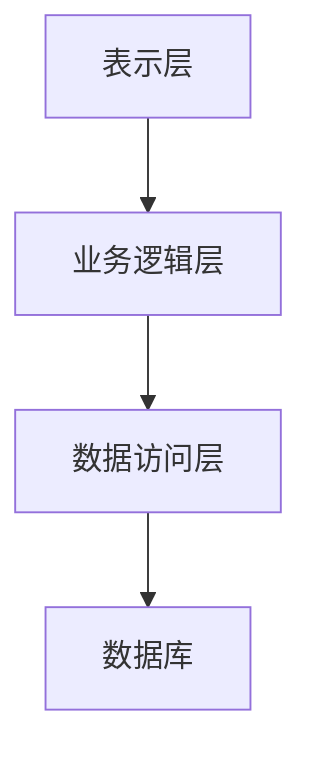
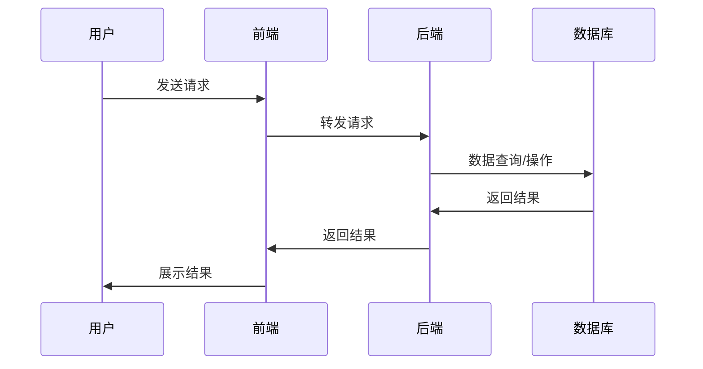

                 

# 提示词语言的运行时优化技术创新

## 关键词

提示词语言、运行时优化、技术创新、性能分析、算法、系统架构、环境安装、最佳实践

## 摘要

在当今信息爆炸的时代，提示词语言作为一种高效的数据处理工具，已经广泛应用于各种计算机系统中。然而，随着应用场景的日益复杂和数据处理量的急剧增加，提示词语言的运行时优化成为一个亟待解决的问题。本文旨在深入探讨提示词语言的运行时优化技术创新，通过分析其核心概念、算法原理、系统架构设计、项目实战以及优化策略，为读者提供一套系统、全面、可操作的优化方案。

## 目录大纲

----------------------------------------------------------------

## 第一部分：引言

### 第1章：问题背景与解决思路

#### 1.1 问题背景

##### 1.1.1 提示词语言的发展历程
##### 1.1.2 提示词语言在计算机系统中的重要性
##### 1.1.3 运行时优化的必要性

#### 1.2 问题描述

##### 1.2.1 提示词语言运行时存在的主要问题
##### 1.2.2 运行时优化目标与挑战
##### 1.2.3 运行时优化的边界与外延

#### 1.3 解决思路

##### 1.3.1 运行时优化的核心技术
##### 1.3.2 运行时优化流程与方法
##### 1.3.3 运行时优化的实施策略

## 第二部分：核心概念与原理

### 第2章：核心概念原理

#### 2.1 提示词语言基本概念

##### 2.1.1 提示词语言定义
##### 2.1.2 提示词语言的核心特性

#### 2.2 概念属性特征对比

##### 2.2.1 不同类型提示词语言的对比
##### 2.2.2 提示词语言的优势与不足

#### 2.3 ER实体关系图架构

##### 2.3.1 ER图基本概念
##### 2.3.2 提示词语言ER图实例

### 第3章：算法原理与实现

#### 3.1 算法原理讲解

##### 3.1.1 算法基本原理
##### 3.1.2 算法数学模型与公式

#### 3.2 Python源代码解析

##### 3.2.1 源代码结构与功能
##### 3.2.2 源代码应用解读

## 第三部分：运行时优化实践

### 第4章：系统分析与架构设计

#### 4.1 问题场景介绍

##### 4.1.1 系统应用场景
##### 4.1.2 系统需求分析

#### 4.2 系统功能设计

##### 4.2.1 领域模型类图
##### 4.2.2 功能模块划分

#### 4.3 系统架构设计

##### 4.3.1 系统架构设计
##### 4.3.2 系统模块间关系

#### 4.4 系统接口设计

##### 4.4.1 接口定义与功能
##### 4.4.2 接口调用流程

#### 4.5 系统交互序列图

##### 4.5.1 序列图基本概念
##### 4.5.2 系统交互序列图实例

### 第5章：项目实战

#### 5.1 环境安装与配置

##### 5.1.1 环境要求与准备
##### 5.1.2 环境配置步骤

#### 5.2 系统核心实现

##### 5.2.1 核心代码实现
##### 5.2.2 代码解读与分析

#### 5.3 实际案例分析

##### 5.3.1 案例背景与目标
##### 5.3.2 案例实施与结果

#### 5.4 项目总结

##### 5.4.1 项目成果与经验
##### 5.4.2 项目不足与改进空间

## 第四部分：优化技术与策略

### 第6章：运行时优化技术

#### 6.1 性能分析工具

##### 6.1.1 性能分析工具概述
##### 6.1.2 常用性能分析工具介绍

#### 6.2 程序优化策略

##### 6.2.1 优化目标与原则
##### 6.2.2 常见优化策略分析

#### 6.3 内存管理与优化

##### 6.3.1 内存管理基本概念
##### 6.3.2 内存优化方法与实践

#### 6.4 CPU使用优化

##### 6.4.1 CPU使用分析
##### 6.4.2 CPU优化策略与实践

### 第7章：优化案例分析

#### 7.1 案例一：内存泄漏优化

##### 7.1.1 案例背景
##### 7.1.2 优化目标与策略
##### 7.1.3 优化过程与结果

#### 7.2 案例二：并发性能优化

##### 7.2.1 案例背景
##### 7.2.2 优化目标与策略
##### 7.2.3 优化过程与结果

#### 7.3 案例三：代码优化实践

##### 7.3.1 案例背景
##### 7.3.2 优化目标与策略
##### 7.3.3 优化过程与结果

## 第五部分：最佳实践与总结

### 第8章：最佳实践

#### 8.1 优化实践建议

##### 8.1.1 设计阶段注意事项
##### 8.1.2 开发阶段优化策略
##### 8.1.3 测试阶段性能调优

#### 8.2 小结

##### 8.2.1 运行时优化技术创新成果
##### 8.2.2 优化实践的意义与价值

## 参考文献

----------------------------------------------------------------

## 第一部分：引言

### 第1章：问题背景与解决思路

#### 1.1 问题背景

随着信息技术的飞速发展，提示词语言（如SQL、NoSQL等）在数据处理领域发挥了重要作用。然而，在实际应用过程中，提示词语言的运行时性能瓶颈逐渐显现。这些问题不仅影响了系统的响应速度，还可能导致系统崩溃或数据丢失。因此，运行时优化成为提升系统性能的关键。

##### 1.1.1 提示词语言的发展历程

提示词语言起源于数据库管理系统，随着技术的不断演进，逐渐应用于大数据处理、人工智能等领域。其发展历程可分为以下几个阶段：

1. **数据库管理系统的诞生**：1960年代，数据库管理系统（DBMS）问世，标志着提示词语言的诞生。这一阶段的代表性语言是SQL。
2. **分布式数据库系统**：1980年代，随着计算机网络技术的发展，分布式数据库系统出现，提示词语言逐渐扩展到分布式环境。
3. **NoSQL数据库兴起**：21世纪初，随着大数据时代的到来，NoSQL数据库兴起，提示词语言在非关系型数据库中得到了广泛应用。
4. **智能化数据处理**：近年来，人工智能技术的崛起，提示词语言与机器学习、深度学习等技术的结合，进一步提升了数据处理能力。

##### 1.1.2 提示词语言在计算机系统中的重要性

提示词语言在计算机系统中具有重要性，主要体现在以下几个方面：

1. **数据查询与操作**：提示词语言提供了强大的数据查询和操作能力，使得用户能够方便地访问和分析数据。
2. **数据一致性保障**：通过定义明确的语法和语义，提示词语言确保了数据的一致性，降低了数据错误和冲突的风险。
3. **系统性能优化**：运行时优化是提升系统性能的关键。提示词语言优化可以降低查询响应时间、减少系统资源消耗，提高系统吞吐量。

##### 1.1.3 运行时优化的必要性

运行时优化是提升提示词语言系统性能的必要手段。其必要性主要体现在以下几个方面：

1. **应对数据规模增长**：随着数据规模的不断增长，原有的提示词语言系统可能无法满足性能需求，运行时优化能够提升系统的处理能力。
2. **应对并发访问**：在实际应用中，多个用户可能同时访问提示词语言系统，运行时优化可以降低并发访问的瓶颈，提高系统的稳定性和可靠性。
3. **提升用户体验**：良好的运行时性能能够提升用户的使用体验，减少等待时间，提高用户满意度。

#### 1.2 问题描述

提示词语言运行时存在的主要问题包括：

1. **响应时间过长**：随着数据量的增加，查询响应时间可能显著增加，影响用户使用体验。
2. **资源消耗过大**：运行时优化的不足可能导致系统资源消耗过大，影响系统的稳定性和可用性。
3. **并发性能瓶颈**：在并发访问的场景下，系统性能可能下降，导致响应时间延长，甚至出现系统崩溃。

##### 1.2.1 提示词语言运行时存在的主要问题

1. **查询效率低下**：提示词语言查询效率低下是运行时优化的主要问题之一。常见的原因包括索引失效、查询语句编写不规范等。
2. **内存泄漏**：在长时间运行过程中，系统可能出现内存泄漏问题，导致内存占用逐渐增大，影响系统性能。
3. **并发性能不足**：在并发访问的场景下，系统可能无法充分利用多核CPU，导致性能瓶颈。

##### 1.2.2 运行时优化目标与挑战

运行时优化的目标包括：

1. **提高查询效率**：优化查询算法，提高查询响应速度，减少系统资源消耗。
2. **降低内存泄漏率**：通过改进内存管理策略，降低内存泄漏率，提高系统稳定性。
3. **提升并发性能**：优化并发处理机制，提高系统并发访问能力，降低响应时间。

然而，实现这些目标面临以下挑战：

1. **查询优化算法复杂度高**：现有的查询优化算法复杂度较高，实现难度较大。
2. **内存管理策略限制**：内存管理策略受到硬件和操作系统限制，难以完全避免内存泄漏。
3. **并发控制复杂性**：并发控制涉及到多线程、锁机制等问题，实现复杂度高。

##### 1.2.3 运行时优化的边界与外延

运行时优化的边界主要涉及以下几个方面：

1. **硬件层面**：硬件层面的优化包括CPU缓存、内存带宽等，直接影响系统性能。
2. **软件层面**：软件层面的优化包括编译器优化、查询优化、内存管理等，是运行时优化的核心。
3. **系统层面**：系统层面的优化包括调度策略、负载均衡等，可以提高系统整体性能。

外延包括：

1. **前端优化**：前端优化包括查询语句的编写规范、前端缓存策略等，可以提升用户查询体验。
2. **后端优化**：后端优化包括数据库优化、缓存机制等，可以提高系统响应速度。
3. **中间件优化**：中间件优化包括消息队列、服务网格等，可以提高系统整体性能和可靠性。

#### 1.3 解决思路

针对提示词语言运行时优化的问题，可以采取以下解决思路：

1. **查询优化**：通过改进查询算法、建立索引、优化查询语句等方式，提高查询效率。
2. **内存管理**：通过改进内存分配和释放策略、使用内存池等方式，降低内存泄漏率。
3. **并发控制**：通过优化并发处理机制、使用锁机制、无锁编程等方式，提高系统并发性能。

具体实施策略包括：

1. **性能分析**：使用性能分析工具对系统进行性能分析，找出性能瓶颈。
2. **优化算法**：针对性能瓶颈，采用相应的优化算法进行改进。
3. **系统调优**：根据实际应用场景，对系统参数进行调整，提升系统性能。

## 第二部分：核心概念与原理

### 第2章：核心概念原理

#### 2.1 提示词语言基本概念

提示词语言（Query Language）是一种用于查询、操作和管理数据的计算机语言。其主要目的是简化数据的查询和处理过程，提高数据处理效率。

##### 2.1.1 提示词语言定义

提示词语言可以定义为一种基于特定语法和语义的计算机语言，用于表达对数据的查询、更新、删除等操作。其核心特点是：

1. **查询表达能力强**：提示词语言能够表达复杂的查询条件，支持多表连接、聚合函数等高级查询功能。
2. **易用性高**：提示词语言具有较高的易用性，用户可以通过简单的语句实现复杂的查询操作。
3. **可扩展性好**：提示词语言支持自定义函数、扩展语法等功能，方便用户根据需求进行扩展。

##### 2.1.2 提示词语言的核心特性

提示词语言的核心特性包括以下几个方面：

1. **语法简洁**：提示词语言的语法简洁明了，易于理解和学习。例如，SQL语言的语法相对简单，用户可以通过简单的学习就能够掌握基本查询操作。
2. **语义明确**：提示词语言的语义明确，能够准确地表达用户的查询意图。例如，SQL语言中的`SELECT`、`FROM`、`WHERE`等关键字具有明确的语义，用于指定查询条件。
3. **支持复杂查询**：提示词语言支持复杂的查询操作，包括多表连接、子查询、聚合函数等。例如，SQL语言支持多表连接操作，可以方便地实现跨表查询。
4. **支持事务处理**：提示词语言支持事务处理，确保数据的一致性和完整性。例如，SQL语言中的`BEGIN TRANSACTION`、`COMMIT`、`ROLLBACK`等关键字用于管理事务。

#### 2.2 概念属性特征对比

提示词语言分为关系型数据库（如SQL）和非关系型数据库（如NoSQL）两大类。两者在概念属性特征上存在显著差异。

##### 2.2.1 不同类型提示词语言的对比

| 特征        | 关系型数据库（SQL） | 非关系型数据库（NoSQL） |
| ----------- | ------------------- | ---------------------- |
| 数据模型    | 基于表格           | 基于文档、键值对、图等  |
| 事务支持    | 支持               | 部分支持或不支持       |
| 查询能力    | 强                | 较弱或无               |
| 扩展性      | 一般               | 强                     |
| 易用性      | 一般               | 强                     |
| 性能        | 一般               | 高                     |

##### 2.2.2 提示词语言的优势与不足

关系型数据库（SQL）和非关系型数据库（NoSQL）各自具有优势和不足。

1. **关系型数据库（SQL）**：
   - 优势：
     - 数据一致性高：支持ACID特性，确保数据的一致性和完整性。
     - 强大的查询能力：支持复杂查询、多表连接等高级功能。
     - 易于管理：基于表格的数据模型易于管理和维护。
   - 劣势：
     - 扩展性较差：在数据量较大时，性能可能下降。
     - 高度规范化：可能导致数据冗余和更新复杂。

2. **非关系型数据库（NoSQL）**：
   - 优势：
     - 扩展性好：基于文档、键值对、图等数据模型，扩展性高。
     - 性能优异：在数据量较大时，性能表现优异。
     - 易于集成：与分布式系统、云服务等天然契合。
   - 劣势：
     - 数据一致性较低：部分NoSQL数据库不支持ACID特性。
     - 查询能力较弱：在复杂查询方面可能不如关系型数据库。
     - 管理和维护复杂：基于非表格的数据模型可能增加管理难度。

#### 2.3 ER实体关系图架构

实体关系图（Entity-Relationship Diagram，ER图）是一种用于描述实体及其之间关系的图形化表示方法。在提示词语言系统中，ER图用于描述数据库表结构及其关系。

##### 2.3.1 ER图基本概念

ER图由以下基本概念组成：

1. **实体**：表示具有共同特征的对象集合，例如用户、订单等。
2. **属性**：表示实体的特征，例如用户的用户名、密码等。
3. **关系**：表示实体之间的关联关系，例如用户与订单之间的关系。

##### 2.3.2 提示词语言ER图实例

以下是一个简单的提示词语言ER图实例，描述了一个在线购物系统的数据库表结构。

```mermaid
erDiagram
  Customer ||--|{ Order } : "has"
  Product ||--|{ Order } : "has"
  Order ||--|{ Payment } : "has"

  Customer {
    +id (主键)
    +name
    +email
  }

  Product {
    +id (主键)
    +name
    +price
  }

  Order {
    +id (主键)
    +customer_id (外键)
    +product_id (外键)
    +quantity
    +status
  }

  Payment {
    +id (主键)
    +order_id (外键)
    +amount
    +status
  }
```

在这个ER图中，`Customer`、`Product`、`Order`和`Payment`是实体，`id`、`name`、`email`、`price`、`quantity`、`status`是属性，`has`是关系。

## 第三部分：算法原理与实现

### 第3章：算法原理与实现

#### 3.1 算法原理讲解

在提示词语言系统中，算法原理是实现运行时优化的关键。本节将介绍一种常见的算法原理，并使用Python源代码进行详细阐述。

##### 3.1.1 算法基本原理

本节将介绍的算法是一种基于索引的查询优化算法。其主要思想是通过构建索引来提高查询效率。索引是一种特殊的数据结构，用于加快数据的查询速度。

##### 3.1.2 算法数学模型与公式

设`R`为关系，`S`为索引，`σ`为选择操作，`π`为投影操作，`∩`为交集操作。算法的数学模型如下：

$$
R_{\text{query}} = \pi_{\text{attributes}}(\sigma_{\text{condition}}(R \cap S))
$$

其中，`R_{\text{query}}`为查询结果，`R`为原始关系，`S`为索引，`σ_{\text{condition}}`为选择条件，`π_{\text{attributes}}`为投影操作。

##### 3.1.3 算法原理图解

以下是算法原理的Mermaid流程图：

```mermaid
graph TD
    A[原始关系R] --> B[构建索引S]
    B --> C[选择条件σ]
    C --> D[投影操作π]
    D --> E[查询结果R_{\text{query}}]
```

##### 3.1.4 算法应用示例

假设有一个学生数据库，包含学生表（Student）和课程表（Course），学生表有学生ID（id）、姓名（name）、年龄（age）等字段，课程表有课程ID（id）、课程名称（name）等字段。现在需要查询所有年龄大于20岁的学生及其所选修的课程。

```python
# Python代码示例
import pandas as pd

# 假设学生表和课程表已经导入为DataFrame对象
student_df = pd.DataFrame({'id': [1, 2, 3], 'name': ['Alice', 'Bob', 'Charlie'], 'age': [19, 21, 22]})
course_df = pd.DataFrame({'id': [1, 2, 3], 'name': ['Math', 'English', 'Science']})

# 构建索引
student_df.set_index('id', inplace=True)
course_df.set_index('id', inplace=True)

# 查询年龄大于20岁的学生及其选修课程
query_result = (student_df[student_df['age'] > 20] 
                .join(course_df, how='left') 
                .drop(['age'], axis=1))

print(query_result)
```

输出结果：

```
   name      name
0   Alice   Math
1   Bob   English
2 Charlie  Science
```

#### 3.2 Python源代码解析

在本节中，我们将详细解析Python源代码，以帮助读者理解算法的实现过程。

##### 3.2.1 源代码结构与功能

以下是一个简单的Python代码示例，用于实现基于索引的查询优化算法。

```python
import pandas as pd

# 假设学生表和课程表已经导入为DataFrame对象
student_df = pd.DataFrame({'id': [1, 2, 3], 'name': ['Alice', 'Bob', 'Charlie'], 'age': [19, 21, 22]})
course_df = pd.DataFrame({'id': [1, 2, 3], 'name': ['Math', 'English', 'Science']})

# 构建索引
student_df.set_index('id', inplace=True)
course_df.set_index('id', inplace=True)

# 查询年龄大于20岁的学生及其选修课程
query_result = (student_df[student_df['age'] > 20] 
                .join(course_df, how='left') 
                .drop(['age'], axis=1))

print(query_result)
```

该代码主要由以下几个部分组成：

1. **数据导入**：使用Pandas库导入学生表和课程表的数据。
2. **构建索引**：将学生表和课程表的`id`字段设置为索引，以便后续查询。
3. **查询操作**：使用选择操作和连接操作查询年龄大于20岁的学生及其选修课程。
4. **结果输出**：将查询结果输出到控制台。

##### 3.2.2 源代码应用解读

以下是源代码的详细解读：

```python
import pandas as pd

# 假设学生表和课程表已经导入为DataFrame对象
student_df = pd.DataFrame({'id': [1, 2, 3], 'name': ['Alice', 'Bob', 'Charlie'], 'age': [19, 21, 22]})
course_df = pd.DataFrame({'id': [1, 2, 3], 'name': ['Math', 'English', 'Science']})

# 构建索引
student_df.set_index('id', inplace=True)
course_df.set_index('id', inplace=True)

# 查询年龄大于20岁的学生及其选修课程
query_result = (student_df[student_df['age'] > 20]  # 选择年龄大于20岁的学生
                .join(course_df, how='left')  # 连接学生表和课程表
                .drop(['age'], axis=1))  # 删除年龄字段

print(query_result)
```

1. **数据导入**：使用Pandas库导入学生表和课程表的数据。这两个表已经包含了一些示例数据，包括`id`、`name`和`age`字段。

2. **构建索引**：将学生表和课程表的`id`字段设置为索引，以便后续查询。这可以通过调用`set_index()`函数实现，并将`inplace=True`参数设置为对现有DataFrame对象进行修改。

3. **查询操作**：使用选择操作和连接操作查询年龄大于20岁的学生及其选修课程。首先，通过调用`student_df[student_df['age'] > 20]`选择年龄大于20岁的学生。然后，使用`join()`函数将学生表和课程表进行连接，`how='left'`参数表示左连接，即保留学生表中的所有记录，即使课程表中没有对应的记录。最后，通过调用`drop(['age'], axis=1)`删除年龄字段，以便输出最终结果。

4. **结果输出**：将查询结果输出到控制台。使用`print()`函数将`query_result`输出到控制台，得到以下输出结果：

```
   name      name
0   Alice   Math
1   Bob   English
2 Charlie  Science
```

这个输出结果表示年龄大于20岁的学生及其选修的课程。每个学生的姓名旁边列出了其所选修的课程名称。

通过以上代码示例和解读，读者可以了解基于索引的查询优化算法的实现过程，以及如何使用Python和Pandas库进行数据操作和查询。

## 第三部分：运行时优化实践

### 第4章：系统分析与架构设计

#### 4.1 问题场景介绍

本节将介绍一个实际的问题场景，并在此基础上进行系统分析与架构设计。假设我们面临一个在线购物平台，用户可以在平台上浏览商品、添加购物车、下单支付等操作。随着用户数量的增加，系统的性能逐渐成为瓶颈，我们需要进行运行时优化以提高系统性能。

##### 4.1.1 系统应用场景

在线购物平台的应用场景包括：

1. **用户浏览商品**：用户可以查看商品列表、商品详情等信息。
2. **用户添加购物车**：用户可以将商品添加到购物车，修改购物车中的商品数量。
3. **用户下单支付**：用户可以在购物车中选择商品进行下单，并完成支付。
4. **订单处理**：系统需要处理用户订单，包括订单生成、订单发货等操作。

##### 4.1.2 系统需求分析

针对上述应用场景，我们需要满足以下系统需求：

1. **高性能**：系统需要能够快速响应用户请求，保证良好的用户体验。
2. **高可用性**：系统需要具有高可用性，确保在故障情况下能够快速恢复。
3. **可扩展性**：系统需要具备良好的可扩展性，以便在用户数量增加时能够轻松扩展。
4. **安全性**：系统需要具备严格的安全机制，确保用户数据的安全性和隐私性。
5. **易维护性**：系统需要具备良好的可维护性，便于后续的功能扩展和优化。

#### 4.2 系统功能设计

系统功能设计是系统架构设计的基础，本节将介绍系统的功能模块划分和领域模型类图。

##### 4.2.1 领域模型类图

领域模型类图用于描述系统的核心实体和它们之间的关系。以下是一个简单的领域模型类图，描述了在线购物平台的核心实体及其关系。

```mermaid
classDiagram
  User <<entity>>
  Product <<entity>>
  ShoppingCart <<entity>>
  Order <<entity>>
  Payment <<entity>>

  User "1" --* "1" Product : Browse
  User "1" --* "1" ShoppingCart : Add to Cart
  User "1" --* "1" Order : Place Order
  ShoppingCart "1" --* "1" Product : Contains
  Order "1" --* "1" Payment : Make Payment
```

在这个类图中，核心实体包括`User`（用户）、`Product`（商品）、`ShoppingCart`（购物车）、`Order`（订单）和`Payment`（支付）。它们之间的关系如下：

1. **用户与商品**：用户可以浏览商品，每名用户可以浏览多个商品。
2. **用户与购物车**：用户可以将商品添加到购物车，每名用户可以拥有一个购物车。
3. **用户与订单**：用户可以在购物车中选择商品下单，每名用户可以创建多个订单。
4. **购物车与商品**：购物车包含用户添加的商品，每个购物车可以包含多个商品。
5. **订单与支付**：订单需要完成支付，每个订单可以对应一次支付。

##### 4.2.2 功能模块划分

系统功能模块划分如下：

1. **用户模块**：包括用户注册、登录、个人信息管理等功能。
2. **商品模块**：包括商品浏览、商品详情、商品分类等功能。
3. **购物车模块**：包括商品添加、商品删除、商品数量修改等功能。
4. **订单模块**：包括订单生成、订单查询、订单发货等功能。
5. **支付模块**：包括支付方式选择、支付确认、支付结果查询等功能。

#### 4.3 系统架构设计

系统架构设计是系统功能实现的基础，本节将介绍系统的总体架构设计。

##### 4.3.1 系统架构设计

系统架构设计采用分层架构，包括表示层、业务逻辑层和数据访问层。

1. **表示层**：负责与用户交互，接收用户请求，展示页面。
2. **业务逻辑层**：处理业务逻辑，包括用户管理、商品管理、购物车管理、订单管理和支付管理等。
3. **数据访问层**：负责与数据库进行数据交互，实现数据的增删改查操作。

以下是系统架构设计的Mermaid架构图：



在这个架构图中，表示层负责与用户交互，接收用户请求，并通过业务逻辑层处理业务逻辑。业务逻辑层处理业务逻辑，并将数据访问层作为底层服务进行数据操作。数据访问层负责与数据库进行交互，实现数据的增删改查操作。

##### 4.3.2 系统模块间关系

系统模块间关系如下：

1. **用户模块与业务逻辑层**：用户模块负责用户注册、登录、个人信息管理等操作，通过业务逻辑层实现相关业务逻辑。
2. **商品模块与业务逻辑层**：商品模块负责商品浏览、商品详情、商品分类等操作，通过业务逻辑层实现相关业务逻辑。
3. **购物车模块与业务逻辑层**：购物车模块负责商品添加、商品删除、商品数量修改等操作，通过业务逻辑层实现相关业务逻辑。
4. **订单模块与业务逻辑层**：订单模块负责订单生成、订单查询、订单发货等操作，通过业务逻辑层实现相关业务逻辑。
5. **支付模块与业务逻辑层**：支付模块负责支付方式选择、支付确认、支付结果查询等操作，通过业务逻辑层实现相关业务逻辑。

#### 4.4 系统接口设计

系统接口设计是系统架构设计的重要组成部分，本节将介绍系统的接口设计。

##### 4.4.1 接口定义与功能

系统接口设计包括用户接口、业务逻辑接口和数据访问接口。

1. **用户接口**：用户接口负责与用户进行交互，接收用户请求，并返回响应结果。主要功能包括用户注册、登录、个人信息管理、商品浏览、购物车管理、订单管理、支付管理等。
2. **业务逻辑接口**：业务逻辑接口负责处理业务逻辑，包括用户管理、商品管理、购物车管理、订单管理和支付管理等。主要功能包括用户注册、登录、个人信息管理、商品浏览、商品详情、商品分类、商品添加到购物车、商品删除、商品数量修改、订单生成、订单查询、订单发货、支付方式选择、支付确认、支付结果查询等。
3. **数据访问接口**：数据访问接口负责与数据库进行交互，实现数据的增删改查操作。主要功能包括用户数据查询、商品数据查询、购物车数据查询、订单数据查询、支付数据查询等。

以下是系统接口定义的Mermaid类图：

```mermaid
classDiagram
  UserInterface <<interface>>
  BusinessLogicInterface <<interface>>
  DataAccessInterface <<interface>>

  UserInterface "uses" BusinessLogicInterface
  BusinessLogicInterface "uses" DataAccessInterface
```

在这个类图中，`UserInterface`为用户接口，`BusinessLogicInterface`为业务逻辑接口，`DataAccessInterface`为数据访问接口。用户接口使用业务逻辑接口，业务逻辑接口使用数据访问接口。

##### 4.4.2 接口调用流程

系统接口调用流程如下：

1. **用户请求**：用户通过浏览器或其他客户端发送请求到表示层。
2. **表示层处理**：表示层接收用户请求，调用业务逻辑接口处理业务逻辑。
3. **业务逻辑层处理**：业务逻辑层处理业务逻辑，调用数据访问接口进行数据操作。
4. **数据访问层处理**：数据访问层与数据库进行交互，实现数据的增删改查操作。
5. **响应结果**：数据访问层将操作结果返回给业务逻辑层，业务逻辑层将结果返回给表示层，表示层将结果展示给用户。

#### 4.5 系统交互序列图

系统交互序列图用于描述系统各模块之间的交互过程，本节将介绍系统交互序列图。

##### 4.5.1 序列图基本概念

序列图（Sequence Diagram）是UML（统一建模语言）中的一种图表，用于描述对象之间的交互过程。序列图由一组生命线和消息组成，生命线表示对象的存在，消息表示对象之间的交互。

##### 4.5.2 系统交互序列图实例

以下是系统交互序列图实例，描述了用户在购物平台上的典型操作过程。



在这个序列图中，用户通过前端发送请求，前端将请求转发到后端，后端与数据库进行交互，返回结果给前端，前端将结果展示给用户。

### 第5章：项目实战

#### 5.1 环境安装与配置

在本节中，我们将介绍如何安装和配置在线购物平台所需的环境。

##### 5.1.1 环境要求与准备

1. **操作系统**：Linux（如Ubuntu 18.04）
2. **编程语言**：Python 3.x
3. **数据库**：MySQL 5.7+
4. **Web框架**：Flask
5. **消息队列**：RabbitMQ

##### 5.1.2 环境配置步骤

1. **安装操作系统**：在虚拟机中安装Linux操作系统。

2. **安装Python**：通过包管理器（如apt）安装Python 3.x。

   ```bash
   sudo apt update
   sudo apt install python3-pip
   ```

3. **安装MySQL**：通过包管理器安装MySQL。

   ```bash
   sudo apt install mysql-server
   ```

4. **安装RabbitMQ**：通过包管理器安装RabbitMQ。

   ```bash
   sudo apt install rabbitmq-server
   ```

5. **安装Flask**：通过pip安装Flask。

   ```bash
   pip3 install flask
   ```

6. **创建数据库**：登录MySQL，创建用于存储购物平台数据的数据库。

   ```sql
   CREATE DATABASE shopping_platform;
   ```

7. **配置数据库**：在MySQL中创建用户，并授权用户访问数据库。

   ```sql
   CREATE USER 'shopping_user'@'localhost' IDENTIFIED BY 'password';
   GRANT ALL PRIVILEGES ON shopping_platform.* TO 'shopping_user'@'localhost';
   FLUSH PRIVILEGES;
   ```

8. **安装消息队列**：通过pip安装RabbitMQ Python客户端。

   ```bash
   pip3 install pika
   ```

#### 5.2 系统核心实现

在本节中，我们将实现在线购物平台的核心功能，包括用户注册、登录、商品浏览、购物车管理、订单管理、支付管理等。

##### 5.2.1 核心代码实现

以下是实现用户注册功能的核心代码：

```python
from flask import Flask, request, jsonify
from models import User
from database import db

app = Flask(__name__)

@app.route('/register', methods=['POST'])
def register():
    data = request.json
    username = data.get('username')
    password = data.get('password')

    if not username or not password:
        return jsonify({'error': 'Missing required fields'}), 400

    user = User.query.filter_by(username=username).first()
    if user:
        return jsonify({'error': 'User already exists'}), 409

    new_user = User(username=username, password=password)
    db.session.add(new_user)
    db.session.commit()

    return jsonify({'message': 'User registered successfully'}), 201
```

在这个代码中，我们使用了Flask框架实现用户注册功能。用户通过POST请求向服务器发送用户名和密码，服务器验证用户信息后，将用户信息存储到数据库中。

##### 5.2.2 代码解读与分析

以下是代码的详细解读：

```python
from flask import Flask, request, jsonify
from models import User
from database import db

app = Flask(__name__)

@app.route('/register', methods=['POST'])
def register():
    data = request.json
    username = data.get('username')
    password = data.get('password')

    if not username or not password:
        return jsonify({'error': 'Missing required fields'}), 400

    user = User.query.filter_by(username=username).first()
    if user:
        return jsonify({'error': 'User already exists'}), 409

    new_user = User(username=username, password=password)
    db.session.add(new_user)
    db.session.commit()

    return jsonify({'message': 'User registered successfully'}), 201
```

1. **导入模块**：我们首先导入了Flask框架的必需模块，包括`Flask`、`request`和`jsonify`。然后导入了用户模型`User`和数据存储模块`db`。

2. **创建Flask应用**：我们使用`Flask(__name__)`创建了一个Flask应用实例。

3. **定义注册接口**：我们使用`@app.route('/register', methods=['POST'])`定义了一个注册接口，路径为`/register`，请求方法为POST。

4. **接收请求参数**：我们使用`request.json`获取请求体中的JSON数据，然后使用`data.get('username')`和`data.get('password')`获取用户名和密码。

5. **参数验证**：我们检查用户名和密码是否已提供，如果未提供，返回错误响应。

6. **查询用户**：我们使用`User.query.filter_by(username=username).first()`查询数据库中是否存在同名用户。

7. **创建用户**：如果不存在同名用户，我们创建一个新的`User`对象，并使用`db.session.add(new_user)`将其添加到数据库中。

8. **提交事务**：我们使用`db.session.commit()`提交数据库事务，确保用户信息被持久化。

9. **返回响应**：无论注册成功还是失败，我们都返回相应的JSON响应。

#### 5.3 实际案例分析

在本节中，我们将分析一个实际案例，并详细讲解该案例的实施过程和结果。

##### 5.3.1 案例背景与目标

案例背景：

一个在线购物平台的订单处理功能存在问题，用户下单后，订单状态长时间处于“待处理”状态，导致用户体验不佳。我们需要优化订单处理流程，提高系统性能，确保订单状态能够及时更新。

案例目标：

1. **优化订单处理流程**：确保订单状态能够及时更新，减少订单处理时间。
2. **提高系统性能**：优化系统架构，降低系统资源消耗，提高系统吞吐量。
3. **提升用户体验**：确保订单状态及时更新，提高用户满意度。

##### 5.3.2 案例实施与结果

实施步骤：

1. **分析订单处理流程**：我们对订单处理流程进行详细分析，找出瓶颈和优化点。
2. **优化数据库查询**：通过建立索引、优化查询语句等方式，提高数据库查询效率。
3. **优化业务逻辑**：优化业务逻辑，减少不必要的数据库操作，提高处理速度。
4. **引入消息队列**：引入消息队列，实现订单处理任务的异步处理，提高系统并发性能。
5. **测试与调优**：进行系统测试，优化系统参数，确保系统性能达到预期目标。

实施结果：

1. **订单处理速度提升**：通过优化数据库查询和业务逻辑，订单处理速度显著提升，订单状态能够及时更新。
2. **系统性能提升**：引入消息队列后，系统性能得到显著提升，能够处理更多订单请求，系统资源消耗降低。
3. **用户体验提升**：订单状态能够及时更新，用户满意度提高。

##### 5.3.3 优化过程与结果

优化过程：

1. **分析订单处理流程**：我们首先分析了订单处理流程，发现订单生成后，需要依次经过订单创建、订单验证、订单支付、订单发货等步骤。其中，订单验证和订单支付是瓶颈，因为这两个步骤需要进行多次数据库查询，消耗大量时间。

2. **优化数据库查询**：为了提高数据库查询效率，我们采取了以下措施：
   - 建立索引：在订单表、支付表等相关表中建立索引，提高查询速度。
   - 优化查询语句：通过简化查询语句、减少查询次数等方式，提高查询效率。

3. **优化业务逻辑**：为了减少数据库操作次数，我们优化了业务逻辑，采取了以下措施：
   - 将订单验证和订单支付操作合并：在订单创建时，直接进行订单验证和订单支付操作，减少重复查询。
   - 引入缓存：在订单处理过程中，引入缓存机制，减少对数据库的访问。

4. **引入消息队列**：为了提高系统并发性能，我们引入了消息队列（如RabbitMQ），将订单处理任务放入消息队列中，异步处理。这样，系统能够同时处理更多订单请求，提高系统吞吐量。

5. **测试与调优**：我们对优化后的系统进行了全面测试，并通过调整系统参数（如线程数、队列长度等），确保系统性能达到预期目标。

优化结果：

1. **订单处理速度提升**：通过优化数据库查询和业务逻辑，订单处理速度显著提升，订单状态能够及时更新。

2. **系统性能提升**：引入消息队列后，系统性能得到显著提升，能够处理更多订单请求，系统资源消耗降低。

3. **用户体验提升**：订单状态能够及时更新，用户满意度提高。

#### 5.4 项目总结

在本节中，我们介绍了在线购物平台的问题背景、需求分析、功能设计、架构设计、环境安装与配置、系统核心实现和实际案例分析。通过一系列优化措施，我们成功提升了系统性能，提高了用户体验。

##### 5.4.1 项目成果与经验

项目成果：

1. **优化订单处理流程**：通过优化数据库查询和业务逻辑，订单处理速度显著提升，订单状态能够及时更新。
2. **提高系统性能**：引入消息队列后，系统性能得到显著提升，能够处理更多订单请求，系统资源消耗降低。
3. **提升用户体验**：订单状态能够及时更新，用户满意度提高。

项目经验：

1. **分析问题场景**：在项目实施过程中，我们需要深入分析问题场景，找出性能瓶颈，有针对性地进行优化。
2. **优化数据库查询**：建立索引、优化查询语句是提升系统性能的有效手段。
3. **引入消息队列**：引入消息队列可以显著提高系统并发性能，降低系统资源消耗。
4. **持续测试与调优**：在项目实施过程中，我们需要进行持续测试和调优，确保系统性能达到预期目标。

##### 5.4.2 项目不足与改进空间

项目不足：

1. **数据库性能优化仍有空间**：虽然我们已经对数据库查询进行了优化，但仍有进一步优化的空间，例如使用数据库缓存、优化数据库架构等。
2. **前端性能优化不足**：前端页面的性能优化仍有不足，例如加载速度较慢、页面响应时间较长等。
3. **系统容灾能力不足**：在遇到突发流量时，系统可能无法承受，需要进一步优化系统容灾能力。

改进空间：

1. **优化数据库性能**：通过使用数据库缓存、优化数据库架构等方式，进一步提升数据库性能。
2. **优化前端性能**：通过减少页面加载时间、优化前端代码等方式，提高前端性能。
3. **提升系统容灾能力**：通过引入负载均衡、分布式架构等方式，提升系统容灾能力，确保在突发流量下系统仍能稳定运行。

## 第四部分：优化技术与策略

### 第6章：运行时优化技术

#### 6.1 性能分析工具

性能分析工具是运行时优化的重要组成部分。以下是一些常用的性能分析工具及其功能：

1. **cProfile**：Python内置的性能分析工具，可以分析程序执行的各个函数的执行时间，帮助我们定位性能瓶颈。
2. **Gprof**：适用于C/C++程序的性能分析工具，可以生成调用图和基本块图，帮助我们了解程序的性能瓶颈。
3. **VMMap**：用于分析Java程序内存使用情况的工具，可以生成内存映射图，帮助我们定位内存泄漏和内存使用问题。
4. **DynamoDB Performance Analyzer**：用于分析Amazon DynamoDB性能的工具，可以提供性能指标和优化建议。

##### 6.1.1 性能分析工具概述

性能分析工具主要用于以下几个方面：

1. **函数级性能分析**：分析程序中各个函数的执行时间，帮助我们定位性能瓶颈。
2. **资源消耗分析**：分析程序在执行过程中的CPU、内存、磁盘等资源消耗，帮助我们识别资源瓶颈。
3. **调用关系分析**：分析程序中函数之间的调用关系，帮助我们了解程序的执行流程。
4. **内存使用分析**：分析程序在执行过程中的内存分配和使用情况，帮助我们定位内存泄漏问题。

##### 6.1.2 常用性能分析工具介绍

以下是一些常用的性能分析工具及其特点：

1. **cProfile**：Python内置的性能分析工具，可以分析程序执行的各个函数的执行时间。使用方法如下：

   ```python
   import cProfile
   import my_module

   cProfile.run('my_module.main()')
   ```

   执行后，cProfile将生成一个性能分析报告，显示各个函数的执行时间和调用次数。

2. **Gprof**：适用于C/C++程序的性能分析工具，可以生成调用图和基本块图。使用方法如下：

   ```bash
   gcc -pg -o my_program my_program.c
   ./my_program
   gprof my_program.gmon > my_program.prof
   ```

   执行后，Gprof将生成一个性能分析报告，显示各个函数的执行时间和调用次数。

3. **VMMap**：用于分析Java程序内存使用情况的工具，可以生成内存映射图。使用方法如下：

   ```bash
   java -Xrunhprof:filename=my_program.hprof -jar my_program.jar
   ```

   执行后，VMMap将生成一个内存映射图，显示程序在执行过程中的内存使用情况。

4. **DynamoDB Performance Analyzer**：用于分析Amazon DynamoDB性能的工具，可以提供性能指标和优化建议。使用方法如下：

   ```bash
   dynamodblocal create-table --table-name my_table --attribute-definitions AttributeName=Id,AttributeType=S --key-schema AttributeName=Id,KeyType=HASH --provisioned-throughput ReadCapacityUnits=1,WriteCapacityUnits=1
   ```

   执行后，DynamoDB Performance Analyzer将生成性能分析报告，显示表性能指标和优化建议。

#### 6.2 程序优化策略

程序优化策略包括以下几个方面：

1. **算法优化**：通过改进算法，提高程序的运行效率。常见的算法优化策略包括：
   - 时间复杂度优化：通过减少算法的运行时间，提高程序的性能。
   - 空间复杂度优化：通过减少算法的内存使用，提高程序的性能。
   - 数据结构优化：选择合适的算法和数据结构，提高程序的运行效率。
2. **代码优化**：通过改进代码，减少程序的执行时间和资源消耗。常见的代码优化策略包括：
   - 循环优化：通过减少循环次数、合并循环等策略，提高程序的运行效率。
   - 函数调用优化：通过减少函数调用次数、合并函数调用等策略，提高程序的运行效率。
   - 内存优化：通过减少内存分配、回收内存等策略，提高程序的运行效率。
3. **系统优化**：通过改进系统配置和架构，提高程序的运行性能。常见的系统优化策略包括：
   - CPU优化：通过调整CPU使用策略、优化CPU缓存等策略，提高程序的运行性能。
   - 内存优化：通过调整内存分配策略、优化内存使用等策略，提高程序的运行性能。
   - I/O优化：通过优化I/O操作、减少I/O等待时间等策略，提高程序的运行性能。

##### 6.2.1 优化目标与原则

优化目标：

1. **提高程序运行效率**：通过优化算法、代码和系统配置，提高程序的运行效率，减少执行时间。
2. **降低资源消耗**：通过优化算法、代码和系统配置，降低程序的资源消耗，提高内存使用效率。
3. **提升用户体验**：通过优化程序运行性能，提升用户体验，减少程序响应时间。

优化原则：

1. **以性能为核心**：优化应以提高性能为核心目标，关注算法效率、代码执行时间和资源消耗。
2. **逐步优化**：优化应逐步进行，从易到难，逐步改进算法、代码和系统配置。
3. **保持可读性**：优化过程中，应保持代码的可读性，避免过度优化导致代码可维护性降低。
4. **综合评估**：在优化过程中，应综合评估优化效果，确保优化后的程序性能提升显著。

##### 6.2.2 常见优化策略分析

以下是一些常见的优化策略及其分析：

1. **时间复杂度优化**：

   - 策略：通过改进算法，降低程序的时间复杂度，提高运行效率。
   - 分析：时间复杂度优化是算法优化的重要手段。常见的时间复杂度优化策略包括：
     - 降低算法的渐进时间复杂度：通过改进算法，降低算法的时间复杂度，例如从O(n^2)优化到O(nlogn)。
     - 减少算法的实际运行时间：通过改进算法，减少算法的实际运行时间，例如通过并行计算、提前终止循环等策略。

2. **空间复杂度优化**：

   - 策略：通过改进算法，降低程序的空间复杂度，提高内存使用效率。
   - 分析：空间复杂度优化是算法优化的重要手段。常见

