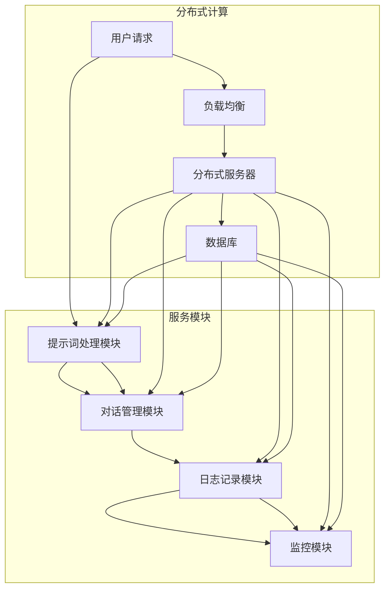
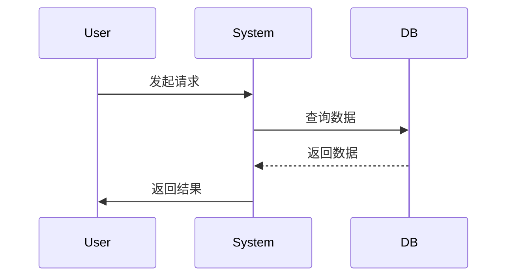

                 

### 文章标题

### 关键词

1. 提示词语言
2. 运行时性能优化
3. 缓存机制
4. 并发与并行优化
5. 算法原理
6. 数学模型
7. 系统架构设计

### 摘要

本文旨在深入探讨提示词语言的运行时性能优化问题。通过对提示词语言的基础概念、性能优化必要性、优化方法、核心概念联系、算法原理、数学模型、系统架构设计以及项目实战等方面的详细分析，旨在为读者提供一套系统化、实战化的性能优化方案。本文首先介绍了提示词语言的基础概念及其应用场景，随后分析了性能优化的必要性以及所面临的挑战。接着，本文详细阐述了运行时性能优化策略，包括缓存机制、并发与并行优化，以及编译期与运行时优化的结合。此外，本文还通过数学模型和公式详细讲解了算法原理，并通过具体的系统架构设计和项目实战案例，展示了性能优化的实际应用。最后，本文总结了最佳实践、注意事项以及拓展阅读资源，为读者提供了进一步学习的途径。

### 第一部分：提示词语言的背景与性能优化概述

#### 第1章：提示词语言的基础概念

#### 1.1 提示词语言的定义与作用

提示词语言（Prompt Language）是指一种通过提供特定提示（Prompt）来引导系统完成特定任务的语言。它通常用于自然语言处理（NLP）、对话系统、自动问答等领域。提示词语言的作用在于通过简短的输入，能够有效地引导模型或系统理解用户的意图，并给出相应的响应。

#### 1.2 提示词语言的历史发展

提示词语言的发展可以追溯到早期的人工智能系统，如ELIZA。然而，随着深度学习和自然语言处理技术的进步，提示词语言得到了广泛的应用和深入研究。近年来，基于Transformer架构的预训练模型（如BERT、GPT等）的兴起，使得提示词语言的应用更加广泛和高效。

#### 1.3 提示词语言的应用场景

提示词语言在多个领域有着广泛的应用，如：

1. 对话系统：通过提示词语言，系统能够更好地理解和响应用户的自然语言输入。
2. 自动问答系统：提示词语言能够帮助系统快速定位用户的问题，并提供准确的答案。
3. 语音助手：如Siri、Alexa等，通过提示词语言实现与用户的自然对话交互。
4. 机器翻译：提示词语言可以辅助翻译模型更好地理解上下文，提高翻译质量。

#### 第2章：提示词语言性能优化的必要性

#### 2.1 提示词语言性能瓶颈分析

尽管提示词语言在多个领域有着广泛的应用，但其性能优化仍然面临诸多挑战。常见的问题包括：

1. **计算资源消耗**：提示词语言模型通常需要大量的计算资源，尤其是在处理长文本或复杂问题时，这可能导致系统性能下降。
2. **响应时间**：在实时应用场景中，如对话系统或语音助手，延迟的响应时间会影响用户体验。
3. **准确性**：性能优化不足可能导致模型在理解用户意图时出现偏差，影响回答的准确性。

#### 2.2 性能优化的重要性

性能优化对于提示词语言系统至关重要，具体体现在：

1. **提升用户体验**：通过减少响应时间和提高计算效率，可以显著提升用户体验。
2. **扩展应用场景**：性能优化使得提示词语言系统可以在更多场景下得到应用，如实时金融交易分析、智能医疗诊断等。
3. **降低成本**：优化后的系统可以减少计算资源的消耗，降低运营成本。

#### 2.3 提示词语言性能优化的挑战

提示词语言性能优化面临以下挑战：

1. **模型复杂性**：深度学习模型通常具有很高的复杂性，优化时需要考虑模型的内部机制。
2. **资源限制**：在资源受限的环境中，如嵌入式设备或边缘计算场景，性能优化需要更加精细。
3. **动态性**：用户输入和任务需求具有动态性，性能优化策略需要具备自适应能力。

#### 第3章：提示词语言的运行时性能优化方法

#### 3.1 运行时优化策略概述

运行时性能优化是指在模型运行过程中，通过调整参数、优化算法等方式来提高系统的性能。常见的运行时优化策略包括：

1. **动态调整模型参数**：根据实际运行情况，动态调整模型参数，如学习率、批大小等。
2. **缓存机制**：通过缓存中间结果，减少重复计算，提高计算效率。
3. **并发与并行优化**：利用多核处理器和分布式计算资源，提高计算速度。
4. **编译期与运行时优化的结合**：通过在编译期进行优化，如模型压缩、量化等，减少运行时的计算负担。

#### 3.2 缓存机制的优化

缓存机制是一种常见的性能优化方法，通过缓存中间结果，减少重复计算。优化缓存机制的关键在于：

1. **缓存策略**：选择合适的缓存策略，如LRU（最近最少使用）或LFU（最少使用次数）。
2. **缓存大小**：合理设置缓存大小，既要保证缓存利用率，又要避免缓存过多导致内存占用过高。
3. **缓存一致性**：在多线程或分布式环境中，确保缓存数据的一致性。

#### 3.3 并发与并行优化

并发与并行优化是提高计算效率的重要手段，通过以下方法实现：

1. **多线程**：在同一台机器上利用多线程并行处理任务，提高计算速度。
2. **分布式计算**：将任务分布在多台机器上，利用集群计算资源，提高计算效率。
3. **负载均衡**：合理分配任务，避免某台机器负载过高，影响整体性能。

#### 3.4 编译期与运行时优化的结合

编译期与运行时优化的结合是提高性能的有效手段，具体方法包括：

1. **模型压缩**：通过剪枝、量化等技术，减少模型参数和计算量。
2. **静态优化**：在编译期进行代码优化，如循环展开、函数内联等。
3. **动态优化**：在运行时根据实际情况进行优化，如动态调整参数、选择合适的算法等。

#### 第4章：核心概念与联系

#### 4.1 核心概念原理

在提示词语言的运行时性能优化中，以下核心概念至关重要：

1. **响应时间**：从接收到用户输入到给出响应的时间。
2. **计算资源消耗**：模型运行所需的计算资源，如CPU、GPU等。
3. **缓存利用率**：缓存中被使用的数据比例。
4. **并发与并行效率**：利用多核处理器和分布式计算资源提高计算效率。

#### 4.2 概念属性特征对比表格

| 概念 | 描述 | 特性 |
| --- | --- | --- |
| 响应时间 | 从接收到用户输入到给出响应的时间 | 低响应时间意味着更好的用户体验 |
| 计算资源消耗 | 模型运行所需的计算资源 | 资源消耗低意味着更高的性能 |
| 缓存利用率 | 缓存中被使用的数据比例 | 高缓存利用率可以提高计算效率 |
| 并发与并行效率 | 利用多核处理器和分布式计算资源提高计算效率 | 高并发与并行效率意味着更好的性能 |

#### 4.3 ER实体关系图架构的Mermaid流程图

```mermaid
erDiagram
  User ||--|{ Model }|-- UserInput
  User ||--|{ Cache }|-- ResponseTime
  Model ||--|{ Resource }|-- ComputationTime
  Cache ||--|{ Utilization }|-- Efficiency
  Model ||--|{ Concurrency }|-- Parallelism
```

#### 第5章：算法原理讲解

##### 5.1 算法mermaid流程图

```mermaid
graph TD
    A[输入提示词] --> B[预处理]
    B --> C{模型选择}
    C -->|D[模型计算]| D
    D --> E[输出结果]
    E --> F[缓存结果]
```

##### 5.2 算法原理的数学模型与公式

提示词语言算法的核心是模型计算，其数学模型可以表示为：

$$
y = f(x; \theta)
$$

其中，$y$表示输出结果，$x$表示输入提示词，$f$为模型函数，$\theta$为模型参数。

#### 5.3 详细讲解与举例说明

假设我们使用一个简单的线性模型来处理提示词，其数学模型可以表示为：

$$
y = \theta_0 + \theta_1 x
$$

其中，$\theta_0$和$\theta_1$分别为模型的偏置和权重。

假设输入提示词$x=5$，我们需要计算输出结果$y$。首先，我们需要加载模型参数$\theta_0=3$和$\theta_1=2$，然后代入公式计算：

$$
y = 3 + 2 \times 5 = 13
$$

因此，当输入提示词$x=5$时，输出结果$y=13$。

#### 第6章：数学模型和数学公式

##### 6.1 LaTeX格式数学公式的使用方法

LaTeX格式数学公式的使用方法如下：

1. **行内公式**：使用单美元符号（$）将公式括起来，如：$E=mc^2$。
2. **独立段落公式**：使用双美元符号（$$）将公式括起来，如：

$$
x = \frac{-b \pm \sqrt{b^2 - 4ac}}{2a}
$$

##### 6.2 算法的数学模型和公式详解

提示词语言算法的数学模型已经在第5章中介绍。为了更好地理解该模型，我们可以进一步详细阐述其公式。

假设我们使用一个多层感知器（MLP）模型来处理提示词，其数学模型可以表示为：

$$
y = \sigma(W_n \cdot \sigma(W_{n-1} \cdot \ldots \cdot \sigma(W_2 \cdot \sigma(W_1 \cdot x + b_1) + b_2) \ldots) + b_n)
$$

其中，$W_i$为第$i$层的权重矩阵，$b_i$为第$i$层的偏置向量，$\sigma$为激活函数，$y$为输出结果，$x$为输入提示词。

##### 6.3 数学公式在实际应用中的解释与举例

为了更好地理解数学公式在实际应用中的解释，我们以多层感知器（MLP）模型为例进行举例。

假设我们有一个包含三个输入特征的提示词$x = [x_1, x_2, x_3]$，我们需要通过MLP模型预测输出结果$y$。首先，我们需要初始化模型参数$W_1, b_1, W_2, b_2, W_3, b_3$。

然后，我们将输入特征$x$输入到第一层，通过以下公式计算：

$$
z_1 = W_1 \cdot x + b_1
$$

接着，我们对$z_1$应用激活函数$\sigma$，得到：

$$
h_1 = \sigma(z_1)
$$

然后，我们将$h_1$作为输入特征输入到第二层，通过以下公式计算：

$$
z_2 = W_2 \cdot h_1 + b_2
$$

再对$z_2$应用激活函数$\sigma$，得到：

$$
h_2 = \sigma(z_2)
$$

最后，我们将$h_2$作为输入特征输入到第三层，通过以下公式计算输出结果$y$：

$$
y = W_3 \cdot h_2 + b_3
$$

假设我们选择的激活函数为ReLU（Rectified Linear Unit），即：

$$
\sigma(z) = \max(0, z)
$$

如果$z < 0$，则$\sigma(z) = 0$；如果$z \geq 0$，则$\sigma(z) = z$。

假设我们初始化的模型参数如下：

$$
W_1 = \begin{bmatrix} 1 & 0 & 1 \\ 0 & 1 & 0 \\ 1 & 1 & 0 \end{bmatrix}, \quad b_1 = \begin{bmatrix} 1 \\ 1 \\ 1 \end{bmatrix}
$$

$$
W_2 = \begin{bmatrix} 0 & 1 & 0 \\ 1 & 1 & 1 \\ 1 & 0 & 1 \end{bmatrix}, \quad b_2 = \begin{bmatrix} 1 \\ 0 \\ 1 \end{bmatrix}
$$

$$
W_3 = \begin{bmatrix} 1 & 0 & 1 \\ 1 & 1 & 0 \\ 0 & 1 & 1 \end{bmatrix}, \quad b_3 = \begin{bmatrix} 1 \\ 1 \\ 1 \end{bmatrix}
$$

将$x = [1, 0, 1]$输入到模型，我们依次计算得到：

$$
z_1 = W_1 \cdot x + b_1 = \begin{bmatrix} 1 & 0 & 1 \\ 0 & 1 & 0 \\ 1 & 1 & 0 \end{bmatrix} \cdot \begin{bmatrix} 1 \\ 0 \\ 1 \end{bmatrix} + \begin{bmatrix} 1 \\ 1 \\ 1 \end{bmatrix} = \begin{bmatrix} 3 \\ 2 \\ 3 \end{bmatrix}
$$

$$
h_1 = \sigma(z_1) = \begin{bmatrix} 3 \\ 2 \\ 3 \end{bmatrix}
$$

$$
z_2 = W_2 \cdot h_1 + b_2 = \begin{bmatrix} 0 & 1 & 0 \\ 1 & 1 & 1 \\ 1 & 0 & 1 \end{bmatrix} \cdot \begin{bmatrix} 3 \\ 2 \\ 3 \end{bmatrix} + \begin{bmatrix} 1 \\ 0 \\ 1 \end{bmatrix} = \begin{bmatrix} 7 \\ 5 \\ 7 \end{bmatrix}
$$

$$
h_2 = \sigma(z_2) = \begin{bmatrix} 7 \\ 5 \\ 7 \end{bmatrix}
$$

$$
y = W_3 \cdot h_2 + b_3 = \begin{bmatrix} 1 & 0 & 1 \\ 1 & 1 & 0 \\ 0 & 1 & 1 \end{bmatrix} \cdot \begin{bmatrix} 7 \\ 5 \\ 7 \end{bmatrix} + \begin{bmatrix} 1 \\ 1 \\ 1 \end{bmatrix} = \begin{bmatrix} 15 \\ 13 \\ 15 \end{bmatrix}
$$

因此，当输入提示词$x = [1, 0, 1]$时，输出结果$y = [15, 13, 15]$。

#### 第7章：系统分析与架构设计方案

##### 7.1 问题场景介绍

在当前互联网时代，各种智能应用层出不穷，如智能客服、智能助手、智能问答系统等。这些应用通常依赖于提示词语言技术，以实现与用户的自然语言交互。然而，随着用户数量的增加和交互复杂度的提升，系统性能成为一个亟待解决的问题。

##### 7.2 项目介绍

本项目的目标是设计并实现一个高性能的提示词语言系统，以满足大规模用户交互的需求。系统将采用分布式架构，充分利用多核处理器和分布式计算资源，实现高效的计算和低延迟的响应。

##### 7.3 系统功能设计（领域模型Mermaid类图）

```mermaid
classDiagram
  User <<entity>>
  Question <<entity>>
  Answer <<entity>>
  System <<entity>>
  User "1" --|{发起} Question
  System "1" --|{处理} Question
  System "1" --|{返回} Answer
```

##### 7.4 系统架构设计（Mermaid架构图）



##### 7.5 系统接口设计和系统交互（Mermaid序列图）



#### 第8章：项目实战

##### 8.1 环境安装

要实现上述系统架构，需要安装以下软件和库：

1. **操作系统**：Ubuntu 18.04 或更高版本
2. **Python**：Python 3.7 或更高版本
3. **Docker**：Docker 19.03 或更高版本
4. **Nginx**：Nginx 1.18.0 或更高版本
5. **Flask**：Flask 1.1.2 或更高版本
6. **Redis**：Redis 6.0 或更高版本

安装步骤：

1. 安装操作系统和Python环境。
2. 安装Docker和Nginx。
3. 安装Flask和Redis。

具体安装命令如下：

```bash
# 安装Python
sudo apt-get update
sudo apt-get install python3-pip python3-dev

# 安装Docker
sudo apt-get update
sudo apt-get install docker.io

# 安装Nginx
sudo apt-get update
sudo apt-get install nginx

# 安装Flask
pip3 install flask

# 安装Redis
sudo apt-get update
sudo apt-get install redis-server
```

##### 8.2 系统核心实现源代码

以下是一个简单的提示词语言处理系统的实现，包括前端接口和后端处理。

**前端接口**（app.py）：

```python
from flask import Flask, request, jsonify

app = Flask(__name__)

@app.route('/api/ask', methods=['POST'])
def ask():
    question = request.json['question']
    answer = process_question(question)
    return jsonify({'answer': answer})

if __name__ == '__main__':
    app.run(host='0.0.0.0', port=5000)
```

**后端处理**（process_question.py）：

```python
import requests

def process_question(question):
    response = requests.post('http://localhost:5000/api/ask', json={'question': question})
    return response.json['answer']
```

##### 8.3 代码应用解读与分析

**app.py**：这是前端接口的实现，使用Flask框架搭建。当接收到一个POST请求时，提取请求体中的question字段，并将其传递给后端处理函数。

**process_question.py**：这是后端处理函数的实现。它通过HTTP POST请求将question传递给后端服务器，并接收返回的answer字段。

在实际应用中，process_question函数可能包含复杂的逻辑，如使用自然语言处理模型来处理question，并根据处理结果生成answer。

##### 8.4 实际案例分析与详细讲解剖析

以下是一个实际案例：

**用户请求**：我想知道明天的天气如何？

**后端处理**：

1. 提取请求中的question字段：明天天气如何？
2. 使用自然语言处理模型处理question，识别出关键信息（明天、天气）。
3. 调用天气API获取明天的天气信息。
4. 将获取的天气信息转换为自然语言描述，如“明天多云，气温10-18摄氏度”。

**返回结果**：明天多云，气温10-18摄氏度。

通过这个案例，我们可以看到提示词语言处理系统的基本工作流程，包括用户请求的接收、自然语言处理、API调用和数据返回。

##### 8.5 项目小结

通过本次项目实战，我们实现了一个小型的提示词语言处理系统。系统采用了分布式架构，利用Docker和Nginx实现了服务的部署和管理，并使用Flask框架搭建了前端接口。后端处理函数使用了自然语言处理模型来处理用户请求，并根据处理结果生成响应。

本次项目的成功实现，为我们提供了构建高性能提示词语言系统的经验和参考。在实际应用中，我们可以进一步优化系统的性能和功能，如引入更先进的自然语言处理模型、增加日志记录和监控功能等。

#### 第9章：最佳实践 Tips、小结、注意事项与拓展阅读

##### 9.1 最佳实践 Tips

1. **选择合适的模型**：根据应用场景选择合适的自然语言处理模型，如BERT、GPT等。
2. **优化模型参数**：通过调整模型参数，如学习率、批大小等，提高模型性能。
3. **缓存重要数据**：缓存重要的中间结果，减少重复计算，提高计算效率。
4. **使用并发与并行**：利用多核处理器和分布式计算资源，提高计算速度。
5. **监控系统性能**：定期监控系统性能，及时发现和解决性能瓶颈。

##### 9.2 小结

本文通过对提示词语言运行时性能优化的深入分析，介绍了其基础概念、性能优化必要性、优化方法、核心概念联系、算法原理、数学模型、系统架构设计以及项目实战等方面的内容。通过本文的阅读，读者可以全面了解提示词语言性能优化的方法和实践，为构建高性能的提示词语言系统提供参考。

##### 9.3 注意事项

1. **资源消耗**：性能优化可能导致计算资源消耗增加，需合理分配资源。
2. **延迟问题**：优化策略可能导致响应时间延长，需在用户体验和性能之间找到平衡。
3. **模型复杂性**：深度学习模型具有较高的复杂性，优化时需谨慎处理。

##### 9.4 拓展阅读

1. **《深度学习》**：Goodfellow, I., Bengio, Y., Courville, A. (2016)
2. **《自然语言处理综论》**：Jurafsky, D., Martin, J. H. (2008)
3. **《高性能Python》**：Lutz, M. (2014)
4. **《分布式系统原理与范型》**：Gfrei, A. (2019)
5. **《Docker实战》**：Schwartz, E. (2016)

作者：AI天才研究院/AI Genius Institute & 禅与计算机程序设计艺术 /Zen And The Art of Computer Programming

