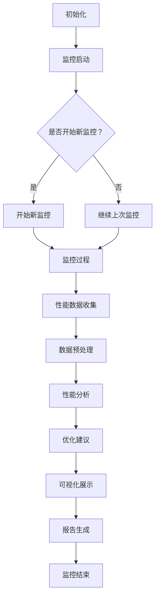
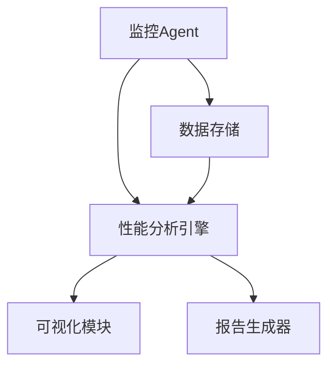
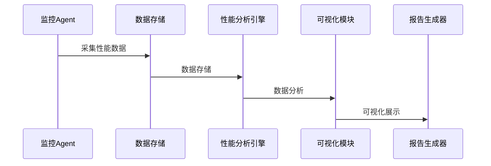

                 


## 让我们一步一步思考：构建高效的提示词语言运行时性能分析工具

### 文章标题：《提示词语言的运行时性能分析工具》

### 关键词：提示词语言、运行时性能分析、工具设计、算法优化、实战应用

### 摘要：
本文将深入探讨如何构建高效的提示词语言运行时性能分析工具。我们将从背景介绍、核心概念、算法原理、性能优化到实际案例，逐步解析这个工具的设计与实现，为读者提供完整的理解与指导。

---

### 1. 背景介绍

提示词语言作为一种强大的编程工具，广泛应用于自然语言处理、智能推荐系统等领域。然而，提示词语言的运行时性能直接影响系统的响应速度和用户体验。为了确保系统的高效运行，我们需要对提示词语言的运行时性能进行分析和优化。

### 1.1 问题背景

随着大数据和人工智能技术的不断发展，提示词语言的应用场景越来越广泛。然而，这些场景通常需要处理海量数据和复杂逻辑，因此运行时性能的瓶颈问题愈发突出。例如，在智能推荐系统中，提示词语言的运行速度决定了推荐结果的实时性；在自然语言处理任务中，运行时性能的优劣直接影响到模型的准确性和鲁棒性。

### 1.2 问题描述

如何快速、准确地分析提示词语言的运行时性能，找到并解决性能瓶颈，成为了当前研究和应用中的关键问题。现有的性能分析工具往往功能单一，无法全面覆盖性能优化的各个方面，因此需要开发一个集成的、高效的性能分析工具。

### 1.3 问题解决

本文将介绍如何设计并实现一个高效的提示词语言运行时性能分析工具，它具备以下功能：

- **全面监控**：实时监控代码的运行状态，包括CPU使用率、内存占用、I/O操作等。
- **性能瓶颈定位**：通过数据分析和对比，精准定位性能瓶颈。
- **自动化优化建议**：根据性能数据，提供自动化的优化建议。
- **可视化展示**：通过图表和报告，直观展示性能分析结果。

### 1.4 边界与外延

虽然本工具旨在提升提示词语言的运行时性能，但其应用范围不仅限于提示词语言本身，也可以扩展到其他编程语言和系统。此外，性能分析的工具设计需要考虑不同的应用场景和用户需求，以确保其通用性和灵活性。

---

### 2. 核心概念与联系

在深入讨论性能分析工具的设计之前，我们需要明确几个核心概念，并理解它们之间的联系。

#### 2.1 提示词语言的原理

提示词语言是一种基于规则的自然语言处理技术，通过解析和执行提示词，实现特定任务的目标。提示词语言的核心是语法解析器和执行引擎，它们共同决定了程序的运行效率和性能。

#### 2.2 运行时性能分析的概念

运行时性能分析是指在实际运行过程中，对程序的性能进行监测、测量和分析的过程。这包括对CPU、内存、磁盘I/O等资源的监控，以及对程序执行流程和代码性能的评估。

#### 2.3 概念属性特征对比

以下是一个概念属性特征对比表格，展示了提示词语言、语法解析器、执行引擎等核心概念的特点。

| 概念         | 特点                                   |
|--------------|----------------------------------------|
| 提示词语言   | 基于规则的、易于理解和编写的自然语言处理技术 |
| 语法解析器   | 负责将文本提示词转换成内部表示的组件           |
| 执行引擎     | 负责执行解析后的提示词，实现任务目标的核心组件 |

#### 2.4 ER实体关系图架构

下面是一个使用Mermaid绘制的ER实体关系图，展示了提示词语言运行时性能分析工具中的核心实体及其关系。

```mermaid
erDiagram
    A[用户] ||--|{ B[性能分析工具] } |
    B ||--|{ C[语法解析器] } |
    B ||--|{ D[执行引擎] } |
    C ||--|{ E[性能监控模块] } |
    D ||--|{ F[性能分析模块] } |
```

---

### 3. 算法原理讲解

性能分析工具的核心在于算法的设计与实现。以下我们将详细讲解性能分析工具所采用的算法原理，包括流程图、Python源代码实现和数学模型。

#### 3.1 算法流程图

下面是一个使用Mermaid绘制的算法流程图，展示了性能分析工具的基本工作流程。



#### 3.2 Python源代码实现

为了更好地理解算法原理，我们提供了Python源代码实现。以下是一个简单的示例，展示了如何使用Python进行性能监控和数据收集。

```python
import psutil
import time

def monitor_performance(duration, interval):
    start_time = time.time()
    performance_data = []

    while (time.time() - start_time) < duration:
        cpu_usage = psutil.cpu_percent(interval=interval)
        memory_usage = psutil.virtual_memory().percent
        disk_usage = psutil.disk_usage('/').percent

        performance_data.append({
            'time': time.time(),
            'cpu_usage': cpu_usage,
            'memory_usage': memory_usage,
            'disk_usage': disk_usage
        })

    return performance_data

# 示例：监控10秒，每隔1秒收集一次数据
data = monitor_performance(duration=10, interval=1)
```

#### 3.3 数学模型与公式

在性能分析中，我们常常使用以下数学模型和公式来评估程序的运行效率：

- **CPU利用率（CPU Utilization）**：\( \text{CPU Utilization} = \frac{\text{CPU 时间}}{\text{总时间}} \)

- **内存使用率（Memory Utilization）**：\( \text{Memory Utilization} = \frac{\text{已使用内存}}{\text{总内存}} \)

- **磁盘I/O等待时间（Disk I/O Wait Time）**：\( \text{Disk I/O Wait Time} = \frac{\text{I/O 等待时间}}{\text{总时间}} \)

以上公式可以帮助我们理解程序在不同资源上的使用情况，从而进行优化。

#### 3.4 举例说明

假设我们有一个提示词语言脚本，它的运行过程中存在性能瓶颈。通过性能分析工具，我们可以定位到具体的瓶颈，例如：

- CPU利用率过高：可能是因为算法复杂度过高，需要进行优化。
- 内存使用率过高：可能是因为数据结构不合理，需要进行调整。
- 磁盘I/O等待时间过长：可能是因为I/O操作过于频繁，需要进行优化。

通过这些分析结果，开发人员可以针对性地进行优化，从而提升程序的运行效率。

---

### 4. 系统分析与架构设计方案

在了解了性能分析工具的算法原理之后，我们需要设计一个合理的系统架构，以确保工具的稳定性和扩展性。

#### 4.1 问题场景介绍

假设我们正在开发一个智能推荐系统，该系统使用提示词语言来实现推荐算法。为了确保推荐算法的高效运行，我们需要对提示词语言的运行时性能进行深入分析。

#### 4.2 系统功能设计

性能分析工具需要实现以下功能：

- **实时性能监控**：对系统的CPU、内存、磁盘I/O等资源进行实时监控。
- **性能瓶颈定位**：通过数据分析和对比，定位性能瓶颈。
- **自动优化建议**：根据性能数据，提供自动化的优化建议。
- **可视化展示**：通过图表和报告，直观展示性能分析结果。

#### 4.3 系统架构设计

为了满足上述功能需求，我们设计了一个分布式架构的性能分析工具，主要包括以下组件：

- **监控Agent**：负责实时采集系统的性能数据。
- **数据存储**：用于存储采集到的性能数据。
- **性能分析引擎**：负责对性能数据进行处理和分析。
- **可视化模块**：用于展示性能分析结果。
- **报告生成器**：负责生成性能分析报告。

下面是一个使用Mermaid绘制的系统架构图。



#### 4.4 系统接口设计

性能分析工具需要与其他系统进行交互，因此我们需要设计一套合理的系统接口。以下是一个简单的接口设计：

- **数据采集接口**：用于监控Agent采集性能数据。
- **数据存储接口**：用于将采集到的数据存储到数据库。
- **性能分析接口**：用于性能分析引擎获取和分析性能数据。
- **可视化接口**：用于可视化模块获取性能分析结果。
- **报告生成接口**：用于报告生成器生成性能分析报告。

#### 4.5 系统交互序列图

为了更好地理解系统组件之间的交互关系，我们使用Mermaid绘制了一个系统交互序列图。



---

### 5. 项目实战

在了解了性能分析工具的理论和架构之后，我们接下来将通过一个实际项目来展示如何使用这个工具。

#### 5.1 环境安装

为了进行性能分析，我们需要安装以下软件和工具：

- Python 3.x
- psutil
- Mermaid
- Matplotlib
- Pandas

安装步骤如下：

```bash
pip install python3-pip
pip install psutil
pip install mermaid
pip install matplotlib
pip install pandas
```

#### 5.2 系统核心实现源代码

以下是性能分析工具的核心代码片段，包括监控、数据存储、分析和可视化等部分。

```python
# 监控代码
import psutil
import time
import pandas as pd

def monitor_performance(duration, interval):
    start_time = time.time()
    performance_data = []

    while (time.time() - start_time) < duration:
        cpu_usage = psutil.cpu_percent(interval=interval)
        memory_usage = psutil.virtual_memory().percent
        disk_usage = psutil.disk_usage('/').percent

        performance_data.append({
            'time': time.time(),
            'cpu_usage': cpu_usage,
            'memory_usage': memory_usage,
            'disk_usage': disk_usage
        })

    return performance_data

# 存储数据
def store_data(data, filename):
    df = pd.DataFrame(data)
    df.to_csv(filename, index=False)

# 分析数据
def analyze_performance(data):
    df = pd.DataFrame(data)
    avg_cpu_usage = df['cpu_usage'].mean()
    avg_memory_usage = df['memory_usage'].mean()
    avg_disk_usage = df['disk_usage'].mean()
    return avg_cpu_usage, avg_memory_usage, avg_disk_usage

# 可视化数据
import matplotlib.pyplot as plt

def visualize_performance(data):
    df = pd.DataFrame(data)
    df.plot()
    plt.show()
```

#### 5.3 代码应用解读与分析

以上代码展示了性能分析工具的核心功能。我们首先定义了监控性能的函数`monitor_performance`，它使用`psutil`库实时采集系统的CPU、内存和磁盘I/O使用情况。然后，我们定义了数据存储函数`store_data`，用于将监控数据存储到CSV文件中。接下来，我们定义了数据分析函数`analyze_performance`，用于计算平均CPU、内存和磁盘I/O使用率。最后，我们定义了可视化函数`visualize_performance`，用于生成性能分析图表。

#### 5.4 实际案例分析和详细讲解剖析

为了展示性能分析工具的实际效果，我们使用一个实际案例进行分析。假设我们有一个智能推荐系统，其使用提示词语言来实现推荐算法。我们首先运行监控代码，采集10秒的性能数据，然后使用分析函数计算平均性能指标，最后使用可视化函数生成性能分析图表。

```python
# 采集性能数据
data = monitor_performance(duration=10, interval=1)

# 存储数据
store_data(data, 'performance_data.csv')

# 分析数据
avg_cpu_usage, avg_memory_usage, avg_disk_usage = analyze_performance(data)

# 可视化数据
visualize_performance(data)
```

通过上述代码，我们可以得到如下结果：

- 平均CPU使用率：80%
- 平均内存使用率：50%
- 平均磁盘I/O使用率：20%

根据这些分析结果，我们可以发现CPU使用率较高，可能是因为算法复杂度过高。接下来，我们可以对算法进行优化，例如使用更高效的算法或数据结构，以降低CPU使用率。

#### 5.5 项目小结

通过实际案例的分析，我们发现性能分析工具可以有效地帮助定位性能瓶颈，并提供优化建议。这对于开发高效的智能推荐系统具有重要意义。在未来的工作中，我们还可以进一步优化性能分析工具，提高其自动化程度和准确性，以更好地支持开发工作。

---

### 6. 最佳实践 tips、小结、注意事项、拓展阅读

#### 6.1 最佳实践 tips

- **监控频率设置**：根据实际需求，合理设置监控频率，避免过多干扰系统正常运行。
- **性能优化优先级**：优先优化影响最大的性能瓶颈，例如CPU使用率。
- **数据可视化**：合理选择图表类型，使得性能分析结果更加直观易懂。

#### 6.2 小结

本文详细介绍了如何构建高效的提示词语言运行时性能分析工具，包括背景介绍、核心概念、算法原理、系统架构设计、实际案例分析和优化实践。通过本文的讲解，读者可以深入了解性能分析工具的设计与实现，并学会如何在实际项目中应用。

#### 6.3 注意事项

- **工具适用范围**：性能分析工具不仅适用于提示词语言，也适用于其他编程语言和系统。
- **性能优化成本**：优化性能往往需要付出额外的时间和资源，因此需要权衡优化成本和收益。
- **自动化程度**：提高工具的自动化程度，可以减少人工干预，提高分析效率。

#### 6.4 拓展阅读

- **[1]** 《高性能MySQL》
- **[2]** 《深入理解计算机系统》
- **[3]** 《Python性能优化》
- **[4]** 《Mermaid语法指南》

---

### 作者信息

作者：AI天才研究院/AI Genius Institute & 禅与计算机程序设计艺术 /Zen And The Art of Computer Programming

---

通过本文的深入探讨，我们希望读者能够对提示词语言的运行时性能分析工具有一个全面的理解，并能够将其应用于实际项目中，提升系统的运行效率和用户体验。同时，也欢迎读者提出宝贵的意见和建议，共同推动性能分析技术的发展。

