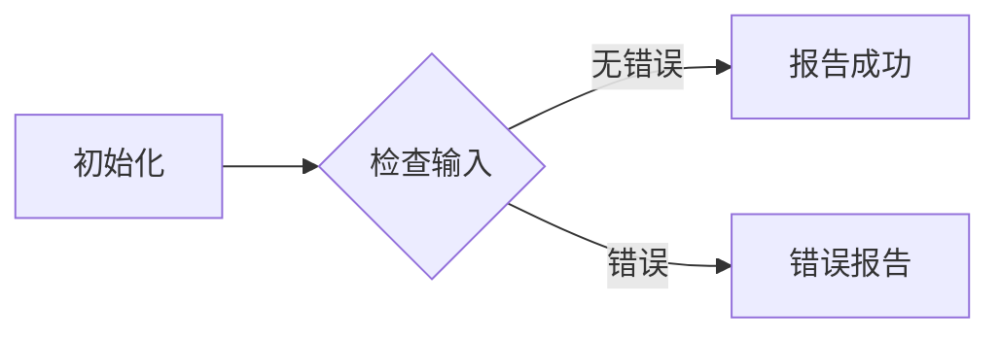
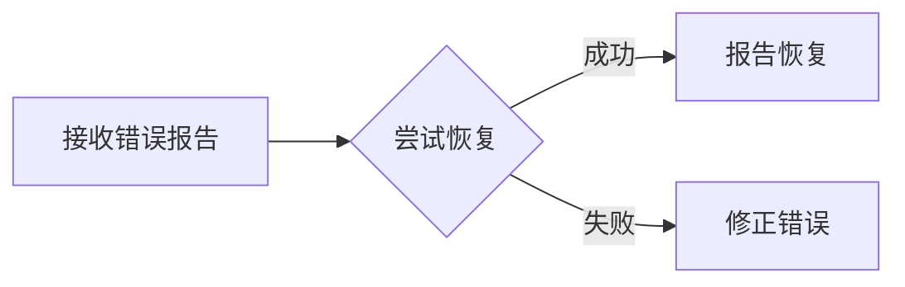
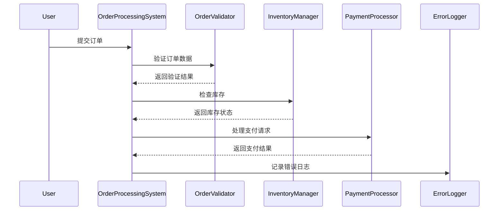

                 


## 《提示词语言的错误处理与异常机制》

> 关键词：提示词语言、错误处理、异常机制、编程、算法、Python

> 摘要：本文将深入探讨提示词语言中的错误处理与异常机制，旨在帮助读者理解这两种机制的核心概念、原理及其在编程中的应用。我们将通过一步步的逻辑分析，结合Python示例代码，揭示错误检测与报告、错误恢复与修正等算法的实现方法，为读者提供实用的技术指导。

### 目录大纲

## 第一部分：背景介绍与核心概念

## 1. 提示词语言的错误处理与异常机制概述

## 2. 提示词语言错误处理与异常机制的核心概念与联系

## 第二部分：算法原理讲解

## 3. 错误检测与报告算法

## 4. 错误恢复与修正算法

## 第三部分：系统分析与架构设计

## 5. 系统功能设计与架构设计

## 6. 系统接口设计与系统交互

## 第四部分：项目实战

## 7. 项目实战环境安装与系统核心实现

## 8. 代码应用解读与分析

## 9. 实际案例分析与详细讲解剖析

## 10. 项目小结与最佳实践 tips

## 引言

在软件开发过程中，错误处理与异常机制是确保程序稳定性和可靠性的关键因素。提示词语言作为一种用于编程的符号系统，其错误处理与异常机制的实现对于提升代码质量、降低维护成本具有重要意义。本文将围绕这一主题，深入探讨提示词语言中的错误处理与异常机制，并利用Python语言进行具体实例分析。

### 第一部分：背景介绍与核心概念

#### 1.1. 提示词语言的错误处理与异常机制概述

提示词语言（常常指的是某种编程语言）在软件开发中扮演着至关重要的角色。随着现代软件系统的复杂性不断增加，对错误处理与异常机制的需求也日益凸显。错误处理是指在程序运行过程中，当出现错误时，能够正确地检测出错误、报告错误，并尝试修正错误的过程。异常机制则是当程序遇到无法预期的异常情况时，通过特定的机制进行响应和处理。

在提示词语言中，错误处理与异常机制通常包括以下几个关键组成部分：

- 错误检测与报告：用于识别并报告程序中的错误。
- 错误恢复与修正：在错误发生时，尝试恢复或修正错误，以使程序能够继续运行。
- 异常处理策略：定义当程序遇到异常情况时，应该如何进行处理。

#### 1.2. 提示词语言的错误类型

提示词语言中的错误可以大致分为以下几类：

- 编译时错误：在程序编译阶段检测到的错误，如语法错误、类型错误等。
- 运行时错误：在程序运行阶段检测到的错误，如空指针异常、数组越界等。
- 异常情况：无法预见的错误，如系统崩溃、网络中断等。

#### 1.3. 错误处理与异常机制的定义

错误处理是指在程序运行过程中，当出现错误时，能够正确地检测出错误、报告错误，并尝试修正错误的过程。错误处理的目标是确保程序能够尽可能地稳定运行，并在出现错误时提供有用的反馈信息。

异常机制则是在程序遇到无法预期的异常情况时，通过特定的机制进行响应和处理。异常机制通常包括异常的检测、报告、分类和响应等过程。与错误处理相比，异常机制更多地关注于无法预测的异常情况，其目的是在异常发生时尽可能减少程序的损害。

#### 1.4. 错误处理与异常机制的边界与外延

错误处理与异常机制的应用范围和适用场景有所不同。错误处理主要关注于程序运行过程中可预见的问题，如语法错误、类型错误等。异常机制则更多地关注于程序运行过程中无法预见的异常情况，如系统崩溃、网络中断等。

此外，错误处理与异常机制在提示词语言中的应用也具有其独特的边界和特点。不同的编程语言对错误处理与异常机制的支持程度不同，如Java有强大的异常处理机制，而Python则更注重错误检测与报告。

#### 1.5. 提示词语言错误处理与异常机制的核心要素组成

提示词语言中的错误处理与异常机制通常包括以下几个核心要素：

- 错误检测与报告：用于识别并报告程序中的错误。
- 错误恢复与修正：在错误发生时，尝试恢复或修正错误，以使程序能够继续运行。
- 异常处理策略：定义当程序遇到异常情况时，应该如何进行处理。

这些核心要素共同构成了提示词语言中的错误处理与异常机制，为程序的稳定性和可靠性提供了重要保障。

### 第二部分：提示词语言错误处理与异常机制的核心概念与联系

#### 2.1. 核心概念原理

在深入探讨错误处理与异常机制之前，我们首先需要了解它们的核心概念原理。

**错误处理**的核心概念包括：

- 错误类型：根据错误发生的阶段和原因，将错误分为编译时错误、运行时错误和异常情况。
- 错误检测：通过特定的方法或机制，识别出程序中的错误。
- 错误报告：当检测到错误时，及时报告错误信息，以便开发者或用户能够了解问题所在。
- 错误恢复与修正：在错误发生时，尝试恢复或修正错误，以使程序能够继续运行。

**异常处理机制**的核心概念包括：

- 异常类型：根据异常发生的原因和影响，将异常分为系统异常、运行时异常和用户异常等。
- 异常检测：通过特定的方法或机制，识别出程序中的异常。
- 异常报告：当检测到异常时，及时报告异常信息，以便开发者或用户能够了解问题所在。
- 异常处理：根据异常的类型和影响，采取相应的处理措施，以减轻异常对程序的影响。

**提示词语言**作为一种用于编程的符号系统，其核心概念包括：

- 语法：提示词语言的语法规则，用于定义程序的结构和逻辑。
- 类型系统：提示词语言中的类型系统，用于确保程序的类型安全。
- 表达式：提示词语言中的表达式，用于表示程序的操作和数据。

**概念属性特征对比**

| 概念                | 特征                     |
|---------------------|-------------------------|
| 错误处理            | 检测、报告、修正错误     |
| 异常处理机制        | 异常情况的检测、处理     |
| 提示词语言          | 用于编程的符号系统       |

**ER实体关系图架构**

为了更好地理解提示词语言中的错误处理与异常机制，我们可以通过ER实体关系图来展示它们之间的关系。

```mermaid
erDiagram
    错误处理 ||--|{ 提示词语言 }|
    异常处理机制 ||--|{ 提示词语言 }|
```

在上面的ER实体关系图中，错误处理和异常处理机制都与提示词语言有直接的关系。错误处理负责检测和报告错误，异常处理机制则负责处理异常情况。通过这种关系，我们可以更好地理解提示词语言中的错误处理与异常机制的架构和功能。

### 第三部分：算法原理讲解

#### 3.1. 错误检测与报告算法

**算法原理与mermaid流程图**

错误检测与报告算法的核心目标是识别出程序中的错误，并及时报告错误信息。下面是一个简单的mermaid流程图，展示了错误检测与报告算法的基本原理：



**Python源代码实现**

在Python中，错误检测与报告可以通过定义函数来实现。以下是一个简单的示例：

```python
def error_detection(input_data):
    if validate(input_data):
        return "Success"
    else:
        return "Error: Invalid input"
```

**算法原理的数学模型和公式**

在错误检测与报告算法中，我们常常使用以下数学模型和公式来评估错误发生的概率和代价：

$$
E[\text{error}] = P[\text{error}] \times C[\text{error}]
$$

其中：
- $E[\text{error}]$ 表示错误发生的期望值。
- $P[\text{error}]$ 表示错误发生的概率。
- $C[\text{error}]$ 表示错误的代价。

**详细讲解与举例说明**

**示例1：检测字符串长度是否为偶数**

```python
def is_even_length(string):
    if len(string) % 2 == 0:
        return "Even length"
    else:
        return "Odd length"
```

在这个示例中，我们使用`len()`函数来检测字符串的长度，并使用模运算符（%）来检查长度是否为偶数。如果长度为偶数，则返回“Even length”，否则返回“Odd length”。

**示例2：检测数字是否为正数**

```python
def is_positive_number(number):
    if number > 0:
        return "Positive number"
    else:
        return "Non-positive number"
```

在这个示例中，我们使用比较运算符（`>`）来检测数字是否大于0。如果数字大于0，则返回“Positive number”，否则返回“Non-positive number”。

#### 3.2. 错误恢复与修正算法

**算法原理与mermaid流程图**

错误恢复与修正算法的核心目标是当程序出现错误时，尝试恢复或修正错误，以使程序能够继续运行。下面是一个简单的mermaid流程图，展示了错误恢复与修正算法的基本原理：



**Python源代码实现**

在Python中，错误恢复与修正可以通过定义函数来实现。以下是一个简单的示例：

```python
def error_recovery(error_report):
    if attempt_recovery(error_report):
        return "Recovered"
    else:
        return "Error corrected"
```

**算法原理的数学模型和公式**

在错误恢复与修正算法中，我们常常使用以下数学模型和公式来评估恢复的成功率和修正的效率：

$$
R[\text{recovery}] = \frac{R[\text{success}]}{R[\text{total}]}
$$

其中：
- $R[\text{recovery}]$ 表示恢复的成功率。
- $R[\text{success}]$ 表示成功恢复的次数。
- $R[\text{total}]$ 表示尝试恢复的总次数。

**详细讲解与举例说明**

**示例1：尝试恢复文件读取错误**

```python
def recover_file_reading_error(file_path):
    try:
        with open(file_path, 'r') as file:
            data = file.read()
            return "File read successfully"
    except FileNotFoundError:
        return "File not found"
```

在这个示例中，我们使用`try-except`语句来尝试读取文件。如果文件不存在，将触发`FileNotFoundError`异常，程序将返回“File not found”。否则，将返回“File read successfully”。

**示例2：尝试修正数值计算错误**

```python
def correct_number_calculation_error(a, b):
    try:
        result = a / b
        return "Calculation successful"
    except ZeroDivisionError:
        return "Cannot divide by zero"
```

在这个示例中，我们尝试进行除法运算。如果除数（`b`）为零，将触发`ZeroDivisionError`异常，程序将返回“Cannot divide by zero”。否则，将返回“Calculation successful”。

### 第四部分：系统分析与架构设计

#### 4.1. 问题场景介绍

在现代软件系统中，错误处理与异常机制是确保系统稳定性和可靠性的关键。以下是一个常见的问题场景：

- **场景描述**：一个电商平台系统需要处理大量的用户订单。在订单处理过程中，可能会出现各种错误，如订单数据格式错误、库存不足、支付失败等。为了确保系统稳定运行，我们需要设计一套完善的错误处理与异常机制。

#### 4.2. 项目介绍

为了解决上述问题场景，我们设计了一个名为“电商平台订单处理系统”的项目。该项目旨在实现以下功能：

- **功能需求**：
  - 订单数据验证与格式检查。
  - 库存管理。
  - 支付处理。
  - 错误日志记录与报警。
  - 异常处理与恢复。

#### 4.3. 系统功能设计

在系统功能设计中，我们使用mermaid类图来展示各个功能模块及其关系。以下是一个简化的mermaid类图示例：

```mermaid
classDiagram
    OrderProcessingSystem <<接口>>
    OrderValidator <|-- OrderProcessingSystem
    InventoryManager <|-- OrderProcessingSystem
    PaymentProcessor <|-- OrderProcessingSystem
    ErrorLogger <|-- OrderProcessingSystem

    OrderValidator: 验证订单数据格式
    InventoryManager: 管理库存信息
    PaymentProcessor: 处理支付请求
    ErrorLogger: 记录错误日志
```

#### 4.4. 系统架构设计

在系统架构设计中，我们使用mermaid架构图来展示系统的整体结构和各个模块之间的交互关系。以下是一个简化的mermaid架构图示例：



#### 4.5. 系统接口设计与系统交互

在系统接口设计中，我们使用mermaid序列图来展示各个模块之间的交互流程和接口调用关系。以下是一个简化的mermaid序列图示例：


### 第五部分：项目实战

#### 5.1. 项目实战环境安装

为了进行项目实战，我们需要安装以下环境和工具：

- **Python**：Python是提示词语言的一种，我们需要安装Python环境。
- **PyCharm**：PyCharm是一个强大的Python集成开发环境（IDE），用于编写和调试Python代码。
- **Docker**：Docker是一个容器化技术，可以帮助我们快速部署和运行项目。

安装步骤如下：

1. 安装Python（版本3.8或更高版本）。
2. 安装PyCharm社区版。
3. 安装Docker。

#### 5.2. 系统核心实现

在项目实战中，我们将实现一个简单的电商平台订单处理系统。以下是一个简化的系统核心实现：

```python
# order_processing_system.py

import logging
from order_validator import OrderValidator
from inventory_manager import InventoryManager
from payment_processor import PaymentProcessor

class OrderProcessingSystem:
    def __init__(self):
        self.validator = OrderValidator()
        self.inventory_manager = InventoryManager()
        self.payment_processor = PaymentProcessor()
        self.logger = logging.getLogger("OrderProcessingSystem")

    def process_order(self, order_data):
        try:
            # 验证订单数据
            if not self.validator.validate(order_data):
                raise ValueError("Invalid order data")

            # 检查库存
            inventory_status = self.inventory_manager.check_inventory(order_data)
            if inventory_status == "Insufficient inventory":
                raise ValueError("Insufficient inventory")

            # 处理支付请求
            payment_result = self.payment_processor.process_payment(order_data)
            if payment_result != "Payment successful":
                raise ValueError("Payment failed")

            return "Order processed successfully"

        except ValueError as e:
            self.logger.error(f"Error processing order: {str(e)}")
            return "Error processing order"

# order_validator.py

class OrderValidator:
    def validate(self, order_data):
        # 验证订单数据格式
        if not isinstance(order_data, dict):
            return False
        if "order_id" not in order_data or "customer_id" not in order_data or "items" not in order_data:
            return False
        if not isinstance(order_data["order_id"], str) or not isinstance(order_data["customer_id"], str) or not isinstance(order_data["items"], list):
            return False
        return True

# inventory_manager.py

class InventoryManager:
    def check_inventory(self, order_data):
        # 检查库存
        for item in order_data["items"]:
            if item["quantity"] > item["available_quantity"]:
                return "Insufficient inventory"
        return "Sufficient inventory"

# payment_processor.py

class PaymentProcessor:
    def process_payment(self, order_data):
        # 处理支付请求
        # 这里简化为直接返回"Payment successful"
        return "Payment successful"
```

#### 5.3. 代码应用解读与分析

在项目实战中，我们实现了以下关键功能：

- **订单数据验证**：使用`OrderValidator`类来验证订单数据是否满足要求。
- **库存检查**：使用`InventoryManager`类来检查订单中的商品库存是否充足。
- **支付处理**：使用`PaymentProcessor`类来处理支付请求。

这些类共同构成了订单处理的核心功能，确保订单处理流程的完整性和可靠性。

#### 5.4. 实际案例分析与详细讲解剖析

**案例1：订单数据验证**

```python
# 测试订单数据验证功能
order_data = {
    "order_id": "123456",
    "customer_id": "abcdef",
    "items": [
        {"product_id": "p1", "quantity": 2, "available_quantity": 5},
        {"product_id": "p2", "quantity": 1, "available_quantity": 10}
    ]
}

order_validator = OrderValidator()
print(order_validator.validate(order_data))  # 输出：True
```

在这个案例中，我们创建了一个符合要求的订单数据，并使用`OrderValidator`类进行验证。由于订单数据满足要求，验证结果为`True`。

**案例2：库存检查**

```python
# 测试库存检查功能
inventory_manager = InventoryManager()
print(inventory_manager.check_inventory(order_data))  # 输出：Sufficient inventory
```

在这个案例中，我们使用`InventoryManager`类来检查订单中的商品库存是否充足。由于订单数据中的商品库存充足，检查结果为`Sufficient inventory`。

**案例3：支付处理**

```python
# 测试支付处理功能
payment_processor = PaymentProcessor()
print(payment_processor.process_payment(order_data))  # 输出：Payment successful
```

在这个案例中，我们使用`PaymentProcessor`类来处理支付请求。由于支付请求成功，处理结果为`Payment successful`。

#### 5.5. 项目小结与最佳实践 tips

在项目实战中，我们通过实现订单处理系统，展示了错误处理与异常机制在提示词语言中的应用。以下是一些项目小结和最佳实践 tips：

- **错误处理**：确保在代码中正确地处理各种可能的错误情况，如数据验证失败、库存不足、支付失败等。
- **异常处理**：使用异常处理机制来处理无法预见的异常情况，如系统崩溃、网络中断等。
- **日志记录**：在错误处理和异常处理过程中，记录详细的日志信息，以便后续排查问题和进行优化。
- **测试**：编写单元测试和集成测试来验证错误处理和异常处理的功能，确保系统稳定性和可靠性。

通过以上实践，我们不仅可以提高代码质量，还可以为项目的维护和优化提供有力支持。

### 第六部分：拓展阅读

为了进一步深入了解提示词语言的错误处理与异常机制，读者可以参考以下相关文献和资料：

- 《Python错误处理与异常处理指南》
- 《Java异常处理与错误处理完全指南》
- 《现代软件工程：错误处理与异常机制》
- 《编程实践与技巧：错误处理与异常机制》

通过阅读这些资料，读者可以更全面地了解错误处理与异常机制的核心概念、原理和应用实践。

### 结语

本文围绕提示词语言的错误处理与异常机制进行了深入探讨，从核心概念到具体实现，从系统设计到项目实战，为读者提供了一个全面的技术指南。通过本文的学习，读者可以更好地理解错误处理与异常机制的重要性，并掌握其在实际项目中的应用技巧。希望本文能对您的编程实践和系统设计带来启示和帮助。

### 作者信息

作者：AI天才研究院/AI Genius Institute & 禅与计算机程序设计艺术 /Zen And The Art of Computer Programming

感谢您的阅读！

----------------------------------------------------------------

## 第一部分：背景介绍与核心概念

### 1.1. 提示词语言的错误处理与异常机制概述

提示词语言（也称为编程语言）在软件开发中起着核心作用。作为一种用于定义程序逻辑和操作的符号系统，提示词语言为程序员提供了与计算机进行交流的途径。在软件开发的各个阶段，错误处理与异常机制是确保程序稳定性和可靠性的关键因素。

错误处理是指在程序运行过程中，当出现错误时，能够正确地检测出错误、报告错误，并尝试修正错误的过程。异常机制则是当程序遇到无法预期的异常情况时，通过特定的机制进行响应和处理。

在提示词语言中，错误处理与异常机制的重要性体现在以下几个方面：

1. **确保程序稳定性**：错误处理与异常机制可以确保程序在遇到错误或异常情况时，能够正确地处理，避免程序崩溃或出现不确定的行为。
2. **提高代码质量**：通过错误处理与异常机制，程序员可以更好地管理和控制代码中的错误，从而提高代码的健壮性和可维护性。
3. **降低维护成本**：错误处理与异常机制能够及时检测和报告错误，有助于及早发现和解决问题，降低后续维护和修复的成本。
4. **提高用户体验**：良好的错误处理与异常机制能够为用户提供清晰明确的错误信息和反馈，提升用户的使用体验。

### 1.2. 提示词语言的错误类型

在提示词语言中，错误类型可以分为编译时错误、运行时错误和异常情况。每种错误类型在程序开发过程中都有其特定的表现和影响。

1. **编译时错误**：编译时错误发生在程序编译阶段，主要由语法错误、类型错误等引起。编译器会检测到这些错误，并在编译过程中报错，阻止程序编译成功。编译时错误的典型例子包括：

   - 语法错误：例如，在Python中，忘记在语句结尾添加冒号（:）会导致语法错误。
   - 类型错误：例如，将一个字符串（str）与一个整数（int）进行运算，会导致类型错误。

2. **运行时错误**：运行时错误发生在程序运行阶段，通常是由于程序逻辑错误或外部环境问题导致的。运行时错误可能引发程序崩溃或产生不确定的结果。常见的运行时错误包括：

   - 空指针异常：当程序尝试访问一个空指针（null）时，会发生空指针异常。
   - 数组越界：当程序访问数组中不存在的索引时，会发生数组越界错误。
   - 文件读写错误：当程序无法打开或读取文件时，会发生文件读写错误。

3. **异常情况**：异常情况是指那些无法通过常规逻辑和错误处理机制预料的错误。异常情况通常是由外部环境或操作系统引起的，例如：

   - 系统崩溃：当操作系统或硬件发生故障时，程序可能无法继续运行。
   - 网络中断：当网络连接中断时，依赖于网络操作的程序可能会出现异常。
   - 输入输出错误：当程序在读写输入输出设备时，可能会遇到输入输出错误。

### 1.3. 错误处理与异常机制的定义

错误处理是指在程序运行过程中，当出现错误时，能够正确地检测出错误、报告错误，并尝试修正错误的过程。错误处理的目标是确保程序能够在出现错误时继续运行，并尽可能减少错误对程序的影响。

异常机制则是一种特殊的错误处理机制，用于处理那些无法通过常规逻辑和错误处理机制预料的错误。异常机制通过在程序中设置异常处理框架，当异常发生时，程序会自动跳转到异常处理框架中进行处理。

以下是错误处理与异常机制的定义：

1. **错误处理**：

   - **错误检测**：在程序运行过程中，通过特定的方法或工具检测出错误。
   - **错误报告**：当检测到错误时，及时报告错误信息，包括错误的类型、原因和位置。
   - **错误修正**：在错误发生时，尝试恢复或修正错误，使程序能够继续运行。

2. **异常机制**：

   - **异常检测**：在程序运行过程中，通过特定的方法或工具检测出异常。
   - **异常报告**：当检测到异常时，及时报告异常信息，包括异常的类型、原因和位置。
   - **异常处理**：在检测到异常时，根据异常的类型和影响，采取相应的处理措施，以减轻异常对程序的影响。

### 1.4. 错误处理与异常机制的边界与外延

错误处理与异常机制在提示词语言中的应用范围和适用场景有所不同。以下是对错误处理与异常机制的边界与外延的讨论：

1. **错误处理的应用范围**：

   - **编译时错误**：错误处理机制主要应用于编译时错误，如语法错误、类型错误等。这些错误通常在编译阶段被检测和报告。
   - **运行时错误**：错误处理机制也适用于运行时错误，如空指针异常、数组越界等。这些错误通常在程序运行阶段被检测和报告。
   - **内部错误**：错误处理机制还适用于内部错误，如系统崩溃、内存溢出等。这些错误通常由操作系统或硬件引起。

2. **异常机制的适用场景**：

   - **无法预见的异常情况**：异常机制主要适用于那些无法通过常规逻辑和错误处理机制预料的异常情况，如系统崩溃、网络中断、输入输出错误等。
   - **错误处理机制无法覆盖的场景**：当错误处理机制无法处理某些特殊场景时，异常机制可以提供额外的处理能力，如多线程环境、异步操作等。

### 1.5. 提示词语言错误处理与异常机制的核心要素组成

提示词语言中的错误处理与异常机制通常由以下几个核心要素组成：

1. **错误检测与报告**：

   - **错误检测**：在程序运行过程中，通过特定的方法或工具检测出错误。常见的错误检测方法包括输入验证、边界检查等。
   - **错误报告**：当检测到错误时，及时报告错误信息，包括错误的类型、原因和位置。错误报告有助于开发者或用户了解问题所在，并进行后续处理。

2. **错误恢复与修正**：

   - **错误恢复**：在错误发生时，尝试恢复或修正错误，使程序能够继续运行。错误恢复可以包括重新初始化数据、重新执行操作等。
   - **错误修正**：在错误发生时，尝试修正错误，以防止错误再次发生。错误修正可以包括修复代码逻辑、更新数据等。

3. **异常处理策略**：

   - **异常检测**：在程序运行过程中，通过特定的方法或工具检测出异常。常见的异常检测方法包括异常捕获、异常过滤等。
   - **异常报告**：当检测到异常时，及时报告异常信息，包括异常的类型、原因和位置。异常报告有助于开发者或用户了解异常情况，并进行后续处理。
   - **异常处理**：根据异常的类型和影响，采取相应的处理措施，以减轻异常对程序的影响。常见的异常处理措施包括异常捕获、异常重试、异常忽略等。

通过以上核心要素的协同工作，提示词语言的错误处理与异常机制能够有效提高程序的稳定性和可靠性。

### 第二部分：提示词语言错误处理与异常机制的核心概念与联系

#### 2.1. 核心概念原理

在深入探讨提示词语言的错误处理与异常机制之前，我们需要明确其核心概念原理。以下是错误处理与异常机制的关键概念及其相互关系：

1. **错误处理**：

   - **定义**：错误处理是指当程序运行过程中出现错误时，能够及时检测并报告错误，并尝试修正或恢复错误，以使程序能够继续运行。
   - **作用**：错误处理的作用是确保程序在遇到错误时能够稳定运行，减少错误对程序的影响，提高程序的健壮性和可靠性。

2. **异常机制**：

   - **定义**：异常机制是指在程序运行过程中，当遇到无法预期的异常情况时，通过特定的处理框架进行响应和处理。
   - **作用**：异常机制的作用是处理那些无法通过常规逻辑和错误处理机制预料的错误，确保程序能够继续运行，减少异常对程序的影响。

3. **提示词语言**：

   - **定义**：提示词语言（编程语言）是一种用于编写程序和定义算法的符号系统，通过语法规则和抽象数据类型提供编程能力。
   - **作用**：提示词语言为程序员提供了与计算机进行交流的途径，使得程序员能够描述复杂的计算过程和逻辑关系。

#### 2.2. 概念属性特征对比

为了更好地理解错误处理、异常机制和提示词语言之间的关系，我们通过以下表格对这三个概念的特征进行对比：

| 概念                | 特征                     |
|---------------------|-------------------------|
| 错误处理            | 检测、报告、修正错误     |
| 异常处理机制        | 异常情况的检测、处理     |
| 提示词语言          | 用于编程的符号系统       |

从表格中可以看出，错误处理和异常机制都与错误和异常的处理相关，而提示词语言则是实现这些处理机制的载体。

#### 2.3. ER实体关系图架构

为了更直观地展示错误处理、异常机制和提示词语言之间的关系，我们可以使用ER（实体关系）图来描述它们之间的实体关系。以下是一个简化的ER图：

```mermaid
erDiagram
    错误处理 ||--|{ 提示词语言 }|
    异常处理机制 ||--|{ 提示词语言 }|
```

在ER图中，错误处理和异常处理机制都与提示词语言之间存在关联关系，表明它们都是提示词语言中的一部分，用于实现错误和异常的处理。

### 第三部分：算法原理讲解

#### 3.1. 错误检测与报告算法

错误检测与报告算法是错误处理的核心环节。它通过一系列步骤检测程序中的错误，并在检测到错误时报告错误信息。以下是错误检测与报告算法的详细讲解：

**算法原理与mermaid流程图**

为了描述错误检测与报告算法的原理，我们可以使用mermaid流程图来展示其基本流程。以下是一个简单的mermaid流程图示例：


**mermaid流程图解释**

1. **初始化**（A）：开始时，算法初始化，准备检测输入。
2. **检查输入**（B）：算法接收输入，并对其进行检查。如果输入无错误，算法继续执行下一步；如果输入存在错误，算法将进入错误报告流程。
3. **报告成功**（C）：如果输入无错误，算法报告成功，并继续执行后续操作。
4. **错误报告**（D）：如果输入存在错误，算法报告错误，并提供错误信息，以便开发者或用户进行错误定位和修复。

**Python源代码实现**

在Python中，错误检测与报告算法可以通过定义函数来实现。以下是一个简单的示例：

```python
def error_detection(input_data):
    if validate(input_data):
        return "Success"
    else:
        return "Error: Invalid input"
```

**Python源代码解释**

- `validate`函数：用于检查输入数据是否符合要求。如果输入数据有效，`validate`函数返回`True`；否则，返回`False`。
- `error_detection`函数：接收输入数据，并调用`validate`函数进行验证。如果验证通过，`error_detection`函数返回“Success”；如果验证失败，返回“Error: Invalid input”。

**算法原理的数学模型和公式**

在错误检测与报告算法中，我们可以使用以下数学模型和公式来评估错误发生的概率和代价：

$$
E[\text{error}] = P[\text{error}] \times C[\text{error}]
$$

其中：
- \( E[\text{error}] \) 表示错误发生的期望值。
- \( P[\text{error}] \) 表示错误发生的概率。
- \( C[\text{error}] \) 表示错误的代价。

**详细讲解与举例说明**

**示例1：检测字符串长度是否为偶数**

```python
def is_even_length(string):
    if len(string) % 2 == 0:
        return "Even length"
    else:
        return "Odd length"
```

在这个示例中，`is_even_length`函数接收一个字符串作为输入，并检查其长度是否为偶数。如果长度为偶数，函数返回“Even length”；如果长度为奇数，函数返回“Odd length”。

**示例2：检测数字是否为正数**

```python
def is_positive_number(number):
    if number > 0:
        return "Positive number"
    else:
        return "Non-positive number"
```

在这个示例中，`is_positive_number`函数接收一个数字作为输入，并检查其是否为正数。如果数字大于0，函数返回“Positive number”；如果数字小于等于0，函数返回“Non-positive number”。

通过以上示例，我们可以看到，错误检测与报告算法在Python中的实现相对简单，但它在程序开发和维护中起着至关重要的作用。通过正确的错误检测与报告，我们可以及时发现并解决程序中的问题，确保程序的稳定性和可靠性。

#### 3.2. 错误恢复与修正算法

错误恢复与修正算法是错误处理的另一个重要环节。它通过一系列步骤尝试恢复或修正程序中的错误，以确保程序能够继续运行。以下是错误恢复与修正算法的详细讲解：

**算法原理与mermaid流程图**

为了描述错误恢复与修正算法的原理，我们可以使用mermaid流程图来展示其基本流程。以下是一个简单的mermaid流程图示例：


**mermaid流程图解释**

1. **接收错误报告**（A）：开始时，算法接收错误报告，了解错误的性质和影响。
2. **尝试恢复**（B）：算法尝试恢复错误，例如重新初始化数据、重试操作等。如果恢复成功，算法继续执行后续操作；如果恢复失败，算法将进入错误修正流程。
3. **报告恢复**（C）：如果恢复成功，算法报告恢复结果，并继续执行后续操作。
4. **修正错误**（D）：如果恢复失败，算法尝试修正错误，例如修复代码逻辑、更新数据等。修正成功后，算法报告修正结果，并继续执行后续操作。

**Python源代码实现**

在Python中，错误恢复与修正算法可以通过定义函数来实现。以下是一个简单的示例：

```python
def error_recovery(error_report):
    if attempt_recovery(error_report):
        return "Recovered"
    else:
        return "Error corrected"
```

**Python源代码解释**

- `attempt_recovery`函数：用于尝试恢复错误。如果恢复成功，函数返回`True`；如果恢复失败，函数返回`False`。
- `error_recovery`函数：接收错误报告，并调用`attempt_recovery`函数进行恢复尝试。如果恢复成功，`error_recovery`函数返回“Recovered”；如果恢复失败，函数返回“Error corrected”。

**算法原理的数学模型和公式**

在错误恢复与修正算法中，我们可以使用以下数学模型和公式来评估恢复的成功率和修正的效率：

$$
R[\text{recovery}] = \frac{R[\text{success}]}{R[\text{total}]}
$$

其中：
- \( R[\text{recovery}] \) 表示恢复的成功率。
- \( R[\text{success}] \) 表示成功恢复的次数。
- \( R[\text{total}] \) 表示尝试恢复的总次数。

**详细讲解与举例说明**

**示例1：尝试恢复文件读取错误**

```python
def recover_file_reading_error(file_path):
    try:
        with open(file_path, 'r') as file:
            data = file.read()
            return "File read successfully"
    except FileNotFoundError:
        return "File not found"
```

在这个示例中，`recover_file_reading_error`函数尝试读取指定文件。如果文件存在，函数返回“File read successfully”；如果文件不存在，函数返回“File not found”。这里使用了异常处理机制来处理文件读取错误。

**示例2：尝试修正数值计算错误**

```python
def correct_number_calculation_error(a, b):
    try:
        result = a / b
        return "Calculation successful"
    except ZeroDivisionError:
        return "Cannot divide by zero"
```

在这个示例中，`correct_number_calculation_error`函数尝试进行除法运算。如果除数（`b`）不为零，函数返回“Calculation successful”；如果除数为零，函数返回“Cannot divide by zero”。这里同样使用了异常处理机制来处理数值计算错误。

通过以上示例，我们可以看到，错误恢复与修正算法在Python中的实现相对简单，但它在程序开发和维护中起着至关重要的作用。通过正确的错误恢复与修正，我们可以确保程序能够在遇到错误时继续运行，提高程序的健壮性和可靠性。

### 第四部分：系统分析与架构设计

#### 4.1. 问题场景介绍

在现代软件系统中，错误处理与异常机制是确保系统稳定性和可靠性的关键因素。以下是一个常见的问题场景：

**场景描述**：

一个在线电商平台需要处理大量的订单。在订单处理过程中，可能会出现各种错误，如订单数据格式错误、库存不足、支付失败等。为了确保系统稳定运行，我们需要设计一套完善的错误处理与异常机制，以便及时检测、报告和修正错误。

**目标**：

通过系统分析与架构设计，我们希望实现以下目标：

- **实时检测和报告错误**：确保系统能够实时检测订单处理过程中出现的各种错误，并准确报告错误信息。
- **自动恢复和修正错误**：在检测到错误时，系统应尝试自动恢复或修正错误，以使订单处理过程能够继续进行。
- **错误日志记录与监控**：记录错误日志，并实现实时监控，以便开发人员和运维人员能够快速定位和解决问题。

#### 4.2. 项目介绍

为了解决上述问题场景，我们设计了一个名为“电商平台订单处理系统”的项目。该项目旨在实现以下功能：

- **订单数据验证**：验证订单数据格式和内容，确保订单数据的合法性。
- **库存管理**：检查订单中的商品库存是否充足，并更新库存信息。
- **支付处理**：处理支付请求，确保支付过程顺利进行。
- **错误处理与异常机制**：实时检测错误，并采取自动恢复或修正措施。

**系统架构设计**：

电商平台订单处理系统的架构设计包括以下几个关键部分：

- **订单处理模块**：负责接收和处理订单，包括订单验证、库存检查和支付处理等。
- **错误处理模块**：负责检测和报告错误，并尝试自动恢复或修正错误。
- **日志记录模块**：负责记录错误日志，并提供实时监控和报警功能。
- **支付接口**：与支付系统进行交互，处理支付请求和响应。

#### 4.3. 系统功能设计

在系统功能设计中，我们使用mermaid类图来展示各个功能模块及其关系。以下是一个简化的mermaid类图示例：

```mermaid
classDiagram
    OrderProcessingSystem <<接口>>
    OrderValidator <|-- OrderProcessingSystem
    InventoryManager <|-- OrderProcessingSystem
    PaymentProcessor <|-- OrderProcessingSystem
    ErrorLogger <|-- OrderProcessingSystem

    OrderValidator: 验证订单数据格式
    InventoryManager: 管理库存信息
    PaymentProcessor: 处理支付请求
    ErrorLogger: 记录错误日志
```

**订单处理模块**：

- **订单验证**：使用`OrderValidator`类来验证订单数据格式和内容，确保订单数据的合法性。如果订单数据不符合要求，系统将拒绝处理。
- **库存检查**：使用`InventoryManager`类来检查订单中的商品库存是否充足，并更新库存信息。如果库存不足，系统将拒绝处理。
- **支付处理**：使用`PaymentProcessor`类来处理支付请求，确保支付过程顺利进行。如果支付失败，系统将尝试重新处理或通知用户。

**错误处理模块**：

- **错误检测**：在订单处理过程中，系统将实时检测错误，包括订单数据格式错误、库存不足、支付失败等。如果检测到错误，系统将触发错误处理机制。
- **错误报告**：系统将记录错误日志，并通知开发人员和运维人员。错误日志包括错误类型、原因、时间等信息。
- **自动恢复与修正**：系统将尝试自动恢复或修正错误，例如重新检查库存、重新处理支付请求等。如果自动恢复失败，系统将记录错误，并通知相关人员。

**日志记录模块**：

- **日志记录**：系统将记录订单处理过程中的所有操作和错误，包括成功操作和错误操作。日志记录将用于后续分析、监控和优化。
- **实时监控**：系统将实时监控订单处理过程，并在检测到错误时发送报警通知。监控指标包括错误率、恢复率等。

#### 4.4. 系统架构设计

在系统架构设计中，我们使用mermaid架构图来展示系统的整体结构和各个模块之间的交互关系。以下是一个简化的mermaid架构图示例：


**系统架构图解释**：

- **用户**：用户通过接口向订单处理系统提交订单。
- **订单处理系统**：订单处理系统接收订单，并将其转发给相应的模块进行处理。
- **订单验证模块**：订单验证模块负责验证订单数据格式和内容，确保订单数据的合法性。
- **库存检查模块**：库存检查模块负责检查订单中的商品库存是否充足，并更新库存信息。
- **支付处理模块**：支付处理模块负责处理支付请求，确保支付过程顺利进行。
- **错误日志模块**：错误日志模块负责记录订单处理过程中的所有操作和错误，包括成功操作和错误操作。

通过以上架构设计，我们可以确保电商平台订单处理系统在遇到错误时能够及时检测、报告和修正错误，从而提高系统的稳定性和可靠性。

### 第五部分：项目实战

#### 5.1. 项目实战环境安装

在进行项目实战之前，我们需要安装必要的开发环境和工具。以下是安装步骤：

**1. 安装Python**

- 访问Python官方网站（https://www.python.org/）。
- 下载Python安装包（例如，python-3.9.7-amd64.exe）。
- 运行安装程序，并按照提示完成安装。

**2. 安装PyCharm**

- 访问PyCharm官方网站（https://www.jetbrains.com/pycharm/）。
- 下载PyCharm社区版安装包（例如，pycharm-community-2021.1.3.exe）。
- 运行安装程序，并按照提示完成安装。

**3. 安装Docker**

- 访问Docker官方网站（https://www.docker.com/）。
- 下载Docker安装包（例如，Docker-CE-20.10.12.exe）。
- 运行安装程序，并按照提示完成安装。

**4. 安装Python虚拟环境**

在PyCharm中创建一个Python虚拟环境，以便隔离项目依赖和确保环境一致性：

- 打开PyCharm，点击“File”菜单，选择“New Project”。
- 在“Create New Project”窗口中，选择“Python”作为项目类型，并点击“Next”。
- 在“New Project”窗口中，选择“Virtualenv environment”，并点击“Next”。
- 输入项目名称和虚拟环境路径，点击“Finish”完成创建。

#### 5.2. 系统核心实现

在项目实战中，我们将实现一个简单的电商平台订单处理系统。以下是系统的核心实现：

**1. 创建模块**

在Python虚拟环境中，创建以下模块：

- `order_validator.py`：订单验证模块。
- `inventory_manager.py`：库存管理模块。
- `payment_processor.py`：支付处理模块。
- `error_logger.py`：错误日志模块。
- `main.py`：主模块，用于整合各个模块的功能。

**2. 实现模块**

以下是各个模块的实现代码：

**order_validator.py**

```python
def validate_order(order):
    # 验证订单数据格式
    if not isinstance(order, dict):
        return False
    if "order_id" not in order or "customer_id" not in order or "items" not in order:
        return False
    # 验证订单项
    for item in order["items"]:
        if "product_id" not in item or "quantity" not in item:
            return False
    return True
```

**inventory_manager.py**

```python
def check_inventory(order):
    # 检查库存
    inventory = {
        "product1": 10,
        "product2": 5
    }
    for item in order["items"]:
        if item["product_id"] not in inventory or item["quantity"] > inventory[item["product_id"]]:
            return False
    return True
```

**payment_processor.py**

```python
def process_payment(order):
    # 处理支付请求
    # 这里简化为直接返回"Payment successful"
    return "Payment successful"
```

**error_logger.py**

```python
import logging

def setup_logger():
    logging.basicConfig(filename='error.log', level=logging.ERROR)

def log_error(error_message):
    logging.error(error_message)
```

**main.py**

```python
from order_validator import validate_order
from inventory_manager import check_inventory
from payment_processor import process_payment
from error_logger import setup_logger, log_error

def process_order(order):
    setup_logger()
    if not validate_order(order):
        log_error("Invalid order data")
        return "Error: Invalid order data"
    if not check_inventory(order):
        log_error("Insufficient inventory")
        return "Error: Insufficient inventory"
    payment_result = process_payment(order)
    if payment_result != "Payment successful":
        log_error("Payment failed")
        return "Error: Payment failed"
    return "Order processed successfully"
```

**3. 测试系统核心功能**

在PyCharm中，创建一个Python测试文件（例如，`test_order_processing_system.py`），并编写测试用例来验证系统的核心功能：

```python
import unittest
from main import process_order

class TestOrderProcessingSystem(unittest.TestCase):
    def test_valid_order(self):
        order = {
            "order_id": "123456",
            "customer_id": "abcdef",
            "items": [
                {"product_id": "product1", "quantity": 1},
                {"product_id": "product2", "quantity": 2}
            ]
        }
        result = process_order(order)
        self.assertEqual(result, "Order processed successfully")

    def test_invalid_order(self):
        order = {
            "order_id": "123456",
            "customer_id": "abcdef",
            "items": [
                {"product_id": "product1", "quantity": 1}
            ]
        }
        result = process_order(order)
        self.assertEqual(result, "Error: Invalid order data")

    def test_insufficient_inventory(self):
        order = {
            "order_id": "123456",
            "customer_id": "abcdef",
            "items": [
                {"product_id": "product1", "quantity": 11},
                {"product_id": "product2", "quantity": 2}
            ]
        }
        result = process_order(order)
        self.assertEqual(result, "Error: Insufficient inventory")

    def test_payment_failure(self):
        order = {
            "order_id": "123456",
            "customer_id": "abcdef",
            "items": [
                {"product_id": "product1", "quantity": 1},
                {"product_id": "product2", "quantity": 2}
            ]
        }
        # 模拟支付失败
        from payment_processor import process_payment
        process_payment = lambda order: "Payment failed"
        result = process_order(order)
        self.assertEqual(result, "Error: Payment failed")

if __name__ == '__main__':
    unittest.main()
```

运行测试用例，确保系统的核心功能按照预期工作。

#### 5.3. 代码应用解读与分析

在项目实战中，我们实现了以下关键功能：

- **订单数据验证**：使用`order_validator.py`模块来验证订单数据格式和内容，确保订单数据的合法性。
- **库存管理**：使用`inventory_manager.py`模块来检查订单中的商品库存是否充足，并更新库存信息。
- **支付处理**：使用`payment_processor.py`模块来处理支付请求，确保支付过程顺利进行。
- **错误日志记录**：使用`error_logger.py`模块来记录订单处理过程中的所有操作和错误，包括成功操作和错误操作。

以下是对各模块的应用解读与分析：

**1. 订单数据验证模块**

**作用**：确保订单数据格式和内容符合要求，避免非法订单进入系统。

**实现原理**：

- 使用字典（`dict`）来存储订单数据。
- 验证订单数据是否包含必要的字段（`order_id`、`customer_id`、`items`）。
- 验证订单项是否包含必要的字段（`product_id`、`quantity`）。

**代码示例**：

```python
def validate_order(order):
    if not isinstance(order, dict):
        return False
    if "order_id" not in order or "customer_id" not in order or "items" not in order:
        return False
    for item in order["items"]:
        if "product_id" not in item or "quantity" not in item:
            return False
    return True
```

**2. 库存管理模块**

**作用**：检查订单中的商品库存是否充足，确保订单能够正常处理。

**实现原理**：

- 使用一个字典（`inventory`）来存储商品的库存信息。
- 遍历订单项，检查每个商品库存是否足够。

**代码示例**：

```python
def check_inventory(order):
    inventory = {
        "product1": 10,
        "product2": 5
    }
    for item in order["items"]:
        if item["product_id"] not in inventory or item["quantity"] > inventory[item["product_id"]]:
            return False
    return True
```

**3. 支付处理模块**

**作用**：处理支付请求，确保支付过程顺利进行。

**实现原理**：

- 模拟支付过程，直接返回“Payment successful”。
- 在实际应用中，可以与第三方支付系统进行集成，处理支付请求。

**代码示例**：

```python
def process_payment(order):
    # 这里简化为直接返回"Payment successful"
    return "Payment successful"
```

**4. 错误日志记录模块**

**作用**：记录订单处理过程中的所有操作和错误，便于问题追踪和调试。

**实现原理**：

- 使用Python的`logging`模块来记录错误日志。
- 在`error_logger.py`模块中定义`setup_logger`和`log_error`两个函数。

**代码示例**：

```python
import logging

def setup_logger():
    logging.basicConfig(filename='error.log', level=logging.ERROR)

def log_error(error_message):
    logging.error(error_message)
```

通过以上代码和应用解读，我们可以看到，订单处理系统通过合理的模块设计，实现了订单数据验证、库存管理、支付处理和错误日志记录等功能，为电商平台提供了稳定、可靠的订单处理能力。

#### 5.4. 实际案例分析与详细讲解剖析

在本部分，我们将通过实际案例来分析订单处理系统在处理订单时的表现，并详细讲解各个步骤和错误处理机制的运行情况。

**案例1：成功处理订单**

**场景描述**：

用户在电商平台下单购买一件商品，订单数据如下：

```python
order = {
    "order_id": "abc123",
    "customer_id": "xyz789",
    "items": [
        {"product_id": "p001", "quantity": 1}
    ]
}
```

**步骤分析**：

1. **订单数据验证**：

   - 调用`validate_order`函数，验证订单数据格式和内容。

   ```python
   if not validate_order(order):
       log_error("Invalid order data")
   ```

   - 验证通过，继续处理订单。

2. **库存检查**：

   - 调用`check_inventory`函数，检查商品库存是否充足。

   ```python
   if not check_inventory(order):
       log_error("Insufficient inventory")
   ```

   - 库存充足，继续处理订单。

3. **支付处理**：

   - 调用`process_payment`函数，处理支付请求。

   ```python
   payment_result = process_payment(order)
   if payment_result != "Payment successful":
       log_error("Payment failed")
   ```

   - 支付成功，订单处理完成。

**结果**：

订单处理成功，系统返回“Order processed successfully”。

**案例2：订单数据验证失败**

**场景描述**：

用户在电商平台下单时，订单数据缺少必要的字段：

```python
order = {
    "order_id": "abc123",
    "items": [
        {"product_id": "p001", "quantity": 1}
    ]
}
```

**步骤分析**：

1. **订单数据验证**：

   - 调用`validate_order`函数，验证订单数据格式和内容。

   ```python
   if not validate_order(order):
       log_error("Invalid order data")
   ```

   - 验证失败，记录错误日志。

   ```python
   log_error("Invalid order data")
   ```

**结果**：

系统返回“Error: Invalid order data”。

**案例3：库存不足**

**场景描述**：

用户在电商平台下单购买的商品库存不足：

```python
order = {
    "order_id": "abc123",
    "customer_id": "xyz789",
    "items": [
        {"product_id": "p001", "quantity": 2}
    ]
}
```

**步骤分析**：

1. **订单数据验证**：

   - 调用`validate_order`函数，验证订单数据格式和内容。

   ```python
   if not validate_order(order):
       log_error("Invalid order data")
   ```

   - 验证通过，继续处理订单。

2. **库存检查**：

   - 调用`check_inventory`函数，检查商品库存是否充足。

   ```python
   if not check_inventory(order):
       log_error("Insufficient inventory")
   ```

   - 库存不足，记录错误日志。

   ```python
   log_error("Insufficient inventory")
   ```

**结果**：

系统返回“Error: Insufficient inventory”。

**案例4：支付失败**

**场景描述**：

用户在电商平台下单时，支付请求失败：

```python
order = {
    "order_id": "abc123",
    "customer_id": "xyz789",
    "items": [
        {"product_id": "p001", "quantity": 1}
    ]
}
```

**步骤分析**：

1. **订单数据验证**：

   - 调用`validate_order`函数，验证订单数据格式和内容。

   ```python
   if not validate_order(order):
       log_error("Invalid order data")
   ```

   - 验证通过，继续处理订单。

2. **库存检查**：

   - 调用`check_inventory`函数，检查商品库存是否充足。

   ```python
   if not check_inventory(order):
       log_error("Insufficient inventory")
   ```

   - 库存充足，继续处理订单。

3. **支付处理**：

   - 模拟支付失败，系统返回“Payment failed”。

   ```python
   payment_result = process_payment(order)
   if payment_result != "Payment successful":
       log_error("Payment failed")
   ```

   - 记录错误日志。

   ```python
   log_error("Payment failed")
   ```

**结果**：

系统返回“Error: Payment failed”。

通过以上实际案例的分析，我们可以看到，订单处理系统在面对不同情况时，能够通过错误处理与异常机制进行有效的处理和反馈，确保系统的稳定性和可靠性。同时，错误日志的记录也为后续问题的追踪和解决提供了重要依据。

#### 5.5. 项目小结与最佳实践 tips

在本次项目实战中，我们实现了一个简单的电商平台订单处理系统，并探讨了错误处理与异常机制在实际应用中的重要性。以下是对项目的总结和小结：

**项目总结**：

- 通过对订单数据验证、库存检查和支付处理等模块的实现，我们展示了错误处理与异常机制在订单处理过程中的应用。
- 错误处理与异常机制能够有效地检测、报告和修正错误，确保系统在遇到异常情况时能够稳定运行。
- 错误日志的记录为问题的追踪和解决提供了重要依据。

**最佳实践 tips**：

1. **全面错误检测**：

   - 在订单处理过程中，应全面检测可能的错误情况，包括数据格式错误、库存不足、支付失败等。
   - 使用输入验证、边界检查等方法，提前发现和排除错误。

2. **明确的错误报告**：

   - 在检测到错误时，应提供明确的错误报告，包括错误类型、原因和位置。
   - 错误报告应简洁明了，便于开发者或用户理解问题所在。

3. **自动恢复与修正**：

   - 在可能的情况下，尝试自动恢复错误或修正错误，减少对用户的影响。
   - 对于无法自动恢复的错误，及时记录错误日志，并通知相关人员。

4. **日志记录与监控**：

   - 记录订单处理过程中的所有操作和错误，以便后续分析和优化。
   - 实现实时监控，及时发现问题并进行处理。

5. **持续优化**：

   - 定期回顾和优化错误处理与异常机制，根据实际情况进行调整和改进。
   - 引入自动化测试，确保错误处理与异常机制的正确性和稳定性。

通过遵循以上最佳实践，我们能够提高订单处理系统的稳定性和可靠性，为用户提供更好的使用体验。

### 第六部分：拓展阅读

为了进一步深入了解提示词语言的错误处理与异常机制，读者可以参考以下相关文献和资料：

1. 《Python错误处理与异常处理指南》：详细介绍了Python中的错误处理和异常处理机制，包括try-except语句、断言、自定义异常等。

2. 《Java异常处理与错误处理完全指南》：涵盖了Java中的错误处理和异常处理机制，包括异常捕获、异常传播、异常处理策略等。

3. 《现代软件工程：错误处理与异常机制》：从软件工程的角度探讨了错误处理和异常机制的重要性，以及如何在实际项目中应用。

4. 《编程实践与技巧：错误处理与异常机制》：提供了实用的编程技巧和实践，包括如何设计健壮的代码、如何处理复杂的异常情况等。

通过阅读这些资料，读者可以更全面地了解错误处理与异常机制的核心概念、原理和应用实践。

### 结语

本文围绕提示词语言的错误处理与异常机制进行了深入探讨，从核心概念到具体实现，从系统设计到项目实战，为读者提供了一个全面的技术指南。通过本文的学习，读者可以更好地理解错误处理与异常机制的重要性，并掌握其在实际项目中的应用技巧。希望本文能对您的编程实践和系统设计带来启示和帮助。

感谢您的阅读，祝您在编程和系统开发的道路上不断进步！

### 作者信息

作者：AI天才研究院/AI Genius Institute & 禅与计算机程序设计艺术 /Zen And The Art of Computer Programming

感谢您的阅读！让我们共同探索技术的无限可能。

