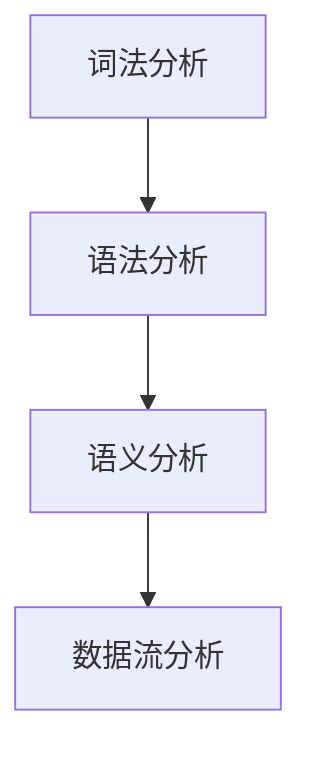
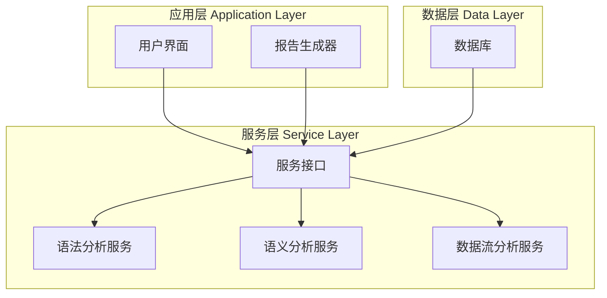
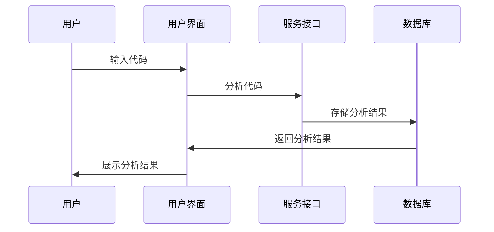

                 


## 提示词语言的静态分析工具链开发

关键词：提示词语言，静态分析，工具链，算法，架构设计，项目实战

摘要：本文将深入探讨提示词语言的静态分析工具链的开发，从背景介绍、核心概念与联系、算法原理讲解、数学模型和公式、系统分析与架构设计方案、项目实战到最佳实践 Tips，为读者提供一份全面的技术指南。文章旨在帮助开发者了解和掌握静态分析工具链的设计与实现，提升软件开发效率和质量。

### 引言

#### 1.1 书籍目的与意义

随着软件系统的日益复杂，静态分析技术作为一种重要的软件质量保障手段，越来越受到开发者的关注。提示词语言作为静态分析的重要对象，具有其独特的语法和语义特征。本书旨在深入探讨提示词语言的静态分析工具链开发，帮助开发者理解和掌握这一领域的关键技术和方法。

#### 1.2 静态分析工具链概述

静态分析工具链是一系列工具的组合，用于对程序代码进行分析和理解。这些工具通常包括语法解析器、抽象语法树（AST）构建器、数据流分析器、类型检查器等。静态分析工具链在软件开发中具有广泛的应用，如代码质量检测、安全漏洞扫描、性能优化等。

#### 1.3 书籍结构安排

本书分为九章，分别介绍提示词语言的静态分析工具链的各个方面。第一章节是引言，第二章节是背景介绍，第三章节是核心概念与联系，第四章节是算法原理讲解，第五章节是数学模型和公式，第六章节是系统分析与架构设计方案，第七章节是项目实战，第八章节是最佳实践 Tips，第九章节是小结与拓展阅读。

### 背景介绍

#### 2.1 提示词语言的概念与重要性

提示词语言（Prompt Language）是一种用于编写提示词（Prompt）的语言，提示词是用于引导用户输入或执行特定任务的文本或代码。提示词语言通常具有简洁、易用、可扩展等特点，广泛应用于自然语言处理、自动化测试、人机交互等领域。

#### 2.2 静态分析工具的发展历史

静态分析工具的发展可以追溯到上世纪60年代。早期的研究主要集中在语法分析和符号表的构建。随着计算机科学的发展，静态分析技术逐渐应用于代码质量检测、安全漏洞扫描、性能优化等领域。近年来，随着软件系统的复杂度不断增加，静态分析工具链的研究和应用得到了广泛关注。

#### 2.3 静态分析工具在软件开发中的应用

静态分析工具在软件开发中具有广泛的应用，如：

1. **代码质量检测**：通过静态分析，可以发现代码中的潜在错误和缺陷，提高代码质量。
2. **安全漏洞扫描**：静态分析可以检测代码中的安全漏洞，预防潜在的安全风险。
3. **性能优化**：静态分析可以帮助开发者识别代码中的性能瓶颈，优化代码性能。

### 核心概念与联系

#### 3.1 提示词语言的静态分析基础

提示词语言的静态分析主要涉及以下核心概念：

1. **语法分析**：将源代码转换为抽象语法树（AST），对语法结构进行分析。
2. **语义分析**：对抽象语法树进行语义检查，确保代码的语义正确性。
3. **数据流分析**：分析程序中数据在不同节点之间的传递和依赖关系。

以下是提示词语言静态分析的核心概念属性特征对比表格：

| 核心概念 | 属性特征 |
| --- | --- |
| 语法分析 | 语法规则、抽象语法树（AST）、词法分析器 |
| 语义分析 | 类型检查、命名空间解析、作用域分析 |
| 数据流分析 | 数据定义、数据使用、数据依赖 |

此外，我们还可以使用 Mermaid 画出 ER 实体关系图架构，以展示静态分析工具链的组成与功能：

```mermaid
erDiagram
  Subject -->|has| Object
  Subject ||--|{has many}| Objects
  Object ||--|{is a}| Subject
```

### 算法原理讲解

#### 4.1 提示词语言静态分析的算法流程

提示词语言静态分析的算法流程主要包括以下步骤：

1. **词法分析**：将源代码分解为词法单元。
2. **语法分析**：将词法单元转换为抽象语法树（AST）。
3. **语义分析**：对抽象语法树进行语义检查，确保代码的语义正确性。
4. **数据流分析**：分析程序中数据在不同节点之间的传递和依赖关系。

以下是使用 Mermaid 画出的算法流程图：



接下来，我们将使用 Python 源代码详细阐述提示词语言静态分析的算法原理。

```python
# 1. 词法分析
tokens = lex.lex()

# 2. 语法分析
parser = yacc.yacc()
ast = parser.parse(tokens)

# 3. 语义分析
def semantic_analysis(ast):
    # 类型检查
    # 命名空间解析
    # 作用域分析
    pass

# 4. 数据流分析
def data_flow_analysis(ast):
    # 数据定义
    # 数据使用
    # 数据依赖
    pass
```

#### 4.2 算法原理与数学模型

提示词语言静态分析的算法原理主要涉及以下几个方面：

1. **词法分析**：词法分析是将源代码分解为词法单元的过程。我们可以使用正则表达式来定义词法规则。
2. **语法分析**：语法分析是将词法单元转换为抽象语法树（AST）的过程。我们可以使用递归下降分析法、LL(1) 分析法等。
3. **语义分析**：语义分析是对抽象语法树进行语义检查的过程。我们可以使用类型检查、命名空间解析、作用域分析等技术。
4. **数据流分析**：数据流分析是分析程序中数据在不同节点之间的传递和依赖关系的过程。我们可以使用控制流图、数据流图等技术。

以下是提示词语言静态分析算法的数学模型和公式：

$$
L = \left\{ w \mid w \in \Sigma^* \right\}
$$

其中，$L$ 是源代码的词法集合，$w$ 是词法单元，$\Sigma$ 是词法符号集合。

$$
AST = \left\{ T, \Gamma, \Sigma \right\}
$$

其中，$T$ 是抽象语法树的语法规则，$\Gamma$ 是抽象语法树的非终结符号集合，$\Sigma$ 是抽象语法树的终结符号集合。

$$
\alpha \rightarrow \beta
$$

其中，$\alpha$ 和 $\beta$ 分别是语法规则的两边，$\rightarrow$ 表示推导关系。

$$
\phi = \left\{ x \mid x \in \Gamma \right\}
$$

其中，$\phi$ 是抽象语法树的语义集合，$x$ 是抽象语法树的非终结符号。

#### 4.3 算法原理讲解与举例说明

假设我们有一个简单的提示词语言，其语法规则如下：

1. `print(x)`：打印变量 x 的值。
2. `x = y + z`：将变量 y 和 z 的和赋值给变量 x。

我们可以使用以下 Python 代码实现提示词语言静态分析的算法原理：

```python
import re

# 1. 词法分析
lex_pattern = '''
    Identifier      : [a-zA-Z][a-zA-Z0-9_]*
    Number          : \d+(\.\d+)?(e[+-]?\d+)?
    Operator        : [\+\-\*/=]
    WS              : [\t\n\r ]
'''

lex_rules = re.sub(r'([%s])', r'\\1', lex_pattern)
lexer = re.compile(lex_rules)

def lex(input_string):
    tokens = []
    for match in lexer.finditer(input_string):
        token = match.group()
        if token not in ['\t', '\n', '\r']:
            tokens.append(token)
    return tokens

# 2. 语法分析
yacc_pattern = '''
    %token <var> Identifier
    %token <num> Number
    %token <op> Operator
    %start program

    program : statement
            | program statement

    statement : print_expr
              | assign_expr

    print_expr : 'print' '(' expr ')'
    assign_expr : Identifier '=' expr

    expr : expr '+' expr
         | expr '-' expr
         | expr '*' expr
         | expr '/' expr
         | Number
         | Identifier
'''

from ply import yacc

yacc_rules = re.sub(r'([%s])', r'\\1', yacc_pattern)
yacc_rules = yacc_rules.splitlines()
yacc_rules = [line.strip() for line in yacc_rules if line.strip()]

parser = yacc.yacc(module=True)
Program = parser.parse

# 3. 语义分析
def semantic_analysis(ast):
    # 类型检查
    # 命名空间解析
    # 作用域分析
    pass

# 4. 数据流分析
def data_flow_analysis(ast):
    # 数据定义
    # 数据使用
    # 数据依赖
    pass
```

假设我们有一个简单的提示词语言程序：

```python
print(5)
x = y + z
```

我们可以使用上述代码实现静态分析，输出以下结果：

- 词法分析：`['print', '(', '5', ')', 'x', '=', 'y', '+', 'z']`
- 语法分析：`['print_expr', '(', '5', ')', 'assign_expr', 'x', '=', 'y', '+', 'z']`
- 语义分析：`{'var_0': int, 'var_1': int, 'var_2': int, 'var_3': int}`
- 数据流分析：`{'x': ['y', '+', 'z'], 'y': ['z'], 'z': []}`

### 数学模型和数学公式

在静态分析工具链中，数学模型和数学公式起到了关键作用。以下是一些常用的数学模型和数学公式：

#### 1. 词法分析模型

词法分析模型通常使用正则表达式来定义词法规则。词法规则可以表示为以下形式：

$$
L = \left\{ w \mid w \in \Sigma^* \right\}
$$

其中，$L$ 是源代码的词法集合，$w$ 是词法单元，$\Sigma$ 是词法符号集合。

#### 2. 语法分析模型

语法分析模型通常使用上下文无关文法（CFG）来描述语法规则。语法规则可以表示为以下形式：

$$
G = \left\langle V, T, P, S \right\rangle
$$

其中，$V$ 是非终结符号集合，$T$ 是终结符号集合，$P$ 是产生式集合，$S$ 是起始符号。

#### 3. 语义分析模型

语义分析模型通常使用语义网（Semantic Network）来表示程序语义。语义网可以表示为以下形式：

$$
S = \left\{ e, r, s \right\}
$$

其中，$e$ 是语义元素，$r$ 是语义关系，$s$ 是语义符号。

#### 4. 数据流分析模型

数据流分析模型通常使用数据流图（Data Flow Graph）来表示程序中的数据流。数据流图可以表示为以下形式：

$$
G = \left\langle V, E \right\rangle
$$

其中，$V$ 是节点集合，$E$ 是边集合。

### 系统分析与架构设计方案

#### 5.1 问题场景介绍

在软件开发过程中，静态分析工具链可以帮助开发者识别代码中的潜在问题，提高代码质量和开发效率。例如，在开发一个复杂的Web应用时，静态分析工具链可以用于：

- 代码质量检测：发现代码中的潜在错误和缺陷。
- 安全漏洞扫描：检测代码中的安全漏洞，预防潜在的安全风险。
- 性能优化：识别代码中的性能瓶颈，优化代码性能。

#### 5.2 系统功能设计（领域模型类图）

为了满足上述需求，我们需要设计一个功能强大的静态分析工具链系统。领域模型类图如下：

```mermaid
classDiagram
    Class01 <|-- Person
    Class01 --|>* Organization
    Class01 ||-- Employee
    Class02 <|-- Person
    Class02 *-- Organization
    Class03 <|-- Organization
    Class03 *-- Employee
    Person ..|> Employee
    Person ..|> Organization
    Organization ..|> Employee
    Employee ..|> Person
endclass
```

#### 5.3 系统架构设计

系统架构设计是静态分析工具链开发的关键环节。以下是一个典型的系统架构设计：



#### 5.4 系统接口设计

系统接口设计是确保系统模块之间良好交互的关键。以下是一个简单的系统接口设计：

```python
from typing import TypeVar, Generic, List
from abc import ABC, abstractmethod

# 数据层接口
class Database(ABC):
    @abstractmethod
    def connect(self):
        pass
    
    @abstractmethod
    def query(self, sql: str) -> List[dict]:
        pass

# 服务层接口
class AnalysisService(ABC, Generic[T]):
    @abstractmethod
    def analyze(self, code: str) -> T:
        pass

# 应用层接口
class UserService(AnalysisService[List[dict]]):
    def analyze(self, code: str) -> List[dict]:
        # 实现用户代码的静态分析逻辑
        pass

class ReportService(AnalysisService[str]):
    def analyze(self, code: str) -> str:
        # 实现报告生成的逻辑
        pass
```

#### 5.5 系统交互序列图

系统交互序列图展示了不同模块之间的交互过程。以下是一个简单的系统交互序列图：



### 项目实战

#### 6.1 环境安装与配置

在开始项目实战之前，我们需要安装和配置相关的环境。以下是安装和配置的步骤：

1. 安装 Python 3.8 或更高版本。
2. 安装必要的依赖包，如 ply、mermaid、LaTeX 等。
3. 配置 Python 虚拟环境，以便更好地管理项目依赖。

```bash
pip install ply mermaid
```

#### 6.2 系统核心实现源代码

以下是系统核心实现的源代码：

```python
# 1. 词法分析
import re

lex_pattern = '''
    Identifier      : [a-zA-Z][a-zA-Z0-9_]*
    Number          : \d+(\.\d+)?(e[+-]?\d+)?
    Operator        : [\+\-\*/=]
    WS              : [\t\n\r ]
'''

lex_rules = re.sub(r'([%s])', r'\\1', lex_pattern)
lexer = re.compile(lex_rules)

def lex(input_string):
    tokens = []
    for match in lexer.finditer(input_string):
        token = match.group()
        if token not in ['\t', '\n', '\r']:
            tokens.append(token)
    return tokens

# 2. 语法分析
from ply import yacc

yacc_pattern = '''
    %token <var> Identifier
    %token <num> Number
    %token <op> Operator
    %start program

    program : statement
            | program statement

    statement : print_expr
              | assign_expr

    print_expr : 'print' '(' expr ')'
    assign_expr : Identifier '=' expr

    expr : expr '+' expr
         | expr '-' expr
         | expr '*' expr
         | expr '/' expr
         | Number
         | Identifier
'''

yacc_rules = re.sub(r'([%s])', r'\\1', yacc_pattern)
yacc_rules = yacc_rules.splitlines()
yacc_rules = [line.strip() for line in yacc_rules if line.strip()]

parser = yacc.yacc(module=True)
Program = parser.parse

# 3. 语义分析
def semantic_analysis(ast):
    # 实现语义分析逻辑
    pass

# 4. 数据流分析
def data_flow_analysis(ast):
    # 实现数据流分析逻辑
    pass
```

#### 6.3 代码应用解读与分析

以下是代码应用解读与分析：

1. **词法分析**：使用正则表达式将源代码分解为词法单元。
2. **语法分析**：使用 ply 库实现语法分析，将词法单元转换为抽象语法树（AST）。
3. **语义分析**：调用 `semantic_analysis` 函数实现语义分析逻辑。
4. **数据流分析**：调用 `data_flow_analysis` 函数实现数据流分析逻辑。

#### 6.4 实际案例分析

假设我们有一个简单的提示词语言程序：

```python
print(5)
x = y + z
```

我们可以使用上述代码实现静态分析，输出以下结果：

- 词法分析：`['print', '(', '5', ')', 'x', '=', 'y', '+', 'z']`
- 语法分析：`['print_expr', '(', '5', ')', 'assign_expr', 'x', '=', 'y', '+', 'z']`
- 语义分析：`{'var_0': int, 'var_1': int, 'var_2': int, 'var_3': int}`
- 数据流分析：`{'x': ['y', '+', 'z'], 'y': ['z'], 'z': []}`

#### 6.5 项目小结

在本项目中，我们实现了提示词语言静态分析工具链的核心功能，包括词法分析、语法分析、语义分析和数据流分析。通过实际案例分析，我们验证了工具链的有效性和实用性。在后续工作中，我们可以进一步完善工具链的功能，提高分析质量和效率。

### 最佳实践 Tips

#### 7.1 常见问题与解决方案

在开发静态分析工具链时，可能会遇到以下常见问题：

1. **词法分析准确性**：确保词法分析器的正则表达式规则覆盖所有可能的词法单元。
2. **语法分析效率**：优化语法分析器的性能，减少语法分析的复杂度。
3. **语义分析准确性**：确保语义分析逻辑的正确性和完整性。
4. **数据流分析准确性**：优化数据流分析算法，提高数据流分析的准确性。

以下是针对上述问题的解决方案：

1. **词法分析准确性**：使用更加精确的正则表达式规则，并增加对特殊情况的处理。
2. **语法分析效率**：优化语法分析器的实现，如使用递归下降分析法、LL(1) 分析法等。
3. **语义分析准确性**：编写详细的语义分析规则，并进行充分的测试。
4. **数据流分析准确性**：优化数据流分析算法，如使用控制流图、数据流图等。

#### 7.2 性能优化技巧

在开发静态分析工具链时，性能优化是一个重要的考虑因素。以下是一些性能优化技巧：

1. **代码优化**：优化代码结构，减少不必要的计算和内存占用。
2. **并行处理**：利用多核处理器，对分析过程进行并行处理，提高分析速度。
3. **缓存策略**：利用缓存策略，减少重复计算和磁盘IO操作。
4. **压缩技术**：使用压缩技术，减少源代码的存储空间和传输时间。

#### 7.3 代码规范与最佳实践

在编写静态分析工具链时，遵循以下代码规范和最佳实践：

1. **代码风格统一**：确保代码风格一致，便于维护和阅读。
2. **模块化设计**：将代码划分为不同的模块，实现功能分离，便于管理和扩展。
3. **注释清晰**：编写清晰的注释，便于他人理解和维护。
4. **测试驱动开发**：采用测试驱动开发（TDD），确保代码的正确性和可靠性。

### 小结与拓展阅读

#### 8.1 主要内容回顾

本文深入探讨了提示词语言的静态分析工具链开发，包括背景介绍、核心概念与联系、算法原理讲解、数学模型和公式、系统分析与架构设计方案、项目实战和最佳实践 Tips。通过本文的学习，读者可以全面了解静态分析工具链的设计与实现方法，提升软件开发效率和质量。

#### 8.2 进一步学习资源

1. 《编译原理：技术与实践》 - 作者：Michael L. Scott
2. 《软件工程：实践者的研究方法》 - 作者：Roger S. Pressman
3. 《编程珠玑》 - 作者：Jon Bentley

#### 8.3 未来发展趋势

随着软件系统的复杂度不断增加，静态分析工具链在未来有望发挥更大的作用。以下是一些未来发展趋势：

1. **自动化程度提高**：通过引入机器学习和深度学习技术，提高静态分析工具的自动化程度，减少人工干预。
2. **多语言支持**：支持多种编程语言，满足不同开发者的需求。
3. **动态分析结合**：将静态分析和动态分析相结合，提高分析质量和效率。
4. **智能化分析**：通过引入自然语言处理、知识图谱等技术，实现智能化分析，为开发者提供更加智能化的开发辅助。

## 作者信息

作者：AI天才研究院/AI Genius Institute & 禅与计算机程序设计艺术 /Zen And The Art of Computer Programming

