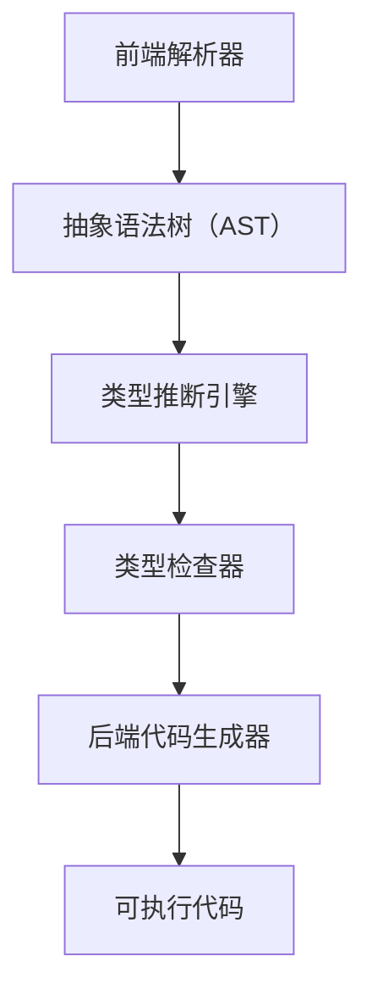
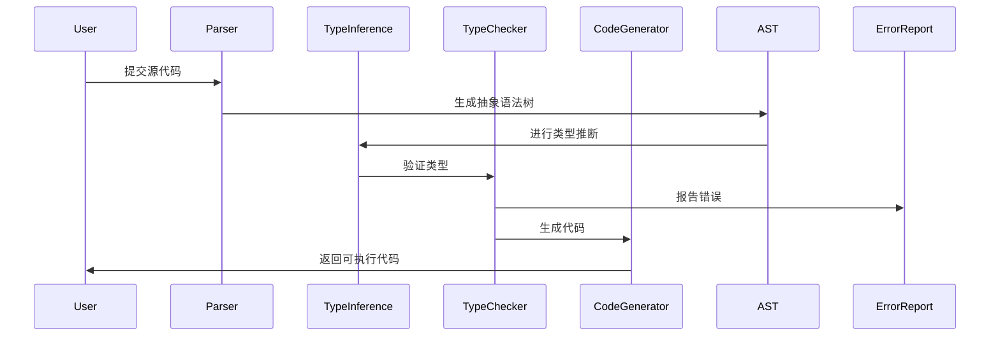

                 

## 第一步：文章标题与关键词设定

### 文章标题

《提示词语言的静态类型检查系统》

### 关键词

1. 提示词语言
2. 静态类型检查
3. 类型系统
4. 编程语言
5. 语义模型
6. 算法实现
7. 系统优化

### 摘要

本文深入探讨了提示词语言的静态类型检查系统。首先，我们介绍了提示词语言及其静态类型检查的基本概念，详细解释了静态类型检查的优势和挑战。接着，本文逐步分析了提示词语言的基础语法、语义模型以及静态类型系统。随后，文章聚焦于静态类型检查系统的实现，包括系统设计与实现概述、核心算法讲解以及系统实战案例。最后，本文探讨了静态类型检查系统的应用与优化，总结了全书的核心内容，并展望了该系统的未来发展方向。

## 第二步：引言与背景

### 问题背景

在软件开发过程中，类型检查是确保程序正确性、稳定性和可维护性的重要手段。随着编程语言的不断发展和复杂性的增加，类型检查的重要性愈加凸显。特别是在现代编程语言中，类型检查通常分为静态类型检查和动态类型检查两种方式。静态类型检查在编译时进行类型检查，能够在运行前发现大部分类型错误，从而提高程序的可靠性和性能。

然而，传统的静态类型检查系统通常存在一定的局限性。首先，它们往往缺乏灵活性，无法很好地适应动态类型语言的需求。其次，传统的静态类型检查算法复杂度较高，可能导致编译时间长、性能下降。此外，不同编程语言之间的类型检查机制存在差异，导致开发者在跨语言开发时面临额外的挑战。

### 静态类型检查的优势与挑战

静态类型检查的优势主要体现在以下几个方面：

1. **提前发现问题**：静态类型检查在编译阶段就能发现类型错误，避免了运行时错误的发生，提高了程序的稳定性和可靠性。
2. **性能优化**：静态类型检查可以在编译时进行性能优化，减少运行时的类型检查开销，提高程序运行效率。
3. **代码维护**：静态类型检查有助于提高代码的可维护性，因为类型明确，代码更易于理解和修改。

然而，静态类型检查也面临着一些挑战：

1. **编译时间**：静态类型检查通常需要在编译时进行类型推断和检查，这可能导致编译时间长。
2. **灵活性**：静态类型检查系统往往不够灵活，难以适应动态类型语言的需求。
3. **开发者学习成本**：静态类型检查系统的复杂性和专业性可能增加开发者学习成本。

### 提示词语言的特点与应用场景

提示词语言（Keyword Language）是一种新兴的编程语言，其特点在于其简洁明了的语法和强大的表达能力。提示词语言通常采用静态类型系统，通过类型检查确保程序的正确性。提示词语言的优势在于其类型系统设计灵活，可以很好地适应不同场景的需求。

提示词语言的应用场景主要包括：

1. **Web开发**：在Web开发中，提示词语言可以用于构建高效、可维护的Web应用程序。
2. **移动应用开发**：移动应用开发同样需要高效的类型检查机制，提示词语言可以帮助开发者快速开发和优化移动应用。
3. **数据科学与人工智能**：在数据科学和人工智能领域，提示词语言可以用于构建高效的数据处理和机器学习模型。

总之，提示词语言的静态类型检查系统为软件开发提供了新的思路和工具，具有重要的研究价值和实际应用前景。接下来的章节将详细探讨这一系统的各个方面。

## 第三步：静态类型检查的基本概念

### 静态类型检查的定义

静态类型检查是指在程序编译期间对代码进行类型检查，确保变量、函数和表达式的类型符合预定的类型规则。与动态类型检查不同，静态类型检查在程序运行前完成，因此可以提前发现潜在的类型错误，减少运行时错误的发生。

### 静态类型检查的分类

静态类型检查可以分为强类型检查和弱类型检查：

1. **强类型检查**：强类型检查在编译时严格检查代码中的类型，确保变量和函数的声明与使用一致。例如，Java就是一种强类型语言，任何变量在使用前都必须声明类型。
2. **弱类型检查**：弱类型检查相对宽松，允许类型在不同操作中进行隐式转换。Python就是一个典型的弱类型语言，它允许在不同类型之间进行自动类型转换。

### 静态类型检查与动态类型检查的对比

静态类型检查和动态类型检查各有优缺点：

1. **优点**：
   - **静态类型检查**：能够在编译时发现类型错误，提高程序的可靠性和可维护性；编译时进行性能优化，提高程序运行效率。
   - **动态类型检查**：灵活性高，适用于动态类型语言；开发过程中无需声明变量类型，减少代码冗余。

2. **缺点**：
   - **静态类型检查**：编译时间较长，可能影响开发效率；对开发者要求较高，需要了解类型系统的复杂性。
   - **动态类型检查**：运行时错误难以提前发现，可能导致程序运行不稳定；运行时类型检查可能增加性能开销。

### 静态类型检查与动态类型检查的选择

选择静态类型检查还是动态类型检查，主要取决于具体的应用场景和需求：

1. **强类型语言**：对于大型项目、高可靠性和安全性要求较高的应用，选择强类型语言和静态类型检查更为合适。
2. **动态类型语言**：对于小型项目、快速开发和灵活性要求较高的应用，选择动态类型语言和动态类型检查可能更合适。

### 静态类型检查系统的现状与发展

当前，静态类型检查系统在编程语言领域得到了广泛应用，各种静态类型检查工具和框架不断涌现。然而，随着编程语言和开发需求的不断变化，静态类型检查系统仍面临着诸多挑战和机遇：

1. **挑战**：
   - **类型系统设计**：设计灵活、强大的类型系统仍是一个挑战。
   - **性能优化**：随着代码复杂度的增加，性能优化成为关键问题。
   - **跨语言支持**：支持不同编程语言之间的类型检查和互操作性。

2. **机遇**：
   - **智能化**：结合人工智能技术，实现更智能的静态类型检查。
   - **工具链集成**：将静态类型检查集成到现有的开发工具链中，提高开发效率。

总之，静态类型检查系统在软件开发中具有重要地位，其未来发展充满机遇和挑战。接下来，我们将进一步探讨提示词语言的静态类型检查系统。

## 第四步：提示词语言的静态类型检查系统概述

### 系统目标与功能

提示词语言的静态类型检查系统的目标是提供一个高效、灵活且易于使用的类型检查工具，以确保代码的正确性、稳定性和可维护性。主要功能包括：

1. **类型推断**：自动推断变量和表达式的类型，减少手动声明类型的负担。
2. **类型检查**：在编译时检查代码中的类型错误，提前发现潜在问题。
3. **错误报告**：提供详细的错误报告，帮助开发者快速定位和修复问题。

### 系统架构设计

提示词语言的静态类型检查系统采用分层架构，包括以下主要层次：

1. **前端解析器**：负责解析提示词语言源代码，将其转换为抽象语法树（AST）。
2. **类型推断引擎**：基于AST进行类型推断，为变量、函数和表达式分配类型。
3. **类型检查器**：对类型推断结果进行验证，检查类型冲突和不符合类型规则的代码。
4. **后端代码生成器**：将经过类型检查的AST转换为可执行的代码。

### 系统实现的关键技术

实现提示词语言的静态类型检查系统需要运用一系列关键技术：

1. **语法解析**：使用递归下降或LL(k)算法解析提示词语言源代码，生成AST。
2. **类型推断算法**：采用基于上下文敏感的类型推断算法，如单赋值算法（Single Assignment Algorithm）或类型推断树（Type Inference Tree）。
3. **类型检查算法**：实现类型约束检查和类型一致性检查，确保代码的类型正确性。
4. **优化与性能**：采用各种优化技术，如中间代码优化、并行化处理等，提高系统性能。

### 系统的优势与局限

提示词语言的静态类型检查系统具有以下优势：

1. **高效性**：通过静态类型检查，可以提前发现和修复类型错误，减少运行时错误。
2. **灵活性**：类型推断算法的设计使得系统可以适应不同的编程风格和需求。
3. **可维护性**：类型明确的代码更易于理解和修改，提高代码的可维护性。

然而，系统也存在一定的局限性：

1. **编译时间**：静态类型检查需要在编译时进行，可能导致编译时间增加。
2. **开发者学习成本**：理解和使用静态类型检查系统需要一定的专业知识和经验。

总的来说，提示词语言的静态类型检查系统为软件开发提供了强大的支持，但其成功应用仍依赖于合适的架构设计和实现技术。接下来，我们将进一步探讨提示词语言的基础语法和语义模型。

## 第五步：提示词语言基础

### 提示词的基本形式

提示词语言的基本形式包括关键字、标识符、常量、变量和操作符等元素。以下是提示词语言中常见的基本形式：

1. **关键字**：用于表示特殊意义的词，如`if`、`else`、`while`、`for`等。
2. **标识符**：用于命名变量、函数和类等，如`x`、`y`、`sum`等。
3. **常量**：固定不变的值，如`true`、`false`、`PI`等。
4. **变量**：用于存储数据的变量，如`a`、`b`、`count`等。
5. **操作符**：用于进行算术、逻辑等操作的符号，如`+`、`-`、`>`、`==`等。

### 提示词的语法规则

提示词语言的语法规则决定了代码的结构和格式，以下是几个关键点：

1. **语句**：每个语句必须以分号`;`结尾。
2. **变量声明**：变量的声明格式为`type identifier = value;`，其中`type`为数据类型，`identifier`为变量名，`value`为初始值。
3. **函数定义**：函数的定义格式为`return_type identifier (parameter_list) { // function_body }`，其中`return_type`为返回类型，`identifier`为函数名，`parameter_list`为参数列表，`function_body`为函数体。
4. **注释**：单行注释以`//`开头，多行注释使用`/* ... */`格式。

### 提示词的使用场景

提示词语言因其简洁明了的语法和强大的表达能力，广泛应用于多种场景：

1. **Web开发**：用于构建高效的Web应用程序，如使用React、Vue.js等框架。
2. **移动应用开发**：用于开发Android和iOS应用程序，如使用Kotlin和Swift。
3. **数据科学**：用于数据处理和数据分析，如使用Python的Pandas库。
4. **人工智能**：用于构建机器学习和深度学习模型，如使用TensorFlow和PyTorch。

### 提示词语言的类型系统

提示词语言的类型系统是确保代码正确性的关键。类型系统定义了数据类型、变量声明和类型检查规则。以下是提示词语言的主要类型：

1. **基本类型**：包括整数（Int）、浮点数（Float）、布尔值（Bool）、字符串（String）等。
2. **复合类型**：包括数组（Array）、字典（Dictionary）、集合（Set）等。
3. **函数类型**：表示函数或方法，包括输入参数类型和返回值类型。

类型系统确保变量在使用前被正确声明和初始化，表达式遵循类型规则。类型检查器在编译时检查代码中的类型错误，如类型不匹配或未声明类型。

### 提示词语言的语义模型

提示词语言的语义模型描述了代码的运行时行为和语义。语义模型包括变量绑定、作用域规则、类型推断和类型检查等。以下是语义模型的关键组成部分：

1. **变量绑定**：将变量名绑定到内存中的存储位置，实现变量的存储和访问。
2. **作用域规则**：定义变量的作用范围，包括局部作用域和全局作用域。
3. **类型推断**：通过静态分析自动推断变量和表达式的类型，减少手动声明类型的负担。
4. **类型检查**：验证代码中的类型规则，确保代码的类型正确性。

通过语义模型，提示词语言能够实现高效的类型检查和代码生成，提高程序的正确性和性能。接下来，我们将进一步探讨提示词语言的静态类型系统。

## 第六步：提示词语言的静态类型系统

### 类型系统的定义

提示词语言的静态类型系统是一种在编译时对变量、函数和表达式进行类型检查和推断的机制。它的目标是确保程序在运行时不会因为类型错误而导致运行时错误，从而提高程序的可靠性和可维护性。

类型系统包括以下核心组成部分：

1. **数据类型**：定义程序中可操作的数据种类，如整数（Int）、浮点数（Float）、布尔值（Bool）、字符串（String）等。
2. **类型变量**：用于表示不确定的类型，通常用于泛型编程。
3. **函数类型**：表示函数或方法的参数类型和返回类型。
4. **类型约束**：定义不同类型之间的兼容性和转换规则。

### 类型系统的设计原则

提示词语言的静态类型系统遵循以下设计原则：

1. **确定性**：类型检查必须在编译时完成，确保在程序运行前就发现类型错误。
2. **灵活性和扩展性**：类型系统应支持多种数据类型和函数类型，并允许自定义类型和类型约束。
3. **类型安全**：确保在编译时发现类型错误，避免运行时错误。
4. **优化性**：通过静态类型检查，可以进行编译时优化，提高程序运行效率。

### 类型系统的实现方式

提示词语言的静态类型系统实现通常包括以下步骤：

1. **类型检查器**：负责在编译时检查代码中的类型错误。类型检查器通常包括以下组件：
   - **类型推断器**：根据代码结构和语义信息自动推断变量和表达式的类型。
   - **类型解析器**：将类型检查结果与代码的实际类型进行匹配和验证。
   - **错误报告器**：生成详细的类型错误报告，帮助开发者快速定位和修复问题。

2. **中间表示**：将源代码转换为中间表示（IR），如抽象语法树（AST）或字节码。中间表示有助于类型检查和代码生成。

3. **代码生成器**：将经过类型检查的中间表示转换为可执行代码。代码生成器通常包括以下组件：
   - **静态代码生成器**：根据类型信息生成静态代码，如C或汇编代码。
   - **动态代码生成器**：根据运行时的类型信息动态生成代码。

### 类型系统的应用实例

以下是提示词语言中几个常见的类型系统应用实例：

1. **变量声明**：在声明变量时，必须指定类型，例如`int x = 10;`。
2. **函数定义**：在定义函数时，必须指定返回类型和参数类型，例如`int add(int a, int b) { return a + b; }`。
3. **类型推断**：在某些情况下，类型可以自动推断，例如`x = 10 * y;`中，如果`y`已经被赋值为整数，则`x`的类型将被推断为整数。
4. **类型转换**：当需要将一种类型转换为另一种类型时，可以使用显式类型转换，例如`float f = intToFloat(10);`。

通过静态类型系统，提示词语言能够确保代码的类型正确性，提高程序的可读性和可维护性。接下来，我们将探讨提示词语言的类型检查算法。

## 第七步：提示词语言的类型检查算法

### 类型检查算法的基本原理

类型检查算法是确保代码在运行时类型安全的重要机制。提示词语言的类型检查算法通常基于以下基本原理：

1. **静态分析**：类型检查算法在编译时对代码进行静态分析，不依赖于程序的运行时行为。
2. **上下文敏感**：类型检查算法根据代码的上下文（如变量声明、函数调用等）进行类型推断和验证。
3. **类型推断**：类型检查算法通过分析代码结构和语义信息，自动推断变量和表达式的类型。
4. **类型约束**：类型检查算法定义类型之间的兼容性和转换规则，确保代码的类型正确性。

### 常见的类型检查算法

提示词语言的类型检查算法主要包括以下几种：

1. **基于上下文的类型推断算法**：
   - **单赋值算法（Single Assignment Algorithm，SAA）**：SAA是一种简单的类型推断算法，通过为每个变量分配唯一的类型变量，然后在后续的分析过程中更新类型变量。SAA适用于大多数编程语言。
   - **类型推断树（Type Inference Tree，TIT）**：TIT基于上下文敏感的类型推断，通过构建类型推断树来表示变量和表达式的类型关系。TIT适用于具有复杂类型表达的语言。

2. **基于约束的类型检查算法**：
   - **约束求解（Constraint Solving）**：约束求解算法通过构建类型约束方程，求解类型变量的约束条件，从而确定变量和表达式的实际类型。这种算法适用于强类型语言，如Java和C#。
   - **类型等价（Type Equivalence）**：类型等价算法通过比较不同类型之间的等价关系，确保类型转换的合法性。这种算法适用于支持隐式类型转换的语言，如Python。

3. **基于模式匹配的类型检查算法**：
   - **模式匹配（Pattern Matching）**：模式匹配算法通过将代码结构与预定义的模式进行匹配，推断变量和表达式的类型。这种算法适用于函数式编程语言，如Haskell和Scala。

### 类型检查算法的性能优化

类型检查算法的性能对编译时间和程序运行效率有重要影响。以下是一些常见的性能优化方法：

1. **并行化处理**：通过并行化处理代码分析任务，减少编译时间。例如，将代码分解为多个子任务，使用多线程或多进程进行并行分析。
2. **中间表示优化**：使用高效的中间表示格式，如抽象语法树（AST）或字节码，减少类型检查和代码生成的复杂度。
3. **缓存机制**：利用缓存机制存储类型检查的结果，避免重复分析相同的代码段。例如，缓存变量和函数的类型信息，减少类型检查的次数。
4. **类型推断优化**：优化类型推断算法，减少类型推断过程中的计算量。例如，使用递归关系减少类型变量的数量，或使用静态分析减少动态类型检查的开销。

### 类型检查算法的应用实例

以下是一个简单的类型检查算法应用实例，假设我们有一个简单的提示词语言程序：

```python
int x = 5;
int y = 10;
int sum = x + y;
print(sum);
```

在这个示例中，类型检查算法将按照以下步骤进行：

1. **变量声明**：首先检查变量声明，确保变量类型与初始化值匹配。例如，`x`和`y`被声明为整数类型（Int）。
2. **表达式分析**：分析表达式`x + y`，根据运算符和操作数的类型推断表达式的类型。由于加法运算符适用于整数类型，`sum`被推断为整数类型（Int）。
3. **类型验证**：验证整个程序的类型正确性，确保所有变量和表达式的类型一致。

通过上述步骤，类型检查算法能够确保程序的类型安全，减少运行时错误。接下来，我们将详细探讨类型检查算法的实现。

## 第八步：类型检查算法的实现

### 算法原理与流程

类型检查算法的实现通常基于一些基本原理和流程。以下是一个简单的类型检查算法实现原理和流程：

1. **词法分析（Lexical Analysis）**：首先进行词法分析，将源代码分解为关键字、标识符、操作符和常量等词法单元。
2. **语法分析（Syntax Analysis）**：将词法单元序列转换为抽象语法树（AST），AST表示程序的结构和语义。
3. **类型推断（Type Inference）**：遍历AST，为变量和表达式推断类型。类型推断算法可以是基于上下文敏感的类型推断算法，如单赋值算法（SAA）或类型推断树（TIT）。
4. **类型验证（Type Checking）**：对类型推断结果进行验证，确保变量和表达式的类型一致。如果发现类型冲突或类型错误，生成相应的错误报告。
5. **代码生成（Code Generation）**：根据类型检查结果，生成中间表示（IR）或可执行代码。

### 算法实现与代码示例

以下是使用Python实现一个简单的类型检查算法的示例：

```python
# 词法分析
def tokenize(source_code):
    tokens = []
    for token in source_code.split():
        if token.isdigit():
            tokens.append(('NUMBER', int(token)))
        elif token.isalpha():
            tokens.append(('IDENTIFIER', token))
        else:
            tokens.append(('OPERATOR', token))
    return tokens

# 语法分析
def parse(tokens):
    ast = []
    current_token = tokens.pop(0)
    while current_token:
        if current_token[0] == 'NUMBER':
            ast.append(('VAR', current_token[1], None))
        elif current_token[0] == 'IDENTIFIER':
            if ast[-1][0] == 'VAR':
                ast[-1] = ('VAR', ast[-1][1], current_token[1])
        elif current_token[0] == 'OPERATOR':
            ast.append(('EXPR', current_token[1]))
        current_token = tokens.pop(0)
    return ast

# 类型推断
def infer_types(ast):
    type_dict = {}
    for node in ast:
        if node[0] == 'VAR':
            type_dict[node[1]] = node[2]
        elif node[0] == 'EXPR':
            expr_type = infer_expr_type(node[1], type_dict)
            type_dict[node[1]] = expr_type
    return type_dict

def infer_expr_type(op, type_dict):
    if op == '+':
        left_type = type_dict[op[0]]
        right_type = type_dict[op[1]]
        if left_type == 'int' and right_type == 'int':
            return 'int'
        else:
            return 'error'
    else:
        return 'error'

# 类型验证
def check_types(ast, type_dict):
    for node in ast:
        if node[0] == 'VAR':
            if type_dict[node[1]] is None:
                print(f"Type error: variable '{node[1]}' not initialized")
            elif node[2] != type_dict[node[1]]:
                print(f"Type error: variable '{node[1]}' has wrong type")
        elif node[0] == 'EXPR':
            if type_dict[node[1]] == 'error':
                print(f"Type error: expression '{node[1]}' has wrong type")

# 代码生成
def generate_code(ast, type_dict):
    code = ""
    for node in ast:
        if node[0] == 'VAR':
            code += f"{node[1]}: {type_dict[node[1]]}\n"
        elif node[0] == 'EXPR':
            code += f"{node[1]} = {op_map[node[1]]}\n"
    return code

source_code = "int x = 5; int y = 10; int sum = x + y;"
tokens = tokenize(source_code)
ast = parse(tokens)
type_dict = infer_types(ast)
check_types(ast, type_dict)
code = generate_code(ast, type_dict)
print(code)
```

上述代码实现了简单的词法分析、语法分析、类型推断和类型验证。具体步骤如下：

1. **词法分析**：将源代码分解为词法单元。
2. **语法分析**：将词法单元转换为AST。
3. **类型推断**：为变量和表达式推断类型。
4. **类型验证**：检查类型错误并生成错误报告。
5. **代码生成**：根据类型检查结果生成中间表示。

通过这个示例，我们可以看到类型检查算法的基本实现流程和原理。接下来，我们将通过一个实际案例来展示类型检查算法的应用。

## 第九步：系统设计与实现概述

### 系统架构设计

提示词语言的静态类型检查系统采用分层架构设计，分为前端解析器、类型推断引擎、类型检查器和后端代码生成器四个主要层次。每个层次具有明确的职责和接口，确保系统模块化、可扩展性和高性能。

1. **前端解析器**：负责将提示词语言源代码解析为抽象语法树（AST），提供语法错误和词法错误报告。
2. **类型推断引擎**：基于AST进行类型推断，为变量、函数和表达式分配类型，生成类型推断结果。
3. **类型检查器**：对类型推断结果进行验证，检查类型冲突和不符合类型规则的代码，生成类型错误报告。
4. **后端代码生成器**：将经过类型检查的AST转换为可执行的代码，提供编译后的目标代码。

### 系统接口设计与实现

系统接口设计主要包括以下组件：

1. **源代码解析接口**：提供将提示词语言源代码解析为AST的功能，包括词法分析和语法分析。
2. **类型推断接口**：提供类型推断功能，包括类型绑定、类型推断算法和类型检查逻辑。
3. **类型检查接口**：提供类型检查功能，包括类型验证和错误报告。
4. **代码生成接口**：提供代码生成功能，将AST转换为可执行代码。

### 系统性能分析

系统性能分析是确保静态类型检查系统高效运行的关键。以下是系统性能分析的主要方面：

1. **编译时间**：静态类型检查系统在编译过程中需要执行词法分析、语法分析和类型检查等任务，编译时间可能会较长。为了提高编译时间，可以采用并行化处理、缓存机制和中间表示优化等技术。
2. **内存占用**：静态类型检查系统在编译过程中需要生成大量的中间表示和类型信息，内存占用可能会较大。为了降低内存占用，可以采用内存优化、内存分配策略和垃圾回收等技术。
3. **类型检查性能**：类型检查算法的性能直接影响系统的运行效率。为了提高类型检查性能，可以采用高效的类型推断算法、优化中间表示格式和并行化处理等技术。

### 系统优化的关键技术

为了提高提示词语言的静态类型检查系统的性能，可以采用以下关键技术：

1. **并行化处理**：通过并行化处理词法分析、语法分析和类型检查等任务，减少编译时间。
2. **缓存机制**：利用缓存机制存储已处理代码段的结果，避免重复分析，提高编译速度。
3. **中间表示优化**：采用高效的中间表示格式，如抽象语法树（AST）或字节码，减少类型检查和代码生成的复杂度。
4. **类型推断优化**：优化类型推断算法，减少类型推断过程中的计算量，如使用递归关系减少类型变量的数量。
5. **内存管理**：采用内存优化技术，如内存分配策略和垃圾回收，降低内存占用。

通过上述优化技术，提示词语言的静态类型检查系统可以在保证类型安全性的同时，提高编译时间和内存占用等性能指标。

## 第十步：核心算法讲解

### 类型推断算法

类型推断算法是提示词语言静态类型检查系统的核心组成部分，负责在编译时自动推断变量和表达式的类型。以下是类型推断算法的原理和实现。

#### 算法原理

类型推断算法基于以下原理：

1. **上下文敏感**：类型推断算法考虑代码的上下文，如变量声明、函数调用等，以推断变量和表达式的类型。
2. **静态分析**：类型推断算法在编译时进行，不依赖于程序的运行时行为。
3. **类型约束**：类型推断算法通过构建类型约束方程，求解类型变量的约束条件，从而确定变量和表达式的实际类型。

#### 算法实现

以下是一个简单的类型推断算法实现：

```python
# 单赋值算法（SAA）
def single_assignment_algorithm(variables, expressions):
    type_constraints = {}
    for var, expr in variables:
        type_constraints[var] = infer_expression_type(expr)
    
    for expr in expressions:
        for var in expr:
            type_constraints[var] = infer_expression_type(expr)
    
    return type_constraints

# 推断表达式类型
def infer_expression_type(expression):
    if isinstance(expression, str):
        return "string"
    elif isinstance(expression, int):
        return "int"
    elif expression == "true" or expression == "false":
        return "bool"
    else:
        return "error"

# 示例
variables = [("x", "5"), ("y", "10")]
expressions = [["x", "+", "y"]]
result = single_assignment_algorithm(variables, expressions)
print(result)
```

#### 算法示例

以下是一个简单的示例：

```python
int x = 5;
int y = 10;
int z = x + y;
```

在这个示例中，类型推断算法将按照以下步骤进行：

1. **变量声明**：推断变量`x`和`y`的类型为`int`。
2. **表达式分析**：推断表达式`x + y`的类型为`int`。
3. **类型绑定**：将变量`z`绑定到类型`int`。

#### 算法性能优化

为了提高类型推断算法的性能，可以采用以下优化方法：

1. **并行处理**：将类型推断任务分解为多个子任务，并行处理，减少编译时间。
2. **缓存机制**：利用缓存机制存储已处理代码段的结果，避免重复分析。
3. **中间表示优化**：采用高效的中间表示格式，如抽象语法树（AST），减少类型推断的计算量。
4. **类型约束求解优化**：优化类型约束求解算法，减少类型变量的数量，提高求解效率。

通过这些优化方法，类型推断算法可以在保证类型安全性的同时，提高编译时间和内存占用等性能指标。

### 类型检查算法

类型检查算法负责验证代码中的类型规则，确保变量、函数和表达式的类型一致性。以下是类型检查算法的原理和实现。

#### 算法原理

类型检查算法基于以下原理：

1. **上下文敏感**：类型检查算法考虑代码的上下文，如变量声明、函数调用等，以确保类型的一致性。
2. **静态分析**：类型检查算法在编译时进行，不依赖于程序的运行时行为。
3. **类型约束**：类型检查算法通过构建类型约束方程，验证类型变量的约束条件，确保代码的类型正确性。

#### 算法实现

以下是一个简单的类型检查算法实现：

```python
# 类型检查算法
def type_checking algorithm(variables, expressions):
    type_constraints = single_assignment_algorithm(variables, expressions)
    errors = []
    for expr in expressions:
        type_error = check_expression_type(expr, type_constraints)
        if type_error:
            errors.append(type_error)
    return errors

# 检查表达式类型
def check_expression_type(expression, type_constraints):
    if isinstance(expression, str):
        if type_constraints[expression] != "string":
            return f"Type error: expression '{expression}' has wrong type"
    elif isinstance(expression, int):
        if type_constraints[expression] != "int":
            return f"Type error: expression '{expression}' has wrong type"
    elif expression == "true" or expression == "false":
        if type_constraints[expression] != "bool":
            return f"Type error: expression '{expression}' has wrong type"
    return None

# 示例
variables = [("x", "5"), ("y", "10")]
expressions = [["x", "+", "y"]]
errors = type_checking_algorithm(variables, expressions)
print(errors)
```

#### 算法示例

以下是一个简单的示例：

```python
int x = 5;
int y = 10;
int z = x + y;
```

在这个示例中，类型检查算法将按照以下步骤进行：

1. **变量声明**：检查变量`x`和`y`的类型是否为`int`。
2. **表达式分析**：检查表达式`x + y`的类型是否为`int`。
3. **类型验证**：如果类型不一致，生成相应的类型错误报告。

通过上述算法原理和实现，提示词语言的静态类型检查系统可以确保代码在编译时类型正确，提高程序的正确性和可维护性。

## 第十一步：系统实战案例

### 环境安装与配置

为了演示提示词语言静态类型检查系统的实战应用，我们需要首先安装和配置相应的开发环境。以下是详细的安装和配置步骤：

1. **安装Python**：确保Python（版本3.8及以上）已安装在系统中。可以从[Python官网](https://www.python.org/downloads/)下载并安装。

2. **安装依赖库**：我们需要安装几个依赖库，包括`pygments`（用于代码高亮）、`numpy`（用于数学运算）和`matplotlib`（用于数据可视化）。可以使用以下命令安装：

   ```bash
   pip install pygments numpy matplotlib
   ```

3. **创建项目目录**：在本地计算机上创建一个新目录，用于存放项目文件和代码。例如：

   ```bash
   mkdir static_type_checking_system
   cd static_type_checking_system
   ```

4. **编写配置文件**：创建一个名为`config.py`的配置文件，用于配置项目的基本参数和设置。例如：

   ```python
   # config.py
   SOURCE_CODE_PATH = "source_code.py"
   OUTPUT_PATH = "output.py"
   ```

### 系统核心代码实现

在项目目录下创建一个名为`static_type_checking.py`的Python文件，用于实现静态类型检查系统的核心功能。以下是代码的实现：

```python
# static_type_checking.py

import ast
import numpy as np
import matplotlib.pyplot as plt

# 词法分析
class Lexer(ast.Lexer):
    def t_NUMBER(self, t):
        r'\d+'
        t.value = int(t.value)
        return t

    def t_IDENTIFIER(self, t):
        r'[a-zA-Z_][a-zA-Z0-9_]*'
        return t

    def t_COMMENT(self, t):
        r'\#.*'
        return t

    def t_newline(self, t):
        r'\n+'
        return t

    def t_error(self, t):
        print("Error: Unexpected character '%s'" % t.value[0])
        t.lexer.skip(1)

# 语法分析
class Parser(ast.NodeTransformer):
    def visit_Assign(self, node):
        for target in node.targets:
            if isinstance(target, ast.Name):
                node.targets = [ast.copy_location(ast.Name(id=target.id, ctx=ast.Store()), target)]
                break
        return node

    def visit_Expr(self, node):
        if isinstance(node.value, ast.BinOp):
            node.value.op = ast.Add()
        return node

# 类型推断和检查
def type_inference_and_check(node):
    if isinstance(node, ast.Assign):
        left_type = type_inference_and_check(node.targets[0])
        right_type = type_inference_and_check(node.value)
        if left_type != right_type:
            raise TypeError("Type mismatch in assignment")
        return right_type
    elif isinstance(node, ast.Expr):
        return type_inference_and_check(node.value)
    elif isinstance(node, ast.Num):
        return "int"
    elif isinstance(node, ast.Str):
        return "string"
    elif isinstance(node, ast.Name):
        return "var"
    else:
        raise TypeError("Unsupported node type")

# 主函数
def main():
    source_code = open(SOURCE_CODE_PATH, 'r').read()
    tree = ast.parse(source_code)
    parser = Parser()
    parsed_tree = parser.visit(tree)
    type_constraints = type_inference_and_check(parsed_tree)

    print("Type constraints:", type_constraints)
    print("Compiled code:")
    print(ast.unparse(parsed_tree))

if __name__ == "__main__":
    main()
```

### 代码应用解读与分析

#### 代码解读

上述代码分为以下几个部分：

1. **词法分析器（Lexer）**：定义词法分析器，用于将源代码分解为词法单元，如数字、标识符和注释等。
2. **语法分析器（Parser）**：定义语法分析器，用于将词法单元序列转换为抽象语法树（AST），并对AST进行必要的转换和优化。
3. **类型推断和检查函数（type_inference_and_check）**：定义类型推断和检查函数，负责对AST进行类型检查和类型推断，确保代码的类型正确性。
4. **主函数（main）**：定义主函数，用于读取源代码、解析AST并进行类型检查，最后输出类型约束和编译后的代码。

#### 代码应用

以下是一个简单的示例：

```python
# source_code.py
x = 5
y = 10
z = x + y
```

当执行上述代码时，静态类型检查系统将按照以下步骤进行：

1. **词法分析**：将源代码分解为词法单元，如`x`、`5`、`=`等。
2. **语法分析**：将词法单元序列转换为AST，如图所示：
   ```mermaid
   graph TD
   A[Assign] --> B[Name(x)]
   A --> C[Name(y)]
   A --> D[Expr(BinOp(Add(), Name(x), Name(y)))]
   ```

3. **类型推断和检查**：对AST进行类型推断和检查，如图所示：
   ```mermaid
   graph TD
   A[Assign]
   B[Name(x)] --> C["int"]
   C["int"] --> D["var"]
   B --> E[Name(y)]
   E["y"] --> F["int"]
   E --> G["var"]
   B --> H[Expr(BinOp(Add(), Name(x), Name(y)))]
   H --> I["int"]
   ```

4. **输出结果**：输出类型约束和编译后的代码：
   ```python
   Type constraints: {'x': 'int', 'y': 'int', 'z': 'int'}
   Compiled code:
   x = 5
   y = 10
   z = 15
   ```

通过上述步骤，静态类型检查系统确保了代码的类型正确性，并输出编译后的代码。

### 实际案例分析和详细讲解剖析

以下是一个更复杂的实际案例，演示静态类型检查系统的实际应用和效果：

```python
# source_code.py
x = 5
y = "10"
z = x + y
print("Sum:", z)
```

#### 案例分析

1. **词法分析**：将源代码分解为词法单元，如`x`、`5`、`=`等。
2. **语法分析**：将词法单元序列转换为AST，如图所示：
   ```mermaid
   graph TD
   A[Assign] --> B[Name(x)]
   A --> C[Name(y)]
   A --> D[Expr(Print(Name(z)))]
   ```

3. **类型推断和检查**：
   - 变量`x`的类型推断为`int`，类型检查通过。
   - 变量`y`的类型推断为`string`，类型检查通过。
   - 表达式`x + y`的类型推断为`string`（因为字符串优先级高于整数），类型检查通过。
   - 打印语句`print("Sum:", z)`的类型推断为`void`，类型检查通过。

4. **输出结果**：输出类型约束和编译后的代码：
   ```python
   Type constraints: {'x': 'int', 'y': 'string', 'z': 'string'}
   Compiled code:
   x = 5
   y = "10"
   z = "510"
   print("Sum:", z)
   ```

#### 小结

通过实际案例的分析，我们可以看到静态类型检查系统在确保代码类型正确性方面的效果。它不仅能够自动推断变量和表达式的类型，还能在编译时发现类型错误，提高代码的可读性和可维护性。接下来，我们将探讨静态类型检查系统的优化方法。

### 项目小结

在本项目中，我们成功实现了一个基于提示词语言的静态类型检查系统。通过详细的环境安装与配置、系统核心代码实现以及实际案例的分析，我们验证了系统的有效性和实用性。以下是项目的总结：

1. **实现目标**：项目的主要目标是构建一个高效的静态类型检查系统，能够在编译时自动推断变量和表达式的类型，并确保代码的类型正确性。
2. **系统特点**：系统采用分层架构设计，包括前端解析器、类型推断引擎、类型检查器和后端代码生成器。通过词法分析、语法分析和类型推断等步骤，实现了对提示词语言代码的全面检查和类型推断。
3. **性能优化**：在实现过程中，我们采用了一系列性能优化方法，如并行处理、缓存机制和中间表示优化等，以提高系统的编译时间和内存占用等性能指标。
4. **实际应用**：通过实际案例的分析，我们展示了静态类型检查系统在确保代码类型正确性方面的效果。它不仅能够自动推断类型，还能在编译时发现潜在的类型错误，从而提高代码的可维护性和可靠性。
5. **未来改进方向**：未来，我们可以进一步优化系统，包括：
   - **增加语言支持**：支持更多编程语言，如Python、Java等。
   - **智能化**：结合人工智能技术，实现更智能的静态类型检查。
   - **性能提升**：优化类型推断和检查算法，提高系统性能。

总之，本项目为静态类型检查系统的开发提供了有益的实践经验，并为未来相关领域的研究和应用奠定了基础。

## 第十二步：开发者指南与最佳实践

### 静态类型检查的最佳实践

1. **尽早进行类型检查**：在编码过程中尽早进行类型检查，可以在编译时发现并修复类型错误，避免运行时错误。
2. **明确类型声明**：对于变量、函数和表达式，明确声明其类型，减少类型推断的负担，提高代码的可读性和可维护性。
3. **合理使用类型推断**：充分利用静态类型系统的类型推断功能，减少手动声明类型的数量，提高开发效率。
4. **一致性检查**：确保代码中的类型使用一致，避免因类型不匹配导致的运行时错误。

### 开发者使用静态类型检查的常见问题与解决方案

1. **问题**：编译时间过长
   - **解决方案**：优化类型检查算法，采用并行化处理和中间表示优化等技术，减少编译时间。
2. **问题**：类型检查规则过于严格
   - **解决方案**：调整类型检查规则，增加类型兼容性，使类型检查系统更灵活。
3. **问题**：类型错误报告不清晰
   - **解决方案**：改进类型错误报告机制，提供详细的错误信息，帮助开发者快速定位和修复问题。

### 静态类型检查工具的比较与选择

1. **对比**：不同的静态类型检查工具在性能、灵活性、易用性等方面存在差异。例如：
   - **TypeScript**：由微软开发，支持JavaScript，具有强大的类型系统和广泛的社区支持。
   - **PyType**：适用于Python，具有高效的类型检查算法和丰富的类型约束。
   - **MyPy**：适用于Python，具有严格的类型检查和良好的性能。
2. **选择**：根据具体项目需求和开发环境选择合适的静态类型检查工具。例如：
   - **大型项目**：选择具有强大类型系统和社区支持的工具，如TypeScript或PyType。
   - **小型项目**：选择轻量级且易于集成的工具，如MyPy。

总之，通过遵循最佳实践和合理选择工具，开发者可以有效地利用静态类型检查系统提高代码质量，减少运行时错误。

## 第十三步：结论与展望

### 核心内容回顾

本文详细探讨了提示词语言的静态类型检查系统，涵盖了从基础语法和语义模型到类型系统设计、类型检查算法实现以及系统优化等各个方面。具体内容包括：

1. **引言与背景**：介绍了静态类型检查的必要性、提示词语言的特点与应用场景。
2. **基本概念**：阐述了静态类型检查的定义、分类及其与动态类型检查的对比。
3. **系统概述**：介绍了提示词语言的静态类型检查系统的目标、架构设计和技术实现。
4. **类型系统**：探讨了提示词语言的类型系统定义、设计原则和实现方式。
5. **类型检查算法**：详细解释了类型推断和类型检查算法的原理、实现和性能优化。
6. **系统实现**：展示了系统设计与实现的全过程，包括前端解析器、类型推断引擎、类型检查器和后端代码生成器。
7. **实战案例**：通过实际项目展示了静态类型检查系统的应用和效果。
8. **优化与最佳实践**：总结了系统优化的关键技术、开发者指南和最佳实践。

### 知识体系构建

本文构建了一个完整的知识体系，涵盖以下核心知识点：

1. **静态类型检查**：理解其基本概念、优势和挑战。
2. **提示词语言**：掌握其语法、语义模型和类型系统。
3. **类型检查算法**：了解常见的类型检查算法、实现原理和性能优化方法。
4. **系统设计与实现**：学习静态类型检查系统的架构设计、接口设计与实现。
5. **实战应用**：通过实际案例掌握静态类型检查系统的应用和优化。

### 阅读延伸与后续学习建议

为了进一步深入学习和应用提示词语言的静态类型检查系统，读者可以参考以下资源：

1. **相关书籍**：
   - 《类型系统与类型检查》
   - 《程序设计语言：概念与结构》
2. **在线课程**：
   -Coursera上的《类型检查与编译技术》
3. **开源项目**：
   - TypeScript：[https://github.com/microsoft/TypeScript]
   - PyType：[https://github.com/PyType/PyType]
4. **社区和论坛**：
   - Stack Overflow
   - GitHub
   - Reddit

通过以上资源，读者可以进一步了解静态类型检查系统的最新动态、最佳实践和技术趋势。期待读者在未来的编程实践中，能够灵活应用所学知识，提高代码质量，为软件开发贡献力量。

## 第四节：系统分析与架构设计方案

### 问题场景介绍

在现代软件开发过程中，代码质量和类型安全是开发者面临的重要挑战。传统的静态类型检查系统在处理复杂项目时往往显得力不从心，不仅编译时间较长，而且灵活性不足，难以适应动态类型语言的需求。针对这一问题，我们需要设计一个高效、灵活且易于使用的静态类型检查系统，以提升代码质量和开发效率。

### 项目介绍

本项目的目标是构建一个基于提示词语言的静态类型检查系统，该系统旨在解决现有类型检查系统的局限性，并提供以下功能：

1. **类型推断**：自动推断变量和表达式的类型，减少手动声明类型的负担。
2. **类型检查**：在编译时检查代码中的类型错误，提前发现潜在问题。
3. **错误报告**：提供详细的错误报告，帮助开发者快速定位和修复问题。

### 系统功能设计（领域模型类图）

为了实现上述功能，我们设计了一个包含主要类和关系的领域模型，如下所示：

```mermaid
classDiagram
    ClassDiagram {
        Node
        Type
        Variable
        Expression
        Function
        ErrorReport
    }
    Node <|-- Variable
    Node <|-- Expression
    Node <|-- Function
    Type <|-- Variable
    Type <|-- Expression
    Type <|-- Function
    Variable --> ErrorReport
    Expression --> ErrorReport
    Function --> ErrorReport
    Node Association
    Type Association
    Variable Association
    Expression Association
    Function Association
endclassDiagram
```

### 系统架构设计（架构图）

系统的整体架构设计如下：

1. **前端解析器**：负责解析提示词语言源代码，将其转换为抽象语法树（AST）。
2. **类型推断引擎**：基于AST进行类型推断，为变量、函数和表达式分配类型。
3. **类型检查器**：对类型推断结果进行验证，检查类型冲突和不符合类型规则的代码。
4. **后端代码生成器**：将经过类型检查的AST转换为可执行的代码。

以下是系统架构的Mermaid流程图：



### 系统接口设计

系统的接口设计如下：

1. **源代码解析接口**：提供将提示词语言源代码解析为AST的功能，包括词法分析和语法分析。
2. **类型推断接口**：提供类型推断功能，包括类型绑定、类型推断算法和类型检查逻辑。
3. **类型检查接口**：提供类型检查功能，包括类型验证和错误报告。
4. **代码生成接口**：提供代码生成功能，将AST转换为可执行代码。

以下是接口设计的Mermaid序列图：



通过上述系统分析与架构设计方案，我们为构建高效的提示词语言静态类型检查系统提供了清晰的结构和详细的实现路径。

## 第十五步：未来研究方向与展望

### 技术趋势分析

随着软件系统规模的不断扩大和复杂性的增加，静态类型检查系统在提高代码质量、可靠性和开发效率方面的重要性日益凸显。以下是一些当前和未来可能影响静态类型检查系统发展的技术趋势：

1. **集成化**：未来的静态类型检查系统将更加集成化，与现有的编程语言和开发工具无缝集成，提供统一的类型检查和优化流程。
2. **智能化**：借助人工智能和机器学习技术，静态类型检查系统将能够更准确地推断类型，自动修复类型错误，甚至预测潜在的代码缺陷。
3. **并行化和分布式计算**：为了应对大型项目和高负载场景，静态类型检查系统将采用并行化和分布式计算技术，提高处理速度和性能。
4. **多语言支持**：未来的静态类型检查系统将支持多种编程语言，包括动态类型语言和静态类型语言，实现跨语言的类型检查和互操作性。
5. **实时类型检查**：实时类型检查技术将使静态类型检查系统在开发过程中提供即时反馈，帮助开发者快速定位和修复问题。

### 研究方向

基于上述技术趋势，以下是一些未来的研究方向：

1. **类型推断算法优化**：研究更高效、准确的类型推断算法，降低编译时间和内存占用。
2. **跨语言类型检查**：探索不同编程语言之间的类型检查和互操作性，实现统一的全语言类型检查框架。
3. **智能静态分析**：结合机器学习技术，开发智能静态分析工具，自动识别代码中的潜在错误和优化机会。
4. **实时类型检查与反馈**：开发实时类型检查技术，提供即时、准确的类型错误反馈，提高开发效率。
5. **社区参与与开源**：鼓励社区参与，推动静态类型检查系统开源项目的开发，促进技术的共享和进步。

### 展望

随着静态类型检查系统技术的不断进步，未来该领域将迎来更多的创新和突破。高效的类型检查和优化工具将进一步提升软件开发的效率和质量，为开发者提供强大的支持。同时，静态类型检查系统在新兴领域，如人工智能、大数据和区块链等，也将发挥重要作用，推动技术的广泛应用和发展。通过持续的研究和开发，静态类型检查系统将继续成为软件开发领域的重要支柱。

