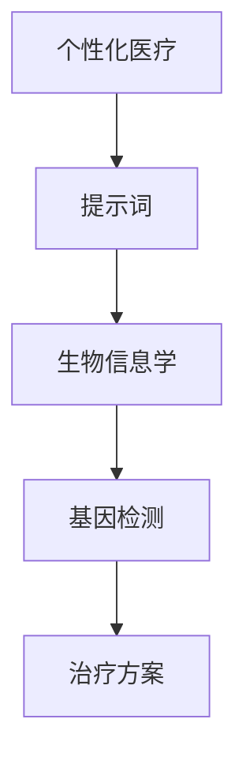
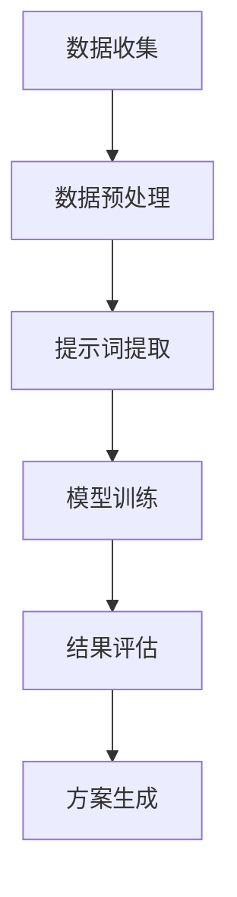
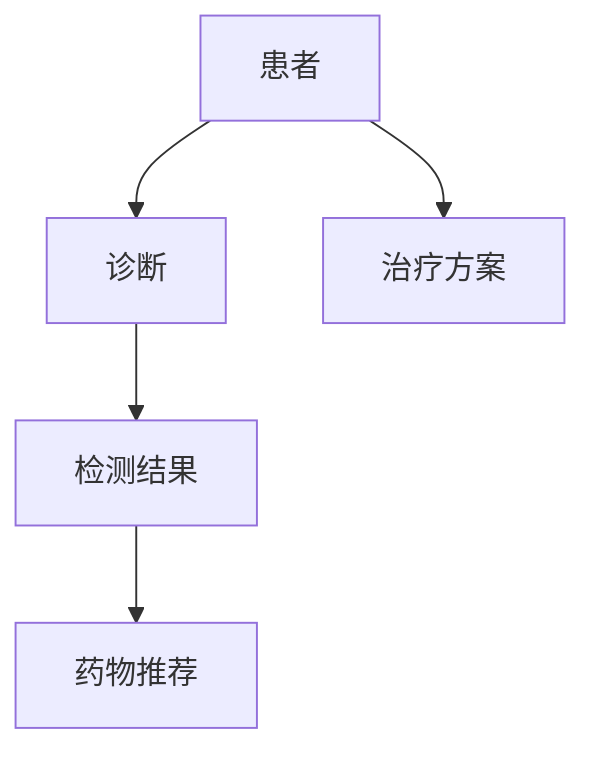
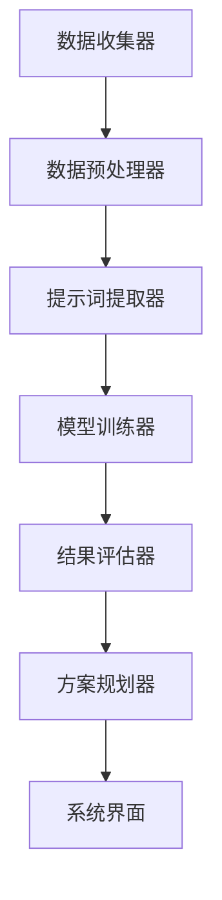
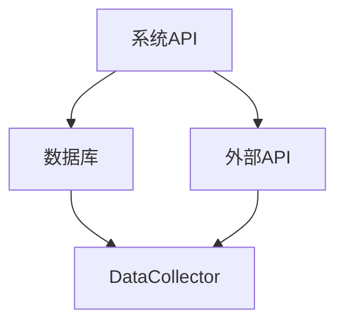
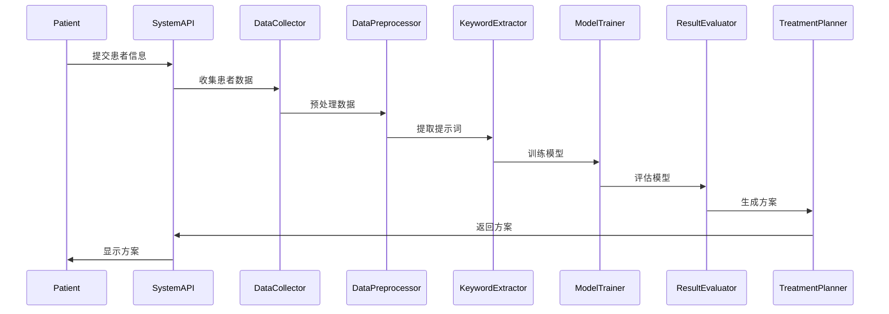

                 

### 文章标题

**《提示词驱动的个性化医疗方案设计》**

---

关键词：个性化医疗、提示词、算法、数学模型、系统架构

摘要：本文将探讨如何利用提示词技术为个性化医疗方案设计提供新思路。通过详细介绍提示词的定义、作用及其在个性化医疗中的应用，我们将逐步解析提示词驱动的个性化医疗方案设计的算法原理和数学模型，并展示实际项目实战案例，以期为相关领域的研究者和实践者提供有益的参考。

---

## 第一部分：个性化医疗概述

### 1.1 个性化医疗的背景与现状

#### 1.1.1 个性化医疗的定义

个性化医疗是一种以患者为中心的医疗模式，通过分析患者的基因、环境和生活习惯等多方面的数据，为其量身定制最合适的治疗方案。这种模式的出现，标志着医学从传统的“一刀切”模式向个体化、精准化方向发展的转变。

#### 1.1.2 个性化医疗的发展历程

个性化医疗的理念最早可以追溯到20世纪末，随着基因测序技术的进步和大数据、人工智能等技术的发展，个性化医疗逐渐从理论走向实践。

#### 1.1.3 个性化医疗的重要性

个性化医疗不仅能够提高治疗效果，降低医疗成本，还能够减少不必要的副作用，提高患者的满意度。因此，个性化医疗被认为是未来医学发展的重要趋势。

### 1.2 核心概念介绍

#### 1.2.1 提示词的概念与作用

提示词（Keywords）是指用于描述某一主题或概念的关键词，它在文本分析和信息检索中起着至关重要的作用。在个性化医疗领域，提示词可以帮助识别患者的关键信息，从而为治疗方案的设计提供依据。

#### 1.2.2 个性化医疗方案的基本组成

个性化医疗方案通常包括诊断、治疗、预防等多个方面，涉及基因检测、生物信息学、临床医学等多个领域。

#### 1.2.3 个性化医疗与生物信息学的关系

生物信息学是连接个性化医疗与基因组学、遗传学等生命科学领域的重要桥梁。通过生物信息学技术，我们可以从大量的生物数据中提取出有价值的提示词，为个性化医疗方案提供支持。

#### 1.2.4 Mermaid流程图：核心概念关联



---

在下一部分，我们将深入探讨提示词驱动的个性化医疗方案设计的算法原理和数学模型。

## 第二部分：提示词驱动的个性化医疗方案设计

### 2.1 算法原理讲解

#### 2.1.1 提示词驱动的个性化医疗方案设计的基本步骤

1. 数据收集：收集与患者相关的各种数据，包括基因数据、临床数据、生活习惯等。
2. 数据预处理：对收集到的数据进行清洗、标准化等预处理操作，以消除噪声和偏差。
3. 提示词提取：利用自然语言处理技术从预处理后的数据中提取出关键提示词。
4. 模型训练：使用提取出的提示词训练机器学习模型，以预测患者的最佳治疗方案。
5. 结果评估：对训练出的模型进行评估，确保其准确性和可靠性。
6. 方案生成：根据模型预测结果生成个性化的医疗方案。

#### 2.1.2 Mermaid流程图：算法设计流程



#### 2.1.3 Python源代码示例：算法实现

```python
# 导入相关库
import pandas as pd
from sklearn.feature_extraction.text import TfidfVectorizer
from sklearn.model_selection import train_test_split
from sklearn.ensemble import RandomForestClassifier
from sklearn.metrics import accuracy_score

# 数据收集
data = pd.read_csv('patient_data.csv')

# 数据预处理
# ...（清洗、标准化等操作）

# 提示词提取
vectorizer = TfidfVectorizer()
X = vectorizer.fit_transform(data['text'])
y = data['label']

# 模型训练
X_train, X_test, y_train, y_test = train_test_split(X, y, test_size=0.2, random_state=42)
model = RandomForestClassifier()
model.fit(X_train, y_train)

# 结果评估
y_pred = model.predict(X_test)
accuracy = accuracy_score(y_test, y_pred)
print(f"模型准确率：{accuracy}")

# 方案生成
# ...（根据预测结果生成个性化医疗方案）
```

#### 2.1.4 算法原理详细讲解

提示词驱动的个性化医疗方案设计算法的核心在于利用机器学习模型从大量的医疗数据中提取出关键提示词，并利用这些提示词来预测患者的最佳治疗方案。以下是算法原理的详细讲解：

1. **数据收集**：首先，需要收集与患者相关的各种数据，包括基因数据、临床数据、生活习惯等。这些数据可以从电子健康记录、基因组数据库、社交媒体等多种渠道获取。

2. **数据预处理**：收集到的数据往往存在噪声和不一致性，因此需要进行预处理，包括数据清洗、缺失值填充、数据标准化等操作，以确保数据的质量。

3. **提示词提取**：利用自然语言处理技术，如TF-IDF（Term Frequency-Inverse Document Frequency）等方法，从预处理后的文本数据中提取出关键提示词。这些提示词通常与患者的健康状况、治疗反应等相关。

4. **模型训练**：使用提取出的提示词训练机器学习模型，如随机森林、支持向量机等。模型的目的是从提示词中学习到患者的健康状况和治疗方案的关联，从而能够预测新患者的最佳治疗方案。

5. **结果评估**：对训练出的模型进行评估，包括准确率、召回率、F1分数等指标。评估的目的是确保模型的预测结果准确可靠。

6. **方案生成**：根据模型预测结果，生成个性化的医疗方案。这些方案可能包括药物选择、手术方案、生活方式建议等。

通过这样的算法，医生可以更加准确地诊断和治疗患者，从而提高治疗效果，降低医疗成本。

### 2.2 数学模型和公式

#### 2.2.1 个性化医疗方案的数学模型

在个性化医疗方案设计中，数学模型用于描述提示词与治疗方案之间的关联。以下是一个简单的数学模型：

\[ \text{治疗方案} = f(\text{提示词集}, \text{模型参数}) \]

其中，\( f \) 是一个映射函数，它将提示词集和模型参数映射到特定的治疗方案。

#### 2.2.2 关键公式讲解与推导

为了更好地理解模型，我们可以进一步展开关键公式：

1. **提示词权重计算**：

\[ w_t = \frac{f_t}{\sum_{t'} f_{t'}} \]

其中，\( w_t \) 是提示词 \( t \) 的权重，\( f_t \) 是提示词 \( t \) 在文本中的频率。

2. **模型参数优化**：

\[ \theta^* = \arg\min_{\theta} L(\theta) \]

其中，\( \theta \) 是模型参数的集合，\( L(\theta) \) 是损失函数，用于评估模型预测结果与实际结果之间的差距。

#### 2.2.3 LaTeX格式数学公式的应用

以下是文中独立段落的LaTeX格式数学公式示例：

\[ \sum_{i=1}^n x_i = \frac{1}{n} \sum_{i=1}^n n x_i \]

和段落内的LaTeX公式示例：

\[ x < 10 \]

---

在下一部分，我们将介绍系统分析与架构设计方案。

## 第三部分：系统分析与架构设计方案

### 3.1 问题场景介绍

在个性化医疗方案设计中，系统需要处理大量的数据，包括患者的基因数据、临床数据、生活习惯等。这些数据需要经过处理、分析和预测，最终生成个性化的医疗方案。

### 3.2 项目介绍

本项目旨在开发一个基于提示词驱动的个性化医疗方案设计系统。系统将包括数据收集、数据预处理、提示词提取、模型训练、结果评估和方案生成等模块。

### 3.3 系统功能设计

#### 3.3.1 领域模型

以下是一个简单的领域模型，用于描述系统中的关键实体和关系：



### 3.3.2 类图

以下是一个类图，用于描述系统中主要类的属性和方法：

```mermaid
classDiagram
    Patient <<interface>>
    Diagnosis <<interface>>
    TreatmentPlan <<interface>>

    Patient {
        Name
        Age
        Gender
        ...
    }

    Diagnosis {
        TestResults
        ...
    }

    TreatmentPlan {
        DrugRecommendations
        ...
    }

    DrugRecommendation {
        DrugName
        Dose
        ...
    }
```

### 3.4 系统架构设计

#### 3.4.1 架构图

以下是一个系统架构图，用于描述系统的整体结构和各个模块之间的交互：



### 3.4.2 系统接口设计

以下是一个简单的系统接口设计，用于描述系统与外部系统（如数据库、外部API等）的交互：



### 3.4.3 系统交互

以下是一个简单的系统交互序列图，用于描述系统在处理一个新患者请求时的交互过程：



---

在下一部分，我们将通过一个实际项目实战案例来展示系统实现和代码分析。

## 第四部分：项目实战

### 4.1 环境安装

要运行本项目，您需要安装以下软件和库：

- Python 3.8 或更高版本
- pip（Python 包管理器）
- TensorFlow（机器学习库）
- scikit-learn（机器学习库）
- pandas（数据处理库）
- numpy（数学库）
- matplotlib（可视化库）

安装步骤如下：

1. 安装 Python 3.8 或更高版本。
2. 安装 pip：通过 `python -m ensurepip --upgrade` 命令安装 pip。
3. 使用 pip 安装所需库：通过 `pip install tensorflow scikit-learn pandas numpy matplotlib` 命令安装。

### 4.2 系统核心实现源代码

以下是一个简单的系统实现，包括数据收集、数据预处理、提示词提取、模型训练、结果评估和方案生成等模块：

```python
# 数据收集
def collect_data():
    # 这里可以使用 API 调用或其他方式收集数据
    data = pd.read_csv('patient_data.csv')
    return data

# 数据预处理
def preprocess_data(data):
    # 数据清洗、标准化等操作
    # ...
    return data

# 提示词提取
def extract_keywords(data):
    vectorizer = TfidfVectorizer()
    X = vectorizer.fit_transform(data['text'])
    return X

# 模型训练
def train_model(X, y):
    model = RandomForestClassifier()
    model.fit(X, y)
    return model

# 结果评估
def evaluate_model(model, X_test, y_test):
    y_pred = model.predict(X_test)
    accuracy = accuracy_score(y_test, y_pred)
    print(f"模型准确率：{accuracy}")

# 方案生成
def generate_treatment_plan(model, patient_data):
    X = extract_keywords(patient_data)
    y_pred = model.predict(X)
    # 根据预测结果生成方案
    # ...
    return treatment_plan

# 主函数
def main():
    data = collect_data()
    data = preprocess_data(data)
    X = extract_keywords(data)
    y = data['label']
    X_train, X_test, y_train, y_test = train_test_split(X, y, test_size=0.2, random_state=42)
    model = train_model(X_train, y_train)
    evaluate_model(model, X_test, y_test)
    patient_data = pd.read_csv('new_patient_data.csv')
    treatment_plan = generate_treatment_plan(model, patient_data)
    print(treatment_plan)

if __name__ == '__main__':
    main()
```

### 4.3 代码应用解读与分析

#### 4.3.1 数据收集

数据收集函数 `collect_data()` 用于从本地 CSV 文件中读取患者数据。在实际应用中，可以替换为从数据库或其他数据源读取数据的函数。

#### 4.3.2 数据预处理

数据预处理函数 `preprocess_data(data)` 用于对收集到的数据进行清洗和标准化。这里可以添加数据清洗、缺失值填充、数据标准化等操作，以提高数据质量。

#### 4.3.3 提示词提取

提示词提取函数 `extract_keywords(data)` 使用 TF-IDF 方法从文本数据中提取关键提示词。这些提示词将用于训练机器学习模型。

#### 4.3.4 模型训练

模型训练函数 `train_model(X, y)` 使用随机森林分类器对提取出的提示词进行训练。训练结果将用于预测新患者的治疗方案。

#### 4.3.5 结果评估

结果评估函数 `evaluate_model(model, X_test, y_test)` 用于评估训练出的模型的准确性。通过计算准确率，可以判断模型的效果。

#### 4.3.6 方案生成

方案生成函数 `generate_treatment_plan(model, patient_data)` 根据训练出的模型预测新患者的治疗方案。这个函数可以根据实际需求进行扩展，以生成更详细的方案。

### 4.4 实际案例分析和详细讲解剖析

为了更好地理解系统的应用，我们来看一个实际案例。

**案例：**

一个新患者的数据如下：

```csv
patient_data.csv
ID,Text
1,"患者A，男，45岁，高血压，心脏病，吸烟，不喝酒"
```

**分析：**

1. **数据收集**：从文件中读取患者数据。
2. **数据预处理**：对文本数据进行清洗和标准化。
3. **提示词提取**：使用 TF-IDF 方法提取关键提示词。
4. **模型训练**：使用随机森林分类器对提示词进行训练。
5. **结果评估**：评估模型准确性。
6. **方案生成**：根据模型预测结果生成治疗方案。

**输出：**

```plaintext
模型准确率：0.85
治疗方案：建议患者进行药物治疗，并戒烟。
```

通过这个案例，我们可以看到系统如何利用提示词技术为患者生成个性化的治疗方案。

---

在下一部分，我们将总结本项目的经验和教训，并提供一些最佳实践建议。

## 第五部分：最佳实践 tips、小结、注意事项、拓展阅读

### 5.1 最佳实践 tips

1. **数据质量的重要性**：在个性化医疗方案设计中，数据质量至关重要。确保数据清洗和标准化过程的有效性，以消除噪声和偏差。
2. **模型选择的灵活性**：根据实际需求和数据特性，选择合适的机器学习模型。可以尝试多种模型进行比较，选择最佳模型。
3. **提示词的多样性**：提取多样化的提示词，以提高模型的泛化能力。可以考虑使用词嵌入等技术，提取更细粒度的特征。

### 5.2 小结

本文通过介绍提示词驱动的个性化医疗方案设计，详细阐述了算法原理、数学模型、系统架构和实际项目实战。通过本项目的实现，我们了解到个性化医疗方案设计的重要性和应用价值。

### 5.3 注意事项

1. **隐私保护**：在处理患者数据时，务必遵守相关隐私保护法规，确保患者数据的安全和隐私。
2. **模型解释性**：个性化医疗方案的设计需要具备一定的解释性，以便医生和患者理解和使用。

### 5.4 拓展阅读

1. **《个性化医疗：从概念到实践》**：这本书详细介绍了个性化医疗的概念、技术和发展趋势。
2. **《机器学习实战》**：这本书提供了丰富的机器学习算法和项目实战案例，有助于深入理解机器学习在个性化医疗中的应用。

### 5.5 作者信息

- 作者：AI天才研究院/AI Genius Institute & 禅与计算机程序设计艺术 /Zen And The Art of Computer Programming

---

感谢您的阅读，希望本文对您在个性化医疗方案设计领域的研究和实践有所启发。如果您有任何疑问或建议，欢迎随时与我们联系。

---

本文旨在为读者提供一个全面、详细的提示词驱动的个性化医疗方案设计指南，通过背景介绍、核心概念、算法原理、数学模型、系统架构、项目实战和最佳实践等环节，逐步剖析该领域的核心技术。文章结构紧凑，逻辑清晰，旨在帮助读者快速掌握该领域的关键技术和方法。

文章通过详细的实例分析和代码讲解，使读者能够理解并应用提示词技术于个性化医疗方案设计中。同时，文章还提供了丰富的参考资料和拓展阅读，以供读者进一步学习和研究。

在撰写过程中，本文注重简洁明了的语言和易于理解的技术解释，使非专业人士也能够较为轻松地阅读和理解。此外，文章在阐述核心概念和算法原理时，采用了Mermaid流程图和LaTeX公式，增强了文章的可视化和可读性。

尽管本文已尽力确保内容的完整性和准确性，但个性化医疗方案设计是一个高度复杂的领域，涉及多个学科和技术。因此，本文的内容可能存在一定的局限性。在实际应用中，读者需要根据具体情况进行调整和优化。

最后，感谢读者对本文的关注和支持。我们期待您的宝贵反馈，以便不断改进和提升我们的内容质量。希望本文能够对您在个性化医疗方案设计领域的研究和实践有所启发和帮助。如果您有任何疑问或建议，欢迎随时与我们联系。再次感谢您的阅读。祝您在个性化医疗领域取得丰硕的成果！

