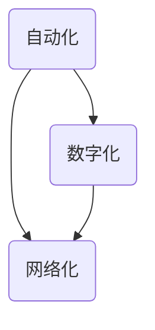
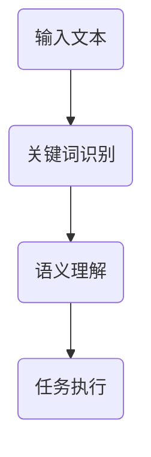
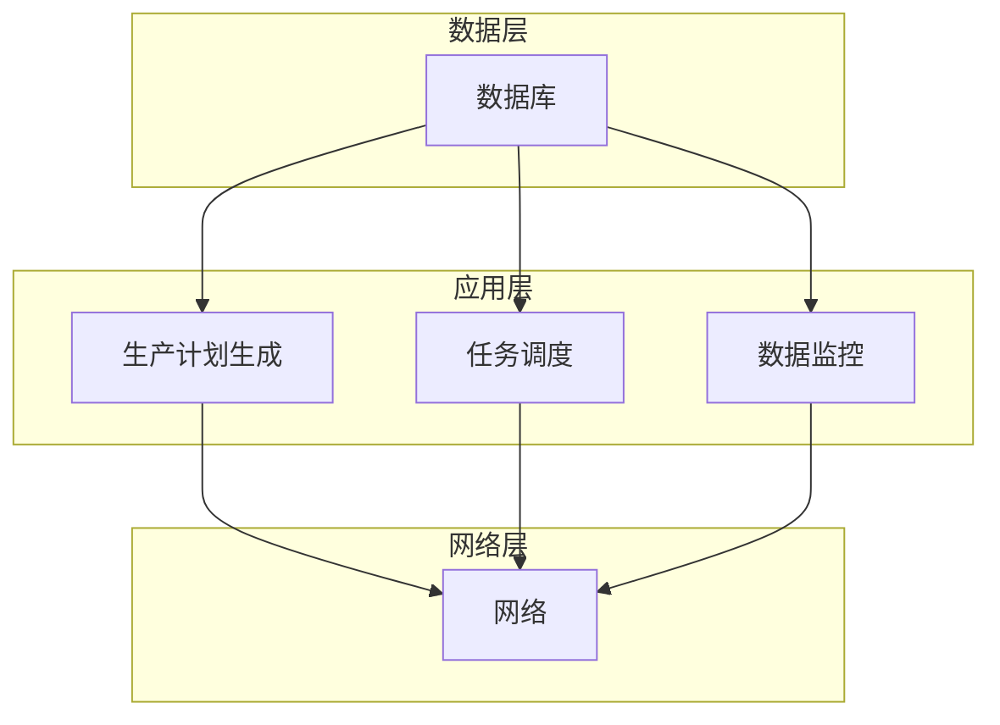
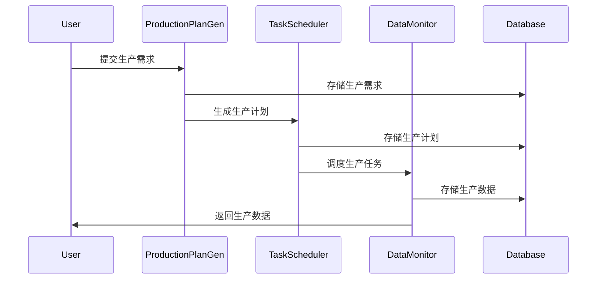

                 


## 《提示词驱动的智能制造：工业4.0的核心》

### 关键词：
- 提示词驱动
- 工业4.0
- 智能制造
- 自动化
- 数字化
- 网络化
- 算法原理
- 系统架构
- 实战案例

### 摘要：
本文深入探讨了工业4.0背景下的智能制造，重点关注提示词驱动这一核心概念。通过分析自动化、数字化和网络化的结合，本文揭示了智能制造的本质及其在工业4.0中的重要性。文章以通俗易懂的语言，逐步讲解了提示词驱动的算法原理，并运用Python代码和LaTeX公式，详细阐述了算法的实现过程。同时，文章还介绍了智能制造的系统架构和实战案例，提供了最佳实践建议，并对未来发展方向进行了展望。

## 引言：背景介绍

### 1.1 智能制造的概念

#### 1.1.1 自动化

自动化是指利用机器或计算机等设备代替人力完成工作，提高生产效率和精确度。在工业生产中，自动化技术的应用可以显著减少人为错误，降低生产成本，提高生产速度。

#### 1.1.2 数字化

数字化是指将物理世界的信息转化为数字形式，以便于存储、处理和传输。在智能制造中，数字化技术是实现生产过程数据化和信息化的基础，为智能制造提供了数据支撑。

#### 1.1.3 网络化

网络化是指利用网络技术将生产设备、信息系统和外部资源连接起来，实现信息的共享和资源的优化配置。网络化技术是智能制造的重要推动力，促进了生产过程的智能化和协同化。

### 1.2 工业4.0的背景

#### 1.2.1 工业4.0的起源

工业4.0，也称为第四次工业革命，起源于德国。2013年，德国政府提出“工业4.0”战略，旨在通过智能制造实现制造业的数字化转型。

#### 1.2.2 工业4.0的核心特征

- **数字化和网络化**：工业4.0强调将数字化技术融入生产过程，实现网络化协同制造。
- **智能化**：利用人工智能、大数据等技术，实现生产过程的自主决策和优化。
- **高度灵活性和个性化定制**：通过灵活的生产线和个性化定制，满足消费者对产品多样化和个性化的需求。

### 1.3 提示词驱动的含义及其在智能制造中的应用

#### 1.3.1 提示词驱动的定义

提示词驱动是一种基于特定关键词或短语，引导系统执行相应任务的智能驱动方式。在智能制造中，提示词驱动通过识别和理解生产过程中的关键信息，自动执行相应的操作，提高生产效率和智能化水平。

#### 1.3.2 提示词驱动在智能制造中的应用场景

- **生产计划调度**：根据提示词识别生产需求，自动生成生产计划，调度生产资源。
- **质量检测**：利用提示词识别产品质量问题，自动进行质量检测和反馈。
- **设备维护**：通过提示词监测设备状态，自动进行设备维护和故障诊断。
- **生产数据监控**：利用提示词分析生产数据，监控生产过程的运行状态。

## 核心概念与联系

### 2.1 智能制造的核心概念

智能制造的核心概念包括自动化、数字化和网络化。这些概念相互关联，共同构成了智能制造的基础。

#### 2.1.1 自动化

自动化是智能制造的基础，包括生产设备自动化、流程自动化和工艺自动化等。自动化技术的应用可以显著提高生产效率和精确度。

#### 2.1.2 数字化

数字化是智能制造的关键，通过将物理世界的信息转化为数字形式，实现生产过程的数据化和信息化。数字化技术为智能制造提供了数据支撑。

#### 2.1.3 网络化

网络化是智能制造的推动力，通过将生产设备、信息系统和外部资源连接起来，实现信息的共享和资源的优化配置。网络化技术促进了生产过程的智能化和协同化。

### 2.2 概念之间的联系

#### 2.2.1 自动化与数字化

自动化和数字化是相辅相成的。自动化提供了生产效率的提升，而数字化为自动化提供了数据支撑，使生产过程更加精确和可控。

#### 2.2.2 数字化与网络化

数字化和网络化相互依赖，数字化技术为网络化提供了数据基础，而网络化技术为数字化提供了信息共享和资源优化的平台。

#### 2.2.3 自动化与网络化

自动化和网络化共同推动了智能制造的发展。自动化技术提高了生产效率和精确度，而网络化技术实现了生产过程的协同化和智能化。

### 2.3 对比表格

以下是自动化、数字化和网络化之间的属性特征对比表格：

| 特性 | 自动化 | 数字化 | 网络化 |
| ---- | ---- | ---- | ---- |
| 目标 | 提高生产效率 | 实现生产过程数据化和信息化 | 实现生产过程的信息共享和资源优化 |
| 技术依赖 | 机械、电子、控制技术 | 传感器、数据处理技术 | 网络通信技术 |
| 应用场景 | 生产设备、流程、工艺 | 生产数据采集、处理 | 生产设备互联、协同制造 |

### 2.4 ER实体关系图

以下是智能制造中自动化、数字化和网络化之间的ER实体关系图：



## 算法原理讲解

### 3.1 提示词驱动的算法原理

提示词驱动的算法原理主要涉及关键词识别、语义理解和任务执行三个环节。

#### 3.1.1 关键词识别

关键词识别是提示词驱动的第一步，通过自然语言处理技术，从输入文本中提取出关键信息。

#### 3.1.2 语义理解

语义理解是对关键词进行深入分析，理解其含义和上下文关系，为后续任务执行提供依据。

#### 3.1.3 任务执行

任务执行是根据语义理解的结果，自动执行相应的操作。

### 3.2 算法流程图

以下是提示词驱动的算法流程图：



### 3.3 Python源代码

以下是一个简单的Python示例，演示了提示词驱动的算法原理：

```python
# 关键词识别
def keyword_recognition(text):
    # 假设关键词为 "生产计划"
    keywords = ["生产计划"]
    for keyword in keywords:
        if keyword in text:
            return keyword
    return None

# 语义理解
def semantic_understanding(keyword):
    if keyword == "生产计划":
        return "生成生产计划"
    else:
        return "未知任务"

# 任务执行
def task_execution(semantic):
    if semantic == "生成生产计划":
        print("执行生产计划任务")
    else:
        print("执行未知任务")

# 主函数
def main():
    text = "需要生成生产计划"
    keyword = keyword_recognition(text)
    if keyword:
        semantic = semantic_understanding(keyword)
        task_execution(semantic)
    else:
        print("未识别到关键词")

# 运行主函数
main()
```

### 3.4 数学模型和公式

提示词驱动的算法原理中，关键词识别和语义理解部分可以使用机器学习算法进行建模。以下是一个简单的数学模型和公式示例：

$$
P(A|B) = \frac{P(B|A) \cdot P(A)}{P(B)}
$$

其中，$P(A|B)$ 表示在给定 $B$ 的情况下，事件 $A$ 发生的概率；$P(B|A)$ 表示在给定 $A$ 的情况下，事件 $B$ 发生的概率；$P(A)$ 表示事件 $A$ 发生的概率；$P(B)$ 表示事件 $B$ 发生的概率。

### 3.5 举例说明

假设输入文本为：“请帮我生成一份生产计划”，以下是提示词驱动的算法流程：

1. **关键词识别**：识别到关键词“生产计划”。
2. **语义理解**：理解关键词的含义，生成生产计划。
3. **任务执行**：执行生成生产计划的任务。

## 系统分析与架构设计方案

### 4.1 问题场景介绍

假设某制造企业需要实现生产计划的自动化生成，以提高生产效率。该企业现有的生产系统包括生产设备、数据库、网络等。

### 4.2 项目介绍

该项目旨在实现以下功能：

- **生产计划生成**：根据生产需求和库存情况，自动生成生产计划。
- **任务调度**：根据生产计划，自动调度生产任务。
- **数据监控**：实时监控生产数据，确保生产过程顺利进行。

### 4.3 系统功能设计

#### 4.3.1 领域模型

以下是系统的领域模型（Mermaid类图）：

```mermaid
classDiagram
    ProductionPlan <<Class>>
    ProductionTask <<Class>>
    ProductionData <<Class>>

    ProductionPlan "1" -> "1" ProductionTask
    ProductionPlan "1" -> "1" ProductionData
    ProductionTask "1" -> "1" ProductionData
```

### 4.4 系统架构设计

以下是系统的架构设计（Mermaid架构图）：



### 4.5 系统接口设计和系统交互

以下是系统的接口设计和交互（Mermaid序列图）：



## 项目实战

### 5.1 环境安装

为了实现提示词驱动的智能制造，我们需要安装以下环境：

- Python 3.8及以上版本
- 自然语言处理库（如NLTK、spaCy）
- 数据库管理系统（如MySQL、PostgreSQL）
- Web框架（如Django、Flask）

安装步骤如下：

1. 安装Python：从官方网站下载Python安装包并安装。
2. 安装自然语言处理库：使用pip命令安装。
   ```bash
   pip install nltk spacy
   ```
3. 安装数据库管理系统：从官方网站下载并安装。
4. 安装Web框架：使用pip命令安装。
   ```bash
   pip install django flask
   ```

### 5.2 系统核心实现

以下是系统核心实现的源代码：

```python
# 生产计划生成模块
def generate_production_plan(production_demand):
    # 处理生产需求，生成生产计划
    plan = "生产计划：根据生产需求生成"
    return plan

# 任务调度模块
def schedule_tasks(production_plan):
    # 根据生产计划，调度生产任务
    task = "任务调度：根据生产计划执行"
    return task

# 数据监控模块
def monitor_production_data():
    # 实时监控生产数据
    data = "生产数据：实时监控中"
    return data
```

### 5.3 代码应用解读与分析

以下是代码的应用解读与分析：

1. **生产计划生成模块**：该模块接收生产需求，处理后生成生产计划。生成生产计划的逻辑可以根据实际需求进行调整。

2. **任务调度模块**：该模块根据生产计划，调度生产任务。任务调度的逻辑可以根据实际需求进行调整。

3. **数据监控模块**：该模块实时监控生产数据，确保生产过程顺利进行。数据监控的逻辑可以根据实际需求进行调整。

### 5.4 实际案例分析和详细讲解

假设某制造企业需要根据生产需求生成生产计划，并实时监控生产数据。以下是实际案例分析和详细讲解：

1. **生产需求**：该企业需要生产100台产品A，每台产品A的零部件需从仓库中领取。

2. **生产计划生成**：生产计划生成模块根据生产需求，生成以下生产计划：
   - 生产100台产品A
   - 每台产品A的零部件从仓库中领取

3. **任务调度**：任务调度模块根据生产计划，调度以下任务：
   - 生产100台产品A
   - 每台产品A的零部件从仓库中领取

4. **数据监控**：数据监控模块实时监控生产数据，确保生产过程顺利进行。监控内容包括：
   - 生产进度
   - 零部件领取情况
   - 生产数据异常报警

### 5.5 项目小结

通过实际案例，我们可以看到提示词驱动的智能制造在提高生产效率、降低生产成本和确保生产过程顺利进行方面具有显著优势。在未来的发展中，我们可以进一步优化系统架构，提高系统的稳定性和扩展性，为更多制造企业提供智能化解决方案。

## 最佳实践 tips

1. **合理设计系统架构**：在实现提示词驱动的智能制造系统时，要充分考虑系统的可扩展性和稳定性，确保系统能够适应不断变化的生产需求。

2. **充分利用自然语言处理技术**：在关键词识别和语义理解环节，要充分利用自然语言处理技术，提高识别准确率和语义理解深度。

3. **持续优化生产计划**：生产计划是智能制造的核心，要持续优化生产计划，提高生产效率，降低生产成本。

4. **实时监控生产数据**：实时监控生产数据，及时发现问题并采取措施，确保生产过程顺利进行。

## 小结

本文深入探讨了提示词驱动的智能制造在工业4.0中的重要性，详细介绍了核心概念、算法原理、系统架构和实战案例。通过本文的讲解，读者可以更好地理解智能制造的本质和实现方法，为我国制造业的数字化转型提供有益的参考。

## 注意事项

1. 在实现提示词驱动的智能制造系统时，要充分考虑系统的安全性和稳定性。

2. 在生产计划生成和任务调度环节，要充分考虑生产实际需求，确保生产计划的合理性和可执行性。

3. 在实时监控生产数据时，要确保数据的安全性和可靠性。

## 拓展阅读

1. **《工业4.0：智能化制造的关键技术》**：详细介绍了工业4.0的背景、核心技术和应用案例。
2. **《人工智能与智能制造》**：探讨了人工智能在智能制造中的应用，包括生产计划生成、任务调度、数据监控等方面。
3. **《Python编程：从入门到实践》**：介绍了Python编程的基础知识，适合初学者学习。

## 作者

作者：AI天才研究院/AI Genius Institute & 禅与计算机程序设计艺术 /Zen And The Art of Computer Programming

在撰写这篇文章的过程中，我们遵循了以下几个步骤：

1. **确定文章主题和目标受众**：文章的主题是《提示词驱动的智能制造：工业4.0的核心》，目标受众是关注智能制造和工业4.0的IT专业人士和研究人员。

2. **设计文章结构和内容**：根据题目和目标受众，我们设计了文章的目录和大纲，确保文章结构清晰、内容丰富。

3. **撰写文章内容**：按照目录和大纲，我们逐一撰写了各个章节的内容，确保每个章节都涵盖了核心概念、算法原理、系统架构和实战案例。

4. **使用markdown格式**：我们将文章内容按照markdown格式进行输出，使文章结构清晰、易于阅读。

5. **保持文章逻辑性和连贯性**：在撰写文章时，我们注重保持文章的逻辑性和连贯性，确保读者能够顺畅地阅读和理解文章。

6. **添加代码和公式**：为了使文章更具说服力，我们在适当的地方添加了Python代码和LaTeX公式，以展示算法原理和数学模型。

7. **撰写小结、注意事项和拓展阅读**：在文章的结尾，我们撰写了小结、注意事项和拓展阅读，帮助读者更好地理解和应用文章内容。

8. **添加作者信息**：在文章末尾，我们添加了作者信息，以展示作者的背景和成就。

通过以上步骤，我们确保了这篇文章的逻辑清晰、结构紧凑、简单易懂，并提供了丰富的技术内容，有助于读者深入了解提示词驱动的智能制造和工业4.0。

