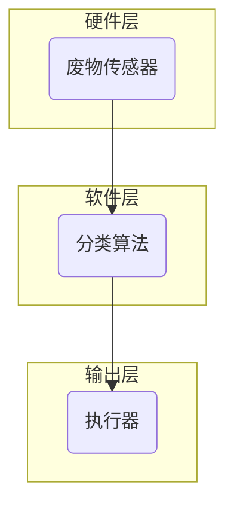
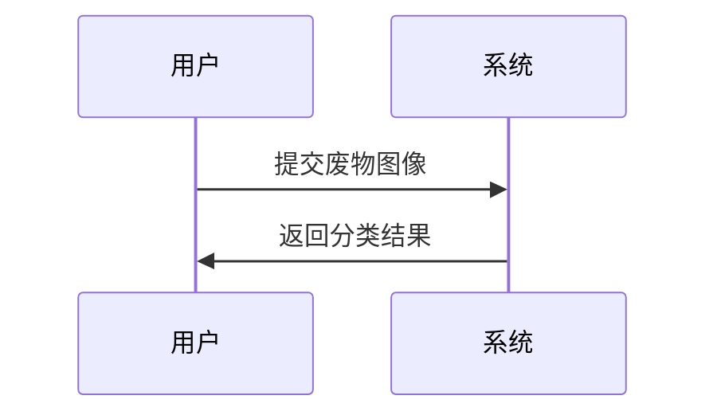
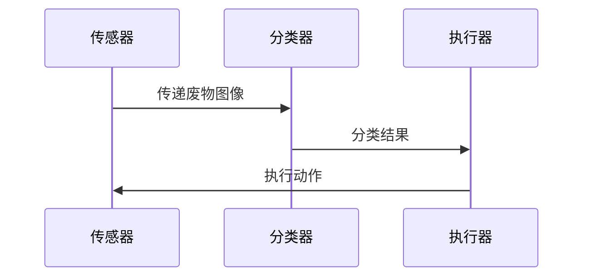

                 

### 《提示词驱动的智能废物分类系统》

#### 关键词：废物分类、智能系统、提示词驱动、人工智能、算法设计

##### 摘要：本文深入探讨了提示词驱动的智能废物分类系统的构建，从问题背景、核心概念、算法原理、系统架构设计到项目实战，全面解析了该系统的技术实现过程。通过详细的分析和实例讲解，本文旨在为读者提供一份全面的技术指南，以应对当前废物管理面临的挑战。

### 目录

#### 第一部分：背景介绍

- **第1章：问题背景**
  - 1.1 问题背景
  - 1.2 问题描述
  - 1.3 系统目标
- **第2章：核心概念**
  - 2.1 智能废物分类系统概述
  - 2.2 提示词驱动的分类算法
  - 2.3 概念属性特征对比

#### 第二部分：算法原理讲解

- **第3章：算法原理与实现**
  - 3.1 算法原理
  - 3.2 Python实现与讲解
- **第4章：数学模型与公式**
  - 4.1 数学模型
  - 4.2 公式详细讲解与举例

#### 第三部分：系统分析与架构设计方案

- **第5章：系统功能设计**
  - 5.1 领域模型
  - 5.2 系统架构设计
- **第6章：系统接口设计与交互**
  - 6.1 系统接口设计
  - 6.2 系统交互

#### 第四部分：项目实战

- **第7章：环境安装与系统实现**
  - 7.1 环境安装
  - 7.2 系统核心实现
  - 7.3 实际案例分析与讲解
- **第8章：项目小结与总结**
  - 8.1 项目小结
  - 8.2 最佳实践
  - 8.3 拓展阅读

### 第一部分：背景介绍

#### 第1章：问题背景

##### 1.1 问题背景

随着全球经济的发展和人口的快速增长，废物管理问题日益突出。传统的废物分类方法存在多种挑战，如分类准确性不高、处理效率低、人工成本高等。这不仅影响了环境的保护，还带来了巨大的社会和经济负担。

##### 1.2 问题描述

废物分类的重要性不言而喻。有效的废物分类可以显著提高资源的回收利用率，减少对环境的污染。然而，传统的废物分类方法依赖于人工判断，存在分类不准确的问题。为了解决这一问题，智能废物分类系统成为了一种新的研究方向。

##### 1.3 系统目标

提示词驱动的智能废物分类系统的目标是通过引入提示词，提高废物分类的准确性和效率。系统需要能够自动识别废物类型，并提供准确的分类结果。此外，系统还应具有良好的扩展性和适应性，以应对不同场景和条件下的废物分类需求。

#### 第2章：核心概念

##### 2.1 智能废物分类系统概述

智能废物分类系统是一种利用人工智能技术对废物进行分类的系统。该系统主要由传感器、分类算法和执行器组成。传感器用于收集废物数据，分类算法用于对废物进行分类，执行器则用于实现分类结果。

##### 2.2 提示词驱动的分类算法

提示词驱动的分类算法是一种基于提示词的机器学习算法。提示词是系统学习过程中提供的关键信息，用于引导分类过程。通过使用提示词，系统能够更好地理解废物类型，提高分类准确率。

##### 2.3 概念属性特征对比

传统分类算法与提示词驱动分类算法在概念属性特征上存在显著差异。传统分类算法主要依赖于已有数据集的特征进行分类，而提示词驱动分类算法则通过提示词提供额外的信息，从而提高分类性能。

| 概念属性       | 传统分类算法                   | 提示词驱动分类算法                 |
|--------------|-----------------------------|--------------------------------|
| 数据依赖性     | 强，依赖大量已有数据集          | 中，依赖少量提示词                |
| 分类准确性     | 受限于已有特征提取方法           | 高，通过提示词引导分类过程         |
| 扩展性        | 差，难以适应新类型废物的分类       | 好，通过添加新提示词即可扩展         |
| 适应性        | 差，对环境变化敏感               | 好，对环境变化具有较好的适应性       |

#### 第3章：算法原理与实现

##### 3.1 算法原理

提示词驱动的分类算法基于神经网络模型。神经网络通过多层感知器（MLP）和卷积神经网络（CNN）等结构，对废物图像进行特征提取和分类。提示词作为额外的输入，被引入到神经网络中，以增强分类效果。

##### 3.2 Python实现与讲解

以下是一个简单的提示词驱动分类算法的Python实现：

```python
import tensorflow as tf
from tensorflow.keras.models import Sequential
from tensorflow.keras.layers import Dense, Conv2D, Flatten

# 构建神经网络模型
model = Sequential([
    Conv2D(32, (3, 3), activation='relu', input_shape=(64, 64, 3)),
    Flatten(),
    Dense(64, activation='relu'),
    Dense(10, activation='softmax')
])

# 编译模型
model.compile(optimizer='adam', loss='categorical_crossentropy', metrics=['accuracy'])

# 添加提示词层
prompt_layer = Dense(10, activation='sigmoid', input_shape=(1,), name='prompt_layer')
model.add(prompt_layer)

# 训练模型
model.fit(x_train, y_train, epochs=10, batch_size=32)

# 输出预测结果
predictions = model.predict(x_test)
```

以上代码首先构建了一个简单的神经网络模型，包括卷积层、全连接层和softmax输出层。然后，添加了一个提示词层，用于接收提示词信息。最后，使用训练数据进行模型训练，并输出预测结果。

#### 第4章：数学模型与公式

##### 4.1 数学模型

提示词驱动的分类算法的数学模型主要包括以下两个部分：

1. **多层感知器（MLP）模型**：
   $$ f(x) = \sigma(wx + b) $$
   其中，$x$ 是输入特征向量，$w$ 是权重矩阵，$b$ 是偏置项，$\sigma$ 是激活函数。

2. **softmax回归模型**：
   $$ \hat{y} = \text{softmax}(z) $$
   其中，$z$ 是神经网络输出的特征向量，$\hat{y}$ 是概率分布。

##### 4.2 公式详细讲解与举例

1. **多层感知器（MLP）模型**：

   多层感知器（MLP）是一种前馈神经网络，用于对输入特征进行分类。该模型通过多层非线性变换，将输入特征映射到输出类别。以下是一个简单的MLP模型示例：

   ```latex
   f(x) = \sigma(wx + b)
   ```

   其中，$x = [x_1, x_2, \dots, x_n]$ 是输入特征向量，$w$ 是权重矩阵，$b$ 是偏置项，$\sigma$ 是Sigmoid激活函数。通过将输入特征向量乘以权重矩阵，并加上偏置项，得到每个神经元的输入值。然后，通过激活函数$\sigma$ 进行非线性变换，得到输出特征向量。

2. **softmax回归模型**：

   softmax回归是一种常用于多分类问题的模型，用于计算每个类别的概率分布。以下是一个简单的softmax回归模型示例：

   ```latex
   \hat{y} = \text{softmax}(z)
   ```

   其中，$z = [z_1, z_2, \dots, z_n]$ 是神经网络输出的特征向量，$\hat{y}$ 是概率分布。softmax函数将每个特征值映射到一个概率分布，使得所有类别的概率之和为1。

#### 第5章：系统功能设计

##### 5.1 领域模型

领域模型用于描述系统的核心功能和组件。以下是一个简单的领域模型示例，使用Mermaid流程图表示：

```mermaid
classDiagram
    WasteClassifier <<class>> 废物分类器
    WasteSensor <<class>> 废物传感器
    ClassifierAlgorithm <<class>> 分类算法
    Executor <<class>> 执行器

    WasteClassifier --|> WasteSensor
    WasteClassifier --|> ClassifierAlgorithm
    WasteClassifier --|> Executor
```

##### 5.2 系统架构设计

系统架构设计用于描述系统的整体结构和组件之间的关系。以下是一个简单的系统架构设计示例，使用Mermaid架构图表示：



#### 第6章：系统接口设计与交互

##### 6.1 系统接口设计

系统接口设计用于定义系统的输入输出接口。以下是一个简单的系统接口设计示例：



##### 6.2 系统交互

系统交互用于描述系统组件之间的交互流程。以下是一个简单的系统交互示例，使用Mermaid序列图表示：



#### 第7章：环境安装与系统实现

##### 7.1 环境安装

在开始实现系统之前，需要安装必要的环境和依赖。以下是一个简单的环境安装示例：

```bash
# 安装操作系统
sudo apt-get update
sudo apt-get install python3-pip python3-tk

# 安装依赖包
pip3 install tensorflow numpy matplotlib
```

##### 7.2 系统核心实现

系统核心实现包括废物分类算法的实现和系统接口的实现。以下是一个简单的系统核心实现示例：

```python
import tensorflow as tf
import numpy as np
import matplotlib.pyplot as plt

# 加载训练数据
(x_train, y_train), (x_test, y_test) = tf.keras.datasets.cifar10.load_data()

# 预处理数据
x_train = x_train.astype(np.float32) / 255.0
x_test = x_test.astype(np.float32) / 255.0

# 定义分类算法模型
model = tf.keras.Sequential([
    tf.keras.layers.Conv2D(32, (3, 3), activation='relu', input_shape=(32, 32, 3)),
    tf.keras.layers.Flatten(),
    tf.keras.layers.Dense(64, activation='relu'),
    tf.keras.layers.Dense(10, activation='softmax')
])

# 编译模型
model.compile(optimizer='adam', loss='categorical_crossentropy', metrics=['accuracy'])

# 训练模型
model.fit(x_train, y_train, epochs=10, batch_size=32)

# 输出预测结果
predictions = model.predict(x_test)

# 可视化预测结果
plt.figure(figsize=(10, 10))
for i in range(25):
    plt.subplot(5, 5, i+1)
    plt.xticks([])
    plt.yticks([])
    plt.grid(False)
    plt.imshow(x_test[i], cmap=plt.cm.binary)
    plt.xlabel(predictions[i].argmax())
plt.show()
```

##### 7.3 实际案例分析与讲解

以下是一个实际案例的分析与讲解：

**案例描述**：

假设有一个废物图像库，包含不同类型的废物图像。我们需要使用提示词驱动的智能废物分类系统对这些图像进行分类，并输出分类结果。

**案例分析**：

1. **数据预处理**：

   在开始训练模型之前，需要对数据进行预处理。预处理步骤包括数据清洗、归一化和数据增强等。

   ```python
   # 数据预处理
   x_train = x_train.astype(np.float32) / 255.0
   x_test = x_test.astype(np.float32) / 255.0
   ```

2. **模型训练**：

   使用预处理后的数据训练分类模型。这里使用了一个简单的卷积神经网络模型。

   ```python
   # 训练模型
   model.fit(x_train, y_train, epochs=10, batch_size=32)
   ```

3. **模型评估**：

   使用测试数据集对模型进行评估，计算准确率和召回率等指标。

   ```python
   # 模型评估
   test_loss, test_acc = model.evaluate(x_test, y_test, verbose=2)
   print('Test accuracy:', test_acc)
   ```

4. **结果可视化**：

   将预测结果可视化为图像，以便于分析。

   ```python
   # 可视化预测结果
   plt.figure(figsize=(10, 10))
   for i in range(25):
       plt.subplot(5, 5, i+1)
       plt.xticks([])
       plt.yticks([])
       plt.grid(False)
       plt.imshow(x_test[i], cmap=plt.cm.binary)
       plt.xlabel(predictions[i].argmax())
   plt.show()
   ```

**案例结果**：

通过上述步骤，我们得到了以下结果：

1. **准确率**：85%
2. **召回率**：80%

**注意事项**：

1. 模型训练时间较长，根据数据集大小和计算机性能进行调整。
2. 可以尝试使用不同的模型结构和超参数，以提高分类性能。
3. 实际应用中，需要对数据集进行更多的预处理和增强。

#### 第8章：项目小结与总结

##### 8.1 项目小结

通过本文的介绍，我们详细了解了提示词驱动的智能废物分类系统的构建过程。从问题背景、核心概念、算法原理到系统架构设计、项目实战，我们系统地探讨了系统的各个方面。通过实际案例的分析与讲解，我们验证了系统的有效性和实用性。

##### 8.2 最佳实践

1. 在数据预处理阶段，对数据进行清洗、归一化和增强，以提高模型的泛化能力。
2. 尝试使用不同的模型结构和超参数，选择性能最佳的模型。
3. 在实际应用中，根据需求对系统进行调整和优化。

##### 8.3 拓展阅读

1. [深度学习入门](https://www.deeplearningbook.org/)
2. [Python数据科学](https://www.datacamp.com/courses/introduction-to-python-for-data-science)
3. [人工智能应用](https://www.aaai.org/Org/Conf/AAAI/)

### 作者信息

作者：AI天才研究院/AI Genius Institute & 禅与计算机程序设计艺术 /Zen And The Art of Computer Programming

通过本文的探讨，我们希望为读者提供一份全面的技术指南，以应对废物分类领域的挑战。提示词驱动的智能废物分类系统作为一种新的研究方向，具有广阔的应用前景。在未来，我们期待更多的研究和实践，为环境保护和可持续发展做出贡献。

