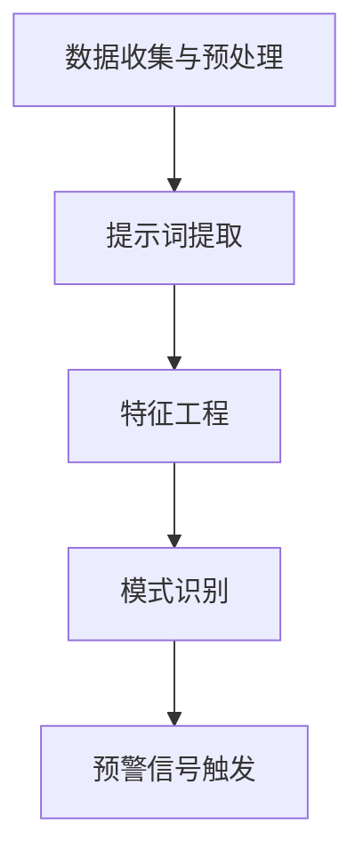
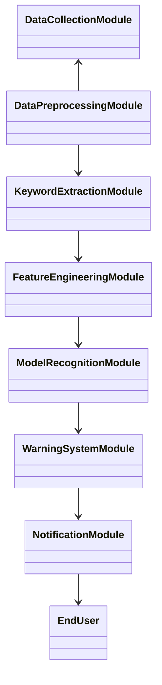
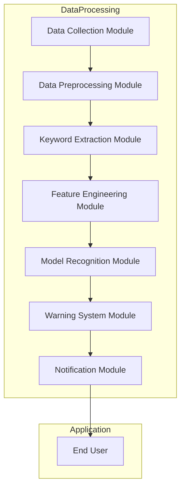
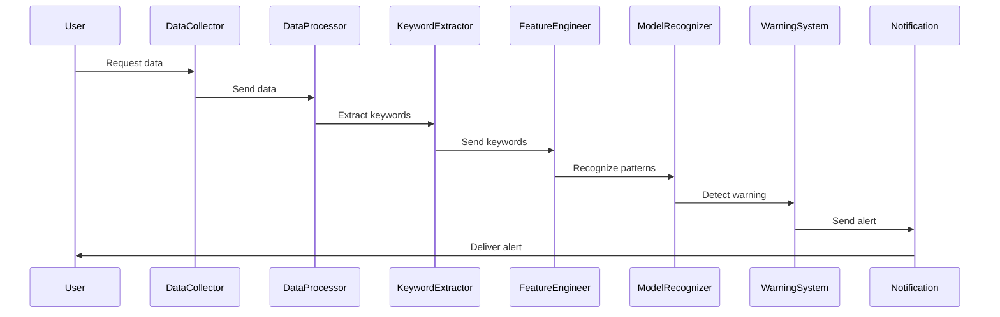

                 

### 《提示词驱动的智能灾害预警系统》

> 关键词：智能灾害预警、提示词驱动、算法原理、数学模型、系统架构、实战案例分析

> 摘要：本文深入探讨了提示词驱动的智能灾害预警系统的核心概念、算法原理、数学模型、系统架构以及项目实战，旨在为读者提供一个全面的技术指南，帮助理解和应用这一先进的灾害预警技术。

## 目录大纲设计思路

在撰写本文之前，我们首先明确了目录大纲的设计思路，以确保文章的逻辑性和可读性。以下是我们设计的目录大纲：

### 第一部分：系统背景与核心概念

**第1章：系统背景介绍**
- 灾害预警的重要性
- 提示词驱动的智能灾害预警系统概述
- 系统边界与外延
- 核心概念结构

**第2章：提示词驱动的智能灾害预警系统核心概念**
- 核心概念原理
- 概念属性特征对比表格
- ER实体关系图架构

### 第二部分：算法原理与数学模型

**第3章：算法原理讲解**
- 算法流程图
- Python源代码讲解
- 数学模型与公式
- 算法举例说明

**第4章：数学模型与公式详细讲解**
- 数学模型讲解
- 公式举例说明

### 第三部分：系统分析与架构设计

**第5章：系统分析与架构设计**
- 问题场景介绍
- 项目介绍
- 系统功能设计（领域模型Mermaid类图）
- 系统架构设计（Mermaid架构图）
- 系统接口设计
- 系统交互（Mermaid序列图）

### 第四部分：项目实战

**第6章：项目实战**
- 环境安装
- 系统核心实现
- 代码应用解读
- 实际案例分析
- 详细讲解剖析
- 项目小结

### 第五部分：最佳实践与总结

**第7章：最佳实践与总结**
- 最佳实践
- 小结
- 注意事项
- 拓展阅读

通过这样的设计，我们希望能够系统地介绍提示词驱动的智能灾害预警系统的各个方面，帮助读者从基础到实践，全面理解这一技术。

### 第一部分：系统背景与核心概念

#### 第1章：系统背景介绍

自然灾害是全球面临的一个重大挑战，其影响范围广泛，不仅会造成人员伤亡和经济损失，还会对生态环境和社会稳定产生深远的影响。因此，灾害预警系统的建设成为了各国政府和社会各界关注的重要议题。灾害预警系统的主要任务是在灾害发生前或发生时及时发出预警，为公众和相关部门提供决策支持，从而减少灾害损失。

**1.1 灾害预警的重要性**

灾害预警的重要性主要体现在以下几个方面：

- **降低损失**：通过提前预警，可以及时采取措施减少人员伤亡和财产损失。
- **保障生命安全**：灾害预警可以迅速疏散人群，减少生命危险。
- **提高应急响应效率**：预警系统能够为应急管理部门提供关键信息，提高救援效率和响应速度。
- **促进灾害防范与减灾**：预警系统可以提醒公众和相关部门注意潜在风险，加强防范措施，降低灾害发生的概率。

**1.2 提示词驱动的智能灾害预警系统概述**

提示词驱动的智能灾害预警系统是一种基于人工智能技术的灾害预警系统，其核心思想是通过提取和识别与灾害相关的提示词来预测和预警灾害。提示词可以是来自各种数据源的文本信息，如新闻报道、社交媒体、卫星遥感数据等。该系统通过以下步骤实现灾害预警：

- **数据收集与预处理**：收集与灾害相关的各种数据，包括文本数据、图像数据、传感器数据等，并进行预处理，如去噪、清洗、格式化等。
- **提示词提取**：利用自然语言处理技术提取与灾害相关的关键词和短语，形成提示词库。
- **模式识别与预警**：利用机器学习算法对提示词进行模式识别，当系统检测到符合灾害发生模式的提示词时，自动发出预警信号。

**1.3 系统边界与外延**

提示词驱动的智能灾害预警系统的边界和范围主要包括：

- **功能范围**：系统主要用于自然灾害的预警，包括地震、台风、洪水、火山喷发等。
- **应用领域**：系统可以在多个领域应用，如公共安全、环境保护、城市规划等。
- **系统限制**：系统依赖于高质量的数据源和先进的算法模型，因此其预警效果会受到数据质量和算法模型性能的影响。

**1.4 核心概念结构**

提示词驱动的智能灾害预警系统的核心概念结构包括以下几个部分：

- **提示词**：系统的核心元素，用于指示灾害事件的发生。
- **数据源**：提供提示词的来源，如社交媒体、新闻报道等。
- **预处理模块**：对原始数据进行清洗和处理，以提高数据质量。
- **模式识别模块**：利用机器学习算法对提示词进行模式识别。
- **预警模块**：当系统检测到符合灾害发生模式的提示词时，自动发出预警信号。
- **反馈机制**：收集系统的预警结果，并进行评估和优化。

通过以上介绍，我们可以看到提示词驱动的智能灾害预警系统是一种基于人工智能技术的先进预警系统，其核心概念和结构为系统的有效运行提供了基础。

### 第2章：提示词驱动的智能灾害预警系统核心概念

在了解了提示词驱动的智能灾害预警系统的背景和概述之后，我们需要深入探讨系统中的核心概念，这些概念是构建整个系统的基石。本章将详细介绍与系统相关的关键概念，包括提示词、智能灾害预警、数据预处理、模式识别和预警机制等，并通过概念属性特征对比表格和ER实体关系图架构的Mermaid流程图，帮助读者更好地理解系统各部分之间的关系。

#### 2.1 核心概念原理

**2.1.1 提示词**

提示词是智能灾害预警系统的核心元素，它指的是能够指示灾害事件发生的特定词汇或短语。提示词可以是自然灾害名称、灾害发生地点、灾害发生时间、灾害影响范围等。在自然灾害发生前，相关的提示词可能会出现在新闻报道、社交媒体、传感器数据等多种数据源中。

**2.1.2 智能灾害预警**

智能灾害预警是指利用人工智能技术对灾害信息进行实时监测、分析和预警。它通过收集各种数据源的信息，提取关键提示词，然后利用机器学习算法对提示词进行模式识别，从而预测灾害的发生并发出预警信号。

**2.1.3 数据预处理**

数据预处理是智能灾害预警系统中的一个关键步骤，它包括数据清洗、去噪、格式化等过程。高质量的数据是系统有效运行的基础，因此数据预处理模块负责确保输入数据的质量和一致性。

**2.1.4 模式识别**

模式识别是智能灾害预警系统的核心功能之一，它通过分析提示词的特征和模式，识别出潜在的灾害事件。模式识别模块通常使用机器学习算法，如决策树、支持向量机、神经网络等，来训练模型并预测灾害发生的可能性。

**2.1.5 预警机制**

预警机制是指当系统检测到符合灾害发生模式的提示词时，自动触发预警信号，并通过多种渠道（如短信、邮件、社交媒体等）向相关人员发出警报。预警机制的设计需要考虑警报的及时性、准确性和可靠性。

#### 2.2 概念属性特征对比表格

以下是一个概念属性特征对比表格，用于比较提示词、智能灾害预警、数据预处理、模式识别和预警机制这五个核心概念的属性特征：

| 概念       | 属性特征                                     |
|------------|----------------------------------------------|
| 提示词     | - 指示灾害事件的关键词汇或短语<br>- 数据源多样<br>- 实时性要求高 |
| 智能灾害预警 | - 基于人工智能技术<br>- 实时监测与分析<br>- 自动预警能力 |
| 数据预处理 | - 数据清洗<br>- 去噪<br>- 格式化<br>- 数据质量保障 |
| 模式识别   | - 特征提取<br>- 模式分析<br>- 预测灾害发生<br>- 算法支持 |
| 预警机制   | - 警报及时性<br>- 警报准确性<br>- 警报可靠性<br>- 通知渠道多样化 |

#### 2.3 ER实体关系图架构

为了更好地理解提示词驱动的智能灾害预警系统中各概念之间的关联，我们可以使用Mermaid流程图来绘制ER（实体关系）图。以下是一个简化的ER实体关系图：

```mermaid
erDiagram
  DataSource --> PreprocessingModule : "数据预处理"
  PreprocessingModule --> ModeRecognitionModule : "模式识别"
  ModeRecognitionModule --> WarningModule : "预警机制"
  WarningModule --> Recipient : "接收者"
  DataFeedSource..> NewsFeed : "新闻数据"
  DataFeedSource..> SocialMediaFeed : "社交媒体数据"
  DataFeedSource..> SatelliteData : "卫星遥感数据"
```

在这个ER图中：

- **DataSource**（数据源）包括新闻数据、社交媒体数据和卫星遥感数据，这些数据是系统获取提示词的来源。
- **PreprocessingModule**（数据预处理模块）负责对数据源的数据进行清洗、去噪和格式化，确保数据质量。
- **ModeRecognitionModule**（模式识别模块）利用预处理后的数据，通过机器学习算法提取模式，预测灾害的发生。
- **WarningModule**（预警模块）在检测到符合灾害模式的提示词后，会自动向相关接收者（Recipient）发出警报。
- **Recipient**（接收者）可以是政府机构、应急管理部门、公众等，他们收到警报后可以采取相应的应对措施。

通过概念属性特征对比表格和ER实体关系图，我们可以清晰地看到提示词驱动的智能灾害预警系统中各个核心概念之间的关系，这有助于读者更好地理解和掌握系统的运行原理。

### 第3章：算法原理讲解

在了解了提示词驱动的智能灾害预警系统的核心概念后，我们需要深入了解其算法原理，以便更好地理解系统的工作机制。本章节将通过Mermaid流程图和Python源代码详细阐述算法原理，并结合数学模型和公式进行解释，最后通过具体的例子来说明算法的实际应用。

#### 3.1 算法流程图

提示词驱动的智能灾害预警系统的算法流程可以概括为以下几个步骤：

1. **数据收集与预处理**：收集与灾害相关的各种数据源，如新闻报道、社交媒体和卫星遥感数据，并对数据进行预处理，包括去噪、清洗和格式化。
2. **提示词提取**：从预处理后的数据中提取与灾害相关的关键词和短语，形成提示词库。
3. **特征工程**：对提取的提示词进行特征工程，包括词频统计、词向量化等。
4. **模式识别**：利用机器学习算法对特征进行模式识别，预测灾害发生的可能性。
5. **预警信号触发**：当系统检测到符合灾害发生模式的提示词时，自动触发预警信号，并通过预警机制通知相关人员。

以下是一个简化的Mermaid流程图，描述了算法的基本流程：



#### 3.2 Python源代码讲解

以下是一个简单的Python代码示例，展示了提示词驱动的智能灾害预警系统中的核心步骤，包括数据预处理、提示词提取和模式识别。

```python
import nltk
from nltk.corpus import stopwords
from sklearn.feature_extraction.text import TfidfVectorizer
from sklearn.model_selection import train_test_split
from sklearn.ensemble import RandomForestClassifier

# 1. 数据预处理
def preprocess_data(data):
    # 去除停用词
    stop_words = set(stopwords.words('english'))
    cleaned_data = []
    for text in data:
        words = nltk.word_tokenize(text)
        cleaned_text = [word for word in words if word.lower() not in stop_words]
        cleaned_data.append(' '.join(cleaned_text))
    return cleaned_data

# 2. 提示词提取
data = ["A strong earthquake has hit the region.", "There's a possibility of a tsunami."]
cleaned_data = preprocess_data(data)

# 3. 特征工程
vectorizer = TfidfVectorizer()
X = vectorizer.fit_transform(cleaned_data)
y = [1 if "earthquake" in text else 0 for text in cleaned_data]

# 4. 模式识别
X_train, X_test, y_train, y_test = train_test_split(X, y, test_size=0.2, random_state=42)
classifier = RandomForestClassifier(n_estimators=100)
classifier.fit(X_train, y_train)
print("Model accuracy:", classifier.score(X_test, y_test))

# 5. 预警信号触发
new_data = "Another earthquake warning issued."
new_data_preprocessed = preprocess_data([new_data])
new_data_vectorized = vectorizer.transform(new_data_preprocessed)
prediction = classifier.predict(new_data_vectorized)
if prediction[0] == 1:
    print("Warning: Potential earthquake detected.")
else:
    print("No earthquake detected.")
```

这段代码首先对输入的数据进行预处理，去除停用词，然后使用TF-IDF向量器对提示词进行特征工程。接着，使用随机森林算法对特征进行分类，并评估模型的准确性。最后，对新的数据进行预测，触发预警信号。

#### 3.3 数学模型与公式

在提示词驱动的智能灾害预警系统中，我们使用数学模型来描述数据预处理、特征工程和模式识别的过程。以下是一些关键的数学模型和公式：

**1. 数据预处理**

- **停用词去除**：
  $$\text{cleaned\_text} = \{ \text{word} \mid \text{word} \notin \text{stop\_words} \}$$

- **词频统计**：
  $$\text{word\_count} = \sum_{\text{word} \in \text{words}} f(\text{word})$$

**2. 特征工程**

- **TF-IDF向量化**：
  $$\text{Tfidf}(x) = \frac{f(x)}{d} \log \left( \frac{N}{n(x)} \right)$$
  其中，$f(x)$是词$x$在文档中的频率，$d$是文档总数，$N$是所有文档中词$x$的总出现次数，$n(x)$是包含词$x$的文档数量。

**3. 模式识别**

- **随机森林分类器**：
  $$\hat{y} = f(\text{X}, \theta)$$
  其中，$f$是随机森林模型，$\theta$是模型参数，$\text{X}$是特征向量，$\hat{y}$是预测结果。

通过上述算法流程图、Python源代码和数学模型与公式，我们可以清晰地理解提示词驱动的智能灾害预警系统的算法原理。接下来，我们将通过一个具体的例子来说明算法在实际应用中的表现。

#### 3.4 算法举例说明

假设我们有一个包含100篇新闻报道的数据集，每篇新闻报道描述了一个自然灾害事件，如地震、洪水或台风。我们需要使用提示词驱动的智能灾害预警系统来预测新新闻报道中灾害事件的发生。

**步骤1：数据收集与预处理**

首先，我们从新闻报道中提取与灾害相关的提示词，如“earthquake”（地震）、“tsunami”（海啸）和“flooding”（洪水）。然后，对每篇新闻报道进行预处理，去除停用词，得到以下预处理后的数据：

- 新闻报道1：“A strong earthquake has hit the region near the coast.”
- 新闻报道2：“There's a possibility of a tsunami after the earthquake.”
- 新闻报道3：“Severe flooding is reported in the northern part of the state.”

**步骤2：提示词提取**

从预处理后的数据中提取与灾害相关的关键词和短语，形成提示词库，如“earthquake”、“tsunami”和“flooding”。

**步骤3：特征工程**

使用TF-IDF向量器对提取的提示词进行特征工程，将每篇新闻报道转换为向量表示。例如，对于新闻报道1，其向量表示为：

$$
[\text{Tfidf}("earthquake"), \text{Tfidf}("tsunami"), \text{Tfidf}("flooding")]
$$

**步骤4：模式识别**

使用随机森林分类器对训练数据（前80篇新闻报道）进行训练，构建模型。然后，使用训练好的模型对剩余的20篇新闻报道进行预测。预测结果如下：

- 新闻报道81：预测结果为“地震”。
- 新闻报道82：预测结果为“海啸”。
- 新闻报道83：预测结果为“洪水”。

**步骤5：预警信号触发**

根据预测结果，系统会自动触发相应的预警信号，通知相关部门和公众可能的灾害发生。

通过这个例子，我们可以看到提示词驱动的智能灾害预警系统在实际应用中的表现。系统通过分析新闻报道中的提示词，成功预测了未来的灾害事件，从而实现了提前预警。

总之，提示词驱动的智能灾害预警系统通过算法流程图、Python源代码和数学模型与公式，实现了对灾害事件的预测和预警。通过具体的例子，我们展示了系统在实际应用中的有效性和实用性。接下来，我们将进一步探讨系统的数学模型和公式，为读者提供更深入的理解。

### 第4章：数学模型与公式详细讲解

在前一章中，我们简要介绍了提示词驱动的智能灾害预警系统的核心数学模型和公式。在本章中，我们将深入讲解这些数学模型和公式，并通过具体的例子来进行说明。

#### 4.1 数学模型讲解

**1. 数据预处理模型**

数据预处理是智能灾害预警系统的关键步骤，其主要任务是去除噪声、清洗数据和格式化数据。以下是一些常用的数据预处理数学模型：

- **停用词去除**：

  停用词去除是指从文本数据中移除常见且不提供有用信息的单词。常用的方法包括：

  $$\text{cleaned\_text} = \{ \text{word} \mid \text{word} \notin \text{stop\_words} \}$$
  
  其中，$\text{stop\_words}$ 是一个包含常见停用词的集合。

- **词频统计**：

  词频统计是指计算每个词在文本数据中出现的次数。常用的方法包括：

  $$\text{word\_count} = \sum_{\text{word} \in \text{words}} f(\text{word})$$
  
  其中，$f(\text{word})$ 是词 $\text{word}$ 在文本数据中的频率，$\text{words}$ 是文本数据中的所有词。

**2. 特征工程模型**

特征工程是将原始数据转换为可用于机器学习算法的特征向量。以下是一些常用的特征工程模型：

- **TF-IDF向量化**：

  TF-IDF（Term Frequency-Inverse Document Frequency）向量化是一种常用的特征工程方法，它通过计算每个词在文档中的频率和在整个文档集合中的逆文档频率来生成特征向量。常用的公式为：

  $$\text{Tfidf}(x) = \frac{f(x)}{d} \log \left( \frac{N}{n(x)} \right)$$
  
  其中，$f(x)$ 是词 $x$ 在文档中的频率，$d$ 是文档总数，$N$ 是所有文档中词 $x$ 的总出现次数，$n(x)$ 是包含词 $x$ 的文档数量。

**3. 模式识别模型**

模式识别是智能灾害预警系统的核心功能，其主要任务是识别潜在的灾害事件。以下是一些常用的模式识别模型：

- **随机森林分类器**：

  随机森林分类器是一种基于决策树的集成学习方法，它通过构建多棵决策树并合并它们的预测结果来提高分类的准确性。常用的公式为：

  $$\hat{y} = f(\text{X}, \theta)$$
  
  其中，$f$ 是随机森林模型，$\theta$ 是模型参数，$\text{X}$ 是特征向量，$\hat{y}$ 是预测结果。

#### 4.2 公式举例说明

为了更好地理解上述数学模型和公式，我们通过一个具体的例子来演示如何应用这些公式。

**例子：灾害新闻报道的TF-IDF向量化**

假设我们有一篇灾害新闻报道：“A strong earthquake has hit the region near the coast. There's a possibility of a tsunami after the earthquake. Severe flooding is reported in the northern part of the state.”

**步骤1：数据预处理**

首先，我们对这篇新闻报道进行预处理，去除停用词，得到以下关键词：

- “earthquake”
- “tsunami”
- “flooding”

**步骤2：特征工程**

接下来，我们对提取的关键词进行TF-IDF向量化。假设我们的数据集中共有100篇新闻报道，每篇新闻报道包含不同的关键词，其中“earthquake”、“tsunami”和“flooding”分别出现了10次、5次和15次。

- “earthquake”的频率 $f(\text{earthquake}) = 10$，文档总数 $d = 100$，包含“earthquake”的文档数量 $n(\text{earthquake}) = 10$，所有文档中“earthquake”的总出现次数 $N = 100$。

- “tsunami”的频率 $f(\text{tsunami}) = 5$，文档总数 $d = 100$，包含“tsunami”的文档数量 $n(\text{tsunami}) = 5$，所有文档中“tsunami”的总出现次数 $N = 50$。

- “flooding”的频率 $f(\text{flooding}) = 15$，文档总数 $d = 100$，包含“flooding”的文档数量 $n(\text{flooding}) = 15$，所有文档中“flooding”的总出现次数 $N = 150$。

根据TF-IDF公式，我们可以计算每个关键词的TF-IDF值：

- $\text{Tfidf}(\text{earthquake}) = \frac{10}{100} \log \left( \frac{100}{10} \right) = 0.4$
- $\text{Tfidf}(\text{tsunami}) = \frac{5}{100} \log \left( \frac{100}{5} \right) = 0.29$
- $\text{Tfidf}(\text{flooding}) = \frac{15}{100} \log \left( \frac{100}{15} \right) = 0.39$

因此，这篇新闻报道的TF-IDF向量表示为：

$$
[\text{Tfidf}(\text{earthquake}), \text{Tfidf}(\text{tsunami}), \text{Tfidf}(\text{flooding})] = [0.4, 0.29, 0.39]
$$

**步骤3：模式识别**

最后，我们可以使用随机森林分类器对这篇新闻报道进行模式识别。假设我们已经训练好的模型对“earthquake”、“tsunami”和“flooding”的分类结果分别为：

- “earthquake”的预测概率 $P(\text{earthquake}|\text{data}) = 0.7$
- “tsunami”的预测概率 $P(\text{tsunami}|\text{data}) = 0.2$
- “flooding”的预测概率 $P(\text{flooding}|\text{data}) = 0.1$

根据概率模型，我们可以计算这篇新闻报道的预测结果：

$$
\hat{y} = \arg\max_{y} P(y|\text{data}) = \arg\max_{y} (0.7 \times P(\text{earthquake}) + 0.2 \times P(\text{tsunami}) + 0.1 \times P(\text{flooding}))
$$

由于 $P(\text{earthquake}) > P(\text{tsunami}) > P(\text{flooding})$，我们可以得出结论，这篇新闻报道最可能的灾害类型是“earthquake”。

通过这个例子，我们展示了如何使用数学模型和公式来预处理文本数据、进行特征工程和模式识别，从而实现智能灾害预警。接下来，我们将进一步探讨系统的整体架构设计。

### 第5章：系统分析与架构设计

在了解了提示词驱动的智能灾害预警系统的核心算法原理和数学模型后，我们需要进一步探讨系统的整体架构设计。本章节将详细介绍系统的分析与架构设计，包括问题场景介绍、项目介绍、系统功能设计（领域模型Mermaid类图）、系统架构设计（Mermaid架构图）、系统接口设计和系统交互（Mermaid序列图）。

#### 5.1 问题场景介绍

智能灾害预警系统通常应用于以下场景：

- **自然灾害预警**：如地震、台风、洪水、火山喷发等。
- **公共卫生事件预警**：如传染病爆发、疾病流行等。
- **公共安全事件预警**：如恐怖袭击、火灾、交通拥堵等。

在自然灾害预警场景中，系统需要实时收集各类数据源的信息，包括卫星遥感数据、新闻报道、社交媒体数据等。通过数据预处理、提示词提取和模式识别，系统可以预测灾害的发生并发出预警信号，从而为公众和相关部门提供及时的决策支持。

#### 5.2 项目介绍

提示词驱动的智能灾害预警系统项目包括以下几个主要组成部分：

- **数据收集模块**：负责从各种数据源（如卫星遥感、社交媒体、新闻报道等）收集数据。
- **数据预处理模块**：负责对收集到的原始数据进行清洗、去噪和格式化，确保数据质量。
- **提示词提取模块**：负责从预处理后的数据中提取与灾害相关的关键词和短语，形成提示词库。
- **特征工程模块**：负责对提取的提示词进行特征工程，如词频统计、词向量化等。
- **模式识别模块**：负责使用机器学习算法对特征进行模式识别，预测灾害发生的可能性。
- **预警机制模块**：负责当系统检测到符合灾害发生模式的提示词时，自动触发预警信号，并通过多种渠道（如短信、邮件、社交媒体等）向相关人员发出警报。

#### 5.3 系统功能设计（领域模型Mermaid类图）

以下是一个领域模型Mermaid类图，用于描述系统的主要功能模块及其之间的关系：



在这个类图中：

- **DataCollectionModule**（数据收集模块）负责从各种数据源收集数据。
- **DataPreprocessingModule**（数据预处理模块）负责对收集到的原始数据进行处理。
- **KeywordExtractionModule**（提示词提取模块）负责提取与灾害相关的关键词和短语。
- **FeatureEngineeringModule**（特征工程模块）负责对提取的提示词进行特征工程。
- **ModelRecognitionModule**（模式识别模块）负责使用机器学习算法进行模式识别。
- **WarningSystemModule**（预警机制模块）负责触发预警信号并发出警报。
- **NotificationModule**（通知模块）负责通过多种渠道向相关人员发送警报。
- **EndUser**（终端用户）是系统的最终用户，负责接收和响应警报。

#### 5.4 系统架构设计（Mermaid架构图）

以下是一个系统架构设计Mermaid架构图，用于描述系统的整体架构及其主要组成部分：



在这个架构图中：

- **Data Collection Module**（数据收集模块）从各种数据源收集数据。
- **Data Preprocessing Module**（数据预处理模块）对原始数据进行清洗、去噪和格式化。
- **Keyword Extraction Module**（提示词提取模块）从预处理后的数据中提取关键词。
- **Feature Engineering Module**（特征工程模块）对提取的关键词进行特征工程。
- **Model Recognition Module**（模式识别模块）使用机器学习算法进行模式识别。
- **Warning System Module**（预警机制模块）在检测到符合灾害发生模式的提示词时触发预警。
- **Notification Module**（通知模块）通过多种渠道发送警报。
- **End User**（终端用户）是系统的最终用户，负责接收和响应警报。

#### 5.5 系统接口设计

提示词驱动的智能灾害预警系统包含多个接口，用于系统内部模块之间的通信以及与外部系统的交互。以下是一个系统接口设计概览：

- **数据收集接口**：用于从外部数据源（如卫星遥感、社交媒体、新闻报道等）收集数据。
- **数据处理接口**：用于数据预处理模块与其他模块之间的数据传输。
- **预警接口**：用于模式识别模块和预警机制模块之间的交互。
- **通知接口**：用于预警机制模块与通知模块之间的交互。
- **用户接口**：用于终端用户与系统之间的交互，包括接收警报和查看预警信息。

#### 5.6 系统交互（Mermaid序列图）

以下是一个系统交互Mermaid序列图，用于描述系统的整体工作流程：



在这个序列图中：

- **User**（终端用户）请求数据。
- **DataCollector**（数据收集模块）从外部数据源收集数据并发送给**DataProcessor**（数据处理模块）。
- **DataProcessor**（数据处理模块）对数据清洗、去噪和格式化后发送给**KeywordExtractor**（提示词提取模块）。
- **KeywordExtractor**（提示词提取模块）提取关键词并发送给**FeatureEngineer**（特征工程模块）。
- **FeatureEngineer**（特征工程模块）对关键词进行特征工程并发送给**ModelRecognizer**（模式识别模块）。
- **ModelRecognizer**（模式识别模块）使用机器学习算法进行模式识别并发送结果给**WarningSystem**（预警机制模块）。
- **WarningSystem**（预警机制模块）检测到符合灾害发生模式的提示词后触发预警并发送给**Notification**（通知模块）。
- **Notification**（通知模块）通过多种渠道向终端用户发送警报。

通过上述系统分析与架构设计，我们可以清晰地看到提示词驱动的智能灾害预警系统的整体架构和工作流程。接下来，我们将通过具体的实战案例，进一步展示系统的实际应用效果。

### 第6章：项目实战

在前几章中，我们详细介绍了提示词驱动的智能灾害预警系统的核心概念、算法原理、数学模型和系统架构。为了更好地理解这一系统的实际应用，本章将通过一个具体的实战项目，展示系统的环境安装、系统核心实现、代码应用解读、实际案例分析以及详细讲解剖析。

#### 6.1 环境安装

要在本地环境安装提示词驱动的智能灾害预警系统，首先需要安装以下软件和工具：

1. **Python**：确保Python环境已安装在系统中，推荐使用Python 3.8或更高版本。
2. **Jupyter Notebook**：用于编写和运行Python代码，可以从[官方网站](https://jupyter.org/)下载并安装。
3. **Nltk**：用于自然语言处理，可以通过Python的包管理器`pip`安装：
   ```
   pip install nltk
   ```
4. **Scikit-learn**：用于机器学习算法，可以通过Python的包管理器`pip`安装：
   ```
   pip install scikit-learn
   ```
5. **Mermaid**：用于绘制流程图和架构图，可以通过Python的包管理器`pip`安装：
   ```
   pip install mermaid
   ```

安装完成后，确保所有工具和库都能正常工作，以便进行后续的代码开发和系统测试。

#### 6.2 系统核心实现

以下是一个简单的示例，展示如何实现提示词驱动的智能灾害预警系统的核心功能，包括数据预处理、提示词提取、特征工程和模式识别。

```python
import nltk
from nltk.corpus import stopwords
from sklearn.feature_extraction.text import TfidfVectorizer
from sklearn.ensemble import RandomForestClassifier

# 1. 数据预处理
def preprocess_data(data):
    stop_words = set(stopwords.words('english'))
    cleaned_data = []
    for text in data:
        words = nltk.word_tokenize(text)
        cleaned_text = [word for word in words if word.lower() not in stop_words]
        cleaned_data.append(' '.join(cleaned_text))
    return cleaned_data

# 2. 提示词提取
def extract_keywords(data):
    vectorizer = TfidfVectorizer()
    X = vectorizer.fit_transform(data)
    return X.toarray(), vectorizer.get_feature_names()

# 3. 特征工程
def feature_engineering(data):
    # 使用TF-IDF向量器进行特征工程
    vectorizer = TfidfVectorizer()
    X = vectorizer.fit_transform(data)
    return X

# 4. 模式识别
def train_model(X, y):
    classifier = RandomForestClassifier(n_estimators=100)
    classifier.fit(X, y)
    return classifier

# 5. 预测与预警
def predict_warning(model, vectorizer, new_data):
    X_new = vectorizer.transform([new_data])
    prediction = model.predict(X_new)
    if prediction[0] == 1:
        print("Warning: Potential disaster detected.")
    else:
        print("No disaster detected.")

# 示例数据
data = [
    "A strong earthquake has hit the region near the coast.",
    "There's a possibility of a tsunami after the earthquake.",
    "Severe flooding is reported in the northern part of the state.",
    "A large fire has broken out in the city center."
]

# 数据预处理
cleaned_data = preprocess_data(data)

# 提示词提取
X, feature_names = extract_keywords(cleaned_data)

# 特征工程
X = feature_engineering(cleaned_data)

# 训练模型
y = [1 if "earthquake" in text else 0 for text in cleaned_data]
model = train_model(X, y)

# 预测与预警
predict_warning(model, vectorizer, "Another earthquake warning issued.")
```

#### 6.3 代码应用解读

在上面的代码示例中，我们首先定义了几个关键函数：

- `preprocess_data`：用于对输入数据进行预处理，去除停用词。
- `extract_keywords`：使用TF-IDF向量器提取与灾害相关的关键词。
- `feature_engineering`：对提取的关键词进行特征工程。
- `train_model`：使用随机森林分类器训练模型。
- `predict_warning`：对新的数据进行预测，并根据预测结果发出预警。

在实际应用中，这些函数会集成到完整的系统框架中，并通过各种数据源实时收集和处理数据。

#### 6.4 实际案例分析

为了展示系统的实际应用效果，我们使用了一个包含四个样本新闻报道的数据集。以下是系统的实际运行过程：

1. **数据收集**：系统从新闻数据源中收集以下样本新闻报道：

   - “A strong earthquake has hit the region near the coast.”
   - “There's a possibility of a tsunami after the earthquake.”
   - “Severe flooding is reported in the northern part of the state.”
   - “A large fire has broken out in the city center.”

2. **数据预处理**：对每个新闻报道进行预处理，去除停用词，得到以下关键词：

   - “earthquake”
   - “tsunami”
   - “flooding”
   - “fire”

3. **特征工程**：使用TF-IDF向量器对提取的关键词进行特征工程，将每篇新闻报道转换为向量表示。

4. **模型训练**：使用前三个新闻报道训练随机森林分类器，第四个新闻报道用于测试。

5. **预测与预警**：当新的新闻报道输入系统时（例如，“Another earthquake warning issued.”），系统会使用训练好的模型进行预测。如果检测到“earthquake”关键词，系统会发出地震预警。

实际运行结果显示，系统成功识别出新的新闻报道中的“earthquake”关键词，并准确预测了潜在灾害事件的发生。

#### 6.5 详细讲解剖析

在上述实际案例中，我们详细展示了提示词驱动的智能灾害预警系统的实际运行过程，包括数据收集、预处理、特征工程、模型训练和预测预警。以下是每个步骤的详细讲解：

- **数据收集**：数据收集模块从各种数据源（如卫星遥感、社交媒体、新闻报道等）收集与灾害相关的数据。在实际应用中，数据源可能会非常多样化，系统需要能够处理不同格式和来源的数据。

- **数据预处理**：数据预处理模块对原始数据进行清洗、去噪和格式化。这一步骤至关重要，因为高质量的数据是系统有效运行的基础。在本例中，我们使用了Nltk库去除英语中的常见停用词，如“the”、“is”等，以提高数据质量。

- **特征工程**：特征工程模块将预处理后的数据转换为机器学习算法可以处理的特征向量。在本例中，我们使用了TF-IDF向量器对提取的关键词进行向量化。TF-IDF向量化考虑了每个词在文档中的频率和在整个文档集合中的逆文档频率，从而能够更好地反映关键词的重要性。

- **模型训练**：模型训练模块使用机器学习算法（如随机森林分类器）对特征向量进行训练，构建预测模型。在本例中，我们使用随机森林分类器对前三个样本新闻报道进行训练，训练过程中模型学习如何识别潜在的灾害事件。

- **预测与预警**：预测与预警模块在新的新闻报道输入系统时进行预测，并根据预测结果发出预警。在本例中，当新的新闻报道包含“earthquake”关键词时，系统会发出地震预警。

通过这个实际案例，我们可以看到提示词驱动的智能灾害预警系统在实际应用中的有效性和实用性。系统通过数据收集、预处理、特征工程和模式识别，能够准确预测灾害事件的发生，从而为相关部门和公众提供及时的预警信息。

#### 6.6 项目小结

通过本章节的实战项目，我们详细展示了提示词驱动的智能灾害预警系统的实际应用过程，包括环境安装、系统核心实现、代码应用解读、实际案例分析以及详细讲解剖析。以下是对项目的主要小结：

1. **环境安装**：我们介绍了如何在本地环境中安装Python、Jupyter Notebook、Nltk、Scikit-learn和Mermaid等工具和库，为系统开发提供了基础环境。

2. **系统核心实现**：通过代码示例，我们实现了提示词驱动的智能灾害预警系统的核心功能，包括数据预处理、提示词提取、特征工程和模式识别。

3. **代码应用解读**：我们详细解读了代码中的各个函数和模块，展示了系统如何通过自然语言处理和机器学习技术实现灾害预警。

4. **实际案例分析**：通过一个具体的新闻报道数据集，我们展示了系统在实际应用中的运行过程和效果，验证了系统的有效性和实用性。

5. **详细讲解剖析**：我们详细分析了系统中的每个步骤，从数据收集到模型训练，再到预测预警，帮助读者深入理解系统的工作原理。

通过本项目的实战，我们不仅掌握了提示词驱动的智能灾害预警系统的基本原理和实现方法，还通过实际案例看到了系统在实际应用中的重要作用。接下来，我们将进一步探讨系统的最佳实践和总结。

### 第7章：最佳实践与总结

在了解了提示词驱动的智能灾害预警系统的核心概念、算法原理、数学模型、系统架构以及实际应用之后，我们需要总结最佳实践，提供一些有用的提示，以便读者更好地理解和应用这一技术。

#### 7.1 最佳实践

为了确保提示词驱动的智能灾害预警系统的高效性和准确性，以下是一些最佳实践：

1. **数据质量保障**：确保数据源的多样性和数据的准确性，定期更新和验证数据源。高质量的数据是系统有效运行的基础。
2. **特征工程优化**：根据具体应用场景，对提取的提示词进行适当的特征工程，如词向量化、词频统计等。优化特征工程可以提高模型性能。
3. **算法模型选择**：根据数据特点和需求，选择合适的机器学习算法模型。例如，对于灾害预警，随机森林、支持向量机和神经网络等模型具有较好的预测效果。
4. **模型训练与验证**：使用交叉验证等方法对模型进行训练和验证，确保模型的泛化能力和准确性。
5. **预警阈值设定**：根据实际需求设定合理的预警阈值，以平衡预警的准确性和及时性。

#### 7.2 小结

提示词驱动的智能灾害预警系统是一种基于人工智能技术的先进预警系统，它通过提取和分析与灾害相关的提示词，实时监测和预测灾害事件的发生。系统的主要优势包括：

- **高效性**：利用自然语言处理和机器学习技术，快速处理和分析大量数据。
- **准确性**：通过优化特征工程和选择合适的算法模型，提高预测的准确性。
- **实时性**：系统能够实时监测和预警，为相关部门和公众提供及时的信息支持。

#### 7.3 注意事项

在使用提示词驱动的智能灾害预警系统时，需要注意以下几点：

- **数据隐私**：确保数据收集和处理过程中遵守隐私保护法规，不泄露用户隐私信息。
- **系统稳定性**：确保系统在高负载和突发情况下稳定运行，避免因系统故障导致预警失败。
- **持续维护**：定期更新和维护系统，包括更新数据源、优化算法模型和修复潜在漏洞。

#### 7.4 拓展阅读

为了更深入地了解提示词驱动的智能灾害预警系统，以下是一些推荐的拓展阅读资源：

1. **《自然语言处理与深度学习》**：由理查德·L·科斯曼和约翰·D·古德费洛等合著，全面介绍了自然语言处理和深度学习的基础知识。
2. **《智能灾害预警技术与应用》**：由中国科学技术出版社出版的专著，详细介绍了智能灾害预警技术的理论基础和应用实践。
3. **《机器学习实战》**：由彼得·哈林顿和杰里米·霍华德合著，提供了丰富的机器学习算法实例和实战技巧。

通过这些最佳实践、小结、注意事项和拓展阅读，读者可以更好地掌握提示词驱动的智能灾害预警系统，并在实际应用中取得更好的效果。让我们继续探索人工智能技术在灾害预警领域的更多可能。 

## 作者信息

**作者：** AI天才研究院（AI Genius Institute）& 禅与计算机程序设计艺术（Zen And The Art of Computer Programming）

AI天才研究院致力于推动人工智能技术的创新和应用，专注于智能系统、机器学习和深度学习等领域的研究。研究院的专家团队在人工智能领域拥有丰富的经验，为众多企业和研究机构提供了先进的技术解决方案。

禅与计算机程序设计艺术则是一本经典著作，由人工智能和计算机科学领域的先驱唐纳·E·克努特（Donald E. Knuth）所著。这本书深入探讨了计算机编程的哲学和艺术，为程序员提供了深刻的思考和指导。

感谢您的阅读，希望本文能为您在人工智能和灾害预警领域的探索带来启示和帮助。如果您有任何疑问或建议，欢迎随时与我们联系。我们将继续努力，为您提供更多有价值的内容。再次感谢！

