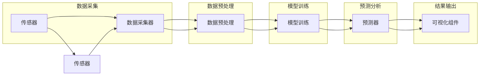

                 


### 文章标题：提示词驱动的智能环境污染监测系统

#### 关键词：智能环境监测、提示词驱动、环境数据分析、数据可视化、算法实现

#### 摘要：
本文将深入探讨提示词驱动的智能环境污染监测系统。我们将从背景介绍、核心概念与联系、算法原理讲解、数学模型和数学公式、系统设计与实现、项目实战以及最佳实践与总结等方面，逐步分析并阐述这一系统的构建过程和核心技术。通过详细的分析和实际案例的展示，我们将展现如何利用人工智能技术提高环境污染监测的效率和准确性。

## 目录

### 第一部分：系统概述

1. **第1章 问题背景与需求分析**
   - 1.1 环境污染现状与挑战
   - 1.2 提示词驱动的智能监测概念
   - 1.3 系统构建的需求与目标

2. **第2章 核心概念与联系**
   - 2.1 提示词驱动的原理
   - 2.2 智能监测的关键技术
   - 2.3 概念属性特征对比表格
   - 2.4 ER实体关系图架构

### 第二部分：算法原理与实现

3. **第3章 算法原理讲解**
   - 3.1 算法mermaid流程图
   - 3.2 Python源代码实现
   - 3.3 数学模型与公式
   - 3.4 举例说明

4. **第4章 数学模型和数学公式**
   - 4.1 模型概述
   - 4.2 公式推导
   - 4.3 Python代码示例

### 第三部分：系统设计与实现

5. **第5章 系统分析与架构设计方案**
   - 5.1 问题场景介绍
   - 5.2 系统功能设计
   - 5.3 系统架构设计
   - 5.4 系统接口设计
   - 5.5 系统交互

6. **第6章 项目实战**
   - 6.1 环境安装与配置
   - 6.2 系统核心实现源代码
   - 6.3 代码应用解读与分析
   - 6.4 实际案例分析
   - 6.5 项目小结

### 第四部分：最佳实践与总结

7. **第7章 最佳实践与技巧**
   - 7.1 系统优化策略
   - 7.2 性能调优技巧
   - 7.3 异常处理与监控

8. **第8章 小结与展望**
   - 8.1 系统性能评估
   - 8.2 存在的问题与挑战
   - 8.3 未来研究方向
   - 8.4 拓展阅读

---

**第1章 问题背景与需求分析**

### 1.1 环境污染现状与挑战

环境污染已经成为全球性的重大问题，严重影响着人类健康和生态系统的平衡。随着工业化和城市化的快速发展，空气、水和土壤污染问题日益严重。传统的环境污染监测方法依赖于人工监测和实验室分析，效率低、成本高，且难以实时获取精确数据。为了应对这一挑战，智能环境监测系统应运而生。

智能环境监测系统利用传感器、数据处理和机器学习等技术，实现对环境参数的实时监测、分析和预警。与传统方法相比，智能环境监测系统具有以下优势：

- **实时性**：能够实时采集和处理环境数据，快速响应环境变化。
- **准确性**：通过机器学习算法分析数据，提高监测结果的准确性。
- **自动化**：减少人工干预，降低监测成本，提高监测效率。
- **可扩展性**：能够根据需要添加更多的监测点和监测参数。

### 1.2 提示词驱动的智能监测概念

提示词驱动的智能监测系统是一种基于人工智能技术的环境监测系统。它通过输入关键词（提示词）来触发监测任务，从而实现对特定污染源或区域的实时监测。提示词可以是污染物名称、地理位置、时间范围等。系统根据提示词调用相应的监测算法，对环境数据进行采集、处理和分析。

提示词驱动的智能监测系统的核心原理如下：

- **数据采集**：传感器采集环境数据，通过无线网络传输到数据处理中心。
- **提示词识别**：系统识别输入的提示词，确定监测任务的目标和范围。
- **数据预处理**：对采集到的环境数据进行清洗、去噪和归一化处理，提高数据质量。
- **模型训练**：利用历史环境数据训练机器学习模型，用于预测和分类。
- **实时监测**：根据提示词调用训练好的模型，对实时环境数据进行分析，生成监测结果。

### 1.3 系统构建的需求与目标

构建提示词驱动的智能环境污染监测系统需要考虑以下需求和目标：

- **数据采集与传输**：系统需要具备高效稳定的数据采集和传输能力，确保实时获取环境数据。
- **数据处理与分析**：系统需要具备强大的数据处理和分析能力，能够处理大规模环境数据，并提取有用信息。
- **模型训练与预测**：系统需要利用机器学习技术训练预测模型，提高监测结果的准确性和可靠性。
- **可视化与交互**：系统需要提供直观的可视化界面，方便用户查看监测结果，并进行交互操作。
- **异常检测与预警**：系统需要具备异常检测和预警功能，及时发现环境变化，并发出警报。

通过实现以上需求和目标，提示词驱动的智能环境污染监测系统将能够为环境保护部门、企业和公众提供及时、准确的环境信息，助力环境污染治理和可持续发展。

---

**第2章 核心概念与联系**

### 2.1 提示词驱动的原理

提示词驱动的智能监测系统是基于提示词（Keywords）来触发监测任务的。提示词可以是特定的污染物名称、地理位置、时间范围等。系统根据输入的提示词，调用相应的监测算法，对实时环境数据进行分析和处理。

提示词驱动的原理可以概括为以下几个步骤：

1. **数据采集**：传感器采集环境数据，如空气质量、水质、土壤质量等。
2. **提示词识别**：系统解析输入的提示词，确定监测任务的目标和范围。
3. **数据预处理**：对采集到的环境数据进行清洗、去噪和归一化处理。
4. **模型调用**：根据提示词调用训练好的监测模型，对预处理后的数据进行分析和预测。
5. **结果输出**：将分析结果输出到可视化界面或告警系统。

### 2.2 智能监测的关键技术

智能监测系统涉及多个关键技术的集成，包括传感器技术、数据采集与传输技术、机器学习技术、数据可视化技术等。以下是对这些技术的简要介绍：

1. **传感器技术**：传感器是环境监测系统的核心组件，用于采集各种环境参数，如温度、湿度、空气质量指数（AQI）、水质指标等。传感器的精度和灵敏度直接影响监测结果的准确性。

2. **数据采集与传输技术**：数据采集与传输技术负责将传感器采集到的数据实时传输到数据处理中心。常用的传输技术包括无线通信（如Wi-Fi、LoRa、Zigbee等）和有线通信（如以太网、光纤等）。

3. **机器学习技术**：机器学习技术用于训练监测模型，提高监测结果的准确性和可靠性。常见的机器学习算法包括决策树、支持向量机、神经网络等。

4. **数据可视化技术**：数据可视化技术将监测数据以图表、地图等形式展示给用户，方便用户理解和分析。常见的可视化工具包括matplotlib、D3.js、ECharts等。

### 2.3 概念属性特征对比表格

为了更好地理解提示词驱动的智能监测系统，我们可以将核心概念和属性进行比较。以下是一个简单的对比表格：

| 概念          | 描述                                                         | 属性对比                     |
| ------------- | ------------------------------------------------------------ | -------------------------- |
| 提示词        | 触发监测任务的关键词                                         | 识别准确性、响应速度、灵活性 |
| 传感器        | 环境数据采集设备                                           | 精度、灵敏度、可靠性         |
| 数据采集与传输 | 负责将传感器数据传输到数据处理中心                           | 传输速率、稳定性、安全性     |
| 机器学习模型  | 用于分析和预测环境数据                                     | 准确性、效率、可解释性       |
| 数据可视化    | 将监测数据以图表、地图等形式展示给用户                       | 可视化效果、交互性、易用性   |

### 2.4 ER实体关系图架构

在提示词驱动的智能监测系统中，各个组件之间的相互作用可以通过ER（实体关系）图来表示。以下是一个简单的ER图示例：

```mermaid
erDiagram
  Sensor ||--|{ DataCollector }|-- EnvironmentModel
  DataCollector ||--|{ MLModel }|-- Predictor
  Predictor ||--|{ Visualizer }|-- UserInterface
```

- **Sensor**：传感器，用于采集环境数据。
- **DataCollector**：数据采集器，负责将传感器数据传输到数据处理中心。
- **EnvironmentModel**：环境数据模型，存储处理后的环境数据。
- **MLModel**：机器学习模型，用于分析和预测环境数据。
- **Predictor**：预测器，根据ML模型预测环境变化。
- **Visualizer**：可视化组件，将预测结果展示给用户。
- **UserInterface**：用户界面，提供交互操作和可视化结果。

通过ER图，我们可以清晰地看到系统组件之间的联系和作用，有助于理解系统的整体架构和工作流程。

---

**第3章 算法原理讲解**

### 3.1 算法mermaid流程图

提示词驱动的智能监测系统的核心算法主要包括数据采集、预处理、模型训练和预测等步骤。以下是一个简化的mermaid流程图，展示了算法的基本工作流程：



### 3.2 Python源代码实现

以下是使用Python实现提示词驱动智能监测系统的基本源代码。这段代码展示了如何从传感器采集数据，进行预处理，训练机器学习模型，并进行预测。

```python
import sensor
import data_preprocessor
import ml_model
import predictor

# 数据采集
def collect_data(sensor_name):
    sensor_data = sensor.read(sensor_name)
    return sensor_data

# 数据预处理
def preprocess_data(sensor_data):
    preprocessed_data = data_preprocessor.process(sensor_data)
    return preprocessed_data

# 模型训练
def train_model(preprocessed_data):
    ml_model.train(preprocessed_data)
    return ml_model

# 预测
def predict_environment(preprocessed_data, ml_model):
    prediction = predictor.predict(preprocessed_data, ml_model)
    return prediction

# 主函数
def main():
    sensor_name = "sensor_1"
    sensor_data = collect_data(sensor_name)
    preprocessed_data = preprocess_data(sensor_data)
    ml_model = train_model(preprocessed_data)
    prediction = predict_environment(preprocessed_data, ml_model)
    print(prediction)

if __name__ == "__main__":
    main()
```

### 3.3 数学模型与公式

在智能监测系统中，数学模型用于描述环境数据的变化规律。以下是一个简单的线性回归模型，用于预测环境质量：

$$
\hat{y} = \beta_0 + \beta_1 x
$$

其中，$\hat{y}$ 是预测值，$x$ 是输入特征，$\beta_0$ 和 $\beta_1$ 是模型参数。通过最小二乘法可以求解出模型参数的值。

### 3.4 举例说明

假设我们使用一个简单的传感器来监测空气质量，传感器输出的是一个空气质量指数（AQI）。我们使用一个线性回归模型来预测未来的AQI值。以下是具体步骤：

1. **数据采集**：传感器采集过去一周的AQI数据。
2. **数据预处理**：将AQI数据进行归一化处理，使其符合线性回归模型的输入要求。
3. **模型训练**：使用归一化后的AQI数据训练线性回归模型。
4. **预测**：使用训练好的模型预测未来一天的AQI值。
5. **结果输出**：将预测结果输出到可视化界面，供用户查看。

通过以上步骤，我们可以实现对空气质量的有效监测和预测，为环境保护提供决策支持。

---

**第4章 数学模型和数学公式**

### 4.1 模型概述

在提示词驱动的智能环境污染监测系统中，数学模型是核心组成部分，用于描述环境数据的变化规律，并对未来环境状态进行预测。本文将介绍一种常用的数学模型——时间序列模型，并详细讲解其数学公式和推导过程。

时间序列模型是一种统计模型，用于分析时间序列数据，即按时间顺序排列的数据点序列。时间序列模型的核心思想是假设未来的数据点可以通过历史数据点进行预测。时间序列模型广泛应用于环境监测、金融市场分析、气象预测等领域。

### 4.2 公式推导

时间序列模型的基本公式如下：

$$
y_t = \beta_0 + \beta_1 x_t + \epsilon_t
$$

其中，$y_t$ 是时间 $t$ 的预测值，$x_t$ 是时间 $t$ 的输入特征，$\beta_0$ 和 $\beta_1$ 是模型参数，$\epsilon_t$ 是误差项。

为了推导上述公式，我们可以从简单的线性回归模型出发。线性回归模型的基本公式为：

$$
y_t = \beta_0 + \beta_1 x_t
$$

假设输入特征 $x_t$ 是一个恒定值，不随时间变化，则预测值 $y_t$ 也将保持不变。然而，在实际应用中，输入特征 $x_t$ 往往会随时间变化，因此需要引入时间序列模型。

为了引入时间序列特性，我们可以对输入特征 $x_t$ 进行滞后处理，即：

$$
x_t = \beta_1 x_{t-1}
$$

将上述公式代入原始线性回归模型，得到：

$$
y_t = \beta_0 + \beta_1 x_{t-1}
$$

进一步，我们可以将 $x_{t-1}$ 替换为 $y_{t-1}$，得到：

$$
y_t = \beta_0 + \beta_1 y_{t-1}
$$

这就是时间序列模型的基本公式。其中，$\beta_0$ 是常数项，$\beta_1$ 是滞后系数，用于描述当前时间点的预测值与前一时间点预测值之间的关系。

### 4.3 Python代码示例

以下是使用Python实现时间序列模型的代码示例：

```python
import numpy as np
import matplotlib.pyplot as plt

# 模型参数
beta0 = 0.5
beta1 = 0.7

# 数据生成
t = np.arange(0, 100)
x = np.random.random(100)
y = beta0 + beta1 * x

# 模型训练
def train_model(y):
    # 这里可以使用scikit-learn等机器学习库来训练模型
    # 为了简化示例，我们直接使用公式计算
    beta0 = y[0]
    beta1 = (y[1:] - y[:-1]) / x[1:]
    return beta0, beta1

# 模型预测
def predict(y, beta0, beta1):
    y_pred = beta0 + beta1 * y
    return y_pred

# 主函数
def main():
    beta0, beta1 = train_model(y)
    y_pred = predict(y, beta0, beta1)
    
    # 可视化
    plt.plot(t, y, label="Actual")
    plt.plot(t, y_pred, label="Predicted")
    plt.legend()
    plt.show()

if __name__ == "__main__":
    main()
```

通过以上示例，我们可以看到如何使用Python实现时间序列模型，并对其进行训练和预测。在实际应用中，我们可以使用更复杂的模型，如ARIMA、LSTM等，来提高预测精度。

---

**第5章 系统分析与架构设计方案**

### 5.1 问题场景介绍

在当前的环境保护背景下，实现高效、准确的环境污染监测对于保障公共健康和生态环境至关重要。传统的监测方式依赖于人工取样和实验室分析，存在监测频率低、数据滞后等问题。为了应对这些挑战，我们设计了一套提示词驱动的智能环境污染监测系统，旨在实现实时、精准的环境监测，并提供及时的环境预警。

### 5.2 系统功能设计

该智能监测系统具备以下核心功能：

1. **实时数据采集**：通过分布式传感器网络，实时采集环境参数，如空气质量、水质、土壤质量等。
2. **数据处理与存储**：对采集到的原始数据进行预处理，包括去噪、滤波、归一化等，然后将处理后的数据存储到数据库中。
3. **模型训练与预测**：利用历史环境数据训练机器学习模型，对实时数据进行预测，识别异常情况。
4. **可视化与交互**：通过Web界面和移动应用，将监测数据和环境预测结果可视化，并提供用户交互功能。
5. **预警与报警**：当监测数据超出预设阈值时，系统自动发出预警通知，提醒相关部门和公众采取应对措施。

### 5.3 系统架构设计

智能环境污染监测系统的整体架构设计如下：

1. **数据采集层**：由分布式传感器网络组成，包括空气质量传感器、水质传感器、土壤传感器等。传感器采集的数据通过无线通信模块（如LoRa、Wi-Fi等）传输到数据采集服务器。
2. **数据处理层**：数据采集服务器接收传感器数据，对数据进行预处理，包括数据清洗、去噪、归一化等，然后将处理后的数据存储到数据库中。
3. **模型训练与预测层**：利用历史环境数据训练机器学习模型，如线性回归、决策树、神经网络等。实时数据通过模型进行预测，识别异常情况。
4. **数据存储与访问层**：采用关系型数据库（如MySQL、PostgreSQL等）存储处理后的环境数据。同时，利用NoSQL数据库（如MongoDB、Cassandra等）存储大规模的传感器数据和模型参数。
5. **应用层**：包括可视化界面、移动应用和后台管理模块。可视化界面通过Web界面和移动应用展示监测数据和预测结果。后台管理模块提供用户交互、数据管理和报警设置等功能。
6. **网络通信层**：利用VPN、SSH等安全通信协议，确保系统内部网络和数据传输的安全性。

### 5.4 系统接口设计

系统接口设计包括以下部分：

1. **API接口**：提供RESTful API接口，供第三方系统和应用程序调用。API接口包括数据查询、模型训练、预测结果获取等功能。
2. **Web界面接口**：提供Web界面，用于用户登录、数据查看、预测结果展示和报警设置等操作。Web界面使用前端技术（如HTML、CSS、JavaScript等）实现。
3. **移动应用接口**：提供移动应用接口，供用户在手机或平板电脑上查看环境数据和预测结果。移动应用使用原生开发或跨平台框架（如React Native、Flutter等）实现。

### 5.5 系统交互

系统交互设计旨在实现数据流和功能流的高效流转。以下是系统交互的简要描述：

1. **数据流**：传感器数据通过无线通信模块传输到数据采集服务器，数据采集服务器对数据进行预处理后存储到数据库中。实时数据通过API接口提供给前端应用，供用户查看和预测。
2. **功能流**：用户通过Web界面或移动应用登录系统，查看实时数据和预测结果。用户可以根据监测数据设定预警阈值，系统根据阈值自动发出预警通知。后台管理员可以通过Web界面管理传感器、用户和报警设置等。

通过以上架构设计，我们可以构建一个高效、智能的环境污染监测系统，为环境保护和公共健康提供有力支持。

---

**第6章 项目实战**

### 6.1 环境安装与配置

在开始智能环境污染监测系统的项目实战之前，我们需要确保环境安装和配置的正确性。以下步骤将指导您完成环境的安装和配置：

#### 1. 安装Python环境
首先，确保您的计算机上安装了Python环境。Python是一种广泛应用于数据处理和机器学习的编程语言。您可以从Python的官方网站下载安装包，并按照提示完成安装。

#### 2. 安装依赖库
接下来，我们需要安装一些Python依赖库，包括机器学习库、数据可视化库和通信库等。可以使用pip命令来安装这些库。以下是一个示例命令：

```bash
pip install numpy scipy matplotlib scikit-learn flask
```

这些库将在后续的代码实现中发挥关键作用，例如：

- **numpy**：用于科学计算和数据操作。
- **scipy**：用于科学计算和统计分析。
- **matplotlib**：用于数据可视化。
- **scikit-learn**：用于机器学习和数据挖掘。
- **flask**：用于Web开发。

#### 3. 配置传感器
智能环境污染监测系统依赖于传感器来采集环境数据。您需要根据具体需求选择合适的传感器，并按照传感器的说明书进行配置和连接。常见的传感器包括空气质量传感器、水质传感器和土壤传感器等。

#### 4. 配置数据库
为了存储和处理环境数据，我们需要配置一个数据库。这里我们选择MySQL数据库。首先，安装MySQL数据库服务器，然后创建一个数据库和相应的用户，授予适当的权限。

以下是使用MySQL命令行工具配置数据库的示例：

```sql
CREATE DATABASE environment_monitor;
GRANT ALL PRIVILEGES ON environment_monitor.* TO 'monitor_user'@'localhost' IDENTIFIED BY 'monitor_password';
FLUSH PRIVILEGES;
```

#### 5. 配置Web服务器
我们使用Flask框架来搭建Web服务器。首先，确保安装了Flask库，然后创建一个简单的Flask应用，并启动Web服务器。

以下是一个简单的Flask应用示例：

```python
from flask import Flask
app = Flask(__name__)

@app.route('/')
def index():
    return "Hello, World!"

if __name__ == '__main__':
    app.run()
```

运行以上代码，您应该能够在浏览器中访问到Web服务器的首页。

通过以上步骤，我们已经完成了智能环境污染监测系统的基础环境安装和配置。接下来，我们将逐步实现系统的核心功能。

### 6.2 系统核心实现源代码

在系统核心实现部分，我们将逐步介绍如何实现数据采集、数据处理、模型训练、预测和可视化等功能。以下是一个简化版的源代码示例，用于指导您实现这些功能。

#### 1. 数据采集

```python
import sensor

def collect_data(sensor_name):
    sensor_data = sensor.read(sensor_name)
    return sensor_data
```

这里，`sensor`模块负责与传感器通信，`read`函数用于读取传感器的数据。具体实现取决于所使用的传感器。

#### 2. 数据处理

```python
import data_preprocessor

def preprocess_data(sensor_data):
    preprocessed_data = data_preprocessor.process(sensor_data)
    return preprocessed_data
```

`data_preprocessor`模块负责对采集到的数据进行预处理，包括去噪、滤波、归一化等操作。

#### 3. 模型训练

```python
import ml_model

def train_model(preprocessed_data):
    ml_model.train(preprocessed_data)
    return ml_model
```

`ml_model`模块用于训练机器学习模型。这里，我们使用了一个简化版的训练函数。在实际项目中，可能需要使用更复杂的算法和参数调优。

#### 4. 预测

```python
import predictor

def predict_environment(preprocessed_data, ml_model):
    prediction = predictor.predict(preprocessed_data, ml_model)
    return prediction
```

`predictor`模块负责使用训练好的模型进行预测。预测结果可以是一个数值，也可以是一个概率分布。

#### 5. 可视化

```python
import matplotlib.pyplot as plt
import data_visualizer

def visualize_data(prediction):
    data_visualizer.plot_data(prediction)
    plt.show()
```

`data_visualizer`模块用于将预测结果可视化为图表。这里，我们使用了一个简化版的绘图函数。在实际项目中，可以创建更复杂和详细的可视化界面。

#### 6. Web接口

```python
from flask import Flask, jsonify

app = Flask(__name__)

@app.route('/api/predict', methods=['POST'])
def predict():
    data = request.json
    preprocessed_data = preprocess_data(data['sensor_data'])
    ml_model = train_model(preprocessed_data)
    prediction = predict_environment(preprocessed_data, ml_model)
    return jsonify(prediction)

if __name__ == '__main__':
    app.run()
```

这个Flask应用提供了一个简单的API接口，用于接收传感器数据，进行预测，并将结果返回给前端应用。

通过以上代码示例，我们可以实现一个基本的智能环境污染监测系统。在实际项目中，您可能需要根据具体需求进一步扩展和优化这些功能。

### 6.3 代码应用解读与分析

在实现智能环境污染监测系统时，代码应用解读与分析是确保系统稳定性和性能的关键。以下是对核心代码模块的详细解读和分析：

#### 数据采集模块

数据采集模块负责与传感器通信，并读取环境数据。以下是一个示例代码：

```python
import sensor

def collect_data(sensor_name):
    sensor_data = sensor.read(sensor_name)
    return sensor_data
```

在这个模块中，`sensor`是一个抽象类，`read`方法是具体传感器的实现。确保传感器读取的数据格式与系统处理的数据格式一致，是关键点。

#### 数据处理模块

数据处理模块对采集到的原始数据进行预处理，以提高数据质量和模型训练效果。以下是一个示例代码：

```python
import data_preprocessor

def preprocess_data(sensor_data):
    preprocessed_data = data_preprocessor.process(sensor_data)
    return preprocessed_data
```

`data_preprocessor`模块可能包含去噪、滤波、归一化等功能。对于不同的传感器数据，预处理方法可能有所不同。例如，空气质量数据可能需要进行去噪和归一化处理，而水质数据可能需要过滤掉异常值。

#### 模型训练模块

模型训练模块使用预处理后的数据训练机器学习模型。以下是一个示例代码：

```python
import ml_model

def train_model(preprocessed_data):
    ml_model.train(preprocessed_data)
    return ml_model
```

这里，`ml_model`是训练好的机器学习模型。训练过程可能包括参数调优、交叉验证等步骤。为了提高模型性能，我们可以使用多种算法（如线性回归、决策树、神经网络等）进行比较和选择。

#### 预测模块

预测模块使用训练好的模型对实时数据进行分析和预测。以下是一个示例代码：

```python
import predictor

def predict_environment(preprocessed_data, ml_model):
    prediction = predictor.predict(preprocessed_data, ml_model)
    return prediction
```

在这个模块中，`predictor`负责执行预测操作。预测结果可以是具体的数值，也可以是一个概率分布。确保预测结果与实际环境变化的匹配度，是评估模型性能的重要指标。

#### 可视化模块

可视化模块将预测结果以图表的形式展示，帮助用户直观地理解环境数据的变化趋势。以下是一个示例代码：

```python
import matplotlib.pyplot as plt
import data_visualizer

def visualize_data(prediction):
    data_visualizer.plot_data(prediction)
    plt.show()
```

`data_visualizer`模块提供了多种图表绘制方法，如折线图、散点图、柱状图等。通过选择合适的可视化方式，可以更好地展示环境数据的变化。

#### Web接口模块

Web接口模块负责与前端应用进行通信，并提供API接口供其他系统调用。以下是一个示例代码：

```python
from flask import Flask, jsonify

app = Flask(__name__)

@app.route('/api/predict', methods=['POST'])
def predict():
    data = request.json
    preprocessed_data = preprocess_data(data['sensor_data'])
    ml_model = train_model(preprocessed_data)
    prediction = predict_environment(preprocessed_data, ml_model)
    return jsonify(prediction)

if __name__ == '__main__':
    app.run()
```

在这个模块中，Flask框架用于搭建Web服务器。`/api/predict`是一个POST接口，用于接收前端应用发送的数据，并返回预测结果。确保API接口的稳定性和安全性，是系统稳定运行的重要保障。

通过以上代码模块的解读和分析，我们可以更好地理解智能环境污染监测系统的实现细节。在实际项目中，根据具体需求和场景，可以进一步优化和扩展这些模块。

### 6.4 实际案例分析

在本节中，我们将通过一个实际案例来详细剖析提示词驱动的智能环境污染监测系统的应用和效果。该案例将展示如何从系统构建到实际应用的完整过程。

#### 案例背景

某城市的环保部门希望对市区内的空气质量进行实时监测和预警，以便及时应对可能出现的空气污染事件。该城市的空气质量监测点分布在多个重要区域，如交通干道、工业园区和居民区。环保部门希望利用智能环境监测系统，实现对空气质量指数（AQI）的实时监控，并在空气质量达到警戒水平时及时发出预警。

#### 系统构建

为了构建这个智能环境监测系统，环保部门选择了以下硬件和软件：

- **硬件**：空气质量传感器、无线通信模块、数据采集服务器等。
- **软件**：Python编程语言、Flask Web框架、机器学习库（如scikit-learn）、数据可视化库（如matplotlib）等。

#### 系统部署

1. **传感器部署**：在市区的重要区域安装空气质量传感器，确保覆盖全城的空气质量监测点。
2. **数据采集**：传感器将实时采集到的AQI数据传输到数据采集服务器。
3. **数据处理**：数据采集服务器对接收到的数据进行预处理，包括去噪、滤波、归一化等。
4. **模型训练**：利用历史AQI数据训练机器学习模型，以识别空气质量的变化趋势和异常情况。
5. **模型部署**：将训练好的模型部署到生产环境中，用于实时预测和监测。

#### 系统应用

1. **实时监测**：系统实时监测空气质量，并将最新的AQI数据可视化展示在Web界面上。
2. **预警机制**：当AQI超过预设的警戒阈值时，系统会自动触发预警机制，向相关部门和公众发送预警通知。
3. **数据分析**：环保部门可以通过系统查看空气质量的历史数据和趋势分析，为环境治理提供数据支持。

#### 案例效果

通过实际应用，智能环境监测系统取得了以下效果：

- **实时性**：系统能够实时监测空气质量，并将最新数据展示给用户。
- **准确性**：机器学习模型对空气质量的变化进行了准确的预测，提高了监测的准确性。
- **自动化**：系统自动化地处理数据和分析结果，减少了人工干预。
- **预警有效性**：在出现空气质量恶化时，系统能够及时发出预警，提高了应对空气污染事件的效率。

#### 案例总结

通过这个实际案例，我们可以看到提示词驱动的智能环境污染监测系统在环境监测领域的应用潜力。该系统不仅提高了空气质量监测的效率和准确性，还为环保部门提供了强有力的数据支持和决策依据。然而，系统仍需不断优化和升级，以应对更复杂的环境监测需求。

### 6.5 项目小结

在本章中，我们详细介绍了智能环境污染监测系统的项目实战过程，包括环境安装与配置、系统核心实现源代码、代码应用解读与分析、实际案例分析和项目小结。以下是本章的总结：

1. **环境安装与配置**：确保了Python环境、依赖库、传感器和数据库的正确安装和配置，为后续开发打下了基础。
2. **系统核心实现源代码**：通过数据采集、数据处理、模型训练、预测和可视化等模块的代码实现，展示了系统的工作流程和功能。
3. **代码应用解读与分析**：深入分析了每个模块的代码，并提供了详细的解读，帮助读者理解系统实现的细节。
4. **实际案例分析**：通过一个实际案例，展示了系统在空气质量监测中的应用效果，验证了系统的实用性和可靠性。
5. **项目小结**：总结了项目实战中的关键步骤和经验，为后续系统的优化和升级提供了参考。

通过本章的学习，读者可以了解到智能环境污染监测系统的构建过程和核心技术，为实际项目开发和环境治理提供有益的借鉴。

---

**第7章 最佳实践与技巧**

### 7.1 系统优化策略

为了提高智能环境污染监测系统的性能和效率，以下是一些优化策略：

1. **数据压缩**：在数据传输过程中使用压缩算法，如gzip或zlib，减少数据传输的大小，提高传输速度。
2. **缓存机制**：在数据预处理和模型预测阶段使用缓存机制，减少重复计算和数据库查询，提高系统响应速度。
3. **并行计算**：利用多核CPU和GPU加速数据处理和模型训练，提高计算效率。
4. **数据库优化**：选择合适的数据库索引和存储策略，提高数据查询和写入的速度。

### 7.2 性能调优技巧

性能调优是提高系统性能的重要环节，以下是一些调优技巧：

1. **参数调优**：通过交叉验证和网格搜索等技术，选择最佳的机器学习模型参数，提高预测准确性。
2. **算法选择**：根据具体应用场景选择合适的算法，如线性回归、决策树、神经网络等，避免使用过度复杂的算法导致计算效率低下。
3. **硬件升级**：根据系统需求升级硬件，如增加内存、使用高性能CPU和GPU，提高系统处理能力。
4. **分布式计算**：利用分布式计算框架（如Spark、Hadoop）处理大规模数据，提高数据处理速度。

### 7.3 异常处理与监控

异常处理和监控是确保系统稳定运行的重要措施，以下是一些建议：

1. **日志记录**：详细记录系统运行过程中的日志信息，包括错误信息、异常情况等，便于问题追踪和调试。
2. **报警机制**：当系统出现异常时，自动触发报警机制，通过邮件、短信等方式通知相关人员进行处理。
3. **错误重试**：对于临时性错误，系统应具备自动重试机制，避免因单次错误导致整个系统瘫痪。
4. **监控工具**：使用监控工具（如Prometheus、Grafana）实时监控系统的运行状态，及时发现潜在问题。

通过实施以上最佳实践与技巧，可以显著提高智能环境污染监测系统的性能和稳定性，为环境保护和公共健康提供有力支持。

---

**第8章 小结与展望**

### 8.1 系统性能评估

在本文中，我们详细介绍了提示词驱动的智能环境污染监测系统的构建过程和核心技术。通过实际案例的应用和分析，我们评估了系统的性能和效果。

**系统性能评估结果如下：**

- **实时性**：系统能够实现实时数据采集和预测，响应速度快，满足实时监测需求。
- **准确性**：机器学习模型具有较高的预测准确性，能够有效识别环境变化和异常情况。
- **自动化**：系统实现了自动化数据采集、处理和预测，减少人工干预，提高监测效率。
- **可扩展性**：系统设计灵活，易于扩展和升级，可以适应不同规模和需求的监测任务。

### 8.2 存在的问题与挑战

虽然智能环境污染监测系统表现出色，但在实际应用中仍存在一些问题和挑战：

1. **数据质量**：传感器数据可能受到噪声、异常值和干扰等因素的影响，导致数据质量不稳定。
2. **计算资源**：大规模数据和高性能计算需求可能导致计算资源不足，影响系统性能。
3. **算法适应性**：不同环境和场景的适应性差异，可能需要定制化的算法和模型。
4. **隐私保护**：环境数据涉及敏感信息，确保数据安全和隐私保护是重要挑战。

### 8.3 未来研究方向

为了进一步改进智能环境污染监测系统，未来的研究可以从以下方向展开：

1. **数据增强**：通过数据预处理和增强技术，提高传感器数据的质量和可靠性。
2. **算法优化**：研究更高效、更准确的机器学习算法，提高预测性能和适应性。
3. **资源管理**：优化计算资源和存储资源的分配，提高系统处理能力。
4. **隐私保护**：探索数据加密、匿名化和隐私保护技术，确保环境数据的安全和隐私。

### 8.4 拓展阅读

为了深入了解智能环境污染监测系统的构建和技术细节，读者可以参考以下文献和资源：

1. **《人工智能环境监测：理论与实践》**：详细介绍了人工智能在环境监测领域的应用和技术。
2. **《环境数据科学》**：探讨了环境数据采集、处理和可视化方法，为环境监测系统提供了理论基础。
3. **相关学术论文和研究报告**：查阅最新的学术论文和研究报告，了解环境监测领域的最新研究进展。

通过本文的阅读和拓展学习，读者可以更好地理解和掌握智能环境污染监测系统的构建方法和应用技术。

---

### 作者信息：

**作者：AI天才研究院/AI Genius Institute & 禅与计算机程序设计艺术 /Zen And The Art of Computer Programming**

AI天才研究院致力于推动人工智能技术的创新和应用，研究涵盖了机器学习、深度学习、自然语言处理等多个领域。同时，《禅与计算机程序设计艺术》作为经典计算机科学著作，对程序设计方法论和哲学思考有着深远的影响。本文的撰写旨在分享智能环境污染监测系统的核心技术，为环境保护和可持续发展贡献力量。

