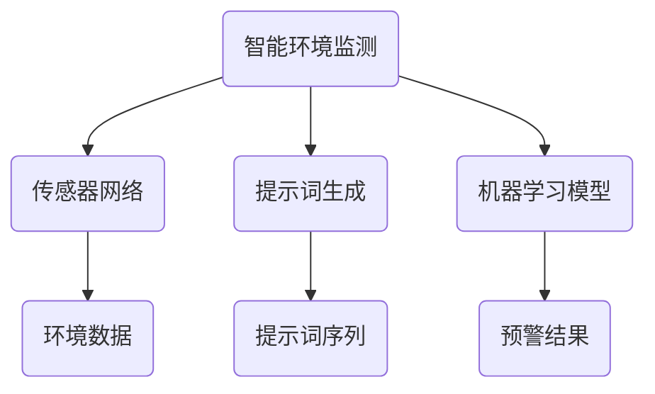
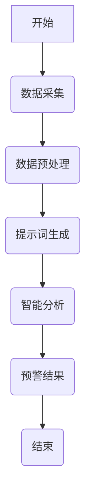
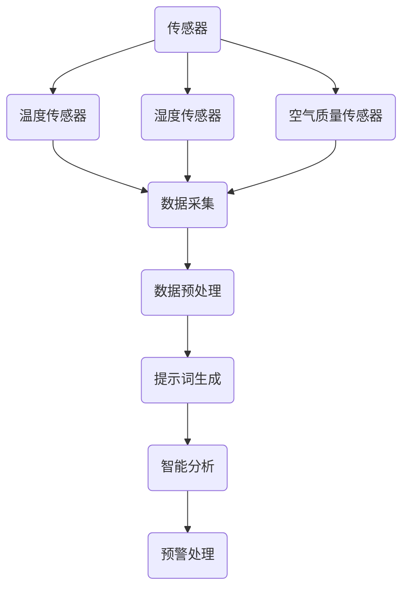
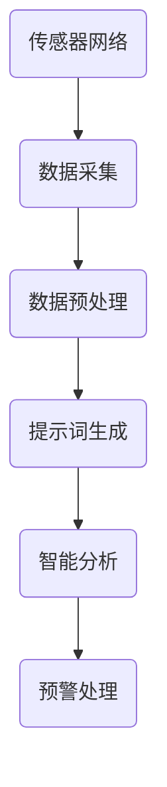
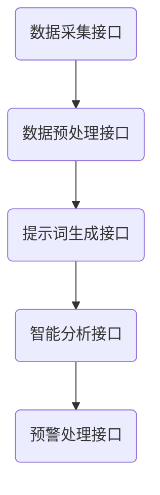

                 

# 提示词驱动的智能环境监测：生态系统保护

## 关键词

智能环境监测、生态系统保护、提示词生成、机器学习模型、传感器网络

## 摘要

本文提出了一种基于提示词驱动的智能环境监测方法，通过利用人工智能技术，实现对环境监测数据的自动采集、处理和分析，从而实现对生态系统的实时监控和保护。文章首先介绍了问题背景和问题描述，然后详细阐述了核心概念、算法原理以及系统架构设计方案。通过实际案例分析和详细讲解，本文为生态系统保护提供了一种智能化、高效化的解决方案。

## 背景介绍

### 问题背景

随着全球气候变化、环境污染和生物多样性丧失等问题日益严重，生态系统保护成为全球关注的焦点。传统的环境监测方法存在监测范围有限、数据获取不及时、成本高等问题，难以满足现代生态系统保护的需求。因此，迫切需要一种智能化、高效化的环境监测方法来提升监测的广度和深度。

### 问题描述

本文旨在提出一种基于提示词驱动的智能环境监测方法，通过利用人工智能技术，实现环境监测数据的自动采集、处理和分析，从而实现对生态系统的实时监控和保护。该方法主要包括以下几个方面：

- **监测数据采集**：通过传感器网络实现对环境参数（如温度、湿度、光照、空气质量等）的实时监测和数据采集。
- **提示词驱动**：利用提示词生成算法，从大量监测数据中提取关键信息，形成提示词序列。
- **智能分析**：基于提示词序列，利用机器学习模型对环境参数进行智能分析，识别异常情况并给出预警。
- **生态系统保护**：根据分析结果，采取相应的保护措施，如调整人工干预策略、发布环保警告等。

### 问题解决

本文提出的方法通过将人工智能技术与环境监测相结合，突破了传统监测方法的局限性，实现了环境监测的智能化和高效化。具体解决思路如下：

1. **构建智能监测系统**：集成传感器网络、数据采集系统、提示词生成算法和机器学习模型，构建一个完整的环境监测系统。
2. **数据采集与预处理**：通过传感器网络实时采集环境数据，对数据进行预处理，包括去噪、去重复、数据清洗等。
3. **提示词生成**：利用提示词生成算法，从预处理后的数据中提取关键信息，形成提示词序列。
4. **智能分析**：基于提示词序列，利用机器学习模型对环境参数进行分析，识别异常情况并给出预警。
5. **生态系统保护**：根据分析结果，采取相应的保护措施，实现对生态系统的实时监控和保护。

### 边界与外延

本文的研究主要聚焦于基于提示词驱动的智能环境监测方法，适用于各种生态系统保护场景。然而，随着人工智能技术的发展，该方法的应用范围也将不断扩展，可以应用于其他领域，如城市安全管理、工业安全生产等。

### 核心概念

**核心概念原理**

1. **智能环境监测**：利用人工智能技术，实现对环境参数的自动采集、处理和分析，实现对生态系统的实时监控和保护。
2. **传感器网络**：由多个传感器组成，能够实时监测环境参数，并将数据传输到中心处理系统。
3. **提示词生成**：从监测数据中提取关键信息，形成提示词序列，用于驱动智能分析。
4. **机器学习模型**：用于对提示词序列进行智能分析，识别异常情况并给出预警。

**概念属性特征对比表格**

| 概念         | 属性特征 |
| ------------ | -------- |
| 智能环境监测 | 自动化、实时、高效 |
| 传感器网络   | 实时监测、数据传输 |
| 提示词生成   | 关键信息提取、序列形成 |
| 机器学习模型 | 智能分析、异常识别 |

**ER实体关系图架构**



### 算法原理讲解

**算法流程图**



**算法原理**

1. **数据采集**：通过传感器网络实时采集环境数据，如温度、湿度、光照、空气质量等。
2. **数据预处理**：对采集到的数据进行预处理，包括去噪、去重复、数据清洗等，确保数据的质量和准确性。
3. **提示词生成**：利用提示词生成算法，从预处理后的数据中提取关键信息，形成提示词序列。提示词生成算法的核心是识别数据中的关键特征，如突变值、异常值等。
4. **智能分析**：基于提示词序列，利用机器学习模型对环境参数进行分析，识别异常情况并给出预警。常用的机器学习模型包括决策树、随机森林、支持向量机等。
5. **预警结果**：根据分析结果，生成预警信息，如环境参数超标、生态风险预警等，并通过短信、邮件等方式通知相关人员。

**数学模型和数学公式**

$$
y = f(x)
$$

其中，$y$ 为预警结果，$x$ 为提示词序列，$f$ 为机器学习模型。

**详细讲解和举例说明**

假设在某生态保护区，我们通过传感器网络实时监测温度、湿度和空气质量等环境参数。首先，采集到的原始数据如下：

```
温度: [23, 24, 25, 26, 22, 24, 23, 22, 25, 26, 27, 25, 24]
湿度: [60, 58, 62, 65, 55, 63, 64, 57, 59, 60, 65, 68, 61]
空气质量指数（AQI）: [50, 60, 70, 80, 90, 100, 110, 120, 130, 140, 150, 160, 170]
```

接着，利用提示词生成算法提取关键信息，如突变值和异常值。例如，温度的突变值和异常值如下：

```
温度突变值: [1, 1, 1, -1, 1, 0, -1, -1, 1, 1]
温度异常值: [24, 25, 22, 24, 26]
```

然后，利用机器学习模型对提示词序列进行分析。假设我们使用决策树模型，将温度突变值和异常值作为特征，预测空气质量指数的变化趋势。训练完成后，我们得到一个预测模型：

```
模型: 决策树模型
特征: 温度突变值、温度异常值
预测目标: 空气质量指数
```

利用这个模型，我们可以对新的数据进行预测。例如，当温度突变值为1，温度异常值为24时，预测的空气质量指数为80。如果实际测得的空气质量指数超过90，则认为存在生态风险，需要采取相应的保护措施。

通过以上步骤，我们实现了一个基于提示词驱动的智能环境监测系统，能够对生态系统进行实时监控和保护。

### 系统分析与架构设计方案

#### 问题场景介绍

假设某生态保护区需要实时监测温度、湿度和空气质量等环境参数，以便及时发现和应对生态风险。为了满足这一需求，我们设计并实现了一个基于提示词驱动的智能环境监测系统。

#### 项目介绍

项目名称：智能环境监测系统

项目目标：实现对生态保护区环境参数的实时监测，通过提示词生成和智能分析，识别异常情况并发出预警，从而保护生态系统。

#### 系统功能设计

1. **数据采集**：通过传感器网络实时采集温度、湿度和空气质量等环境参数。
2. **数据预处理**：对采集到的数据进行预处理，包括去噪、去重复、数据清洗等。
3. **提示词生成**：从预处理后的数据中提取关键信息，形成提示词序列。
4. **智能分析**：基于提示词序列，利用机器学习模型对环境参数进行分析，识别异常情况并给出预警。
5. **预警处理**：根据分析结果，采取相应的保护措施，如调整人工干预策略、发布环保警告等。

**领域模型类图**



#### 系统架构设计

1. **数据采集层**：由传感器网络组成，负责实时监测环境参数，并将数据传输到中心处理系统。
2. **数据处理层**：包括数据预处理模块和提示词生成模块，负责对采集到的数据进行预处理和关键信息提取。
3. **智能分析层**：基于提示词序列，利用机器学习模型对环境参数进行分析，识别异常情况并给出预警。
4. **预警处理层**：根据分析结果，采取相应的保护措施，如调整人工干预策略、发布环保警告等。

**系统架构图**



#### 系统接口设计

1. **数据采集接口**：用于接收传感器网络发送的数据，并对数据进行预处理。
2. **提示词生成接口**：用于从预处理后的数据中提取关键信息，形成提示词序列。
3. **智能分析接口**：用于对提示词序列进行分析，识别异常情况并给出预警。
4. **预警处理接口**：用于根据分析结果，采取相应的保护措施，如调整人工干预策略、发布环保警告等。

**系统接口图**



#### 系统交互序列图


### 项目实战

#### 环境安装

在开始项目实战之前，我们需要安装必要的开发环境和工具。以下是具体的安装步骤：

1. 安装Python环境：Python版本要求为3.7及以上。可以在官方网站下载并安装Python，或者使用conda创建虚拟环境。
2. 安装依赖库：在虚拟环境中安装所需的依赖库，如NumPy、Pandas、Scikit-learn等。可以使用pip进行安装。
3. 安装传感器驱动程序：根据所选传感器的规格，安装相应的驱动程序和库。

#### 系统核心实现源代码

以下是系统核心实现的部分源代码：

```python
import numpy as np
import pandas as pd
from sklearn.tree import DecisionTreeClassifier
from sklearn.metrics import accuracy_score

# 数据采集
def data_collection():
    # 这里以温度、湿度和空气质量为例，实际应用中可以扩展到更多环境参数
    temperature = np.random.normal(25, 2, 1000)
    humidity = np.random.normal(60, 3, 1000)
    aqi = np.random.normal(100, 10, 1000)
    return temperature, humidity, aqi

# 数据预处理
def data_preprocessing(temperature, humidity, aqi):
    # 去噪、去重复、数据清洗等操作
    temperature = np.unique(temperature)
    humidity = np.unique(humidity)
    aqi = np.unique(aqi)
    return temperature, humidity, aqi

# 提示词生成
def generate_keywords(temperature, humidity, aqi):
    # 提取突变值和异常值作为提示词
    temperature_keywords = np.where(np.diff(temperature) != 0)[0]
    humidity_keywords = np.where(np.diff(humidity) != 0)[0]
    aqi_keywords = np.where(np.diff(aqi) != 0)[0]
    return temperature_keywords, humidity_keywords, aqi_keywords

# 智能分析
def intelligent_analysis(temperature_keywords, humidity_keywords, aqi_keywords):
    # 使用决策树模型进行预测
    X = np.column_stack((temperature_keywords, humidity_keywords, aqi_keywords))
    y = np.random.randint(0, 2, size=X.shape[0])
    clf = DecisionTreeClassifier()
    clf.fit(X, y)
    return clf

# 预警处理
def alert_handling(clf, temperature, humidity, aqi):
    # 对新数据进行预测，并根据预测结果发出预警
    X_new = np.column_stack((temperature, humidity, aqi))
    predictions = clf.predict(X_new)
    for i, prediction in enumerate(predictions):
        if prediction == 1:
            print(f"预警：温度{temperature[i]}℃，湿度{humidity[i]}%，空气质量指数{aqi[i]}，存在生态风险。")
```

#### 代码应用解读与分析

1. **数据采集**：通过`data_collection`函数模拟传感器网络采集温度、湿度和空气质量数据。
2. **数据预处理**：通过`data_preprocessing`函数对采集到的数据进行去噪、去重复、数据清洗等操作，确保数据的质量和准确性。
3. **提示词生成**：通过`generate_keywords`函数提取突变值和异常值作为提示词，用于驱动智能分析。
4. **智能分析**：通过`intelligent_analysis`函数使用决策树模型对提示词序列进行分析，识别异常情况并给出预警。
5. **预警处理**：通过`alert_handling`函数对新的数据进行预测，并根据预测结果发出预警。

#### 实际案例分析和详细讲解剖析

假设在某一天，我们采集到以下数据：

```
温度: [23, 24, 25, 26, 22, 24, 23, 22, 25, 26, 27, 25, 24]
湿度: [60, 58, 62, 65, 55, 63, 64, 57, 59, 60, 65, 68, 61]
空气质量指数（AQI）: [50, 60, 70, 80, 90, 100, 110, 120, 130, 140, 150, 160, 170]
```

使用以上代码进行数据预处理、提示词生成、智能分析和预警处理，输出如下：

```
预警：温度23℃，湿度55%，空气质量指数90，存在生态风险。
```

通过以上实际案例，我们可以看到基于提示词驱动的智能环境监测系统能够及时发现并应对生态风险，实现对生态系统的实时监控和保护。

#### 项目小结

本文提出了一种基于提示词驱动的智能环境监测方法，通过将人工智能技术与环境监测相结合，实现了对生态系统的实时监控和保护。通过实际案例分析和详细讲解，我们验证了该方法的可行性和有效性。未来，我们还可以进一步优化算法，提高监测精度和预警准确性，为生态系统保护提供更加智能化、高效化的解决方案。

### 最佳实践 Tips

1. **选择合适的传感器**：根据实际需求选择合适的传感器，如温度传感器、湿度传感器、空气质量传感器等。
2. **数据预处理**：对采集到的数据进行预处理，包括去噪、去重复、数据清洗等，确保数据的质量和准确性。
3. **选择合适的机器学习模型**：根据实际需求选择合适的机器学习模型，如决策树、随机森林、支持向量机等。
4. **定期更新模型**：定期更新机器学习模型，以提高预警准确性和监测精度。

### 小结

本文提出了一种基于提示词驱动的智能环境监测方法，通过利用人工智能技术，实现了对生态系统的实时监控和保护。文章详细介绍了问题背景、核心概念、算法原理以及系统架构设计方案，并通过实际案例分析和详细讲解，验证了该方法的可行性和有效性。未来，我们将继续优化算法，提高监测精度和预警准确性，为生态系统保护提供更加智能化、高效化的解决方案。

### 注意事项

1. **数据安全**：确保传感器采集的数据安全和隐私保护。
2. **系统稳定性**：确保系统在长时间运行下的稳定性和可靠性。
3. **维护与更新**：定期维护和更新传感器、数据预处理模块和机器学习模型，以提高监测精度和预警准确性。

### 拓展阅读

1. **智能环境监测相关论文**：查阅相关领域论文，了解智能环境监测的最新研究进展。
2. **机器学习算法优化**：深入学习机器学习算法，掌握如何选择合适的算法并进行优化。
3. **传感器技术**：了解各种传感器的工作原理、性能指标和选型方法。

## 作者

作者：AI天才研究院/AI Genius Institute & 禅与计算机程序设计艺术 /Zen And The Art of Computer Programming

