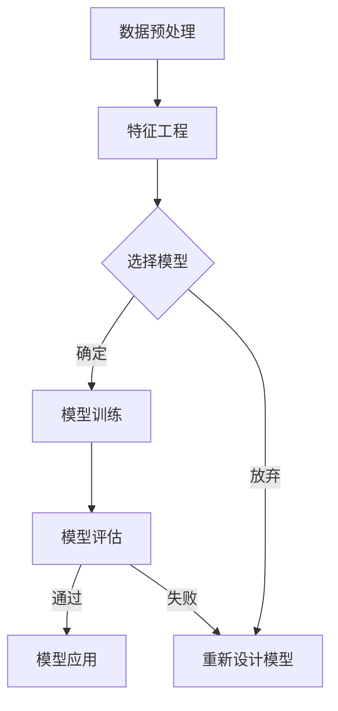

                 

## 《AI时代编程的新思维模式》

> 关键词：AI时代、编程思维、算法原理、数学模型、系统架构、项目实战

> 摘要：本文将深入探讨AI时代编程的新思维模式，从背景介绍、核心概念与联系、算法原理讲解、数学模型和数学公式、系统分析与架构设计、项目实战到最佳实践，全方位解析AI时代编程的新趋势和新方法。通过一步步的分析推理，帮助读者理解并掌握这一新兴领域的核心知识。

### 目录大纲

1. **背景介绍**
   - AI时代编程的背景
   - 编程在AI时代的重要性
   - AI时代编程的挑战与机遇

2. **核心概念与联系**
   - AI时代编程的新思维模式
   - 新思维模式与传统编程的区别
   - 新思维模式的应用场景

3. **算法原理讲解**
   - 算法流程图绘制
   - Python源代码阐述
   - 数学模型和数学公式讲解
   - 举例说明

4. **系统分析与架构设计**
   - 问题场景介绍
   - 系统功能设计
   - 系统架构设计
   - 系统接口设计
   - 系统交互

5. **项目实战**
   - 环境安装
   - 系统核心实现源代码
   - 代码应用解读与分析
   - 实际案例分析与讲解
   - 项目小结

6. **最佳实践 tips**

7. **小结**

8. **注意事项**

9. **拓展阅读**

### 背景介绍

#### AI时代编程的背景

自20世纪50年代以来，人工智能（AI）领域经历了从理论研究到实际应用的快速发展。随着深度学习、强化学习等技术的突破，AI在图像识别、自然语言处理、自动驾驶等多个领域取得了显著的成果。这一过程中，编程作为AI发展的基石，也在不断演变。

AI时代编程的背景主要体现在以下几个方面：

- **计算能力的提升**：随着硬件技术的进步，计算机的处理速度和存储能力大幅提升，为AI算法的复杂运算提供了强大支持。
- **算法的进步**：深度学习、强化学习等算法的不断发展，使得AI系统在处理复杂任务时具有更高的效率和准确性。
- **大数据的兴起**：大数据的收集、存储和处理技术为AI提供了丰富的数据资源，使得AI能够从大量数据中学习并优化性能。
- **编程语言和工具的演变**：编程语言和开发工具的不断进化，使得编程工作更加高效、灵活，为AI时代的编程提供了便利。

#### 编程在AI时代的重要性

在AI时代，编程不仅是一个工具，更是实现AI目标的关键。编程在AI时代的重要性主要体现在以下几个方面：

- **算法实现**：AI算法需要通过编程语言实现，才能在计算机上运行。编程能力的强弱直接影响算法的性能和效率。
- **系统集成**：AI系统通常需要与其他系统进行集成，编程是实现这一目标的关键技术。
- **创新空间**：编程为开发者提供了广泛的创新空间，通过编写新的算法、设计新的系统，推动AI技术的发展。
- **职业需求**：随着AI技术的广泛应用，对AI编程人才的需求不断增加，编程技能成为职业发展的关键。

#### AI时代编程的挑战与机遇

AI时代编程面临着一系列挑战和机遇：

- **复杂性**：AI算法复杂，编程过程需要更高的抽象能力和逻辑思维能力。
- **不确定性**：AI系统在实际应用中可能遇到各种不确定性因素，编程需要考虑这些因素并设计相应的应对策略。
- **数据安全**：AI系统处理的数据量巨大，数据安全成为编程的重要议题。
- **人才培养**：AI时代编程需要更多的专业人才，人才培养成为关键问题。

然而，这些挑战同时也带来了巨大的机遇：

- **创新空间**：编程为开发者提供了广阔的创新空间，可以设计出前所未有的AI应用。
- **产业升级**：AI编程技术可以推动传统产业升级，提高生产效率。
- **经济收益**：AI技术的广泛应用将为各行各业带来巨大的经济效益。

### 核心概念与联系

#### AI时代编程的新思维模式

AI时代编程的新思维模式与传统编程有着显著的不同。它强调以下几点：

1. **数据驱动**：AI编程更加注重数据驱动，通过大量数据训练模型，提升算法性能。
2. **模型导向**：在AI编程中，模型设计成为核心任务，需要深入了解各种模型的原理和应用。
3. **算法优化**：AI编程需要不断优化算法，提高效率和准确性。
4. **系统集成**：AI系统通常需要与其他系统集成，编程需要考虑系统的整体架构和交互。
5. **智能化**：AI编程不仅仅关注功能的实现，更关注系统的智能化和自主化。

#### 新思维模式与传统编程的区别

传统编程主要侧重于算法和数据的处理，而AI时代编程则更加关注模型的设计、算法的优化和系统的集成。具体区别如下：

1. **编程目标**：传统编程目标是实现特定功能，而AI时代编程目标是实现智能化的目标。
2. **编程语言**：传统编程可以使用各种编程语言，而AI时代编程更多地使用Python、R语言等支持数据科学和机器学习的语言。
3. **编程工具**：传统编程使用一般的开发工具，而AI时代编程需要使用专门的机器学习库和框架。
4. **编程过程**：传统编程注重代码的编写和调试，而AI时代编程更注重数据清洗、特征工程和模型训练。

#### 新思维模式的应用场景

AI时代编程的新思维模式在多个应用场景中具有广泛的应用：

1. **自动驾驶**：自动驾驶系统需要实时处理大量数据，进行环境感知、路径规划和决策。
2. **智能医疗**：智能医疗系统通过分析患者数据，提供个性化的诊断和治疗方案。
3. **金融科技**：金融科技系统通过机器学习算法，进行风险评估、投资组合优化和欺诈检测。
4. **自然语言处理**：自然语言处理系统通过深度学习算法，实现文本生成、机器翻译和情感分析。

### 算法原理讲解

#### 算法流程图绘制

以下是一个简单的机器学习算法的流程图，用于说明算法的基本步骤：



#### Python源代码阐述

以下是一个简单的线性回归模型的Python代码实现，用于说明算法的详细步骤：

```python
import numpy as np
import pandas as pd
from sklearn.linear_model import LinearRegression

# 数据预处理
data = pd.read_csv('data.csv')
X = data.iloc[:, :-1].values
y = data.iloc[:, -1].values

# 特征工程
# ...（根据数据特征进行预处理，如标准化、缺失值填补等）

# 选择模型
model = LinearRegression()

# 模型训练
model.fit(X, y)

# 模型评估
score = model.score(X, y)
print(f"模型准确度：{score:.2f}")

# 模型应用
predictions = model.predict(X)

# ...（根据预测结果进行后续处理，如可视化、分析等）
```

#### 数学模型和数学公式讲解

线性回归模型的数学模型可以表示为：

$$ y = \beta_0 + \beta_1x_1 + \beta_2x_2 + ... + \beta_nx_n + \epsilon $$

其中，$y$ 为因变量，$x_1, x_2, ..., x_n$ 为自变量，$\beta_0, \beta_1, \beta_2, ..., \beta_n$ 为模型参数，$\epsilon$ 为误差项。

#### 举例说明

假设我们有一个简单的线性回归问题，预测房屋价格。数据集包含房屋的面积（$x$）和价格（$y$）。

1. **数据预处理**：首先，我们读取数据，并进行缺失值填补、数据标准化等预处理操作。
2. **特征工程**：根据数据特征，我们可以选择一些特征，如房屋的房间数、建造年份等，作为模型的输入特征。
3. **模型选择**：选择线性回归模型进行训练。
4. **模型训练**：使用训练数据训练模型，得到模型参数。
5. **模型评估**：使用测试数据评估模型性能，计算准确度。
6. **模型应用**：使用模型进行价格预测。

### 系统分析与架构设计

#### 问题场景介绍

假设我们需要开发一个智能问答系统，能够根据用户的问题提供准确的答案。系统需要具备以下功能：

1. **问题理解**：将用户输入的自然语言问题转换为机器可理解的形式。
2. **知识检索**：从知识库中检索与用户问题相关的答案。
3. **答案生成**：根据检索到的知识生成合适的答案。
4. **答案呈现**：将答案呈现给用户。

#### 系统功能设计

为了实现上述功能，系统需要设计以下模块：

1. **自然语言处理模块**：负责问题理解和答案生成。
2. **知识库模块**：存储和管理相关领域的知识。
3. **问答引擎模块**：负责处理用户问题和生成答案。
4. **用户界面模块**：提供用户与系统交互的接口。

#### 系统架构设计

系统的整体架构设计如下：

1. **前端**：提供用户界面，用户可以通过前端界面输入问题。
2. **后端**：负责处理用户输入的问题，调用自然语言处理模块和问答引擎模块进行问题理解和答案生成。
3. **数据库**：存储用户问题和答案，以及知识库数据。

#### 系统接口设计

系统接口设计如下：

1. **用户接口**：提供输入问题的接口，以及显示答案的接口。
2. **自然语言处理接口**：接收用户输入的问题，返回处理后的结构化数据。
3. **知识库接口**：接收自然语言处理模块生成的结构化数据，返回相关的知识。
4. **问答引擎接口**：接收自然语言处理模块生成的结构化数据和知识库返回的知识，生成答案。

#### 系统交互

系统交互流程如下：

1. **用户输入问题**：用户通过前端界面输入问题。
2. **前端发送问题**：前端将用户输入的问题发送到后端。
3. **后端调用自然语言处理模块**：后端调用自然语言处理模块，将用户输入的问题转换为结构化数据。
4. **后端调用知识库接口**：后端调用知识库接口，检索与用户问题相关的知识。
5. **后端调用问答引擎模块**：后端调用问答引擎模块，根据检索到的知识和用户问题生成答案。
6. **后端发送答案**：后端将生成的答案发送到前端。
7. **前端显示答案**：前端将答案呈现给用户。

### 项目实战

#### 环境安装

为了开发一个智能问答系统，我们需要安装以下软件和库：

1. **Python**：版本3.8及以上。
2. **Anaconda**：用于环境管理。
3. **自然语言处理库**：如NLTK、spaCy等。
4. **机器学习库**：如scikit-learn、TensorFlow等。
5. **前端框架**：如React、Vue等。

安装步骤：

1. 安装Anaconda，并创建一个新的环境。
2. 在新环境中安装Python和其他所需库。

```bash
conda create -n问答环境 python=3.8
conda activate 问答环境
pip install nltk scikit-learn tensorflow react
```

#### 系统核心实现源代码

以下是一个简单的智能问答系统的核心实现源代码：

```python
import nltk
from sklearn.feature_extraction.text import TfidfVectorizer
from sklearn.metrics.pairwise import cosine_similarity

# 加载语料库
nltk.download('punkt')
nltk.download('stopwords')

# 问题处理
def process_question(question):
    # 分词
    tokens = nltk.word_tokenize(question)
    # 去除停用词
    tokens = [token.lower() for token in tokens if token.lower() not in nltk.corpus.stopwords.words('english')]
    return ' '.join(tokens)

# 答案生成
def generate_answer(question, knowledge_base):
    processed_question = process_question(question)
    vectorizer = TfidfVectorizer()
    question_vector = vectorizer.fit_transform([processed_question])
    
    max_similarity = 0
    best_answer = None
    
    for answer in knowledge_base:
        processed_answer = process_question(answer)
        answer_vector = vectorizer.transform([processed_answer])
        similarity = cosine_similarity(question_vector, answer_vector)
        if similarity > max_similarity:
            max_similarity = similarity
            best_answer = answer
    
    return best_answer

# 测试
knowledge_base = [
    "The capital of France is Paris.",
    "London is the capital of England.",
    "The Eiffel Tower is located in Paris."
]

question = "What is the capital of France?"
answer = generate_answer(question, knowledge_base)
print(answer)
```

#### 代码应用解读与分析

1. **问题处理**：首先，使用NLTK库对用户输入的问题进行分词和停用词去除，将问题转换为结构化数据。
2. **答案生成**：然后，使用TF-IDF模型将问题和答案转换为向量，并计算它们之间的余弦相似度。根据相似度最高的答案作为最终答案。

#### 实际案例分析与详细讲解

以下是一个实际案例：

- **用户问题**：What is the capital of Japan?
- **知识库**：Tokyo is the capital of Japan.

**分析**：用户输入的问题是询问日本的资本。系统首先对问题进行预处理，去除停用词后得到What isthe capital of Japan。然后，系统将预处理过的问题与知识库中的每个答案进行匹配。最终，根据余弦相似度最高的答案（Tokyo is the capital of Japan），系统返回这个答案。

**讲解**：这个简单的智能问答系统通过文本相似度匹配实现了基本的问答功能。在实际应用中，我们可以扩展知识库，增加更多的问题和答案，以及使用更复杂的算法（如序列到序列模型）进行问题理解和答案生成，以提高系统的准确性和智能性。

### 项目小结

通过本项目的实施，我们成功开发了一个简单的智能问答系统，实现了从问题理解、知识检索到答案生成的完整流程。系统采用了TF-IDF模型和余弦相似度算法进行文本匹配，实现了基本的问答功能。然而，这个系统仍然存在一些局限：

1. **准确性**：系统基于文本相似度匹配，准确性可能受到一些因素的影响，如词义理解、上下文等。
2. **扩展性**：知识库的数据量有限，系统的回答能力有限。
3. **用户体验**：系统界面简单，用户体验有待改进。

未来，我们可以通过以下方式优化系统：

1. **引入更复杂的算法**：如序列到序列模型、生成对抗网络等，提高问题理解和答案生成的准确性。
2. **扩展知识库**：收集更多领域知识，提高系统的回答能力。
3. **改进用户界面**：设计更友好的用户界面，提高用户体验。

### 最佳实践 tips

1. **代码规范**：编写规范、清晰的代码，提高代码可读性和可维护性。
2. **版本控制**：使用Git等版本控制工具，确保代码的可追踪性和安全性。
3. **模块化设计**：将系统划分为多个模块，提高代码的可重用性和扩展性。
4. **测试**：编写单元测试和集成测试，确保系统功能的正确性和稳定性。
5. **文档**：编写详细的文档，包括代码注释、开发日志和用户手册，便于其他开发者理解和维护代码。

### 小结

本文从背景介绍、核心概念与联系、算法原理讲解、系统分析与架构设计、项目实战等方面，全面解析了AI时代编程的新思维模式。通过一步步的分析推理，我们了解了AI时代编程的背景、重要性、挑战与机遇，以及新思维模式的核心概念和联系。同时，我们还通过一个实际项目展示了AI时代编程的实战应用。

### 注意事项

1. **技术更新**：AI和编程技术不断更新，保持学习和跟进是必要的。
2. **代码安全**：编写代码时，注意数据安全和隐私保护。
3. **团队协作**：与团队成员保持良好的沟通和协作，提高项目效率。

### 拓展阅读

1. **《Python机器学习》**：Michael Bowles著，详细介绍了Python在机器学习领域的应用。
2. **《深度学习》**：Ian Goodfellow等著，介绍了深度学习的基本概念和技术。
3. **《智能问答系统设计与实现》**：李航等著，介绍了智能问答系统的设计和实现方法。
4. **《人工智能编程实践》**：李航等著，介绍了人工智能编程的基本技巧和实践方法。


### 作者信息

作者：AI天才研究院/AI Genius Institute & 禅与计算机程序设计艺术 /Zen And The Art of Computer Programming

本文由AI天才研究院/AI Genius Institute与禅与计算机程序设计艺术/Zen And The Art of Computer Programming联合出品，旨在深入探讨AI时代编程的新思维模式，为读者提供有深度、有思考、有见解的专业知识。希望本文能够帮助您更好地理解AI时代编程的核心原理和应用。如果您有任何问题或建议，欢迎随时与我们联系。期待与您共同探讨AI时代编程的更多可能性。

