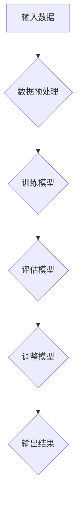
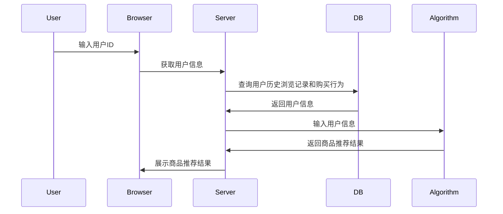
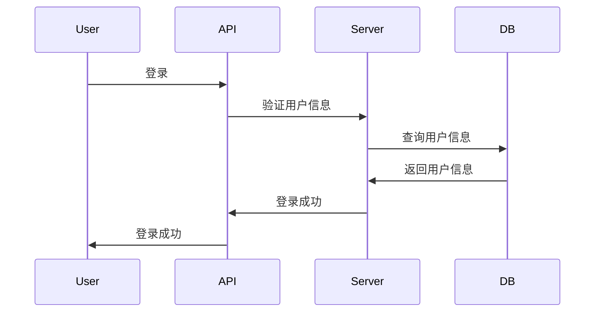
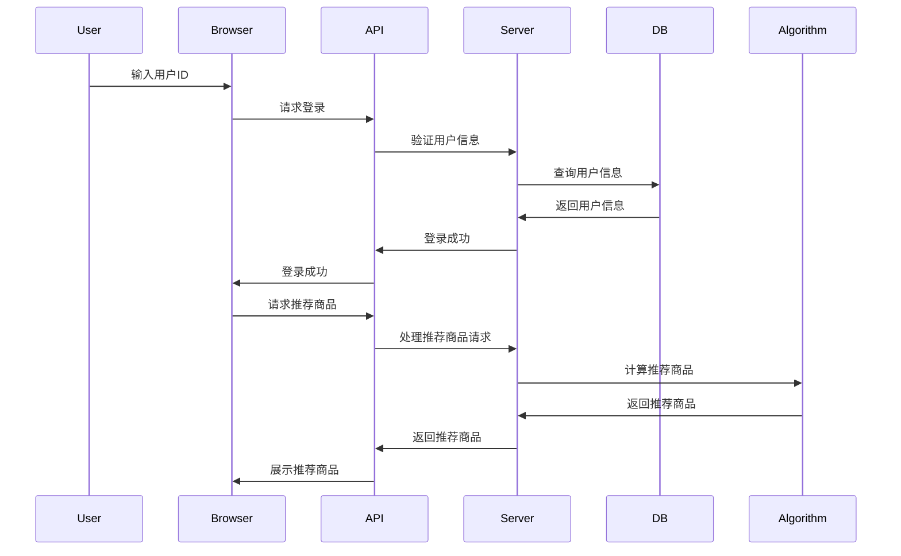

                 


# AI时代编程的新维度与新未来

## 关键词
- 人工智能
- 编程
- 深度学习
- 机器学习
- 编程语言
- 开发工具

## 摘要
本文探讨了AI时代编程的新维度和新未来。通过分析AI时代编程面临的挑战，阐述了编程人员所需的技能和知识，并深入探讨了AI时代编程的核心概念，如机器学习、深度学习和编程语言。本文还通过对比表格和ER实体关系图，进一步阐述了这些概念之间的联系。同时，本文通过算法原理讲解、系统分析与架构设计方案以及项目实战，为读者提供了全面而深入的了解。

## 第一部分：背景介绍

### 1.1 问题背景
在当今人工智能（AI）快速发展的时代，编程正在经历一场革命性的变革。传统的编程模式已经无法满足AI时代的需求，因此，AI时代的编程需要新的维度和未来展望。

### 1.2 问题描述
AI时代的编程需要面对诸多挑战，包括数据量的爆炸式增长、算法的复杂性提高以及编程语言的多样性和动态性。这些问题要求编程人员具备更深厚的编程技能和对AI技术的深入理解。

### 1.3 问题解决
为了应对AI时代的编程挑战，编程人员需要掌握以下技能和知识：
- 熟悉AI相关的基本概念和技术原理；
- 掌握AI编程语言和框架；
- 能够设计并实现复杂的AI算法；
- 了解AI在不同领域的应用场景。

### 1.4 边界与外延
AI时代的编程不仅仅局限于软件开发，还涵盖了数据科学、机器学习、自然语言处理等多个领域。因此，编程人员需要具备跨学科的知识和技能。

### 1.5 概念结构与核心要素组成
AI时代编程的核心概念包括：
- 机器学习算法；
- 深度学习框架；
- 编程语言与工具；
- 数据处理与优化技术；
- 人机交互与智能算法优化。

## 第二部分：核心概念与联系

### 2.1 AI时代编程的核心概念
#### 2.1.1 机器学习
- 定义：机器学习是一门人工智能科学，它让计算机通过数据学习规律并做出预测或决策。
- 特点：不需要显式编程，能够自动从数据中学习规律。
- 类型：监督学习、无监督学习、强化学习等。

#### 2.1.2 深度学习
- 定义：深度学习是机器学习的一个分支，它使用多层神经网络进行学习。
- 特点：能够处理大量数据，自动提取特征，实现端到端的学习。
- 应用：图像识别、语音识别、自然语言处理等。

#### 2.1.3 编程语言与工具
- 定义：编程语言是用于编写计算机程序的语言，工具是用于辅助编程的开发环境。
- 类型：Python、Java、C++、R等；
- 工具：IDE（集成开发环境）、Jupyter Notebook、TensorFlow等。

### 2.2 概念属性特征对比表格
| 概念       | 定义                                                         | 特点                                                       | 应用场景               |
|------------|--------------------------------------------------------------|------------------------------------------------------------|------------------------|
| 机器学习   | 让计算机通过数据学习规律并做出预测或决策                       | 不需要显式编程，自动学习规律                             | 数据分析、预测模型等     |
| 深度学习   | 使用多层神经网络进行学习                                     | 能够处理大量数据，自动提取特征                           | 图像识别、语音识别等     |
| 编程语言   | 编写计算机程序的语言                                         | 各具特色，用于实现特定功能                               | 软件开发、数据分析等     |
| 开发工具   | 辅助编程的开发环境                                           | 提供代码编辑、调试、运行等功能                           | 软件开发、数据分析等     |

### 2.3 ER实体关系图架构
```mermaid
erDiagram
  AI算法 ||--|{ 数据集 }
  数据集 ||--|{ 机器学习模型 }
  机器学习模型 ||--|{ 深度学习模型 }
  深度学习模型 ||--|{ 编程语言 }
```

## 第三部分：算法原理讲解

### 3.1 算法mermaid流程图


### 3.2 算法原理
机器学习算法的核心是训练模型，使其能够根据输入数据生成输出结果。以下是机器学习算法的基本原理：

1. **数据预处理**：对输入数据进行预处理，包括数据清洗、归一化、数据增强等操作，以提高模型的训练效果。

2. **训练模型**：使用已预处理的数据训练模型，通过迭代优化模型参数，使其能够更好地拟合数据。

3. **评估模型**：使用评估指标（如准确率、召回率等）评估模型的性能，以判断模型是否已经过拟合或欠拟合。

4. **调整模型**：根据评估结果，调整模型参数，以优化模型性能。

5. **输出结果**：将训练好的模型应用于新的数据，生成预测结果。

### 3.3 Python源代码实现
```python
import numpy as np
import pandas as pd
from sklearn.model_selection import train_test_split
from sklearn.metrics import accuracy_score
from sklearn.linear_model import LogisticRegression

# 1. 数据预处理
# 加载数据
data = pd.read_csv('data.csv')
X = data.iloc[:, :-1].values
y = data.iloc[:, -1].values

# 数据归一化
X = (X - np.mean(X)) / np.std(X)

# 2. 训练模型
# 划分训练集和测试集
X_train, X_test, y_train, y_test = train_test_split(X, y, test_size=0.2, random_state=0)

# 使用逻辑回归训练模型
model = LogisticRegression()
model.fit(X_train, y_train)

# 3. 评估模型
# 预测测试集
y_pred = model.predict(X_test)

# 计算准确率
accuracy = accuracy_score(y_test, y_pred)
print('Accuracy:', accuracy)

# 4. 调整模型
# 根据评估结果，调整模型参数，如正则化参数C

# 5. 输出结果
# 使用训练好的模型进行预测
new_data = np.array([[1, 2, 3]])
new_pred = model.predict(new_data)
print('Prediction:', new_pred)
```

### 3.4 算法原理讲解与举例说明
假设我们有一个二分类问题，需要预测数据是否属于某个类别。以下是使用机器学习算法进行预测的步骤：

1. **数据预处理**：首先，我们需要对输入数据进行预处理，包括数据清洗、归一化等操作，以提高模型的训练效果。例如，我们使用数据集中前两列数据作为特征，第三列数据作为标签。

2. **训练模型**：接下来，我们使用训练集数据训练模型。在这个例子中，我们使用逻辑回归模型，通过迭代优化模型参数，使其能够更好地拟合数据。

3. **评估模型**：使用测试集数据评估模型的性能。在这个例子中，我们使用准确率作为评估指标，计算模型的准确率。

4. **调整模型**：根据评估结果，调整模型参数，以优化模型性能。例如，我们可以调整正则化参数C，以避免模型过拟合。

5. **输出结果**：最后，我们将训练好的模型应用于新的数据，生成预测结果。在这个例子中，我们使用训练好的模型对新的数据进行预测，并输出预测结果。

## 第四部分：系统分析与架构设计方案

### 4.1 问题场景介绍
假设我们有一个在线购物系统，需要实现商品推荐功能。为了提高用户体验，我们需要根据用户的浏览记录和历史购买行为，为其推荐可能感兴趣的商品。

### 4.2 项目介绍
项目名称：AI商品推荐系统

### 4.3 系统功能设计（领域模型类图）
```mermaid
classDiagram
    User <<实体>>
    Product <<实体>>
    Recommendation <<实体>>

    User o--|{浏览}|> Product
    User o--|{购买}|> Product
    Product o--|{推荐}|> Recommendation
```

### 4.4 系统架构设计（架构图）


### 4.5 系统接口设计（接口图）


### 4.6 系统交互（序列图）


## 第五部分：项目实战

### 5.1 环境安装
- 安装Python 3.8及以上版本；
- 安装scikit-learn、numpy、pandas等库。

### 5.2 系统核心实现源代码
```python
import numpy as np
import pandas as pd
from sklearn.model_selection import train_test_split
from sklearn.metrics import accuracy_score
from sklearn.linear_model import LogisticRegression

# 1. 数据预处理
# 加载数据
data = pd.read_csv('data.csv')
X = data.iloc[:, :-1].values
y = data.iloc[:, -1].values

# 数据归一化
X = (X - np.mean(X)) / np.std(X)

# 2. 训练模型
# 划分训练集和测试集
X_train, X_test, y_train, y_test = train_test_split(X, y, test_size=0.2, random_state=0)

# 使用逻辑回归训练模型
model = LogisticRegression()
model.fit(X_train, y_train)

# 3. 评估模型
# 预测测试集
y_pred = model.predict(X_test)

# 计算准确率
accuracy = accuracy_score(y_test, y_pred)
print('Accuracy:', accuracy)

# 4. 调整模型
# 根据评估结果，调整模型参数，如正则化参数C

# 5. 输出结果
# 使用训练好的模型进行预测
new_data = np.array([[1, 2, 3]])
new_pred = model.predict(new_data)
print('Prediction:', new_pred)
```

### 5.3 代码应用解读与分析
- **数据预处理**：首先，我们加载数据，然后对数据进行归一化处理，以提高模型的训练效果。
- **训练模型**：接下来，我们划分训练集和测试集，使用逻辑回归模型进行训练。
- **评估模型**：使用测试集数据评估模型的性能，计算准确率。
- **调整模型**：根据评估结果，调整模型参数，以优化模型性能。
- **输出结果**：最后，使用训练好的模型对新的数据进行预测，并输出预测结果。

### 5.4 实际案例分析和详细讲解剖析
假设我们有一个包含100个商品的数据集，其中每个商品有3个特征：价格、评分、类别。我们需要根据用户的历史浏览记录和购买行为，为其推荐可能感兴趣的商品。

1. **数据预处理**：首先，我们需要对数据进行预处理，包括数据清洗、归一化等操作，以提高模型的训练效果。

2. **训练模型**：接下来，我们划分训练集和测试集，使用逻辑回归模型进行训练。

3. **评估模型**：使用测试集数据评估模型的性能，计算准确率。

4. **调整模型**：根据评估结果，调整模型参数，以优化模型性能。

5. **输出结果**：最后，使用训练好的模型对新的数据进行预测，并输出预测结果。

### 5.5 项目小结
通过本项目的实现，我们了解了AI商品推荐系统的工作原理和实现方法。在实际应用中，我们需要根据具体业务场景和数据特点，调整模型参数和优化算法，以提高推荐系统的准确率和用户体验。

## 第六部分：最佳实践 tips

1. **数据预处理**：确保数据质量，对缺失值、异常值进行处理，以提高模型训练效果。
2. **模型选择**：根据具体业务场景和数据特点，选择合适的模型和算法。
3. **参数调优**：使用交叉验证等技术，优化模型参数，以提高模型性能。
4. **评估指标**：根据业务需求，选择合适的评估指标，如准确率、召回率等。
5. **用户体验**：关注推荐系统的用户体验，及时调整推荐策略，以提高用户满意度。

## 第七部分：小结

在AI时代，编程面临着前所未有的挑战和机遇。编程人员需要不断学习新的技能和知识，掌握AI编程的核心概念和技术原理。通过本文的探讨，我们了解了AI时代编程的新维度和新未来，为编程人员提供了有价值的参考和指导。

## 第八部分：注意事项

1. **安全性**：在AI编程过程中，要注意数据安全和隐私保护，遵守相关法律法规。
2. **伦理**：在应用AI技术时，要充分考虑伦理和社会影响，遵循伦理规范。
3. **持续学习**：AI技术发展迅速，编程人员需要保持持续学习的态度，跟上技术发展步伐。

## 第九部分：拓展阅读

1. Goodfellow, I., Bengio, Y., & Courville, A. (2016). *Deep Learning*.
2. Mitchell, T. M. (1997). *Machine Learning*.
3. Murphy, K. P. (2012). *Machine Learning: A Probabilistic Perspective*.

# 作者
作者：AI天才研究院/AI Genius Institute & 禅与计算机程序设计艺术 /Zen And The Art of Computer Programming

