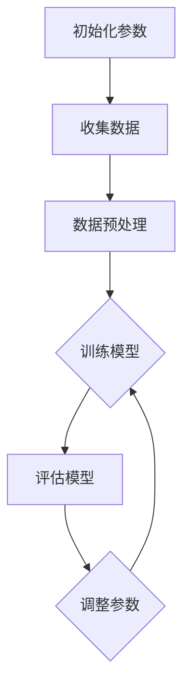
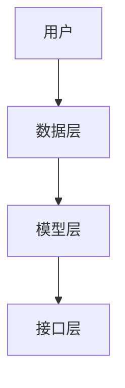
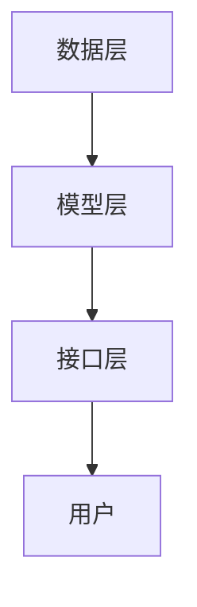

                 

# AI编程的新思维与新视野

> 关键词：人工智能，编程思维，新视野，最佳实践

> 摘要：本文将探讨AI编程的新思维与新视野，通过对AI编程核心概念、原理和最佳实践的深入分析，帮助读者了解AI编程的发展趋势、应用领域以及未来前景。本文结构清晰，逻辑严密，适合对AI编程感兴趣的读者阅读。

## **第一部分：背景与核心概念**

### **1.1 问题背景与描述**

#### **1.1.1 人工智能的快速发展**

人工智能（AI）作为一种模拟人类智能的技术，近年来取得了飞速发展。从最初的规则驱动系统，到基于统计学习和深度学习的智能系统，AI已经渗透到我们的日常生活和工作中。智能助手、自动驾驶、医疗诊断、金融分析等领域的应用层出不穷，极大地改变了我们的生活方式。

#### **1.1.2 传统编程的局限性**

然而，传统的编程方法在应对复杂问题、自适应能力和智能决策方面存在一定的局限性。随着AI技术的不断进步，新的编程思维与方法应运而生，这些新思维为解决复杂问题提供了新的视角和工具。

#### **1.1.3 AI编程的新思维**

AI编程的新思维强调的是利用人工智能算法来扩展和增强传统编程的能力。这种思维不仅要求程序员掌握基础的编程技能，还需要对机器学习、深度学习等AI技术有深入的理解。

### **1.2 核心概念**

#### **1.2.1 AI编程的定义**

AI编程是指利用人工智能技术，如机器学习、深度学习等，来设计和实现具有智能特性的软件系统。它不仅仅是对现有编程语言的扩展，更是一种全新的编程范式。

#### **1.2.2 AI编程的关键特性**

- 自适应能力：AI编程系统能够根据输入数据自动调整自己的行为。
- 智能决策：AI编程系统能够在复杂的情境中做出智能化的决策。
- 数据驱动：AI编程依赖于大量数据来训练和优化模型。

#### **1.2.3 AI编程与传统编程的比较**

| 特性        | 传统编程             | AI编程                |
| ----------- | -------------------- | --------------------- |
| 编程范式    | 面向过程或面向对象   | 面向数据与模型       |
| 依赖知识    | 程序员的知识与经验   | 数据与算法           |
| 设计目标    | 高效与可维护性       | 智能性与适应性       |

### **1.3 新视野**

#### **1.3.1 AI编程的未来趋势**

随着硬件性能的提升和数据资源的丰富，AI编程将更加普及。未来的AI编程将更加注重自动化、智能化和高效化。

#### **1.3.2 AI编程在各个领域的应用**

AI编程在医疗、金融、工业、教育等多个领域都有广泛的应用前景。例如，AI在医疗诊断、金融风控、工业自动化等方面的应用已经取得了显著的成果。

#### **1.3.3 AI编程面临的挑战与机遇**

AI编程面临着数据安全、隐私保护、算法透明性等挑战。然而，这些挑战同时也带来了新的机遇，促使我们不断创新和突破。

### **1.4 本章小结**

本部分介绍了AI编程的背景、核心概念和新视野，为后续内容的展开奠定了基础。在下一部分中，我们将深入探讨AI编程的核心原理。

## **第二部分：AI编程的核心原理**

### **2.1 AI编程的基础知识**

#### **2.1.1 机器学习简介**

机器学习是AI编程的核心技术之一。它通过算法从数据中学习规律，并利用这些规律进行预测和决策。

#### **2.1.2 深度学习基础**

深度学习是机器学习的一种重要分支，它通过多层神经网络来提取数据的高级特征。

#### **2.1.3 自然语言处理基本概念**

自然语言处理（NLP）是AI编程在语言领域的应用，它涉及到文本的生成、理解、翻译等多个方面。

### **2.2 算法原理讲解**

#### **2.2.1 算法概述**

算法是AI编程的核心，它决定了系统的性能和效果。本节将介绍一些常用的机器学习算法。

#### **2.2.2 算法流程图**

使用Mermaid绘制算法流程图，展示算法的基本步骤。



#### **2.2.3 Python代码实现**

以下是一个简单的线性回归算法的Python代码实现。

```python
import numpy as np

def linear_regression(X, y):
    w = np.linalg.inv(X.T @ X) @ X.T @ y
    return w

X = np.array([[1, 2], [2, 3], [3, 4]])
y = np.array([3, 4, 5])

w = linear_regression(X, y)
print(w)
```

#### **2.2.4 数学模型与公式讲解**

线性回归的数学模型如下：

$$
y = X \cdot w + b
$$

其中，$X$ 是输入特征矩阵，$w$ 是权重矩阵，$b$ 是偏置项。

#### **2.2.5 举例说明**

假设我们有一个简单的数据集：

| x | y |
| --- | --- |
| 1 | 3 |
| 2 | 4 |
| 3 | 5 |

我们使用线性回归模型来拟合这个数据集。

### **2.3 AI编程的实际应用**

#### **2.3.1 人工智能在图像识别中的应用**

图像识别是AI编程的一个重要应用领域。通过卷积神经网络（CNN），我们可以训练模型来识别图像中的物体。

#### **2.3.2 人工智能在自然语言处理中的应用**

自然语言处理涉及到文本的生成、理解、翻译等任务。通过循环神经网络（RNN）和Transformer模型，我们可以实现这些任务。

#### **2.3.3 人工智能在推荐系统中的应用**

推荐系统是AI编程在电子商务、社交媒体等领域的应用。通过协同过滤、矩阵分解等方法，我们可以为用户推荐他们可能感兴趣的内容。

### **2.4 本章小结**

本部分介绍了AI编程的基础知识、算法原理和应用实例，为读者提供了全面了解AI编程的核心内容。在下一部分中，我们将探讨AI编程的最佳实践。

## **第三部分：AI编程的最佳实践**

### **3.1 开发环境搭建**

#### **3.1.1 环境配置与工具选择**

搭建AI编程的开发环境需要选择合适的工具和软件。本节将介绍常用的开发工具和库，如Python、Jupyter Notebook、TensorFlow等。

#### **3.1.2 常见问题与解决方案**

在开发过程中，可能会遇到各种问题。本节将列举一些常见问题，并提供解决方案。

#### **3.1.3 实践案例**

通过一个简单的案例，展示如何使用Python和TensorFlow来构建一个线性回归模型。

### **3.2 系统架构设计**

#### **3.2.1 系统架构概述**

本节将介绍一个AI系统的整体架构，包括数据层、模型层和接口层。

#### **3.2.2 领域模型设计**

使用Mermaid绘制领域模型，展示系统的核心概念和实体关系。



#### **3.2.3 系统架构图**

使用Mermaid绘制系统架构图，展示各个模块之间的关系。



#### **3.2.4 系统接口设计**

本节将介绍如何设计系统的接口，包括RESTful API和WebSocket等。

### **3.3 代码实战**

#### **3.3.1 系统核心功能实现**

本节将展示如何实现系统的核心功能，包括数据采集、模型训练和预测等。

#### **3.3.2 代码解读与分析**

对实现的核心功能进行代码解读和分析，帮助读者理解代码的原理和设计。

#### **3.3.3 实际案例剖析**

通过一个实际案例，展示如何使用AI编程解决实际问题。

### **3.4 本章小结**

本部分介绍了AI编程的最佳实践，包括开发环境搭建、系统架构设计和代码实战。通过这些实践，读者可以更好地掌握AI编程的技巧和原理。

## **第四部分：拓展视野**

### **4.1 AI编程的新领域**

#### **4.1.1 人工智能在医疗领域的应用**

AI在医疗领域的应用包括疾病预测、诊断辅助、治疗方案推荐等。

#### **4.1.2 人工智能在金融领域的应用**

AI在金融领域的应用包括风险评估、交易预测、智能投顾等。

#### **4.1.3 人工智能在工业领域的应用**

AI在工业领域的应用包括生产优化、设备维护、供应链管理等。

### **4.2 AI编程的未来发展**

#### **4.2.1 AI编程的技术趋势**

AI编程将朝着更加自动化、智能化和高效化的方向发展。

#### **4.2.2 AI编程在教育领域的应用**

AI编程将在教育领域发挥重要作用，如智能教学、在线教育等。

#### **4.2.3 AI编程在文化创意产业的应用**

AI编程将在文化创意产业中创造新的价值，如艺术创作、游戏设计等。

### **4.3 AI编程的社会影响**

#### **4.3.1 AI编程对职业的影响**

AI编程将改变职业结构，创造新的就业机会。

#### **4.3.2 AI编程对社会的挑战**

AI编程将面临数据安全、隐私保护、伦理道德等挑战。

#### **4.3.3 AI编程的伦理问题**

AI编程的伦理问题包括算法偏见、数据滥用等。

### **4.4 本章小结**

本部分拓展了AI编程的应用领域和社会影响，展示了AI编程的广阔前景和深远影响。

## **第五部分：总结与展望**

### **5.1 全书总结**

本部分总结了全书的主要内容和核心结论，为读者提供了一个全面的概述。

### **5.2 展望未来**

本部分探讨了AI编程的未来发展方向和机遇，展望了AI编程在教育、产业和社会等领域的应用前景。

### **5.3 结论**

本部分重申了AI编程的重要性和影响力，对未来的发展充满期待。

作者：AI天才研究院/AI Genius Institute & 禅与计算机程序设计艺术 /Zen And The Art of Computer Programming

