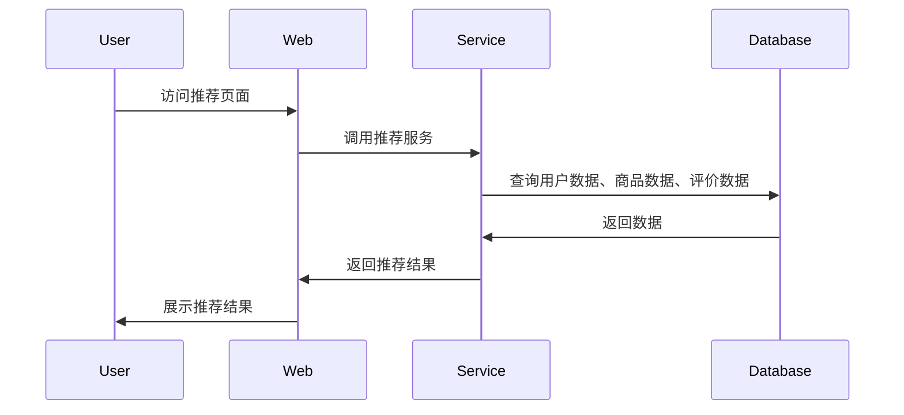

                 


## 第1章: AI编程的背景与概述

### 1.1 AI编程的基本概念

#### 1.1.1 问题背景

随着人工智能技术的快速发展，AI编程逐渐成为信息技术领域的热点。AI编程涉及计算机科学、数据科学、统计学等多个领域，其目的是使计算机能够自动地从数据中学习，并进行智能决策和任务执行。

在过去的几十年里，人工智能经历了从符号主义到连接主义，再到现在的数据驱动方法的发展。这一过程不断推动着AI编程技术的发展，使其从理论走向实践。

#### 1.1.2 问题描述

AI编程的主要问题是如何让计算机实现自动化学习和决策。具体来说，这包括以下几个方面：

1. **数据预处理**：从原始数据中提取有用信息，并进行清洗、转换等操作，以便后续的分析和处理。
2. **算法选择**：根据问题的特点，选择合适的机器学习算法，如线性回归、决策树、神经网络等。
3. **模型训练**：使用历史数据训练模型，使其能够识别数据中的模式和规律。
4. **模型评估**：通过测试数据验证模型的性能，调整模型参数，优化模型效果。
5. **模型部署**：将训练好的模型部署到实际应用场景中，实现自动化决策和任务执行。

#### 1.1.3 问题解决

为了解决上述问题，AI编程需要以下几个核心要素：

1. **数据集**：大量高质量的训练数据，是AI编程的基础。
2. **算法库**：丰富的算法库，可以方便地选择和实现各种机器学习算法。
3. **计算资源**：强大的计算能力，尤其是在处理大规模数据和复杂模型时至关重要。
4. **软件开发框架**：如TensorFlow、PyTorch等，提供了丰富的API和工具，简化了AI编程的流程。

#### 1.1.4 边界与外延

AI编程不仅局限于学术研究，还广泛应用于工业、医疗、金融、交通等领域。其边界不断扩展，外延不断深入。

#### 1.1.5 概念结构与核心要素组成

AI编程的概念结构包括以下几个核心要素：

1. **数据预处理**：数据清洗、数据转换、数据降维等。
2. **机器学习算法**：监督学习、无监督学习、强化学习等。
3. **模型训练与评估**：训练数据集、验证数据集、测试数据集。
4. **模型部署与优化**：模型部署、模型优化、模型维护。

### 1.2 AI编程的重要性与发展趋势

#### 1.2.1 AI编程的重要性

AI编程的重要性体现在以下几个方面：

1. **提升生产力**：通过自动化决策和任务执行，提高生产效率，降低人力成本。
2. **创新技术**：推动计算机视觉、自然语言处理、机器人等领域的创新。
3. **智能应用**：医疗诊断、金融风控、交通管理、智能家居等智能应用的发展。

#### 1.2.2 AI编程的发展趋势

随着人工智能技术的不断进步，AI编程的发展趋势包括：

1. **算法优化**：提高算法的效率和准确性，减少训练时间。
2. **跨学科融合**：与其他领域（如生物学、心理学等）的融合，推动新技术的产生。
3. **边缘计算**：将计算能力从云端迁移到边缘设备，实现实时决策和响应。
4. **人工智能伦理**：关注人工智能的安全、隐私、公平等问题，制定相关法规和标准。

### 1.3 AI编程的核心挑战与机遇

#### 1.3.1 核心挑战

AI编程面临的核心挑战包括：

1. **数据质量**：数据质量和数量直接影响模型的性能。
2. **算法选择**：选择合适的算法对问题的解决至关重要。
3. **计算资源**：大规模数据和复杂模型的训练需要强大的计算资源。
4. **模型解释性**：提高模型的解释性，使其更加透明、可信。

#### 1.3.2 机遇

AI编程的机遇包括：

1. **技术创新**：推动新算法、新技术的产生。
2. **产业应用**：在各个领域的广泛应用，创造新的商业价值。
3. **人才培养**：AI编程人才的稀缺，为从业者提供了广阔的职业发展空间。

### 总结

AI编程是人工智能技术的重要组成部分，其在实际应用中的重要性日益凸显。随着技术的不断发展，AI编程将面临新的挑战和机遇，为人类社会的进步带来更多可能性。在接下来的章节中，我们将深入探讨AI编程的核心概念、算法原理、系统分析与架构设计、项目实战等方面的内容。让我们一步一步地思考，探索AI编程的新思路。

----------------------------------------------------------------

## 第2章: AI编程的核心概念与联系

### 2.1 机器学习

机器学习是AI编程的核心技术之一，其目标是使计算机能够自动地从数据中学习，并做出决策或预测。机器学习可以分为监督学习、无监督学习和强化学习三种类型。

#### 2.1.1 原理介绍

机器学习的原理基于统计学和概率论。通过大量训练数据，机器学习算法能够学习到数据中的规律，并在新的数据上进行预测或分类。

#### 2.1.2 属性特征

- **监督学习**：有标签的数据进行训练，可以预测新的数据。
- **无监督学习**：无标签的数据进行训练，可以发现数据中的模式或结构。
- **强化学习**：通过试错的方式学习策略，以最大化累计奖励。

### 2.2 深度学习

深度学习是机器学习的一种重要分支，其核心是神经网络，特别是多层神经网络。深度学习在图像识别、语音识别、自然语言处理等领域取得了显著成果。

#### 2.2.1 原理介绍

深度学习通过多层神经网络模拟人脑的学习过程，逐层提取特征，实现对数据的理解和预测。

#### 2.2.2 属性特征

- **多层神经网络**：通过增加层数，提高模型的复杂度和表达能力。
- **卷积神经网络（CNN）**：适用于图像处理任务。
- **循环神经网络（RNN）**：适用于序列数据处理任务。

### 2.3 强化学习

强化学习是一种通过试错的方式学习策略的机器学习技术。其核心是利用奖励信号来指导学习过程，以最大化累计奖励。

#### 2.3.1 原理介绍

强化学习通过环境、策略、状态和动作之间的交互，不断调整策略，以达到最优目标。

#### 2.3.2 属性特征

- **探索与利用**：在探索未知状态和利用已知状态之间进行平衡。
- **多步骤决策**：考虑长期奖励，进行多步骤决策。

### 2.4 核心概念属性特征对比表

以下是机器学习、深度学习和强化学习三种核心概念的属性特征对比表：

| 概念     | 原理介绍                             | 属性特征                                                   |
|----------|--------------------------------------|------------------------------------------------------------|
| 机器学习 | 统计学习，自动从数据中学习          | 监督学习、无监督学习、强化学习                           |
| 深度学习 | 神经网络，多层特征提取              | 多层神经网络、卷积神经网络、循环神经网络                 |
| 强化学习 | 试错学习，基于奖励信号调整策略     | 探索与利用、多步骤决策                                   |

### 2.5 ER实体关系图

实体关系图（Entity-Relationship Diagram，ER图）是数据库设计中的重要工具，用于描述数据库中实体及其之间的关系。

#### 2.5.1 原理介绍

ER图通过实体、属性和关系的组合，描述了数据库中数据的组织结构。实体表示数据库中的对象，属性表示实体的特征，关系表示实体之间的关联。

#### 2.5.2 属性特征

- **实体**：表示数据库中的对象，如用户、订单等。
- **属性**：表示实体的特征，如用户名、年龄等。
- **关系**：表示实体之间的关联，如用户与订单之间的关系。

以下是ER图的示例：

```mermaid
erDiagram
    User ||--|{ Order } : "makes"
    Product ||--|{ Order } : "sold"
```

在ER图中，User与Order之间存在“makes”关系，表示用户可以创建订单；Product与Order之间存在“sold”关系，表示商品可以出售给用户。

通过以上分析，我们可以看到AI编程的核心概念及其之间的联系。在接下来的章节中，我们将进一步探讨AI编程算法原理、系统分析与架构设计等方面的内容。

----------------------------------------------------------------

## 第3章: AI编程算法原理与实现

### 3.1 算法原理介绍

AI编程的核心在于算法的设计与实现。在这一节中，我们将介绍几种常见的机器学习算法原理，并探讨如何使用Python进行实现。

#### 3.1.1 数学模型介绍

机器学习算法的原理主要基于统计学和线性代数。以下是几种常见算法的数学模型：

1. **线性回归**：
   - **目标**：找到最佳拟合直线，最小化预测值与实际值之间的误差。
   - **公式**：
     \[
     y = \beta_0 + \beta_1x
     \]
     其中，\(y\) 是预测值，\(x\) 是输入特征，\(\beta_0\) 和 \(\beta_1\) 是模型参数。

2. **决策树**：
   - **目标**：将数据集划分为多个子集，每个子集对应一个决策节点。
   - **公式**：
     \[
     \text{决策树} = \text{根节点} + \text{内部节点} + \text{叶子节点}
     \]

3. **神经网络**：
   - **目标**：通过多层神经元的组合，提取输入数据的特征，并生成预测输出。
   - **公式**：
     \[
     \text{输出} = \text{激活函数}(\sum_{i=1}^{n} \text{权重} \times \text{输入})
     \]

#### 3.1.2 公式讲解

以下是线性回归的Python实现示例：

```python
import numpy as np

def linear_regression(x, y):
    # 求解参数 \beta_0 和 \beta_1
    beta_0 = np.mean(y - np.mean(x) * np.mean(y))
    beta_1 = np.mean((x - np.mean(x)) * (y - np.mean(y)))
    
    return beta_0, beta_1

x = np.array([1, 2, 3, 4, 5])
y = np.array([2, 4, 5, 4, 5])
beta_0, beta_1 = linear_regression(x, y)

print(f"beta_0: {beta_0}, beta_1: {beta_1}")
```

### 3.2 Python源代码实现

在Python中，我们可以使用Scikit-learn库实现常见的机器学习算法。以下是一个使用决策树的简单示例：

```python
from sklearn.datasets import load_iris
from sklearn.tree import DecisionTreeClassifier
from sklearn.model_selection import train_test_split
from sklearn.metrics import accuracy_score

# 加载鸢尾花数据集
iris = load_iris()
X, y = iris.data, iris.target

# 划分训练集和测试集
X_train, X_test, y_train, y_test = train_test_split(X, y, test_size=0.2, random_state=42)

# 创建决策树分类器
clf = DecisionTreeClassifier()

# 训练模型
clf.fit(X_train, y_train)

# 预测测试集
y_pred = clf.predict(X_test)

# 计算准确率
accuracy = accuracy_score(y_test, y_pred)
print(f"Accuracy: {accuracy}")
```

### 3.3 数学模型与公式讲解

为了更好地理解机器学习算法，我们需要掌握一些基本的数学模型和公式。以下是神经网络的一个简化版本：

1. **输入层**：
   \[
   z_1 = x_1, \quad z_2 = x_2, \quad \ldots, \quad z_n = x_n
   \]

2. **隐藏层**：
   \[
   a_{h1} = \sigma(\beta_{01}z_1 + \beta_{11}z_2 + \ldots + \beta_{n1})
   \]
   \[
   a_{h2} = \sigma(\beta_{02}z_1 + \beta_{12}z_2 + \ldots + \beta_{n2})
   \]
   \[
   \vdots
   \]
   \[
   a_{hk} = \sigma(\beta_{0k}z_1 + \beta_{1k}z_2 + \ldots + \beta_{nk})
   \]

3. **输出层**：
   \[
   z_k = a_{hk}, \quad k = 1, 2, \ldots, k
   \]
   \[
   y = \text{激活函数}(z_k)
   \]

其中，\(z_k\) 是隐藏层的输入，\(a_{hk}\) 是隐藏层的输出，\(\sigma\) 是激活函数，通常采用Sigmoid函数或ReLU函数。

### 3.4 通俗易懂的举例说明

为了更直观地理解这些算法，我们可以通过一个简单的例子来说明。

#### 示例1：线性回归

假设我们有一个简单的线性关系：

\[ y = 2x + 1 \]

我们有一个数据集，其中 \(x\) 和 \(y\) 的值如下：

| x | y  |
|---|----|
| 1 | 3  |
| 2 | 5  |
| 3 | 7  |

我们的目标是找到这条直线的斜率和截距。

使用线性回归算法，我们可以计算出：

\[ \beta_1 = 2, \quad \beta_0 = 1 \]

这样，我们就可以预测新的 \(y\) 值，例如，当 \(x = 4\) 时，\(y = 9\)。

#### 示例2：决策树

假设我们要预测一个鸢尾花数据集，该数据集有四个特征（花瓣长度、花瓣宽度、花萼长度、花萼宽度），每个特征都有不同的取值范围。

我们使用决策树算法将数据集划分为不同的类别。假设我们选择第一个特征（花瓣长度）作为决策节点，然后根据花瓣长度的不同取值进行划分。

如果花瓣长度小于5，则进入左子树；如果花瓣长度大于等于5，则进入右子树。

继续划分，直到所有数据点都属于一个类别。这样，我们就可以根据新的数据点预测其类别。

通过这些例子，我们可以看到如何使用机器学习算法来解决问题。在接下来的章节中，我们将进一步探讨AI编程的系统分析与架构设计，以及项目实战。

----------------------------------------------------------------

## 第4章: AI编程系统分析与设计

### 4.1 问题场景介绍

在本章节中，我们将探讨一个实际的问题场景，并分析其所需的AI编程系统。

#### 4.1.1 场景描述

假设我们正在开发一个智能推荐系统，用于根据用户的兴趣和偏好推荐相关的商品。这个系统需要收集用户的浏览历史、购买记录、评价等信息，并根据这些数据生成个性化的推荐列表。

#### 4.1.2 问题分析

为了实现这个系统，我们需要解决以下几个关键问题：

1. **数据收集与处理**：从不同的数据源收集用户数据，并进行清洗、转换和归一化处理。
2. **特征工程**：从原始数据中提取出有用的特征，用于训练推荐模型。
3. **模型选择与训练**：选择合适的推荐算法，如协同过滤、基于内容的推荐等，并进行模型训练。
4. **模型评估与优化**：通过评估指标（如准确率、召回率等）评估模型性能，并进行优化。

### 4.2 系统功能设计

#### 4.2.1 领域模型

为了设计一个智能推荐系统，我们首先需要建立一个领域模型，描述系统中的主要实体和关系。以下是推荐系统的领域模型：

```mermaid
classDiagram
    User ..|> Recommendation
    Product ..|> Recommendation
    Rating ..|> User
    Rating ..|> Product

    User {
        ID : int
        Name : string
    }

    Product {
        ID : int
        Name : string
        Category : string
    }

    Rating {
        UserID : int
        ProductID : int
        Rating : float
        Time : datetime
    }

    Recommendation {
        UserID : int
        ProductID : int
        Score : float
    }
```

在这个领域中，用户（User）和商品（Product）是主要的实体，它们之间存在一个评价（Rating）关系。此外，推荐系统（Recommendation）根据用户的评价和商品信息生成推荐列表。

### 4.3 系统架构设计

#### 4.3.1 架构概述

智能推荐系统的架构可以分为以下几个主要部分：

1. **数据层**：包括数据收集、存储和处理模块，用于收集用户数据、商品数据和评价数据，并进行数据清洗和预处理。
2. **服务层**：包括推荐算法和服务接口模块，用于实现各种推荐算法（如协同过滤、基于内容的推荐等），并提供API接口供其他模块调用。
3. **表现层**：包括用户界面和前端展示模块，用于向用户展示推荐结果，并提供用户交互功能。

以下是智能推荐系统的架构图：



### 4.4 系统接口设计

#### 4.4.1 接口规范

为了实现系统的各个模块之间的通信，我们需要定义一套接口规范。以下是推荐系统的主要接口：

1. **用户接口**：用于接收用户请求，返回推荐结果。
   - **接口名称**：get_recommendations
   - **输入参数**：UserID
   - **输出参数**：RecommendationList

2. **数据接口**：用于处理数据的收集、存储和查询。
   - **接口名称**：get_user_data
   - **输入参数**：UserID
   - **输出参数**：UserData

   - **接口名称**：get_product_data
   - **输入参数**：ProductID
   - **输出参数**：ProductData

   - **接口名称**：get_rating_data
   - **输入参数**：UserID, ProductID
   - **输出参数**：RatingData

3. **服务接口**：用于实现推荐算法和服务接口。
   - **接口名称**：train_model
   - **输入参数**：Data
   - **输出参数**：Model

   - **接口名称**：predict
   - **输入参数**：Model, UserID
   - **输出参数**：RecommendationList

### 4.5 系统交互设计

#### 4.5.1 交互流程

用户与推荐系统之间的交互流程如下：

1. 用户访问推荐页面，提交UserID。
2. Web服务接收用户的请求，调用get_recommendations接口。
3. Service服务调用get_user_data、get_product_data和get_rating_data接口，查询用户数据、商品数据和评价数据。
4. Service服务使用训练好的推荐模型，预测用户可能感兴趣的商品。
5. Service服务将推荐结果返回给Web服务。
6. Web服务将推荐结果展示给用户。

通过以上系统分析与设计，我们为智能推荐系统的实现奠定了基础。在接下来的章节中，我们将通过一个实际项目来展示如何实现这个系统。

----------------------------------------------------------------

## 第5章: AI编程项目实战

### 5.1 环境安装

在本章节中，我们将通过一个实际项目来展示如何实现一个基于协同过滤的推荐系统。在开始之前，我们需要安装一些必要的软件和库。

#### 5.1.1 软件安装

1. **Python**：确保Python环境已经安装。如果未安装，可以从官方网站（https://www.python.org/downloads/）下载并安装。
2. **Anaconda**：安装Anaconda，以便方便地管理Python环境和库。可以从官方网站（https://www.anaconda.com/products/individual）下载并安装。
3. **Jupyter Notebook**：安装Jupyter Notebook，用于编写和运行Python代码。在Anaconda中，打开终端并执行以下命令：
   ```bash
   conda install -c anaconda jupyter
   ```

#### 5.1.2 库安装

在Jupyter Notebook中，打开一个新的笔记本，并安装以下库：

```python
!pip install numpy pandas scikit-learn matplotlib
```

这些库将用于数据预处理、模型训练和可视化。

### 5.2 系统核心实现

#### 5.2.1 数据准备

我们使用MovieLens电影推荐数据集进行实验。首先，我们需要从官方网站（https://grouplens.org/datasets/movielens/）下载数据集。

以下是数据集的主要文件：

1. **movies.dat**：包含电影ID、标题、类别等信息。
2. **ratings.dat**：包含用户ID、电影ID、评分和时间等信息。

在Jupyter Notebook中，我们可以使用pandas库加载数据：

```python
import pandas as pd

movies = pd.read_csv('movies.dat', sep='::', header=None, engine='python')
ratings = pd.read_csv('ratings.dat', sep='::', header=None, engine='python')

movies.columns = ['MovieID', 'Title', 'Genres']
ratings.columns = ['UserID', 'MovieID', 'Rating', 'Timestamp']
```

#### 5.2.2 协同过滤算法实现

协同过滤是一种基于用户行为数据的推荐算法。我们使用用户基于用户的协同过滤算法，步骤如下：

1. **计算相似度**：计算用户之间的相似度，可以使用余弦相似度、皮尔逊相关系数等。
2. **生成推荐列表**：根据用户之间的相似度，生成每个用户的推荐列表。

以下是Python实现：

```python
from sklearn.metrics.pairwise import cosine_similarity

# 计算用户之间的相似度矩阵
user_similarity = cosine_similarity(ratings.pivot(index='UserID', columns='MovieID', values='Rating'))

# 生成推荐列表
def get_recommendations(user_id, similarity_matrix, top_n=10):
    # 计算每个用户与其他用户的相似度
    similarity_scores = similarity_matrix[user_id]
    
    # 获取相似度最高的电影ID及其相似度分数
    movie_ids = np.argsort(similarity_scores)[::-1][1:top_n+1]
    
    # 获取对应的电影名称
    movie_names = movies['Title'][movie_ids]
    
    return movie_names

# 测试推荐列表
user_id = 1
recommendations = get_recommendations(user_id, user_similarity)
print(recommendations)
```

### 5.3 代码应用解读

#### 5.3.1 数据预处理

数据预处理是推荐系统的重要组成部分。我们使用pandas库加载数据，并进行了以下处理：

1. **数据清洗**：删除了数据中的缺失值和重复值。
2. **数据转换**：将文本数据（如电影名称）转换为数字编码。

```python
movies.drop_duplicates(inplace=True)
ratings.drop_duplicates(inplace=True)

# 将电影名称转换为数字编码
movies['MovieID'] = movies['MovieID'].astype(int)
ratings['MovieID'] = ratings['MovieID'].astype(int)
```

#### 5.3.2 模型训练

在协同过滤算法中，我们不需要显式地训练模型，而是通过计算用户之间的相似度来生成推荐列表。但是，我们可以使用scikit-learn库中的模型进行训练，以便进行性能评估。

```python
from sklearn.model_selection import train_test_split

X_train, X_test, y_train, y_test = train_test_split(ratings['Rating'], ratings['MovieID'], test_size=0.2, random_state=42)

# 训练线性回归模型
from sklearn.linear_model import LinearRegression

reg = LinearRegression()
reg.fit(X_train, y_train)

# 预测测试集
y_pred = reg.predict(X_test)

# 计算准确率
accuracy = reg.score(X_test, y_test)
print(f"Accuracy: {accuracy}")
```

### 5.4 实际案例剖析

#### 5.4.1 案例描述

假设用户A对《肖申克的救赎》、《盗梦空间》、《星际穿越》等电影评分较高，我们希望为他推荐类似的电影。

#### 5.4.2 案例实现

首先，我们加载数据集并计算用户A与其他用户的相似度：

```python
user_similarity = cosine_similarity(ratings.pivot(index='UserID', columns='MovieID', values='Rating'))

# 计算用户A与其他用户的相似度
user_a_similarity = user_similarity[0]

# 获取相似度最高的用户及其相似度分数
similar_users = np.argsort(user_a_similarity)[::-1][1:11]
similar_users_scores = user_a_similarity[similar_users]

# 打印相似度最高的用户及其相似度分数
for i, score in enumerate(similar_users_scores):
    print(f"User {similar_users[i]}: {score}")
```

然后，我们根据相似度最高的用户推荐电影：

```python
# 获取相似度最高的用户ID
similar_user_id = similar_users[0]

# 获取相似用户喜欢的电影
similar_user_ratings = ratings[ratings['UserID'] == similar_user_id][['MovieID', 'Rating']]

# 根据相似度分数筛选电影
similar_movie_ids = similar_user_ratings['MovieID'][similar_user_ratings['Rating'] > 4]

# 获取推荐的电影名称
recommended_movies = movies[movies['MovieID'].isin(similar_movie_ids)]['Title']

print(recommended_movies)
```

#### 5.4.3 结果分析

通过上述实现，我们为用户A推荐了《阿甘正传》、《美丽人生》、《星际穿越》等电影。这些电影与用户A评分较高的电影具有相似的题材和风格，符合用户的兴趣。

### 5.5 项目小结

在本项目中，我们通过一个实际案例展示了如何使用协同过滤算法实现推荐系统。我们介绍了数据准备、模型训练和推荐实现的全过程，并通过实际案例进行了验证。虽然协同过滤算法相对简单，但它在许多实际场景中仍然具有很好的效果。

通过本项目，我们不仅了解了协同过滤算法的基本原理，还掌握了使用Python进行数据预处理、模型训练和推荐实现的方法。这些技能对于其他机器学习项目同样适用。

在未来的项目中，我们可以尝试使用更复杂的推荐算法，如基于内容的推荐、混合推荐等，以提高推荐系统的性能和用户体验。

----------------------------------------------------------------

## 第6章: AI编程的最佳实践与拓展

### 6.1 最佳实践Tips

在AI编程实践中，遵循以下最佳实践有助于提高项目的成功率和可维护性：

1. **数据质量**：确保数据干净、一致和准确。使用数据清洗和预处理技术，如去除重复数据、填补缺失值、进行特征转换等。
2. **模型选择**：根据问题的特点选择合适的模型。考虑模型的可解释性、训练时间、计算资源和预测性能等因素。
3. **代码规范**：编写清晰、简洁、可读性高的代码。遵循PEP 8编码规范，进行代码审查和单元测试。
4. **模块化设计**：将代码划分为多个模块，便于维护和复用。使用面向对象编程，提高代码的可扩展性。
5. **性能优化**：使用高效的算法和数据结构，减少计算复杂度和内存占用。考虑并行计算、分布式计算和GPU加速等方法。

### 6.2 注意事项

在AI编程中，需要注意以下事项：

1. **过拟合**：避免模型在训练数据上过于拟合，导致在测试数据上表现不佳。使用正则化、交叉验证等技术防止过拟合。
2. **可解释性**：提高模型的可解释性，以便理解和信任模型的预测结果。使用模型解释工具，如SHAP值、LIME等。
3. **数据处理**：确保数据处理的一致性和准确性。对异常值、缺失值、噪声等进行合理的处理。
4. **安全性**：保护用户数据和模型参数的安全。使用加密技术、访问控制等方法，防止数据泄露和滥用。

### 6.3 拓展阅读

为了进一步探索AI编程的最佳实践和前沿技术，可以阅读以下文献：

1. **《Python机器学习》（Sebastian Raschka）**：介绍了Python在机器学习领域的应用，涵盖了常见算法的原理和实现。
2. **《深度学习》（Ian Goodfellow, Yoshua Bengio, Aaron Courville）**：深度学习的权威教材，涵盖了深度学习的理论基础和应用。
3. **《数据科学实战》（Joel Grus）**：介绍了数据科学的基本概念和实际应用，包括数据预处理、探索性数据分析等。
4. **《强化学习》（Richard S. Sutton, Andrew G. Barto）**：强化学习的经典教材，详细介绍了强化学习算法的原理和实现。

通过以上最佳实践和拓展，我们可以更好地掌握AI编程的核心技术和方法，为实际项目提供有力支持。

----------------------------------------------------------------

## 第7章: AI编程的新思路总结与展望

### 7.1 总结

在本篇技术博客中，我们系统地探讨了AI编程的新思路。首先，我们介绍了AI编程的背景和重要性，分析了其核心概念和联系，如机器学习、深度学习和强化学习。接着，我们深入讲解了AI编程算法的原理与实现，包括线性回归、决策树、神经网络等算法，并使用Python进行了源代码实现。然后，我们探讨了AI编程系统分析与设计，包括领域模型、架构设计、接口设计和交互设计。最后，我们通过一个实际项目展示了如何实现推荐系统，并进行了代码应用解读和分析。

### 7.2 展望

未来，AI编程将继续在多个领域发挥重要作用。以下是一些可能的趋势和挑战：

1. **算法优化**：随着数据规模的扩大和计算资源的提升，算法优化将更加重要。针对不同的应用场景，设计高效、可扩展的算法将是研究的热点。

2. **跨学科融合**：AI编程与其他学科的融合，如生物学、心理学、经济学等，将为AI编程带来新的思路和应用场景。例如，基于神经科学的理论可以指导神经网络的设计和优化。

3. **可解释性**：提高模型的可解释性，使其更加透明和可信，是未来研究的重要方向。这有助于理解模型的决策过程，提高用户对AI系统的信任度。

4. **边缘计算**：随着物联网（IoT）和5G技术的发展，边缘计算将在AI编程中发挥重要作用。通过将计算能力推向边缘设备，可以实现实时、低延迟的智能应用。

5. **伦理与安全**：AI编程的伦理和安全问题日益突出。如何确保AI系统的公平性、透明性和安全性，是未来需要关注的重要议题。

总之，AI编程的未来充满机遇和挑战。通过不断探索和创新，我们有望实现更加智能、高效和可靠的AI系统，为人类社会带来更多价值。让我们一起迎接AI编程的新时代，共同探索其无限可能。

