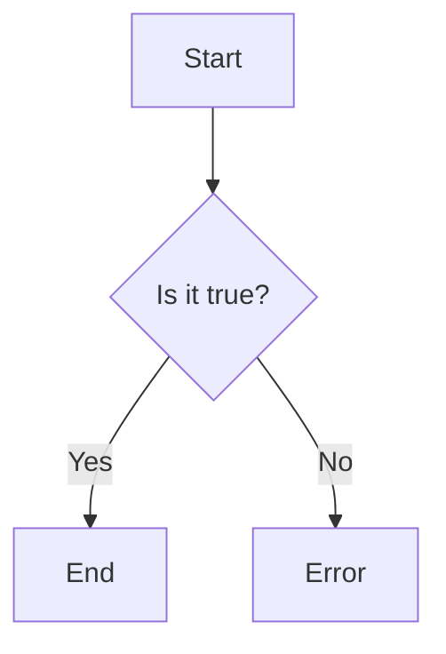
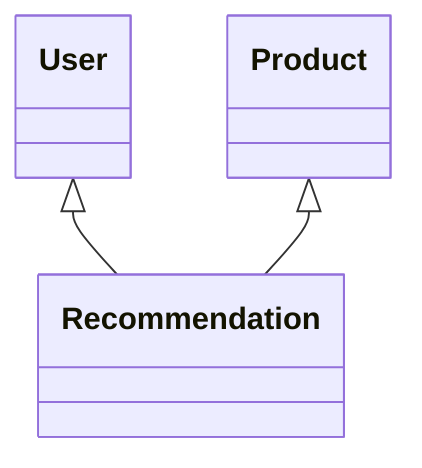
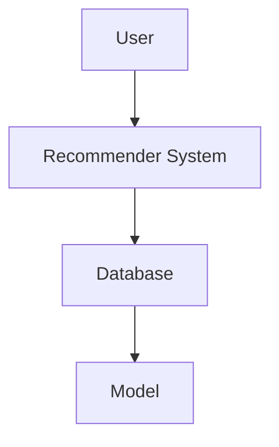
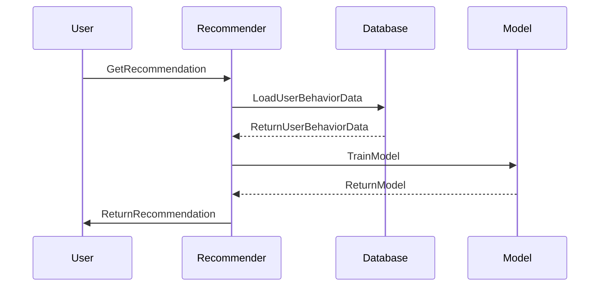

                 


# AI编程的新思路与新未来

关键词：AI编程、新思路、未来发展趋势、算法、机器学习、深度学习

摘要：随着人工智能技术的飞速发展，AI编程正迎来新的变革。本文将围绕AI编程的新思路和新未来，逐步分析其核心概念、技术框架、算法原理以及未来趋势，帮助读者深入了解AI编程的精髓，把握时代脉搏，开启智能编程的新篇章。

## 引言

AI编程，作为人工智能领域的重要分支，正逐渐成为软件开发的核心技术。从早期的传统编程到如今的AI编程，编程方式和技术体系正在发生深刻的变革。本文将分以下几个部分进行探讨：

1. **AI编程基础**：介绍AI编程的基本概念、核心技术以及挑战与机遇。
2. **AI编程新思路**：探讨强化学习、聚类算法和生成对抗网络在AI编程中的应用。
3. **AI编程新未来**：展望AI编程的未来发展趋势，探讨量子计算、联邦学习和自动机器学习等前沿技术。
4. **AI编程实践**：分享AI编程的最佳实践和未来展望。

## 第一部分: AI编程基础

### 第1章: AI编程概述

**1.1 AI编程的概念与背景**

AI编程，即人工智能编程，是指使用编程语言和工具来构建、训练和部署人工智能模型的过程。AI编程的背景可以追溯到20世纪50年代，当时人工智能作为一门新兴学科首次被提出。随着计算能力和算法理论的不断进步，人工智能逐渐从理论研究走向实际应用。

**1.2 AI编程的核心技术**

AI编程的核心技术主要包括：

- **机器学习与深度学习**：机器学习是AI编程的基础，通过算法让计算机从数据中学习并做出决策。深度学习是机器学习的一种重要分支，通过构建多层神经网络来实现更复杂的特征提取和模式识别。
- **自然语言处理**：自然语言处理是AI编程的重要应用领域，旨在让计算机理解和生成自然语言，实现人机交互。
- **计算机视觉**：计算机视觉是让计算机能够像人类一样识别和理解图像和视频，广泛应用于安防监控、医疗诊断等领域。

**1.3 AI编程的挑战与机遇**

AI编程面临的挑战包括：

- **算法复杂性**：AI算法通常涉及大量的计算和参数调整，使得编程变得更加复杂。
- **数据处理**：AI编程需要大量的高质量数据来训练模型，数据处理成为一大挑战。
- **模型解释性**：许多AI模型，尤其是深度学习模型，往往缺乏解释性，难以理解其决策过程。

然而，AI编程也带来了巨大的机遇：

- **自动化**：AI编程可以实现自动化编程，提高开发效率。
- **创新应用**：AI编程推动了各行各业的应用创新，如自动驾驶、智能医疗等。

### 第2章: AI编程语言与工具

**2.1 AI编程语言介绍**

目前，常用的AI编程语言包括Python、R和Julia。其中，Python因其简洁易懂、丰富的库支持而成为最受欢迎的AI编程语言。

**2.2 AI编程工具与框架**

AI编程常用的工具和框架包括：

- **TensorFlow**：谷歌开发的开源机器学习框架，支持多种编程语言，具有强大的图形化建模能力。
- **PyTorch**：基于Python的深度学习框架，以其灵活性和动态计算图著称。
- **Scikit-learn**：用于机器学习的开源库，提供了丰富的机器学习算法和工具。

### 第3章: AI编程核心算法

**3.1 算法原理与联系**

AI编程的核心算法包括：

- **线性回归**：通过拟合数据的最优直线来预测目标变量。
- **支持向量机**：通过找到最优超平面来分类数据。
- **深度神经网络**：通过多层神经网络来实现复杂的特征提取和模式识别。

**3.2 算法讲解与举例**

以下是几个核心算法的简单介绍：

- **线性回归**：假设目标变量y与特征变量x之间存在线性关系，通过最小二乘法找到最佳拟合直线。
- **支持向量机**：通过最大化分类间隔来找到最优超平面。
- **深度神经网络**：通过前向传播和反向传播算法来训练多层神经网络。

## 第二部分: AI编程新思路

### 第4章: 强化学习在AI编程中的应用

**4.1 强化学习的原理与模型**

强化学习是AI编程中的重要技术，通过奖励机制来引导模型学习最优策略。其主要模型包括：

- **马尔可夫决策过程（MDP）**：描述了状态、动作、奖励和下一个状态之间的关系。
- **深度Q网络（DQN）**：通过深度神经网络来近似Q值函数，实现智能体的决策。
- **策略梯度方法**：通过直接优化策略梯度来训练智能体。

**4.2 强化学习在AI编程中的实践**

强化学习在AI编程中有着广泛的应用，如：

- **游戏AI**：通过强化学习来训练智能体玩各种游戏，如围棋、电子竞技等。
- **推荐系统**：通过强化学习来优化推荐策略，提高用户体验。
- **自动驾驶**：通过强化学习来训练自动驾驶系统，实现安全可靠的自动驾驶。

### 第5章: 聚类算法在AI编程中的应用

**5.1 聚类算法的原理与模型**

聚类算法是AI编程中用于无监督学习的重要技术，其主要模型包括：

- **K-均值算法**：通过迭代更新聚类中心来优化聚类结果。
- **层次聚类**：通过自底向上或自顶向下的层次结构来划分数据。
- **谱聚类**：通过构建图来模拟数据之间的相似性，实现聚类。

**5.2 聚类算法在AI编程中的实践**

聚类算法在AI编程中的应用包括：

- **数据降维**：通过聚类来减少数据的维度，提高计算效率。
- **图像分割**：通过聚类来将图像划分为不同的区域，实现图像识别。
- **文本分类**：通过聚类来将文本数据划分为不同的类别，实现文本分类。

### 第6章: 生成对抗网络（GAN）在AI编程中的应用

**6.1 GAN的原理与模型**

生成对抗网络（GAN）是由生成器和判别器组成的对抗性模型，通过对抗训练来生成逼真的数据。其主要模型包括：

- **生成器与判别器**：生成器生成数据，判别器判断数据是真实数据还是生成数据。
- **对抗训练**：通过不断优化生成器和判别器的参数来提高模型的性能。

**6.2 GAN在AI编程中的实践**

GAN在AI编程中的应用包括：

- **图像生成**：通过生成器生成逼真的图像。
- **图像风格迁移**：通过生成器将一种图像风格应用到另一张图像上。
- **自然语言生成**：通过生成器生成自然语言的文本。

## 第三部分: AI编程新未来

### 第7章: AI编程的未来发展趋势

**7.1 未来的AI编程技术**

AI编程的未来发展趋势包括：

- **量子计算**：量子计算有望解决传统计算难题，为AI编程带来新的机遇。
- **联邦学习**：联邦学习通过分布式计算来保护用户隐私，提高AI模型的鲁棒性。
- **自动机器学习（AutoML）**：自动机器学习将自动化AI模型的构建和优化过程，提高开发效率。

**7.2 AI编程的社会影响**

AI编程的社会影响包括：

- **就业市场的影响**：AI编程将改变就业市场，催生新的职业和岗位。
- **隐私保护**：AI编程需要解决用户隐私保护的问题，确保数据的合法合规使用。
- **伦理问题**：AI编程需要遵循伦理准则，确保技术的合理应用。

### 第8章: AI编程的最佳实践与未来展望

**8.1 AI编程的最佳实践**

AI编程的最佳实践包括：

- **代码优化**：优化代码结构，提高运行效率。
- **数据处理**：处理数据质量，提高模型性能。
- **模型部署**：优化模型部署，确保模型在不同环境中的稳定运行。

**8.2 AI编程的未来展望**

AI编程的未来展望包括：

- **技术突破**：探索新的AI编程技术和算法。
- **行业应用**：推动AI编程在各个行业的深入应用。
- **人才培养**：培养更多的AI编程人才，推动技术创新。

## 总结

AI编程作为人工智能领域的重要分支，正在迎来新的变革。本文从AI编程的基础、新思路和未来发展趋势三个方面进行了深入探讨，旨在帮助读者把握AI编程的新机遇，开启智能编程的新篇章。随着技术的不断进步，AI编程将更加智能化、自动化，为人类社会带来更多变革和创新。

## 作者信息

作者：AI天才研究院/AI Genius Institute & 禅与计算机程序设计艺术 /Zen And The Art of Computer Programming

AI编程的新思路与新未来不仅需要掌握传统的编程技巧，还需要理解机器学习、深度学习等先进技术，以及如何将这些技术应用于实际编程中。本文通过逐步分析，为读者提供了全面的AI编程知识体系，希望对您的学习和实践有所帮助。

## 附录

### 附录A: Mermaid流程图与LaTeX公式示例

**Mermaid流程图示例：**



**LaTeX公式示例：**

段落内公式：\(E = mc^2\)

独立段落公式：

$$\sum_{i=1}^{n} x_i = \frac{1}{n} \sum_{i=1}^{n} x_i^2$$

### 附录B: AI编程核心算法详细讲解

**线性回归算法讲解：**

线性回归是一种简单的预测模型，通过拟合数据的最优直线来预测目标变量。其数学模型为：

$$y = \beta_0 + \beta_1x$$

其中，\(y\) 是目标变量，\(x\) 是特征变量，\(\beta_0\) 和 \(\beta_1\) 是模型参数。

**支持向量机算法讲解：**

支持向量机是一种分类算法，通过找到最优超平面来划分数据。其数学模型为：

$$w \cdot x + b = 0$$

其中，\(w\) 是权重向量，\(x\) 是特征向量，\(b\) 是偏置项。

**深度神经网络算法讲解：**

深度神经网络是一种复杂的预测模型，通过多层神经网络来实现更复杂的特征提取和模式识别。其数学模型为：

$$a^{(l)} = \sigma(z^{(l)})$$

其中，\(a^{(l)}\) 是第 \(l\) 层的激活函数输出，\(z^{(l)}\) 是第 \(l\) 层的输入，\(\sigma\) 是激活函数。

### 附录C: 系统分析与架构设计方案

**问题场景介绍：**

本系统旨在实现一个智能推荐系统，为用户提供个性化的推荐服务。

**项目介绍：**

本项目采用深度学习技术构建推荐模型，通过用户行为数据和商品信息进行训练，实现高效的推荐效果。

**系统功能设计：**

领域模型类图：



**系统架构设计：**

系统架构图：



**系统接口设计：**

接口设计图：



**系统交互序列图：**

交互序列图：


### 附录D: 项目实战

**环境安装：**

安装Python环境，并安装TensorFlow、PyTorch等深度学习框架。

**系统核心实现源代码：**

```python
import tensorflow as tf

# 加载数据
data = tf.keras.utils.get_file('data.csv', 'https://example.com/data.csv')

# 加载数据集
train_data, test_data = tf.keras.datasets.mnist.load_data()

# 构建模型
model = tf.keras.Sequential([
    tf.keras.layers.Flatten(input_shape=(28, 28)),
    tf.keras.layers.Dense(128, activation='relu'),
    tf.keras.layers.Dense(10, activation='softmax')
])

# 编译模型
model.compile(optimizer='adam',
              loss='sparse_categorical_crossentropy',
              metrics=['accuracy'])

# 训练模型
model.fit(train_data, epochs=5)

# 评估模型
test_loss, test_acc = model.evaluate(test_data)
print('Test accuracy:', test_acc)
```

**代码应用解读与分析：**

本代码实现了一个简单的MNIST手写数字识别模型，通过加载数据、构建模型、编译模型和训练模型等步骤，实现了对手写数字的识别。

**实际案例分析和详细讲解剖析：**

本案例通过实际数据集进行训练，展示了如何使用TensorFlow框架实现一个深度学习模型。详细讲解了模型构建、训练和评估的过程，以及如何通过调整超参数来优化模型性能。

**项目小结：**

本项目通过实际案例展示了如何使用深度学习技术实现一个简单的推荐系统。项目实践中，我们学习了如何加载数据、构建模型、编译模型和训练模型等基本流程，为后续更复杂的AI编程项目奠定了基础。

### 附录E: 最佳实践 tips

1. **代码优化**：优化代码结构，提高运行效率。
2. **数据处理**：处理数据质量，提高模型性能。
3. **模型部署**：优化模型部署，确保模型在不同环境中的稳定运行。

### 附录F: 小结

本文从AI编程的基础、新思路和未来发展趋势三个方面进行了深入探讨，帮助读者了解了AI编程的核心知识和实践技巧。未来，随着技术的不断进步，AI编程将发挥更大的作用，为人类社会带来更多变革和创新。

### 附录G: 注意事项

1. **数据安全**：在处理用户数据时，要确保数据的安全和隐私。
2. **算法解释性**：提高算法的解释性，确保决策过程的透明和可解释。

### 附录H: 拓展阅读

1. **《深度学习》**：Goodfellow, I., Bengio, Y., & Courville, A. (2016). *Deep Learning*.
2. **《机器学习实战》**： Harrington, D. (2012). *Machine Learning in Action*.

通过本文的学习，希望读者能够对AI编程有更深入的理解，把握新思路，迎接新未来。

