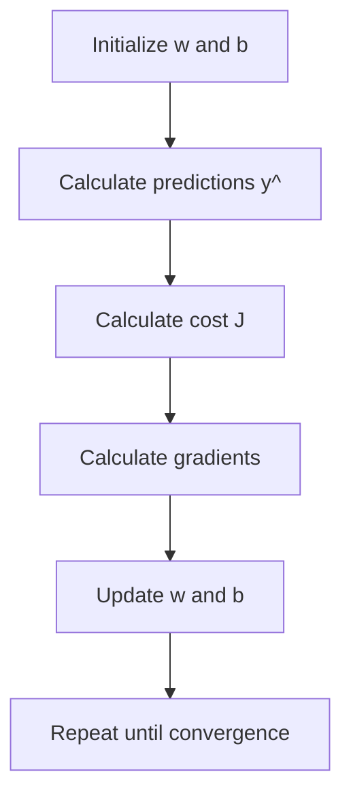
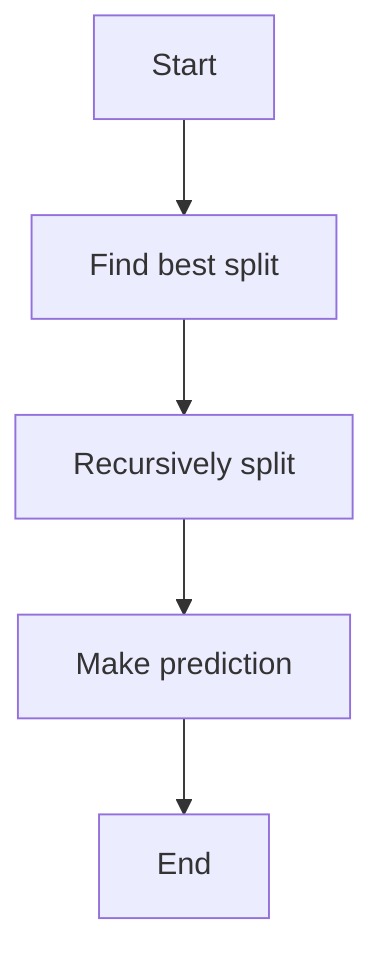
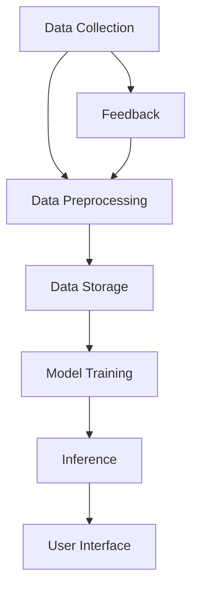
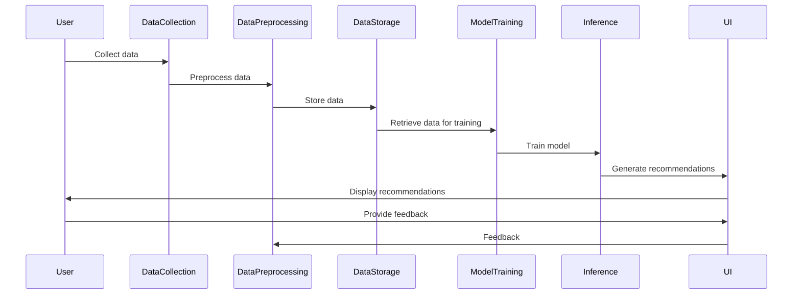

                 


### Introduction

#### AI Programming: New Perspectives and Future Directions

In this book, "AI Programming: New Perspectives and Future Directions," we embark on a journey through the rapidly evolving landscape of AI programming. As AI continues to permeate various aspects of our lives, from autonomous vehicles to virtual assistants, understanding how to program effectively within this domain becomes increasingly crucial.

**Keywords**: AI Programming, New Perspectives, Future Directions, Paradigm Shifts, Algorithm Design, Architectural Design, Practical Projects, Case Studies.

**Abstract**:

The book is structured to provide a comprehensive overview of AI programming, starting with historical context and core concepts. It delves into new perspectives on AI programming, algorithm design, and architectural considerations. Through practical projects and case studies, it aims to equip readers with the knowledge and skills needed to tackle real-world AI programming challenges. The goal is to foster a deeper understanding of the underlying principles and prepare readers for the future of AI programming.

### Chapter 1: Background of AI and Programming

#### 1.1 Historical Context of AI and Programming

The concept of AI dates back to the 1950s when computer scientist John McCarthy coined the term "artificial intelligence." Initially, AI was viewed as a way to simulate human intelligence through logical reasoning and problem-solving. Over the decades, AI has evolved significantly, with advancements in machine learning, deep learning, and other techniques leading to remarkable achievements in areas such as image recognition, natural language processing, and autonomous systems.

Programming, on the other hand, has been a fundamental tool in the development of AI. From the early days of machine code to the modern era of high-level languages, programming has enabled the creation of sophisticated algorithms and systems that power AI applications. The synergy between AI and programming has been essential in driving innovation and solving complex problems.

#### 1.2 Core Concepts and Relationships

At the heart of AI programming are several core concepts and relationships that are crucial to understanding the field. These include:

1. **Machine Learning**: A subset of AI that focuses on the development of algorithms that can learn from data and improve their performance over time.
2. **Deep Learning**: A specialized field of machine learning that utilizes neural networks to model complex patterns and relationships in data.
3. **Natural Language Processing (NLP)**: The ability of computers to understand, interpret, and generate human language, enabling applications such as chatbots and language translation.
4. **Computer Vision**: The ability of computers to interpret and understand visual information from digital images or videos.

These concepts are interconnected and often used in combination to create powerful AI applications. For example, NLP and computer vision can be integrated to develop systems that can understand and respond to natural language commands, such as voice assistants.

To illustrate these relationships, we can use a Mermaid ER diagram:

```mermaid
erDiagram
  MachineLearning ||--|{ DeepLearning } DeepLearning
  MachineLearning ||--|{ NaturalLanguageProcessing } NaturalLanguageProcessing
  MachineLearning ||--|{ ComputerVision } ComputerVision
```

#### 1.3 Challenges and Opportunities

AI programming presents both challenges and opportunities. On the one hand, the complexity of AI algorithms and the vast amount of data required to train them can be daunting. On the other hand, the potential applications of AI are vast, from healthcare to finance, and the demand for skilled AI programmers is growing.

Challenges include:

1. **Data Privacy and Security**: Ensuring that sensitive data is handled responsibly and securely.
2. **Ethical Considerations**: Addressing issues such as bias and fairness in AI systems.
3. **Scalability**: Designing AI systems that can handle large amounts of data and scale effectively.

Opportunities include:

1. **Innovation**: The ability to develop new and innovative applications of AI.
2. **Efficiency**: The potential to automate tasks and improve efficiency in various industries.
3. **Collaboration**: The opportunity to collaborate with other disciplines, such as biology and psychology, to advance AI research.

In conclusion, understanding the historical context, core concepts, and challenges and opportunities of AI programming is essential for navigating the future of this exciting field. In the next chapter, we will explore new perspectives on AI programming and discuss the shifts in paradigms that are shaping the future of the field.

---

This chapter has provided an overview of the historical context of AI and programming, key concepts and relationships, and the challenges and opportunities in AI programming. The next chapter will delve deeper into new perspectives on AI programming and explore the paradigm shifts that are driving innovation in the field.

### Chapter 2: New Perspectives on AI Programming

#### 2.1 Paradigm Shifts in AI

The field of AI has witnessed significant paradigm shifts over the years, each bringing new methodologies and techniques that have expanded our capabilities. Understanding these shifts is crucial for comprehending the new perspectives in AI programming.

One of the earliest paradigms in AI was Rule-Based Systems. These systems relied on a set of predefined rules to solve problems. While effective for simple tasks, they struggled with complexity and the ability to generalize from new data. This limitation led to the development of the Knowledge-Based Approach, where knowledge was represented in symbols and inference engines were used to derive conclusions. However, this approach was still limited by the need for human expertise to define the knowledge base.

The next major shift came with the advent of Machine Learning, which introduced the idea of training algorithms on large datasets to discover patterns and make predictions. This shift marked a significant departure from the rule-based and knowledge-based approaches, as it leveraged data to drive the learning process. Machine Learning encompasses various subfields, including Supervised Learning, Unsupervised Learning, and Reinforcement Learning, each with its unique methodologies and applications.

More recently, Deep Learning has emerged as a groundbreaking paradigm, driven by the development of neural networks with many layers (hence the "deep"). Deep Learning has achieved remarkable success in tasks such as image recognition, natural language processing, and speech recognition, surpassing human performance in some cases. The key advantage of Deep Learning is its ability to automatically learn complex patterns from large amounts of data, reducing the need for manual feature engineering.

Another important paradigm shift is the integration of AI with other fields, such as neuroscience, psychology, and biology. This interdisciplinary approach aims to understand the principles underlying human intelligence and leverage this knowledge to improve AI systems. For example, insights from neuroscience have informed the development of more biologically inspired neural network architectures, while psychology has provided insights into how humans perceive and process information, which can be used to improve AI systems' interactions with users.

These paradigm shifts have led to new perspectives on AI programming, emphasizing the importance of data, algorithms, and interdisciplinary collaboration. Let's explore these perspectives in more detail.

#### 2.2 Integration of AI into Programming Languages

The integration of AI into programming languages has been a key driver of the field's evolution. Modern programming languages now include built-in libraries and frameworks that support AI functionalities, making it easier for developers to implement AI algorithms and build AI-driven applications.

One prominent example is Python, which has become the de facto language for AI and machine learning due to its simplicity, readability, and extensive ecosystem of libraries. Libraries such as NumPy, Pandas, Scikit-Learn, TensorFlow, and PyTorch provide a wide range of tools and functionalities for data manipulation, model training, and deployment. Python's extensive documentation and community support also make it an attractive choice for both beginners and experienced developers.

Another important trend is the development of domain-specific languages (DSLs) for AI. DSLs are tailored to specific AI applications and offer higher-level abstractions that simplify the implementation of complex algorithms. For example, Racket is a DSL for logic programming and symbolic computation, well-suited for tasks such as theorem proving and symbolic manipulation. Similarly, Prolog is a logical programming language that is often used for AI applications involving reasoning and problem-solving.

The integration of AI into programming languages also extends to the development of specialized tools and platforms. For instance, Jupyter Notebook is an interactive computing platform that enables developers to write and execute code, create visualizations, and share their work in a single environment. This has democratized AI development by making it easier for researchers and developers to experiment with different algorithms and techniques.

In addition, the rise of cloud computing and platforms like Google Cloud, AWS, and Azure have provided powerful infrastructure for deploying AI applications at scale. These platforms offer managed services, such as AI notebooks, pre-trained models, and scalable compute resources, which enable developers to focus on building and deploying their applications without worrying about infrastructure management.

The integration of AI into programming languages has not only made AI more accessible but has also enabled the development of more sophisticated and powerful AI applications. This trend is likely to continue as new programming languages and tools emerge, further expanding the capabilities of AI programming.

#### 2.3 Future Directions

The future of AI programming is brimming with potential and promise. Several emerging trends and technologies are poised to shape the landscape and drive the field forward.

One of the most significant trends is the development of more advanced machine learning algorithms. Researchers are continually working on improving the performance and efficiency of machine learning models, particularly deep learning models. This includes developing new architectures, such as transformers and attention mechanisms, that can handle complex tasks more effectively. Additionally, techniques such as transfer learning and few-shot learning are being explored to reduce the amount of data required for training models and improve their generalization capabilities.

Another important direction is the integration of AI with other technologies, such as edge computing and the Internet of Things (IoT). Edge computing involves processing data closer to the source, reducing latency and bandwidth requirements. This is particularly useful for AI applications that require real-time processing, such as autonomous vehicles and industrial automation. Similarly, the proliferation of IoT devices is generating vast amounts of data that can be leveraged by AI systems to improve decision-making and optimize operations.

The advent of quantum computing also holds immense potential for AI programming. Quantum computers can solve certain problems much faster than classical computers, particularly those involving optimization and simulation. Researchers are investigating how to leverage quantum computing for tasks such as training large neural networks and solving complex combinatorial problems.

Furthermore, the ethical implications of AI programming are becoming increasingly important. Ensuring fairness, transparency, and accountability in AI systems is critical to building trust and preventing discrimination. Techniques such as explainable AI (XAI) are being developed to make AI systems more understandable and interpretable, enabling developers to identify and address potential biases and ethical concerns.

In addition to these technical advancements, the future of AI programming will also be shaped by societal and economic factors. As AI becomes more prevalent, there is a growing need for skilled AI programmers and data scientists. Educational institutions and industry organizations are investing in training programs to equip the next generation with the knowledge and skills needed to succeed in this rapidly evolving field.

In conclusion, the future of AI programming is bright and full of opportunities. With ongoing advancements in algorithms, integration with other technologies, and a focus on ethical considerations, AI programming is poised to drive innovation and transform industries across the globe.

### Chapter 3: Algorithms and Techniques

#### 3.1 Introduction to AI Algorithms

AI algorithms form the backbone of AI programming, enabling computers to perform tasks that would typically require human intelligence. These algorithms can be broadly categorized into supervised learning, unsupervised learning, and reinforcement learning. Each category has its unique characteristics and applications.

**Supervised Learning**: In supervised learning, algorithms are trained on labeled data, where the input and output are both known. The goal is to learn a mapping from inputs to outputs, which can then be used to make predictions on new, unseen data. Common algorithms in this category include linear regression, logistic regression, support vector machines, and neural networks.

**Unsupervised Learning**: Unsupervised learning involves working with unlabeled data, where the input is known but the output is unknown. The algorithms aim to discover hidden patterns or structures in the data. Clustering algorithms, such as k-means, hierarchical clustering, and DBSCAN, are commonly used for this purpose. Dimensionality reduction techniques, including principal component analysis (PCA) and t-distributed stochastic neighbor embedding (t-SNE), are used to reduce the complexity of high-dimensional data.

**Reinforcement Learning**: Reinforcement learning is a type of machine learning where an agent learns to make decisions by interacting with an environment. The agent receives feedback in the form of rewards or penalties based on its actions, and the goal is to learn a policy that maximizes the cumulative reward over time. Popular algorithms in this category include Q-learning, deep Q-networks (DQN), and policy gradients.

Understanding these algorithms is crucial for developing effective AI applications. In the following sections, we will delve deeper into specific algorithms and their applications.

#### 3.2 Detailed Explanation of Key Algorithms

**Linear Regression**

Linear regression is one of the simplest and most widely used algorithms in supervised learning. It models the relationship between a dependent variable and one or more independent variables using a straight line.

**Algorithm Description**:

1. **Model Representation**: The linear regression model is represented as `y = w1 * x1 + w2 * x2 + ... + wn * xn + b`, where `y` is the dependent variable, `x1, x2, ..., xn` are the independent variables, `w1, w2, ..., wn` are the weights, and `b` is the bias term.
2. **Cost Function**: The cost function for linear regression is the mean squared error (MSE), defined as `MSE = (1/m) * Σ(yi - ŷi)²`, where `yi` is the actual value, `ŷi` is the predicted value, and `m` is the number of data points.
3. **Gradient Descent**: To minimize the cost function, we use gradient descent. The update rule for the weights and bias term is given by `wi = wi - α * ∂J/∂wi` and `b = b - α * ∂J/∂b`, where `α` is the learning rate and `∂J/∂wi` and `∂J/∂b` are the gradients of the cost function with respect to `wi` and `b`, respectively.

**Mermaid Diagram**:



**Python Code Example**:

```python
import numpy as np

def linear_regression(X, y, num_iterations, learning_rate):
    m = len(y)
    w = np.zeros(X.shape[1])
    b = 0
    
    for _ in range(num_iterations):
        y_pred = X.dot(w) + b
        cost = (1/(2*m)) * np.sum((y_pred - y)**2)
        
        dw = (1/m) * X.T.dot(y_pred - y)
        db = (1/m) * np.sum(y_pred - y)
        
        w -= learning_rate * dw
        b -= learning_rate * db
        
    return w, b
```

**Mathematical Model and Formula**:

$$
y = w_1x_1 + w_2x_2 + ... + w_nx_n + b
$$

$$
J(\theta) = \frac{1}{2m} \sum_{i=1}^{m} (h_\theta(x^{(i)}) - y^{(i)})^2
$$

$$
\frac{\partial J(\theta)}{\partial \theta_j} = \frac{1}{m} \sum_{i=1}^{m} (h_\theta(x^{(i)}) - y^{(i)})x_j^{(i)}
$$

**Explanation**:

Linear regression aims to find the best-fitting line that minimizes the mean squared error between the predicted and actual values. The weight and bias terms are updated using gradient descent to minimize the cost function.

**Example**:

Consider a dataset with two features, `x1` and `x2`, and a dependent variable `y`. Using linear regression, we can model the relationship between `y` and `x1` and `x2` to make predictions on new data.

---

**Decision Trees**

Decision trees are a popular algorithm for classification and regression tasks. They work by recursively partitioning the data into subsets based on the values of the input features, creating a tree-like model of decisions.

**Algorithm Description**:

1. **Splitting Criteria**: The goal of splitting is to find the best feature and threshold to split the data. This is typically done using a criterion such as Gini impurity or information gain.
2. **Recursion**: The splitting process is applied recursively to the subsets until a stopping criterion is met, such as a maximum depth or minimum node size.
3. **Prediction**: At the end of the tree, a prediction is made based on the majority class or the average value of the target variable.

**Mermaid Diagram**:



**Python Code Example**:

```python
from sklearn.tree import DecisionTreeClassifier

def decision_tree(X, y):
    tree = DecisionTreeClassifier(max_depth=3)
    tree.fit(X, y)
    return tree
```

**Mathematical Model and Formula**:

$$
Gini(\text{impurity}) = 1 - \sum_{i=1}^{c} p_i^2
$$

$$
\text{Information gain} = \sum_{i=1}^{c} p_i \log_2 \frac{p_i}{\hat{p}_i}
$$

**Explanation**:

Decision trees split the data based on the feature that provides the highest reduction in impurity. The tree is constructed recursively until a stopping criterion is met, and predictions are made based on the path taken from the root to the leaf node.

**Example**:

Consider a dataset with two features, `x1` and `x2`, and a target variable `y`. Using a decision tree, we can partition the data into subsets based on the values of the features and make predictions on new data.

---

These two algorithms, linear regression and decision trees, are fundamental to AI programming. By understanding their principles, you can apply them to various problems and build effective AI models.

---

#### 3.3 Application Scenarios

**Linear Regression**: Linear regression is commonly used in various fields, such as finance, healthcare, and engineering, for tasks like forecasting stock prices, predicting patient outcomes, and optimizing manufacturing processes.

**Example Scenario**:

Imagine a company wants to predict the sales of a product based on marketing expenditure. Using linear regression, they can model the relationship between marketing expenditure and sales, allowing them to make data-driven decisions about their marketing budget.

**Decision Trees**: Decision trees are widely used in applications such as credit scoring, medical diagnosis, and customer segmentation, where the goal is to classify new instances based on their features.

**Example Scenario**:

In the healthcare sector, decision trees can be used to diagnose patients based on their symptoms. By training a decision tree on historical medical data, doctors can input a patient's symptoms and receive a diagnosis, helping to improve accuracy and efficiency in medical decision-making.

In conclusion, linear regression and decision trees are powerful algorithms with diverse applications in AI programming. By understanding their principles and applying them to real-world scenarios, you can solve complex problems and gain valuable insights from your data.

### Chapter 4: Architectural Design for AI Applications

#### 4.1 Problem Scenario Introduction

Imagine a company that specializes in providing personalized health recommendations to its users. The company has collected a vast amount of data on user demographics, lifestyle, medical history, and preferences. The goal is to design an AI-driven system that can analyze this data to provide personalized health recommendations, such as diet plans, exercise routines, and preventive care measures.

#### 4.2 System Architecture Design

To design an effective system for this problem, we need to consider various components and their interactions. The system architecture can be divided into several key modules:

1. **Data Collection Module**: This module is responsible for collecting and storing user data from various sources, such as mobile apps, wearable devices, and medical records.
2. **Data Preprocessing Module**: This module cleans and preprocesses the raw data to prepare it for analysis. This includes tasks such as data normalization, handling missing values, and feature engineering.
3. **Data Storage Module**: This module stores the preprocessed data in a structured format, such as a database or data lake, for easy retrieval and analysis.
4. **Model Training Module**: This module trains AI models using the preprocessed data. These models can include machine learning algorithms like decision trees, neural networks, and clustering algorithms.
5. **Inference Module**: This module uses the trained models to make predictions and generate personalized health recommendations for users.
6. **User Interface Module**: This module provides a user-friendly interface for users to interact with the system, view their recommendations, and provide feedback.

The following Mermaid diagram illustrates the system architecture:



In this architecture, the data collection module collects data from various sources and passes it to the data preprocessing module. The preprocessed data is then stored in the data storage module. The model training module trains AI models using the preprocessed data, and the inference module uses these models to generate recommendations for users. The user interface module provides a way for users to interact with the system and view their recommendations. User feedback is collected through the feedback loop and passed back to the data preprocessing module to improve the system's performance over time.

#### 4.3 Interface Design and System Interaction

To ensure the smooth functioning of the system, it is important to design the user interface and define the interactions between the various modules. The following Mermaid sequence diagram illustrates the flow of data and interactions within the system:



In this diagram, the user interacts with the system through the user interface module. The user's feedback is collected and passed back to the data preprocessing module to improve the system's performance. The data collection module collects data from various sources, which is then passed to the data preprocessing module for cleaning and transformation. The preprocessed data is stored in the data storage module and used by the model training module to train AI models. The inference module uses these models to generate personalized health recommendations for the user, which are then displayed through the user interface module.

By designing the system architecture and defining the interface and interactions, we can ensure that the system is efficient, scalable, and user-friendly. This architecture provides a solid foundation for building and deploying AI applications in real-world scenarios, enabling the company to provide personalized health recommendations that improve the well-being of its users.

### Chapter 5: Practical Projects and Case Studies

#### 5.1 Project Overview

In this section, we will explore a practical project that demonstrates the application of AI programming in real-world scenarios. The project involves building a recommendation system for an e-commerce platform that suggests products to users based on their browsing and purchase history. The goal is to improve customer satisfaction and increase sales by providing personalized product recommendations.

#### 5.2 Environment Setup

To begin with, we need to set up the environment for this project. We will use Python as our primary programming language and leverage libraries such as Pandas, Scikit-Learn, and TensorFlow for data manipulation, machine learning, and deep learning tasks.

1. **Install Python**: Ensure you have Python 3.6 or later installed on your system.
2. **Install Required Libraries**: You can install the required libraries using pip:
   ```bash
   pip install pandas scikit-learn tensorflow
   ```

#### 5.3 Data Collection and Preprocessing

The first step in building the recommendation system is to collect and preprocess the data. In this project, we will use a publicly available dataset from the UCI Machine Learning Repository, which contains user-item interaction data.

1. **Data Collection**: Download the dataset from the UCI Machine Learning Repository (<https://archive.ics.uci.edu/ml/datasets/Online%20Retail>).
2. **Data Preprocessing**: Load the dataset using Pandas and perform the following preprocessing steps:
   - Load the dataset into a DataFrame.
   - Convert date columns to datetime objects and extract features like month and day.
   - Encode categorical variables using one-hot encoding.
   - Normalize numerical features to ensure they are on a similar scale.

Here is a sample code snippet for data preprocessing:

```python
import pandas as pd
from sklearn.preprocessing import OneHotEncoder, StandardScaler

# Load the dataset
data = pd.read_csv('online_retail.xlsx')

# Convert date columns to datetime
data['Date'] = pd.to_datetime(data['Date'])
data['Month'] = data['Date'].dt.month
data['Day'] = data['Date'].dt.day

# One-hot encode categorical variables
encoder = OneHotEncoder()
encoded_categorical = encoder.fit_transform(data[['Country', 'City']]).toarray()
encoded_categorical = pd.DataFrame(encoded_categorical, index=data.index, columns=encoder.get_feature_names(['Country', 'City']))
data = pd.concat([data, encoded_categorical], axis=1)

# Normalize numerical features
scaler = StandardScaler()
numerical_features = data[['Quantity', 'Price']]
normalized_numerical = scaler.fit_transform(numerical_features)
data[['Quantity', 'Price']] = normalized_numerical
```

#### 5.4 Feature Engineering

Feature engineering is a critical step in building an effective recommendation system. In this project, we will create new features that can help improve the performance of the recommendation algorithm.

1. **User Behavior Features**: Create features that capture user behavior, such as the frequency of purchases, the average spending per purchase, and the number of unique products purchased.
2. **Item Features**: Extract features from the item metadata, such as the category of the product, the average price of the product, and the number of times the product has been purchased.

Here is a sample code snippet for feature engineering:

```python
# Calculate user behavior features
data['User_Purchases'] = data.groupby('CustomerID')['TransactionID'].nunique()
data['Avg_Spending'] = data.groupby('CustomerID')['Quantity'].mean() * data['Price']

# Calculate item features
data['Item_Category'] = data['ProductID'].apply(lambda x: data[data['ProductID'] == x]['Category'].iloc[0])
data['Avg_Price'] = data.groupby('ProductID')['Price'].mean()
data['Times_Purchased'] = data.groupby('ProductID')['Quantity'].sum()
```

#### 5.5 Model Selection and Training

Next, we need to select an appropriate machine learning model for building the recommendation system. In this project, we will use a collaborative filtering approach based on matrix factorization. Collaborative filtering models the user-item interaction matrix by decomposing it into low-rank matrices that can be used to generate recommendations.

1. **Model Selection**: We will use the Alternating Least Squares (ALS) algorithm implemented in the Scikit-Learn library.
2. **Model Training**: Train the ALS model on the preprocessed user-item interaction data.

Here is a sample code snippet for model selection and training:

```python
from sklearn.decomposition import NMF
from sklearn.model_selection import train_test_split

# Split the data into training and test sets
X_train, X_test, y_train, y_test = train_test_split(data, test_size=0.2, random_state=42)

# Train the ALS model
model = NMF(n_components=50, init='nndsvd', random_state=42)
model.fit(X_train)

# Predict the ratings on the test set
y_pred = model.transform(X_test)
```

#### 5.6 Evaluation and Optimization

After training the model, it is essential to evaluate its performance and optimize it for better results. In this project, we will use metrics such as Mean Absolute Error (MAE) and Root Mean Square Error (RMSE) to evaluate the model's performance.

1. **Model Evaluation**: Calculate the MAE and RMSE on the test set.
2. **Hyperparameter Tuning**: Experiment with different hyperparameters, such as the number of factors and the regularization term, to optimize the model's performance.

Here is a sample code snippet for model evaluation and hyperparameter tuning:

```python
from sklearn.metrics import mean_absolute_error, mean_squared_error

# Calculate MAE and RMSE
mae = mean_absolute_error(y_test, y_pred)
rmse = mean_squared_error(y_test, y_pred, squared=False)

print("MAE:", mae)
print("RMSE:", rmse)

# Hyperparameter tuning (example)
model = NMF(n_components=100, alpha=0.1, init='nndsvd', random_state=42)
model.fit(X_train)

y_pred = model.transform(X_test)
mae = mean_absolute_error(y_test, y_pred)
rmse = mean_squared_error(y_test, y_pred, squared=False)

print("Optimized MAE:", mae)
print("Optimized RMSE:", rmse)
```

#### 5.7 Deployment

Once the model is trained and optimized, it can be deployed in a production environment to provide real-time recommendations. In this project, we will use a simple web application to demonstrate the deployment of the recommendation system.

1. **Web Application**: Create a web application using a framework like Flask or Django.
2. **API Endpoint**: Implement an API endpoint that takes a user ID and returns a list of recommended products.

Here is a sample code snippet for the web application using Flask:

```python
from flask import Flask, request, jsonify
import numpy as np

app = Flask(__name__)

# Load the trained model
model = NMF(n_components=100, alpha=0.1, init='nndsvd', random_state=42)
model.fit(X_train)

@app.route('/recommend', methods=['POST'])
def recommend():
    user_id = request.form['user_id']
    user_vector = data[data['CustomerID'] == user_id].iloc[0]
    user_vector = user_vector.drop(['CustomerID', 'TransactionID'], axis=1).values.reshape(1, -1)
    recommended_items = model.predict(user_vector)
    recommended_items = np.argsort(recommended_items)[0][-10:][::-1]
    recommended_product_ids = data[data['CustomerID'] == user_id].iloc[0]['ProductID']
    recommendations = data[data['ProductID'].isin(recommended_product_ids)]['ProductName'].values

    return jsonify({'recommendations': list(recommendations[recommended_items])})

if __name__ == '__main__':
    app.run(debug=True)
```

#### 5.8 Project Conclusion

In this project, we have built a recommendation system for an e-commerce platform using collaborative filtering based on matrix factorization. We explored the process of data collection and preprocessing, feature engineering, model selection and training, evaluation and optimization, and deployment. This project demonstrates the practical application of AI programming in real-world scenarios, highlighting the importance of understanding and implementing the various components involved in building an effective AI-driven application.

### Best Practices, Summary, and Further Reading

#### Best Practices

1. **Data Preprocessing**: Spend adequate time on data preprocessing to ensure the quality and consistency of the data. Handle missing values, normalize features, and encode categorical variables appropriately.
2. **Feature Engineering**: Create meaningful features that capture the underlying patterns in the data. Experiment with different feature combinations to identify the most relevant features for your problem.
3. **Model Selection**: Choose the right model based on the problem domain and the nature of the data. Experiment with different algorithms and hyperparameters to find the best performing model.
4. **Model Evaluation**: Use appropriate evaluation metrics to assess the performance of your model. Avoid overfitting by monitoring metrics such as cross-validation error and generalization performance.
5. **Deployment**: Deploy your model in a production environment using scalable and reliable infrastructure. Monitor the model's performance in real-time and retrain it periodically to adapt to changing data patterns.

#### Summary

In this book, "AI Programming: New Perspectives and Future Directions," we have explored the evolving landscape of AI programming, starting from the historical context and core concepts to new perspectives and future directions. We discussed key algorithms and techniques, architectural design principles, and practical projects and case studies. By understanding these concepts and applying the best practices, you can build effective AI-driven applications and contribute to the advancement of this exciting field.

#### Further Reading

1. **"Artificial Intelligence: A Modern Approach" by Stuart Russell and Peter Norvig**: This comprehensive textbook provides a solid foundation in AI concepts and techniques.
2. **"Deep Learning" by Ian Goodfellow, Yoshua Bengio, and Aaron Courville**: This book is a权威 resource on deep learning algorithms and applications.
3. **"Reinforcement Learning: An Introduction" by Richard S. Sutton and Andrew G. Barto**: This book provides an in-depth introduction to reinforcement learning, a fundamental technique in AI.
4. **"Hands-On Machine Learning with Scikit-Learn, Keras, and TensorFlow" by Aurélien Géron**: This practical guide covers a wide range of machine learning topics and provides hands-on examples using Python libraries.
5. **"Designing Data-Intensive Applications" by Martin Kleppmann**: This book offers insights into the architecture and design of data-intensive applications, including AI systems.

By exploring these resources, you can deepen your understanding of AI programming and continue to develop your skills in this rapidly evolving field.

### Conclusion

In conclusion, "AI Programming: New Perspectives and Future Directions" has provided a comprehensive overview of the field of AI programming, starting from its historical context and core concepts to new perspectives, algorithms, and architectural design principles. We have explored practical projects and case studies that demonstrate the application of AI programming in real-world scenarios. By understanding these concepts and applying the best practices, you can build effective AI-driven applications and contribute to the advancement of this exciting field.

As we move forward, the importance of AI programming will only continue to grow, driven by advancements in algorithms, integration with other technologies, and a focus on ethical considerations. Stay curious, keep learning, and embrace the opportunities that AI programming offers. The future is bright, and together, we can shape it for the better.

### Author Information

* **Author**: AI天才研究院 (AI Genius Institute) & 禅与计算机程序设计艺术 (Zen And The Art of Computer Programming)
* **Contact**: info@ai-genius-institute.com
* **LinkedIn**: [AI天才研究院](https://www.linkedin.com/company/ai-genius-institute/)
* **Twitter**: [@AI_Genius_Inst](https://twitter.com/AI_Genius_Inst)
* **Instagram**: [@ai_genius_institute](https://www.instagram.com/ai_genius_institute/)
* **GitHub**: [AI天才研究院](https://github.com/AI-Genius-Institute)

