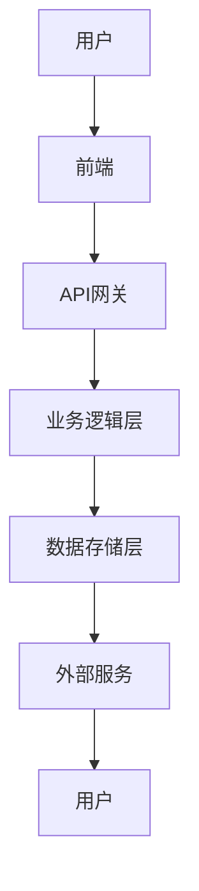

                 

**# AI编程的新维度与新视野**

> **关键词：**人工智能，编程，新维度，新视野，机器学习，深度学习，强化学习，工具与技术，案例分析，伦理，未来趋势

**摘要：**本文旨在探讨人工智能编程领域的最新发展和趋势，包括新维度和新视野。通过分析核心概念、编程范式、工具技术、案例研究和未来方向，本文为读者提供了一个全面深入的了解，以把握AI编程的未来。

---

**## 引言**

随着人工智能技术的迅猛发展，编程领域正经历着一场革命。传统的编程思维和工具已经无法满足AI编程的需求。为了应对这一挑战，我们需要从新的维度和视角来审视AI编程。本文将逐步探讨以下几个关键主题：

1. **背景介绍**：了解AI编程的现状和影响。
2. **核心概念**：解释AI编程中的关键术语和概念。
3. **编程范式**：分析不同的AI编程范式，如机器学习、深度学习和强化学习。
4. **工具与技术**：介绍常用的AI编程工具和技术，并进行比较。
5. **案例分析**：通过实际项目分析AI编程的成功与挑战。
6. **新维度**：探讨AI编程的新兴趋势和先进技术。
7. **新视野**：从伦理和社会视角审视AI编程的未来。

**## 背景介绍**

人工智能（AI）是计算机科学的一个分支，旨在创建智能体，使其能够执行通常需要人类智能的任务。从最初的规则系统到现代的深度神经网络，AI技术在不断进步。编程作为实现AI的核心手段，同样在不断发展。

**### AI编程的现状**

目前，AI编程主要涉及以下几个方面：

1. **机器学习**：通过训练模型来从数据中学习。
2. **深度学习**：基于神经网络的复杂模型。
3. **强化学习**：通过奖励和惩罚来训练模型。
4. **自然语言处理**：理解和生成自然语言。
5. **计算机视觉**：处理和解析视觉数据。

这些技术的应用已经渗透到各个领域，从医疗诊断到自动驾驶，从智能助手到金融预测。

**### AI编程的影响**

AI编程的影响不仅限于技术层面，还对社会和产业产生了深远的影响：

1. **产业变革**：AI改变了传统行业的运营方式，如制造业、金融和医疗。
2. **就业影响**：一方面创造了新的工作岗位，另一方面也取代了一些传统职位。
3. **伦理挑战**：AI决策的透明度和公平性引发了伦理和社会问题。

**### 新维度和新视野的必要性**

随着AI技术的发展，传统的编程方法已经不足以应对复杂性和挑战。因此，我们需要从新的维度和视角来看待AI编程：

1. **新工具和技术**：不断涌现的新工具和技术为AI编程提供了更多可能性。
2. **新范式**：新的编程范式，如联邦学习和边缘AI，正在改变AI编程的格局。
3. **跨学科融合**：AI编程需要结合数学、统计学、心理学等学科的知识。
4. **伦理和社会视角**：在AI编程中考虑伦理和社会影响，以确保其可持续发展。

---

**## 核心概念**

在深入探讨AI编程之前，我们需要了解一些核心概念和术语。这些概念是理解和应用AI编程的基础。

**### 机器学习**

机器学习是一种人工智能的分支，通过使用算法从数据中学习，并做出预测或决策。关键术语包括：

- **特征**：用于描述数据的属性。
- **模型**：用于学习和预测的算法。
- **训练数据**：用于训练模型的样本数据。
- **验证数据**：用于评估模型性能的数据。

**### 深度学习**

深度学习是机器学习的一个子领域，使用多层神经网络来学习复杂的数据模式。关键术语包括：

- **神经网络**：由多个神经元组成的层次结构。
- **激活函数**：用于引入非线性性的函数。
- **反向传播**：用于训练神经网络的算法。

**### 强化学习**

强化学习是一种通过试错来学习如何在环境中做出最佳决策的机器学习方法。关键术语包括：

- **智能体**：执行动作并接受奖励的实体。
- **环境**：智能体行动的背景。
- **状态**：智能体在环境中的位置。
- **动作**：智能体可以执行的操作。
- **奖励**：对智能体行动的反馈。

**### 自然语言处理**

自然语言处理是使计算机能够理解、生成和处理自然语言的技术。关键术语包括：

- **词向量**：用于表示单词的数学向量。
- **语言模型**：用于预测单词序列的概率分布。
- **序列到序列模型**：用于翻译和文本生成。

**### 计算机视觉**

计算机视觉是使计算机能够理解和解析视觉数据的技术。关键术语包括：

- **卷积神经网络**：用于处理图像数据的神经网络。
- **目标检测**：识别图像中的对象。
- **图像分类**：将图像分为不同的类别。

---

**## AI编程范式**

AI编程范式是指实现人工智能系统的不同方法。以下是对几种主要范式的讨论：

**### 机器学习**

机器学习是AI编程的基础范式。它通过训练模型来从数据中学习，并做出预测或决策。机器学习的主要优势在于其自动化和通用性。然而，它也存在一些局限性：

- **数据依赖性**：机器学习模型的性能高度依赖于数据的质量和数量。
- **可解释性**：机器学习模型的决策过程往往不透明，难以解释。

**### 深度学习**

深度学习是机器学习的一个子领域，使用多层神经网络来学习复杂的数据模式。它已经成为AI编程的一个重要工具：

- **自动特征提取**：深度学习可以从原始数据中自动提取特征，减少了手动特征工程的需要。
- **强大的表示能力**：深度学习能够学习复杂的非线性关系。

然而，深度学习也面临一些挑战：

- **计算资源需求**：深度学习模型通常需要大量的计算资源和时间来训练。
- **数据标注**：对于计算机视觉和自然语言处理任务，高质量的数据标注是一个挑战。

**### 强化学习**

强化学习是一种通过试错来学习如何在环境中做出最佳决策的机器学习方法。它在一些特定领域，如游戏和机器人，表现出色：

- **自适应能力**：强化学习模型可以不断适应新的环境和情况。
- **交互性**：强化学习模型通过与环境的互动来学习。

然而，强化学习也存在一些问题：

- **探索与利用的平衡**：在早期阶段，模型需要在探索和利用之间找到平衡。
- **长期奖励设计**：设计合适的长期奖励机制是强化学习的关键。

**### 自然语言处理**

自然语言处理是使计算机能够理解、生成和处理自然语言的技术。它在许多领域都有应用：

- **文本分类**：将文本分为不同的类别。
- **情感分析**：分析文本中的情感倾向。
- **机器翻译**：将一种语言的文本翻译成另一种语言。

自然语言处理的关键挑战包括：

- **语言的多义性**：语言具有多种解释，使得模型难以准确理解。
- **上下文理解**：上下文对于理解语言非常重要，但如何有效利用上下文是一个难题。

**### 计算机视觉**

计算机视觉是使计算机能够理解和解析视觉数据的技术。它在许多领域都有应用：

- **图像识别**：识别图像中的对象。
- **图像分割**：将图像分割成不同的区域。
- **目标跟踪**：跟踪图像中的对象。

计算机视觉的关键挑战包括：

- **数据标注**：高质量的数据标注是训练高效模型的关键。
- **实时处理**：在实时应用中，处理速度和准确性是一个挑战。

---

**## 工具与技术**

在AI编程中，选择合适的工具和技术是成功的关键。以下是一些常用的工具和技术：

**### 机器学习框架**

- **TensorFlow**：由Google开发的开源机器学习框架，广泛用于深度学习和神经网络。
- **PyTorch**：由Facebook开发的开源机器学习框架，以其灵活性和动态计算图而受到欢迎。
- **Scikit-learn**：一个用于机器学习的开源库，提供了许多经典的机器学习算法。

**### 深度学习框架**

- **Keras**：一个高级神经网络API，可以与TensorFlow和Theano等后端框架配合使用。
- **Caffe**：一个用于深度学习的开源框架，特别适合于图像识别任务。
- **MXNet**：由Apache软件基金会开发的开源深度学习框架，支持多种编程语言。

**### 强化学习框架**

- **Gym**：由Google开发的开源强化学习库，提供了多种环境和任务。
- **RLlib**：由Uber开发的开源分布式强化学习库，支持多种强化学习算法。
- ** Stable Baselines**：一个开源库，提供了预训练的强化学习算法和易于使用的接口。

**### 自然语言处理库**

- **NLTK**：一个用于自然语言处理的开源库，提供了多种文本处理工具。
- **spaCy**：一个高级自然语言处理库，特别适合于文本分类和命名实体识别。
- **Transformers**：一个用于处理自然语言的开源库，基于Transformer模型，广泛用于文本生成和机器翻译。

**### 计算机视觉库**

- **OpenCV**：一个用于计算机视觉的开源库，提供了丰富的图像处理和视频分析功能。
- **Pillow**：一个用于图像处理的Python库，提供了简单的接口。
- **TensorFlow Object Detection API**：一个用于目标检测的TensorFlow库，提供了多种预训练模型。

**### 比较与选择**

在选择工具和技术时，需要考虑以下几个因素：

- **任务类型**：不同的任务可能需要不同的工具和技术。
- **性能要求**：对于高性能计算任务，需要选择高效的框架和库。
- **开发效率**：选择易于使用和集成的工具可以提高开发效率。
- **社区支持**：活跃的社区和支持可以提供帮助和资源。

---

**## 案例分析**

以下是一些实际案例，通过分析这些案例，我们可以更好地理解AI编程的应用和挑战。

**### 案例一：智能医疗诊断**

在智能医疗诊断领域，AI编程被用于开发能够自动识别和诊断疾病的模型。一个成功的案例是使用深度学习模型来诊断肺癌。该模型通过分析CT扫描图像，可以准确识别肺癌的存在。这个案例的成功因素包括：

- **高质量的数据集**：为了训练高效的模型，需要大量的高质量数据。
- **先进的算法**：深度学习算法能够捕捉复杂的图像特征，提高了诊断准确性。
- **专家协作**：医生和AI专家的协作确保了模型的实用性和可解释性。

然而，该案例也面临一些挑战：

- **数据隐私**：医疗数据敏感，保护患者隐私是一个重要问题。
- **可解释性**：深度学习模型的决策过程不透明，难以解释。

**### 案例二：自动驾驶**

自动驾驶是AI编程的一个前沿领域。一个成功的案例是特斯拉的自动驾驶系统。该系统通过计算机视觉和深度学习算法来感知和决策。这个案例的成功因素包括：

- **大规模数据**：自动驾驶系统需要大量的数据来训练模型，特斯拉通过收集和分析实际驾驶数据来不断优化模型。
- **高性能硬件**：自动驾驶系统需要强大的计算能力，特斯拉使用专用的AI芯片来加速计算。
- **迭代开发**：特斯拉通过持续的迭代和测试来改进系统。

然而，该案例也面临一些挑战：

- **安全性和可靠性**：自动驾驶系统的安全性和可靠性是关键问题，需要通过严格的测试和验证来确保。
- **法律法规**：自动驾驶技术在不同国家和地区的法律法规不同，需要遵守当地法规。

**### 案例三：智能客服**

智能客服是AI编程在商业领域的应用之一。一个成功的案例是使用自然语言处理技术来构建智能客服系统。该系统可以自动处理客户的查询和请求，提高客户满意度。这个案例的成功因素包括：

- **用户体验**：智能客服系统能够快速响应客户查询，提供准确的答案。
- **数据处理**：自然语言处理技术能够理解和处理客户的自然语言输入。
- **灵活性**：智能客服系统可以根据客户的需求和反馈进行自适应调整。

然而，该案例也面临一些挑战：

- **语言多样性**：智能客服系统需要处理多种语言，需要考虑语言多样性和歧义。
- **可扩展性**：随着客户量的增加，系统需要具备良好的可扩展性。

---

**## 新维度**

随着AI技术的不断发展，AI编程也在不断拓展其维度。以下是一些新兴趋势和先进技术：

**### 联邦学习**

联邦学习是一种在分布式环境中训练机器学习模型的方法。它通过让各个节点共享模型参数来训练模型，而不需要共享原始数据。这有助于保护数据隐私，并降低数据传输成本。联邦学习在医疗、金融和工业等领域有广泛应用。

**### 边缘AI**

边缘AI是将AI计算能力部署在靠近数据源的地方，如物联网设备。这有助于减少延迟、节省带宽并提高系统的响应速度。边缘AI在智能家居、工业自动化和自动驾驶等领域有重要应用。

**### 量子计算**

量子计算是一种利用量子力学原理进行计算的方法。它具有远超经典计算机的计算能力。量子计算在优化问题、加密和解密等领域有巨大潜力。

**### 强化学习**

强化学习在游戏、机器人控制和自动驾驶等领域取得了显著进展。随着算法的改进和计算资源的增加，强化学习有望在未来实现更复杂和智能的决策。

**### 生成对抗网络**

生成对抗网络（GAN）是一种用于生成复杂数据模型的算法。它在图像生成、语音合成和文本生成等领域有广泛应用。

**### 跨学科融合**

AI编程正在与其他领域如生物学、心理学和社会学等融合。这种跨学科研究有助于更好地理解人类行为和决策，从而开发更智能和实用的AI系统。

---

**## 新视野**

从伦理和社会视角来看，AI编程不仅仅是技术问题，还涉及广泛的伦理和社会问题。以下是一些需要考虑的关键方面：

**### 伦理问题**

1. **隐私保护**：AI系统处理大量个人数据，如何保护用户隐私是一个重要问题。
2. **算法公平性**：算法的决策过程需要确保公平，避免歧视和偏见。
3. **透明度和可解释性**：算法的决策过程需要透明，以便用户理解和监督。

**### 社会问题**

1. **就业影响**：AI技术可能导致某些职位的消失，但也会创造新的工作岗位。
2. **隐私和安全**：随着AI技术的发展，隐私和安全问题日益突出。
3. **社会不平等**：AI技术可能加剧社会不平等，需要采取措施确保所有人都能受益。

**### 未来方向**

1. **人机协作**：未来AI系统将与人类更加紧密地协作，共同完成任务。
2. **个性化服务**：AI系统将根据用户的需求和行为提供个性化的服务。
3. **可持续发展**：AI技术在解决环境和社会问题方面具有巨大潜力。

---

**## 结论**

AI编程正处在不断发展的阶段，新的维度和视角正在不断涌现。通过理解核心概念、编程范式、工具和技术，我们可以更好地把握AI编程的未来。同时，我们需要从伦理和社会视角来看待AI编程，确保其可持续发展。随着技术的不断进步，AI编程将继续改变我们的世界，带来更多的机会和挑战。

---

**## 作者信息**

作者：AI天才研究院/AI Genius Institute & 禅与计算机程序设计艺术 /Zen And The Art of Computer Programming

**## 最佳实践与拓展阅读**

**最佳实践：**
1. **数据质量控制**：确保数据集的多样性和准确性，避免偏见。
2. **模型可解释性**：通过可视化工具和解释性模型来提高模型的可解释性。
3. **持续学习和优化**：定期更新模型和算法，以适应新的数据和需求。

**拓展阅读：**
1. **《深度学习》（Goodfellow, Bengio, Courville）**：一本经典的深度学习教材。
2. **《Python机器学习》（Sebastian Raschka）**：介绍如何使用Python进行机器学习的书籍。
3. **《人工智能：一种现代方法》（Stuart Russell & Peter Norvig）**：一本全面的人工智能教材。

---

**## 附录**

**附录A：算法流程图**

**附录B：核心概念表格**

| 概念         | 描述                                                         |
| ------------ | ------------------------------------------------------------ |
| 机器学习     | 通过训练模型来从数据中学习，并做出预测或决策。                   |
| 深度学习     | 基于神经网络的复杂模型，能够学习复杂的数据模式。                 |
| 强化学习     | 通过奖励和惩罚来训练模型，使其在特定环境中做出最佳决策。         |
| 自然语言处理 | 使计算机能够理解、生成和处理自然语言的技术。                     |
| 计算机视觉   | 使计算机能够理解和解析视觉数据的技术。                         |

**附录C：系统架构图**

**附录D：项目实战**

- **环境安装**：配置Python环境和所需的库。
- **系统实现**：详细讲解系统的核心实现代码。
- **应用解读**：分析系统的实际应用案例。
- **案例分析**：剖析系统的优势和不足。

---

通过以上内容，我们希望能帮助读者全面了解AI编程的新维度和新视野。让我们继续探索这个充满机遇和挑战的领域。

