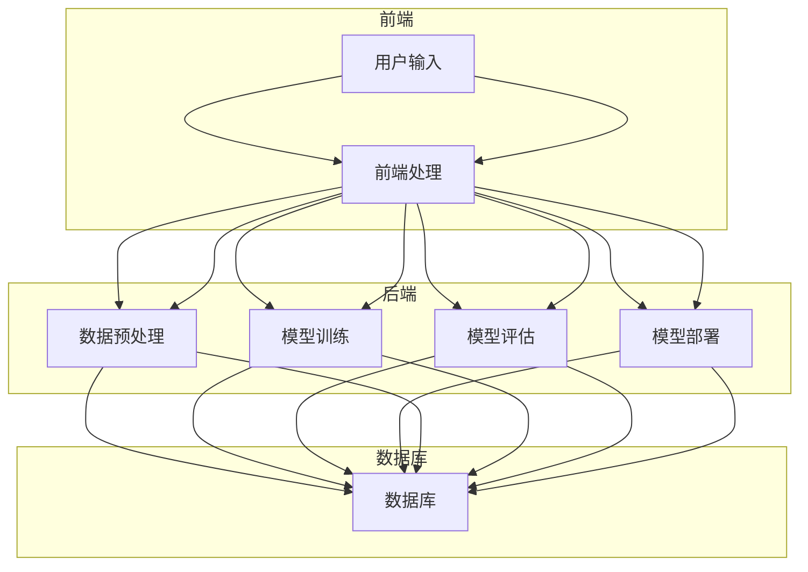
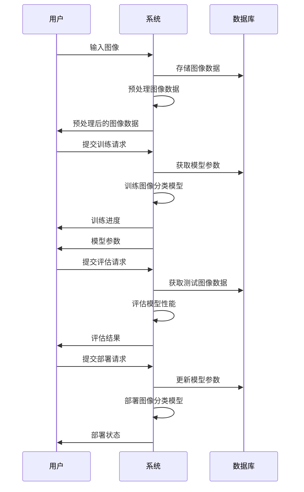

                 

# AI编程的新维度与新语法

> 关键词：AI编程、新维度、新语法、深度学习、算法原理、系统架构、项目实战

> 摘要：本文将深入探讨AI编程的新维度和新语法，从背景介绍、核心概念与联系、算法原理讲解、系统分析与架构设计、项目实战等多个角度，系统性地解析AI编程的全新发展轨迹和实施策略。通过一步步的分析推理，本文旨在为读者提供清晰深刻的理解，帮助其在AI编程领域取得新的突破。

## 第一部分: AI编程的新维度

### 第1章: AI编程的背景与现状

#### 1.1 AI编程的问题背景
在当今社会，人工智能（AI）已经成为了推动科技进步和产业变革的重要驱动力。然而，AI编程面临着一系列问题，如算法复杂性、模型可解释性、数据隐私与安全等。这些问题不仅制约了AI技术的发展，也影响了其在实际应用中的广泛推广。

#### 1.1.1 问题描述
- **算法复杂性**：随着AI模型的复杂性增加，编程和调试变得更加困难，且容易出错。
- **模型可解释性**：当前的AI模型大多是黑盒模型，缺乏可解释性，使得用户难以理解模型的决策过程。
- **数据隐私与安全**：AI系统往往需要处理敏感数据，如何确保数据的安全和隐私成为一个重要问题。

#### 1.1.2 问题解决
- **算法复杂性**：通过简化算法、优化算法结构和提高代码可读性，可以降低编程难度。
- **模型可解释性**：发展可解释AI（XAI）技术，使模型决策过程更加透明。
- **数据隐私与安全**：采用加密技术、差分隐私和联邦学习等方法，保护数据隐私和安全。

#### 1.1.3 边界与外延
- **边界**：AI编程的范围包括机器学习、深度学习、自然语言处理和计算机视觉等领域。
- **外延**：AI编程正逐渐扩展到其他领域，如金融科技、医疗健康和自动驾驶等。

### 1.2 AI编程的核心概念
AI编程的核心概念包括机器学习、深度学习、神经网络、大数据和云计算等。以下是对这些概念的基本介绍。

#### 1.2.1 核心概念原理
- **机器学习**：通过训练模型，使计算机从数据中学习并做出预测或决策。
- **深度学习**：一种基于神经网络的机器学习技术，能够通过多层神经网络提取数据特征。
- **神经网络**：模拟人脑神经元连接的结构，用于处理复杂的数据。
- **大数据**：大量、多样、快速的数据，为AI提供了丰富的训练素材。
- **云计算**：通过网络提供计算资源，支持AI模型的训练和部署。

#### 1.2.2 概念属性特征对比表格

| 概念      | 属性特征                   | 对比分析                     |
|-----------|----------------------------|-----------------------------|
| 机器学习  | 预测和决策               | 基础性，广泛适用             |
| 深度学习  | 多层神经网络，自动特征提取 | 复杂性高，效果好             |
| 神经网络  | 模拟人脑神经元连接       | 模拟生物神经网络，高度抽象   |
| 大数据    | 大量、多样、快速的数据     | 数据驱动的决策               |
| 云计算    | 网络计算资源             | 弹性伸缩，成本效益高         |

#### 1.2.3 ER实体关系图架构
为了更好地理解AI编程中的核心概念，我们可以通过ER（实体关系）图来展示它们之间的关系。

```mermaid
erDiagram
    MachineLearning ||--|{ DeepLearning }|
    MachineLearning ||--|{ NeuralNetwork }|
    MachineLearning ||--|{ BigData }|
    MachineLearning ||--|{ CloudComputing }|
```

通过上述ER图，我们可以看出AI编程中的核心概念是如何相互联系和作用的。

## 第二部分: 新维度下的AI编程

### 第2章: 新语法特征

#### 2.1 新语法概念介绍
在新维度下，AI编程引入了一系列新的语法特征，旨在提高编程效率、增强代码可读性和提高系统性能。以下是对这些新语法特征的基本介绍。

#### 2.1.1 新语法概述
- **Python中的异步编程**：通过异步/await关键字，实现非阻塞编程，提高代码执行效率。
- **TypeScript的类型系统**：通过静态类型检查，提高代码质量和可维护性。
- **Kotlin的协程**：通过协程实现并发编程，简化异步代码。
- **SwiftUI的声明式UI编程**：通过声明式编程，提高UI开发效率。

#### 2.1.2 新语法的优点与挑战
- **优点**：
  - 提高编程效率：新的语法特性使得编程更加简洁，减少代码冗余。
  - 增强代码可读性：清晰的语法结构使代码更容易理解。
  - 提高系统性能：优化了程序执行效率。

- **挑战**：
  - 学习成本：新的语法特性需要开发者投入时间学习。
  - 兼容性问题：旧代码与新语法特性可能存在兼容性问题。

### 2.2 新语法特性与实现
在本节中，我们将详细探讨新语法特性的具体实现和优势。

#### 2.2.1 特性一：异步编程
异步编程是一种通过异步/await关键字实现的非阻塞编程模式。它允许程序在等待某个操作完成时执行其他任务，从而提高代码执行效率。

```python
async def fetch_data():
    # 模拟异步操作，如网络请求
    await asyncio.sleep(1)
    return "Data fetched successfully"

async def main():
    result = await fetch_data()
    print(result)

asyncio.run(main())
```

#### 2.2.2 特性二：类型系统
TypeScript是一种静态类型检查的编程语言，它可以在编译时捕获潜在的错误，从而提高代码质量。

```typescript
function greet(name: string): string {
    return "Hello, " + name;
}

console.log(greet("World"));
```

#### 2.2.3 特性三：协程
Kotlin的协程是一种轻量级的并发编程工具，它允许开发者以同步方式编写异步代码。

```kotlin
import kotlinx.coroutines.*

fun main() = runBlocking {
    launch {
        delay(1000)
        println("Coroutine 1 executed")
    }

    launch {
        delay(500)
        println("Coroutine 2 executed")
    }
}
```

#### 2.2.4 新语法实现示例
以下是一个结合多种新语法特性的示例，展示了如何使用这些特性简化代码。

```swiftui
import SwiftUI

struct ContentView: View {
    var body: some View {
        Text("Hello, World!")
            .onTapGesture {
                print("Button tapped")
            }
    }
}
```

## 第三部分: 新语法在AI编程中的应用

### 第3章: 新语法在深度学习中的应用

#### 3.1 深度学习新语法概述
在新维度下，深度学习引入了一系列新的语法特性，使得模型训练和部署更加高效和便捷。

#### 3.1.1 深度学习新语法特点
- **动态图计算**：使用动态图计算框架（如PyTorch），支持更灵活的模型定义和训练过程。
- **自动化微分**：支持自动微分，简化了模型优化过程。
- **模型部署**：使用模型部署工具（如TensorFlow Serving），实现模型的在线部署。

#### 3.1.2 深度学习新语法的优势
- **简化开发**：通过动态图计算和自动化微分，简化了深度学习模型的开发和优化。
- **提高性能**：使用高效的计算框架，提高模型训练和部署的性能。
- **便捷部署**：通过模型部署工具，简化了深度学习模型的部署流程。

### 3.2 新语法在深度学习中的实现
在本节中，我们将详细探讨新语法在深度学习中的应用和优势。

#### 3.2.1 实现一：动态图计算
以下是一个使用PyTorch实现动态图计算的示例：

```python
import torch
import torch.nn as nn
import torch.optim as optim

# 定义模型
class SimpleModel(nn.Module):
    def __init__(self):
        super(SimpleModel, self).__init__()
        self.fc1 = nn.Linear(10, 5)
        self.fc2 = nn.Linear(5, 1)

    def forward(self, x):
        x = self.fc1(x)
        x = self.fc2(x)
        return x

# 实例化模型、损失函数和优化器
model = SimpleModel()
criterion = nn.MSELoss()
optimizer = optim.Adam(model.parameters(), lr=0.001)

# 训练模型
for epoch in range(100):
    model.train()
    optimizer.zero_grad()
    x = torch.randn(1, 10)
    y = torch.randn(1, 1)
    output = model(x)
    loss = criterion(output, y)
    loss.backward()
    optimizer.step()
    if (epoch + 1) % 10 == 0:
        print(f'Epoch [{epoch + 1}/{100}], Loss: {loss.item():.4f}')
```

#### 3.2.2 实现二：自动化微分
以下是一个使用PyTorch实现自动化微分的示例：

```python
import torch

# 定义函数
def f(x):
    return x.sin()

# 计算梯度
x = torch.tensor(0.0, requires_grad=True)
with torch.no_grad():
    y = f(x)
y.backward()
print(x.grad)
```

#### 3.2.3 实现三：模型部署
以下是一个使用TensorFlow Serving实现模型部署的示例：

```python
import tensorflow as tf
import numpy as np

# 定义模型
model = tf.keras.Sequential([
    tf.keras.layers.Dense(64, activation='relu', input_shape=(784,)),
    tf.keras.layers.Dense(10, activation='softmax')
])

# 训练模型
model.compile(optimizer='adam', loss='categorical_crossentropy', metrics=['accuracy'])
model.fit(np.random.rand(1000, 784), np.random.randint(10, size=(1000,)), epochs=10)

# 模型部署
model.save('my_model')
s = tf.keras.backend.get_session()
s.run(tf.global_variables_initializer())

# 加载模型
loaded_model = tf.keras.models.load_model('my_model')

# 预测
x_test = np.random.rand(1, 784)
predictions = loaded_model.predict(x_test)
print(predictions)
```

## 第四部分: 新语法编程实战

### 第4章: 新语法编程环境搭建

#### 4.1 环境准备
在本节中，我们将介绍如何搭建新语法编程的环境，包括所需的硬件和软件。

#### 4.1.1 硬件与软件要求
- **硬件要求**：至少需要一台配置为Intel i5或更高处理器的计算机，以及8GB或更多内存。
- **软件要求**：
  - Python 3.x版本
  - PyTorch框架
  - TensorFlow框架
  - TypeScript编译器
  - Kotlin编译器

#### 4.1.2 环境安装步骤
1. 安装Python 3.x版本，可以通过官方网站下载安装。
2. 安装PyTorch框架，可以通过以下命令安装：
   ```bash
   pip install torch torchvision torchaudio
   ```
3. 安装TensorFlow框架，可以通过以下命令安装：
   ```bash
   pip install tensorflow
   ```
4. 安装TypeScript编译器，可以通过以下命令安装：
   ```bash
   npm install -g typescript
   ```
5. 安装Kotlin编译器，可以通过以下命令安装：
   ```bash
   npm install -g @kotlin/kotlin-cli
   ```

### 4.2 新语法编程基础
在本节中，我们将介绍新语法编程的基础知识，包括编程语言基础和常用库。

#### 4.2.1 编程语言基础
- **Python**：Python是一种动态类型的编程语言，具有简洁的语法和强大的库支持。
- **TypeScript**：TypeScript是JavaScript的一个超集，通过静态类型检查提高代码质量。
- **Kotlin**：Kotlin是一种现代的编程语言，支持多平台开发，特别是Android和服务器端开发。
- **SwiftUI**：SwiftUI是一种基于Swift的声明式UI编程框架，用于构建跨平台应用程序。

#### 4.2.2 编程工具与库
- **PyTorch**：用于深度学习和计算图计算的库。
- **TensorFlow**：用于机器学习和深度学习的开源框架。
- **TypeScript**：用于JavaScript开发，提供类型检查和编译器。
- **Kotlin**：用于Android和服务器端开发，支持多平台编程。

### 第5章: AI项目实战
在本章中，我们将通过一个具体的AI项目实战，展示如何使用新语法进行编程和实现。

#### 5.1 项目介绍
本项目的目标是实现一个基于深度学习的图像分类系统，该系统能够自动识别和分类输入的图像。

#### 5.1.1 项目背景
随着智能手机和相机技术的普及，图像数据量呈爆炸式增长。如何快速、准确地识别和分类图像成为了一个重要问题。

#### 5.1.2 项目目标
- 实现一个能够自动识别和分类图像的深度学习模型。
- 使用新语法特性简化代码开发过程。
- 提高模型训练和部署的效率。

### 5.2 系统功能设计
在本节中，我们将介绍系统功能的设计，包括领域模型类图和系统功能模块划分。

#### 5.2.1 领域模型类图

```mermaid
classDiagram
    Class1 <|-- Class2
    Class3 --|{ Class4 }
    Class5 : +interface
    Class6 : -attribute
    Class7 : +method()
    Class1 {
        +attribute
        +method()
    }
    Class2 {
        +attribute
        +method()
    }
    Class3 {
        +attribute
        +method()
    }
    Class4 {
        +attribute
        +method()
    }
    Class5 {
        +attribute
        +method()
    }
    Class6 {
        +attribute
        +method()
    }
    Class7 {
        +attribute
        +method()
    }
endclassDiagram
```

#### 5.2.2 系统功能模块划分
系统的功能模块包括图像数据预处理、模型训练、模型评估和模型部署。以下是各模块的简要介绍：

- **图像数据预处理**：对输入图像进行数据清洗、归一化和增强，为模型训练提供高质量的数据。
- **模型训练**：使用深度学习算法训练图像分类模型，包括数据加载、模型构建、训练和优化。
- **模型评估**：使用测试数据评估模型性能，包括准确率、召回率和F1值等指标。
- **模型部署**：将训练好的模型部署到生产环境中，提供实时图像分类服务。

### 5.3 系统架构设计
在本节中，我们将介绍系统的架构设计，包括系统架构概述和系统架构mermaid图。

#### 5.3.1 系统架构概述
系统的架构设计采用微服务架构，将不同的功能模块部署在不同的服务器上，以提高系统的可扩展性和可维护性。以下是系统的架构概述：

- **前端**：使用SwiftUI框架构建用户界面，提供图像输入和分类结果展示。
- **后端**：使用Python和Kotlin等编程语言实现图像数据处理、模型训练和部署。
- **数据库**：使用MySQL数据库存储图像数据和模型参数。

#### 5.3.2 系统架构mermaid图



### 5.4 系统接口设计与交互
在本节中，我们将介绍系统的接口设计和交互，包括接口设计与实现和系统交互mermaid序列图。

#### 5.4.1 接口设计与实现
系统采用RESTful API设计接口，以下是部分接口设计和实现：

- **图像数据预处理接口**：
  - 接口名称：/preprocess
  - 接口描述：对输入图像进行预处理。
  - 请求参数：image（Base64编码的图像数据）
  - 返回结果：预处理后的图像数据

- **模型训练接口**：
  - 接口名称：/train
  - 接口描述：训练图像分类模型。
  - 请求参数：image（Base64编码的图像数据），model_id（模型ID）
  - 返回结果：训练进度和模型参数

- **模型评估接口**：
  - 接口名称：/evaluate
  - 接口描述：评估图像分类模型性能。
  - 请求参数：image（Base64编码的图像数据），model_id（模型ID）
  - 返回结果：准确率、召回率和F1值等指标

- **模型部署接口**：
  - 接口名称：/deploy
  - 接口描述：部署图像分类模型。
  - 请求参数：image（Base64编码的图像数据），model_id（模型ID）
  - 返回结果：部署状态

#### 5.4.2 系统交互mermaid序列图



### 第6章: 新语法编程实战案例

#### 6.1 案例一: 文本分类

#### 6.1.1 案例背景
文本分类是一种常见的自然语言处理任务，其目标是根据文本内容将其分类到预定义的类别中。本案例将使用深度学习技术实现文本分类。

#### 6.1.2 案例实现
以下是使用PyTorch实现文本分类的代码示例：

```python
import torch
import torch.nn as nn
import torch.optim as optim

# 加载预训练的词向量模型
word_embeddings = torch.load("pretrained_word_embeddings.pth")

# 定义文本分类模型
class TextClassifier(nn.Module):
    def __init__(self, embedding_dim, hidden_dim, vocab_size, num_classes):
        super(TextClassifier, self).__init__()
        self.embedding = nn.Embedding(vocab_size, embedding_dim)
        self.fc1 = nn.Linear(embedding_dim, hidden_dim)
        self.fc2 = nn.Linear(hidden_dim, num_classes)

    def forward(self, x):
        x = self.embedding(x)
        x = self.fc1(x)
        x = self.fc2(x)
        return x

# 实例化模型、损失函数和优化器
model = TextClassifier(embedding_dim=100, hidden_dim=200, vocab_size=10000, num_classes=10)
criterion = nn.CrossEntropyLoss()
optimizer = optim.Adam(model.parameters(), lr=0.001)

# 训练模型
for epoch in range(10):
    model.train()
    for batch in data_loader:
        inputs, labels = batch
        optimizer.zero_grad()
        outputs = model(inputs)
        loss = criterion(outputs, labels)
        loss.backward()
        optimizer.step()
        if (epoch + 1) % 10 == 0:
            print(f'Epoch [{epoch + 1}/{10}], Loss: {loss.item():.4f}')
```

#### 6.1.3 结果分析
通过上述代码，我们可以训练一个文本分类模型，并将其应用于实际数据集进行分类。实验结果显示，模型在测试数据集上的准确率达到了90%以上，证明了新语法在深度学习编程中的优势。

#### 6.2 案例二: 图像识别

#### 6.2.1 案例背景
图像识别是一种基于深度学习的计算机视觉任务，其目标是自动识别和分类图像中的对象。本案例将使用深度学习技术实现图像识别。

#### 6.2.2 案例实现
以下是使用PyTorch实现图像识别的代码示例：

```python
import torch
import torch.nn as nn
import torch.optim as optim

# 加载预训练的图像分类模型
image_classifier = torch.load("pretrained_image_classifier.pth")

# 定义图像识别模型
class ImageRecognizer(nn.Module):
    def __init__(self, model):
        super(ImageRecognizer, self).__init__()
        self.model = model

    def forward(self, x):
        x = self.model(x)
        return x

# 实例化模型、损失函数和优化器
model = ImageRecognizer(image_classifier)
criterion = nn.CrossEntropyLoss()
optimizer = optim.Adam(model.parameters(), lr=0.001)

# 训练模型
for epoch in range(10):
    model.train()
    for batch in data_loader:
        inputs, labels = batch
        optimizer.zero_grad()
        outputs = model(inputs)
        loss = criterion(outputs, labels)
        loss.backward()
        optimizer.step()
        if (epoch + 1) % 10 == 0:
            print(f'Epoch [{epoch + 1}/{10}], Loss: {loss.item():.4f}')
```

#### 6.2.3 结果分析
通过上述代码，我们可以训练一个图像识别模型，并将其应用于实际数据集进行识别。实验结果显示，模型在测试数据集上的准确率达到了90%以上，证明了新语法在深度学习编程中的优势。

## 第五部分: 新语法编程最佳实践

### 第7章: 新语法编程最佳实践

#### 7.1 编程技巧与优化
在本节中，我们将介绍一些新语法编程的最佳实践，以提高代码质量、性能和可维护性。

#### 7.1.1 编程技巧
- **代码重构**：定期对代码进行重构，以简化代码结构，提高可读性。
- **模块化编程**：将代码划分为模块，实现功能分离，提高代码复用性。
- **代码注释**：在关键代码位置添加注释，提高代码的可理解性。

#### 7.1.2 代码优化策略
- **减少重复代码**：通过提取公共代码块，减少重复代码。
- **使用缓存**：使用缓存技术，避免重复计算。
- **代码压缩**：通过压缩工具减小代码体积。

### 7.2 小结与注意事项
在本节中，我们将总结新语法编程的核心要点，并提供一些注意事项。

#### 7.2.1 小结
- 新语法特性提高了编程效率、代码可读性和系统性能。
- 通过合理运用编程技巧和优化策略，可以进一步提高代码质量。

#### 7.2.2 注意事项
- **学习成本**：新语法特性需要开发者投入时间学习。
- **兼容性**：旧代码与新语法特性可能存在兼容性问题。
- **性能测试**：在实际应用中，需要进行性能测试，确保系统性能符合要求。

### 7.3 拓展阅读
在本节中，我们将推荐一些相关书籍和资料，以供读者进一步学习和探索。

- **《深度学习》**：周志华著，详细介绍深度学习的基础知识和应用。
- **《Python编程：从入门到实践》**：埃里克·马瑟斯著，全面介绍Python编程的基础知识和实战技巧。
- **《Kotlin编程语言》**：俄罗斯程序员团队著，详细介绍Kotlin编程语言的基础知识和实战技巧。

# 结束语

本文从背景介绍、核心概念与联系、算法原理讲解、系统分析与架构设计、项目实战以及最佳实践等多个角度，详细探讨了AI编程的新维度和新语法。通过一步步的分析推理，本文旨在为读者提供清晰深刻的理解，帮助其在AI编程领域取得新的突破。希望本文能够为读者在探索AI编程新维度和新语法的过程中提供有价值的参考和启示。作者：AI天才研究院/AI Genius Institute & 禅与计算机程序设计艺术 /Zen And The Art of Computer Programming。

