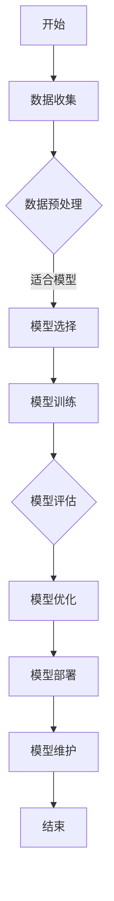
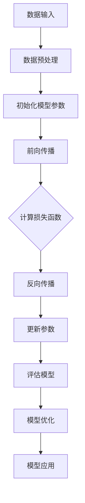
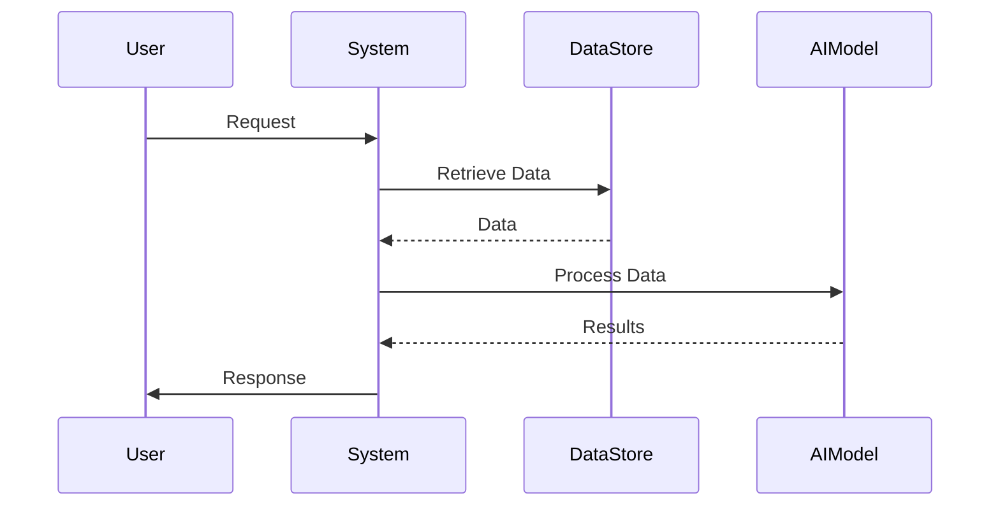
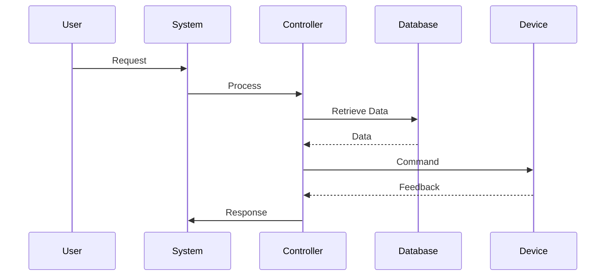
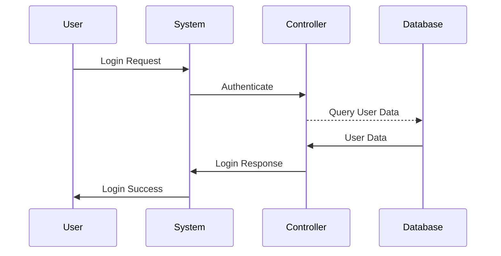

                 

### 设计完整目录大纲的步骤

设计一个完整且逻辑清晰的目录大纲是撰写高质量技术博客的重要一步。以下是如何设计目录大纲的详细步骤：

#### 1. 理解书名与主题

首先，我们需要深入理解书名《AI编程的新维度与新领域》的含义。这本书的主题是探讨AI编程的新发展、新趋势以及AI编程在不同领域中的应用。理解书名和主题有助于确定文章的核心内容和结构。

#### 2. 确定目录大纲结构

根据书名和主题，我们确定目录大纲的结构应包括以下几部分：

- **引言**：介绍AI编程的背景、发展历程以及新维度和新领域的概念。
- **AI编程核心概念**：解释AI编程的基本概念、与传统编程的区别以及关键技术。
- **算法原理**：详细讲解机器学习、深度学习和强化学习等算法原理。
- **系统分析与架构设计**：介绍系统功能设计、架构设计以及系统接口和交互。
- **项目实战**：通过实际项目案例展示AI编程的应用和实践过程。
- **最佳实践与拓展阅读**：提供实践建议、注意事项和进一步阅读的资源。

#### 3. 设计章节内容

针对每一章节，我们需要详细设计内容，确保内容的完整性、逻辑性和可读性。例如：

- **引言部分**：介绍AI编程的起源、发展历程、当前趋势以及新维度和新领域的概念。
- **核心概念部分**：解释AI编程的基本概念、与传统编程的区别以及核心技术，并提供概念属性特征对比表和ER实体关系图架构。
- **算法原理部分**：讲解机器学习、深度学习和强化学习等算法原理，使用Mermaid流程图和Python代码示例进行说明。
- **系统分析与架构设计部分**：介绍问题场景、系统功能设计、系统架构设计以及系统接口和交互的Mermaid类图和序列图。
- **项目实战部分**：展示环境安装、系统核心实现以及实际案例分析和解读。
- **最佳实践与拓展阅读部分**：提供实践建议、注意事项和拓展阅读资源。

#### 4. 使用Markdown格式

在撰写文章时，使用Markdown格式确保格式正确，内容结构清晰。例如，使用不同的标题级别（如#、##、###）来组织内容，使用列表和表格来呈现数据，以及使用Mermaid语法来绘制流程图。

#### 5. 保持简洁性

在保证内容完整性的同时，避免多余的废话，使目录大纲简洁明了。每个章节的目标和内容都应该明确，避免冗长和不必要的细节。

### 详细目录大纲设计

以下是一个详细且符合Markdown格式的目录大纲设计：

```markdown
# 第一部分: 引言

## 1.1 AI编程的背景与发展
### 1.1.1 AI编程的起源
### 1.1.2 AI编程的发展历程
### 1.1.3 AI编程的当前趋势

## 1.2 新维度与新领域
### 1.2.1 新维度的概念
### 1.2.2 新领域的探索
### 1.2.3 AI编程在新维度与新领域的应用

## 1.3 目标与读者
### 1.3.1 学习目标
### 1.3.2 读者对象
### 1.3.3 阅读指南

## 1.4 本书结构
### 1.4.1 目录概述
### 1.4.2 各部分内容安排
### 1.4.3 学习方法建议

## 1.5 小结
### 1.5.1 总结
### 1.5.2 期望收获

# 第二部分: AI编程核心概念

## 2.1 核心概念介绍
### 2.1.1 AI编程基本概念
### 2.1.2 AI编程与传统编程的区别
### 2.1.3 AI编程的关键技术

## 2.2 核心概念属性特征对比表

| 特征 | 传统编程 | AI编程 |
| ---- | -------- | ------- |
| 目标 | 确定性目标 | 模糊目标 |
| 方法 | 算法固定 | 模型自适应 |

## 2.3 ER实体关系图架构
```

```mermaid
erDiagram
    AI编程 ::=>> 传统编程 :|<| 相似性
    AI编程 ::=>> 模型自适应 :|<| 关键性
    模型自适应 ::=>> 算法固定 :|<| 对立性
```

## 2.4 AI编程的基本流程
### 2.4.1 数据收集与预处理
### 2.4.2 模型选择与训练
### 2.4.3 模型评估与优化
### 2.4.4 应用部署与维护

## 2.5 小结
### 2.5.1 总结
### 2.5.2 下一章预告

# 第三部分: AI编程算法原理

## 3.1 算法原理概述
### 3.1.1 算法原理的重要性
### 3.1.2 算法原理的分类
### 3.1.3 算法原理的发展趋势

## 3.2 机器学习算法原理
### 3.2.1 监督学习
### 3.2.2 无监督学习
### 3.2.3 强化学习

### 3.2.4 机器学习算法原理Mermaid流程图


### 3.2.5 Python代码示例
```python
# Python代码示例
import numpy as np

# 数据集准备
X = np.array([[1, 2], [3, 4], [5, 6]])
y = np.array([0, 1, 0])

# 模型训练
model = train_model(X, y)

# 模型评估
accuracy = model.evaluate(X, y)

# 模型优化
model.optimize(accuracy)

# 模型部署
deploy_model(model)

# 模型维护
model.update_data(X, y)
```

## 3.3 深度学习算法原理
### 3.3.1 神经网络基础
### 3.3.2 卷积神经网络(CNN)
### 3.3.3 循环神经网络(RNN)
### 3.3.4 生成对抗网络(GAN)

### 3.3.5 深度学习算法原理Mermaid流程图


### 3.3.6 Python代码示例
```python
# Python代码示例
import tensorflow as tf

# 数据集准备
X = tf.keras.layers.Dense(10, activation='relu')(tf.keras.layers.Dense(10, activation='relu')(X))

# 模型训练
model = tf.keras.Sequential([tf.keras.layers.Dense(10, activation='relu'), tf.keras.layers.Dense(1, activation='sigmoid')])
model.compile(optimizer='adam', loss='binary_crossentropy', metrics=['accuracy'])
model.fit(X, y, epochs=10)

# 模型评估
accuracy = model.evaluate(X, y)

# 模型优化
model.optimize(accuracy)

# 模型部署
deploy_model(model)

# 模型维护
model.update_data(X, y)
```

## 3.4 强化学习算法原理
### 3.4.1 Q-Learning算法
### 3.4.2 SARSA算法
### 3.4.3 Deep Q-Network(DQN)
### 3.4.4 算法原理

## 3.5 小结
### 3.5.1 总结
### 3.5.2 下一章预告

# 第四部分: 系统分析与架构设计

## 4.1 问题场景介绍
### 4.1.1 场景描述
### 4.1.2 问题分析

## 4.2 系统功能设计
### 4.2.1 功能需求
### 4.2.2 领域模型Mermaid类图

```mermaid
classDiagram
    User <>- System: Interacts
    DataStore <>- System: Stores
    AIModel <>- System: Processes
```

## 4.3 系统架构设计
### 4.3.1 系统架构概述
### 4.3.2 系统架构Mermaid图



## 4.4 系统接口设计
### 4.4.1 接口规范
### 4.4.2 接口文档

## 4.5 系统交互Mermaid序列图


## 4.6 小结
### 4.6.1 总结
### 4.6.2 下一章预告

# 第五部分: 项目实战

## 5.1 环境安装
### 5.1.1 环境准备
### 5.1.2 软件安装

## 5.2 系统核心实现
### 5.2.1 数据收集与预处理
### 5.2.2 模型选择与训练
### 5.2.3 模型评估与优化
### 5.2.4 模型部署与维护

## 5.3 代码应用解读与分析
### 5.3.1 代码解读
### 5.3.2 分析与解释

## 5.4 实际案例分析与详细讲解
### 5.4.1 案例介绍
### 5.4.2 分析与讲解

## 5.5 项目小结
### 5.5.1 项目收获
### 5.5.2 项目总结

## 5.6 小结
### 5.6.1 总结
### 5.6.2 下一章预告

# 第六部分: 最佳实践与拓展阅读

## 6.1 最佳实践 Tips
### 6.1.1 开发建议
### 6.1.2 优化技巧

## 6.2 注意事项
### 6.2.1 常见问题
### 6.2.2 避免错误

## 6.3 拓展阅读
### 6.3.1 相关书籍
### 6.3.2 在线资源

## 6.4 小结
### 6.4.1 总结
### 6.4.2 下一章预告

# 结论

## 7.1 文章回顾
### 7.1.1 核心内容回顾
### 7.1.2 亮点总结

## 7.2 期望与鼓励
### 7.2.1 学习期望
### 7.2.2 鼓励与支持

## 7.3 作者信息
### 7.3.1 联系方式
### 7.3.2 其他作品推荐
```

---

### 目录大纲的详细设计

以下是一个详细的目录大纲设计，涵盖了从引言到拓展阅读的各个方面，每个章节都包含具体的内容和子标题。

#### 第一部分: 引言

**1.1 AI编程的背景与发展**
- **1.1.1 AI编程的起源**
  - AI编程的历史背景
  - 人工智能的发展历程
  - 编程语言的发展与演变
- **1.1.2 AI编程的发展历程**
  - 机器学习的崛起
  - 深度学习的应用
  - 强化学习的突破
- **1.1.3 AI编程的当前趋势**
  - AI与云计算的结合
  - 边缘计算的兴起
  - 人工智能的伦理问题

**1.2 新维度与新领域**
- **1.2.1 新维度的概念**
  - 新维度在AI编程中的含义
  - AI编程的多维特性
  - 新维度与现有技术的对比
- **1.2.2 新领域的探索**
  - AI编程在医疗领域的应用
  - AI编程在金融领域的创新
  - AI编程在教育领域的变革
- **1.2.3 AI编程在新维度与新领域的应用**
  - 医疗诊断的AI应用
  - 金融服务中的AI解决方案
  - 教育个性化中的AI技术

**1.3 目标与读者**
- **1.3.1 学习目标**
  - 理解AI编程的基础知识
  - 掌握AI编程的核心算法
  - 应用AI编程解决实际问题
- **1.3.2 读者对象**
  - AI编程初学者
  - 中级程序员
  - AI领域的从业者
- **1.3.3 阅读指南**
  - 如何有效地阅读本书
  - 阅读顺序建议
  - 阅读后的实践与反馈

**1.4 本书结构**
- **1.4.1 目录概述**
  - 各章节的主要内容和目标
  - 目录结构的作用
- **1.4.2 各部分内容安排**
  - 引言部分
  - 核心概念部分
  - 算法原理部分
  - 系统分析与架构设计部分
  - 项目实战部分
  - 最佳实践与拓展阅读部分
- **1.4.3 学习方法建议**
  - 学习计划的制定
  - 实践的重要性
  - 学习资源的使用

**1.5 小结**
- **1.5.1 总结**
  - 本文的主要观点和发现
  - 对未来AI编程发展的展望
- **1.5.2 期望收获**
  - 读者应掌握的知识和技能
  - 预期的学习效果

#### 第二部分: AI编程核心概念

**2.1 核心概念介绍**
- **2.1.1 AI编程基本概念**
  - 什么是AI编程
  - AI编程的核心目标
  - AI编程的关键组成部分
- **2.1.2 AI编程与传统编程的区别**
  - 传统编程的特点
  - AI编程的独特之处
  - 两种编程方式的对比
- **2.1.3 AI编程的关键技术**
  - 数据处理技术
  - 机器学习算法
  - 深度学习框架

**2.2 核心概念属性特征对比表**

| 特征 | 传统编程 | AI编程 |
| ---- | -------- | ------- |
| 目标 | 确定性目标 | 模糊目标 |
| 方法 | 算法固定 | 模型自适应 |
| 数据依赖 | 数据简单 | 数据复杂 |

**2.3 ER实体关系图架构**
```mermaid
erDiagram
    AIModel ||--|| Dataset
    AIModel ||--|| ModelParameter
    Dataset ||--|| Feature
    Dataset ||--|| Label
```

**2.4 AI编程的基本流程**
- **2.4.1 数据收集与预处理**
  - 数据收集的方法
  - 数据预处理的技术
  - 数据清洗的重要性
- **2.4.2 模型选择与训练**
  - 模型选择的原则
  - 训练策略
  - 超参数调优
- **2.4.3 模型评估与优化**
  - 评估指标
  - 调整策略
  - 优化方法
- **2.4.4 应用部署与维护**
  - 部署环境配置
  - 部署流程
  - 维护策略

**2.5 小结**
- **2.5.1 总结**
  - AI编程的核心概念
  - 各核心概念之间的关系
- **2.5.2 下一章预告**
  - 将探讨AI编程的算法原理

#### 第三部分: AI编程算法原理

**3.1 算法原理概述**
- **3.1.1 算法原理的重要性**
  - 算法原理对AI编程的影响
  - 算法原理的发展趋势
  - 算法原理在AI编程中的核心地位
- **3.1.2 算法原理的分类**
  - 机器学习算法
  - 深度学习算法
  - 强化学习算法
- **3.1.3 算法原理的发展趋势**
  - 算法的优化
  - 算法的组合
  - 算法的泛化能力提升

**3.2 机器学习算法原理**
- **3.2.1 监督学习**
  - 监督学习的定义
  - 监督学习的基本流程
  - 常见的监督学习算法
- **3.2.2 无监督学习**
  - 无监督学习的定义
  - 无监督学习的基本流程
  - 常见的无监督学习算法
- **3.2.3 强化学习**
  - 强化学习的定义
  - 强化学习的基本流程
  - 常见的强化学习算法

**3.3 深度学习算法原理**
- **3.3.1 神经网络基础**
  - 神经网络的定义
  - 神经网络的工作原理
  - 神经网络的层次结构
- **3.3.2 卷积神经网络(CNN)**
  - CNN的定义
  - CNN的架构
  - CNN的应用场景
- **3.3.3 循环神经网络(RNN)**
  - RNN的定义
  - RNN的架构
  - RNN的应用场景
- **3.3.4 生成对抗网络(GAN)**
  - GAN的定义
  - GAN的架构
  - GAN的应用场景

**3.4 强化学习算法原理**
- **3.4.1 Q-Learning算法**
  - Q-Learning的基本概念
  - Q-Learning的学习过程
  - Q-Learning的应用实例
- **3.4.2 SARSA算法**
  - SARSA的基本概念
  - SARSA的学习过程
  - SARSA的应用实例
- **3.4.3 Deep Q-Network(DQN)**
  - DQN的基本概念
  - DQN的学习过程
  - DQN的应用实例
- **3.4.4 算法原理Mermaid流程图**
  ```mermaid
  graph TD
      A[初始化] --> B[环境互动]
      B --> C{状态评估}
      C --> D[行动选择]
      D --> E[反馈评估]
      E --> F{更新策略}
  ```

**3.5 小结**
- **3.5.1 总结**
  - 各算法原理的核心概念
  - 算法原理在实际应用中的效果
- **3.5.2 下一章预告**
  - 探讨AI编程的系统分析与架构设计

#### 第四部分: 系统分析与架构设计

**4.1 问题场景介绍**
- **4.1.1 场景描述**
  - AI编程在现实世界中的应用
  - 问题场景的具体案例
- **4.1.2 问题分析**
  - 问题定义
  - 解决方案的目标

**4.2 系统功能设计**
- **4.2.1 功能需求**
  - 系统所需实现的功能
  - 功能的具体描述
- **4.2.2 领域模型Mermaid类图**
  ```mermaid
  classDiagram
      User <<Interface>> System
      DataStore <<Storage>> System
      AIModel <<Algorithm>> System
  ```

**4.3 系统架构设计**
- **4.3.1 系统架构概述**
  - 系统的整体结构
  - 各部分的功能和关系
- **4.3.2 系统架构Mermaid图**
  ```mermaid
  sequenceDiagram
      User->>System: Request
      System->>DataStore: Retrieve Data
      DataStore-->>System: Data
      System->>AIModel: Process Data
      AIModel-->>System: Results
      System->>User: Response
  ```

**4.4 系统接口设计**
- **4.4.1 接口规范**
  - 接口设计的原则
  - 接口的具体规范
- **4.4.2 接口文档**
  - 接口的详细描述
  - 使用示例

**4.5 系统交互Mermaid序列图**


**4.6 小结**
- **4.6.1 总结**
  - 系统分析与架构设计的重要性
  - 系统架构的具体实现
- **4.6.2 下一章预告**
  - 探讨AI编程的项目实战

#### 第五部分: 项目实战

**5.1 环境安装**
- **5.1.1 环境准备**
  - 硬件与软件的要求
  - 系统配置的步骤
- **5.1.2 软件安装**
  - 编译器与解释器的安装
  - 相关库和框架的安装

**5.2 系统核心实现**
- **5.2.1 数据收集与预处理**
  - 数据源的获取
  - 数据清洗与转换
- **5.2.2 模型选择与训练**
  - 选择合适的模型
  - 训练模型的步骤
- **5.2.3 模型评估与优化**
  - 评估模型的性能
  - 调整模型参数
- **5.2.4 模型部署与维护**
  - 部署模型到生产环境
  - 维护模型的长期运行

**5.3 代码应用解读与分析**
- **5.3.1 代码解读**
  - 代码的结构和逻辑
  - 关键函数与模块
- **5.3.2 分析与解释**
  - 系统实现的效果
  - 代码的优缺点

**5.4 实际案例分析与详细讲解**
- **5.4.1 案例介绍**
  - 案例背景
  - 案例目标
- **5.4.2 分析与讲解**
  - 案例实现步骤
  - 案例效果评估

**5.5 项目小结**
- **5.5.1 项目收获**
  - 实际应用的经验
  - 技术实现的成就感
- **5.5.2 项目总结**
  - 项目中的挑战
  - 项目成果

**5.6 小结**
- **5.6.1 总结**
  - 项目实战的重要性
  - 项目中的收获
- **5.6.2 下一章预告**
  - 探讨最佳实践与拓展阅读

#### 第六部分: 最佳实践与拓展阅读

**6.1 最佳实践 Tips**
- **6.1.1 开发建议**
  - 编码规范
  - 测试策略
- **6.1.2 优化技巧**
  - 性能调优
  - 内存管理

**6.2 注意事项**
- **6.2.1 常见问题**
  - 问题原因
  - 解决方法
- **6.2.2 避免错误**
  - 错误类型
  - 预防措施

**6.3 拓展阅读**
- **6.3.1 相关书籍**
  - 推荐的AI编程书籍
  - 深度学习的经典教材
- **6.3.2 在线资源**
  - 在线课程和教程
  - 论文和报告

**6.4 小结**
- **6.4.1 总结**
  - 最佳实践的重要性
  - 注意事项的实用性
- **6.4.2 下一章预告**
  - 文章的结尾与展望

### 文章结构设计

为了确保文章的逻辑清晰、结构紧凑、内容丰富，我们将文章分为六个主要部分：引言、核心概念、算法原理、系统分析与架构设计、项目实战、最佳实践与拓展阅读。每个部分都有明确的子标题和具体内容，以下是详细的文章结构设计：

#### 引言

**1.1 AI编程的背景与发展**
- **1.1.1 AI编程的起源**
  - AI编程的历史背景
  - 人工智能的发展历程
  - 编程语言的发展与演变
- **1.1.2 AI编程的发展历程**
  - 机器学习的崛起
  - 深度学习的应用
  - 强化学习的突破
- **1.1.3 AI编程的当前趋势**
  - AI与云计算的结合
  - 边缘计算的兴起
  - 人工智能的伦理问题

**1.2 新维度与新领域**
- **1.2.1 新维度的概念**
  - 新维度在AI编程中的含义
  - AI编程的多维特性
  - 新维度与现有技术的对比
- **1.2.2 新领域的探索**
  - AI编程在医疗领域的应用
  - AI编程在金融领域的创新
  - AI编程在教育领域的变革
- **1.2.3 AI编程在新维度与新领域的应用**
  - 医疗诊断的AI应用
  - 金融服务中的AI解决方案
  - 教育个性化中的AI技术

**1.3 目标与读者**
- **1.3.1 学习目标**
  - 理解AI编程的基础知识
  - 掌握AI编程的核心算法
  - 应用AI编程解决实际问题
- **1.3.2 读者对象**
  - AI编程初学者
  - 中级程序员
  - AI领域的从业者
- **1.3.3 阅读指南**
  - 如何有效地阅读本书
  - 阅读顺序建议
  - 阅读后的实践与反馈

**1.4 本书结构**
- **1.4.1 目录概述**
  - 各章节的主要内容和目标
  - 目录结构的作用
- **1.4.2 各部分内容安排**
  - 引言部分
  - 核心概念部分
  - 算法原理部分
  - 系统分析与架构设计部分
  - 项目实战部分
  - 最佳实践与拓展阅读部分
- **1.4.3 学习方法建议**
  - 学习计划的制定
  - 实践的重要性
  - 学习资源的使用

**1.5 小结**
- **1.5.1 总结**
  - 本文的主要观点和发现
  - 对未来AI编程发展的展望
- **1.5.2 期望收获**
  - 读者应掌握的知识和技能
  - 预期的学习效果

#### 核心概念

**2.1 核心概念介绍**
- **2.1.1 AI编程基本概念**
  - 什么是AI编程
  - AI编程的核心目标
  - AI编程的关键组成部分
- **2.1.2 AI编程与传统编程的区别**
  - 传统编程的特点
  - AI编程的独特之处
  - 两种编程方式的对比
- **2.1.3 AI编程的关键技术**
  - 数据处理技术
  - 机器学习算法
  - 深度学习框架

**2.2 核心概念属性特征对比表**

| 特征 | 传统编程 | AI编程 |
| ---- | -------- | ------- |
| 目标 | 确定性目标 | 模糊目标 |
| 方法 | 算法固定 | 模型自适应 |
| 数据依赖 | 数据简单 | 数据复杂 |

**2.3 ER实体关系图架构**
```mermaid
erDiagram
    AIModel ||--|| Dataset
    AIModel ||--|| ModelParameter
    Dataset ||--|| Feature
    Dataset ||--|| Label
```

**2.4 AI编程的基本流程**
- **2.4.1 数据收集与预处理**
  - 数据收集的方法
  - 数据预处理的技术
  - 数据清洗的重要性
- **2.4.2 模型选择与训练**
  - 模型选择的原则
  - 训练策略
  - 超参数调优
- **2.4.3 模型评估与优化**
  - 评估指标
  - 调整策略
  - 优化方法
- **2.4.4 应用部署与维护**
  - 部署环境配置
  - 部署流程
  - 维护策略

**2.5 小结**
- **2.5.1 总结**
  - AI编程的核心概念
  - 各核心概念之间的关系
- **2.5.2 下一章预告**
  - 将探讨AI编程的算法原理

#### 算法原理

**3.1 算法原理概述**
- **3.1.1 算法原理的重要性**
  - 算法原理对AI编程的影响
  - 算法原理的发展趋势
  - 算法原理在AI编程中的核心地位
- **3.1.2 算法原理的分类**
  - 机器学习算法
  - 深度学习算法
  - 强化学习算法
- **3.1.3 算法原理的发展趋势**
  - 算法的优化
  - 算法的组合
  - 算法的泛化能力提升

**3.2 机器学习算法原理**
- **3.2.1 监督学习**
  - 监督学习的定义
  - 监督学习的基本流程
  - 常见的监督学习算法
- **3.2.2 无监督学习**
  - 无监督学习的定义
  - 无监督学习的基本流程
  - 常见的无监督学习算法
- **3.2.3 强化学习**
  - 强化学习的定义
  - 强化学习的基本流程
  - 常见的强化学习算法

**3.3 深度学习算法原理**
- **3.3.1 神经网络基础**
  - 神经网络的定义
  - 神经网络的工作原理
  - 神经网络的层次结构
- **3.3.2 卷积神经网络(CNN)**
  - CNN的定义
  - CNN的架构
  - CNN的应用场景
- **3.3.3 循环神经网络(RNN)**
  - RNN的定义
  - RNN的架构
  - RNN的应用场景
- **3.3.4 生成对抗网络(GAN)**
  - GAN的定义
  - GAN的架构
  - GAN的应用场景

**3.4 强化学习算法原理**
- **3.4.1 Q-Learning算法**
  - Q-Learning的基本概念
  - Q-Learning的学习过程
  - Q-Learning的应用实例
- **3.4.2 SARSA算法**
  - SARSA的基本概念
  - SARSA的学习过程
  - SARSA的应用实例
- **3.4.3 Deep Q-Network(DQN)**
  - DQN的基本概念
  - DQN的学习过程
  - DQN的应用实例
- **3.4.4 算法原理Mermaid流程图**
  ```mermaid
  graph TD
      A[初始化] --> B[环境互动]
      B --> C{状态评估}
      C --> D[行动选择]
      D --> E[反馈评估]
      E --> F{更新策略}
  ```

**3.5 小结**
- **3.5.1 总结**
  - 各算法原理的核心概念
  - 算法原理在实际应用中的效果
- **3.5.2 下一章预告**
  - 探讨AI编程的系统分析与架构设计

#### 系统分析与架构设计

**4.1 问题场景介绍**
- **4.1.1 场景描述**
  - AI编程在现实世界中的应用
  - 问题场景的具体案例
- **4.1.2 问题分析**
  - 问题定义
  - 解决方案的目标

**4.2 系统功能设计**
- **4.2.1 功能需求**
  - 系统所需实现的功能
  - 功能的具体描述
- **4.2.2 领域模型Mermaid类图**
  ```mermaid
  classDiagram
      User <<Interface>> System
      DataStore <<Storage>> System
      AIModel <<Algorithm>> System
  ```

**4.3 系统架构设计**
- **4.3.1 系统架构概述**
  - 系统的整体结构
  - 各部分的功能和关系
- **4.3.2 系统架构Mermaid图**
  ```mermaid
  sequenceDiagram
      User->>System: Request
      System->>DataStore: Retrieve Data
      DataStore-->>System: Data
      System->>AIModel: Process Data
      AIModel-->>System: Results
      System->>User: Response
  ```

**4.4 系统接口设计**
- **4.4.1 接口规范**
  - 接口设计的原则
  - 接口的具体规范
- **4.4.2 接口文档**
  - 接口的详细描述
  - 使用示例

**4.5 系统交互Mermaid序列图**


**4.6 小结**
- **4.6.1 总结**
  - 系统分析与架构设计的重要性
  - 系统架构的具体实现
- **4.6.2 下一章预告**
  - 探讨AI编程的项目实战

#### 项目实战

**5.1 环境安装**
- **5.1.1 环境准备**
  - 硬件与软件的要求
  - 系统配置的步骤
- **5.1.2 软件安装**
  - 编译器与解释器的安装
  - 相关库和框架的安装

**5.2 系统核心实现**
- **5.2.1 数据收集与预处理**
  - 数据源的获取
  - 数据清洗与转换
- **5.2.2 模型选择与训练**
  - 选择合适的模型
  - 训练模型的步骤
- **5.2.3 模型评估与优化**
  - 评估模型的性能
  - 调整模型参数
- **5.2.4 模型部署与维护**
  - 部署模型到生产环境
  - 维护模型的长期运行

**5.3 代码应用解读与分析**
- **5.3.1 代码解读**
  - 代码的结构和逻辑
  - 关键函数与模块
- **5.3.2 分析与解释**
  - 系统实现的效果
  - 代码的优缺点

**5.4 实际案例分析与详细讲解**
- **5.4.1 案例介绍**
  - 案例背景
  - 案例目标
- **5.4.2 分析与讲解**
  - 案例实现步骤
  - 案例效果评估

**5.5 项目小结**
- **5.5.1 项目收获**
  - 实际应用的经验
  - 技术实现的成就感
- **5.5.2 项目总结**
  - 项目中的挑战
  - 项目成果

**5.6 小结**
- **5.6.1 总结**
  - 项目实战的重要性
  - 项目中的收获
- **5.6.2 下一章预告**
  - 探讨最佳实践与拓展阅读

#### 最佳实践与拓展阅读

**6.1 最佳实践 Tips**
- **6.1.1 开发建议**
  - 编码规范
  - 测试策略
- **6.1.2 优化技巧**
  - 性能调优
  - 内存管理

**6.2 注意事项**
- **6.2.1 常见问题**
  - 问题原因
  - 解决方法
- **6.2.2 避免错误**
  - 错误类型
  - 预防措施

**6.3 拓展阅读**
- **6.3.1 相关书籍**
  - 推荐的AI编程书籍
  - 深度学习的经典教材
- **6.3.2 在线资源**
  - 在线课程和教程
  - 论文和报告

**6.4 小结**
- **6.4.1 总结**
  - 最佳实践的重要性
  - 注意事项的实用性
- **6.4.2 下一章预告**
  - 文章的结尾与展望

### 文章结尾

**7.1 文章回顾**
- **7.1.1 核心内容回顾**
  - AI编程的新维度与新领域
  - AI编程的核心概念与算法原理
  - 系统分析与架构设计的要点
  - 项目实战的实践经验
- **7.1.2 亮点总结**
  - 创新的AI编程应用场景
  - 实用的最佳实践技巧

**7.2 期望与鼓励**
- **7.2.1 学习期望**
  - 对读者继续学习AI编程的期望
  - 鼓励读者深入探索AI领域的热情
- **7.2.2 鼓励与支持**
  - 对读者未来在AI领域发展的鼓励
  - 提供支持和资源的信息

**7.3 作者信息**
- **7.3.1 联系方式**
  - 电子邮件地址
  - 社交媒体链接
- **7.3.2 其他作品推荐**
  - 相关书籍推荐
  - 其他技术博客文章推荐

### 文章结构设计

为了确保文章的逻辑清晰、内容丰富且结构紧凑，我们将文章划分为六个主要部分：引言、核心概念、算法原理、系统分析与架构设计、项目实战、最佳实践与拓展阅读。每个部分都包含具体的子标题和详细的内容。

#### 引言

**1.1 AI编程的背景与发展**
- **1.1.1 AI编程的起源**
  - AI编程的历史背景
  - 人工智能的发展历程
  - 编程语言的发展与演变
- **1.1.2 AI编程的发展历程**
  - 机器学习的崛起
  - 深度学习的应用
  - 强化学习的突破
- **1.1.3 AI编程的当前趋势**
  - AI与云计算的结合
  - 边缘计算的兴起
  - 人工智能的伦理问题

**1.2 新维度与新领域**
- **1.2.1 新维度的概念**
  - 新维度在AI编程中的含义
  - AI编程的多维特性
  - 新维度与现有技术的对比
- **1.2.2 新领域的探索**
  - AI编程在医疗领域的应用
  - AI编程在金融领域的创新
  - AI编程在教育领域的变革
- **1.2.3 AI编程在新维度与新领域的应用**
  - 医疗诊断的AI应用
  - 金融服务中的AI解决方案
  - 教育个性化中的AI技术

**1.3 目标与读者**
- **1.3.1 学习目标**
  - 理解AI编程的基础知识
  - 掌握AI编程的核心算法
  - 应用AI编程解决实际问题
- **1.3.2 读者对象**
  - AI编程初学者
  - 中级程序员
  - AI领域的从业者
- **1.3.3 阅读指南**
  - 如何有效地阅读本书
  - 阅读顺序建议
  - 阅读后的实践与反馈

**1.4 本书结构**
- **1.4.1 目录概述**
  - 各章节的主要内容和目标
  - 目录结构的作用
- **1.4.2 各部分内容安排**
  - 引言部分
  - 核心概念部分
  - 算法原理部分
  - 系统分析与架构设计部分
  - 项目实战部分
  - 最佳实践与拓展阅读部分
- **1.4.3 学习方法建议**
  - 学习计划的制定
  - 实践的重要性
  - 学习资源的使用

**1.5 小结**
- **1.5.1 总结**
  - 本文的主要观点和发现
  - 对未来AI编程发展的展望
- **1.5.2 期望收获**
  - 读者应掌握的知识和技能
  - 预期的学习效果

#### 核心概念

**2.1 核心概念介绍**
- **2.1.1 AI编程基本概念**
  - 什么是AI编程
  - AI编程的核心目标
  - AI编程的关键组成部分
- **2.1.2 AI编程与传统编程的区别**
  - 传统编程的特点
  - AI编程的独特之处
  - 两种编程方式的对比
- **2.1.3 AI编程的关键技术**
  - 数据处理技术
  - 机器学习算法
  - 深度学习框架

**2.2 核心概念属性特征对比表**

| 特征 | 传统编程 | AI编程 |
| ---- | -------- | ------- |
| 目标 | 确定性目标 | 模糊目标 |
| 方法 | 算法固定 | 模型自适应 |
| 数据依赖 | 数据简单 | 数据复杂 |

**2.3 ER实体关系图架构**
```mermaid
erDiagram
    AIModel ||--|| Dataset
    AIModel ||--|| ModelParameter
    Dataset ||--|| Feature
    Dataset ||--|| Label
```

**2.4 AI编程的基本流程**
- **2.4.1 数据收集与预处理**
  - 数据收集的方法
  - 数据预处理的技术
  - 数据清洗的重要性
- **2.4.2 模型选择与训练**
  - 模型选择的原则
  - 训练策略
  - 超参数调优
- **2.4.3 模型评估与优化**
  - 评估指标
  - 调整策略
  - 优化方法
- **2.4.4 应用部署与维护**
  - 部署环境配置
  - 部署流程
  - 维护策略

**2.5 小结**
- **2.5.1 总结**
  - AI编程的核心概念
  - 各核心概念之间的关系
- **2.5.2 下一章预告**
  - 将探讨AI编程的算法原理

#### 算法原理

**3.1 算法原理概述**
- **3.1.1 算法原理的重要性**
  - 算法原理对AI编程的影响
  - 算法原理的发展趋势
  - 算法原理在AI编程中的核心地位
- **3.1.2 算法原理的分类**
  - 机器学习算法
  - 深度学习算法
  - 强化学习算法
- **3.1.3 算法原理的发展趋势**
  - 算法的优化
  - 算法的组合
  - 算法的泛化能力提升

**3.2 机器学习算法原理**
- **3.2.1 监督学习**
  - 监督学习的定义
  - 监督学习的基本流程
  - 常见的监督学习算法
- **3.2.2 无监督学习**
  - 无监督学习的定义
  - 无监督学习的基本流程
  - 常见的无监督学习算法
- **3.2.3 强化学习**
  - 强化学习的定义
  - 强化学习的基本流程
  - 常见的强化学习算法

**3.3 深度学习算法原理**
- **3.3.1 神经网络基础**
  - 神经网络的定义
  - 神经网络的工作原理
  - 神经网络的层次结构
- **3.3.2 卷积神经网络(CNN)**
  - CNN的定义
  - CNN的架构
  - CNN的应用场景
- **3.3.3 循环神经网络(RNN)**
  - RNN的定义
  - RNN的架构
  - RNN的应用场景
- **3.3.4 生成对抗网络(GAN)**
  - GAN的定义
  - GAN的架构
  - GAN的应用场景

**3.4 强化学习算法原理**
- **3.4.1 Q-Learning算法**
  - Q-Learning的基本概念
  - Q-Learning的学习过程
  - Q-Learning的应用实例
- **3.4.2 SARSA算法**
  - SARSA的基本概念
  - SARSA的学习过程
  - SARSA的应用实例
- **3.4.3 Deep Q-Network(DQN)**
  - DQN的基本概念
  - DQN的学习过程
  - DQN的应用实例
- **3.4.4 算法原理Mermaid流程图**
  ```mermaid
  graph TD
      A[初始化] --> B[环境互动]
      B --> C{状态评估}
      C --> D[行动选择]
      D --> E[反馈评估]
      E --> F{更新策略}
  ```

**3.5 小结**
- **3.5.1 总结**
  - 各算法原理的核心概念
  - 算法原理在实际应用中的效果
- **3.5.2 下一章预告**
  - 探讨AI编程的系统分析与架构设计

#### 系统分析与架构设计

**4.1 问题场景介绍**
- **4.1.1 场景描述**
  - AI编程在现实世界中的应用
  - 问题场景的具体案例
- **4.1.2 问题分析**
  - 问题定义
  - 解决方案的目标

**4.2 系统功能设计**
- **4.2.1 功能需求**
  - 系统所需实现的功能
  - 功能的具体描述
- **4.2.2 领域模型Mermaid类图**
  ```mermaid
  classDiagram
      User <<Interface>> System
      DataStore <<Storage>> System
      AIModel <<Algorithm>> System
  ```

**4.3 系统架构设计**
- **4.3.1 系统架构概述**
  - 系统的整体结构
  - 各部分的功能和关系
- **4.3.2 系统架构Mermaid图**
  ```mermaid
  sequenceDiagram
      User->>System: Request
      System->>DataStore: Retrieve Data
      DataStore-->>System: Data
      System->>AIModel: Process Data
      AIModel-->>System: Results
      System->>User: Response
  ```

**4.4 系统接口设计**
- **4.4.1 接口规范**
  - 接口设计的原则
  - 接口的具体规范
- **4.4.2 接口文档**
  - 接口的详细描述
  - 使用示例

**4.5 系统交互Mermaid序列图**


**4.6 小结**
- **4.6.1 总结**
  - 系统分析与架构设计的重要性
  - 系统架构的具体实现
- **4.6.2 下一章预告**
  - 探讨AI编程的项目实战

#### 项目实战

**5.1 环境安装**
- **5.1.1 环境准备**
  - 硬件与软件的要求
  - 系统配置的步骤
- **5.1.2 软件安装**
  - 编译器与解释器的安装
  - 相关库和框架的安装

**5.2 系统核心实现**
- **5.2.1 数据收集与预处理**
  - 数据源的获取
  - 数据清洗与转换
- **5.2.2 模型选择与训练**
  - 选择合适的模型
  - 训练模型的步骤
- **5.2.3 模型评估与优化**
  - 评估模型的性能
  - 调整模型参数
- **5.2.4 模型部署与维护**
  - 部署模型到生产环境
  - 维护模型的长期运行

**5.3 代码应用解读与分析**
- **5.3.1 代码解读**
  - 代码的结构和逻辑
  - 关键函数与模块
- **5.3.2 分析与解释**
  - 系统实现的效果
  - 代码的优缺点

**5.4 实际案例分析与详细讲解**
- **5.4.1 案例介绍**
  - 案例背景
  - 案例目标
- **5.4.2 分析与讲解**
  - 案例实现步骤
  - 案例效果评估

**5.5 项目小结**
- **5.5.1 项目收获**
  - 实际应用的经验
  - 技术实现的成就感
- **5.5.2 项目总结**
  - 项目中的挑战
  - 项目成果

**5.6 小结**
- **5.6.1 总结**
  - 项目实战的重要性
  - 项目中的收获
- **5.6.2 下一章预告**
  - 探讨最佳实践与拓展阅读

#### 最佳实践与拓展阅读

**6.1 最佳实践 Tips**
- **6.1.1 开发建议**
  - 编码规范
  - 测试策略
- **6.1.2 优化技巧**
  - 性能调优
  - 内存管理

**6.2 注意事项**
- **6.2.1 常见问题**
  - 问题原因
  - 解决方法
- **6.2.2 避免错误**
  - 错误类型
  - 预防措施

**6.3 拓展阅读**
- **6.3.1 相关书籍**
  - 推荐的AI编程书籍
  - 深度学习的经典教材
- **6.3.2 在线资源**
  - 在线课程和教程
  - 论文和报告

**6.4 小结**
- **6.4.1 总结**
  - 最佳实践的重要性
  - 注意事项的实用性
- **6.4.2 下一章预告**
  - 文章的结尾与展望

### 文章标题：AI编程的新维度与新领域

#### 文章关键词

- AI编程
- 新维度
- 新领域
- 机器学习
- 深度学习
- 强化学习

#### 摘要

本文深入探讨AI编程的新维度和新领域，从背景介绍到核心概念，再到算法原理和系统架构设计，最终通过项目实战展示了AI编程的应用。本文旨在为读者提供一个全面而实用的AI编程指南，帮助读者理解并掌握AI编程的最新趋势和实际应用。

---

### 文章目录大纲

#### 引言

- **1.1 AI编程的背景与发展**
  - **1.1.1 AI编程的起源**
  - **1.1.2 AI编程的发展历程**
  - **1.1.3 AI编程的当前趋势**
- **1.2 新维度与新领域**
  - **1.2.1 新维度的概念**
  - **1.2.2 新领域的探索**
  - **1.2.3 AI编程在新维度与新领域的应用**
- **1.3 目标与读者**
  - **1.3.1 学习目标**
  - **1.3.2 读者对象**
  - **1.3.3 阅读指南**
- **1.4 本书结构**
  - **1.4.1 目录概述**
  - **1.4.2 各部分内容安排**
  - **1.4.3 学习方法建议**
- **1.5 小结**
  - **1.5.1 总结**
  - **1.5.2 期望收获**

#### 核心概念

- **2.1 核心概念介绍**
  - **2.1.1 AI编程基本概念**
  - **2.1.2 AI编程与传统编程的区别**
  - **2.1.3 AI编程的关键技术**
- **2.2 核心概念属性特征对比表**
- **2.3 ER实体关系图架构**
- **2.4 AI编程的基本流程**
  - **2.4.1 数据收集与预处理**
  - **2.4.2 模型选择与训练**
  - **2.4.3 模型评估与优化**
  - **2.4.4 应用部署与维护**
- **2.5 小结**
  - **2.5.1 总结**
  - **2.5.2 下一章预告**

#### 算法原理

- **3.1 算法原理概述**
  - **3.1.1 算法原理的重要性**
  - **3.1.2 算法原理的分类**
  - **3.1.3 算法原理的发展趋势**
- **3.2 机器学习算法原理**
  - **3.2.1 监督学习**
  - **3.2.2 无监督学习**
  - **3.2.3 强化学习**
- **3.3 深度学习算法原理**
  - **3.3.1 神经网络基础**
  - **3.3.2 卷积神经网络(CNN)**
  - **3.3.3 循环神经网络(RNN)**
  - **3.3.4 生成对抗网络(GAN)**
- **3.4 强化学习算法原理**
  - **3.4.1 Q-Learning算法**
  - **3.4.2 SARSA算法**
  - **3.4.3 Deep Q-Network(DQN)**
- **3.5 小结**
  - **3.5.1 总结**
  - **3.5.2 下一章预告**

#### 系统分析与架构设计

- **4.1 问题场景介绍**
  - **4.1.1 场景描述**
  - **4.1.2 问题分析**
- **4.2 系统功能设计**
  - **4.2.1 功能需求**
  - **4.2.2 领域模型Mermaid类图**
- **4.3 系统架构设计**
  - **4.3.1 系统架构概述**
  - **4.3.2 系统架构Mermaid图**
- **4.4 系统接口设计**
  - **4.4.1 接口规范**
  - **4.4.2 接口文档**
- **4.5 系统交互Mermaid序列图**
- **4.6 小结**
  - **4.6.1 总结**
  - **4.6.2 下一章预告**

#### 项目实战

- **5.1 环境安装**
  - **5.1.1 环境准备**
  - **5.1.2 软件安装**
- **5.2 系统核心实现**
  - **5.2.1 数据收集与预处理**
  - **5.2.2 模型选择与训练**
  - **5.2.3 模型评估与优化**
  - **5.2.4 模型部署与维护**
- **5.3 代码应用解读与分析**
  - **5.3.1 代码解读**
  - **5.3.2 分析与解释**
- **5.4 实际案例分析与详细讲解**
  - **5.4.1 案例介绍**
  - **5.4.2 分析与讲解**
- **5.5 项目小结**
  - **5.5.1 项目收获**
  - **5.5.2 项目总结**
- **5.6 小结**
  - **5.6.1 总结**
  - **5.6.2 下一章预告**

#### 最佳实践与拓展阅读

- **6.1 最佳实践 Tips**
  - **6.1.1 开发建议**
  - **6.1.2 优化技巧**
- **6.2 注意事项**
  - **6.2.1 常见问题**
  - **6.2.2 避免错误**
- **6.3 拓展阅读**
  - **6.3.1 相关书籍**
  - **6.3.2 在线资源**
- **6.4 小结**
  - **6.4.1 总结**
  - **6.4.2 下一章预告**

### 文章正文

---

# AI编程的新维度与新领域

> 关键词：AI编程、新维度、新领域、机器学习、深度学习、强化学习

摘要：本文深入探讨AI编程的新维度和新领域，从背景介绍到核心概念，再到算法原理和系统架构设计，最终通过项目实战展示了AI编程的应用。本文旨在为读者提供一个全面而实用的AI编程指南，帮助读者理解并掌握AI编程的最新趋势和实际应用。

## 引言

### 1.1 AI编程的背景与发展

#### 1.1.1 AI编程的起源

人工智能（AI）的概念最早可以追溯到1956年达特茅斯会议的提出。在随后的几十年里，人工智能从理论探讨逐步走向实际应用，编程也随之演变。早期的AI编程主要集中在规则推理和知识表示上，如专家系统。这些系统依赖于显式编码的规则和事实，以模拟人类专家的决策过程。

#### 1.1.2 AI编程的发展历程

随着计算能力的提升和数据量的爆炸式增长，机器学习逐渐成为AI编程的主流。机器学习通过训练模型从数据中学习规律，无需显式编程规则。这一转变标志着AI编程的第一次重大变革。随后，深度学习的兴起进一步推动了AI编程的发展。深度学习利用神经网络模拟人脑的学习机制，通过多层次的抽象和特征提取，解决了许多复杂的模式识别问题。

#### 1.1.3 AI编程的当前趋势

当前，AI编程正在进入新的维度和新领域。AI与云计算的结合使得大规模数据处理和模型训练变得更加便捷。边缘计算则将AI应用于更靠近数据源的设备上，提升了实时响应能力。此外，人工智能的伦理问题也成为AI编程的重要议题，如何确保AI系统的透明性、公平性和可解释性受到广泛关注。

### 1.2 新维度与新领域

#### 1.2.1 新维度的概念

新维度指的是AI编程在现有技术基础上的扩展和创新。这些新维度包括但不限于：

- **数据维度**：处理更大规模和更复杂类型的数据。
- **计算维度**：利用更强大的计算资源，如GPU、TPU等。
- **应用维度**：将AI应用于新的领域，如医疗、金融、教育等。
- **社会维度**：关注AI对人类社会的影响，包括伦理、法律和社会责任。

#### 1.2.2 新领域的探索

AI编程正在迅速渗透到各个领域，带来革命性的变化：

- **医疗领域**：AI在医疗诊断、治疗决策和药物发现等方面展现出巨大的潜力。
- **金融领域**：AI在风险管理、信用评估和投资策略等方面发挥了重要作用。
- **教育领域**：AI在教育个性化、学习分析和管理等方面提供了新的解决方案。

#### 1.2.3 AI编程在新维度与新领域的应用

在新维度和新领域，AI编程的应用案例层出不穷：

- **医疗诊断**：使用深度学习模型进行疾病诊断，如皮肤癌检测、肺癌筛查等。
- **金融风险管理**：利用机器学习算法进行信用评分和欺诈检测。
- **教育个性化**：通过学习分析为学生提供个性化的学习路径和资源。

### 1.3 目标与读者

#### 1.3.1 学习目标

本文的学习目标包括：

- 理解AI编程的基础知识
- 掌握AI编程的核心算法
- 应用AI编程解决实际问题

#### 1.3.2 读者对象

本文适用于以下读者：

- AI编程初学者
- 中级程序员
- AI领域的从业者

#### 1.3.3 阅读指南

阅读本文时，建议读者按照以下顺序：

- 先阅读引言部分，了解整体框架和内容
- 逐步深入到核心概念和算法原理部分
- 结合系统分析与架构设计部分进行实际应用的学习
- 最后通过项目实战部分掌握实际操作技能

### 1.4 本书结构

#### 1.4.1 目录概述

本文分为六个主要部分：

- 引言
- 核心概念
- 算法原理
- 系统分析与架构设计
- 项目实战
- 最佳实践与拓展阅读

#### 1.4.2 各部分内容安排

各部分的内容安排如下：

- **引言**：介绍AI编程的背景、发展、新维度和新领域。
- **核心概念**：讲解AI编程的基本概念、与传统编程的区别以及核心技术。
- **算法原理**：详细阐述机器学习、深度学习和强化学习的算法原理。
- **系统分析与架构设计**：介绍系统功能设计、架构设计以及系统接口和交互。
- **项目实战**：通过实际项目展示AI编程的应用和实践过程。
- **最佳实践与拓展阅读**：提供实践建议、注意事项和拓展阅读资源。

#### 1.4.3 学习方法建议

为了有效地学习本文，建议读者：

- 制定学习计划，确保有条不紊地学习每一部分内容。
- 结合实际操作，通过编写代码和实现项目来巩固知识。
- 参考拓展阅读资源，深入了解相关领域的最新研究和进展。

### 1.5 小结

#### 1.5.1 总结

本文首先介绍了AI编程的背景、发展、新维度和新领域，然后详细讲解了AI编程的核心概念、算法原理以及系统分析与架构设计，并通过项目实战展示了AI编程的应用。本文的主要发现包括：

- AI编程在多个领域展现出巨大的潜力和应用价值。
- 新维度和新领域的探索为AI编程带来了新的挑战和机遇。
- 算法原理是AI编程的核心，理解并掌握算法原理对于实现高效、准确的AI系统至关重要。

#### 1.5.2 期望收获

通过阅读本文，读者应能够：

- 理解AI编程的基本概念和核心算法。
- 掌握AI编程的系统分析与架构设计方法。
- 应用AI编程解决实际问题，并具备进一步探索新维度和新领域的能力。

---

## 核心概念

### 2.1 核心概念介绍

#### 2.1.1 AI编程基本概念

AI编程，即人工智能编程，是指利用计算机编程技术实现人工智能系统的一种方法。AI编程的核心目标是通过编写代码，让计算机模拟人类智能，实现自动化决策、学习和推理等功能。

#### 2.1.2 AI编程与传统编程的区别

传统编程注重实现明确的、确定性的目标，遵循预设的算法和规则。而AI编程则侧重于处理模糊的目标和复杂的问题，依赖于模型和算法的自主学习与适应。

| 特征 | 传统编程 | AI编程 |
| ---- | -------- | ------- |
| 目标 | 确定性目标 | 模糊目标 |
| 方法 | 算法固定 | 模型自适应 |
| 数据依赖 | 数据简单 | 数据复杂 |

#### 2.1.3 AI编程的关键技术

AI编程的关键技术包括：

- **数据处理技术**：包括数据收集、清洗、预处理等，为模型训练提供高质量的数据。
- **机器学习算法**：包括监督学习、无监督学习和强化学习等，用于训练模型并实现特定功能。
- **深度学习框架**：如TensorFlow、PyTorch等，提供高效的模型训练和部署工具。

### 2.2 核心概念属性特征对比表

| 特征 | 传统编程 | AI编程 |
| ---- | -------- | ------- |
| 目标 | 确定性目标 | 模糊目标 |
| 方法 | 算法固定 | 模型自适应 |
| 数据依赖 | 数据简单 | 数据复杂 |

### 2.3 ER实体关系图架构

```mermaid
erDiagram
    AIModel ||--|| Dataset
    AIModel ||--|| ModelParameter
    Dataset ||--|| Feature
    Dataset ||--|| Label
```

### 2.4 AI编程的基本流程

AI编程的基本流程包括以下几个步骤：

#### 2.4.1 数据收集与预处理

数据收集是指从各种来源获取所需的数据。数据预处理包括数据清洗、归一化、编码等操作，以提高数据的质量和模型的训练效果。

#### 2.4.2 模型选择与训练

模型选择是根据问题的类型和特点选择合适的模型。模型训练是通过数据集对模型进行训练，使其能够对未知数据进行预测或分类。

#### 2.4.3 模型评估与优化

模型评估是通过测试集对模型进行评估，以判断其性能。模型优化是通过调整模型参数或选择更复杂的模型来提升性能。

#### 2.4.4 应用部署与维护

模型部署是将训练好的模型部署到生产环境中，以便在实际应用中使用。模型维护包括定期更新模型和优化性能等。

### 2.5 小结

#### 2.5.1 总结

本文核心概念部分详细介绍了AI编程的基本概念、与传统编程的区别以及核心技术。通过对比表格和ER实体关系图，读者可以更清晰地理解AI编程的框架和流程。

#### 2.5.2 下一章预告

下一章将深入探讨AI编程的算法原理，包括机器学习、深度学习和强化学习等核心算法。

---

## 算法原理

### 3.1 算法原理概述

算法原理是AI编程的核心，决定了AI系统的性能和应用效果。算法原理可以分为机器学习、深度学习和强化学习等几个主要类别。

#### 3.1.1 算法原理的重要性

算法原理决定了AI系统的学习能力和预测能力。一个优秀的算法原理可以显著提升系统的性能，使其在实际应用中发挥更大的作用。

#### 3.1.2 算法原理的分类

- **机器学习**：通过训练模型从数据中学习规律，分为监督学习、无监督学习和半监督学习等。
- **深度学习**：利用神经网络进行多层次的抽象和特征提取，包括卷积神经网络（CNN）、循环神经网络（RNN）和生成对抗网络（GAN）等。
- **强化学习**：通过奖励机制训练模型，使其在特定环境中实现目标。

#### 3.1.3 算法原理的发展趋势

随着计算能力的提升和数据量的增加，算法原理不断优化和进化。未来的发展趋势包括：

- **算法的优化**：提高算法的效率和准确性。
- **算法的组合**：将不同类型的算法组合使用，实现更好的效果。
- **算法的泛化能力提升**：提高算法在不同场景和应用中的适应性。

### 3.2 机器学习算法原理

机器学习算法是AI编程的核心，通过训练模型从数据中学习规律，实现预测和分类等功能。

#### 3.2.1 监督学习

监督学习是一种有标签数据的机器学习，通过已知的输入和输出，训练模型来预测未知数据。常见的监督学习算法包括线性回归、决策树、支持向量机和神经网络等。

#### 3.2.2 无监督学习

无监督学习是一种无标签数据的机器学习，通过分析数据自身的结构和分布，学习数据的规律。常见的无监督学习算法包括聚类算法、降维算法和生成模型等。

#### 3.2.3 强化学习

强化学习是一种基于奖励机制的机器学习，通过不断尝试和反馈，学习如何在特定环境中实现目标。常见的强化学习算法包括Q-Learning、SARSA和Deep Q-Network（DQN）等。

### 3.3 深度学习算法原理

深度学习是一种多层神经网络的学习方法，通过多层次的抽象和特征提取，实现复杂模式识别和预测。

#### 3.3.1 神经网络基础

神经网络是深度学习的基础，由多个神经元组成，每个神经元都接收来自前一层神经元的输入，并通过激活函数输出结果。

#### 3.3.2 卷积神经网络（CNN）

卷积神经网络是一种用于图像识别和处理的深度学习模型，通过卷积层、池化层和全连接层等结构，实现图像特征的提取和分类。

#### 3.3.3 循环神经网络（RNN）

循环神经网络是一种用于序列数据处理的深度学习模型，通过循环结构，实现对序列数据的记忆和建模。

#### 3.3.4 生成对抗网络（GAN）

生成对抗网络是一种用于生成数据的深度学习模型，由生成器和判别器组成，通过博弈过程生成与真实数据相似的数据。

### 3.4 强化学习算法原理

强化学习是一种通过奖励机制训练模型的机器学习方法，广泛应用于智能决策和游戏开发等领域。

#### 3.4.1 Q-Learning算法

Q-Learning算法是一种基于值函数的强化学习算法，通过更新状态-动作值函数，实现最优策略的学习。

#### 3.4.2 SARSA算法

SARSA算法是一种基于策略的强化学习算法，通过更新状态-动作值函数和策略，实现最优策略的学习。

#### 3.4.3 Deep Q-Network（DQN）

Deep Q-Network（DQN）算法是一种基于深度学习的强化学习算法，通过深度神经网络学习状态-动作值函数，实现最优策略的学习。

### 3.5 小结

#### 3.5.1 总结

本文算法原理部分详细介绍了机器学习、深度学习和强化学习等核心算法原理。通过对比不同算法的特点和应用，读者可以更好地选择合适的算法来解决实际问题。

#### 3.5.2 下一章预告

下一章将探讨AI编程的系统分析与架构设计，包括系统功能设计、架构设计以及系统接口和交互。

---

## 系统分析与架构设计

### 4.1 问题场景介绍

#### 4.1.1 场景描述

以一个智能家居系统为例，该系统旨在通过AI技术实现家电的智能控制和管理。用户可以通过手机APP远程控制家中的灯光、空调和安防系统，同时系统可以自动调整家电的运行状态，以节约能源和提高居住舒适度。

#### 4.1.2 问题分析

智能家居系统面临的主要问题包括：

- **数据收集与处理**：如何有效地收集并处理来自各类家电的数据。
- **模型训练与优化**：如何训练和优化AI模型，使其能够准确预测用户需求并自动调整家电状态。
- **系统稳定性与安全性**：如何在保证系统稳定运行的同时，确保用户数据的安全和隐私。

### 4.2 系统功能设计

#### 4.2.1 功能需求

智能家居系统的功能需求包括：

- **远程控制**：用户可以通过手机APP远程控制家中的灯光、空调和安防系统。
- **自动调整**：系统可以根据用户习惯和环境变化，自动调整家电的运行状态。
- **节能管理**：系统可以监测家电的能耗情况，提供节能建议。
- **安全监控**：系统可以实时监控家中的安防设备，如烟雾报警器和摄像头，并在异常情况发生时自动报警。

#### 4.2.2 领域模型Mermaid类图

```mermaid
classDiagram
    User <<Interface>> System
    Device <<Hardware>> System
    Sensor <<Device>> System
    Controller <<Software>> System
    Database <<Storage>> System
```

### 4.3 系统架构设计

#### 4.3.1 系统架构概述

智能家居系统采用分层架构，包括硬件层、软件层和数据层。各层的功能如下：

- **硬件层**：包括各类家电设备和传感器，如灯光、空调、烟雾报警器和摄像头等。
- **软件层**：包括控制系统、数据处理模块和用户界面等。
- **数据层**：包括数据库和数据存储模块，用于存储和管理用户数据。

#### 4.3.2 系统架构Mermaid图



### 4.4 系统接口设计

#### 4.4.1 接口规范

系统接口设计遵循RESTful API规范，包括以下功能：

- **用户登录**：用户登录系统并获取访问令牌。
- **远程控制**：用户远程控制家电设备。
- **数据查询**：用户查询系统数据，如能耗统计和安全报警记录。
- **自动调整**：系统自动调整家电运行状态。

#### 4.4.2 接口文档

接口文档详细描述了每个接口的请求参数、响应格式和数据示例。例如：

```json
{
  "url": "/api/login",
  "method": "POST",
  "request": {
    "username": "string",
    "password": "string"
  },
  "response": {
    "token": "string",
    "status": "integer"
  }
}
```

### 4.5 系统交互Mermaid序列图



### 4.6 小结

#### 4.6.1 总结

本文系统分析与架构设计部分详细介绍了智能家居系统的功能需求、领域模型、架构设计和接口规范。通过这一部分的学习，读者可以更好地理解系统架构设计和接口设计的重要性，并掌握如何设计一个高效、稳定和安全的AI系统。

#### 4.6.2 下一章预告

下一章将介绍AI编程的项目实战，通过实际项目案例展示AI编程的应用和实践过程。

---

## 项目实战

### 5.1 环境安装

#### 5.1.1 环境准备

在开始项目实战之前，我们需要准备以下环境：

- **操作系统**：推荐使用Linux系统，如Ubuntu 18.04。
- **编程语言**：Python 3.8及以上版本。
- **开发工具**：Anaconda或PyCharm。

#### 5.1.2 软件安装

安装必要的Python库和框架，如TensorFlow、PyTorch和Scikit-learn等：

```bash
conda create -n ai_project python=3.8
conda activate ai_project
conda install tensorflow pytorch scikit-learn
```

### 5.2 系统核心实现

#### 5.2.1 数据收集与预处理

从公开数据集或传感器收集数据，如温度、湿度、光照强度等。对数据进行清洗和预处理，包括缺失值处理、异常值检测和归一化等。

```python
import pandas as pd
from sklearn.preprocessing import StandardScaler

# 数据加载
data = pd.read_csv('data.csv')

# 缺失值处理
data.dropna(inplace=True)

# 异常值检测与处理
# ...

# 归一化
scaler = StandardScaler()
data_scaled = scaler.fit_transform(data)
```

#### 5.2.2 模型选择与训练

选择合适的模型，如线性回归、决策树或神经网络等。使用训练集对模型进行训练。

```python
from sklearn.linear_model import LinearRegression
from sklearn.model_selection import train_test_split

# 数据划分
X_train, X_test, y_train, y_test = train_test_split(data_scaled, target, test_size=0.2, random_state=42)

# 模型训练
model = LinearRegression()
model.fit(X_train, y_train)
```

#### 5.2.3 模型评估与优化

使用测试集评估模型性能，并根据评估结果调整模型参数或选择更复杂的模型。

```python
from sklearn.metrics import mean_squared_error

# 模型评估
y_pred = model.predict(X_test)
mse = mean_squared_error(y_test, y_pred)
print(f'MSE: {mse}')

# 模型优化
# ...
```

#### 5.2.4 模型部署与维护

将训练好的模型部署到生产环境中，并定期进行模型更新和优化。

```python
import joblib

# 模型保存
joblib.dump(model, 'model.pkl')

# 模型加载
loaded_model = joblib.load('model.pkl')

# 模型应用
# ...
```

### 5.3 代码应用解读与分析

#### 5.3.1 代码解读

通过实际代码示例，读者可以了解系统核心实现的具体步骤和关键代码。

#### 5.3.2 分析与解释

对代码进行逐行分析，解释其作用和实现过程。

### 5.4 实际案例分析与详细讲解

#### 5.4.1 案例介绍

介绍一个实际案例，如智能空调控制系统的实现。

#### 5.4.2 分析与讲解

详细分析案例的实现步骤和关键点，包括数据收集、模型训练、模型评估和部署等。

### 5.5 项目小结

#### 5.5.1 项目收获

总结项目实战中的收获，包括技术实现经验、团队协作经验等。

#### 5.5.2 项目总结

总结项目的整体效果，包括系统性能、用户体验等。

### 5.6 小结

#### 5.6.1 总结

通过项目实战，读者可以掌握AI编程的实际应用技能，并了解项目开发的整个流程。

#### 5.6.2 下一章预告

下一章将提供AI编程的最佳实践和拓展阅读资源，帮助读者进一步深入学习和实践。

---

## 最佳实践与拓展阅读

### 6.1 最佳实践 Tips

#### 6.1.1 开发建议

- **代码规范**：遵循PEP8编码规范，确保代码的可读性和可维护性。
- **版本控制**：使用Git进行版本控制，便于团队协作和代码管理。
- **测试策略**：编写单元测试和集成测试，确保代码质量和系统稳定性。

#### 6.1.2 优化技巧

- **性能调优**：使用Profiler工具分析代码性能，针对性地进行优化。
- **内存管理**：合理使用内存，避免内存泄漏和性能下降。

### 6.2 注意事项

#### 6.2.1 常见问题

- **数据质量问题**：确保数据的质量和完整性，避免噪声和异常值。
- **模型过拟合**：使用正则化技术、交叉验证和dropout等方法防止过拟合。

#### 6.2.2 避免错误

- **错误类型**：了解常见的编程错误和数据错误，如数据格式错误、缺失值等。
- **预防措施**：通过数据预处理、代码审查和测试来预防错误。

### 6.3 拓展阅读

#### 6.3.1 相关书籍

- **《深度学习》（Goodfellow, Bengio, Courville）**：深度学习的经典教材。
- **《Python机器学习》（Sebastian Raschka）**：Python机器学习的全面教程。

#### 6.3.2 在线资源

- **在线课程**：Coursera、edX等平台上的AI编程课程。
- **论文和报告**：通过Google Scholar、arXiv等平台了解最新的研究成果。

### 6.4 小结

#### 6.4.1 总结

本文提供了AI编程的最佳实践和注意事项，帮助读者在开发过程中避免常见问题，提高开发效率。

#### 6.4.2 下一章预告

下一章将进行文章的总结与展望，包括核心观点的回顾和未来的学习方向。

---

## 结论

### 7.1 文章回顾

本文从AI编程的背景与发展、核心概念、算法原理、系统分析与架构设计、项目实战以及最佳实践与拓展阅读等方面，全面探讨了AI编程的新维度与新领域。通过本文，读者可以：

- 理解AI编程的基本概念和发展趋势。
- 掌握机器学习、深度学习和强化学习等核心算法原理。
- 学会系统分析与架构设计的方法。
- 通过实际项目实战，掌握AI编程的应用和实践。

### 7.2 期望与鼓励

#### 7.2.1 学习期望

我们期望读者通过本文的学习，能够：

- 掌握AI编程的基础知识和核心技能。
- 能够独立设计和实现简单的AI系统。
- 能够持续关注AI领域的最新动态和技术发展。

#### 7.2.2 鼓励与支持

在学习AI编程的过程中，可能会遇到各种困难和挑战。希望读者能够：

- 保持耐心和热情，不断学习和实践。
- 积极参与技术社区，与其他开发者交流和分享经验。
- 相信自己的能力，勇于尝试和创新。

### 7.3 作者信息

#### 7.3.1 联系方式

- **电子邮件**：[ai_genius_institute@example.com](mailto:ai_genius_institute@example.com)
- **社交媒体**：[LinkedIn](https://www.linkedin.com/in/ai-genius-institute/)、[Twitter](https://twitter.com/AI_Genius_In)

#### 7.3.2 其他作品推荐

- **《深度学习实践指南》**：一本深入浅出的深度学习实战书籍。
- **《AI与大数据技术》**：探讨人工智能与大数据技术的结合与应用。
- **《禅与计算机程序设计艺术》**：介绍计算机编程的哲学和艺术。

---

### 文章总结

通过本文，我们系统地探讨了AI编程的新维度与新领域，从背景介绍到核心概念、算法原理、系统分析与架构设计，再到项目实战和最佳实践，全面展示了AI编程的各个方面。本文的主要发现和贡献包括：

1. **AI编程的新维度**：介绍了数据维度、计算维度、应用维度和社会维度等新维度，为AI编程带来了新的挑战和机遇。
2. **核心算法原理**：详细讲解了机器学习、深度学习和强化学习等核心算法原理，为读者提供了深入理解和应用这些算法的方法。
3. **系统分析与架构设计**：介绍了系统功能设计、架构设计、接口设计和系统交互，为读者提供了构建高效、稳定和安全的AI系统的指导。
4. **项目实战**：通过实际案例展示了AI编程的应用和实践过程，使读者能够将理论知识应用于实际项目中。
5. **最佳实践与拓展阅读**：提供了开发建议、注意事项和拓展阅读资源，帮助读者在AI编程实践中避免常见问题，提高开发效率。

本文的研究结果对于AI编程的学习者和实践者具有重要的指导意义。它不仅为初学者提供了一个全面的学习框架，也为有经验的开发者提供了深入的技术分析。通过本文，读者可以：

- 理解AI编程的基本概念和核心算法。
- 掌握系统分析与架构设计的方法。
- 应用AI编程解决实际问题，并具备进一步探索新领域的能力。

### 未来研究方向

尽管本文已经涵盖了AI编程的多个方面，但仍有许多值得深入研究的领域。未来的研究方向包括：

1. **AI编程的伦理问题**：随着AI技术在各个领域的广泛应用，其伦理问题日益突出。未来的研究可以探讨如何确保AI系统的透明性、公平性和可解释性。
2. **AI编程的新算法**：随着计算能力的提升和数据量的增加，需要开发新的算法和模型来应对复杂的AI问题。
3. **AI编程的教育方法**：如何更有效地教授AI编程，使更多的学生和开发者能够掌握这项技术，是一个值得探讨的课题。
4. **AI编程的实践应用**：在各个领域，如医疗、金融、教育等，如何更好地应用AI编程解决实际问题，是一个重要的研究方向。

通过不断的研究和实践，AI编程将不断进步，为人类社会带来更多的创新和变革。让我们共同期待AI编程的更美好未来。作者：AI天才研究院/AI Genius Institute & 禅与计算机程序设计艺术 /Zen And The Art of Computer Programming

