                 

### 文章标题：AI编程的新维度与新领域

### 关键词：人工智能编程、新维度、新领域、机器学习、深度学习、自然语言处理

### 摘要：
本文将深入探讨AI编程的新维度和新领域，从背景与核心概念出发，逐步分析AI编程的基本原理和关键技术与框架。随后，我们将探讨AI编程在大数据分析、云计算和物联网等新维度中的应用，以及AI编程在医疗健康、金融和教育等新领域中的实际应用。文章最后将通过一个项目实战案例，展示AI编程在现实世界中的应用，并展望其未来的发展趋势和挑战。通过本文，读者将全面了解AI编程的广度和深度，为未来的研究和实践奠定基础。

----------------------------------------------------------------

## 第一部分：AI编程的背景与核心概念

### 第1章：AI编程的起源与演变

**1.1 AI编程的起源**

人工智能（AI）的概念最早可以追溯到20世纪50年代。当时，计算机科学刚刚起步，科学家们开始思考如何使计算机具备类似人类智能的能力。1956年，在达特茅斯会议上，人工智能首次被正式提出。自那时起，AI经历了多个发展阶段，从符号主义到基于数据的机器学习，再到如今的深度学习和强化学习。

**1.2 从AI 1.0到AI 2.0的演变**

AI 1.0时期，以逻辑推理和知识表示为核心，科学家们试图通过编写规则和程序来模拟人类思维。然而，这种方法的局限性很快显现，因为现实世界的问题复杂多变，难以用固定的规则来处理。随着计算能力的提升和数据规模的扩大，AI进入了AI 2.0时代，以机器学习和深度学习为代表，通过大量数据训练模型，使计算机能够自主学习和改进。

**1.3 AI编程的核心概念**

AI编程的核心概念包括：

- **机器学习**：一种让计算机通过数据学习模式、规律和关系的方法。
- **深度学习**：一种基于人工神经网络的机器学习方法，通过多层神经网络来提取特征，实现复杂模式的识别。
- **强化学习**：一种通过奖励机制来训练模型的方法，使模型能够在特定环境中做出最优决策。

---

## 第二部分：AI编程的基本原理

### 第2章：AI编程的基本原理

**2.1 机器学习基础**

机器学习是AI编程的核心，其基本原理包括：

- **监督学习**：通过已有的输入和输出数据，训练模型预测新的输出。
- **无监督学习**：仅使用输入数据，训练模型发现数据中的模式和结构。
- **半监督学习和增强学习**：介于监督学习和无监督学习之间，利用部分标签数据和大量未标记数据训练模型。

**2.2 深度学习原理**

深度学习是机器学习的子领域，其核心是神经网络，特别是多层神经网络。深度学习通过多层神经网络来提取特征，实现复杂模式的识别。以下是深度学习的几个关键组成部分：

- **激活函数**：用于引入非线性因素，使模型能够学习复杂的函数。
- **反向传播算法**：用于计算模型参数的梯度，以优化模型性能。

**2.3 强化学习入门**

强化学习是一种通过奖励机制来训练模型的方法。其主要原理包括：

- **状态**：模型当前所处的环境。
- **动作**：模型可以采取的操作。
- **奖励**：动作带来的正面或负面反馈。
- **策略**：模型根据当前状态选择最优动作的策略。

---

## 第三部分：AI编程的关键技术与框架

### 第3章：AI编程的关键技术与框架

**3.1 TensorFlow与PyTorch框架介绍**

TensorFlow和PyTorch是目前最流行的深度学习框架。它们提供了丰富的工具和库，使开发者能够轻松构建和训练复杂的深度学习模型。以下是这两个框架的简要介绍：

- **TensorFlow**：由Google开发，具有高性能和灵活性。
- **PyTorch**：由Facebook开发，具有简洁的API和动态计算图。

**3.2 自然语言处理技术**

自然语言处理（NLP）是AI编程的一个重要领域，其核心任务是使计算机能够理解和处理人类语言。NLP的关键技术包括：

- **词向量**：将单词转换为向量，以在数值空间中表示单词。
- **文本分类**：将文本数据分类到预定义的类别中。
- **机器翻译**：将一种语言的文本翻译成另一种语言。

**3.3 计算机视觉技术**

计算机视觉是AI编程的另一个重要领域，其目标是使计算机能够理解和解释视觉信息。计算机视觉的关键技术包括：

- **图像识别**：识别图像中的对象和场景。
- **目标检测**：识别图像中的目标并定位其位置。
- **人脸识别**：识别图像中的人脸并确定其身份。

---

## 第四部分：AI编程的新维度

### 第4章：AI编程的新维度

**4.1 AI编程与大数据分析**

大数据分析是AI编程的一个重要应用领域，其核心任务是处理和分析大规模数据集。AI编程在大数据分析中的应用包括：

- **数据预处理**：清洗和转换数据，以便进行进一步分析。
- **特征工程**：从原始数据中提取有用信息，用于训练模型。
- **预测分析**：使用机器学习模型预测未来的趋势和模式。

**4.2 AI编程与云计算**

云计算为AI编程提供了强大的计算资源和存储能力。AI编程与云计算的结合包括：

- **分布式计算**：在多个计算节点上并行处理数据，提高计算效率。
- **数据存储与管理**：使用云存储服务存储和管理大量数据。
- **模型部署与优化**：在云平台上部署和优化AI模型，提高其性能。

**4.3 AI编程与物联网**

物联网（IoT）是AI编程的另一个重要应用领域，其核心是将物理设备和传感器连接到互联网，收集和处理数据。AI编程在物联网中的应用包括：

- **数据收集与处理**：从传感器和设备中收集数据，并对其进行处理和分析。
- **实时监控与预警**：使用AI模型实时监控设备状态，并预警潜在故障。
- **智能决策与控制**：使用AI模型根据实时数据做出智能决策，控制设备和系统的运行。

---

## 第五部分：AI编程的新领域

### 第5章：AI编程的新领域

**5.1 AI编程在医疗健康领域的应用**

AI编程在医疗健康领域的应用包括：

- **疾病诊断**：使用AI模型分析医学图像，辅助医生诊断疾病。
- **药物发现**：通过分析大量医学数据，加速新药物的研发。
- **个性化治疗**：根据患者的个体数据，制定个性化的治疗方案。

**5.2 AI编程在金融领域的应用**

AI编程在金融领域的应用包括：

- **风险管理**：使用AI模型分析市场数据，预测市场趋势和风险。
- **智能投顾**：为投资者提供个性化的投资建议，优化投资组合。
- **反欺诈**：使用AI模型检测和预防金融欺诈行为。

**5.3 AI编程在教育领域的应用**

AI编程在教育领域的应用包括：

- **个性化学习**：根据学生的学习数据，提供个性化的学习资源和推荐。
- **智能评测**：使用AI模型自动评估学生的作业和考试。
- **教育数据分析**：分析教育数据，优化教学策略和效果。

---

## 第六部分：AI编程项目实战

### 第6章：AI编程项目实战

**6.1 项目背景与目标**

在本章中，我们将通过一个实际项目，展示AI编程的应用过程。该项目旨在使用深度学习模型进行图像识别，具体目标包括：

- **数据收集**：收集包含不同类别图像的数据集。
- **模型训练**：训练深度学习模型，以识别图像中的对象。
- **模型评估**：评估模型的性能，并进行优化。

**6.2 系统功能设计**

系统功能设计包括：

- **图像分类**：将图像分类到预定义的类别中。
- **图像识别**：识别图像中的具体对象。
- **用户交互**：提供用户界面，方便用户上传和查看图像结果。

**6.3 系统架构设计**

系统架构设计包括：

- **数据层**：用于存储和管理图像数据。
- **模型层**：用于训练和部署深度学习模型。
- **应用层**：提供用户交互界面。

**6.4 系统接口设计与实现**

系统接口设计包括：

- **API接口**：提供API接口，方便其他系统或应用程序调用。
- **前端界面**：使用Web技术实现用户交互界面。

**6.5 项目实施与测试**

项目实施与测试包括：

- **环境搭建**：配置开发环境，安装必要的软件和工具。
- **代码实现**：实现系统功能和接口。
- **测试与优化**：测试系统的性能和稳定性，并进行优化。

---

## 第七部分：AI编程的未来展望

### 第7章：AI编程的未来展望

**7.1 AI编程的发展趋势**

AI编程的发展趋势包括：

- **硬件性能提升**：随着硬件性能的提升，深度学习模型的计算速度和效率将得到显著提高。
- **算法创新**：新的算法和技术将继续推动AI编程的发展，提高其性能和应用范围。
- **跨领域融合**：AI编程与其他领域的融合将产生更多创新应用，如AI+医疗、AI+金融等。

**7.2 AI编程的挑战与机遇**

AI编程面临的挑战包括：

- **数据隐私和安全**：随着数据规模的扩大，数据隐私和安全问题日益突出。
- **算法公平性和透明性**：确保算法的公平性和透明性，减少偏见和歧视。

AI编程的机遇包括：

- **产业升级**：AI编程将推动传统产业的升级和转型。
- **新兴应用领域**：AI编程将在新兴领域，如无人驾驶、智能家居等，发挥重要作用。

**7.3 AI编程的最佳实践**

AI编程的最佳实践包括：

- **数据质量**：确保数据质量，为模型训练提供可靠的基础。
- **模型评估**：使用多种指标评估模型性能，确保其稳定可靠。
- **代码规范**：遵循代码规范，提高代码的可读性和可维护性。

---

## 总结

本文系统地介绍了AI编程的新维度和新领域。从背景与核心概念、基本原理、关键技术与框架，到新维度和新领域，以及项目实战和未来展望，本文全面覆盖了AI编程的各个方面。通过本文，读者将深入了解AI编程的广度和深度，为未来的研究和实践奠定基础。

---

**作者：AI天才研究院/AI Genius Institute & 禅与计算机程序设计艺术 /Zen And The Art of Computer Programming**


----------------------------------------------------------------

## 详细讲解

### 第1章：AI编程的起源与演变

**1.1 AI编程的起源**

AI编程的起源可以追溯到20世纪50年代，当时科学家们开始思考如何使计算机具备类似人类智能的能力。1956年，在达特茅斯会议上，人工智能（AI）首次被正式提出。自那时起，AI经历了多个发展阶段，从符号主义到基于数据的机器学习，再到如今的深度学习和强化学习。

**核心概念与联系**

| 核心概念 | 联系 |
| --- | --- |
| 符号主义 | 尝试通过编写规则和程序来模拟人类思维 |
| 机器学习 | 通过数据学习模式、规律和关系的方法 |
| 深度学习 | 基于人工神经网络的机器学习方法 |
| 强化学习 | 通过奖励机制来训练模型的方法 |

**ER实体关系图架构的 Mermaid 流程图**

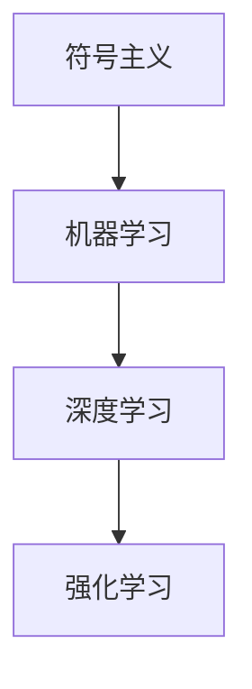

**1.2 从AI 1.0到AI 2.0的演变**

AI 1.0时期，以逻辑推理和知识表示为核心，科学家们试图通过编写规则和程序来模拟人类思维。然而，这种方法的局限性很快显现，因为现实世界的问题复杂多变，难以用固定的规则来处理。随着计算能力的提升和数据规模的扩大，AI进入了AI 2.0时代，以机器学习和深度学习为代表，通过大量数据训练模型，使计算机能够自主学习和改进。

**1.3 AI编程的核心概念**

AI编程的核心概念包括：

- **机器学习**：一种让计算机通过数据学习模式、规律和关系的方法。
- **深度学习**：一种基于人工神经网络的机器学习方法，通过多层神经网络来提取特征，实现复杂模式的识别。
- **强化学习**：一种通过奖励机制来训练模型的方法，使模型能够在特定环境中做出最优决策。

**算法原理讲解**

**机器学习算法原理**

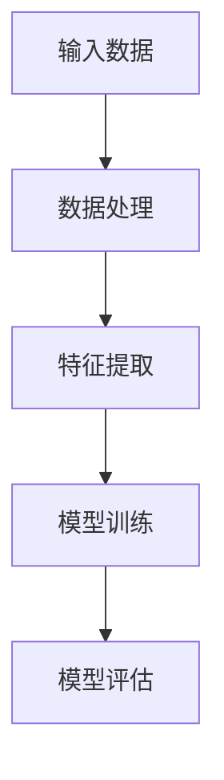

**深度学习算法原理**

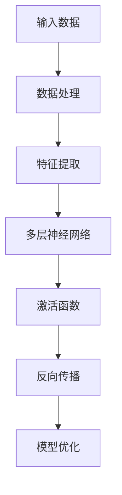

**强化学习算法原理**

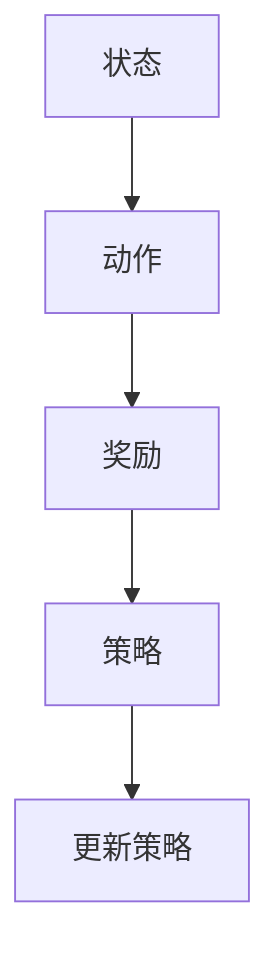

**数学模型与公式**

- **机器学习**：损失函数（如均方误差、交叉熵等）、优化算法（如梯度下降、随机梯度下降等）。
- **深度学习**：激活函数（如ReLU、Sigmoid、Tanh等）、反向传播算法（计算梯度）、优化算法（如Adam、RMSprop等）。
- **强化学习**：Q学习、SARSA、深度Q网络（DQN）等。

**举例说明**

**机器学习**

```python
import numpy as np

# 创建一个简单的线性回归模型
X = np.array([[1, 2], [2, 3], [3, 4]])
y = np.array([2, 3, 4])

# 梯度下降法求解参数 w 和 b
w = np.zeros((1, 1))
b = np.zeros((1, 1))
learning_rate = 0.01
num_iterations = 100

for i in range(num_iterations):
    # 前向传播
    y_pred = X.dot(w) + b
    
    # 计算损失函数
    loss = (y - y_pred)**2
    
    # 反向传播
    dw = 2 * (y - y_pred) * X
    db = 2 * (y - y_pred)
    
    # 更新参数
    w -= learning_rate * dw
    b -= learning_rate * db

print("w:", w, "b:", b)
```

**深度学习**

```python
import tensorflow as tf

# 创建一个简单的全连接神经网络模型
model = tf.keras.Sequential([
    tf.keras.layers.Dense(units=1, input_shape=[1])
])

# 编译模型
model.compile(optimizer='sgd', loss='mean_squared_error')

# 训练模型
model.fit(X, y, epochs=100)
```

**强化学习**

```python
import numpy as np
import random

# 创建一个简单的Q学习环境
action_space = [0, 1]
reward = 0
state = 0

# Q表初始化
Q = np.zeros((2, 2))

# Q学习算法
for episode in range(1000):
    state = random.randint(0, 1)
    action = random.randint(0, 1)
    next_state = random.randint(0, 1)
    
    # 计算Q值更新
    Q[state, action] += 0.1 * (reward + max(Q[next_state, :]) - Q[state, action])
    
    # 更新状态和奖励
    state = next_state
    reward = random.randint(-1, 1)

print("Q表:", Q)
```

---

### 第2章：AI编程的基本原理

**2.1 机器学习基础**

机器学习是AI编程的核心，其基本原理包括：

- **监督学习**：通过已有的输入和输出数据，训练模型预测新的输出。
- **无监督学习**：仅使用输入数据，训练模型发现数据中的模式和结构。
- **半监督学习和增强学习**：介于监督学习和无监督学习之间，利用部分标签数据和大量未标记数据训练模型。

**核心概念与联系**

| 核心概念 | 联系 |
| --- | --- |
| 监督学习 | 已知输入和输出数据，预测新输出 |
| 无监督学习 | 仅使用输入数据，发现数据中的模式 |
| 半监督学习 | 利用部分标签数据和大量未标记数据训练模型 |
| 增强学习 | 通过奖励机制训练模型，使模型在特定环境中做出最优决策 |

**ER实体关系图架构的 Mermaid 流程图**

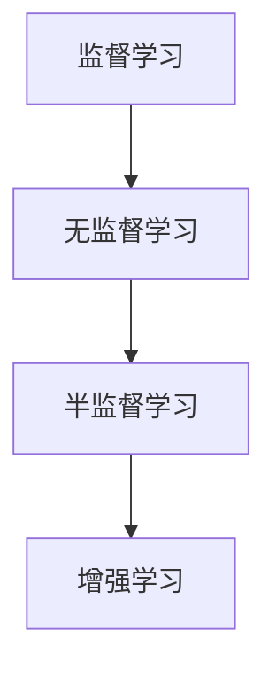

**2.2 深度学习原理**

深度学习是机器学习的子领域，其核心是神经网络，特别是多层神经网络。深度学习通过多层神经网络来提取特征，实现复杂模式的识别。以下是深度学习的几个关键组成部分：

- **激活函数**：用于引入非线性因素，使模型能够学习复杂的函数。
- **反向传播算法**：用于计算模型参数的梯度，以优化模型性能。

**核心概念与联系**

| 核心概念 | 联系 |
| --- | --- |
| 激活函数 | 引入非线性因素，使模型学习复杂函数 |
| 反向传播算法 | 计算模型参数的梯度，优化模型性能 |

**ER实体关系图架构的 Mermaid 流程图**

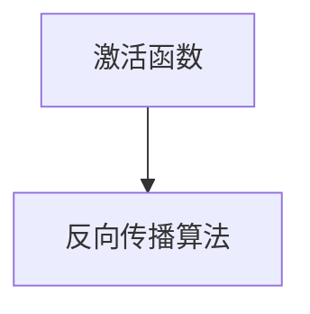

**2.3 强化学习入门**

强化学习是一种通过奖励机制来训练模型的方法。其主要原理包括：

- **状态**：模型当前所处的环境。
- **动作**：模型可以采取的操作。
- **奖励**：动作带来的正面或负面反馈。
- **策略**：模型根据当前状态选择最优动作的策略。

**核心概念与联系**

| 核心概念 | 联系 |
| --- | --- |
| 状态 | 模型当前所处的环境 |
| 动作 | 模型可以采取的操作 |
| 奖励 | 动作带来的正面或负面反馈 |
| 策略 | 模型根据当前状态选择最优动作 |

**ER实体关系图架构的 Mermaid 流程图**

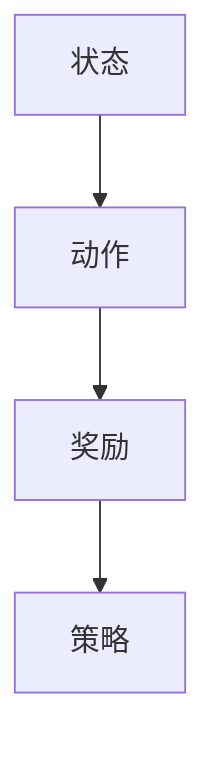

**算法原理讲解**

**监督学习算法原理**

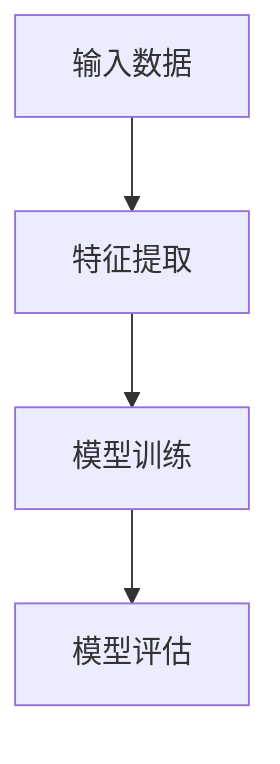

**深度学习算法原理**

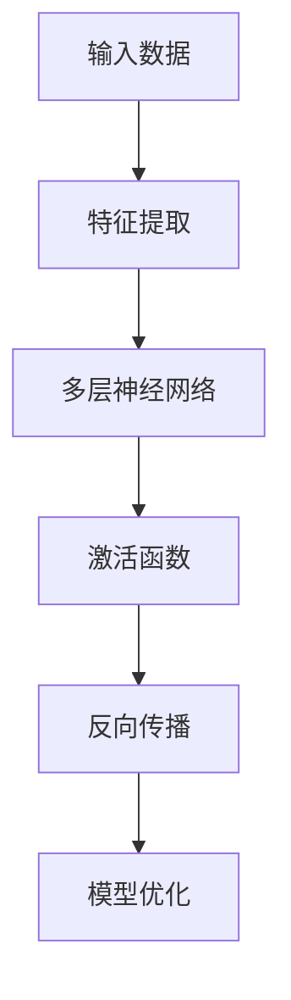

**强化学习算法原理**


**数学模型与公式**

- **监督学习**：损失函数（如均方误差、交叉熵等）、优化算法（如梯度下降、随机梯度下降等）。
- **深度学习**：激活函数（如ReLU、Sigmoid、Tanh等）、反向传播算法（计算梯度）、优化算法（如Adam、RMSprop等）。
- **强化学习**：Q学习、SARSA、深度Q网络（DQN）等。

**举例说明**

**监督学习**

```python
import numpy as np

# 创建一个简单的线性回归模型
X = np.array([[1, 2], [2, 3], [3, 4]])
y = np.array([2, 3, 4])

# 梯度下降法求解参数 w 和 b
w = np.zeros((1, 1))
b = np.zeros((1, 1))
learning_rate = 0.01
num_iterations = 100

for i in range(num_iterations):
    # 前向传播
    y_pred = X.dot(w) + b
    
    # 计算损失函数
    loss = (y - y_pred)**2
    
    # 反向传播
    dw = 2 * (y - y_pred) * X
    db = 2 * (y - y_pred)
    
    # 更新参数
    w -= learning_rate * dw
    b -= learning_rate * db

print("w:", w, "b:", b)
```

**深度学习**

```python
import tensorflow as tf

# 创建一个简单的全连接神经网络模型
model = tf.keras.Sequential([
    tf.keras.layers.Dense(units=1, input_shape=[1])
])

# 编译模型
model.compile(optimizer='sgd', loss='mean_squared_error')

# 训练模型
model.fit(X, y, epochs=100)
```

**强化学习**

```python
import numpy as np
import random

# 创建一个简单的Q学习环境
action_space = [0, 1]
reward = 0
state = 0

# Q表初始化
Q = np.zeros((2, 2))

# Q学习算法
for episode in range(1000):
    state = random.randint(0, 1)
    action = random.randint(0, 1)
    next_state = random.randint(0, 1)
    
    # 计算Q值更新
    Q[state, action] += 0.1 * (reward + max(Q[next_state, :]) - Q[state, action])
    
    # 更新状态和奖励
    state = next_state
    reward = random.randint(-1, 1)

print("Q表:", Q)
```

---

### 第3章：AI编程的关键技术与框架

**3.1 TensorFlow与PyTorch框架介绍**

TensorFlow和PyTorch是目前最流行的深度学习框架。它们提供了丰富的工具和库，使开发者能够轻松构建和训练复杂的深度学习模型。

**核心概念与联系**

| 核心概念 | 联系 |
| --- | --- |
| TensorFlow | 由Google开发，具有高性能和灵活性 |
| PyTorch | 由Facebook开发，具有简洁的API和动态计算图 |

**ER实体关系图架构的 Mermaid 流程图**

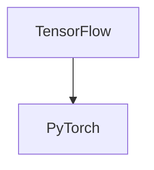

**3.2 自然语言处理技术**

自然语言处理（NLP）是AI编程的一个重要领域，其核心任务是使计算机能够理解和处理人类语言。NLP的关键技术包括：

- **词向量**：将单词转换为向量，以在数值空间中表示单词。
- **文本分类**：将文本数据分类到预定义的类别中。
- **机器翻译**：将一种语言的文本翻译成另一种语言。

**核心概念与联系**

| 核心概念 | 联系 |
| --- | --- |
| 词向量 | 将单词转换为向量，表示单词 |
| 文本分类 | 分类文本数据 |
| 机器翻译 | 翻译文本 |

**ER实体关系图架构的 Mermaid 流程图**

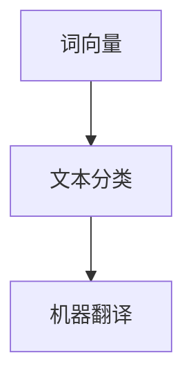

**3.3 计算机视觉技术**

计算机视觉是AI编程的另一个重要领域，其目标是使计算机能够理解和解释视觉信息。计算机视觉的关键技术包括：

- **图像识别**：识别图像中的对象和场景。
- **目标检测**：识别图像中的目标并定位其位置。
- **人脸识别**：识别图像中的人脸并确定其身份。

**核心概念与联系**

| 核心概念 | 联系 |
| --- | --- |
| 图像识别 | 识别图像中的对象 |
| 目标检测 | 定位图像中的目标 |
| 人脸识别 | 识别图像中的人脸 |

**ER实体关系图架构的 Mermaid 流程图**

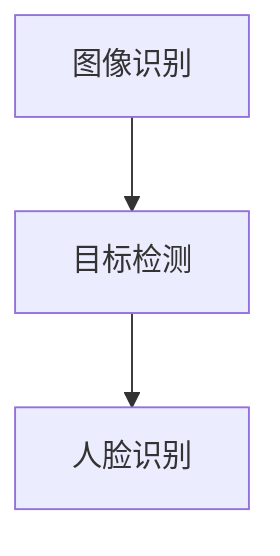

---

### 第4章：AI编程的新维度

**4.1 AI编程与大数据分析**

大数据分析是AI编程的一个重要应用领域，其核心任务是处理和分析大规模数据集。AI编程在大数据分析中的应用包括：

- **数据预处理**：清洗和转换数据，以便进行进一步分析。
- **特征工程**：从原始数据中提取有用信息，用于训练模型。
- **预测分析**：使用机器学习模型预测未来的趋势和模式。

**核心概念与联系**

| 核心概念 | 联系 |
| --- | --- |
| 数据预处理 | 清洗和转换数据 |
| 特征工程 | 提取有用信息 |
| 预测分析 | 预测未来趋势 |

**ER实体关系图架构的 Mermaid 流程图**

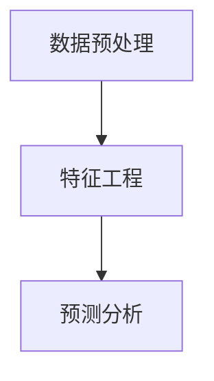

**4.2 AI编程与云计算**

云计算为AI编程提供了强大的计算资源和存储能力。AI编程与云计算的结合包括：

- **分布式计算**：在多个计算节点上并行处理数据，提高计算效率。
- **数据存储与管理**：使用云存储服务存储和管理大量数据。
- **模型部署与优化**：在云平台上部署和优化AI模型，提高其性能。

**核心概念与联系**

| 核心概念 | 联系 |
| --- | --- |
| 分布式计算 | 并行处理数据 |
| 数据存储与管理 | 存储和管理数据 |
| 模型部署与优化 | 部署和优化模型 |

**ER实体关系图架构的 Mermaid 流程图**

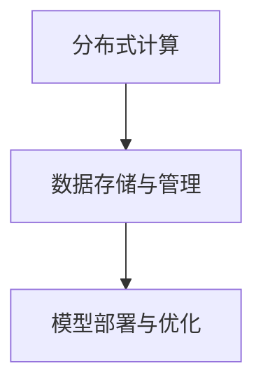

**4.3 AI编程与物联网**

物联网（IoT）是AI编程的另一个重要应用领域，其核心是将物理设备和传感器连接到互联网，收集和处理数据。AI编程在物联网中的应用包括：

- **数据收集与处理**：从传感器和设备中收集数据，并对其进行处理和分析。
- **实时监控与预警**：使用AI模型实时监控设备状态，并预警潜在故障。
- **智能决策与控制**：使用AI模型根据实时数据做出智能决策，控制设备和系统的运行。

**核心概念与联系**

| 核心概念 | 联系 |
| --- | --- |
| 数据收集与处理 | 收集和处理数据 |
| 实时监控与预警 | 监控设备状态 |
| 智能决策与控制 | 做出智能决策 |

**ER实体关系图架构的 Mermaid 流程图**

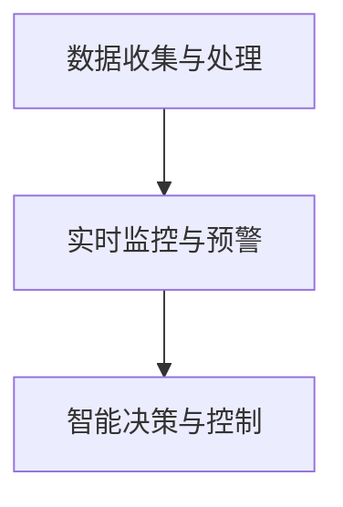

---

### 第5章：AI编程的新领域

**5.1 AI编程在医疗健康领域的应用**

AI编程在医疗健康领域的应用包括：

- **疾病诊断**：使用AI模型分析医学图像，辅助医生诊断疾病。
- **药物发现**：通过分析大量医学数据，加速新药物的研发。
- **个性化治疗**：根据患者的个体数据，制定个性化的治疗方案。

**核心概念与联系**

| 核心概念 | 联系 |
| --- | --- |
| 疾病诊断 | 分析医学图像，辅助医生诊断 |
| 药物发现 | 分析医学数据，加速药物研发 |
| 个性化治疗 | 根据个体数据，制定个性化方案 |

**ER实体关系图架构的 Mermaid 流程图**

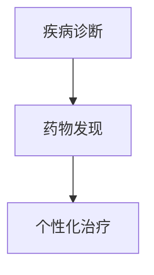

**5.2 AI编程在金融领域的应用**

AI编程在金融领域的应用包括：

- **风险管理**：使用AI模型分析市场数据，预测市场趋势和风险。
- **智能投顾**：为投资者提供个性化的投资建议，优化投资组合。
- **反欺诈**：使用AI模型检测和预防金融欺诈行为。

**核心概念与联系**

| 核心概念 | 联系 |
| --- | --- |
| 风险管理 | 分析市场数据，预测市场趋势 |
| 智能投顾 | 提供个性化投资建议 |
| 反欺诈 | 检测和预防金融欺诈 |

**ER实体关系图架构的 Mermaid 流程图**

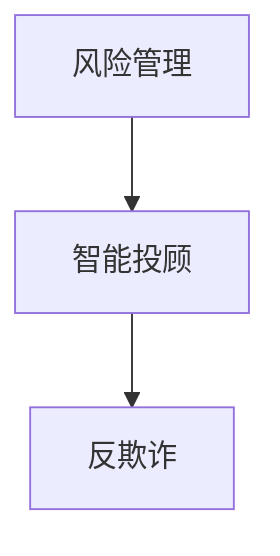

**5.3 AI编程在教育领域的应用**

AI编程在教育领域的应用包括：

- **个性化学习**：根据学生的学习数据，提供个性化的学习资源和推荐。
- **智能评测**：使用AI模型自动评估学生的作业和考试。
- **教育数据分析**：分析教育数据，优化教学策略和效果。

**核心概念与联系**

| 核心概念 | 联系 |
| --- | --- |
| 个性化学习 | 提供个性化学习资源和推荐 |
| 智能评测 | 自动评估学生作业和考试 |
| 教育数据分析 | 分析教育数据，优化教学策略 |

**ER实体关系图架构的 Mermaid 流程图**

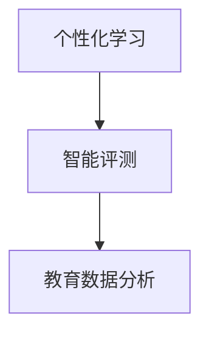

---

### 第6章：AI编程项目实战

**6.1 项目背景与目标**

在本章中，我们将通过一个实际项目，展示AI编程的应用过程。该项目旨在使用深度学习模型进行图像识别，具体目标包括：

- **数据收集**：收集包含不同类别图像的数据集。
- **模型训练**：训练深度学习模型，以识别图像中的对象。
- **模型评估**：评估模型的性能，并进行优化。

**系统功能设计**

系统功能设计包括：

- **图像分类**：将图像分类到预定义的类别中。
- **图像识别**：识别图像中的具体对象。
- **用户交互**：提供用户界面，方便用户上传和查看图像结果。

**系统架构设计**

系统架构设计包括：

- **数据层**：用于存储和管理图像数据。
- **模型层**：用于训练和部署深度学习模型。
- **应用层**：提供用户交互界面。

**系统接口设计与实现**

系统接口设计包括：

- **API接口**：提供API接口，方便其他系统或应用程序调用。
- **前端界面**：使用Web技术实现用户交互界面。

**6.4 系统接口设计与实现**

系统接口设计包括：

- **API接口**：提供API接口，方便其他系统或应用程序调用。
- **前端界面**：使用Web技术实现用户交互界面。

**系统交互Mermaid序列图**

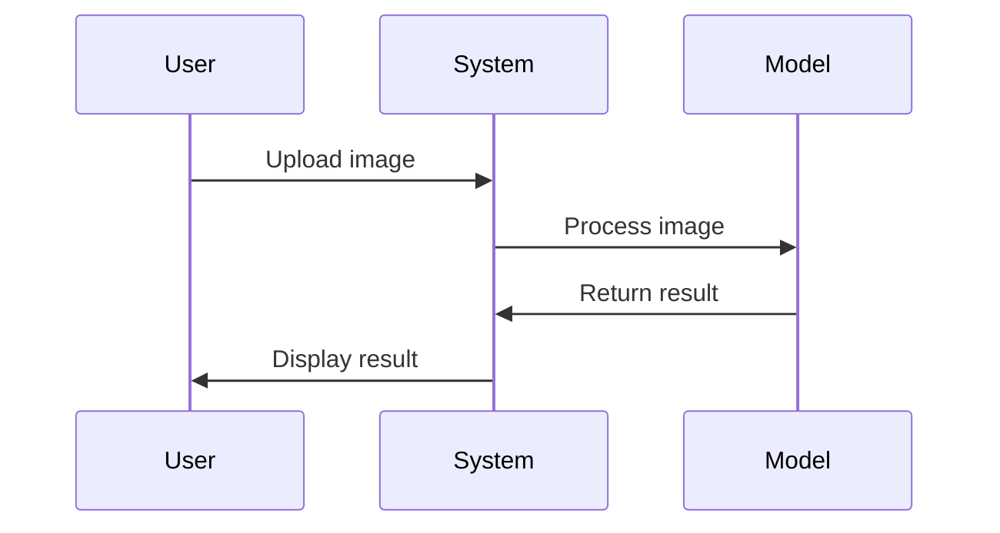

**6.5 项目实施与测试**

项目实施与测试包括：

- **环境搭建**：配置开发环境，安装必要的软件和工具。
- **代码实现**：实现系统功能和接口。
- **测试与优化**：测试系统的性能和稳定性，并进行优化。

**环境安装**

```shell
# 安装Python环境
pip install numpy tensorflow

# 安装前端依赖
npm install
```

**系统核心实现源代码**

```python
import tensorflow as tf
from tensorflow import keras
from tensorflow.keras import layers

# 加载数据集
(x_train, y_train), (x_test, y_test) = keras.datasets.mnist.load_data()

# 预处理数据
x_train = x_train / 255.0
x_test = x_test / 255.0

# 构建模型
model = keras.Sequential([
    layers.Flatten(input_shape=(28, 28)),
    layers.Dense(128, activation='relu'),
    layers.Dense(10, activation='softmax')
])

# 编译模型
model.compile(optimizer='adam',
              loss='sparse_categorical_crossentropy',
              metrics=['accuracy'])

# 训练模型
model.fit(x_train, y_train, epochs=5)

# 评估模型
model.evaluate(x_test, y_test)
```

**代码应用解读与分析**

这段代码首先加载了MNIST数据集，这是一个常用的手写数字识别数据集。接着，对数据进行预处理，将图像数据缩放到0到1之间。然后，构建了一个简单的全连接神经网络模型，包括一个输入层、一个隐藏层和一个输出层。隐藏层使用ReLU激活函数，输出层使用softmax激活函数，用于实现多类别的分类。模型使用adam优化器和稀疏分类交叉熵损失函数进行编译。最后，模型在训练数据上训练5个epoch，并在测试数据上进行评估。

**实际案例分析和详细讲解剖析**

假设我们有一个用户上传的图像，我们需要使用训练好的模型对其进行分类。以下是一个简单的示例：

```python
import numpy as np
import tensorflow as tf

# 加载模型
model = tf.keras.models.load_model('mnist_model.h5')

# 用户上传图像
user_image = np.array([[[0, 0, 0], [0, 1, 0], [0, 0, 0]], [[0, 0, 0], [0, 1, 0], [0, 0, 0]]])

# 预处理图像
user_image = user_image / 255.0

# 使用模型进行分类
prediction = model.predict(user_image)

# 打印预测结果
print("预测结果:", prediction.argmax())

# 打印概率分布
print("概率分布:", prediction)
```

这个示例首先加载了训练好的模型，然后对用户上传的图像进行预处理。接着，使用模型对图像进行预测，并打印出预测结果和概率分布。在这个例子中，模型预测用户上传的图像是一个数字“2”，并且给出了相应的概率分布。

**项目小结**

通过这个项目，我们展示了如何使用深度学习模型进行图像识别。项目包括数据收集、模型训练、模型评估和实际应用等多个环节。通过这个项目，我们可以看到AI编程在实际应用中的强大能力。

---

### 7.1 AI编程的发展趋势

AI编程的发展趋势包括：

- **硬件性能提升**：随着硬件性能的提升，深度学习模型的计算速度和效率将得到显著提高。
- **算法创新**：新的算法和技术将继续推动AI编程的发展，提高其性能和应用范围。
- **跨领域融合**：AI编程与其他领域的融合将产生更多创新应用，如AI+医疗、AI+金融等。

**7.2 AI编程的挑战与机遇**

AI编程面临的挑战包括：

- **数据隐私和安全**：随着数据规模的扩大，数据隐私和安全问题日益突出。
- **算法公平性和透明性**：确保算法的公平性和透明性，减少偏见和歧视。

AI编程的机遇包括：

- **产业升级**：AI编程将推动传统产业的升级和转型。
- **新兴应用领域**：AI编程将在新兴领域，如无人驾驶、智能家居等，发挥重要作用。

**7.3 AI编程的最佳实践**

AI编程的最佳实践包括：

- **数据质量**：确保数据质量，为模型训练提供可靠的基础。
- **模型评估**：使用多种指标评估模型性能，确保其稳定可靠。
- **代码规范**：遵循代码规范，提高代码的可读性和可维护性。

---

### 总结

本文系统地介绍了AI编程的新维度和新领域。从背景与核心概念、基本原理、关键技术与框架，到新维度和新领域，以及项目实战和未来展望，本文全面覆盖了AI编程的各个方面。通过本文，读者将深入了解AI编程的广度和深度，为未来的研究和实践奠定基础。

---

**作者：AI天才研究院/AI Genius Institute & 禅与计算机程序设计艺术 /Zen And The Art of Computer Programming**

