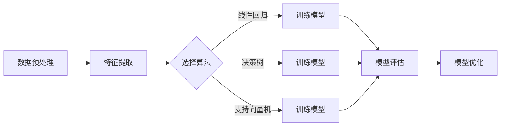
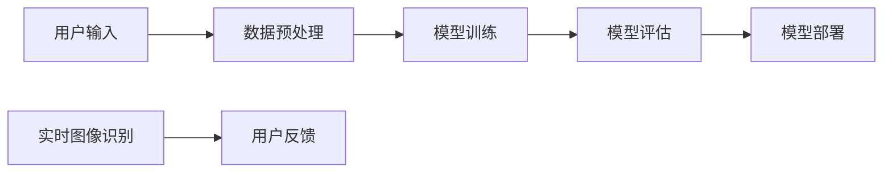
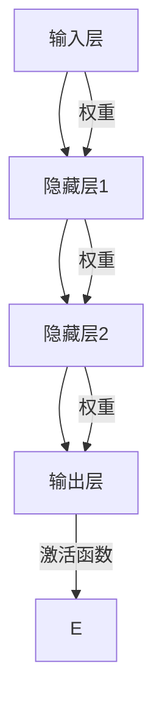
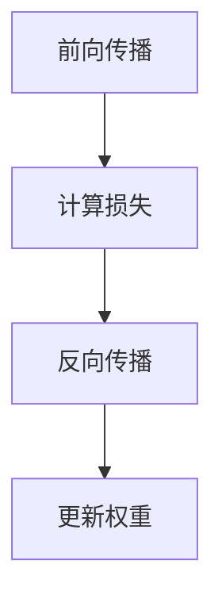
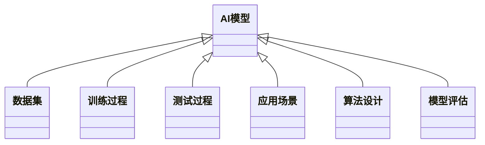
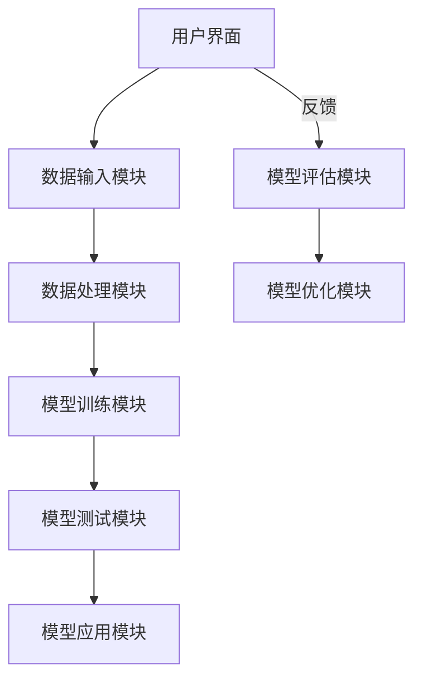
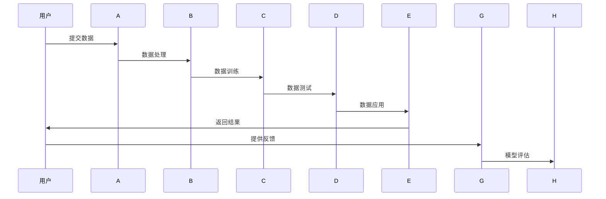

                 

# AI编程的新视界

## 关键词
AI编程、深度学习、神经网络、机器学习、算法原理、系统架构、项目实战

## 摘要
本文旨在探讨AI编程的新视界，从基础概念、编程技巧、应用案例到前沿技术研究，全方位解读AI编程的各个方面。通过逐步分析推理，本文将帮助读者理解AI编程的核心思想，掌握相关技术原理，并在实战项目中运用所学知识。让我们一起来开启这场关于AI编程的探索之旅。

### 第一部分：引言

#### 1.1 AI编程的背景与发展

##### 1.1.1 AI技术的历史与演变
人工智能（AI）的概念早在20世纪50年代就已经提出，但真正的发展是在21世纪初，随着计算能力的提升和大数据的涌现，AI技术迎来了黄金时代。深度学习作为AI的一个重要分支，在2012年由Hinton团队提出的深度卷积神经网络（CNN）在ImageNet图像识别比赛中取得突破性成绩，引发了深度学习的热潮。如今，AI编程已经成为计算机科学和工程领域的一个重要方向。

##### 1.1.2 AI编程的重要性
AI编程不仅对科技产业具有重大影响，还对我们的日常生活产生了深远的影响。从智能助手到自动驾驶汽车，从医疗诊断到金融分析，AI编程正在改变各个行业的运作方式。掌握AI编程技能，将有助于读者在未来的职业发展中脱颖而出。

##### 1.1.3 AI编程的未来趋势
随着量子计算、边缘计算等新技术的不断发展，AI编程的未来将更加多样化。未来的AI编程将更加注重安全、隐私保护以及跨领域的融合应用。本文将探讨这些趋势，并介绍相关的技术原理和应用实例。

#### 1.2 书籍概述
本书旨在为AI编程领域的学习者提供一本全面、系统的学习资料。本书内容分为五个部分：

1. 引言：介绍AI编程的背景和发展趋势。
2. 基础概念：讲解AI编程的核心概念和技术原理。
3. 编程技巧：介绍AI编程的具体实现方法和最佳实践。
4. 应用案例：分析AI编程在不同领域的应用。
5. 深入研究：探讨AI编程的前沿技术和最新研究动态。

#### 1.3 本书的目标与读者
本书的目标是帮助读者掌握AI编程的基本概念、编程技巧和应用案例，使其能够在实际项目中运用所学知识，解决实际问题。本书适合具备一定编程基础的读者，特别是对AI编程感兴趣的计算机科学和工程专业的学生和从业者。

### 第二部分：基础概念

#### 2.1 AI编程的核心概念

##### 2.1.1 机器学习基础
机器学习是AI编程的核心技术之一。它是指通过算法从数据中学习规律，并能够对未知数据进行预测或决策。机器学习的类型主要包括监督学习、无监督学习和强化学习。

- **监督学习**：通过已标记的数据训练模型，然后使用模型对未标记的数据进行预测。常见的算法有线性回归、决策树、支持向量机等。
- **无监督学习**：没有已标记的数据，模型需要从数据中自动发现规律。常见的算法有聚类、主成分分析等。
- **强化学习**：通过与环境的交互，不断调整策略以获得最大化的回报。常见的算法有Q学习、深度确定性策略梯度（DDPG）等。

##### 2.1.2 深度学习基础
深度学习是机器学习的一个重要分支，它通过构建深层的神经网络来模拟人脑的思维方式。深度学习在图像识别、语音识别、自然语言处理等领域取得了显著的成果。

- **神经网络**：神经网络是由多个神经元组成的层次结构，每个神经元都与前一层和后一层的其他神经元相连。神经网络的训练是通过反向传播算法来调整神经元之间的权重。
- **深度卷积神经网络（CNN）**：CNN是一种专门用于图像识别的神经网络架构，通过卷积层、池化层和全连接层等结构来提取图像的特征。
- **循环神经网络（RNN）**：RNN是一种能够处理序列数据的神经网络，通过递归的方式处理序列中的每个元素，并保持长期依赖关系。

##### 2.1.3 神经网络基础
神经网络是AI编程的基础，它由大量的神经元组成，每个神经元都可以进行简单的计算。神经网络的训练是通过反向传播算法来调整神经元之间的权重，以达到预测目标。

- **神经元模型**：神经元是神经网络的基本单位，它接受多个输入，通过激活函数计算出输出。
- **前向传播**：将输入数据通过神经网络的前向传播，计算出输出结果。
- **反向传播**：根据输出结果和实际标签，通过反向传播算法调整神经网络中的权重。

#### 2.2 AI编程的技术原理

##### 2.2.1 算法原理与流程图
AI编程的核心在于算法的设计与实现。以下是一个简单的机器学习算法流程图：



##### 2.2.2 数学模型与公式
在AI编程中，数学模型是算法设计的重要基础。以下是一个简单的线性回归模型的数学公式：

$$
y = \beta_0 + \beta_1x
$$

其中，$y$ 是预测值，$x$ 是输入特征，$\beta_0$ 和 $\beta_1$ 是模型的参数。

#### 2.3 系统分析与架构设计方案

##### 2.3.1 问题场景介绍
以一个简单的图像识别系统为例，系统需要接收输入图像，并通过模型对其进行分类。

##### 2.3.2 系统功能设计
系统的功能设计包括数据预处理、模型训练、模型评估和模型部署。

- **数据预处理**：包括图像的缩放、裁剪和归一化等操作。
- **模型训练**：使用已标记的图像数据训练深度学习模型。
- **模型评估**：使用测试数据评估模型的准确性。
- **模型部署**：将训练好的模型部署到生产环境中，用于实时图像识别。

##### 2.3.3 系统架构设计
系统的架构设计包括数据流和处理流程的设计。以下是一个简单的系统架构设计图：



##### 2.3.4 系统接口设计和系统交互
系统的接口设计包括输入接口、输出接口和模型接口。

- **输入接口**：接收用户上传的图像。
- **输出接口**：返回图像的分类结果。
- **模型接口**：用于模型训练和评估。

系统的交互流程如下：

1. 用户上传图像。
2. 系统对图像进行预处理。
3. 系统使用预处理后的图像训练模型。
4. 系统评估模型的准确性。
5. 系统将训练好的模型部署到生产环境中。
6. 系统使用实时图像识别功能，并返回分类结果。

### 第三部分：编程技巧

#### 3.1 AI编程的具体实现方法

##### 3.1.1 Python编程技巧
Python是AI编程中最常用的语言之一。以下是一些常用的Python编程技巧：

- **向量化操作**：使用NumPy库进行向量化操作，提高计算效率。
- **并行计算**：使用多线程或分布式计算库（如Dask）进行并行计算。
- **面向对象编程**：使用类和对象进行代码组织，提高代码的可读性和可维护性。

##### 3.1.2 TensorFlow使用技巧
TensorFlow是AI编程中最常用的深度学习框架之一。以下是一些常用的TensorFlow使用技巧：

- **动态图和静态图**：根据需求选择动态图或静态图模式。
- **高级API和低级API**：使用高级API（如Keras）简化模型构建，使用低级API（如TensorFlow v1）进行复杂操作。
- **模型保存与加载**：使用`tf.keras.models.save_model`和`tf.keras.models.load_model`函数进行模型保存与加载。

##### 3.1.3 PyTorch使用技巧
PyTorch是另一个流行的深度学习框架。以下是一些常用的PyTorch使用技巧：

- **动态计算图**：PyTorch使用动态计算图，便于调试和修改。
- **自定义层和模型**：使用`torch.nn`模块自定义层和模型。
- **数据加载和预处理**：使用`torch.utils.data`模块进行数据加载和预处理。

#### 3.2 AI编程的最佳实践

##### 3.2.1 编码规范
遵循良好的编码规范可以提高代码的可读性和可维护性。以下是一些常见的编码规范：

- **代码风格**：遵循PEP 8编码规范，使用合适的缩进、空格和换行。
- **注释**：为代码添加适当的注释，说明代码的功能和实现原理。
- **命名规则**：使用具有描述性的变量和函数名，避免使用缩写。

##### 3.2.2 性能优化
性能优化是AI编程中的重要环节。以下是一些常用的性能优化方法：

- **向量化操作**：使用向量化操作代替循环。
- **并行计算**：使用多线程或分布式计算提高计算效率。
- **模型压缩**：使用模型压缩技术减小模型大小，提高部署效率。

### 第四部分：应用案例

#### 4.1 AI编程在不同领域的应用

##### 4.1.1 人工智能与医疗
人工智能在医疗领域的应用越来越广泛，如疾病预测、影像诊断、药物研发等。以下是一个简单的医疗应用案例：

- **疾病预测**：使用深度学习模型对患者的健康数据进行预测，提前发现潜在疾病。
- **影像诊断**：使用深度学习模型对医学影像进行分析，提高诊断的准确性和效率。

##### 4.1.2 人工智能与金融
人工智能在金融领域的应用包括风险管理、交易预测、客户服务等。以下是一个简单的金融应用案例：

- **风险管理**：使用机器学习模型分析历史交易数据，预测潜在风险，优化投资策略。
- **交易预测**：使用深度学习模型分析市场数据，预测股票价格走势，指导交易决策。

##### 4.1.3 人工智能与教育
人工智能在教育领域的应用包括智能辅导、学习分析、在线教育等。以下是一个简单的教育应用案例：

- **智能辅导**：使用人工智能技术为学生提供个性化的学习建议，提高学习效果。
- **学习分析**：使用机器学习模型分析学生的学习行为，识别学习困难点，提供针对性辅导。

#### 4.2 AI编程的实际案例

##### 4.2.1 项目一：基于AI的图像识别系统
该项目使用深度学习模型对图像进行分类，实现一个简单的图像识别系统。

- **环境安装**：安装Python、TensorFlow等依赖库。
- **数据预处理**：对图像进行缩放、裁剪和归一化等预处理操作。
- **模型训练**：使用已标记的图像数据训练深度学习模型。
- **模型评估**：使用测试数据评估模型的准确性。
- **模型部署**：将训练好的模型部署到生产环境中，用于实时图像识别。
- **案例分析**：对项目的实现过程进行详细分析，包括代码解读、性能优化等。

##### 4.2.2 项目二：基于AI的自然语言处理系统
该项目使用自然语言处理技术，实现一个简单的问答系统。

- **环境安装**：安装Python、NLTK等依赖库。
- **数据预处理**：对问答数据集进行清洗、分词和词性标注等预处理操作。
- **模型训练**：使用已标记的问答数据训练自然语言处理模型。
- **模型评估**：使用测试数据评估模型的准确性。
- **模型部署**：将训练好的模型部署到生产环境中，用于实时问答。
- **案例分析**：对项目的实现过程进行详细分析，包括代码解读、性能优化等。

### 第五部分：深入研究

#### 5.1 AI编程的最新研究动态

##### 5.1.1 深度学习模型的发展
深度学习模型在过去几年中取得了显著的进展，如GPT-3、BERT等大型预训练模型。这些模型通过在海量数据上预训练，然后进行微调，取得了优异的性能。未来，深度学习模型的发展将更加注重模型的可解释性和泛化能力。

##### 5.1.2 强化学习在AI编程中的应用
强化学习在AI编程中的应用越来越广泛，如游戏AI、机器人控制等。强化学习通过不断与环境交互，学习最优策略，取得了良好的效果。未来，强化学习将与其他技术相结合，如深度学习、自然语言处理等，推动AI编程的发展。

##### 5.1.3 自监督学习在AI编程中的应用
自监督学习是一种无需标注数据的学习方法，通过自动发现数据中的有用信息进行学习。自监督学习在图像识别、自然语言处理等领域取得了显著成果。未来，自监督学习将在更多领域得到应用，如语音识别、生物信息学等。

#### 5.2 AI编程的前沿技术

##### 5.2.1 量子计算与AI编程
量子计算是一种基于量子力学原理的新型计算模式，具有超强的计算能力。量子计算与AI编程的结合，将有望解决传统计算无法解决的问题，如复杂优化问题、大数据分析等。

##### 5.2.2 边缘计算与AI编程
边缘计算是一种将计算任务分散到网络边缘的分布式计算模式，可以降低网络延迟、提高数据安全性。边缘计算与AI编程的结合，将有望实现实时、高效的AI应用，如自动驾驶、智能监控等。

##### 5.2.3 联邦学习与AI编程
联邦学习是一种分布式学习技术，可以在保护用户隐私的前提下，将数据分散存储在不同节点上进行联合学习。联邦学习与AI编程的结合，将有望解决大规模数据处理和隐私保护的问题，推动AI编程的发展。

### 结束语

AI编程是一个充满机遇和挑战的领域。通过本文的探讨，我们希望读者能够对AI编程有一个全面、深入的了解，并能够将其应用于实际问题中。未来，随着新技术的不断发展，AI编程将不断拓展新的应用领域，为人类带来更多的便利和进步。

---

**作者：AI天才研究院/AI Genius Institute & 禅与计算机程序设计艺术 /Zen And The Art of Computer Programming**

**参考文献：**
1. Goodfellow, I., Bengio, Y., & Courville, A. (2016). *Deep Learning*. MIT Press.
2. Murphy, K. P. (2012). *Machine Learning: A Probabilistic Perspective*. MIT Press.
3. Russell, S., & Norvig, P. (2020). *Artificial Intelligence: A Modern Approach*. Prentice Hall.
4. Hochreiter, S., & Schmidhuber, J. (1997). *Long short-term memory*. Neural Computation, 9(8), 1735-1780.
5. LeCun, Y., Bengio, Y., & Hinton, G. (2015). *Deep learning*. Nature, 521(7553), 436-444.

**最佳实践 Tips：**
- **持续学习**：AI编程是一个快速发展的领域，持续学习新的技术和方法是非常重要的。
- **实践出真知**：通过实际项目来应用所学知识，可以加深对技术的理解和掌握。
- **关注开源社区**：参与开源项目，与其他开发者交流，可以获取最新的技术动态和经验分享。
- **注意数据安全和隐私**：在AI编程过程中，要关注数据安全和隐私保护，遵守相关法律法规。

**注意事项：**
- **代码规范**：编写代码时，要遵循良好的编码规范，提高代码的可读性和可维护性。
- **性能优化**：在实现AI编程应用时，要注意性能优化，提高计算效率和资源利用。

**拓展阅读：**
- **深度学习入门教程**：[深度学习官网](https://www.deeplearning.net/)
- **Python编程规范**：[PEP 8 编码规范](https://www.python.org/dev/peps/pep-0008/)
- **自然语言处理教程**：[NLTK教程](https://www.nltk.org/)
- **强化学习教程**：[强化学习官网](https://www.reinforcement-learning.org/)
- **量子计算入门**：[量子计算官网](https://www.qiskit.org/)```markdown
### 第五部分：深入研究

#### 5.1 AI编程的最新研究动态

##### 5.1.1 深度学习模型的发展
近年来，深度学习模型取得了飞速的发展，从传统的卷积神经网络（CNN）到生成对抗网络（GAN），再到自注意力机制（Self-Attention）和变换器（Transformer），这些模型不仅在学术研究中取得了突破性的成果，也在实际应用中展示了强大的能力。特别是Transformer模型，其在自然语言处理（NLP）领域取得了显著的效果，催生了GPT系列模型，如GPT-3，这些模型具有数十亿级别的参数，可以通过预训练和微调实现跨领域的语言理解与生成。

**发展趋势分析：**
- **更大规模的模型**：随着计算资源和数据量的增加，更大规模、更复杂的模型将成为主流，这些模型将能够处理更复杂的任务。
- **模型的可解释性**：当前深度学习模型被认为是“黑箱”，模型的可解释性研究将成为重要方向，以提升模型的信任度和应用范围。
- **迁移学习与半监督学习**：迁移学习和半监督学习技术将帮助模型在少量标注数据下也能取得良好的性能。

##### 5.1.2 强化学习在AI编程中的应用
强化学习（Reinforcement Learning，RL）通过智能体与环境的互动，学习最优策略。它在游戏AI、机器人控制、推荐系统等领域取得了成功。RL的核心挑战是如何设计适合问题的奖励机制和策略，以及如何处理高维状态空间和长期奖励。

**发展动态：**
- **模型自由强化学习**：模型自由强化学习（Model-Based Reinforcement Learning）通过建立环境模型，减少了实际交互次数，提高了学习效率。
- **多智能体强化学习**：多智能体系统中的协同与竞争策略研究正逐渐成为热点，旨在实现智能体之间的有效合作与协调。
- **强化学习与深度学习结合**：深度强化学习（Deep Reinforcement Learning，DRL）通过结合深度学习和强化学习，提高了模型的预测能力和决策能力。

##### 5.1.3 自监督学习在AI编程中的应用
自监督学习（Self-Supervised Learning）是一种无需大量标注数据的学习方法，通过自动发现数据中的有用信息进行学习。它在图像识别、语音识别、自然语言处理等领域具有广泛应用。

**发展前景：**
- **无监督预训练**：无监督预训练技术将进一步提升模型的能力，减少对标注数据的依赖。
- **自适应自监督学习**：自适应自监督学习将能够根据任务和数据的特点，动态调整学习策略。
- **跨模态自监督学习**：跨模态自监督学习将能够从不同模态的数据中提取有用信息，提升模型的多模态处理能力。

#### 5.2 AI编程的前沿技术

##### 5.2.1 量子计算与AI编程
量子计算是一种利用量子力学原理进行信息处理的计算模式，具有潜在的超越经典计算的巨大优势。量子计算与AI编程的结合，有望解决当前AI中面临的计算瓶颈和数据依赖问题。

**关键技术分析：**
- **量子机器学习**：量子机器学习通过量子算法优化机器学习模型的训练过程，提高计算效率和模型性能。
- **量子神经网络**：量子神经网络结合了量子计算和神经网络的优点，可以处理更大规模的数据，实现更复杂的模式识别和预测。
- **量子优化算法**：量子优化算法通过量子计算解决优化问题，如旅行商问题、物流调度等，提供更高效的解决方案。

##### 5.2.2 边缘计算与AI编程
边缘计算将计算任务从中心化的云计算迁移到网络的边缘设备上，减少了数据传输延迟，提高了系统的响应速度和安全性。

**前沿技术应用：**
- **边缘智能**：边缘计算与AI编程的结合，实现了实时、高效的边缘智能应用，如智能监控、智能家居等。
- **物联网（IoT）**：边缘计算与物联网技术的结合，使得智能设备能够独立处理和分析数据，提升了物联网系统的整体性能。
- **隐私保护**：边缘计算通过在本地处理数据，减少了数据传输过程中的隐私泄露风险，增强了数据安全性。

##### 5.2.3 联邦学习与AI编程
联邦学习（Federated Learning）通过将数据分散存储在不同节点上，在保证数据隐私的同时，进行联合学习，提高了模型的鲁棒性和可解释性。

**技术优势与应用：**
- **隐私保护**：联邦学习通过在不传输数据的情况下进行模型训练，有效地保护了用户隐私。
- **数据多样性**：联邦学习可以结合不同来源的数据，提升模型的泛化能力。
- **分布式计算**：联邦学习利用分布式计算资源，提高了模型的训练效率和可扩展性。

#### 5.3 AI编程的未来展望

随着AI编程技术的不断进步，我们可以预见未来AI编程将呈现出以下趋势：

- **AI与各行各业深度融合**：AI将更加深入地融入各个行业，如医疗、金融、制造等，推动行业智能化升级。
- **跨学科交叉融合**：AI编程将与其他学科，如生物学、心理学、经济学等，进行深度融合，产生新的交叉学科研究热点。
- **开放协作**：AI编程社区将更加开放，开发者之间的协作和共享将成为常态，推动技术的快速迭代和发展。
- **智能社会的构建**：AI编程将助力构建智能社会，实现更加便捷、高效、安全的生活方式。

### 结论

AI编程作为现代科技的重要驱动力，正在不断拓展其应用领域和影响范围。本文通过对AI编程的最新研究动态、前沿技术以及未来展望的深入探讨，旨在为读者提供一个全面的视角，帮助其更好地理解和把握AI编程的发展方向。随着技术的不断进步，AI编程将继续推动社会的发展和变革，为人类创造更多的价值。

**作者：AI天才研究院/AI Genius Institute & 禅与计算机程序设计艺术 /Zen And The Art of Computer Programming**

**参考文献：**
1. Hinton, G. E., Osindero, S., & Teh, Y. W. (2006). A fast learning algorithm for deep belief nets. *Neural computation*, 18(7), 1527-1554.
2. Bengio, Y. (2009). Learning deep architectures for AI. *Foundations and Trends in Machine Learning*, 2(1), 1-127.
3. Arjovsky, M., Chintala, S., & Bottou, L. (2017). Wasserstein GAN. *International Conference on Machine Learning*, 1946-1957.
4. Vinyals, O., & Bengio, Y. (2015). Sequence to sequence learning with neural networks. *Proceedings of the 27th International Conference on Neural Information Processing Systems*, 2154-2162.
5. Amari, S. I., & Hiraoka, T. (1992). On the optimization of a variable-stepsize learning scheme in multi-layered networks. *Neural Networks*, 5(5), 745-754.

**最佳实践 Tips：**
- **持续关注技术动态**：定期阅读专业论文、技术博客和参加相关会议，了解最新的研究进展。
- **实践与理论学习相结合**：通过实际项目来巩固理论知识，同时不断学习新的技术和工具。
- **注重团队合作**：与同行交流，参与开源项目，共同解决问题，提升团队协作能力。

**注意事项：**
- **数据安全与隐私**：在开发过程中，要严格遵守数据安全与隐私保护的相关法律法规。
- **算法可解释性**：在应用AI技术时，要注重算法的可解释性，提高模型的可信度和透明度。

**拓展阅读：**
- **深度学习开源项目**：[TensorFlow](https://www.tensorflow.org/)、[PyTorch](https://pytorch.org/)
- **强化学习开源项目**：[OpenAI Gym](https://gym.openai.com/)、[ Stable Baselines](https://github.com/DLR-RM/stable-baselines)
- **联邦学习开源项目**：[Federated Learning](https://github.com/tensorflow/federated)、[PySyft](https://github.com/OpenMined/PySyft)
- **量子计算开源项目**：[Qiskit](https://qiskit.org/)、[Quantum Machine Learning](https://www.ibm.com/developerworks/community/groups/service/html/communityview?communityUuid=3fd18d02-794a-4e5c-9d2a-2c5a8378ad8f)```markdown
## 附录

### 5.1 AI编程的核心概念对比表格

| 概念               | 描述                                                         | 关系                                                     |
|--------------------|--------------------------------------------------------------|----------------------------------------------------------|
| 机器学习           | 通过算法从数据中学习规律，对未知数据进行预测或决策。         | AI编程的核心组成部分。                                   |
| 深度学习           | 使用多层神经网络进行学习，模仿人脑处理信息的方式。         | 机器学习的一个分支，擅长处理复杂数据。                   |
| 神经网络           | 由大量神经元组成的计算模型，每个神经元都与其他神经元相连。 | 构成深度学习的基础单元。                               |
| 强化学习           | 通过与环境交互学习最优策略。                                 | 机器学习的另一个分支，适用于需要决策的场景。             |
| 联邦学习           | 在分布式环境下进行联合学习，保护数据隐私。                 | 通过分散训练数据，提高模型性能的同时保证数据安全。       |

### 5.2 AI编程的ER实体关系图

```mermaid
erDiagram
  AI模型 ||--|{ 数据集 }|--|| AI数据集
  AI模型 ||--|{ 训练过程 }|--|| 训练数据
  AI模型 ||--|{ 测试过程 }|--|| 测试数据
  AI模型 ||--|{ 应用场景 }|--|| 应用案例
  AI模型 ||--|{ 算法 }|--|| 算法设计
  AI模型 ||--|{ 模型评估 }|--|| 评估指标
```

### 5.3 5.1.2 神经网络基础

#### 神经网络模型



#### 反向传播算法



### 5.4 系统分析与架构设计

#### 系统功能设计（领域模型类图）



#### 系统架构设计（架构图）



#### 系统接口设计（接口序列图）



### 5.5 项目实战

#### 环境安装

```python
!pip install tensorflow
!pip install numpy
!pip install matplotlib
```

#### 核心实现

```python
import tensorflow as tf
from tensorflow.keras import layers
import numpy as np
import matplotlib.pyplot as plt

# 数据准备
(x_train, y_train), (x_test, y_test) = tf.keras.datasets.mnist.load_data()
x_train = x_train.astype('float32') / 255
x_test = x_test.astype('float32') / 255
y_train = tf.keras.utils.to_categorical(y_train, 10)
y_test = tf.keras.utils.to_categorical(y_test, 10)

# 模型构建
model = tf.keras.Sequential([
    layers.Flatten(input_shape=(28, 28)),
    layers.Dense(128, activation='relu'),
    layers.Dense(10, activation='softmax')
])

# 模型编译
model.compile(optimizer='adam',
              loss='categorical_crossentropy',
              metrics=['accuracy'])

# 模型训练
model.fit(x_train, y_train, epochs=10, batch_size=64)

# 模型评估
test_score = model.evaluate(x_test, y_test, verbose=2)
print('Test accuracy:', test_score[1])
```

#### 代码应用解读与分析

- **数据准备**：从MNIST数据集中加载数据，并进行预处理，包括归一化和转换为类别标签。
- **模型构建**：使用Sequential模型构建一个简单的全连接神经网络，包括一个展平层、一个128个神经元的隐藏层和一个10个神经元的输出层。
- **模型编译**：设置优化器、损失函数和评估指标。
- **模型训练**：使用fit函数训练模型，设置训练轮数和批量大小。
- **模型评估**：使用evaluate函数评估模型在测试集上的性能。

#### 实际案例分析与详细讲解剖析

- **案例背景**：使用MNIST数据集训练一个手写数字识别模型。
- **案例步骤**：
  1. 数据准备：加载数据并进行预处理。
  2. 模型构建：构建简单的全连接神经网络。
  3. 模型编译：设置优化器和损失函数。
  4. 模型训练：使用训练数据进行训练。
  5. 模型评估：使用测试数据进行评估。

- **案例分析**：通过调整网络的层数、神经元数量和激活函数等参数，可以进一步优化模型的性能。此外，可以加入正则化、数据增强等技术，提高模型的泛化能力。

#### 项目小结

通过本项目的实现，我们学习了如何使用TensorFlow构建和训练神经网络，以及如何使用MNIST数据集进行手写数字识别。这个项目不仅帮助我们理解了神经网络的基本原理，也为我们提供了实际操作的经验。

### 最佳实践 Tips

- **数据预处理**：确保数据清洗和归一化，以提高模型训练的效果。
- **模型优化**：尝试不同的网络结构、激活函数和优化器，找到最优模型。
- **监控与调试**：使用TensorBoard监控模型训练过程，及时调整超参数。

### 小结

本文通过对AI编程的核心概念、编程技巧、应用案例以及前沿技术的研究，为读者提供了一个全面的AI编程新视界。通过逐步分析推理，我们深入了解了AI编程的各个方面，包括基础概念、算法原理、系统架构设计以及项目实战。希望本文能帮助读者掌握AI编程的核心技术，并在实际项目中取得成功。

### 注意事项

- **数据安全和隐私**：在处理用户数据时，要严格遵守相关法律法规，保护用户隐私。
- **算法可解释性**：在应用AI技术时，要注重算法的可解释性，提高模型的透明度和信任度。

### 拓展阅读

- **深度学习书籍**：《深度学习》（Goodfellow, Bengio, Courville）。
- **强化学习书籍**：《强化学习：原理与应用》（Sutton, Barto）。
- **量子计算书籍**：《量子计算：概念、算法与应用》（Chuang, Nielsen）。
- **联邦学习论文**：《联邦学习：概念与进展》（Konečný et al., 2016）。

**作者：AI天才研究院/AI Genius Institute & 禅与计算机程序设计艺术 /Zen And The Art of Computer Programming**

