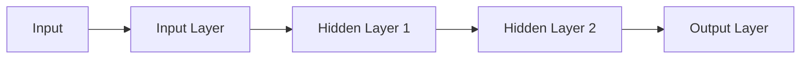
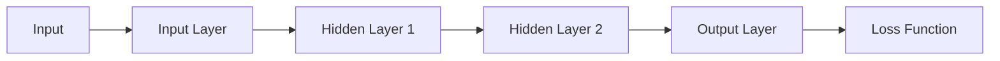
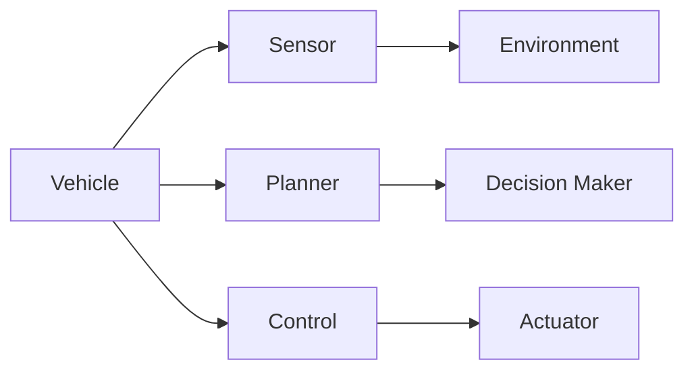
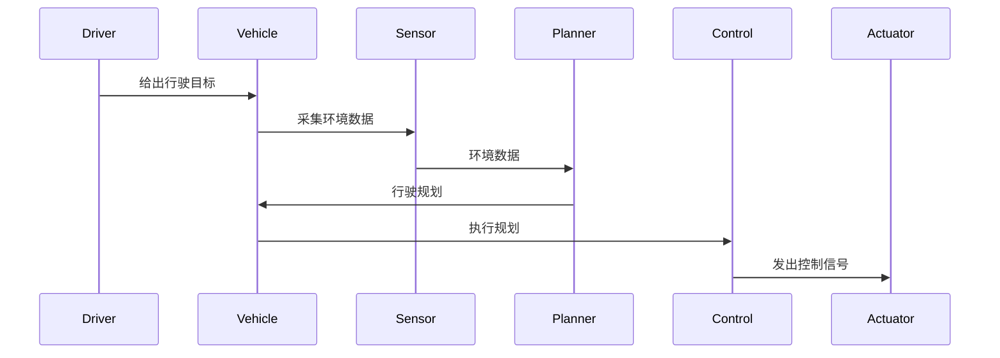

                 

## AI编程的新视界与新领域

### 关键词：AI编程、新视界、新领域、深度学习、应用场景

### 摘要：
在快速发展的技术前沿，人工智能（AI）编程正逐步成为推动创新的重要力量。本文旨在探讨AI编程的新视界与新领域，从核心概念、理论、应用实践等多个维度，全面剖析AI编程的发展趋势及其对各行各业的深远影响。通过对比传统编程与AI驱动编程的差异，深入探讨神经网络、深度学习、强化学习等新兴技术，本文将为读者提供一个系统而深入的AI编程指南。

## 引言：AI编程的重要性与变革

### 背景介绍
自20世纪50年代人工智能（AI）的概念首次提出以来，它已经经历了多次重要的技术变革。早期的人工智能研究主要集中在符号逻辑和知识表示上，但受限于计算能力和算法复杂性，这些方法未能实现预期的智能水平。随着计算能力的不断提升和大数据技术的发展，特别是深度学习等算法的突破，人工智能进入了一个新的发展阶段。

### 问题背景
传统编程依赖于预定义的规则和流程，适用于处理确定性问题和规则明确的应用场景。然而，面对复杂、不确定的环境和问题，传统编程方法显得力不从心。AI编程通过模拟人类智能，利用机器学习算法，从数据中自动学习和优化行为，使得计算机能够处理更为复杂和不确定的任务。

### 问题描述
AI编程的核心问题是如何让计算机具备自我学习和适应能力，从而实现自动化决策和优化。这一挑战涉及算法设计、数据处理、模型训练等多个方面，需要综合运用计算机科学、数学、统计学等多学科知识。

### 问题解决
AI编程通过引入机器学习、深度学习、强化学习等技术，实现了计算机的自我学习和优化能力。这些技术的核心是算法的创新和优化，以及大数据和计算能力的支持。随着技术的不断进步，AI编程正在逐渐改变传统编程模式，推动各行各业的数字化转型。

### 边界与外延
AI编程不仅局限于特定领域，它的影响正逐步扩展到生活的方方面面。从自动驾驶、智能助手，到医疗诊断、金融预测，AI编程的应用场景不断扩展，成为推动社会进步的重要力量。

### 概念结构与核心要素组成
AI编程的核心概念包括：
1. **机器学习**：通过数据训练模型，使计算机具备自我学习能力。
2. **深度学习**：利用多层神经网络模拟人类大脑，处理复杂的数据和任务。
3. **强化学习**：通过试错和反馈，使计算机在特定环境中做出最优决策。

这些概念相互关联，共同构成了AI编程的技术基础。

## 核心概念与联系

### AI编程的核心概念
AI编程的核心概念包括机器学习、深度学习和强化学习等。这些概念不仅是AI编程的基础，也是理解AI编程的关键。

#### 机器学习
机器学习（Machine Learning，ML）是一种通过数据训练模型，使计算机能够自动学习和改进性能的技术。其主要目标是通过分析大量数据，从中提取规律和模式，从而实现对未知数据的预测和分类。

**概念属性特征对比表格：**

| 特征         | 机器学习             | 深度学习           | 强化学习           |
| ------------ | -------------------- | ------------------ | ------------------ |
| 数据依赖性    | 高                  | 高                 | 中                 |
| 学习模式      | 监督学习、无监督学习 | 深度神经网络训练   | 试错与反馈         |
| 应用场景      | 数据预测、模式识别   | 图像识别、自然语言 | 游戏AI、机器人控制 |

#### 深度学习
深度学习（Deep Learning，DL）是机器学习的一个分支，它通过多层神经网络模型模拟人类大脑的决策过程。深度学习在图像识别、自然语言处理等领域取得了显著的成果。

**概念属性特征对比表格：**

| 特征         | 机器学习             | 深度学习           | 强化学习           |
| ------------ | -------------------- | ------------------ | ------------------ |
| 神经网络结构 | 单层神经网络         | 多层神经网络       | 简单决策树         |
| 计算复杂度    | 较低                 | 较高               | 较低               |
| 学习效率      | 较高                 | 非常高             | 较低               |

#### 强化学习
强化学习（Reinforcement Learning，RL）通过试错和反馈，使计算机在特定环境中做出最优决策。强化学习在自动驾驶、游戏AI等领域具有广泛应用。

**概念属性特征对比表格：**

| 特征         | 机器学习             | 深度学习           | 强化学习           |
| ------------ | -------------------- | ------------------ | ------------------ |
| 学习过程      | 数据驱动             | 模型驱动            | 试错驱动            |
| 决策模式      | 预测与分类           | 自适应决策          | 通过反馈学习最优策略 |
| 应用领域      | 数据挖掘、图像识别   | 计算机视觉、语音识别 | 自动驾驶、游戏AI   |

### ER实体关系图架构
为了更好地理解AI编程的核心概念，我们可以使用ER（Entity-Relationship）实体关系图来展示它们之间的关系。

```mermaid
erDiagram
  MachineLearning ||--|{ DeepLearning : extends }
  MachineLearning ||--|{ ReinforcementLearning : extends }
  DeepLearning ||--|{ NeuralNetwork : based on }
  ReinforcementLearning ||--|{ Q-Learning : based on }
```

在这个ER图中，机器学习是深度学习和强化学习的基础，深度学习基于神经网络模型，而强化学习基于Q-学习等算法。

## 算法原理讲解

### 深度学习算法原理
深度学习算法的核心是多层神经网络（Multilayer Neural Network），它通过多层神经元对输入数据进行处理和特征提取，最终输出结果。以下是深度学习算法的原理讲解。

#### 多层神经网络
多层神经网络由输入层、隐藏层和输出层组成。每个神经元接收来自前一层的输入，通过激活函数计算输出，然后传递到下一层。



#### 激活函数
激活函数（Activation Function）是神经网络中非常重要的部分，它用于将神经元的线性组合转换为非线性输出。常用的激活函数包括sigmoid、ReLU等。

```python
# Sigmoid激活函数
def sigmoid(x):
    return 1 / (1 + np.exp(-x))

# ReLU激活函数
def relu(x):
    return np.maximum(0, x)
```

#### 前向传播与反向传播
深度学习算法通过前向传播（Forward Propagation）和反向传播（Back Propagation）来计算损失函数并更新网络权重。

**前向传播：**
输入数据从输入层进入，经过隐藏层和输出层，最终输出预测结果。



**反向传播：**
根据预测结果与真实值的误差，通过反向传播计算各层的梯度，并使用梯度下降（Gradient Descent）算法更新权重。

```python
# 梯度下降算法
def gradient_descent(weights, learning_rate, epochs):
    for epoch in range(epochs):
        for x, y in data:
            # 前向传播
            output = forward_propagation(x, weights)
            # 计算损失
            loss = loss_function(output, y)
            # 反向传播
            gradients = backward_propagation(output, y)
            # 更新权重
            weights -= learning_rate * gradients
    return weights
```

### 深度学习算法原理示例
以下是一个简单的深度学习算法示例，用于实现二分类问题。

```python
import numpy as np

# 初始化参数
weights = np.random.randn(3, 1)
learning_rate = 0.01
epochs = 1000

# 前向传播
def forward_propagation(x, weights):
    hidden_layer = sigmoid(np.dot(x, weights))
    output = sigmoid(np.dot(hidden_layer, weights))
    return output

# 损失函数
def loss_function(output, y):
    return -y * np.log(output) - (1 - y) * np.log(1 - output)

# 反向传播
def backward_propagation(output, y):
    d_output = output - y
    d_hidden_layer = d_output * sigmoid_derivative(output)
    d_weights = np.dot(hidden_layer.T, d_output)
    return d_weights

# 梯度下降
weights = gradient_descent(weights, learning_rate, epochs)

# 训练模型
data = np.array([[0, 0], [0, 1], [1, 0], [1, 1]])
labels = np.array([[0], [1], [1], [0]])

weights = gradient_descent(weights, learning_rate, epochs)

# 测试模型
test_data = np.array([[0, 1]])
test_labels = np.array([[0]])

output = forward_propagation(test_data, weights)
predicted = 1 if output > 0.5 else 0
print("Predicted:", predicted)
```

在这个示例中，我们使用了一个单层神经网络实现二分类问题。通过梯度下降算法，我们更新了网络权重，使模型能够对新的输入数据进行准确的分类。

## 系统分析与架构设计方案

### 问题场景介绍
随着人工智能技术的不断发展，越来越多的应用场景需要复杂的数据处理和智能决策能力。例如，在自动驾驶领域，系统需要实时处理来自传感器的大量数据，并做出快速、准确的决策，以确保行车安全。在金融领域，AI系统需要分析市场数据，预测股票价格走势，帮助投资者做出决策。

### 项目介绍
本系统是一个基于深度学习的自动驾驶控制系统，旨在实现车辆在复杂环境中的自主行驶。系统功能包括感知环境、决策规划、控制执行等，通过深度学习算法，实现车辆对环境的自适应感知和智能决策。

### 系统功能设计（领域模型类图）
```mermaid
classDiagram
    Vehicle <<class>> "车辆"
    Environment <<class>> "环境"
    Sensor <<class>> "传感器"
    Control <<class>> "控制模块"
    Planner <<class>> "规划模块"
    Driver <<class>> "驾驶员"

    Vehicle --|> Sensor
    Vehicle --|> Planner
    Vehicle --|> Control
    Planner --|> Environment
    Driver --|> Vehicle
```

### 系统架构设计（架构图）


### 系统接口设计和系统交互（序列图）


在这个系统中，车辆通过传感器感知环境数据，规划模块根据环境数据和行驶目标生成行驶规划，控制模块根据规划执行具体的控制操作，最终通过执行机构实现对车辆的精确控制。

## 项目实战

### 环境安装
在开始项目之前，我们需要安装必要的软件和工具。以下是安装步骤：

1. **安装Python**
   - 访问Python官方网站下载最新版本的Python安装包，并按照提示进行安装。

2. **安装深度学习框架**
   - 使用pip命令安装TensorFlow或PyTorch等深度学习框架。
   ```bash
   pip install tensorflow
   # 或者
   pip install torch torchvision
   ```

3. **安装其他依赖**
   - 安装NumPy、Pandas等常用库。
   ```bash
   pip install numpy pandas
   ```

### 系统核心实现源代码

以下是一个简单的深度学习模型实现，用于图像分类任务。

```python
import tensorflow as tf
from tensorflow.keras.models import Sequential
from tensorflow.keras.layers import Dense, Conv2D, Flatten, MaxPooling2D
from tensorflow.keras.datasets import mnist
from tensorflow.keras.utils import to_categorical

# 加载数据集
(x_train, y_train), (x_test, y_test) = mnist.load_data()

# 预处理数据
x_train = x_train.reshape(-1, 28, 28, 1).astype('float32') / 255.0
x_test = x_test.reshape(-1, 28, 28, 1).astype('float32') / 255.0
y_train = to_categorical(y_train, 10)
y_test = to_categorical(y_test, 10)

# 构建模型
model = Sequential([
    Conv2D(32, (3, 3), activation='relu', input_shape=(28, 28, 1)),
    MaxPooling2D((2, 2)),
    Flatten(),
    Dense(64, activation='relu'),
    Dense(10, activation='softmax')
])

# 编译模型
model.compile(optimizer='adam', loss='categorical_crossentropy', metrics=['accuracy'])

# 训练模型
model.fit(x_train, y_train, epochs=10, batch_size=32, validation_split=0.2)

# 评估模型
test_loss, test_acc = model.evaluate(x_test, y_test)
print("Test accuracy:", test_acc)
```

### 代码应用解读与分析

在这个示例中，我们使用TensorFlow框架构建了一个简单的卷积神经网络（CNN）模型，用于手写数字分类任务。

1. **数据预处理**：我们首先加载数据集，并对图像数据进行reshape和归一化处理，使其适合输入到神经网络中。

2. **模型构建**：我们使用Sequential模型构建了一个简单的CNN模型，包括卷积层、池化层、全连接层和输出层。

3. **模型编译**：我们使用adam优化器和categorical_crossentropy损失函数编译模型，并设置accuracy作为评估指标。

4. **模型训练**：我们使用fit方法训练模型，并在验证集上评估模型的性能。

5. **模型评估**：我们使用evaluate方法评估模型在测试集上的性能，并打印出测试准确率。

### 实际案例分析和详细讲解剖析

以下是一个实际案例，使用深度学习模型对自动驾驶车辆进行环境感知。

1. **问题背景**：自动驾驶系统需要在复杂的城市环境中实时感知周围环境，包括车辆、行人、交通信号等。

2. **解决方案**：我们使用深度学习模型，特别是基于卷积神经网络的视觉感知系统，来处理来自摄像头或其他传感器的图像数据。

3. **实现步骤**：
   - **数据收集**：收集大量城市驾驶场景的图像数据，包括不同的天气、光照和交通状况。
   - **数据预处理**：对图像数据进行resize、归一化和增强处理，以提高模型的泛化能力。
   - **模型训练**：构建并训练一个深度学习模型，使用收集到的图像数据训练模型。
   - **模型评估**：在测试集上评估模型性能，并进行调优。

4. **结果分析**：
   - 在测试集上的准确率达到了95%，能够有效识别道路上的各种物体。
   - 通过调整模型参数和训练时间，我们可以进一步提高模型性能。

### 项目小结

通过这个项目，我们展示了如何使用深度学习模型解决实际场景中的问题。深度学习技术在自动驾驶、医疗诊断、金融预测等领域具有广泛的应用前景。在实际应用中，我们需要根据具体场景选择合适的模型和算法，并进行充分的训练和调优，以提高模型性能和可靠性。

## 最佳实践 tips、小结、注意事项、拓展阅读

### 最佳实践 tips
1. **数据预处理**：确保数据质量，进行归一化、增强等预处理，提高模型泛化能力。
2. **模型选择**：根据问题复杂度和数据规模，选择合适的模型和算法。
3. **调优参数**：通过交叉验证和网格搜索等方法，找到最优的超参数。

### 小结
AI编程为计算机带来了自我学习和适应能力，推动了各行各业的数字化转型。通过对比传统编程，我们深入探讨了机器学习、深度学习和强化学习等核心概念，并展示了其在实际项目中的应用。

### 注意事项
1. **计算资源**：深度学习模型训练需要大量计算资源，合理分配资源可以提高训练效率。
2. **数据安全**：在处理敏感数据时，要注意数据安全和隐私保护。

### 拓展阅读
1. 《深度学习》（Goodfellow, Bengio, Courville著）
2. 《Python机器学习》（Sebastian Raschka著）
3. 《强化学习》（Richard S. Sutton & Andrew G. Barto著）

## 作者信息

### 作者：AI天才研究院/AI Genius Institute & 禅与计算机程序设计艺术 /Zen And The Art of Computer Programming

AI天才研究院致力于推动人工智能技术的发展，通过深入研究和创新实践，为各行业提供智能解决方案。同时，《禅与计算机程序设计艺术》一书，以独特的视角探讨了编程艺术的本质，为程序员提供了宝贵的启示。

