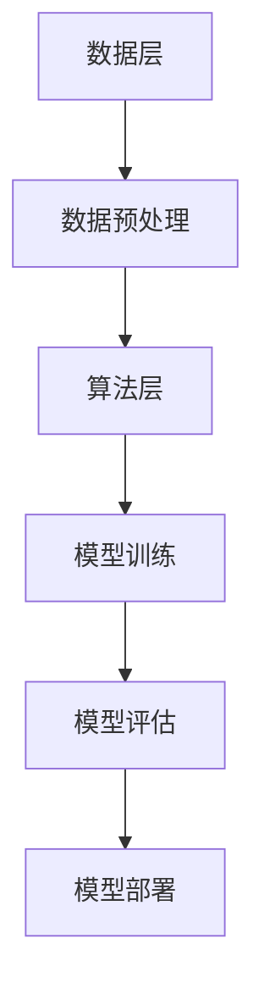
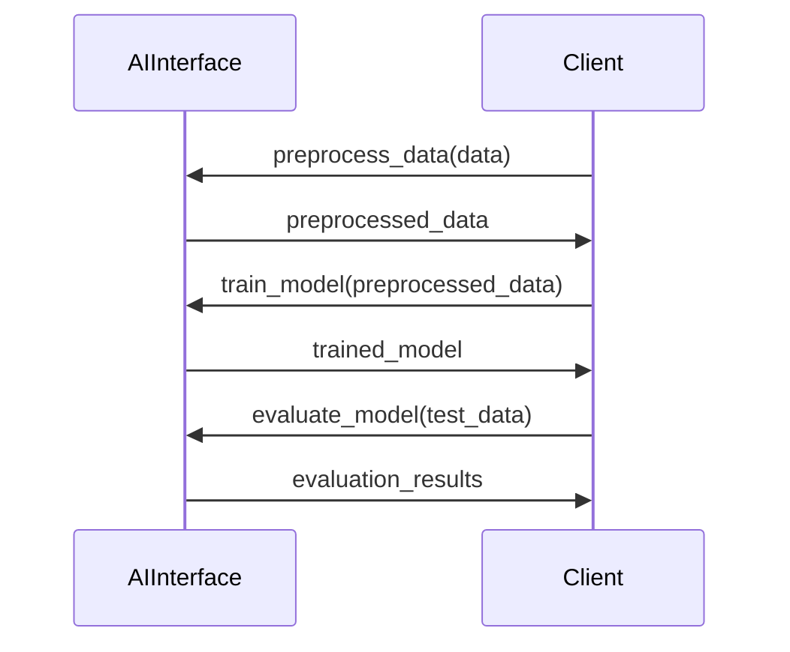

                 

# AI编程的新视界与新领域

## 关键词
- 人工智能编程
- 新兴领域
- 技术趋势
- 系统架构
- 项目实战

## 摘要
本文将深入探讨AI编程的新视界和新领域。我们将从AI编程的背景和基础出发，逐步分析核心概念、数学模型、系统架构，并通过实际项目实战来讲解AI编程的应用。最后，我们将总结最佳实践和注意事项，为读者提供全面的AI编程指导。

## 第一部分: AI编程的背景与基础

### 1.1 AI编程的崛起

#### 1.1.1 问题背景
人工智能（AI）作为计算机科学的一个重要分支，随着计算机性能的提升和算法的进步，逐渐成为改变世界的力量。从早期的专家系统到如今的深度学习，AI技术在各个领域都有广泛应用，推动了第四次工业革命的发展。

#### 1.1.2 问题描述
随着AI技术的迅猛发展，AI编程成为一个新的技术热点。AI编程不仅仅是编写代码，它涉及对人工智能算法的深入理解，以及对复杂系统架构的设计。如何将AI技术应用于实际问题，成为当前研究的一个关键问题。

#### 1.1.3 问题解决
为了解决上述问题，我们需要从多个角度来探讨AI编程。首先，我们需要了解AI编程的核心概念和原理。其次，我们需要掌握各种数学模型和算法，以及如何将它们应用于实际问题。最后，我们需要设计合理的系统架构，确保AI编程的效率和可靠性。

#### 1.1.4 边界与外延
AI编程不仅限于特定的领域，如图像识别、自然语言处理、决策支持等，还涉及跨学科的应用，如生物信息学、神经科学等。因此，AI编程的边界和外延是广阔的，为研究者提供了丰富的探索空间。

#### 1.1.5 概念结构与核心要素组成
AI编程的核心概念包括机器学习、深度学习、神经网络等。这些概念相互关联，共同构成了AI编程的理论基础。此外，数据预处理、模型评估、算法优化等也是AI编程的重要环节。

### 1.2 AI编程的核心概念

#### 1.2.1 AI编程的定义
AI编程是指利用人工智能技术来解决实际问题的一种编程方式。它不仅仅依赖于传统的编程语言，还需要结合算法、数据结构、系统设计等多个方面的知识。

#### 1.2.2 AI编程的特点
与传统的编程相比，AI编程具有更高的自动化程度、更强的适应能力和更广泛的应用范围。AI编程能够处理大量的数据，自动学习和优化算法，从而提高系统的性能和效率。

#### 1.2.3 AI编程与传统编程的比较
AI编程与传统编程在目标、方法、工具等方面都有显著的差异。传统编程侧重于逻辑和流程的控制，而AI编程侧重于数据的处理和模式的学习。

#### 1.2.4 AI编程的核心概念联系表
为了更好地理解AI编程的核心概念，我们可以通过一张联系表来展示它们之间的关系。

| 概念               | 关联概念                 | 解释                                                         |
|--------------------|--------------------------|------------------------------------------------------------|
| 机器学习           | 深度学习、强化学习       | 利用数据训练模型，使模型具备学习能力和自适应能力。           |
| 深度学习           | 神经网络、卷积神经网络   | 利用多层神经网络进行数据建模和学习。                         |
| 神经网络           | 反向传播、激活函数       | 通过模拟人脑神经网络的结构和工作原理来进行数据建模。         |
| 数据预处理         | 特征提取、数据清洗       | 对原始数据进行处理，提取有效特征，提高模型性能。             |
| 模型评估           | 准确率、召回率、F1值     | 对模型的性能进行评估和优化。                                 |

### 1.3 AI编程的数学模型

#### 1.3.1 数学模型基础
AI编程中的数学模型主要包括线性代数、微积分、概率论和统计学等。这些数学工具为AI算法提供了理论基础。

#### 1.3.2 数学模型的应用
数学模型在AI编程中的应用非常广泛，如神经网络中的权重更新、决策树中的信息增益等。

#### 1.3.3 数学公式示例
以下是一个简单的线性回归模型的数学公式：
$$
y = \beta_0 + \beta_1 * x
$$
其中，$y$ 是预测值，$x$ 是输入特征，$\beta_0$ 和 $\beta_1$ 是模型的参数。

### 1.4 AI编程的系统架构

#### 1.4.1 系统架构设计
AI编程的系统架构通常包括数据层、算法层和应用层。这种分层设计使得系统的扩展和维护更加方便。

#### 1.4.2 系统功能设计
系统功能设计包括数据采集、数据预处理、模型训练、模型评估和模型部署等。

#### 1.4.3 系统架构图
以下是一个简化的AI编程系统架构图：


#### 1.4.4 系统接口设计与交互
系统接口设计包括API的设计和系统之间的交互。以下是一个简单的API设计示例：
```python
class AIInterface:
    def preprocess_data(self, data):
        # 数据预处理代码
        pass
    
    def train_model(self, data):
        # 模型训练代码
        pass
    
    def evaluate_model(self, data):
        # 模型评估代码
        pass
```
系统交互可以使用序列图来描述，如下所示：


### 1.5 AI编程的项目实战

#### 1.5.1 实战环境安装
在进行AI编程项目实战之前，我们需要安装相关的环境和工具。以下是一个简化的安装步骤：
1. 安装Python环境。
2. 安装深度学习框架（如TensorFlow或PyTorch）。
3. 安装其他必要库（如NumPy、Pandas等）。

#### 1.5.2 系统核心实现
以下是一个简单的AI系统实现示例，使用TensorFlow框架：
```python
import tensorflow as tf

# 创建模型
model = tf.keras.Sequential([
    tf.keras.layers.Dense(128, activation='relu', input_shape=[784]),
    tf.keras.layers.Dropout(0.2),
    tf.keras.layers.Dense(10, activation='softmax')
])

# 编译模型
model.compile(optimizer='adam',
              loss='categorical_crossentropy',
              metrics=['accuracy'])

# 训练模型
model.fit(x_train, y_train, epochs=5)

# 评估模型
evaluation = model.evaluate(x_test, y_test)
print(f'测试准确率: {evaluation[1]}')
```

#### 1.5.3 代码解读与分析
在上面的代码中，我们首先定义了一个简单的神经网络模型，使用ReLU激活函数和Dropout层来提高模型的性能。然后，我们编译模型并使用训练数据对其进行训练。最后，我们使用测试数据评估模型的性能。

#### 1.5.4 实际案例分析
在实际项目中，我们需要根据具体问题来设计模型和算法。以下是一个简单的图像分类案例：
1. 数据采集：收集大量的图像数据。
2. 数据预处理：对图像进行尺寸调整、归一化等处理。
3. 模型设计：设计一个卷积神经网络模型。
4. 模型训练：使用训练数据训练模型。
5. 模型评估：使用测试数据评估模型性能。

#### 1.5.5 项目小结
通过实际案例分析，我们可以看到，AI编程项目通常涉及多个步骤，包括数据采集、预处理、模型设计、训练和评估等。这些步骤需要根据具体问题进行定制化设计。

### 1.6 AI编程的最佳实践与注意事项

#### 1.6.1 最佳实践
1. 熟悉AI编程的基础知识。
2. 选择合适的深度学习框架。
3. 设计合理的系统架构。
4. 进行充分的数据预处理。
5. 不断优化模型和算法。

#### 1.6.2 小结
本文从AI编程的背景和基础出发，分析了核心概念、数学模型、系统架构，并通过实际项目实战来讲解了AI编程的应用。通过本文的学习，读者可以掌握AI编程的基本知识和方法。

#### 1.6.3 注意事项
1. AI编程需要大量的数据支持，确保数据的质量和多样性。
2. 在模型训练过程中，注意监控模型性能，避免过拟合。
3. 在系统部署过程中，注意性能优化和安全性。

#### 1.6.4 拓展阅读
- 《深度学习》（Ian Goodfellow, Yoshua Bengio, Aaron Courville 著）
- 《Python深度学习》（François Chollet 著）
- 《机器学习实战》（Peter Harrington 著）

### 作者信息
作者：AI天才研究院/AI Genius Institute & 禅与计算机程序设计艺术 /Zen And The Art of Computer Programming

---

本文详细介绍了AI编程的新视界和新领域，通过逐步分析核心概念、数学模型、系统架构和项目实战，为读者提供了全面的AI编程指导。希望本文能够帮助读者深入理解AI编程的原理和应用，为未来的研究和实践打下坚实的基础。

