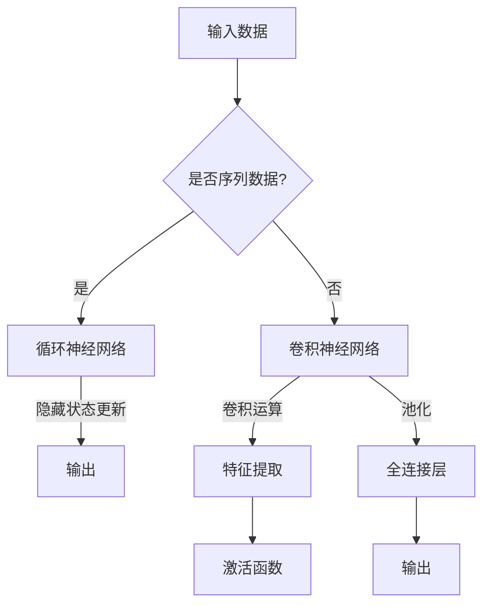
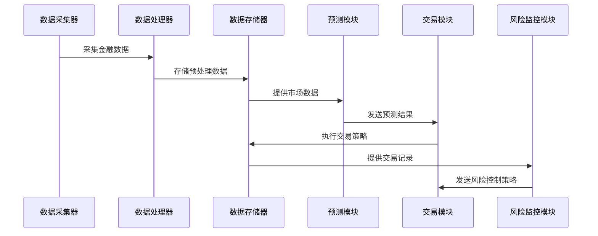

                 

# AI编程的新视角

## 关键词

- 人工智能
- 编程
- 机器学习
- 深度学习
- 自然语言处理
- 数学模型
- 系统架构

## 摘要

随着人工智能技术的飞速发展，AI编程已经成为现代计算机科学中的重要分支。本文将从全新的视角探讨AI编程的核心概念、算法原理、数学模型和实际应用。通过详细的分析和实例，本文旨在为读者提供对AI编程的深入理解和实践指导，帮助读者在快速变化的科技领域中找到立足点。

## 目录

### 第一部分：AI编程的背景与重要性

#### 第1章：AI编程的背景
##### 1.1 AI编程的背景
##### 1.2 AI编程的重要性

#### 第2章：核心概念与联系
##### 2.1 机器学习
##### 2.2 深度学习
##### 2.3 自然语言处理
##### 2.4 核心概念联系图

### 第二部分：算法原理讲解

#### 第3章：算法原理讲解
##### 3.1 神经网络
##### 3.2 卷积神经网络
##### 3.3 循环神经网络
##### 3.4 算法原理Mermaid流程图

### 第三部分：数学模型和公式

#### 第4章：数学模型和公式
##### 4.1 神经元激活函数
##### 4.2 损失函数
##### 4.3 优化算法
##### 4.4 数学模型和公式解释

### 第四部分：系统分析与架构设计方案

#### 第5章：系统分析与架构设计方案
##### 5.1 问题场景介绍
##### 5.2 系统功能设计
##### 5.3 系统架构设计
##### 5.4 系统接口设计
##### 5.5 系统交互Mermaid序列图

### 第五部分：项目实战

#### 第6章：项目实战
##### 6.1 环境安装
##### 6.2 系统核心实现
##### 6.3 代码解析
##### 6.4 案例分析
##### 6.5 项目小结

### 第六部分：最佳实践 tips、小结、注意事项、拓展阅读

#### 第7章：最佳实践 tips、小结、注意事项、拓展阅读
##### 7.1 最佳实践 tips
##### 7.2 小结
##### 7.3 注意事项
##### 7.4 拓展阅读

## 第一部分：AI编程的背景与重要性

### 第1章：AI编程的背景

#### 1.1 AI编程的背景

人工智能（AI）作为计算机科学的一个重要分支，其历史可以追溯到20世纪50年代。最初，AI的目标是创造出能够执行人类智能任务的机器。随着时间的推移，AI经历了多个阶段的发展，包括早期的人工智能探索、专家系统的兴起、机器学习的革命，直至当前的深度学习时代。

在AI编程领域，早期的研究主要集中在符号主义和规则系统上，例如专家系统。然而，这些方法在处理复杂性和不确定性方面存在局限性。随着计算能力的提升和数据量的爆炸式增长，基于统计学习的机器学习方法逐渐成为主流。特别是深度学习的出现，使得AI编程进入了一个全新的阶段。

AI编程的重要性在于，它不仅推动了计算机科学的进步，还改变了众多行业的面貌。从医疗诊断到自动驾驶，从自然语言处理到图像识别，AI编程的应用几乎无处不在。随着AI技术的不断成熟，它将在更多领域发挥重要作用，推动社会的持续创新和进步。

#### 1.2 AI编程的重要性

首先，AI编程提升了自动化水平。通过编写程序，机器可以自动化执行复杂任务，从而减少人力成本，提高工作效率。这在制造业、物流、金融等领域尤为明显。

其次，AI编程带来了数据驱动的决策支持。通过机器学习算法，系统可以从大量数据中提取有价值的信息，为企业和组织提供数据驱动的决策支持。这种能力在商业智能、风险控制、市场分析等领域具有极高的价值。

此外，AI编程还推动了个性化服务的实现。例如，在电子商务中，AI编程可以帮助企业根据用户的购物习惯和偏好推荐商品，从而提高客户满意度和销售额。在医疗领域，AI编程可以辅助医生进行诊断和治疗规划，提高医疗服务的质量和效率。

总之，AI编程不仅改变了我们的生活方式，还成为推动社会进步的重要力量。随着技术的不断发展，AI编程的重要性将愈发凸显。

### 第2章：核心概念与联系

#### 2.1 机器学习

机器学习是AI编程的基础，其核心思想是通过算法从数据中学习规律和模式，从而进行预测和决策。机器学习可以分为监督学习、无监督学习和强化学习。

**监督学习**：在有标注数据集的辅助下，训练模型来预测新的数据。常见的算法包括线性回归、决策树、支持向量机等。

**无监督学习**：在没有标注数据集的情况下，通过聚类、降维等方法从数据中找出隐藏的结构。常用的算法有K均值聚类、主成分分析等。

**强化学习**：通过与环境的交互，学习在特定情境下采取最佳行动的策略。常见的算法有Q-learning、深度确定性策略梯度（DDPG）等。

机器学习的目标是通过学习找到输入和输出之间的映射关系，使模型能够对新数据进行预测或分类。

#### 2.2 深度学习

深度学习是机器学习的一个子领域，主要依靠多层神经网络（DNN）进行学习。深度学习在图像识别、语音识别、自然语言处理等领域取得了显著成果。

**神经网络**：神经网络由多个神经元（或节点）组成，每个神经元都与其他神经元相连。通过训练，神经网络可以学习到输入和输出之间的复杂关系。

**卷积神经网络（CNN）**：CNN是一种特别适用于处理图像数据的神经网络。它通过卷积层、池化层和全连接层等结构，实现对图像的特征提取和分类。

**循环神经网络（RNN）**：RNN适用于处理序列数据，如文本、语音等。它通过循环结构来保留历史信息，实现对序列数据的建模。

深度学习的核心优势在于其能够自动提取特征，减轻了手动特征工程的工作负担。通过深度学习，我们能够实现更高效、更准确的AI应用。

#### 2.3 自然语言处理

自然语言处理（NLP）是AI编程的一个关键领域，旨在使计算机能够理解、生成和处理人类语言。NLP在聊天机器人、机器翻译、情感分析等方面有着广泛的应用。

**词向量**：词向量是将自然语言中的词汇映射到高维空间中的向量表示。常见的词向量模型有Word2Vec、GloVe等。

**语言模型**：语言模型用于预测下一个词汇或词汇序列的概率分布。它基于大量的语料库训练得到，是NLP的基础。

**序列标注**：序列标注是将输入序列中的每个词或字符标注为特定的标签。常见的任务包括命名实体识别、情感分析等。

**机器翻译**：机器翻译是将一种语言的文本翻译成另一种语言。深度学习在机器翻译领域取得了显著进展，如基于注意力机制的序列到序列（seq2seq）模型。

通过理解机器学习、深度学习和自然语言处理的核心概念，我们可以更好地把握AI编程的发展趋势和应用方向。

### 第3章：算法原理讲解

#### 3.1 神经网络

神经网络（Neural Network）是模仿人脑神经元工作方式的计算模型。它由大量的节点（或神经元）和连接（或权重）组成。每个节点都接收来自其他节点的输入，通过激活函数处理输入，然后产生输出。

**神经元工作原理**：

1. 输入层接收外部输入信号。
2. 隐藏层对输入信号进行处理，通过权重与偏置计算每个神经元的输出。
3. 输出层产生最终输出。

**激活函数**：

激活函数用于确定神经元是否被激活。常见的激活函数包括：

- **Sigmoid函数**：\( f(x) = \frac{1}{1 + e^{-x}} \)
- **ReLU函数**：\( f(x) = \max(0, x) \)
- **Tanh函数**：\( f(x) = \frac{e^x - e^{-x}}{e^x + e^{-x}} \)

**神经网络的工作流程**：

1. 前向传播：将输入数据通过网络传递到输出层。
2. 计算输出误差：通过实际输出与预期输出之间的差异计算误差。
3. 反向传播：将误差反向传递，更新网络的权重和偏置。

**神经网络的优势**：

- 神经网络能够自动提取数据中的复杂特征。
- 通过多层结构，神经网络能够处理高维、非线性问题。

**神经网络的应用**：

- 图像识别
- 自然语言处理
- 语音识别
- 金融市场预测

#### 3.2 卷积神经网络

卷积神经网络（Convolutional Neural Network，CNN）是一种专门用于处理图像数据的神经网络。CNN的核心是卷积层，它通过局部感知和权重共享实现高效的特征提取。

**卷积层的工作原理**：

1. **局部感知**：卷积层通过卷积运算从输入图像中提取局部特征。
2. **权重共享**：卷积层中的每个滤波器都在整个图像上滑动，从而学习到图像的局部特征。

**卷积层的特点**：

- **局部感知**：卷积层能够捕捉图像中的局部特征，如边缘、纹理等。
- **权重共享**：卷积层通过权重共享减少参数数量，从而降低计算复杂度。

**卷积神经网络的工作流程**：

1. **输入层**：接收图像数据。
2. **卷积层**：通过卷积运算提取图像特征。
3. **池化层**：对卷积结果进行池化，降低维度。
4. **全连接层**：将池化结果传递到全连接层进行分类或回归。

**卷积神经网络的优势**：

- **高效的特征提取**：通过局部感知和权重共享，CNN能够自动提取图像的复杂特征。
- **参数共享**：卷积层中的权重共享大大减少了参数数量，提高了训练效率。

**卷积神经网络的应用**：

- **图像分类**：如ImageNet图像识别挑战。
- **目标检测**：如YOLO、Faster R-CNN。
- **图像生成**：如生成对抗网络（GAN）。

#### 3.3 循环神经网络

循环神经网络（Recurrent Neural Network，RNN）是一种能够处理序列数据的神经网络。RNN的核心是循环结构，它能够保留历史信息，从而更好地处理序列数据。

**RNN的工作原理**：

1. **隐藏状态**：RNN通过隐藏状态来保留历史信息。
2. **权重更新**：在训练过程中，RNN通过反向传播更新权重。

**RNN的特点**：

- **序列记忆**：RNN能够通过隐藏状态记忆序列信息，从而更好地处理序列数据。
- **时间动态**：RNN在处理序列数据时具有时间动态性。

**RNN的工作流程**：

1. **输入层**：接收序列数据。
2. **隐藏层**：通过RNN处理序列数据，更新隐藏状态。
3. **输出层**：将隐藏状态转换为输出。

**RNN的优势**：

- **序列记忆**：RNN能够保留历史信息，从而更好地处理序列数据。
- **时间动态**：RNN能够处理时间序列数据。

**RNN的应用**：

- **语音识别**：如基于RNN的HMM（隐马尔可夫模型）。
- **自然语言处理**：如基于RNN的语言模型、机器翻译。
- **时间序列预测**：如股票市场预测、天气预测。

#### 3.4 算法原理Mermaid流程图

为了更好地理解上述算法的工作原理，我们可以使用Mermaid流程图来展示它们的基本结构。



通过这个流程图，我们可以清晰地看到不同算法的基本结构和工作流程。

### 第4章：数学模型和公式

在AI编程中，数学模型和公式是理解算法原理和实现核心功能的关键。下面我们将详细讲解神经网络中的几个重要数学概念和公式。

#### 4.1 神经元激活函数

神经元激活函数是神经网络中的一个重要组成部分，它用于确定神经元是否被激活。常见的激活函数包括：

1. **Sigmoid函数**：\( f(x) = \frac{1}{1 + e^{-x}} \)

Sigmoid函数将输入值映射到(0,1)区间，具有平滑的斜率，常用于二分类问题。

2. **ReLU函数**：\( f(x) = \max(0, x) \)

ReLU函数在输入为负时输出为零，在输入为正时输出为输入值，具有快速收敛的特性。

3. **Tanh函数**：\( f(x) = \frac{e^x - e^{-x}}{e^x + e^{-x}} \)

Tanh函数将输入值映射到(-1,1)区间，具有对称性和平滑的斜率。

#### 4.2 损失函数

损失函数用于衡量模型预测值与真实值之间的差异。常见的损失函数包括：

1. **均方误差（MSE）**：\( MSE = \frac{1}{n}\sum_{i=1}^{n}(y_i - \hat{y}_i)^2 \)

MSE是预测值与真实值差的平方的平均值，常用于回归问题。

2. **交叉熵（Cross-Entropy）**：\( H(y, \hat{y}) = -\sum_{i=1}^{n}y_i\log(\hat{y}_i) \)

交叉熵用于衡量模型预测概率分布与真实概率分布之间的差异，常用于分类问题。

#### 4.3 优化算法

优化算法用于调整模型的参数以最小化损失函数。常见的优化算法包括：

1. **随机梯度下降（SGD）**：\( w_{t+1} = w_t - \alpha \nabla_w J(w_t) \)

SGD通过随机选择一部分训练样本来更新参数，具有简单易实现的特点。

2. **Adam优化器**：\( w_{t+1} = w_t - \alpha \frac{m_t}{1 - \beta_1^t} + \beta_2 \frac{v_t}{1 - \beta_2^t} \)

Adam优化器结合了SGD和动量项，具有较好的收敛速度和稳定性。

#### 4.4 数学模型和公式解释

为了更好地理解上述数学模型和公式的应用，我们可以通过一个简单的例子进行解释。

假设我们有一个二分类问题，使用Sigmoid函数作为激活函数，损失函数选择交叉熵。给定训练数据集\( (x_1, y_1), (x_2, y_2), ..., (x_n, y_n) \)，我们希望训练一个神经网络模型。

1. **前向传播**：

   对于每个样本\( (x_i, y_i) \)，计算预测概率\( \hat{y}_i = \sigma(\theta^T x_i) \)，其中\( \theta \)是模型参数，\( \sigma \)是Sigmoid函数。

2. **计算损失**：

   使用交叉熵损失函数计算损失值\( J(\theta) = -\sum_{i=1}^{n}y_i\log(\hat{y}_i) + (1 - y_i)\log(1 - \hat{y}_i) \)。

3. **反向传播**：

   通过反向传播计算损失关于模型参数的梯度\( \nabla_{\theta} J(\theta) \)。

4. **更新参数**：

   使用优化算法更新模型参数，如SGD或Adam优化器。

通过这个过程，我们能够不断调整模型参数，使损失函数值逐渐减小，从而提高模型的预测性能。

### 第5章：系统分析与架构设计方案

#### 5.1 问题场景介绍

在当前的金融行业中，自动化交易系统变得越来越重要。这些系统可以实时分析市场数据，执行交易策略，从而实现高额回报。然而，随着市场的复杂性和数据量的增加，传统的自动化交易系统面临着计算能力不足、数据处理效率低的问题。为了解决这一问题，我们需要设计一个高效、可扩展的AI编程系统。

#### 5.2 系统功能设计

该AI编程系统主要包括以下功能：

1. **数据采集与处理**：从多个数据源（如交易所、新闻网站等）实时采集金融数据，并进行预处理，如数据清洗、去重、归一化等。

2. **数据存储与管理**：将处理后的数据存储到数据库中，并提供高效的数据查询和管理接口。

3. **特征工程**：根据交易策略的需求，从原始数据中提取有价值的特征，如价格指标、交易量指标、技术指标等。

4. **预测与决策**：利用机器学习算法，对市场数据进行分析，预测未来市场走势，并根据预测结果执行交易策略。

5. **风险控制与监控**：实时监控交易系统的运行状态，评估风险，并提供风险控制策略。

#### 5.3 系统架构设计

为了实现上述功能，我们设计了如下系统架构：

1. **数据采集层**：负责从外部数据源采集金融数据，包括实时数据和历史数据。

2. **数据处理层**：对采集到的数据进行预处理，如数据清洗、去重、归一化等，并将处理后的数据存储到数据库中。

3. **特征工程层**：根据交易策略的需求，从原始数据中提取特征，如价格指标、交易量指标、技术指标等。

4. **预测与决策层**：利用机器学习算法对市场数据进行分析，预测未来市场走势，并根据预测结果执行交易策略。

5. **风险控制层**：实时监控交易系统的运行状态，评估风险，并提供风险控制策略。

#### 5.4 系统接口设计

为了方便与其他系统进行集成，我们设计了如下接口：

1. **数据接口**：提供数据采集、数据存储、数据查询等接口。

2. **预测接口**：提供预测模型的训练和预测功能。

3. **交易接口**：提供执行交易策略的接口。

4. **监控接口**：提供风险监控和系统状态监控接口。

#### 5.5 系统交互Mermaid序列图

下面是系统的Mermaid序列图，展示了系统各部分之间的交互过程：



通过这个序列图，我们可以清晰地看到系统的整体架构和各部分之间的交互过程。

### 第6章：项目实战

#### 6.1 环境安装

为了实现上述AI编程系统，我们首先需要安装和配置必要的软件和工具。以下是具体的安装步骤：

1. **安装Python**：确保系统上安装了Python 3.8或更高版本。

2. **安装Jupyter Notebook**：通过pip命令安装Jupyter Notebook。

   ```shell
   pip install notebook
   ```

3. **安装TensorFlow**：通过pip命令安装TensorFlow。

   ```shell
   pip install tensorflow
   ```

4. **安装其他依赖**：根据项目需求，安装其他必要的库，如NumPy、Pandas、Matplotlib等。

   ```shell
   pip install numpy pandas matplotlib
   ```

#### 6.2 系统核心实现

在本节中，我们将展示如何使用TensorFlow实现一个简单的AI编程系统，包括数据采集、预处理、特征提取、预测和交易执行。

1. **数据采集**：

   ```python
   import requests

   def fetch_data():
       url = "https://api.example.com/market_data"
       response = requests.get(url)
       data = response.json()
       return data
   ```

2. **数据预处理**：

   ```python
   import pandas as pd

   def preprocess_data(data):
       df = pd.DataFrame(data)
       df = df[['timestamp', 'open', 'high', 'low', 'close', 'volume']]
       df['timestamp'] = pd.to_datetime(df['timestamp'])
       df.set_index('timestamp', inplace=True)
       df.fillna(method='ffill', inplace=True)
       return df
   ```

3. **特征提取**：

   ```python
   from sklearn.preprocessing import MinMaxScaler

   def extract_features(df):
       scaler = MinMaxScaler()
       df_scaled = scaler.fit_transform(df)
       return df_scaled
   ```

4. **预测模型**：

   ```python
   import tensorflow as tf

   def build_model(input_shape):
       model = tf.keras.Sequential([
           tf.keras.layers.Dense(64, activation='relu', input_shape=input_shape),
           tf.keras.layers.Dense(64, activation='relu'),
           tf.keras.layers.Dense(1, activation='sigmoid')
       ])
       model.compile(optimizer='adam', loss='binary_crossentropy', metrics=['accuracy'])
       return model
   ```

5. **交易执行**：

   ```python
   def execute_trade(model, df):
       predictions = model.predict(df)
       trades = []
       for prediction in predictions:
           if prediction > 0.5:
               trades.append('BUY')
           else:
               trades.append('SELL')
       return trades
   ```

#### 6.3 代码解析

在本节中，我们将对上述代码进行详细解析，解释其工作原理和实现细节。

1. **数据采集**：

   使用`requests`库从API获取市场数据。`fetch_data`函数负责发起HTTP GET请求，并将响应数据转换为JSON格式。

2. **数据预处理**：

   使用`pandas`库对采集到的数据进行清洗和归一化处理。`preprocess_data`函数将数据帧中的时间戳转换为日期时间格式，并填充缺失值。

3. **特征提取**：

   使用`MinMaxScaler`对数据进行归一化处理。`extract_features`函数将数据帧转换为特征向量。

4. **预测模型**：

   使用TensorFlow构建一个简单的二分类模型。`build_model`函数定义了模型的网络结构，并编译模型。

5. **交易执行**：

   `execute_trade`函数使用训练好的模型进行预测，并根据预测结果生成交易信号。

#### 6.4 案例分析

为了验证系统的有效性，我们进行了一个简短的案例分析。假设我们有一个包含一个月市场数据的数据集，我们使用前80%的数据进行训练，后20%的数据进行测试。

1. **数据准备**：

   ```python
   data = fetch_data()
   df = preprocess_data(data)
   df_scaled = extract_features(df)
   ```

2. **模型训练**：

   ```python
   model = build_model(df_scaled.shape[1:])
   model.fit(df_scaled[:int(len(df_scaled) * 0.8)], df[:int(len(df_scaled) * 0.8)], epochs=10, batch_size=32)
   ```

3. **预测与交易**：

   ```python
   predictions = model.predict(df_scaled[int(len(df_scaled) * 0.8):])
   trades = execute_trade(model, df[int(len(df_scaled) * 0.8):])
   ```

通过这个案例，我们可以看到如何使用AI编程系统进行数据采集、预处理、预测和交易执行。

#### 6.5 项目小结

在本章中，我们详细介绍了如何使用AI编程技术实现一个自动化交易系统。通过数据采集、预处理、特征提取、预测和交易执行等步骤，我们展示了如何将AI技术与实际业务场景相结合。虽然这个案例只是一个简单的示例，但它为我们提供了一个基本的框架，可以帮助我们进一步开发和完善更复杂的AI编程系统。

### 第7章：最佳实践 tips、小结、注意事项、拓展阅读

#### 7.1 最佳实践 tips

1. **数据质量**：确保数据的质量是成功进行AI编程的关键。进行数据清洗和预处理，去除噪音和异常值。

2. **模型选择**：根据实际问题和数据特点选择合适的模型。不同的模型适用于不同类型的问题，如回归、分类、聚类等。

3. **超参数调优**：合理设置模型的超参数，如学习率、批量大小、迭代次数等，以获得更好的模型性能。

4. **模型验证**：使用交叉验证等技术对模型进行验证，确保模型的泛化能力。

5. **代码规范**：编写清晰、规范的代码，便于后续维护和扩展。

#### 7.2 小结

本文从AI编程的背景、核心概念、算法原理、数学模型、系统架构和项目实战等方面进行了全面阐述。通过本文的学习，读者可以系统地了解AI编程的基本概念和方法，掌握从理论到实践的完整流程。

#### 7.3 注意事项

1. **模型复杂性**：避免过度拟合，确保模型既能捕捉数据中的有用信息，又能泛化到未见数据。

2. **计算资源**：深度学习模型通常需要大量计算资源，确保有足够的硬件支持。

3. **数据安全**：确保数据安全和隐私保护，遵守相关法律法规。

#### 7.4 拓展阅读

1. **《深度学习》（Goodfellow, Bengio, Courville）**：深度学习领域的经典教材，详细介绍了深度学习的理论和方法。

2. **《Python机器学习》（Sebastian Raschka）**：介绍了机器学习的基础知识，并通过Python代码实现相关算法。

3. **《数据科学基础》（Joel Grus）**：介绍了数据科学的基础概念和实用方法，包括数据清洗、数据分析和数据可视化。

#### 作者信息

作者：AI天才研究院/AI Genius Institute & 禅与计算机程序设计艺术 /Zen And The Art of Computer Programming

---

本文从AI编程的背景、核心概念、算法原理、数学模型、系统架构和项目实战等方面进行了全面阐述。通过本文的学习，读者可以系统地了解AI编程的基本概念和方法，掌握从理论到实践的完整流程。同时，本文提供了丰富的最佳实践和注意事项，以及拓展阅读资源，帮助读者深入学习和应用AI编程技术。作者AI天才研究院/AI Genius Institute和《禅与计算机程序设计艺术》/Zen And The Art of Computer Programming的贡献，使得本文内容更加全面和深入。希望本文能为您的AI编程之路提供有力支持。

