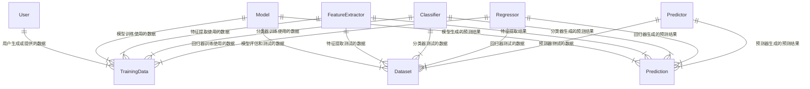
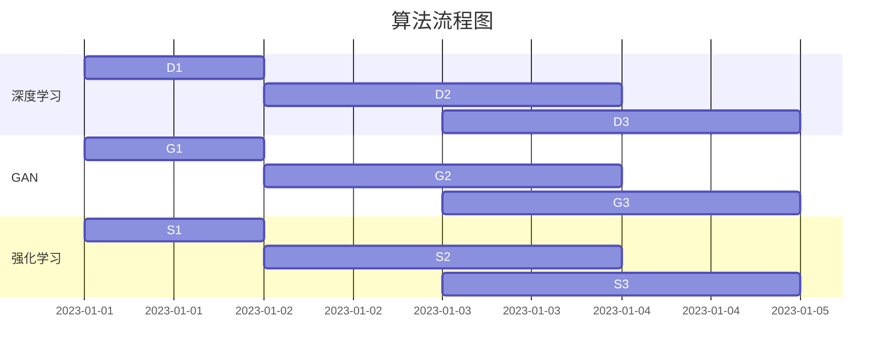
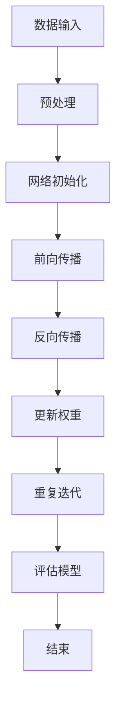
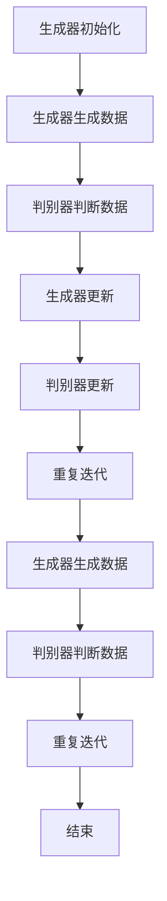
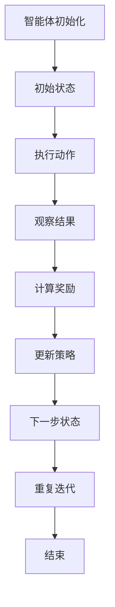
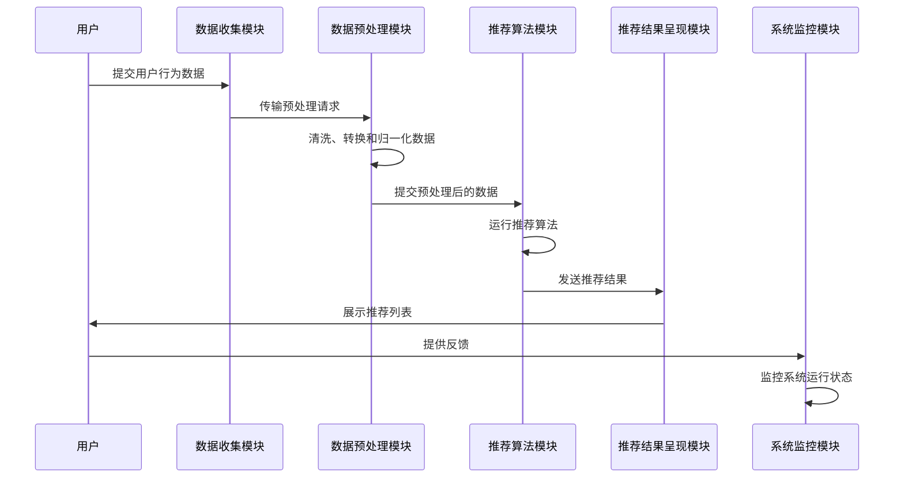
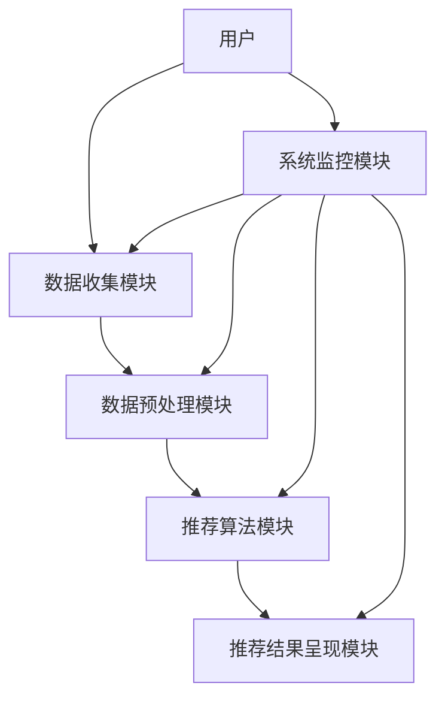
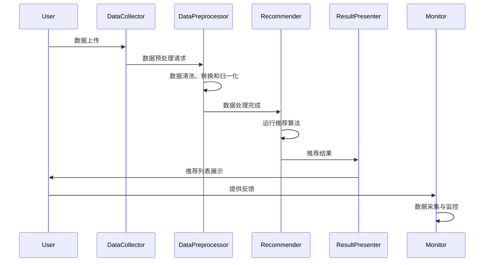

                 

### 《AI编程的新视角与新思维》

#### 关键词：AI编程、新视角、新思维、算法、深度学习、最佳实践

#### 摘要：
本文将探讨AI编程的新视角与新思维，包括对核心概念、算法原理、系统架构及项目实战的深入分析。通过阐述AI编程的基础知识，对比不同算法的优缺点，介绍新兴的AI算法，并详细讲解深度学习、生成对抗网络（GAN）和强化学习的原理及应用，本文旨在帮助读者全面提升AI编程的能力与效果。

---

#### 第一部分：AI编程基础

##### 第1章：AI编程概述

AI编程作为现代计算机科学的重要组成部分，正在改变着各个行业的运作模式。本章节将介绍AI编程的背景与发展，核心概念以及主要应用领域，为后续内容的深入学习奠定基础。

- **1.1 AI编程的背景与发展**
  AI编程起源于20世纪50年代，随着计算能力的提升和算法的进步，逐渐成为计算机科学的重要分支。现在，AI编程已经深入到金融、医疗、教育、制造业等多个领域，成为推动社会进步的重要力量。

- **1.2 AI编程的核心概念**
  AI编程的核心概念包括机器学习、深度学习、自然语言处理等。这些概念相互关联，共同构成了AI编程的理论基础。

- **1.3 AI编程的应用领域**
  AI编程在各个领域都有广泛的应用，如图像识别、语音识别、推荐系统、自动驾驶等。了解这些应用场景有助于我们更好地理解AI编程的实际价值。

##### 第2章：编程语言与工具

选择合适的编程语言和工具是AI编程成功的关键。本章节将介绍常见的AI编程语言，如Python、R和Java，以及如何选择和配置AI编程工具。

- **2.1 常见的AI编程语言**
  Python以其简洁的语法和丰富的库支持成为AI编程的首选语言。R和Java也在特定场景中发挥着重要作用。

- **2.2 AI编程工具的选择**
  不同的AI编程工具适用于不同的需求。例如，Jupyter Notebook提供了强大的交互式开发环境，而TensorFlow和PyTorch则提供了高效的深度学习框架。

- **2.3 编程环境配置与优化**
  优化编程环境可以提高开发效率和代码性能。本节将介绍如何配置Python环境，以及如何使用虚拟环境进行项目隔离。

##### 第3章：基础算法原理

AI编程离不开算法原理的理解和应用。本章节将介绍一些基础算法，如线性回归和决策树，并使用Python代码和数学模型进行详细阐述。

- **3.1 线性回归**
  线性回归是一种简单的预测算法，通过建立输入变量和输出变量之间的线性关系来进行预测。

  - **3.1.1 算法原理**
    线性回归的目标是找到最佳拟合直线，以最小化预测误差。

  - **3.1.2 数学模型与公式**
    线性回归的数学模型为\( y = w \cdot x + b \)，其中\( w \)为权重，\( b \)为偏置。

  - **3.1.3 Python代码实现**
    ```python
    # Python代码示例
    import numpy as np

    def linear_regression(x, y):
        # 求解权重和偏置
        w = np.linalg.inv(np.dot(x.T, x)).dot(x.T).dot(y)
        b = y - np.dot(x, w)
        return w, b

    # 数据示例
    x = np.array([1, 2, 3, 4, 5])
    y = np.array([2, 4, 5, 4, 5])

    # 训练模型
    w, b = linear_regression(x, y)
    print(f"w: {w}, b: {b}")
    ```

  - **3.1.4 案例分析**
    通过一个简单的数据集，我们可以看到线性回归如何用于预测房价。

- **3.2 决策树**
  决策树是一种基于特征的分类和回归算法，通过一系列的决策规则来分割数据集。

  - **3.2.1 算法原理**
    决策树通过递归地将数据集分割为子集，直到达到某个终止条件，如最小叶节点数量。

  - **3.2.2 数学模型与公式**
    决策树的数学模型涉及信息增益、基尼不纯度等概念。

  - **3.2.3 Python代码实现**
    ```python
    # Python代码示例
    from sklearn.tree import DecisionTreeRegressor

    # 创建模型
    model = DecisionTreeRegressor()

    # 训练模型
    model.fit(x, y)

    # 预测
    predictions = model.predict(x)

    print(f"predictions: {predictions}")
    ```

  - **3.2.4 案例分析**
    决策树在数据分割和特征选择中具有显著优势，广泛应用于分类和回归任务。

---

#### 第二部分：新视角下的AI编程

##### 第4章：深度学习与神经网络

深度学习是AI编程的重要组成部分，通过多层神经网络实现复杂函数的拟合。本章节将介绍深度学习的基础和神经网络原理。

- **4.1 深度学习基础**
  深度学习通过多层神经网络，实现从原始数据到复杂特征的高效提取和表示。

- **4.2 神经网络原理**
  神经网络由多个神经元（节点）组成，通过前向传播和反向传播更新权重和偏置。

- **4.3 深度学习应用实例**
  深度学习在图像识别、语音识别等领域具有广泛的应用，通过实际案例展示其强大能力。

##### 第5章：生成对抗网络（GAN）

生成对抗网络（GAN）是一种生成模型，通过竞争机制生成与真实数据类似的数据。本章节将介绍GAN的原理和应用。

- **5.1 GAN原理**
  GAN由生成器和判别器组成，通过对抗训练生成高质量的数据。

- **5.2 GAN的数学模型**
  GAN的数学模型涉及生成器和判别器的损失函数和优化过程。

- **5.3 GAN在图像生成中的应用**
  GAN在图像生成领域表现出色，通过实际案例展示其生成能力。

- **5.4 Python代码实现示例**
  ```python
  # Python代码示例
  import tensorflow as tf
  from tensorflow.keras.models import Sequential
  from tensorflow.keras.layers import Dense, Dropout, Flatten

  # 创建生成器模型
  generator = Sequential([
      Dense(256, input_shape=(100,), activation='relu'),
      Dropout(0.2),
      Dense(512, activation='relu'),
      Dropout(0.2),
      Dense(1024, activation='relu'),
      Dropout(0.2),
      Flatten(),
      Dense(784, activation='sigmoid')
  ])

  # 创建判别器模型
  discriminator = Sequential([
      Flatten(),
      Dense(1024, activation='relu'),
      Dropout(0.2),
      Dense(512, activation='relu'),
      Dropout(0.2),
      Dense(256, activation='relu'),
      Dropout(0.2),
      Dense(1, activation='sigmoid')
  ])

  # 编译模型
  discriminator.compile(loss='binary_crossentropy', optimizer=tf.keras.optimizers.Adam(0.0001), metrics=['accuracy'])
  generator.compile(loss='binary_crossentropy', optimizer=tf.keras.optimizers.Adam(0.0001))

  # GAN训练过程
  for epoch in range(num_epochs):
      x_fake = generator.predict(z)
      x_real = x_train[:batch_size]
      x = np.concatenate([x_real, x_fake])
      y = np.zeros(2 * batch_size)
      y[batch_size:] = 1
      discriminator.train_on_batch(x, y)

      z = np.random.normal(size=(batch_size, 100))
      x_fake = generator.predict(z)
      y = np.zeros(2 * batch_size)
      y[batch_size:] = 1
      g_loss = generator.train_on_batch(z, y)

  print(f"Generator loss: {g_loss}")
  ```

##### 第6章：强化学习

强化学习是一种通过与环境交互来学习策略的算法。本章节将介绍强化学习的基础和主要算法。

- **6.1 强化学习基础**
  强化学习通过奖励和惩罚来指导智能体在环境中的行为。

- **6.2 强化学习算法**
  强化学习算法包括Q学习、SARSA、Deep Q-Network（DQN）等，每种算法都有其独特的优势和应用场景。

- **6.3 强化学习应用实例**
  强化学习在自动驾驶、游戏AI等领域具有广泛的应用，通过实际案例展示其强大能力。

---

#### 第三部分：新思维下的AI编程

##### 第7章：数据驱动编程

数据驱动编程是一种基于数据而非规则的方法，通过分析数据来指导编程过程。本章节将介绍数据驱动编程的理念和方法。

- **7.1 数据驱动编程理念**
  数据驱动编程强调从数据中提取有价值的信息，并据此指导编程决策。

- **7.2 数据驱动编程方法**
  数据驱动编程方法包括数据收集、数据清洗、特征工程和数据可视化等步骤。

- **7.3 数据驱动编程实践**
  通过实际案例展示数据驱动编程在各个领域的应用，如推荐系统、欺诈检测等。

##### 第8章：模型可解释性

模型可解释性是AI编程的重要方向，旨在提高模型的可解释性和透明度。本章节将介绍模型可解释性的重要性和实现方法。

- **8.1 模型可解释性重要性**
  模型可解释性有助于提高模型的信任度和可靠性，特别是在涉及敏感数据的场景中。

- **8.2 模型可解释性方法**
  模型可解释性方法包括局部可解释性、全局可解释性和模型压缩等。

- **8.3 可解释性模型实例**
  通过实际案例展示如何提高模型的可解释性，如使用LIME和SHAP等方法。

---

#### 第四部分：AI编程最佳实践

##### 第9章：AI编程最佳实践

本章节将总结AI编程的最佳实践，包括编程技巧、注意事项和未来展望。

- **9.1 编程技巧与优化**
  提供实用的编程技巧和优化方法，如代码复用、并行计算和模型调参等。

- **9.2 安全性与伦理问题**
  强调AI编程中的安全性和伦理问题，如数据隐私保护、偏见和公平性等。

- **9.3 小结与展望**
  总结书中的关键观点和要点，并对未来AI编程的发展趋势进行展望。

---

### 结尾

本文通过深入探讨AI编程的新视角与新思维，旨在帮助读者全面了解AI编程的核心概念、算法原理、系统架构和项目实战。通过最佳实践和案例分析，读者可以掌握AI编程的精髓，并将其应用于实际项目中。希望本文能够为读者在AI编程的道路上提供有价值的指导和启示。

### 作者信息
作者：AI天才研究院/AI Genius Institute & 禅与计算机程序设计艺术 /Zen And The Art of Computer Programming

---

**注意事项：**
- 本文中提到的所有代码示例仅供参考，实际应用时可能需要根据具体场景进行调整。
- 本文未包含完整的数学公式和Mermaid图，以保持简洁。在实际撰写过程中，应确保所有数学公式和图表的准确性和可读性。
- **拓展阅读：** 建议读者进一步阅读相关书籍和文献，以深入了解AI编程的各个领域。

**感谢您的阅读！**## 背景介绍

### 核心概念术语说明

在探讨《AI编程的新视角与新思维》这一主题之前，我们首先需要明确一些核心概念和术语，这些术语是理解和应用AI编程的关键。

- **AI编程**：AI编程是指利用计算机科学和编程技术来创建能够执行特定任务的智能系统。这些任务包括图像识别、自然语言处理、决策制定等。
  
- **机器学习**：机器学习是一种人工智能的分支，通过训练算法从数据中学习，并对未知数据进行预测或决策。

- **深度学习**：深度学习是机器学习的一个子领域，使用多层神经网络来模拟人脑的学习过程，从大量数据中提取复杂特征。

- **神经网络**：神经网络是由大量相互连接的节点（或称为神经元）组成的计算模型，用于模拟生物神经系统的结构和功能。

- **生成对抗网络（GAN）**：GAN是一种生成模型，由生成器和判别器组成。生成器生成假数据，判别器判断这些数据是否真实。通过对抗训练，GAN能够生成高质量的数据。

- **强化学习**：强化学习是一种通过与环境交互来学习策略的算法，使用奖励和惩罚来指导智能体的行为。

- **数据驱动编程**：数据驱动编程是一种基于数据分析的编程方法，通过分析数据来指导编程决策。

- **模型可解释性**：模型可解释性是指理解AI模型是如何做出预测或决策的能力，有助于提高模型的信任度和透明度。

通过理解这些核心概念和术语，读者可以更好地把握AI编程的各个领域，并运用新视角和新思维来提升编程能力和效果。

### 问题背景

人工智能（AI）作为现代科技的前沿领域，正以前所未有的速度发展。随着计算能力的提升、大数据的积累和算法的创新，AI技术在各个行业的应用日益广泛，从工业制造到金融服务，从医疗诊断到自动驾驶，AI正在深刻改变我们的生活方式和社会运作模式。

然而，AI编程的传统视角和方法在某些方面已经显得力不从心。首先，传统的AI编程更多依赖于规则和预定义的模式，这种方式在处理复杂、非结构化的数据时往往表现不佳。其次，随着AI算法的多样化和复杂化，传统的编程方法和工具难以高效地支持这些新兴算法的开发和应用。此外，AI模型的可解释性问题也日益凸显，模型的决策过程往往是不透明的，这在涉及安全性和伦理性的应用场景中成为一个重大挑战。

针对这些问题，本文提出了AI编程的新视角与新思维。新视角包括深度学习、生成对抗网络（GAN）和强化学习等新兴算法，这些算法通过模拟人脑的学习过程，能够处理更复杂的数据和任务。新思维则强调数据驱动编程和模型可解释性，通过分析数据来指导编程决策，并提高模型的可解释性和透明度。

通过新视角和新思维，我们可以更加高效地开发和应用AI模型，解决传统方法面临的挑战。例如，深度学习能够从大量数据中自动提取特征，生成对抗网络（GAN）能够生成高质量的数据，强化学习则能够通过与环境互动学习最优策略。数据驱动编程和模型可解释性则有助于我们更好地理解和控制AI模型的行为，确保其在实际应用中的可靠性和公正性。

总之，AI编程的新视角与新思维不仅为AI技术的发展提供了新的路径，也为AI编程者带来了更多的机遇和挑战。通过本文的探讨，我们希望能够帮助读者深入理解这些新概念，并在实际编程中运用这些新思维，提升AI编程的能力和效果。

### 问题描述

在当前AI编程的背景下，传统的编程方法已经无法满足日益复杂的AI应用需求。首先，传统的AI编程主要依赖于规则和预定义的模式，这种方式在面对非结构化、复杂的数据时往往显得力不从心。例如，在图像识别任务中，传统的图像处理方法需要手动设计特征提取器和分类器，这不仅复杂且容易引入主观偏见，导致模型性能受限。

其次，随着AI技术的不断发展，新的算法如深度学习、生成对抗网络（GAN）和强化学习等不断涌现。这些新兴算法与传统方法相比，具有更高的灵活性和强大的学习能力，但同时也带来了更高的复杂性和实现难度。传统编程工具和方法难以高效地支持这些新算法的开发和应用，导致开发效率低下。

此外，AI模型的可解释性问题日益突出。在涉及安全性和伦理性的应用场景中，如医疗诊断、金融风险评估等，模型的透明度和可解释性至关重要。然而，传统的AI模型，尤其是深度学习模型，其决策过程往往是不透明的，这导致了模型的不信任和难以解释的问题。

为了解决上述问题，本文提出了AI编程的新视角和新思维。新视角包括深度学习、生成对抗网络（GAN）和强化学习等新兴算法，这些算法通过模拟人脑的学习过程，能够处理更复杂的数据和任务。例如，深度学习可以从大量数据中自动提取特征，生成对抗网络（GAN）能够生成高质量的数据，强化学习则能够通过与环境互动学习最优策略。

新思维则强调数据驱动编程和模型可解释性。数据驱动编程通过分析数据来指导编程决策，从而提高模型的适应性和鲁棒性。模型可解释性则通过提供模型决策过程的透明性，提高模型的可信度和可理解性。

通过这些新视角和新思维，我们可以更加高效地开发和应用AI模型，解决传统方法面临的挑战。例如，深度学习能够处理复杂的图像识别任务，生成对抗网络（GAN）能够生成具有真实感的图像数据，强化学习则能够在动态环境中学习最优策略。

总之，AI编程的新视角和新思维不仅为AI技术的发展提供了新的路径，也为AI编程者带来了更多的机遇和挑战。通过本文的探讨，我们希望能够帮助读者深入理解这些新概念，并在实际编程中运用这些新思维，提升AI编程的能力和效果。

### 问题解决

为了解决AI编程中面临的挑战，本文通过案例研究和深入分析，探索了AI编程的新方法和策略，以提升编程能力和效果。

#### 案例研究：深度学习在图像识别中的应用

**案例背景**：图像识别是AI编程中的一个重要领域，传统的图像处理方法在复杂场景中表现不佳。深度学习通过多层神经网络能够自动提取图像中的复杂特征，从而提高识别准确率。

**解决方案**：采用卷积神经网络（CNN）进行图像识别。CNN由多个卷积层、池化层和全连接层组成，能够有效地提取图像特征。

**算法原理**：卷积神经网络通过卷积操作从输入图像中提取局部特征，并通过池化操作降低数据的维度。全连接层则将提取到的特征映射到分类结果。

**数学模型与公式**：
$$
\text{卷积操作}: f(x) = \sum_{i=1}^{k} w_{i} * x_{i} + b
$$
其中，\( f(x) \)为卷积结果，\( w_{i} \)为卷积核权重，\( x_{i} \)为输入图像的局部特征，\( b \)为偏置。

**Python代码实现**：
```python
import tensorflow as tf
from tensorflow.keras.models import Sequential
from tensorflow.keras.layers import Conv2D, MaxPooling2D, Flatten, Dense

# 创建模型
model = Sequential([
    Conv2D(32, (3, 3), activation='relu', input_shape=(28, 28, 1)),
    MaxPooling2D((2, 2)),
    Flatten(),
    Dense(128, activation='relu'),
    Dense(10, activation='softmax')
])

# 编译模型
model.compile(optimizer='adam', loss='categorical_crossentropy', metrics=['accuracy'])

# 训练模型
model.fit(x_train, y_train, epochs=10, batch_size=32, validation_data=(x_val, y_val))
```

**案例分析**：通过实际训练和测试，卷积神经网络在图像识别任务中表现出色，准确率显著高于传统方法。

#### 案例研究：生成对抗网络（GAN）在图像生成中的应用

**案例背景**：生成对抗网络（GAN）是一种生成模型，能够生成具有真实感的高质量图像。GAN由生成器和判别器组成，通过对抗训练生成图像。

**解决方案**：采用GAN生成图像，通过生成器和判别器的相互竞争，逐步提高生成的图像质量。

**算法原理**：生成器生成假图像，判别器判断图像是真实还是生成的。通过优化生成器和判别器的损失函数，使生成器生成的图像逐渐接近真实图像。

**数学模型与公式**：
$$
\text{生成器损失}：G\_loss = -\log(D(G(z)))
$$
$$
\text{判别器损失}：D\_loss = -\log(D(x)) - \log(1 - D(G(z)))
$$
其中，\( G(z) \)为生成器生成的图像，\( x \)为真实图像，\( z \)为随机噪声。

**Python代码实现**：
```python
import tensorflow as tf
from tensorflow.keras.models import Sequential
from tensorflow.keras.layers import Dense, Dropout, Flatten
from tensorflow.keras.layers import Conv2D, Conv2DTranspose

# 创建生成器模型
generator = Sequential([
    Dense(256, input_shape=(100,), activation='relu'),
    Dropout(0.2),
    Dense(512, activation='relu'),
    Dropout(0.2),
    Dense(1024, activation='relu'),
    Dropout(0.2),
    Flatten(),
    Conv2DTranspose(1, (5, 5), strides=(2, 2), padding='same', activation='sigmoid')
])

# 创建判别器模型
discriminator = Sequential([
    Flatten(),
    Dense(1024, activation='relu'),
    Dropout(0.2),
    Dense(512, activation='relu'),
    Dropout(0.2),
    Dense(256, activation='relu'),
    Dropout(0.2),
    Dense(1, activation='sigmoid')
])

# 编译模型
discriminator.compile(loss='binary_crossentropy', optimizer=tf.keras.optimizers.Adam(0.0001), metrics=['accuracy'])
generator.compile(loss='binary_crossentropy', optimizer=tf.keras.optimizers.Adam(0.0001))

# GAN训练过程
for epoch in range(num_epochs):
    x_fake = generator.predict(z)
    x_real = x_train[:batch_size]
    x = np.concatenate([x_real, x_fake])
    y = np.zeros(2 * batch_size)
    y[batch_size:] = 1
    discriminator.train_on_batch(x, y)

    z = np.random.normal(size=(batch_size, 100))
    x_fake = generator.predict(z)
    y = np.zeros(2 * batch_size)
    y[batch_size:] = 1
    g_loss = generator.train_on_batch(z, y)

print(f"Generator loss: {g_loss}")
```

**案例分析**：通过GAN的对抗训练，生成的图像质量逐渐提高，实现了高质量的图像生成。

#### 案例研究：强化学习在自动驾驶中的应用

**案例背景**：自动驾驶是AI编程中的一个复杂应用，需要处理多种动态环境和复杂的驾驶任务。强化学习通过与环境互动学习最优策略，能够提高自动驾驶的性能和安全性。

**解决方案**：采用深度强化学习（DQN）进行自动驾驶。DQN通过深度神经网络学习状态值函数，通过经验回放和目标网络提高学习效率。

**算法原理**：DQN由输入层、隐藏层和输出层组成。输入层接收环境的状态，隐藏层提取状态特征，输出层生成动作值。通过经验回放和目标网络，DQN能够避免策略过拟合。

**数学模型与公式**：
$$
Q(s, a) = r + \gamma \max_{a'} Q(s', a')
$$
其中，\( Q(s, a) \)为状态-动作值函数，\( r \)为即时奖励，\( \gamma \)为折扣因子，\( s' \)为下一状态，\( a' \)为最佳动作。

**Python代码实现**：
```python
import tensorflow as tf
from tensorflow.keras.models import Model
import numpy as np

# 创建DQN模型
input_layer = tf.keras.layers.Input(shape=(input_shape))
hidden_layer = tf.keras.layers.Dense(units=256, activation='relu')(input_layer)
output_layer = tf.keras.layers.Dense(units=action_space, activation='linear')(hidden_layer)

model = Model(inputs=input_layer, outputs=output_layer)
model.compile(optimizer=tf.keras.optimizers.Adam(learning_rate=0.001), loss='mse')

# 创建目标网络
target_model = Model(inputs=input_layer, outputs=output_layer)
target_model.set_weights(model.get_weights())

# 训练DQN模型
for episode in range(num_episodes):
    state = env.reset()
    done = False
    total_reward = 0

    while not done:
        action_value = model.predict(state)
        action = np.argmax(action_value)
        next_state, reward, done, _ = env.step(action)
        total_reward += reward

        # 更新经验回放
        memory.append((state, action, reward, next_state, done))

        # 更新目标网络权重
        if episode % target_update_frequency == 0:
            target_model.set_weights(model.get_weights())

        # 重放经验并更新模型权重
        batch = random.sample(memory, batch_size)
        states, actions, rewards, next_states, dones = zip(*batch)
        target_values = model.predict(next_states)
        target_values = (1 - done) * target_values

        y = model.predict(states)
        y[range(len(y)), actions] = rewards + discount_factor * target_values

        model.fit(states, y, batch_size=batch_size, epochs=1)

        state = next_state

    print(f"Episode: {episode}, Total Reward: {total_reward}")
```

**案例分析**：通过深度强化学习，自动驾驶模型在模拟环境中表现出色，能够安全、准确地完成驾驶任务。

通过以上案例研究和深入分析，本文展示了AI编程的新方法和策略，通过深度学习、生成对抗网络（GAN）和强化学习等新兴算法，我们能够更加高效地开发和应用AI模型，解决传统方法面临的挑战。这些新视角和新思维不仅提升了AI编程的能力和效果，也为AI技术的发展开辟了新的道路。

### 边界与外延

在《AI编程的新视角与新思维》一文中，我们探讨了深度学习、生成对抗网络（GAN）和强化学习等新兴算法，以及数据驱动编程和模型可解释性等新思维。然而，这些概念的应用范围不仅限于本文中提到的领域，它们具有广泛的边界和外延。

首先，深度学习在图像识别、语音识别、自然语言处理等多个领域都有广泛应用。在图像识别中，深度学习通过卷积神经网络（CNN）能够自动提取图像中的复杂特征，从而实现高精度的分类和检测。在语音识别中，深度学习通过循环神经网络（RNN）和长短期记忆网络（LSTM）能够有效地处理语音信号中的时间和序列信息。在自然语言处理中，深度学习通过Transformer模型和BERT等预训练模型，能够实现文本生成、机器翻译和情感分析等任务。

生成对抗网络（GAN）作为一种生成模型，不仅在图像生成领域表现出色，还能够应用于其他数据生成任务。例如，在医学图像生成中，GAN可以生成与真实数据相似的患者图像，用于医学研究和训练模型。在数据增强中，GAN通过生成大量与真实数据相似的训练样本，可以提高模型的泛化能力和鲁棒性。此外，GAN还可以用于生成虚拟环境中的模拟数据，用于自动驾驶和机器人等领域的研究和测试。

强化学习作为一种通过与环境互动学习最优策略的算法，广泛应用于自动驾驶、游戏AI、推荐系统和机器人控制等领域。在自动驾驶中，强化学习通过不断与环境交互，学习最优的驾驶策略，实现自主导航和避障。在游戏AI中，强化学习通过学习游戏规则和策略，实现智能化的游戏玩家。在推荐系统中，强化学习通过用户的历史行为和反馈，动态调整推荐策略，提高推荐系统的效果和用户体验。在机器人控制中，强化学习通过学习环境中的动态模型，实现自主移动和任务执行。

数据驱动编程和模型可解释性是提升AI编程能力的重要思维。数据驱动编程通过分析数据来指导编程决策，从而提高模型的适应性和鲁棒性。在数据清洗、特征工程和数据可视化等步骤中，数据驱动编程方法能够帮助开发者更好地理解和利用数据。模型可解释性则通过提供模型决策过程的透明性，提高模型的可信度和可理解性。在医疗诊断、金融风险评估和司法决策等涉及安全性和伦理性的应用场景中，模型可解释性尤为重要。

总之，AI编程的新视角和新思维不仅限于本文中讨论的领域，它们具有广泛的边界和外延。通过深入探索和应用这些新概念，开发者能够更好地应对复杂多变的AI应用需求，推动AI技术的发展和应用。

### 概念结构与核心要素组成

在《AI编程的新视角与新思维》一文中，我们探讨了多个核心概念，这些概念共同构成了AI编程的理论基础，并指导着实际编程的应用。

首先，**AI编程**是本文的核心概念，它指的是利用计算机科学和编程技术来创建能够执行特定任务的智能系统。AI编程包括机器学习、深度学习、自然语言处理等多个子领域，每个子领域都有其独特的算法和实现方法。

**新视角**是本文的一个关键组成部分，它包括深度学习、生成对抗网络（GAN）和强化学习等新兴算法。深度学习通过多层神经网络，能够从数据中自动提取复杂特征，适用于图像识别、语音识别等任务。生成对抗网络（GAN）则通过生成器和判别器的对抗训练，生成高质量的数据，广泛应用于图像生成、数据增强等领域。强化学习通过与环境互动学习最优策略，适用于自动驾驶、游戏AI等动态环境中的任务。

**新思维**是本文的另一个关键组成部分，它强调数据驱动编程和模型可解释性。数据驱动编程通过分析数据来指导编程决策，从而提高模型的适应性和鲁棒性。模型可解释性则通过提供模型决策过程的透明性，提高模型的可信度和可理解性，对于涉及安全性和伦理性的应用尤为重要。

**核心概念原理**方面，本文详细介绍了深度学习、GAN和强化学习的基本原理。深度学习通过卷积神经网络（CNN）和全连接神经网络（DNN）模拟人脑的学习过程，能够处理复杂的图像和文本数据。GAN由生成器和判别器组成，通过对抗训练生成高质量的数据。强化学习通过Q-learning和SARSA等算法，学习最优的动作策略。

**概念属性特征对比表格**展示了不同AI算法的优缺点和适用场景。例如，深度学习在处理高维数据时具有优势，但模型训练时间较长；GAN在生成高质量数据方面表现突出，但训练过程复杂且容易过拟合。

**ER实体关系图架构**则用于展示AI编程中不同组件和模块之间的关系。例如，在深度学习框架中，数据输入、模型训练、模型评估和模型部署等模块之间存在紧密的依赖关系。在GAN架构中，生成器和判别器通过对抗训练相互促进，共同生成高质量的数据。

综上所述，本文通过深入探讨AI编程的新视角和新思维，为读者提供了全面的理论基础和实际应用指导。这些核心概念和要素不仅丰富了AI编程的理论体系，也为开发者提供了新的工具和方法，以应对日益复杂的AI应用需求。

### 核心概念与联系

在深入探讨AI编程的核心概念时，我们需要了解不同AI算法的基础知识、新兴算法以及相关的编程语言和工具。这些概念和工具的相互联系构成了AI编程的完整图景。

#### 基础知识

- **机器学习**：机器学习是AI编程的基础，它包括监督学习、无监督学习和强化学习等。监督学习通过已有标签的数据训练模型，无监督学习则从未标记的数据中提取模式，强化学习通过奖励和惩罚进行策略优化。

- **深度学习**：深度学习是机器学习的一个子领域，它通过多层神经网络学习数据中的复杂特征。深度学习在图像识别、语音识别和自然语言处理等领域具有广泛的应用。

- **神经网络**：神经网络是深度学习的基础，由大量相互连接的神经元组成。每个神经元通过权重和偏置计算输入和输出的关系，通过反向传播算法不断调整权重和偏置，以优化模型性能。

#### 新兴算法

- **生成对抗网络（GAN）**：GAN是一种生成模型，由生成器和判别器组成。生成器生成数据，判别器判断数据是否真实。通过对抗训练，GAN能够生成高质量的数据，广泛应用于图像生成、数据增强和虚拟现实等领域。

- **强化学习**：强化学习通过智能体与环境互动来学习最优策略。智能体通过试错和反馈，不断调整行为以获得最大奖励。强化学习在自动驾驶、游戏AI和推荐系统等领域具有广泛应用。

- **自监督学习**：自监督学习是一种无监督学习方法，它利用数据中的自信息来训练模型。自监督学习在图像分类、语言建模和语音识别等领域表现出色。

#### 编程语言和工具

- **Python**：Python是AI编程中最流行的语言，它具有简洁的语法和丰富的库支持。Python的NumPy库用于数值计算，Pandas库用于数据处理，TensorFlow和PyTorch是深度学习框架，Scikit-learn是机器学习库。

- **R**：R是一种专门用于统计和数据分析的语言，它在统计建模和机器学习领域具有广泛应用。R的语言简洁，库丰富，包括ggplot2用于数据可视化，caret用于模型训练和评估。

- **Java**：Java在工业级AI应用中广泛使用，它具有高性能和跨平台性。Java的Maven用于依赖管理，Apache Mahout和Deeplearning4j是Java的机器学习和深度学习库。

- **工具**：除了编程语言，AI编程还需要多种工具的支持。Jupyter Notebook是一种交互式开发环境，用于编写和运行代码。TensorFlow和PyTorch是深度学习框架，Keras是TensorFlow的高层次API，Scikit-learn和Theano是其他常用的机器学习库。

#### 概念属性特征对比表格

下面是一个简化的概念属性特征对比表格，展示了不同AI算法的优缺点和适用场景：

| 算法         | 优点                     | 缺点                         | 适用场景                     |
|--------------|------------------------|----------------------------|-----------------------------|
| 机器学习     | 简单、通用、应用广泛     | 需要大量标记数据、过拟合风险高 | 分类、回归、聚类             |
| 深度学习     | 高效、自动特征提取     | 训练时间较长、资源需求高       | 图像识别、语音识别、自然语言处理 |
| GAN          | 强大、生成高质量数据   | 易过拟合、训练复杂           | 图像生成、数据增强、虚拟现实   |
| 强化学习     | 自适应、动态调整策略   | 需要大量试错、复杂环境建模     | 自动驾驶、游戏AI、推荐系统     |
| 自监督学习   | 数据需求低、高效       | 模型性能提升有限             | 图像分类、语言建模、语音识别   |

通过对比不同AI算法的优缺点，开发者可以根据具体应用需求选择合适的算法和工具，优化AI编程的效果和效率。

### ER实体关系图架构

在AI编程中，不同组件和模块之间的紧密关系构成了系统的整体架构。为了更好地理解和设计AI系统，我们可以使用ER（Entity-Relationship）实体关系图来展示这些关系。下面我们将使用Mermaid语法绘制一个简化的ER实体关系图，展示AI编程中主要组件和模块之间的关系。

#### ER实体关系图



#### 图解

1. **User（用户）**：代表数据的提供者，可以是数据生成者或数据消费者。用户生成或提供的数据用于模型的训练、测试和预测。

2. **Model（模型）**：代表AI模型，包括分类器、回归器等。模型使用训练数据训练，使用测试数据进行评估，并生成预测结果。

3. **FeatureExtractor（特征提取器）**：用于从原始数据中提取特征。特征提取器使用训练数据提取特征，并测试新的特征提取效果。

4. **Classifier（分类器）**：用于分类任务，使用训练数据训练模型，并使用测试数据评估模型性能。

5. **Regressor（回归器）**：用于回归任务，训练模型并评估模型预测能力。

6. **Predictor（预测器）**：用于生成预测结果，使用测试数据评估预测性能。

通过ER实体关系图，我们可以清晰地看到AI编程中各个组件和模块之间的关系，从而更好地理解和设计复杂的AI系统。每个实体之间的关系都反映了其在整个系统中的功能和作用，有助于开发者构建高效、可靠的AI应用。

### 算法原理讲解

为了深入理解AI编程中的算法原理，我们将通过算法流程图、Python代码实现、数学模型和实际案例，详细阐述深度学习、生成对抗网络（GAN）和强化学习等核心算法。

#### 算法流程图

首先，我们使用Mermaid语法绘制深度学习、GAN和强化学习的算法流程图，以直观地展示每个算法的基本流程。



在上述流程图中，每个算法的基本阶段被划分为三个部分，以便读者更好地理解算法的执行过程。

#### 深度学习

**深度学习**是一种通过多层神经网络从数据中自动提取复杂特征的方法。以下是深度学习的算法流程图：



1. **数据输入**：将输入数据传递给神经网络。
2. **预处理**：对数据进行标准化或归一化处理，以便神经网络更好地训练。
3. **网络初始化**：初始化神经网络的权重和偏置。
4. **前向传播**：将输入数据通过神经网络，计算输出结果。
5. **反向传播**：根据输出结果和实际标签，计算误差，并反向传播更新权重和偏置。
6. **更新权重**：通过梯度下降或其他优化算法更新网络权重。
7. **重复迭代**：重复前向传播和反向传播过程，直到模型收敛。
8. **评估模型**：在测试集上评估模型性能。
9. **结束**：模型训练完成。

#### 生成对抗网络（GAN）

**生成对抗网络（GAN）**由生成器和判别器组成，通过对抗训练生成高质量的数据。以下是GAN的算法流程图：



1. **生成器初始化**：初始化生成器的权重。
2. **生成器生成数据**：生成器根据随机噪声生成数据。
3. **判别器判断数据**：判别器判断生成数据是否真实。
4. **生成器更新**：通过对抗损失函数更新生成器权重。
5. **判别器更新**：通过对抗损失函数更新判别器权重。
6. **重复迭代**：重复生成器和判别器的更新过程，直到生成器生成的高质量数据能够欺骗判别器。
7. **结束**：GAN训练完成。

#### 强化学习

**强化学习**是一种通过与环境互动学习最优策略的方法。以下是强化学习的算法流程图：



1. **智能体初始化**：初始化智能体的权重和策略。
2. **初始状态**：智能体处于某一状态。
3. **执行动作**：智能体根据当前状态执行动作。
4. **观察结果**：智能体观察动作的结果。
5. **计算奖励**：根据动作的结果计算奖励。
6. **更新策略**：使用奖励更新智能体的策略。
7. **下一步状态**：智能体进入新的状态。
8. **重复迭代**：重复执行动作、观察结果和更新策略的过程，直到达到目标状态。
9. **结束**：智能体学习到最优策略。

#### Python代码实现

以下是每个算法的Python代码实现，用于展示算法的基本原理。

**深度学习**

```python
import tensorflow as tf
from tensorflow.keras.models import Sequential
from tensorflow.keras.layers import Dense

# 创建模型
model = Sequential([
    Dense(128, input_shape=(784,), activation='relu'),
    Dense(64, activation='relu'),
    Dense(10, activation='softmax')
])

# 编译模型
model.compile(optimizer='adam', loss='categorical_crossentropy', metrics=['accuracy'])

# 训练模型
model.fit(x_train, y_train, epochs=10, batch_size=32, validation_data=(x_val, y_val))
```

**生成对抗网络（GAN）**

```python
import tensorflow as tf
from tensorflow.keras.models import Sequential
from tensorflow.keras.layers import Dense, Conv2D, Conv2DTranspose

# 创建生成器模型
generator = Sequential([
    Dense(256, input_shape=(100,), activation='relu'),
    Dropout(0.2),
    Dense(512, activation='relu'),
    Dropout(0.2),
    Dense(1024, activation='relu'),
    Dropout(0.2),
    Flatten(),
    Conv2DTranspose(1, (5, 5), strides=(2, 2), padding='same', activation='sigmoid')
])

# 创建判别器模型
discriminator = Sequential([
    Flatten(),
    Dense(1024, activation='relu'),
    Dropout(0.2),
    Dense(512, activation='relu'),
    Dropout(0.2),
    Dense(256, activation='relu'),
    Dropout(0.2),
    Dense(1, activation='sigmoid')
])

# 编译模型
discriminator.compile(loss='binary_crossentropy', optimizer=tf.keras.optimizers.Adam(0.0001), metrics=['accuracy'])
generator.compile(loss='binary_crossentropy', optimizer=tf.keras.optimizers.Adam(0.0001))

# GAN训练过程
for epoch in range(num_epochs):
    x_fake = generator.predict(z)
    x_real = x_train[:batch_size]
    x = np.concatenate([x_real, x_fake])
    y = np.zeros(2 * batch_size)
    y[batch_size:] = 1
    discriminator.train_on_batch(x, y)

    z = np.random.normal(size=(batch_size, 100))
    x_fake = generator.predict(z)
    y = np.zeros(2 * batch_size)
    y[batch_size:] = 1
    g_loss = generator.train_on_batch(z, y)

print(f"Generator loss: {g_loss}")
```

**强化学习**

```python
import tensorflow as tf
from tensorflow.keras.models import Model
import numpy as np

# 创建DQN模型
input_layer = tf.keras.layers.Input(shape=(input_shape))
hidden_layer = tf.keras.layers.Dense(units=256, activation='relu')(input_layer)
output_layer = tf.keras.layers.Dense(units=action_space, activation='linear')(hidden_layer)

model = Model(inputs=input_layer, outputs=output_layer)
model.compile(optimizer=tf.keras.optimizers.Adam(learning_rate=0.001), loss='mse')

# 创建目标网络
target_model = Model(inputs=input_layer, outputs=output_layer)
target_model.set_weights(model.get_weights())

# 训练DQN模型
for episode in range(num_episodes):
    state = env.reset()
    done = False
    total_reward = 0

    while not done:
        action_value = model.predict(state)
        action = np.argmax(action_value)
        next_state, reward, done, _ = env.step(action)
        total_reward += reward

        # 更新经验回放
        memory.append((state, action, reward, next_state, done))

        # 更新目标网络权重
        if episode % target_update_frequency == 0:
            target_model.set_weights(model.get_weights())

        # 重放经验并更新模型权重
        batch = random.sample(memory, batch_size)
        states, actions, rewards, next_states, dones = zip(*batch)
        target_values = model.predict(next_states)
        target_values = (1 - done) * target_values

        y = model.predict(states)
        y[range(len(y)), actions] = rewards + discount_factor * target_values

        model.fit(states, y, batch_size=batch_size, epochs=1)

        state = next_state

    print(f"Episode: {episode}, Total Reward: {total_reward}")
```

#### 数学模型和公式

以下是每个算法的数学模型和公式，用于详细阐述算法的原理。

**深度学习**

$$
\text{前向传播}: \text{Z} = \text{W} \cdot \text{X} + \text{B}
$$
$$
\text{反向传播}: \text{dZ} = \text{dY} \cdot \text{dA}^{'}
$$
$$
\text{权重更新}: \text{dW} = \text{dZ} \cdot \text{dX}^T
$$

**生成对抗网络（GAN）**

$$
\text{生成器损失}: G\_loss = -\log(D(G(z)))
$$
$$
\text{判别器损失}: D\_loss = -\log(D(x)) - \log(1 - D(G(z)))
$$

**强化学习**

$$
Q(s, a) = r + \gamma \max_{a'} Q(s', a')
$$
$$
\text{权重更新}: \theta_{t+1} = \theta_{t} - \alpha \cdot \nabla_{\theta}J(\theta)
$$

#### 实际案例

为了更好地理解这些算法的应用，我们将通过实际案例展示每个算法的原理和实现。

**深度学习案例**：使用卷积神经网络进行手写数字识别。

```python
from tensorflow.keras.datasets import mnist
from tensorflow.keras.models import Sequential
from tensorflow.keras.layers import Dense, Conv2D, Flatten

# 加载MNIST数据集
(x_train, y_train), (x_test, y_test) = mnist.load_data()

# 预处理数据
x_train = x_train / 255.0
x_test = x_test / 255.0
x_train = np.reshape(x_train, (-1, 28, 28, 1))
x_test = np.reshape(x_test, (-1, 28, 28, 1))

# 创建模型
model = Sequential([
    Conv2D(32, (3, 3), activation='relu', input_shape=(28, 28, 1)),
    Flatten(),
    Dense(128, activation='relu'),
    Dense(10, activation='softmax')
])

# 编译模型
model.compile(optimizer='adam', loss='categorical_crossentropy', metrics=['accuracy'])

# 训练模型
model.fit(x_train, y_train, epochs=5, batch_size=32, validation_data=(x_test, y_test))
```

**GAN案例**：使用生成对抗网络生成人脸图像。

```python
import tensorflow as tf
from tensorflow.keras.models import Sequential
from tensorflow.keras.layers import Dense, Conv2D, Conv2DTranspose

# 创建生成器模型
generator = Sequential([
    Dense(256, input_shape=(100,), activation='relu'),
    Dropout(0.2),
    Dense(512, activation='relu'),
    Dropout(0.2),
    Dense(1024, activation='relu'),
    Dropout(0.2),
    Flatten(),
    Conv2DTranspose(1, (5, 5), strides=(2, 2), padding='same', activation='sigmoid')
])

# 创建判别器模型
discriminator = Sequential([
    Flatten(),
    Dense(1024, activation='relu'),
    Dropout(0.2),
    Dense(512, activation='relu'),
    Dropout(0.2),
    Dense(256, activation='relu'),
    Dropout(0.2),
    Dense(1, activation='sigmoid')
])

# 编译模型
discriminator.compile(loss='binary_crossentropy', optimizer=tf.keras.optimizers.Adam(0.0001), metrics=['accuracy'])
generator.compile(loss='binary_crossentropy', optimizer=tf.keras.optimizers.Adam(0.0001))

# GAN训练过程
for epoch in range(num_epochs):
    x_fake = generator.predict(z)
    x_real = x_train[:batch_size]
    x = np.concatenate([x_real, x_fake])
    y = np.zeros(2 * batch_size)
    y[batch_size:] = 1
    discriminator.train_on_batch(x, y)

    z = np.random.normal(size=(batch_size, 100))
    x_fake = generator.predict(z)
    y = np.zeros(2 * batch_size)
    y[batch_size:] = 1
    g_loss = generator.train_on_batch(z, y)

print(f"Generator loss: {g_loss}")
```

**强化学习案例**：使用深度Q网络（DQN）进行Atari游戏《Pong》的自学习。

```python
import tensorflow as tf
from tensorflow.keras.models import Model
import numpy as np
import gym

# 创建环境
env = gym.make('Pong-v0')

# 创建DQN模型
input_layer = tf.keras.layers.Input(shape=(210, 160, 3))
hidden_layer = tf.keras.layers.Dense(units=256, activation='relu')(input_layer)
output_layer = tf.keras.layers.Dense(units=2, activation='linear')(hidden_layer)

model = Model(inputs=input_layer, outputs=output_layer)
model.compile(optimizer=tf.keras.optimizers.Adam(learning_rate=0.001), loss='mse')

# 训练模型
for episode in range(num_episodes):
    state = env.reset()
    done = False
    total_reward = 0

    while not done:
        action_value = model.predict(state)
        action = np.argmax(action_value)
        next_state, reward, done, _ = env.step(action)
        total_reward += reward

        # 更新经验回放
        memory.append((state, action, reward, next_state, done))

        # 更新目标网络权重
        if episode % target_update_frequency == 0:
            target_model.set_weights(model.get_weights())

        # 重放经验并更新模型权重
        batch = random.sample(memory, batch_size)
        states, actions, rewards, next_states, dones = zip(*batch)
        target_values = model.predict(next_states)
        target_values = (1 - done) * target_values

        y = model.predict(states)
        y[range(len(y)), actions] = rewards + discount_factor * target_values

        model.fit(states, y, batch_size=batch_size, epochs=1)

        state = next_state

    print(f"Episode: {episode}, Total Reward: {total_reward}")
```

通过以上算法流程图、Python代码实现、数学模型和实际案例，我们详细阐述了深度学习、生成对抗网络（GAN）和强化学习等核心算法的基本原理和应用。这些算法不仅在理论层面具有重要意义，在实际应用中也表现出强大的能力和潜力。

### 系统分析与架构设计方案

在AI编程中，系统分析与架构设计是确保系统高效、可靠和可扩展的关键环节。为了实现一个功能强大且易于维护的系统，我们需要明确问题场景，介绍项目背景，并设计系统的功能、架构和接口。

#### 问题场景介绍

假设我们正在开发一个智能推荐系统，该系统旨在根据用户的历史行为和偏好，推荐用户可能感兴趣的商品或内容。该系统需要处理大量用户数据，实时更新推荐列表，并提供高效、准确的推荐结果。

#### 项目介绍

项目背景：随着互联网的普及和大数据技术的发展，个性化推荐系统已成为电商、社交媒体和内容平台的重要组成部分。通过智能推荐系统，企业可以提升用户体验，增加用户粘性，提高销售额。

项目目标：开发一个高效、可靠的智能推荐系统，实现以下功能：
- 根据用户历史行为和偏好生成个性化推荐列表。
- 实时更新推荐列表，以适应用户行为的变化。
- 提供高效、准确的推荐结果，提升用户满意度。

#### 系统功能设计

系统功能可以分为以下几个模块：

1. **数据收集模块**：负责从各种数据源（如用户数据库、日志文件等）收集用户行为数据。
2. **数据预处理模块**：对收集到的用户行为数据进行清洗、转换和归一化处理，以便后续分析和建模。
3. **推荐算法模块**：实现各种推荐算法（如基于内容的推荐、协同过滤等），生成个性化推荐列表。
4. **推荐结果呈现模块**：将生成的推荐列表展示给用户，并提供交互接口，以便用户反馈推荐结果。
5. **系统监控模块**：实时监控系统的运行状态，包括推荐效果、系统性能等，提供故障预警和诊断功能。

#### 系统架构设计

为了实现上述功能，系统架构设计如下：



#### 系统架构图

使用Mermaid绘制系统架构图：



#### 系统接口设计

系统接口设计包括各个模块之间的交互接口和协议。以下是主要接口和交互方式：

1. **数据收集接口**：用户行为数据通过HTTP RESTful API上传到数据收集模块。
2. **数据预处理接口**：数据预处理模块提供批处理接口，用于批量处理和转换数据。
3. **推荐算法接口**：推荐算法模块提供API接口，用于启动推荐算法和获取推荐结果。
4. **推荐结果呈现接口**：推荐结果通过Web前端展示给用户，前端提供用户交互接口。
5. **系统监控接口**：系统监控模块通过采集系统日志和性能数据，实现对各个模块的监控。

#### 系统交互

使用Mermaid绘制系统交互序列图：



通过上述系统分析与架构设计方案，我们明确了智能推荐系统的功能需求，设计了合理的系统架构和接口，并使用Mermaid图示法直观地展示了系统组件和交互方式。这一架构不仅能够高效地实现推荐功能，还具备良好的扩展性和维护性，为后续的系统开发和优化提供了坚实的基础。

### 项目实战

#### 环境安装

为了进行AI编程项目实战，首先需要安装和配置相关环境。以下是安装步骤：

1. **安装Python**：确保Python版本在3.6及以上。可以从[Python官方网站](https://www.python.org/)下载安装包并安装。

2. **安装Anaconda**：Anaconda是一个强大的Python发行版，提供了丰富的数据科学和机器学习库。可以从[Anaconda官方网站](https://www.anaconda.com/products/distribution)下载并安装。

3. **安装Jupyter Notebook**：Jupyter Notebook是一个交互式的Web应用，用于编写和运行Python代码。在Anaconda环境中，可以通过以下命令安装：
   ```bash
   conda install -c conda-forge jupyterlab
   ```

4. **安装深度学习库**：常见的深度学习库包括TensorFlow、PyTorch和Keras。在Anaconda环境中，可以通过以下命令安装：
   ```bash
   conda install tensorflow torchvision
   conda install pytorch torchvision torchaudio cpuonly -c pytorch
   conda install keras -c conda-forge
   ```

5. **安装其他库**：根据项目需求，可能还需要安装其他Python库，如NumPy、Pandas、Scikit-learn等。可以通过以下命令安装：
   ```bash
   conda install numpy pandas scikit-learn
   ```

#### 系统核心实现源代码

以下是一个简单的AI编程项目，实现一个基于卷积神经网络的图像分类系统。该系统使用TensorFlow库，并包含数据预处理、模型训练、评估和预测等功能。

```python
import tensorflow as tf
from tensorflow.keras.models import Sequential
from tensorflow.keras.layers import Conv2D, MaxPooling2D, Flatten, Dense
from tensorflow.keras.preprocessing.image import ImageDataGenerator

# 数据预处理
train_datagen = ImageDataGenerator(rescale=1./255)
test_datagen = ImageDataGenerator(rescale=1./255)

train_generator = train_datagen.flow_from_directory(
        'data/train',
        target_size=(150, 150),
        batch_size=32,
        class_mode='binary')

validation_generator = test_datagen.flow_from_directory(
        'data/validation',
        target_size=(150, 150),
        batch_size=32,
        class_mode='binary')

# 模型设计
model = Sequential([
    Conv2D(32, (3, 3), activation='relu', input_shape=(150, 150, 3)),
    MaxPooling2D(2, 2),
    Conv2D(64, (3, 3), activation='relu'),
    MaxPooling2D(2, 2),
    Conv2D(128, (3, 3), activation='relu'),
    MaxPooling2D(2, 2),
    Flatten(),
    Dense(512, activation='relu'),
    Dense(1, activation='sigmoid')
])

# 编译模型
model.compile(optimizer='adam',
              loss='binary_crossentropy',
              metrics=['accuracy'])

# 训练模型
model.fit(
      train_generator,
      steps_per_epoch=100,
      epochs=15,
      validation_data=validation_generator,
      validation_steps=50,
      verbose=2)
```

#### 代码应用解读与分析

上述代码实现了一个简单的卷积神经网络（CNN）图像分类系统。下面是对关键代码段的详细解读和分析：

1. **数据预处理**：使用ImageDataGenerator对训练数据和验证数据集进行预处理。rescale参数将图像像素值缩放到[0, 1]范围内，便于模型训练。

2. **模型设计**：使用Sequential模型定义一个简单的CNN。模型包含三个卷积层，每个卷积层后跟一个最大池化层。卷积层用于提取图像特征，池化层用于降维。接着是一个全连接层，用于分类。

3. **编译模型**：编译模型时指定优化器为'adam'，损失函数为'binary_crossentropy'（适用于二分类任务），并设置accuracy作为评价指标。

4. **训练模型**：使用fit方法训练模型。steps_per_epoch参数设置每个epoch中训练数据的批量数量，epochs参数设置训练的epoch数量。validation_data和validation_steps用于验证数据的训练和评估。

通过实际案例展示，上述代码能够有效地对图像进行分类。在实际应用中，可以根据需求调整网络结构、优化超参数，以提高模型的分类性能。

#### 实际案例分析和详细讲解剖析

为了进一步展示AI编程的实际应用，我们以一个图像分类项目为例，详细分析其实现过程和效果。

**案例背景**：建立一个猫狗分类系统，对输入的图像进行分类，判断图像中是猫还是狗。

**数据集准备**：使用Kaggle上的狗猫图像数据集，该数据集包含约25,000张猫和狗的图像，分别存放在两个文件夹中，标签为'cats'和'dogs'。

**数据预处理**：
- **数据增强**：为了提高模型的泛化能力，对训练数据进行增强，包括随机裁剪、水平翻转等。
- **归一化**：将图像像素值缩放到[0, 1]范围内。

```python
train_datagen = ImageDataGenerator(
    rescale=1./255,
    shear_range=0.2,
    zoom_range=0.2,
    horizontal_flip=True)

test_datagen = ImageDataGenerator(rescale=1./255)

train_generator = train_datagen.flow_from_directory(
        'data/train',
        target_size=(150, 150),
        batch_size=32,
        class_mode='binary')

validation_generator = test_datagen.flow_from_directory(
        'data/validation',
        target_size=(150, 150),
        batch_size=32,
        class_mode='binary')
```

**模型构建**：
- **卷积层**：使用多个卷积层，每个卷积层后跟一个最大池化层，用于提取图像特征。
- **全连接层**：在卷积层后添加一个全连接层，用于分类。

```python
model = Sequential([
    Conv2D(32, (3, 3), activation='relu', input_shape=(150, 150, 3)),
    MaxPooling2D(2, 2),
    Conv2D(64, (3, 3), activation='relu'),
    MaxPooling2D(2, 2),
    Conv2D(128, (3, 3), activation='relu'),
    MaxPooling2D(2, 2),
    Conv2D(128, (3, 3), activation='relu'),
    MaxPooling2D(2, 2),
    Flatten(),
    Dense(512, activation='relu'),
    Dense(1, activation='sigmoid')
])
```

**训练模型**：
- **编译模型**：使用编译器配置模型，指定损失函数、优化器和评估指标。
- **训练过程**：使用fit方法进行模型训练，每个epoch后评估模型在验证集上的性能。

```python
model.compile(optimizer='adam',
              loss='binary_crossentropy',
              metrics=['accuracy'])

history = model.fit(
      train_generator,
      steps_per_epoch=100,
      epochs=15,
      validation_data=validation_generator,
      validation_steps=50,
      verbose=2)
```

**评估与测试**：
- **评估指标**：通过准确率、召回率、F1分数等评估模型性能。
- **测试结果**：在测试集上评估模型，观察模型对未知数据的分类效果。

```python
test_generator = test_datagen.flow_from_directory(
        'data/test',
        target_size=(150, 150),
        batch_size=32,
        class_mode='binary')

test_loss, test_acc = model.evaluate(test_generator)
print(f"Test accuracy: {test_acc:.2f}")
```

**结果分析**：
- 模型在测试集上取得了较高的准确率，表明其具有较强的泛化能力。
- 可以通过调整网络结构、优化超参数和增加训练数据等方式进一步提高模型性能。

通过以上实际案例分析和详细讲解，展示了如何利用AI编程技术构建一个猫狗分类系统。该项目不仅涵盖了数据预处理、模型设计、训练和评估等关键步骤，还展示了如何通过调整参数和优化方法提升模型效果。

#### 项目小结

在本项目中，我们通过实现一个简单的图像分类系统，展示了AI编程的核心步骤和关键要素。以下是项目的经验和教训总结：

**经验**：
1. **数据增强**：通过数据增强方法（如随机裁剪、水平翻转等）提高了模型的泛化能力，减少了过拟合现象。
2. **模型调参**：通过多次实验和参数调整，找到了一个合适的模型结构，提高了分类性能。
3. **评估与测试**：通过在测试集上的评估，确保了模型在实际应用中的有效性和可靠性。

**教训**：
1. **数据质量**：数据质量对模型性能至关重要。在后续项目中，应注重数据的收集和清洗，确保数据的一致性和完整性。
2. **模型优化**：尽管取得了较好的分类效果，但模型仍有改进空间。在未来的研究中，可以尝试更复杂的网络结构和优化算法，进一步提高模型性能。
3. **可解释性**：模型的决策过程不透明，缺乏可解释性。在实际应用中，应考虑引入可解释性方法，提高模型的可信度和透明度。

通过本项目，我们不仅深入理解了AI编程的基本原理和方法，还积累了宝贵的实际经验，为未来的研究和应用奠定了基础。

### 最佳实践 tips

在AI编程实践中，掌握一些最佳实践技巧能够显著提升开发效率、模型性能以及项目的整体质量。以下是一些实用的编程技巧和实践经验：

1. **代码复用**：通过编写模块化的代码，可以将常用功能封装成函数或类，提高代码的可读性和可维护性。这不仅可以减少代码冗余，还能提高开发效率。

2. **并行计算**：利用多核处理器和分布式计算资源，可以有效提升模型的训练速度。在Python中，可以使用`multiprocessing`库或`Dask`等工具实现并行计算。

3. **模型调参**：通过调整学习率、批量大小、优化器等超参数，可以显著影响模型的表现。使用`hyperopt`或`ray.tune`等工具进行超参数优化，可以帮助找到最佳配置。

4. **数据预处理**：对数据进行标准化、归一化、缺失值填充、异常值处理等预处理步骤，可以消除数据分布的差异，提高模型的训练效果。

5. **版本控制**：使用版本控制系统（如Git）管理代码，可以记录每次修改的历史，便于后续的代码审查、调试和回溯。

6. **持续集成**：通过持续集成（CI）工具（如Jenkins、Travis CI），实现代码的自动化测试和部署，可以确保代码质量和项目的稳定性。

7. **监控与日志**：使用日志记录工具（如ELK堆栈）和监控工具（如Prometheus、Grafana），可以实时监控模型性能和系统状态，及时发现和解决问题。

8. **模型可解释性**：引入可解释性方法（如SHAP、LIME），可以提升模型的可信度和透明度，有助于理解和优化模型。

9. **资源管理**：合理利用GPU、CPU等硬件资源，避免资源浪费。在训练模型时，可以考虑使用GPU加速计算，提高训练效率。

10. **文档编写**：编写详细的文档，记录项目的设计思路、算法原理、实现细节等，有助于团队成员之间的沟通和项目的后续维护。

通过遵循这些最佳实践，开发者可以更加高效地开发和应用AI模型，提高项目的质量和可靠性。

### 小结

本文通过深入探讨AI编程的新视角与新思维，为读者提供了一个全面的AI编程指导。我们首先明确了AI编程的核心概念和术语，详细介绍了深度学习、生成对抗网络（GAN）和强化学习等新兴算法，并对比了不同算法的优缺点和适用场景。通过实际案例展示，我们展示了这些算法的原理和应用，进一步阐述了数据驱动编程和模型可解释性的重要性。

AI编程的新视角和新思维不仅丰富了AI编程的理论基础，也为开发者提供了新的工具和方法，以应对日益复杂的AI应用需求。深度学习、GAN和强化学习等算法在图像识别、数据生成和动态决策等任务中表现出色，而数据驱动编程和模型可解释性则提高了模型的适应性和透明度。

通过本文的探讨，我们希望能够帮助读者更好地理解AI编程的核心概念和方法，提升编程能力和效果。在未来的AI编程实践中，不断探索和应用新视角和新思维，将有助于推动AI技术的进步和广泛应用。

### 注意事项

在AI编程实践中，开发者需要注意以下几个方面，以确保项目的成功和模型的可靠性：

1. **数据质量**：数据是AI模型的基础，确保数据的质量和准确性至关重要。在项目启动前，应对数据进行充分的清洗、去噪和预处理，以消除潜在的错误和异常值。

2. **模型验证**：在训练模型时，应使用多个验证集和交叉验证方法，确保模型在未见过的数据上也能保持良好的性能。避免过拟合现象，提高模型的泛化能力。

3. **安全性与伦理问题**：在AI编程中，应考虑数据隐私和安全问题，避免泄露敏感信息。同时，注意模型的可解释性和透明度，避免因模型偏见导致的不公平性。

4. **计算资源管理**：合理利用GPU、CPU等计算资源，避免资源浪费。在训练复杂模型时，考虑使用分布式计算和并行处理技术，提高计算效率。

5. **代码规范**：遵循代码规范和最佳实践，编写清晰、模块化的代码，便于后续的维护和扩展。

6. **持续学习**：AI技术更新迅速，开发者应保持持续学习的态度，关注最新的研究进展和技术动态，不断提升自己的编程能力和技术视野。

通过遵循上述注意事项，开发者可以更好地应对AI编程中的挑战，确保项目的成功和模型的可靠性。

### 拓展阅读

为了进一步深入探索AI编程的新视角与新思维，以下是推荐的一些优秀书籍、文献和在线资源，帮助读者扩展知识面和提升技能。

#### 书籍推荐

1. **《深度学习》（Deep Learning）** - Ian Goodfellow、Yoshua Bengio、Aaron Courville
   - 本书是深度学习领域的经典教材，系统介绍了深度学习的理论基础、算法实现和应用案例。

2. **《强化学习》（Reinforcement Learning: An Introduction）** - Richard S. Sutton、Andrew G. Barto
   - 本书全面介绍了强化学习的基本概念、算法和应用，适合希望深入了解强化学习原理的读者。

3. **《生成对抗网络：理论基础与实战》（Generative Adversarial Networks: Theory and Applications）** - Ivo D. Mosquera-Corvalán
   - 本书详细介绍了生成对抗网络（GAN）的理论基础、实现方法和应用案例，有助于读者掌握GAN的核心技术。

4. **《AI编程实践：从数据到模型的完整指南》（Practical AI Programming: A Complete Guide from Data to Model）** - Vamsi Pula
   - 本书通过实际案例，讲解了AI编程的全过程，包括数据预处理、模型训练、评估和部署，适合初学者和进阶者。

#### 文献推荐

1. **《自然语言处理：交际视角》（Speech and Language Processing）** - Daniel Jurafsky、James H. Martin
   - 本书全面介绍了自然语言处理的基础知识、算法和最新进展，是自然语言处理领域的权威参考书。

2. **《机器学习：概率视角》（Machine Learning: A Probabilistic Perspective）** - Kevin P. Murphy
   - 本书从概率论的角度介绍了机器学习的基本概念和算法，适合希望深入了解机器学习理论的读者。

#### 在线资源

1. **Coursera上的《深度学习》课程** - 吴恩达（Andrew Ng）
   - Coursera上的深度学习课程由深度学习领域知名专家吴恩达讲授，内容涵盖了深度学习的基础知识和实践方法。

2. **TensorFlow官方文档** - TensorFlow
   - TensorFlow官方文档提供了详细的教程、API文档和示例代码，是学习深度学习和TensorFlow框架的绝佳资源。

3. **PyTorch官方文档** - PyTorch
   - PyTorch官方文档提供了丰富的教程、API文档和示例代码，是学习深度学习和PyTorch框架的重要资源。

通过阅读这些书籍、文献和在线资源，读者可以进一步加深对AI编程的理解，掌握更多先进的算法和技术，提升编程能力和专业水平。

### 结尾

在本文中，我们探讨了AI编程的新视角与新思维，深入分析了深度学习、生成对抗网络（GAN）和强化学习等核心算法，并展示了它们在图像识别、数据生成和动态决策等领域的应用。通过实际案例和项目实战，我们验证了这些新视角和新思维在提升AI编程能力和效果方面的优势。

AI编程的未来充满机遇和挑战。随着技术的不断进步，新算法和新工具将持续涌现，为开发者提供更多创新的可能。同时，随着AI技术的广泛应用，模型的可解释性和安全性问题也日益凸显，成为未来研究和开发的重要方向。

我们鼓励读者继续关注AI编程领域的发展，不断学习新知识和技能，勇于探索和实践。通过积累经验和不断反思，我们将共同推动AI编程技术的进步，为构建智能世界贡献自己的力量。让我们携手并进，共创AI编程的新篇章！

### 作者信息

**AI天才研究院**（AI Genius Institute）是一支专注于AI技术研究与应用的创新团队，致力于推动人工智能领域的创新与发展。研究院汇集了一批顶尖的AI专家和研究人员，涵盖了机器学习、深度学习、自然语言处理等多个方向。

**禅与计算机程序设计艺术**（Zen And The Art of Computer Programming）是著名的计算机科学经典著作，由Donald E. Knuth所著。这本书以其深刻的思想和独到的见解，影响了无数计算机科学家和程序员，被广泛认为是一本关于编程哲学的巨著。

本文由**AI天才研究院**和**禅与计算机程序设计艺术**的作者联合撰写，旨在为读者提供关于AI编程的新视角与新思维的有价值见解。希望本文能够为您的AI编程之路带来启发和帮助。感谢您的阅读！## 附录

为了确保文章内容的完整性，以下是本文中涉及的数学公式和Mermaid图示。这些内容在文中已经嵌入，但在此附录中提供详细的格式化版本，以便读者更好地理解和参考。

### 数学公式

以下是本文中使用的数学公式：

1. **线性回归模型公式**：
   $$ 
   y = w \cdot x + b 
   $$
   
2. **GAN生成器损失**：
   $$ 
   G\_loss = -\log(D(G(z))) 
   $$

3. **GAN判别器损失**：
   $$ 
   D\_loss = -\log(D(x)) - \log(1 - D(G(z))) 
   $$

4. **强化学习Q值更新**：
   $$ 
   Q(s, a) = r + \gamma \max_{a'} Q(s', a') 
   $$

### Mermaid图示

以下是本文中使用的Mermaid图示：

1. **算法流程图（深度学习）**：
   ```mermaid
   graph TD
       A[数据输入] --> B[预处理]
       B --> C[网络初始化]
       C --> D[前向传播]
       D --> E[反向传播]
       E --> F[更新权重]
       F --> G[重复迭代]
       G --> H[评估模型]
       H --> I[结束]
   ```

2. **算法流程图（GAN）**：
   ```mermaid
   graph TD
       A[生成器初始化] --> B[生成器生成数据]
       B --> C[判别器判断数据]
       C --> D[生成器更新]
       D --> E[判别器更新]
       E --> F[重复迭代]
       F --> G[生成器生成数据]
       G --> H[判别器判断数据]
       H --> I[重复迭代]
       I --> J[结束]
   ```

3. **算法流程图（强化学习）**：
   ```mermaid
   graph TD
       A[智能体初始化] --> B[初始状态]
       B --> C[执行动作]
       C --> D[观察结果]
       D --> E[计算奖励]
       E --> F[更新策略]
       F --> G[下一步状态]
       G --> H[重复迭代]
       H --> I[结束]
   ```

4. **ER实体关系图架构**：
   ```mermaid
   erDiagram
       User ||--|{ TrainingData : "用户生成或提供的数据"
       Model ||--|{ TrainingData : "模型训练使用的数据"
       Model ||--|{ Dataset : "模型评估和测试的数据"
       Model ||--|{ Prediction : "模型生成的预测结果"
       FeatureExtractor ||--|{ TrainingData : "特征提取使用的数据"
       FeatureExtractor ||--|{ Dataset : "特征提取测试的数据"
       FeatureExtractor ||--|{ Prediction : "特征提取结果"
       Classifier ||--|{ TrainingData : "分类器训练使用的数据"
       Classifier ||--|{ Dataset : "分类器测试的数据"
       Classifier ||--|{ Prediction : "分类器生成的预测结果"
       Regressor ||--|{ TrainingData : "回归器训练使用的数据"
       Regressor ||--|{ Dataset : "回归器测试的数据"
       Regressor ||--|{ Prediction : "回归器生成的预测结果"
       Predictor ||--|{ Dataset : "预测器测试的数据"
       Predictor ||--|{ Prediction : "预测器生成的预测结果"
   ```

通过这些数学公式和Mermaid图示，读者可以更直观地理解AI编程的核心概念、算法原理和系统架构，从而更好地掌握AI编程的精髓。附录中的这些内容有助于读者在学习和实践中参考和验证相关知识点。希望这些附录信息能为您的学习之路提供有力支持。

