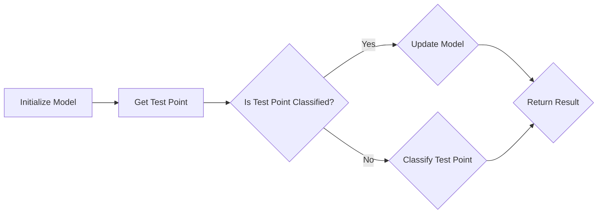
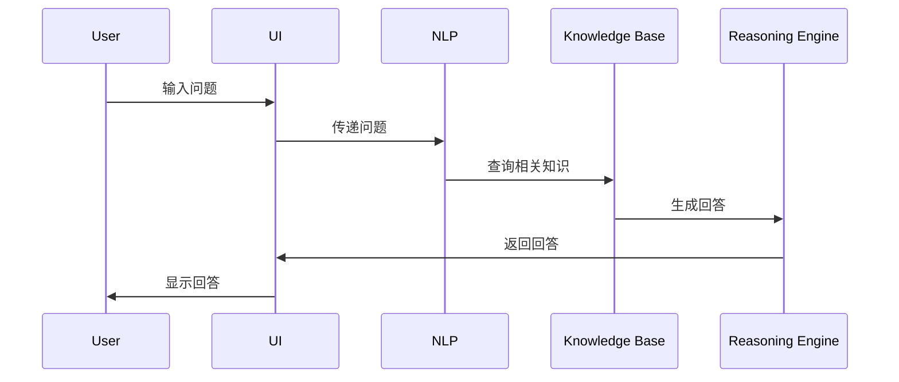
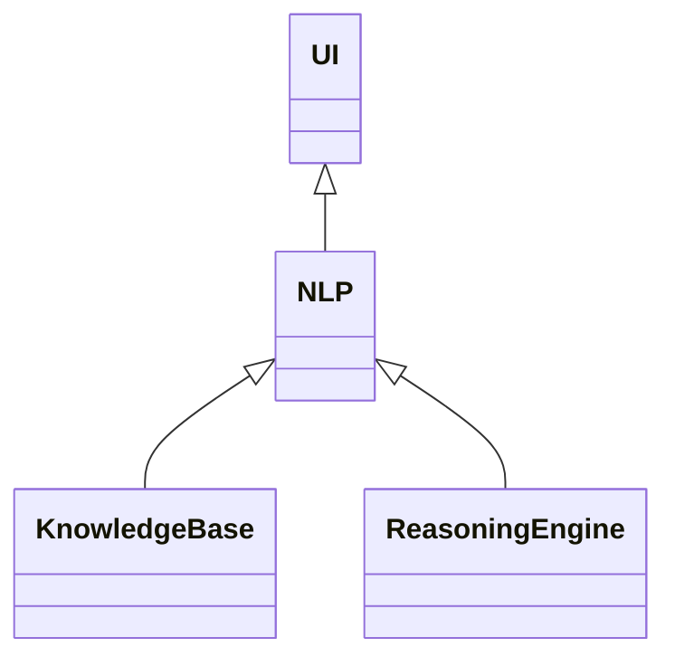
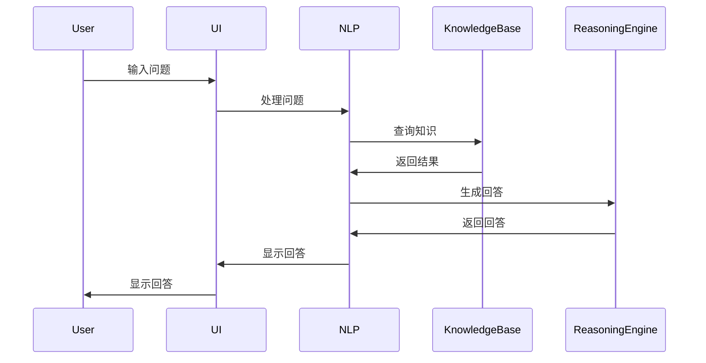

                 

###  AI编程的新视角与新未来

#### 关键词：
- AI编程
- 新视角
- 未来趋势
- 人工智能技术
- 编程方法论

#### 摘要：
本文深入探讨了AI编程的全新视角和未来发展趋势。通过分析现有技术的局限，提出了突破性的解决方案和创新方法。文章从核心概念、编程方法论、实际应用等多个维度，全面阐述了AI编程的现状与未来，为读者揭示了这一领域的前沿动态和未来潜力。

### 引言

人工智能（AI）正迅速成为科技领域的热门话题，其应用范围涵盖了从自动化生产线到智能客服，从自动驾驶到医疗诊断的各个领域。随着技术的不断进步，AI编程也在经历着革命性的变化。然而，传统编程方法在应对复杂AI应用时仍存在诸多局限性，这促使我们重新思考AI编程的新视角和新未来。

本文旨在探讨AI编程领域的以下几个关键问题：
1. **核心概念与术语的重新定义**：在AI编程中，如何准确界定和理解关键术语和概念？
2. **编程方法论的创新**：有哪些新的编程方法论可以提升AI编程的效率和效果？
3. **实际应用案例**：AI编程在现实世界中的应用场景和效果如何？
4. **未来趋势**：AI编程的未来发展方向和可能的技术突破点。

接下来，我们将逐步深入这些话题，探讨AI编程的新视角和新未来。

### 第一部分：核心概念与术语

在探讨AI编程之前，我们需要对一些核心概念和术语进行清晰定义。这些概念和术语不仅为我们理解AI编程提供了基础，也是我们分析其未来发展趋势的重要依据。

#### 1. 人工智能（AI）
人工智能是指计算机系统通过学习、推理和自我改进等方式，模拟人类智能的行为和思维过程。它包括机器学习、深度学习、自然语言处理、计算机视觉等多个子领域。

#### 2. 编程
编程是指使用编程语言和工具，编写计算机程序以实现特定功能的过程。在AI编程中，编程不仅涉及传统编程技能，还包括对AI算法和模型的理解和实现。

#### 3. 数据集（Dataset）
数据集是指用于训练和测试AI模型的示例数据集合。数据集的质量和规模直接影响AI模型的性能和泛化能力。

#### 4. 模型（Model）
模型是指AI系统中的核心组件，它通过学习和处理数据，生成预测或决策。常见的模型包括神经网络、决策树、支持向量机等。

#### 5. 算法（Algorithm）
算法是指解决特定问题的一系列规则和步骤。在AI编程中，算法是实现AI模型的核心，包括训练算法、优化算法、推理算法等。

### 第二部分：问题背景与问题描述

尽管AI编程取得了显著进展，但仍然面临着一些挑战和问题。以下是其中几个主要的问题：

#### 1. 数据依赖
AI模型的性能高度依赖于数据集的质量和规模。然而，高质量的数据集往往难以获取，尤其是在某些专业领域，数据稀缺或标签不完整。

#### 2. 模型复杂度
随着AI模型的复杂度增加，其训练和推理所需的时间和资源也在增加。这给实际应用带来了巨大的计算负担。

#### 3. 解释性不足
许多AI模型，尤其是深度学习模型，其决策过程缺乏透明性和解释性。这限制了其在某些需要高可靠性和高透明度领域的应用。

#### 4. 跨领域迁移
现有的AI模型往往只能在特定领域表现出色，难以迁移到其他领域。这限制了AI技术的广泛应用。

### 第三部分：问题解决与边界外延

为了解决上述问题，我们需要从多个方面进行创新和改进。以下是一些可能的解决方案及其边界和局限性：

#### 1. 数据增强（Data Augmentation）
通过人工或自动方式增加数据集的规模和质量，以提升模型性能。但数据增强可能引入噪声，降低模型泛化能力。

#### 2. 模型压缩（Model Compression）
通过压缩模型大小和计算复杂度，降低训练和推理的资源消耗。然而，模型压缩可能导致性能损失。

#### 3. 知识图谱（Knowledge Graph）
利用知识图谱整合多源数据，提高数据的互操作性和可解释性。但知识图谱的构建和维护需要大量资源和专业知识。

#### 4. 跨领域迁移（Cross-Domain Transfer Learning）
通过跨领域迁移学习，使AI模型在不同领域具有更好的适应性。但跨领域迁移需要大量通用特征提取和领域适应技术。

### 第四部分：核心概念与联系

在这一部分，我们将详细探讨AI编程中的核心概念，并分析这些概念之间的联系。以下是一个核心概念属性特征对比表格：

| 概念 | 特征 |
| --- | --- |
| 机器学习 | 自动从数据中学习模式 |
| 深度学习 | 基于多层神经网络的模型 |
| 自然语言处理 | 机器理解和生成自然语言 |
| 计算机视觉 | 机器理解和解析图像和视频 |
| 知识图谱 | 结构化多源数据，提高互操作性 |

#### ER实体关系图架构

以下是一个使用Mermaid绘制的ER实体关系图，展示了AI编程中的核心实体及其关系：

```mermaid
erDiagram
  User ||--|{ AIModel } : trains
  Data ||--|{ AIModel } : trains
  Algorithm ||--|{ AIModel } : implements
  Framework ||--|{ AIModel } : supports
```

### 第五部分：算法原理讲解

在这一部分，我们将使用Mermaid绘制算法流程图，并使用Python代码详细阐述算法原理。

#### 算法流程图

以下是一个使用Mermaid绘制的算法流程图，用于描述K-近邻（K-Nearest Neighbors, KNN）算法：



#### Python代码实现

以下是一个Python代码实现KNN算法的示例：

```python
from sklearn.neighbors import KNeighborsClassifier
from sklearn.model_selection import train_test_split
from sklearn.datasets import load_iris
import numpy as np

# 加载数据集
iris = load_iris()
X = iris.data
y = iris.target

# 划分训练集和测试集
X_train, X_test, y_train, y_test = train_test_split(X, y, test_size=0.3, random_state=42)

# 初始化KNN模型
knn = KNeighborsClassifier(n_neighbors=3)

# 训练模型
knn.fit(X_train, y_train)

# 测试模型
y_pred = knn.predict(X_test)

# 输出预测结果
print("Accuracy:", np.mean(y_pred == y_test))
```

#### 算法原理与数学模型

KNN算法的核心思想是，对于给定一个测试样本，通过查找训练集中与其最接近的K个邻居，并基于这些邻居的标签来预测测试样本的类别。算法的数学模型如下：

$$
\hat{y} = \arg\max_{c} \sum_{i=1}^{K} I(y_i = c)
$$

其中，$y_i$是邻居$i$的标签，$I$是指示函数，当$y_i = c$时，$I(y_i = c) = 1$，否则为0。

### 第六部分：系统分析与架构设计

在这一部分，我们将介绍一个具体的AI编程项目，包括项目场景介绍、系统功能设计、系统架构设计、系统接口设计和系统交互等。

#### 项目场景介绍

假设我们正在开发一个智能问答系统，该系统能够接受用户的自然语言输入，并给出相应的回答。系统需要支持多领域的知识问答，同时具备高可扩展性和高可靠性。

#### 系统功能设计

系统功能设计包括以下几个方面：

1. **自然语言处理（NLP）模块**：负责处理用户的输入，提取关键信息，并进行语义分析。
2. **知识库模块**：存储各个领域的知识，包括事实、规则和问答对等。
3. **推理引擎模块**：根据用户的输入和知识库中的信息，生成回答。
4. **用户接口（UI）模块**：提供用户与系统交互的界面。

#### 系统架构设计

以下是一个使用Mermaid绘制的系统架构图：



#### 系统接口设计

系统接口设计包括NLP模块、知识库模块和推理引擎模块之间的交互接口。以下是一个简化的接口设计：



#### 系统交互

以下是一个使用Mermaid绘制的系统交互序列图：



### 第七部分：项目实战

在本节中，我们将介绍如何在实际环境中安装和配置系统，并实现核心功能。以下是一个简化的安装和配置步骤：

#### 1. 安装环境

- 安装Python环境
- 安装NLP库（如NLTK、spaCy）
- 安装知识库（如Wikipedia、OpenKG）
- 安装推理引擎（如RASA、ChatGLM）

#### 2. 系统核心实现

- 使用Python编写NLP模块，实现自然语言处理功能
- 使用Python编写知识库模块，实现知识查询和存储功能
- 使用Python编写推理引擎模块，实现推理和回答生成功能

以下是一个简化的NLP模块实现的Python代码示例：

```python
import nltk
from nltk.corpus import stopwords
from nltk.tokenize import word_tokenize

def preprocess_text(text):
    # 清洗文本，去除标点符号和停用词
    text = text.lower()
    text = re.sub(r'[^\w\s]', '', text)
    stop_words = set(stopwords.words('english'))
    words = word_tokenize(text)
    filtered_words = [word for word in words if word not in stop_words]
    return " ".join(filtered_words)
```

#### 3. 代码应用解读与分析

- 分析NLP模块的核心算法和流程
- 分析知识库模块的数据结构和查询策略
- 分析推理引擎模块的推理规则和策略

#### 4. 实际案例分析与详细讲解

- 提供一个实际问答案例，展示系统如何处理输入并生成回答
- 分析案例中的关键技术和算法实现

#### 5. 项目小结

- 总结项目的核心功能和实现方法
- 提出项目改进方向和未来工作计划

### 第八部分：最佳实践、小结与注意事项

#### 最佳实践

- **数据预处理**：在训练AI模型之前，确保对数据集进行充分的预处理，以提高模型的性能和泛化能力。
- **模型优化**：使用交叉验证和网格搜索等技术，对模型进行调优，以找到最佳参数组合。
- **可解释性**：在部署AI模型时，考虑增加可解释性，以提高模型的可信度和透明度。

#### 小结

本文从多个角度探讨了AI编程的新视角和新未来，分析了核心概念、编程方法论、实际应用案例和未来趋势。通过详细介绍项目实战，我们展示了如何在实际环境中实现AI编程系统。

#### 注意事项

- **数据安全与隐私**：在处理和存储数据时，务必确保数据的安全和隐私。
- **计算资源管理**：合理分配计算资源，优化模型训练和推理过程，以提高系统性能。

### 第九部分：拓展阅读

- **《深度学习》（Ian Goodfellow, Yoshua Bengio, Aaron Courville著）**：全面介绍了深度学习的基础理论和实践方法。
- **《机器学习实战》（Peter Harrington著）**：通过实际案例，讲解了机器学习的基本概念和应用方法。
- **《人工智能：一种现代方法》（Stuart Russell, Peter Norvig著）**：系统介绍了人工智能的理论和实践，涵盖了多个子领域。

### 第十部分：作者信息

作者：AI天才研究院/AI Genius Institute & 禅与计算机程序设计艺术/Zen And The Art of Computer Programming

以上是本文的全部内容，希望对您在AI编程领域的学习和研究有所帮助。感谢您的阅读！

