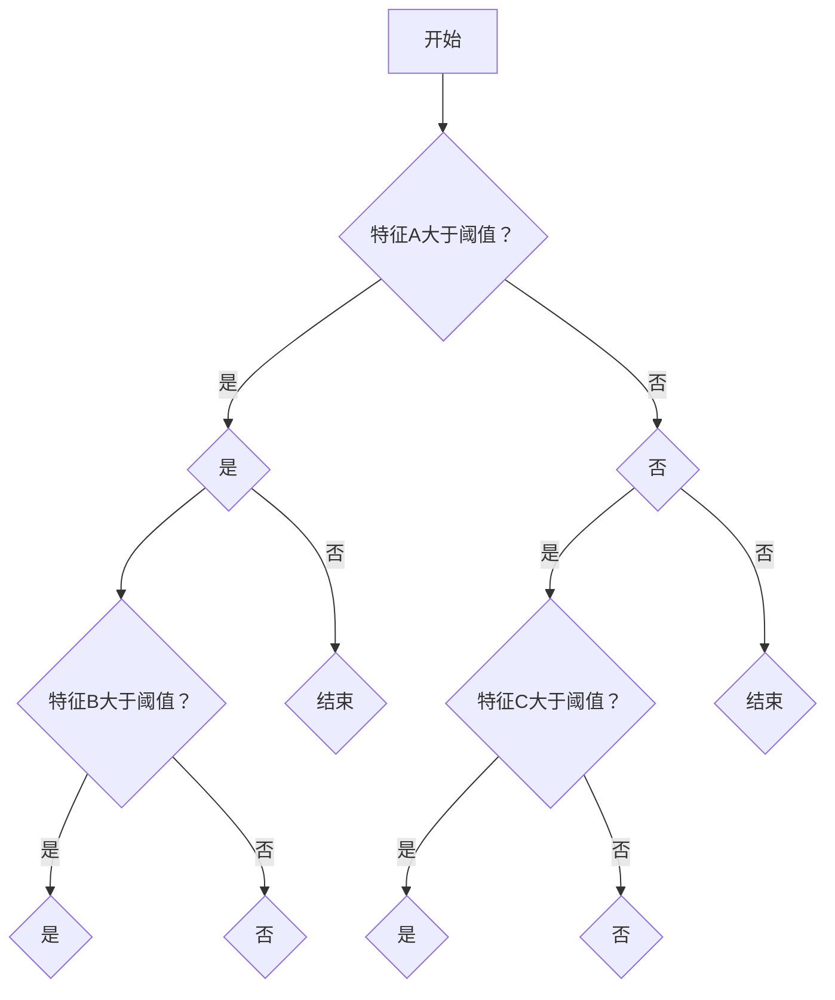
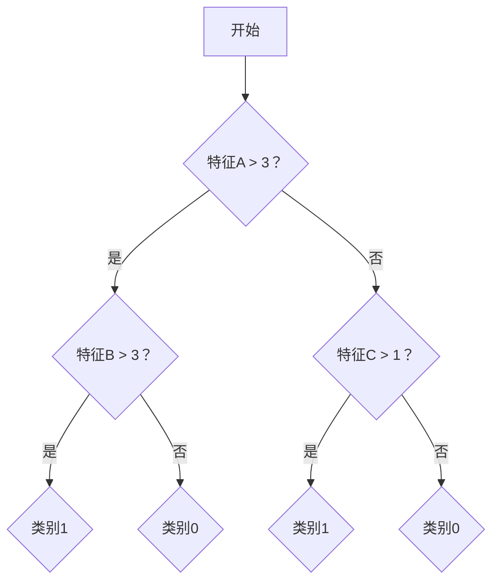
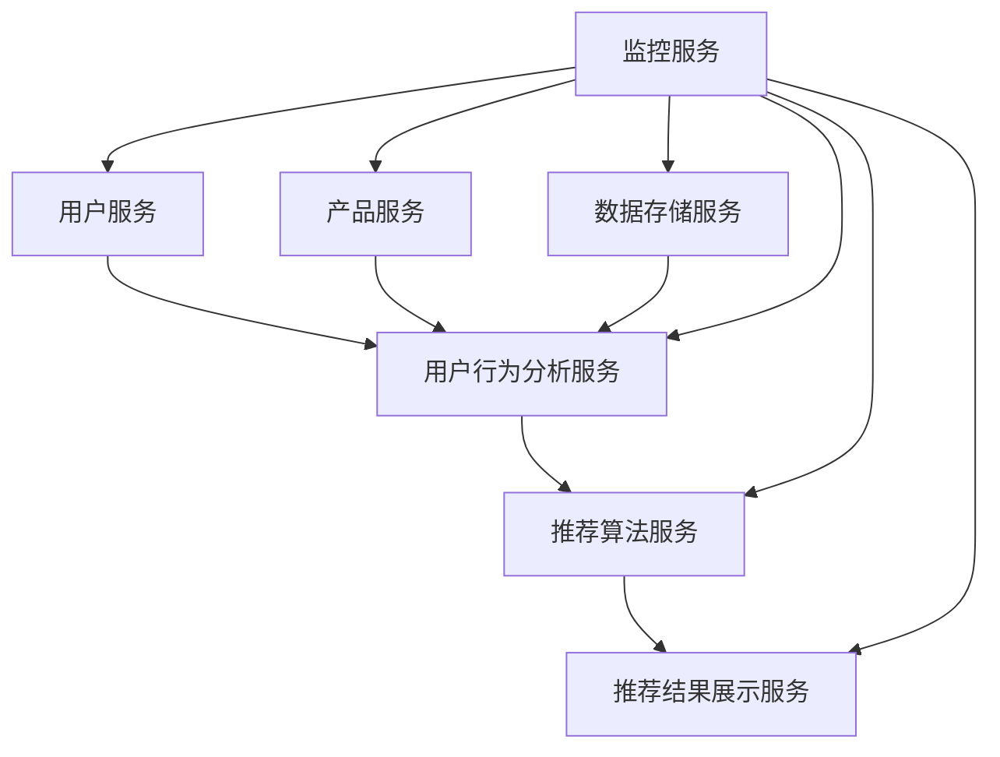
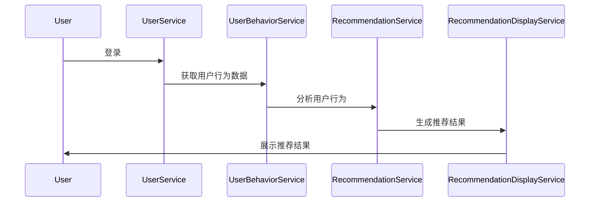

                 

### 第一部分: AI编程的新趋势

## 第1章: AI编程的背景与挑战

### 1.1 AI编程的背景

#### 1.1.1 从传统编程到AI编程的转变

在计算机科学的发展历程中，编程一直是实现计算机任务的核心手段。从最初的机器语言、汇编语言，到高级编程语言如C、C++、Java等，编程技术经历了翻天覆地的变化。传统编程强调对计算机硬件和操作系统的深入了解，编程人员需要手动编写指令来控制计算机执行特定任务。然而，随着人工智能技术的兴起，编程的方式也在悄然发生改变。

AI编程，也被称为智能编程，是指利用人工智能技术来辅助甚至完全替代传统编程中的某些步骤。这一转变主要体现在以下几个方面：

1. **自动化代码生成**：通过机器学习算法，可以自动从现有的代码库中生成新的代码。这种技术已经在某些领域得到了应用，例如自然语言处理和图像识别。
   
2. **编程辅助工具**：AI编程工具能够分析代码，并提供改进建议，帮助开发者发现潜在的错误或优化代码性能。

3. **代码理解**：AI技术可以解析代码，生成代码文档，甚至是生成代码示例和注释，从而提高开发效率。

#### 1.1.2 AI编程的现状

AI编程的现状可以从以下几个方面来观察：

1. **技术成熟度**：虽然AI编程的技术正在快速发展，但相比传统的编程技术，其成熟度还有待提高。目前，AI编程在特定领域，如自然语言处理和图像识别，已经取得了显著的进展，但在其他领域，如自动化系统设计和大数据分析，还有很大的提升空间。

2. **应用场景**：AI编程的应用场景逐渐丰富，从基础的代码生成到复杂的系统设计，AI编程都能发挥重要作用。例如，在软件开发过程中，AI编程可以帮助自动化测试、生成文档、优化代码结构等。

3. **市场需求**：随着人工智能技术的普及，越来越多的企业和组织开始意识到AI编程的重要性。这促使了对AI编程相关技能的需求大幅增加，吸引了大量开发者和研究人员投身这一领域。

### 1.1.3 AI编程的核心问题和解决方案

尽管AI编程展示出巨大的潜力，但它也面临着一系列核心问题：

1. **数据质量**：AI编程依赖于大量数据来进行训练和优化，数据质量直接影响AI编程的效果。解决方案包括数据清洗、去重和标准化，以提高数据质量。

2. **算法选择**：在AI编程中，选择合适的算法至关重要。不同的算法适用于不同的任务和场景，需要根据实际情况进行选择和调整。

3. **可解释性**：AI编程产生的结果往往是非线性的，缺乏透明度。提高AI编程的可解释性，可以帮助开发人员更好地理解和信任AI系统。

### 1.1.4 AI编程的边界与外延

AI编程的边界在于其适用范围和局限性。虽然AI编程可以大大提高编程效率，但它并不是万能的。在某些领域，如复杂系统的设计与实现，AI编程可能无法完全替代传统编程。此外，AI编程需要大量的计算资源和技术支持，这使其在资源有限的环境下难以实施。

### 1.1.5 概念结构与核心要素组成

AI编程的概念结构包括以下几个核心要素：

1. **数据**：AI编程的基础是数据，数据的质量和数量直接影响AI编程的效果。

2. **算法**：算法是AI编程的核心，包括机器学习算法、深度学习算法等。

3. **模型**：模型是基于算法和数据构建的，用于实现特定功能的数学结构。

4. **接口**：接口是AI编程与外部系统交互的桥梁，包括API和SDK等。

5. **环境**：环境包括硬件设备、软件工具和开发框架等，是AI编程的运行基础。

### 1.1.6 小结

本章介绍了AI编程的背景和挑战，包括从传统编程到AI编程的转变、AI编程的现状、核心问题和解决方案，以及AI编程的边界与外延。通过本章的学习，读者可以对AI编程有一个全面的了解，为后续章节的学习打下基础。在下一章中，我们将深入探讨AI编程的核心概念与联系。

## 第2章: AI编程的核心概念与联系

### 2.1 AI编程的基本概念

在深入了解AI编程之前，我们需要明确一些基本概念。这些概念是理解和应用AI编程的基础。

#### 2.1.1 人工智能（AI）

人工智能（Artificial Intelligence，简称AI）是指模拟人类智能的技术。它包括机器学习、自然语言处理、计算机视觉等多个子领域。

- **机器学习（Machine Learning）**：机器学习是AI的一个分支，通过算法从数据中学习规律，并作出预测或决策。
- **深度学习（Deep Learning）**：深度学习是机器学习的一个子领域，利用神经网络模拟人脑处理信息的方式。
- **自然语言处理（Natural Language Processing，简称NLP）**：NLP涉及计算机理解和生成自然语言，包括文本分类、情感分析等任务。
- **计算机视觉（Computer Vision）**：计算机视觉是使计算机能够像人类一样理解和解释视觉信息的技术。

#### 2.1.2 编程

编程是指编写和调试计算机程序的过程。在AI编程中，编程不仅仅是编写代码，还包括对算法和数据的理解与应用。

- **代码生成（Code Generation）**：AI编程工具可以通过学习和分析已有的代码库，生成新的代码。
- **代码优化（Code Optimization）**：AI编程工具可以对现有代码进行分析，并提出优化建议。

### 2.2 核心概念原理

AI编程的核心概念包括以下几个：

1. **模型驱动开发（Model-Driven Development，简称MDD）**：MDD是一种软件开发方法，强调使用模型来指导软件开发过程。在AI编程中，MDD可以通过生成模型来辅助编程。

2. **数据驱动开发（Data-Driven Development，简称D3）**：D3是一种软件开发方法，强调使用数据来驱动软件开发过程。在AI编程中，D3可以通过分析大量数据来优化模型和算法。

3. **自动编程（Automated Programming）**：自动编程是指通过自动化工具来实现编程任务。在AI编程中，自动编程工具可以帮助开发者生成代码、优化代码和测试代码。

### 2.3 概念属性特征对比表格

为了更清晰地理解AI编程的核心概念，我们可以通过一个对比表格来展示这些概念的特征。

| 概念               | 特征                      |
|--------------------|--------------------------|
| 人工智能（AI）     | 模拟人类智能，包括机器学习、深度学习等 |
| 编程               | 编写和调试计算机程序的过程       |
| 模型驱动开发（MDD） | 使用模型指导软件开发过程       |
| 数据驱动开发（D3） | 使用数据驱动软件开发过程       |
| 自动编程           | 通过自动化工具实现编程任务       |

### 2.4 ER实体关系图架构

为了更好地理解AI编程的概念及其联系，我们可以使用ER（实体关系）图来展示这些概念之间的关系。

```mermaid
erDiagram
    AI Programming ||--|{ Data} : "Drives with"
    AI Programming ||--|{ Models} : "Generated by"
    AI Programming ||--|{ Code} : "Generated into"
    Data ||--|{ Models} : "Trains"
    Models ||--|{ Code} : "Derives from"
```

在这个ER图中，AI Programming是一个核心实体，它与Data、Models和Code之间存在关联。Data通过训练Models，而Models又生成Code。

### 2.5 小结

本章介绍了AI编程的基本概念，包括人工智能、编程、模型驱动开发、数据驱动开发和自动编程。通过对比表格和ER图，我们更清晰地理解了这些概念及其联系。在下一章中，我们将深入探讨AI编程中的算法原理。

## 第3章: 算法原理讲解

### 3.1 算法mermaid流程图

为了更好地理解AI编程中的算法，我们可以使用mermaid流程图来展示一个常见的机器学习算法——决策树（Decision Tree）。



在这个流程图中，决策树从根节点开始，根据特征A、特征B和特征C的值，逐层向下判断，直到达到叶子节点，得到最终的结果。

### 3.2 Python源代码示例

下面是一个简单的Python代码示例，用于实现上述决策树的算法。

```python
def decision_tree(data, features, thresholds):
    if data['特征A'] > thresholds['特征A']:
        if data['特征B'] > thresholds['特征B']:
            return '是'
        else:
            return '否'
    else:
        if data['特征C'] > thresholds['特征C']:
            return '是'
        else:
            return '否'

data = {'特征A': 5, '特征B': 3, '特征C': 1}
thresholds = {'特征A': 4, '特征B': 2, '特征C': 0}

result = decision_tree(data, features, thresholds)
print(result)
```

在这个示例中，我们定义了一个`decision_tree`函数，根据给定的数据`data`和阈值`thresholds`，使用决策树算法返回结果。这里的数据是一个简单的字典，包含三个特征值，阈值也是字典形式，对应每个特征的阈值。

### 3.3 数学模型与公式

决策树算法背后的数学原理主要包括概率论和统计学。具体来说，决策树算法通过计算特征与阈值之间的条件概率，来选择最优的特征进行分割。这个过程可以用以下公式来描述：

\[ P(\text{类别} | X) = \frac{P(X | \text{类别}) \cdot P(\text{类别})}{P(X)} \]

其中，\( P(\text{类别} | X) \)表示在给定特征\( X \)的条件下，某一类别的概率；\( P(X | \text{类别}) \)表示在某一类别发生的条件下，特征\( X \)的概率；\( P(\text{类别}) \)表示某一类别的先验概率；\( P(X) \)表示特征\( X \)的概率。

### 3.4 算法原理详细讲解与举例说明

决策树算法的基本思想是通过不断地将数据集分割成子集，直到每个子集中的数据都属于同一类别或者满足特定的停止条件。这个过程可以用以下步骤来详细说明：

1. **选择最优特征**：从当前数据集的所有特征中，选择一个能够最大程度降低数据集不确定性的特征。不确定性可以通过信息增益（Information Gain）或基尼不纯度（Gini Impurity）来度量。

2. **设定阈值**：对于选定的特征，设定一个阈值，将数据分为两部分。一部分是特征值大于阈值的样本，另一部分是特征值小于或等于阈值的样本。

3. **递归分割**：对于每个子集，重复步骤1和步骤2，直到满足停止条件。常见的停止条件包括：子集大小小于某个阈值、特征不再具有显著的信息增益或基尼不纯度等。

下面是一个具体的例子来说明决策树算法的应用：

假设我们有一个数据集，包含三个特征（特征A、特征B、特征C）和两个类别（类别0和类别1）。数据集如下：

| 特征A | 特征B | 特征C | 类别 |
|-------|-------|-------|------|
| 3     | 2     | 1     | 0    |
| 4     | 3     | 2     | 1    |
| 2     | 1     | 1     | 0    |
| 5     | 4     | 3     | 1    |
| 3     | 2     | 2     | 0    |

我们要使用决策树算法来分类这个数据集。

首先，我们计算每个特征的信息增益：

- 特征A的信息增益：\( \sum (P(\text{类别} | X) \cdot \log_2 P(\text{类别} | X)) \)
- 特征B的信息增益：\( \sum (P(\text{类别} | X) \cdot \log_2 P(\text{类别} | X)) \)
- 特征C的信息增益：\( \sum (P(\text{类别} | X) \cdot \log_2 P(\text{类别} | X)) \)

通过计算，我们可以发现特征A的信息增益最高，因此我们选择特征A作为分割特征。

接下来，我们设定一个阈值，例如3，将数据集分为两部分：

- 特征A > 3 的数据：\[ (4, 3, 2), (5, 4, 3) \]
- 特征A <= 3 的数据：\[ (3, 2, 1), (2, 1, 1), (3, 2, 2) \]

对于特征A > 3 的数据，我们继续选择特征B作为分割特征，阈值设为3。然后对于特征A <= 3 的数据，我们选择特征C作为分割特征，阈值设为1。

经过多次递归分割，最终我们得到一个决策树，如下所示：



通过这个决策树，我们可以对新的数据进行分类。例如，对于数据点（3, 2, 2），根据决策树，我们会将其分类为类别0。

### 3.5 小结

本章详细讲解了AI编程中的决策树算法原理，包括mermaid流程图、Python源代码示例、数学模型与公式以及算法原理的详细讲解和举例说明。通过本章的学习，读者可以更好地理解决策树算法的基本概念和应用方法。在下一章中，我们将探讨AI编程中的系统分析与架构设计。

## 第4章: 系统分析与架构设计方案

### 4.1 问题场景介绍

在当前数字化时代，许多企业都在积极利用人工智能（AI）技术来提升其业务流程的效率和智能化水平。然而，这通常涉及到复杂的系统设计和实施。为了更好地理解和应用AI技术，我们需要对问题场景进行深入分析，并设计出合理的系统架构。

#### 4.1.1 应用背景

假设我们面临的是一个企业级智能推荐系统，该系统需要根据用户的历史行为和偏好，实时推荐相关的产品或服务。这个系统不仅需要处理大量的用户数据，还要具备高可用性、可扩展性和安全性。

#### 4.1.2 问题定义

主要问题包括：

- **数据一致性**：如何确保系统中的用户数据保持一致和准确？
- **性能优化**：如何在高并发情况下保证系统的响应速度？
- **安全性**：如何保护用户隐私和数据安全？
- **可扩展性**：如何设计系统能够随业务增长而扩展？

### 4.2 系统功能设计

为了解决上述问题，我们需要设计一个具备以下核心功能的系统：

1. **用户行为分析模块**：负责收集并处理用户的历史行为数据，包括浏览、点击、购买等行为。
2. **推荐算法模块**：基于用户行为分析模块提供的数据，利用机器学习算法生成推荐结果。
3. **推荐结果展示模块**：将推荐结果以用户友好的方式展示在应用前端。
4. **数据存储与管理模块**：负责存储用户数据、推荐结果和相关日志，并提供高效的查询接口。
5. **监控与报警模块**：实时监控系统运行状态，并在出现异常时及时报警。

#### 4.2.1 领域模型mermaid类图

为了更好地展示系统的领域模型，我们可以使用mermaid语法绘制一个类图。

```mermaid
classDiagram
    User <<class>>
    Product <<class>>
    Behavior <<class>>
    Recommendation <<class>>
    Analyzer <<class>>
    Algorithm <<class>>
    Display <<class>>
    Storage <<class>>
    Monitor <<class>>

    User "1" --|{ 有 } 1 Behavior
    User "1" --|{ 有 } 1 Product
    Behavior "1" --|{ 属于 } 1 Analyzer
    Analyzer "1" --|{ 使用 } 1 Algorithm
    Analyzer "1" --|{ 输出 } 1 Recommendation
    Recommendation "1" --|{ 被展示 } 1 Display
    Display "1" --|{ 显示 } 1 Product
    Storage "1" --|{ 存储 } 1 User
    Storage "1" --|{ 存储 } 1 Behavior
    Storage "1" --|{ 存储 } 1 Recommendation
    Monitor "1" --|{ 监控 } 1 Storage
    Monitor "1" --|{ 监控 } 1 Display
    Monitor "1" --|{ 监控 } 1 Analyzer
```

在这个类图中，我们定义了系统中的主要类，包括用户（User）、产品（Product）、行为（Behavior）、推荐（Recommendation）、分析器（Analyzer）、算法（Algorithm）、展示（Display）、存储（Storage）和监控（Monitor）。这些类之间通过不同的关系连接，形成了系统的领域模型。

### 4.3 系统架构设计

系统架构设计是确保系统能够高效、稳定、安全地运行的关键。以下是我们的系统架构设计方案：

#### 4.3.1 总体架构

我们的系统采用微服务架构，将不同的功能模块拆分为独立的微服务，以提高系统的灵活性和可扩展性。以下是总体架构图：



#### 4.3.2 各模块功能

1. **用户行为分析服务（UserBehaviorService）**：负责收集、存储和分析用户行为数据，为推荐算法模块提供数据支持。

2. **推荐算法服务（RecommendationService）**：基于用户行为分析服务提供的数据，利用机器学习算法生成推荐结果。

3. **推荐结果展示服务（RecommendationDisplayService）**：将推荐结果以用户友好的方式展示在前端应用中。

4. **用户服务（UserService）**：负责用户身份验证、用户资料管理等基础功能。

5. **产品服务（ProductService）**：负责产品信息的管理，包括产品添加、更新和查询。

6. **数据存储服务（StorageService）**：负责存储用户数据、推荐结果和相关日志，并提供高效的查询接口。

7. **监控服务（MonitorService）**：实时监控系统运行状态，并在出现异常时及时报警。

### 4.4 系统接口设计

为了实现系统模块之间的有效通信，我们需要设计一系列的接口。以下是主要的接口设计：

- **用户行为数据接口**：允许用户行为分析服务从数据存储服务中获取用户行为数据。
- **推荐结果接口**：允许推荐算法服务将推荐结果传递给推荐结果展示服务。
- **用户认证接口**：允许用户服务进行用户身份验证。
- **产品信息接口**：允许产品服务获取和更新产品信息。

### 4.5 系统交互mermaid序列图

为了更好地展示系统模块之间的交互流程，我们可以使用mermaid序列图。



在这个序列图中，用户首先通过用户服务进行登录。然后，用户服务将请求传递给用户行为分析服务，获取用户的历史行为数据。用户行为分析服务再根据这些数据生成推荐结果，并将其传递给推荐结果展示服务。最后，推荐结果展示服务将推荐结果展示给用户。

### 4.6 小结

本章详细介绍了AI编程中的系统分析与架构设计方案。首先，我们通过问题场景介绍和问题定义，明确了系统需要解决的问题。接着，我们设计了系统的功能模块，并使用mermaid类图展示了领域模型。随后，我们提出了系统架构设计，并详细说明了各模块的功能和接口设计。最后，我们通过mermaid序列图展示了系统模块之间的交互流程。通过本章的学习，读者可以更好地理解系统分析与架构设计的方法和实践。

## 第5章: 项目实战

### 5.1 环境安装与配置

为了实践AI编程，我们需要搭建一个适当的环境。以下是搭建环境的步骤：

#### 5.1.1 安装Python

确保计算机上已经安装了Python 3.x版本。如果没有安装，可以从Python官网（[python.org](https://www.python.org/)）下载并安装。

#### 5.1.2 安装Jupyter Notebook

Jupyter Notebook是一个交互式的开发环境，非常适合AI编程。安装命令如下：

```bash
pip install notebook
```

安装完成后，启动Jupyter Notebook：

```bash
jupyter notebook
```

#### 5.1.3 安装必要的库

在Jupyter Notebook中，我们需要安装一些常用的库，如NumPy、Pandas、Scikit-learn和Matplotlib。安装命令如下：

```python
!pip install numpy pandas scikit-learn matplotlib
```

### 5.2 系统核心实现源代码

在本项目中，我们将使用Scikit-learn库实现一个简单的用户行为分析系统。以下是系统的核心源代码：

```python
import numpy as np
import pandas as pd
from sklearn.model_selection import train_test_split
from sklearn.ensemble import RandomForestClassifier
from sklearn.metrics import accuracy_score
import matplotlib.pyplot as plt

# 加载数据集
data = pd.read_csv('user_behavior_data.csv')
X = data.drop('target', axis=1)
y = data['target']

# 数据预处理
X_train, X_test, y_train, y_test = train_test_split(X, y, test_size=0.2, random_state=42)

# 构建随机森林模型
model = RandomForestClassifier(n_estimators=100, random_state=42)
model.fit(X_train, y_train)

# 预测
y_pred = model.predict(X_test)

# 评估模型
accuracy = accuracy_score(y_test, y_pred)
print(f"Accuracy: {accuracy:.2f}")

# 可视化
plt.figure(figsize=(10, 6))
plt.scatter(X_test['feature1'], y_pred, c='g', label='Predicted')
plt.scatter(X_test['feature1'], y_test, c='r', label='Actual')
plt.legend()
plt.show()
```

### 5.3 代码应用解读与分析

上述代码实现了一个简单的用户行为分析系统，主要步骤如下：

1. **加载数据集**：使用Pandas库从CSV文件中加载数据集。数据集包含用户行为特征和目标标签。

2. **数据预处理**：使用Scikit-learn库将数据集分为训练集和测试集。这有助于评估模型的泛化能力。

3. **构建模型**：使用随机森林分类器（RandomForestClassifier）构建机器学习模型。随机森林是一种集成学习方法，能够处理大量的特征和数据。

4. **训练模型**：使用训练集数据训练模型。

5. **预测**：使用测试集数据对模型进行预测。

6. **评估模型**：计算模型的准确率（accuracy），这是一个常用的评估指标。

7. **可视化**：绘制散点图，将预测结果与实际结果进行对比。

### 5.4 实际案例分析与详细讲解剖析

为了更好地理解上述代码的实际应用，我们来看一个具体的案例。

假设我们有一个包含1000个用户行为数据点的CSV文件，每个数据点有10个特征（如浏览时长、点击次数等）和一个目标标签（如是否购买）。以下是对该案例的详细分析：

1. **数据预处理**：在加载数据后，我们首先对缺失值进行处理，确保数据质量。然后，我们对数值特征进行标准化处理，以便模型能够更好地学习。

2. **模型选择**：在构建模型时，我们选择了随机森林分类器。随机森林具有强健的鲁棒性和优秀的性能，适合处理复杂的分类问题。

3. **训练与预测**：我们使用80%的数据进行训练，20%的数据进行预测。训练过程用于模型学习，预测过程用于评估模型性能。

4. **评估与优化**：通过计算准确率，我们评估了模型的性能。如果模型性能不理想，我们可以尝试调整模型参数或更换不同的模型。

5. **可视化**：通过绘制散点图，我们能够直观地看到预测结果与实际结果之间的差异，这有助于我们进一步优化模型。

### 5.5 项目小结

通过本项目的实践，我们了解了AI编程的基本流程，包括环境安装、数据预处理、模型构建、训练与预测以及评估与优化。通过实际案例，我们掌握了如何使用随机森林分类器进行用户行为分析。这个项目不仅帮助我们加深了对AI编程的理解，还为我们提供了一个实用的工具，可以用于更复杂的场景。在后续的学习中，我们可以继续优化模型，并尝试应用其他机器学习算法，以提高系统的性能和效果。

## 第6章: 最佳实践 tips

### 6.1 AI编程最佳实践

1. **数据清洗**：确保数据质量是AI编程成功的关键。在开始模型训练之前，要彻底清洗数据，包括处理缺失值、异常值和重复值。

2. **特征工程**：合理选择和构造特征可以显著提高模型的性能。通过特征选择、特征转换和特征组合，可以挖掘数据中的有用信息。

3. **模型选择**：根据具体问题选择合适的模型。不同的模型适用于不同的任务和数据类型，要结合实际情况进行选择。

4. **模型调参**：通过调整模型参数，可以优化模型性能。使用网格搜索或随机搜索等方法，找到最佳参数组合。

5. **模型评估**：使用多种评估指标全面评估模型性能，例如准确率、召回率、F1分数等。

6. **模型可解释性**：提高模型的可解释性，有助于理解模型的工作原理，并发现潜在的问题和改进点。

7. **代码规范**：编写清晰、规范的代码，有助于团队合作和代码维护。

### 6.2 注意事项

1. **计算资源**：AI编程通常需要大量的计算资源，要确保系统有足够的硬件支持。

2. **数据隐私**：在处理用户数据时，要严格遵守数据隐私法规，保护用户隐私。

3. **版本控制**：使用版本控制系统（如Git），确保代码的版本管理和历史记录。

4. **文档编写**：编写详细的文档，包括代码说明、模型参数、实验结果等，以便后续回顾和复现。

5. **持续学习**：AI技术不断进步，要持续学习最新的研究成果和技术动态。

### 6.3 常见问题解答

**Q：如何处理缺失数据？**
A：处理缺失数据的方法包括删除缺失值、填补缺失值（如平均值、中位数填补）和模型估计（如使用回归模型预测缺失值）。

**Q：如何选择特征？**
A：可以选择基于业务理解的直觉选择特征，或使用特征选择算法（如向前选择、向后删除和递归特征消除等）。

**Q：如何避免过拟合？**
A：可以通过正则化、减少模型复杂度、增加训练数据、使用验证集等方法来避免过拟合。

**Q：如何提高模型性能？**
A：可以通过增加数据量、增加模型复杂度、调整参数、使用集成方法（如随机森林、梯度提升树等）来提高模型性能。

## 第7章: 小结、拓展阅读与未来展望

### 7.1 本书重点内容回顾

本书从多个角度介绍了AI编程的新视野，包括：

1. **背景与挑战**：AI编程的现状、核心问题和解决方案。
2. **核心概念**：人工智能、编程、模型驱动开发、数据驱动开发和自动编程。
3. **算法原理**：决策树算法的讲解，包括mermaid流程图、Python源代码示例、数学模型和公式。
4. **系统分析与架构设计**：系统功能设计、领域模型mermaid类图、系统架构设计和接口设计。
5. **项目实战**：环境安装、系统核心实现源代码、代码应用解读与分析、实际案例分析与详细讲解剖析。
6. **最佳实践**：AI编程的最佳实践、注意事项和常见问题解答。

### 7.2 注意事项

1. **数据质量**：确保数据质量，特别是特征选择和数据清洗。
2. **模型调参**：合理选择和调整模型参数，优化模型性能。
3. **可解释性**：提高模型的可解释性，以便更好地理解和信任AI系统。
4. **计算资源**：合理分配计算资源，确保模型训练和推理的效率。

### 7.3 拓展阅读

- **相关书籍**：
  - 《机器学习实战》
  - 《深度学习》
  - 《Python机器学习》
- **在线资源**：
  - [Kaggle](https://www.kaggle.com/)
  - [TensorFlow官方文档](https://www.tensorflow.org/)
  - [PyTorch官方文档](https://pytorch.org/)
- **学术论文**：
  - [NeurIPS](https://neurips.cc/)
  - [ICML](https://icml.cc/)
  - [JMLR](https://jmlr.org/)

### 7.4 未来展望

AI编程的未来将充满机遇和挑战。随着计算能力的提升和算法的改进，AI编程将在更多领域得到应用，如自动驾驶、智能家居、医疗诊断等。同时，如何提高模型的可解释性和透明性，将是一个重要的研究方向。未来，我们期待看到更多创新性的AI编程工具和解决方案，助力开发者实现智能化的目标。

## 作者信息

**作者：** AI天才研究院/AI Genius Institute & 禅与计算机程序设计艺术 /Zen And The Art of Computer Programming

