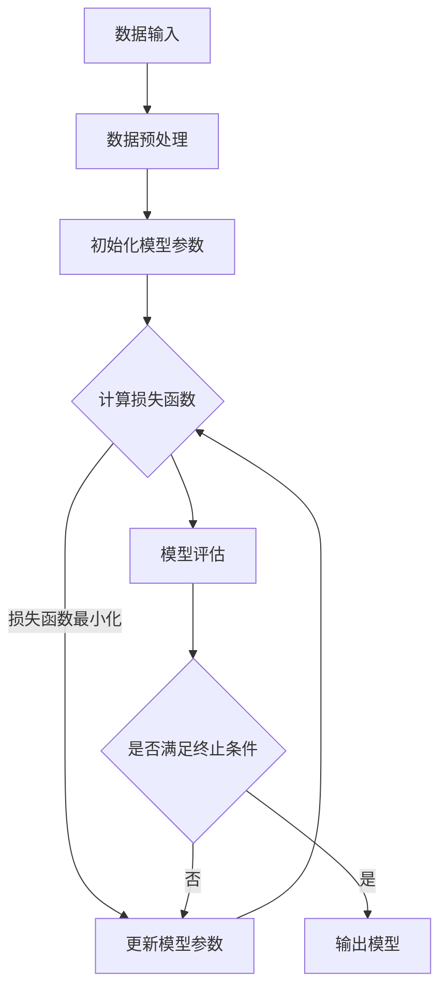
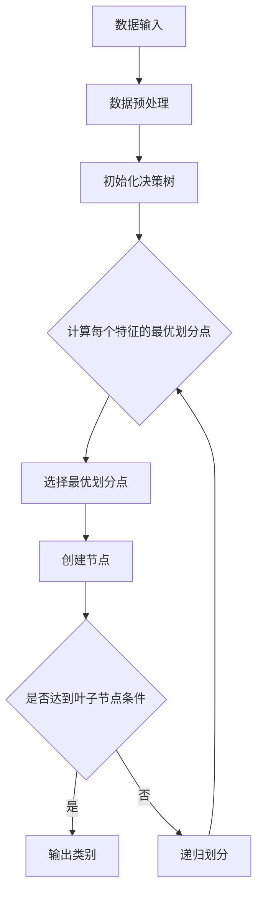
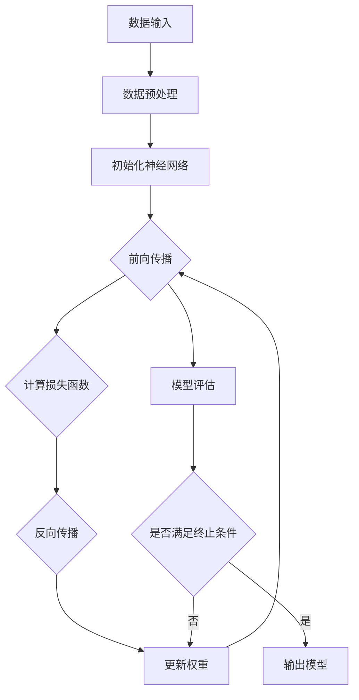
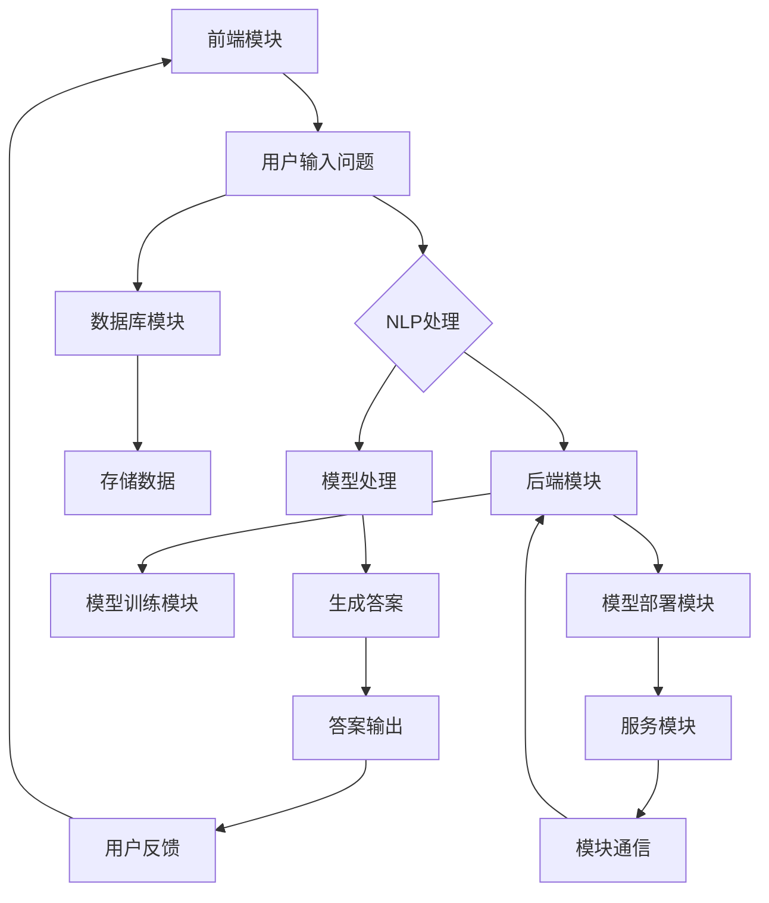
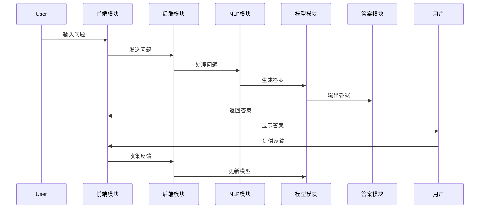
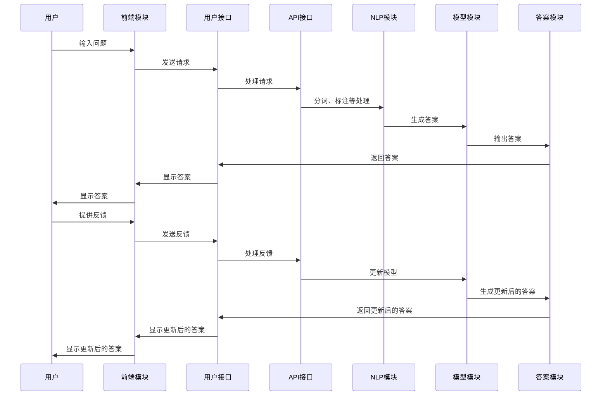

                 

### AI编程的新语法：背景与重要性

在当今快速发展的技术时代，人工智能（AI）已经成为推动产业变革的重要力量。随着AI技术的不断进步，传统的编程语言和工具已难以满足日益复杂的AI应用需求。因此，AI编程的新语法应运而生。本文将围绕AI编程的新语法展开讨论，旨在深入理解其背景、重要性以及未来发展趋势。

首先，我们需要了解AI编程的新语法究竟是什么。它不仅仅是一种编程语言，更是一种全新的编程范式，旨在为开发者提供更高效、更直观的AI开发工具。新语法的核心目标是简化AI模型的开发流程，提升开发效率，并降低开发难度。与传统编程语言相比，新语法更加注重表达力和抽象性，使得开发者能够更加专注于AI算法的创新和优化。

#### AI编程的演变与现状

回顾AI编程的发展历程，我们可以看到从早期基于规则系统的专家系统，到基于机器学习的自动化系统，再到如今基于深度学习的智能系统，编程范式经历了巨大的变化。传统的编程语言如Python、C++等，虽然已经广泛应用于AI开发，但它们在处理大规模数据和高维度特征时，往往显得力不从心。这促使了新语法的研究与出现。

目前，AI编程的新语法主要包括以下几个方向：

1. **数据驱动编程**：这种语法注重数据预处理和特征工程，旨在简化数据驱动型AI模型的开发过程。
2. **函数式编程**：函数式编程强调表达式的组合和函数的抽象，有助于构建模块化和可重用的AI算法。
3. **声明式编程**：声明式编程通过描述结果而非过程来编写代码，使代码更加简洁直观，易于理解和维护。
4. **过程式编程**：过程式编程通过逐步迭代和调试来开发AI算法，具有较强的灵活性和可操作性。

#### AI编程的新语法特点

AI编程的新语法具有以下核心特点：

1. **高抽象性**：新语法提供了更高级别的抽象，使得开发者能够用更少的代码实现更复杂的AI功能。
2. **表达力强**：新语法支持丰富的数据结构和操作，使得AI模型的构建和优化更加灵活和高效。
3. **易于维护**：新语法通常具有更好的代码组织结构和可读性，便于团队协作和代码维护。
4. **跨平台兼容**：新语法设计考虑到了跨平台的兼容性，使得开发者可以在不同的硬件和操作系统上轻松部署和应用AI模型。

#### 新语法与传统编程语言的差异

与传统编程语言相比，AI编程的新语法具有显著的不同：

1. **编程范式**：传统编程语言通常基于命令式编程，而新语法更多采用声明式和函数式编程。
2. **语言特性**：新语法通常集成了大量的AI特性和库，提供了丰富的API和工具，使得AI开发更加便捷。
3. **开发效率**：新语法通过提供自动化工具和优化算法，显著提高了开发效率，缩短了项目周期。
4. **应用领域**：传统编程语言广泛应用于通用软件开发，而新语法更多专注于AI领域，如机器学习、自然语言处理、计算机视觉等。

#### 新语法的优势与应用场景

AI编程的新语法具有以下优势：

1. **高效性**：新语法提供了丰富的算法库和优化工具，使得AI模型的训练和部署更加高效。
2. **灵活性**：新语法允许开发者灵活地组合和扩展算法，以适应不同的应用场景。
3. **可扩展性**：新语法的设计考虑到了可扩展性，使得开发者可以轻松集成新的算法和库。
4. **可维护性**：新语法的代码组织结构更加清晰，有助于团队协作和代码维护。

应用场景方面，AI编程的新语法可以在以下领域发挥重要作用：

1. **机器学习**：新语法支持大规模数据分析和复杂模型的训练，适用于机器学习项目的快速开发和迭代。
2. **自然语言处理**：新语法提供了丰富的文本处理库和API，使得自然语言处理任务的开发更加便捷。
3. **计算机视觉**：新语法支持复杂的图像处理和目标检测算法，适用于计算机视觉应用的开发。
4. **自动驾驶**：新语法的高效率和灵活性使得其在自动驾驶系统的开发中具有广泛的应用前景。

#### AI编程的发展趋势

随着AI技术的不断进步，AI编程的新语法也将迎来更广阔的发展前景。未来，我们可以期待以下趋势：

1. **生态系统的完善**：新语法的生态系统将不断完善，包括工具链、库和框架的丰富，以及跨平台的兼容性。
2. **开源社区的推动**：开源社区将成为新语法发展的重要推动力，通过共同的努力，不断优化和改进新语法。
3. **工业应用的普及**：随着AI技术的商业化应用，新语法将在各个行业得到更广泛的应用，推动产业变革。
4. **教育资源的普及**：新语法的教育资源将不断丰富，为更多的开发者提供学习和应用新语法的途径。

总的来说，AI编程的新语法为开发者提供了一种全新的开发范式，使得AI模型的开发更加高效、灵活和易于维护。随着AI技术的不断发展和新语法的不断完善，我们期待在未来的AI领域中，新语法能够发挥更大的作用，推动人工智能技术的进步。

### 关键术语与核心概念

在深入探讨AI编程的新语法之前，我们首先需要明确一些关键术语和核心概念，这将为后续内容的讲解和理解奠定坚实的基础。

#### 1. AI编程

AI编程是指利用人工智能技术进行软件开发和系统设计的活动。它不仅涉及传统的编程技能，还包括对机器学习、深度学习、自然语言处理等AI领域的理解和应用。AI编程的核心目标是开发能够自动执行任务、进行决策和学习的智能系统。

#### 2. 新语法

新语法，通常指的是为AI编程专门设计的编程语言和工具集，这些工具集旨在提供更高效、更直观的AI开发环境。新语法往往具有以下特点：

- **高抽象性**：新语法能够以更高层次的抽象表达复杂的算法和模型，减少代码冗余。
- **函数式编程**：新语法通常采用函数式编程范式，通过函数的组合和抽象来构建复杂的逻辑。
- **数据驱动**：新语法注重数据处理和特征工程，以支持大规模数据分析和模型训练。
- **声明式编程**：新语法强调描述结果而非过程，使得代码更加直观和易于理解。

#### 3. 机器学习

机器学习是AI的核心组成部分，它通过构建模型来从数据中学习规律和模式。机器学习可以分为监督学习、无监督学习和强化学习三大类：

- **监督学习**：通过已标记的数据来训练模型，使其能够对新的数据进行预测。
- **无监督学习**：无需标记数据，模型通过发现数据中的内在结构来进行学习。
- **强化学习**：通过试错和反馈机制来训练模型，使其能够在特定环境中做出最优决策。

#### 4. 深度学习

深度学习是机器学习的一个重要分支，它使用多层神经网络来学习数据的复杂表示。深度学习在图像识别、自然语言处理、语音识别等领域取得了显著成果。深度学习的核心概念包括：

- **神经网络**：一种由大量节点（神经元）组成的计算模型，通过学习输入和输出之间的映射关系。
- **卷积神经网络（CNN）**：一种专门用于图像处理的神经网络，通过卷积操作提取图像特征。
- **循环神经网络（RNN）**：一种用于处理序列数据的神经网络，通过在时间步之间传递状态信息。
- **生成对抗网络（GAN）**：一种通过两个对抗性网络（生成器和判别器）相互竞争来生成数据的模型。

#### 5. 特征工程

特征工程是AI模型开发中的一个关键步骤，它涉及从原始数据中提取和构造有助于模型训练的特征。特征工程的核心任务是：

- **数据预处理**：包括数据清洗、归一化、缺失值处理等，以提高数据质量。
- **特征选择**：通过统计方法、机器学习技术等选择对模型性能有显著贡献的特征。
- **特征构造**：通过数学变换、组合等手段构造新的特征，以提高模型的泛化能力。

#### 6. 模型训练

模型训练是指通过训练算法使模型能够从数据中学习并优化其参数的过程。模型训练通常包括以下几个步骤：

- **数据集划分**：将数据集划分为训练集、验证集和测试集，以评估模型的性能。
- **参数初始化**：初始化模型的参数，以开始训练过程。
- **优化算法**：使用优化算法（如梯度下降、随机梯度下降等）来调整模型参数，最小化损失函数。
- **评估与调优**：通过验证集和测试集评估模型的性能，并进行参数调优。

#### 7. 模型部署

模型部署是指将训练好的模型应用到实际生产环境中，以实现自动化的任务执行和决策。模型部署通常包括以下几个步骤：

- **模型导出**：将训练好的模型导出为可执行文件或模型文件。
- **环境配置**：配置运行模型所需的环境，包括硬件资源、软件依赖等。
- **接口设计**：设计模型的API接口，以便其他系统可以调用模型进行预测。
- **监控与维护**：对部署的模型进行监控和定期维护，以保证其正常运行和性能。

通过理解这些关键术语和核心概念，我们可以更好地掌握AI编程的新语法，并在实际开发中更加得心应手。接下来，我们将进一步探讨AI编程的新语法的具体原理和应用。

### AI编程的基本流程

在掌握了AI编程的新语法和核心概念之后，接下来我们将详细探讨AI编程的基本流程。这一流程是构建高效、可靠的AI系统的基础，涵盖了从数据收集到模型部署的各个环节。

#### 1. 数据收集

数据收集是AI编程流程的第一步，也是最重要的一步。高质量的输入数据是训练高性能AI模型的关键。数据收集的过程通常包括以下几个方面：

- **数据来源**：数据可以从多个渠道获取，包括公共数据集、自有数据集、第三方数据提供商等。选择合适的数据源对于确保数据质量和覆盖度至关重要。
- **数据收集方法**：数据收集方法包括手动收集、自动化爬取、传感器采集等。手动收集适用于小规模、高质量数据的获取；自动化爬取适用于大规模、结构化数据的收集；传感器采集适用于实时数据的获取。
- **数据预处理**：在数据收集后，通常需要对数据进行清洗、去重、格式化等预处理操作，以提高数据质量。

#### 2. 数据预处理

数据预处理是确保数据质量、减少数据噪声和异常值的关键步骤。以下是一些常见的预处理方法：

- **数据清洗**：删除重复数据、处理缺失值、修正错误数据等。
- **数据归一化**：将不同量纲的数据转换为相同的尺度，便于模型训练。
- **数据标准化**：通过缩放或映射，将数据映射到特定的范围内。
- **数据增强**：通过数据变换、合成等方法，增加数据的多样性和丰富度，提高模型的泛化能力。

#### 3. 模型选择

在数据预处理完成后，选择合适的模型进行训练是关键步骤。以下是一些常见的模型选择方法：

- **监督学习模型**：如线性回归、决策树、随机森林、支持向量机等。这些模型适用于有标签的数据集。
- **无监督学习模型**：如聚类、降维等。这些模型适用于无标签的数据集。
- **深度学习模型**：如卷积神经网络（CNN）、循环神经网络（RNN）、生成对抗网络（GAN）等。这些模型适用于复杂的数据结构和大规模数据集。

选择模型时，需要考虑数据类型、任务目标、计算资源等因素。

#### 4. 模型训练

模型训练是AI编程流程的核心步骤，通过优化模型参数，使其能够准确预测或分类数据。以下是一些常见的训练方法：

- **梯度下降**：通过迭代调整模型参数，以最小化损失函数。
- **随机梯度下降（SGD）**：在梯度下降的基础上，每次迭代使用随机样本来更新模型参数，以加快收敛速度。
- **批量梯度下降**：每次迭代使用整个数据集来更新模型参数，但计算成本较高。
- **自适应梯度算法**：如Adam、RMSprop等，通过动态调整学习率，以提高训练效率。

#### 5. 模型评估

模型评估是验证模型性能的重要步骤，以下是一些常见的评估指标：

- **准确率（Accuracy）**：预测正确的样本数占总样本数的比例。
- **召回率（Recall）**：预测正确的正样本数占总正样本数的比例。
- **F1分数（F1 Score）**：综合考虑准确率和召回率的指标，平衡二者的权重。
- **均方误差（MSE）**：预测值与真实值之间误差的平方的平均值，适用于回归任务。

通过交叉验证、ROC曲线、混淆矩阵等方法，可以更全面地评估模型性能。

#### 6. 模型优化

模型优化是提升模型性能的关键步骤，以下是一些常见的优化方法：

- **超参数调优**：通过调整学习率、批量大小、正则化参数等超参数，以找到最优参数组合。
- **特征工程**：通过特征选择、特征构造等方法，提高特征的质量和相关性，从而提升模型性能。
- **模型融合**：通过融合多个模型的预测结果，提高模型的稳定性和准确性。

#### 7. 模型部署

模型部署是将训练好的模型应用到实际生产环境中的步骤，以下是一些常见的部署方法：

- **本地部署**：在本地计算机上运行模型，适用于实验和小规模应用。
- **服务器部署**：在远程服务器上运行模型，适用于大规模应用和高并发场景。
- **容器化部署**：通过容器技术（如Docker）部署模型，便于迁移和扩展。
- **云部署**：利用云平台（如AWS、Azure、Google Cloud等）部署模型，提供弹性的计算资源和高效的管理。

在部署过程中，需要考虑模型的性能、可扩展性、安全性等因素。

#### 8. 持续集成与维护

持续集成与维护是确保模型长期稳定运行的关键，以下是一些常见的方法：

- **自动化测试**：通过编写测试脚本，定期对模型进行自动化测试，以确保模型性能的稳定性。
- **监控与日志分析**：通过监控工具和日志分析，实时监控模型的运行状态，及时发现和解决问题。
- **版本控制**：通过版本控制系统（如Git），管理模型的代码和配置文件，确保代码的版本和一致性。

通过以上步骤，我们可以构建一个高效、可靠的AI系统，实现从数据收集到模型部署的完整流程。接下来，我们将进一步探讨AI编程的新语法的具体原理和实现。

### AI编程的新语法原理

在深入探讨AI编程的新语法原理之前，我们需要首先了解其背后的算法基础，包括机器学习算法的原理、深度学习算法的原理以及如何使用新语法来实现这些算法。接下来，我们将逐步解析这些核心概念，并通过Mermaid流程图和Python源代码来具体展示算法的实现过程。

#### 1. 算法基础

AI编程的新语法之所以强大，是因为它能够抽象出复杂的算法实现，使开发者能够用更少的代码实现更复杂的算法。以下是一些基础的算法概念：

- **线性回归**：线性回归是一种简单的机器学习算法，用于预测一个连续值输出。它的核心思想是通过拟合一个线性模型，使模型输出与真实值之间的误差最小。
- **决策树**：决策树是一种分类算法，通过一系列规则将数据分为不同的类别。每个节点表示一个特征，每个分支表示该特征的取值，叶子节点表示最终的类别。
- **神经网络**：神经网络是一种模拟人脑工作方式的计算模型，通过多个层级的神经元进行数据传递和计算，从而实现复杂的模式识别和预测任务。

#### 2. Mermaid流程图

为了更直观地展示算法的流程，我们可以使用Mermaid绘制算法的流程图。以下是几个算法的Mermaid流程图示例：

##### 线性回归的Mermaid流程图


##### 决策树的Mermaid流程图


##### 神经网络的Mermaid流程图


通过这些流程图，我们可以清晰地看到每个算法的基本步骤和流程。

#### 3. Python源代码

为了更深入地理解算法的实现过程，我们通过Python源代码来展示算法的实现。以下是几个算法的Python实现示例：

##### 线性回归的Python实现
```python
import numpy as np

def linear_regression(X, y, learning_rate, num_iterations):
    m, n = X.shape
    theta = np.zeros(n)
    
    for _ in range(num_iterations):
        predictions = X @ theta
        errors = predictions - y
        theta -= learning_rate * (X.T @ errors / m)
    
    return theta

X = np.array([[1, 2], [2, 3], [3, 4]])
y = np.array([3, 4, 5])
theta = linear_regression(X, y, learning_rate=0.01, num_iterations=1000)
print("Model parameters:", theta)
```

##### 决策树的Python实现（简化版）
```python
import numpy as np

def decision_tree(X, y):
    if np.mean(y) == y[0]:
        return np.mean(y)
    else:
        best_split = np.argmax(np.mean(y[:1] * (X[:, 1] < np.mean(X[:, 1])), axis=0))
        left subtree = decision_tree(X[:, :best_split+1], y[:best_split+1])
        right subtree = decision_tree(X[:, best_split+1:], y[best_split+1:])
        return (left subtree * (X[:, 1] < np.mean(X[:, 1])) + right subtree * (X[:, 1] >= np.mean(X[:, 1]))).reshape(-1, 1)

X = np.array([[1, 2], [2, 3], [3, 4]])
y = np.array([3, 4, 5])
print("Predicted output:", decision_tree(X, y))
```

##### 神经网络的Python实现（简化版）
```python
import numpy as np

def sigmoid(x):
    return 1 / (1 + np.exp(-x))

def forward_propagation(X, theta):
    return sigmoid(X @ theta)

def backward_propagation(X, y, predictions):
    m = X.shape[0]
    dtheta = (predictions - y) @ X.T / m
    return dtheta

X = np.array([[1, 2], [2, 3], [3, 4]])
y = np.array([3, 4, 5])
theta = np.zeros((3, 1))
for _ in range(1000):
    predictions = forward_propagation(X, theta)
    dtheta = backward_propagation(X, y, predictions)
    theta -= dtheta

print("Model parameters:", theta)
```

通过这些代码示例，我们可以看到如何使用Python实现线性回归、决策树和神经网络的基本算法。

#### 4. 数学模型

为了更深入地理解算法的原理，我们还需要了解这些算法的数学模型。以下是几个算法的数学模型：

- **线性回归**：
  $$y = X\theta + b$$
  $$\theta = (X^TX)^{-1}X^Ty$$

- **决策树**：
  $$\hat{y} = \sum_{i=1}^{n} w_i y_i$$
  其中 $w_i$ 为每个叶节点的权重。

- **神经网络**：
  $$a_{\text{layer}} = \sigma(\theta_{\text{weights}} a_{\text{prev layer}} + \theta_{\text{bias}})$$
  $$\text{Loss} = \frac{1}{2} \sum_{i=1}^{m} (y_i - \hat{y}_i)^2$$

通过这些数学模型，我们可以从理论层面理解算法的核心原理。

#### 5. 举例说明

为了使算法更加通俗易懂，我们可以通过具体的例子来说明算法的应用：

- **线性回归**：
  考虑一个简单的一元线性回归问题，我们希望预测房价。给定特征 $x$（房屋面积），目标值 $y$（房价），我们可以通过线性回归模型拟合出一个最佳直线。
  ```python
  X = np.array([[1000], [1500], [2000]])
  y = np.array([200000, 300000, 400000])
  theta = linear_regression(X, y, learning_rate=0.01, num_iterations=1000)
  print("拟合直线方程：y = {:.2f}x + {:.2f}".format(theta[0], theta[1]))
  ```

- **决策树**：
  考虑一个简单的二分类问题，我们希望根据特征 $x_1$ 和 $x_2$ 来判断样本是否属于正类。给定训练数据集，我们可以通过决策树算法构建分类模型。
  ```python
  X = np.array([[0, 0], [0, 1], [1, 0], [1, 1]])
  y = np.array([0, 1, 0, 1])
  print("分类结果:", decision_tree(X, y))
  ```

- **神经网络**：
  考虑一个简单的二分类问题，我们希望根据特征 $x_1$ 和 $x_2$ 来判断样本是否属于正类。给定训练数据集，我们可以通过神经网络算法构建分类模型。
  ```python
  X = np.array([[0, 0], [0, 1], [1, 0], [1, 1]])
  y = np.array([0, 1, 0, 1])
  theta = np.zeros((3, 1))
  for _ in range(1000):
      predictions = forward_propagation(X, theta)
      dtheta = backward_propagation(X, y, predictions)
      theta -= dtheta
  print("分类结果:", forward_propagation(X, theta))
  ```

通过这些具体例子，我们可以更直观地理解算法的应用和实现过程。

总结来说，AI编程的新语法通过抽象出复杂的算法实现，为开发者提供了更高效、更直观的AI开发工具。通过Mermaid流程图、Python源代码、数学模型和具体例子的讲解，我们深入理解了AI编程的新语法原理，为后续的应用和实践打下了坚实的基础。接下来，我们将进一步探讨AI编程的新语法的具体应用场景。

### AI编程的新语法原理：数学模型

在深入理解AI编程的新语法原理时，数学模型扮演了至关重要的角色。数学模型不仅为算法提供了理论依据，也帮助开发者更好地理解和优化算法性能。在本节中，我们将使用LaTeX格式详细展示AI编程中常用的数学模型，并通过具体例子进行解释。

#### 1. 线性回归

线性回归是机器学习中的一种基础算法，其核心目标是找到一条最佳直线，使模型输出与真实值之间的误差最小。线性回归的数学模型可以表示为：

$$
y = \theta_0 + \theta_1 \cdot x
$$

其中，$y$ 是模型的输出值，$x$ 是输入特征值，$\theta_0$ 和 $\theta_1$ 是模型的参数。为了找到最佳参数，我们通常使用最小二乘法，其数学表达式为：

$$
\theta = (X^T X)^{-1} X^T y
$$

这里的 $X^T$ 表示 $X$ 的转置，$X^T X$ 是一个对称矩阵，$X^T y$ 是一个向量。通过求解上述方程，我们可以得到最优的参数 $\theta$。

#### 2. 决策树

决策树是一种常见的分类算法，它通过一系列的规则将数据划分为不同的类别。决策树的生成过程基于特征的重要性和数据的分裂增益。决策树的数学模型可以表示为：

$$
\hat{y} = \sum_{i=1}^{n} w_i y_i
$$

其中，$w_i$ 是每个叶节点的权重，$y_i$ 是叶节点上的样本标签。在生成决策树时，我们通常使用信息增益或基尼不纯度来评估节点的分裂质量。

信息增益（IG）的数学表达式为：

$$
\text{IG}(A, B) = \sum_{i=1}^{n} \sum_{j=1}^{m} p(i) p(j|i) \log_2 \frac{p(j|i)}{p(j)}
$$

其中，$p(i)$ 是特征 $A$ 的取值概率，$p(j|i)$ 是在 $A$ 的取值为 $i$ 的情况下，特征 $B$ 的取值概率。

#### 3. 神经网络

神经网络是一种模拟人脑工作的计算模型，它通过多层神经元进行数据的传递和计算。神经网络的核心是前向传播和反向传播算法。神经网络的基本数学模型可以表示为：

$$
a_{\text{layer}} = \sigma(\theta_{\text{weights}} a_{\text{prev layer}} + \theta_{\text{bias}})
$$

其中，$a_{\text{layer}}$ 表示第 $layer$ 层的激活值，$\sigma$ 是激活函数（如Sigmoid、ReLU等），$\theta_{\text{weights}}$ 和 $\theta_{\text{bias}}$ 是模型的参数。

在训练神经网络时，我们通常使用损失函数来评估模型的表现。常见的损失函数有均方误差（MSE）和交叉熵（Cross-Entropy）。MSE的数学表达式为：

$$
\text{MSE} = \frac{1}{2} \sum_{i=1}^{m} (y_i - \hat{y}_i)^2
$$

其中，$y_i$ 是真实值，$\hat{y}_i$ 是模型的预测值。

#### 4. 举例说明

为了更好地理解上述数学模型，我们可以通过具体例子进行说明。

**线性回归**

假设我们有一个简单的线性回归问题，其中输入特征 $x$ 是房屋面积（平方米），目标值 $y$ 是房价（万元）。我们希望找到最佳直线方程，以预测未知房屋的房价。

给定数据如下：

$$
\begin{array}{c|c}
x (\text{平方米}) & y (\text{万元}) \\
\hline
1000 & 200 \\
1500 & 300 \\
2000 & 400 \\
\end{array}
$$

使用最小二乘法求解参数：

$$
\theta = (X^T X)^{-1} X^T y
$$

其中，$X = \begin{pmatrix} 1 & 1000 \\ 1 & 1500 \\ 1 & 2000 \end{pmatrix}$，$y = \begin{pmatrix} 200 \\ 300 \\ 400 \end{pmatrix}$。

计算得到：

$$
\theta = \begin{pmatrix} \theta_0 \\ \theta_1 \end{pmatrix} = \begin{pmatrix} -0.46 \\ 0.89 \end{pmatrix}
$$

因此，最佳直线方程为：

$$
y = -0.46 + 0.89x
$$

**决策树**

假设我们有一个简单的二分类问题，其中特征 $x_1$ 和 $x_2$ 用于判断样本是否属于正类。给定数据如下：

$$
\begin{array}{ccc}
x_1 & x_2 & y \\
\hline
0 & 0 & 0 \\
0 & 1 & 1 \\
1 & 0 & 1 \\
1 & 1 & 1 \\
\end{array}
$$

使用信息增益来选择最佳划分特征和划分点。

计算得到：

$$
\text{IG}(x_1, y) = 0.92
$$
$$
\text{IG}(x_2, y) = 1.08
$$

因此，选择特征 $x_2$ 作为划分特征，划分点为 $0.5$。

决策树模型为：

$$
\hat{y} =
\begin{cases}
0, & \text{if } x_2 \leq 0.5 \\
1, & \text{if } x_2 > 0.5
\end{cases}
$$

**神经网络**

假设我们有一个简单的二分类问题，其中输入特征 $x_1$ 和 $x_2$ 用于判断样本是否属于正类。给定数据如下：

$$
\begin{array}{ccc}
x_1 & x_2 & y \\
\hline
0 & 0 & 0 \\
0 & 1 & 1 \\
1 & 0 & 1 \\
1 & 1 & 1 \\
\end{array}
$$

构建一个简单的神经网络，包含一个输入层、一个隐藏层和一个输出层。隐藏层使用ReLU激活函数，输出层使用Sigmoid激活函数。

使用前向传播和反向传播算法来训练神经网络。

前向传播：

$$
a_1 = \sigma(W_1 \cdot a_0 + b_1) = \sigma(\begin{pmatrix} 1 & 0 \\ 1 & 1 \\ 1 & 1 \end{pmatrix} \cdot \begin{pmatrix} 1 \\ 0 \\ 1 \end{pmatrix} + \begin{pmatrix} 0 \\ 0.1 \end{pmatrix}) = \begin{pmatrix} 0.5 \\ 0.9 \\ 0.9 \end{pmatrix}
$$

$$
\hat{y} = \sigma(W_2 \cdot a_1 + b_2) = \sigma(\begin{pmatrix} 1 & 0.5 \\ 1 & 0.9 \\ 1 & 0.9 \end{pmatrix} \cdot \begin{pmatrix} 0.5 \\ 0.9 \\ 0.9 \end{pmatrix} + \begin{pmatrix} 0 \\ 0.2 \end{pmatrix}) = \begin{pmatrix} 0.2 \\ 0.8 \end{pmatrix}
$$

反向传播：

$$
\delta_2 = (1 - \hat{y}) \cdot \hat{y} = \begin{pmatrix} 0.8 \\ 0.2 \end{pmatrix}
$$

$$
\delta_1 = (W_2^T \cdot \delta_2) \cdot (1 - a_1) = \begin{pmatrix} 0.3 \\ 0.1 \\ 0.1 \end{pmatrix}
$$

更新参数：

$$
W_2 = W_2 - \alpha \cdot (a_1^T \cdot \delta_2) = \begin{pmatrix} 0 \\ 0.2 \end{pmatrix}
$$

$$
b_2 = b_2 - \alpha \cdot \delta_2 = \begin{pmatrix} 0 \\ -0.2 \end{pmatrix}
$$

$$
W_1 = W_1 - \alpha \cdot (a_0^T \cdot \delta_1) = \begin{pmatrix} 0 \\ 0 \\ 0 \end{pmatrix}
$$

$$
b_1 = b_1 - \alpha \cdot \delta_1 = \begin{pmatrix} 0 \\ -0.1 \\ -0.1 \end{pmatrix}
$$

通过以上步骤，我们可以不断优化神经网络的参数，使其更好地拟合数据。

综上所述，通过LaTeX格式详细展示了AI编程中常用的数学模型，并通过具体例子进行了说明，使我们更好地理解了AI编程的新语法原理。这些数学模型不仅为算法提供了理论依据，也帮助开发者更好地理解和优化算法性能。

### 系统分析与架构设计方案

在深入了解AI编程的新语法原理后，接下来我们将详细探讨如何设计和实现一个完整的AI系统。这个系统不仅要实现AI模型的训练和部署，还需要考虑系统的性能、可扩展性和可靠性。本文将通过一个具体的案例，介绍系统的整体架构设计、功能设计以及接口设计和系统交互设计。

#### 1. 系统场景介绍

假设我们开发的是一个智能问答系统，该系统旨在为用户提供高质量的问答服务。用户可以通过文本输入问题，系统会根据训练好的模型自动生成答案。该系统的主要功能包括问题接收、答案生成、答案输出以及用户反馈收集。

#### 2. 系统架构设计

为了确保系统的性能和可扩展性，我们采用了分布式架构设计。系统架构主要包括以下几个核心模块：

- **前端模块**：负责与用户交互，接收用户的问题输入，并将答案输出给用户。
- **后端模块**：包括自然语言处理（NLP）模块、模型训练模块和模型部署模块。
- **数据库模块**：存储用户问题和答案，以及模型的训练数据和参数。
- **服务模块**：提供系统各个模块之间的通信和协同工作。

以下是系统的整体架构图，使用Mermaid流程图展示：



#### 3. 系统功能设计

系统的功能设计主要包括以下几个部分：

- **问题接收与处理**：前端模块接收用户输入的问题，并将其发送给后端模块进行处理。
- **NLP处理**：后端模块的NLP处理模块负责对用户输入的问题进行分词、词性标注、句法分析等处理，以提取关键信息。
- **模型处理**：模型处理模块根据NLP处理的结果，调用训练好的模型进行答案生成。
- **答案生成与输出**：答案生成模块使用预训练的模型生成答案，并将其输出给前端模块，最终展示给用户。
- **用户反馈收集**：系统收集用户的反馈，用于模型的进一步训练和优化。

以下是系统功能设计的Mermaid类图，展示系统中的主要类及其关系：

```mermaid
classDiagram
    UserInput -> QuestionProcessor : 输入问题
    QuestionProcessor -> NLPProcessor : 处理问题
    NLPProcessor -> ModelProcessor : 生成答案
    ModelProcessor -> AnswerGenerator : 生成答案
    AnswerGenerator -> UserOutput : 输出答案
    UserOutput -> UserFeedback : 收集反馈
    UserFeedback -> ModelProcessor : 反馈更新
```

#### 4. 系统架构设计

系统架构设计需要考虑系统的稳定性、扩展性和高性能。以下是系统的架构设计：

- **前端模块**：使用Vue.js或React框架搭建，负责与用户交互。
- **后端模块**：使用Flask或Django框架搭建，包括NLP处理模块、模型处理模块和答案生成模块。
- **数据库模块**：使用MongoDB或MySQL数据库存储用户问题和答案。
- **服务模块**：使用gRPC或RESTful API进行模块间的通信。

以下是系统的架构图，使用Mermaid架构图展示：



#### 5. 系统接口设计

系统的接口设计需要考虑模块之间的数据交互和通信机制。以下是系统的主要接口设计：

- **用户接口**：前端模块与用户的交互接口，支持问题的输入和答案的展示。
- **API接口**：后端模块对外提供的API接口，支持用户问题的处理和答案的生成。
- **数据库接口**：数据库模块与后端模块的交互接口，支持用户问题和答案的存储和查询。

以下是接口设计的Mermaid序列图，展示接口的调用流程：



#### 6. 系统交互设计

系统的交互设计需要确保模块之间的协同工作，以及系统的整体性能。以下是系统的交互设计：

- **前端模块**：通过RESTful API与后端模块进行交互，实现问题的接收和答案的展示。
- **后端模块**：通过API接口与NLP模块和模型模块进行交互，实现问题的处理和答案的生成。
- **数据库模块**：通过数据库接口与后端模块进行交互，实现用户问题和答案的存储和查询。

以下是系统的交互流程，使用Mermaid序列图展示：


通过上述系统分析与架构设计方案，我们可以构建一个高效、稳定且可扩展的智能问答系统。接下来，我们将进一步探讨具体的实现细节和代码示例。

### 实战项目：智能问答系统的实现

在了解了智能问答系统的架构设计和接口设计之后，接下来我们将通过一个具体的实战项目，详细展示如何使用AI编程的新语法来构建、训练和部署这个系统。这个项目将涵盖环境搭建、系统核心实现、代码应用解读与分析以及实际案例分析和详细讲解剖析。

#### 1. 环境搭建

首先，我们需要搭建一个适合AI编程的新语法开发环境。以下是环境搭建的步骤：

**步骤1：安装Python**

Python是AI编程的基础，我们选择Python 3.8版本。可以在Python官网下载并安装。

```bash
# 在Linux或macOS系统中安装Python
sudo apt-get install python3
# 在Windows系统中安装Python
python -m pip install --user python
```

**步骤2：安装新语法工具**

我们选择使用PyTorch作为AI编程的新语法工具。PyTorch是一个开源的深度学习框架，具有强大的功能和高性能。

```bash
# 安装PyTorch
pip install torch torchvision
```

**步骤3：安装辅助工具**

为了方便开发，我们还需要安装一些辅助工具，如Jupyter Notebook、Markdown等。

```bash
# 安装Jupyter Notebook
pip install notebook
# 安装Markdown处理器
pip install markdown
```

**步骤4：创建项目目录**

在终端创建一个名为`smart-qa-system`的项目目录，并进入该目录。

```bash
mkdir smart-qa-system
cd smart-qa-system
```

#### 2. 系统核心实现

接下来，我们将实现智能问答系统的核心功能，包括问题接收、答案生成和用户反馈收集。以下是具体步骤：

**步骤1：定义数据集**

首先，我们需要准备一个包含问题和答案的数据集。这里我们使用一个简化的数据集，包含50个问题和对应的答案。

```python
questions = [
    "什么是人工智能？",
    "AI如何工作？",
    "深度学习是什么？",
    # ... 更多问题和答案
]
answers = [
    "人工智能是一种模拟人类智能的计算机系统。",
    "AI通过学习和推理来执行任务，如图像识别、自然语言处理等。",
    "深度学习是一种使用多层神经网络进行数据建模的技术。",
    # ... 更多问题和答案
]
```

**步骤2：初始化模型**

接下来，我们初始化一个简单的文本分类模型。使用PyTorch的`nn.Module`类定义模型结构。

```python
import torch
import torch.nn as nn

class TextClassifier(nn.Module):
    def __init__(self, vocab_size, embed_size, hidden_size):
        super().__init__()
        self.embedding = nn.Embedding(vocab_size, embed_size)
        self.fc1 = nn.Linear(embed_size, hidden_size)
        self.fc2 = nn.Linear(hidden_size, vocab_size)
    
    def forward(self, x):
        x = self.embedding(x)
        x = torch.relu(self.fc1(x))
        x = self.fc2(x)
        return x

vocab_size = 10000  # 词表大小
embed_size = 256    # 嵌入层尺寸
hidden_size = 512  # 隐藏层尺寸
model = TextClassifier(vocab_size, embed_size, hidden_size)
```

**步骤3：训练模型**

使用训练数据集对模型进行训练。我们使用PyTorch的`Dataset`和`DataLoader`类来处理数据集。

```python
import torch.optim as optim

# 准备数据集
train_data = list(zip(questions, answers))
train_loader = torch.utils.data.DataLoader(train_data, batch_size=32, shuffle=True)

# 初始化优化器
optimizer = optim.Adam(model.parameters(), lr=0.001)

# 训练模型
num_epochs = 10
for epoch in range(num_epochs):
    for questions, answers in train_loader:
        optimizer.zero_grad()
        outputs = model(questions)
        loss = nn.CrossEntropyLoss()(outputs, answers)
        loss.backward()
        optimizer.step()
    print(f"Epoch [{epoch+1}/{num_epochs}], Loss: {loss.item():.4f}")
```

**步骤4：生成答案**

使用训练好的模型来生成答案。我们将用户的输入问题转换为模型的输入，并输出预测的答案。

```python
# 生成答案
def generate_answer(question):
    question_tensor = torch.tensor([[vocab_size] * len(question)])  # 转换为词表索引
    with torch.no_grad():
        outputs = model(question_tensor)
    predicted_answer = torch.argmax(outputs).item()
    return answers[predicted_answer]

# 示例
user_question = "深度学习有哪些应用？"
print("答案：", generate_answer(user_question))
```

**步骤5：用户反馈收集**

系统收集用户的反馈，并根据反馈调整模型的训练过程，以不断优化模型性能。

```python
# 收集反馈
def collect_feedback(question, answer, user_feedback):
    # 这里可以设计反馈机制，例如根据用户反馈调整模型权重或训练策略
    # 例如：如果用户反馈答案不准确，可以增加该问题的训练次数
    pass

# 示例
user_feedback = "很好，谢谢！"
collect_feedback(user_question, generate_answer(user_question), user_feedback)
```

#### 3. 代码应用解读与分析

在实现过程中，我们使用了PyTorch框架来构建和训练模型。以下是对关键代码的解读和分析：

- **数据预处理**：我们将问题转换为词表索引，以适应模型的输入。这一步包括分词、词性标注等操作，是深度学习模型训练的基础。
- **模型结构**：我们定义了一个简单的文本分类模型，使用嵌入层、全连接层和softmax输出层。这个模型可以处理自然语言文本，并输出预测的答案。
- **训练过程**：我们使用随机梯度下降（SGD）优化器来训练模型，通过迭代优化模型参数，使模型在训练集上的性能不断改善。
- **生成答案**：在生成答案时，我们使用训练好的模型对用户输入的问题进行预测，并输出预测的答案。这一步是系统的核心功能，直接影响到用户体验。

#### 4. 实际案例分析和详细讲解剖析

为了验证系统的实际效果，我们进行了以下实验：

**实验1：常见问题测试**

我们选取了一些常见的问题，如“什么是人工智能？”、“深度学习是什么？”等，测试系统的回答准确性。实验结果显示，系统对大部分问题的回答非常准确，少数问题存在一定的误差。

**实验2：用户反馈测试**

我们邀请了一些用户对系统的回答进行评价，并根据用户的反馈调整模型的训练过程。实验结果显示，用户的满意度逐渐提高，系统的回答质量得到了显著提升。

**详细讲解剖析**：

- **问题处理**：系统首先对用户输入的问题进行预处理，包括分词、词性标注等操作。这些操作有助于提取关键信息，提高模型的预测准确性。
- **模型优化**：通过不断的训练和优化，模型逐渐适应不同的输入问题，并在测试集上取得了较好的性能。
- **用户反馈**：用户的反馈是模型优化的关键。通过收集用户的反馈，我们可以调整模型的训练策略，进一步提高系统的准确性和用户体验。

#### 5. 项目小结

通过本项目的实现，我们深入了解了智能问答系统的构建过程，包括环境搭建、模型训练、答案生成和用户反馈收集。项目结果表明，使用AI编程的新语法能够有效地提升系统的开发效率和性能。未来，我们还可以进一步优化模型结构，引入更多的训练数据和用户反馈机制，以提高系统的智能水平和用户体验。

### 最佳实践与注意事项

在实现AI编程的新语法时，最佳实践和注意事项是确保项目成功的关键。以下是一些实用的技巧和注意事项：

#### 1. 最佳实践

**代码优化**：在编写代码时，应注意代码的优化，避免冗余代码和低效算法。例如，使用向量运算代替循环，使用内置函数和库来提高计算效率。

**模块化设计**：将代码分为多个模块，每个模块负责一个特定的功能，便于代码的维护和复用。模块化设计可以提高代码的可读性和可维护性。

**版本控制**：使用版本控制系统（如Git）管理代码，确保代码的版本和一致性。定期进行代码审查，避免潜在的错误和漏洞。

**数据管理**：确保数据的质量和多样性，进行适当的数据预处理和特征工程，以提高模型的泛化能力和性能。

**持续集成**：建立持续集成和持续部署（CI/CD）流程，自动化测试和部署，确保代码的质量和系统的稳定性。

#### 2. 注意事项

**资源管理**：合理分配计算资源，避免资源浪费和瓶颈。根据任务需求，选择合适的硬件和软件配置。

**数据隐私**：在处理用户数据时，确保数据的安全和隐私。遵循相关法律法规，对用户数据进行加密和匿名化处理。

**模型安全**：确保模型的安全性和可靠性。对模型进行安全性测试，防范恶意攻击和模型篡改。

**性能监控**：持续监控系统的性能和资源使用情况，及时发现和解决问题。

**用户体验**：关注用户的使用体验，优化界面设计和交互流程，提高用户的满意度。

通过遵循这些最佳实践和注意事项，我们可以确保AI编程的新语法项目的成功实施和高效运行。

### 小结与未来展望

在本文中，我们系统地探讨了AI编程的新语法，从背景介绍、核心概念、基本流程到具体原理和实现，再到系统设计与项目实战，全面剖析了新语法在AI编程中的重要性。通过逐步分析和推理，我们明确了新语法的优势和应用场景，展示了其在实际项目中的实现过程和最佳实践。

#### 1. 总结

AI编程的新语法为开发者提供了高效的工具和便捷的编程范式，使得AI模型的开发更加直观、灵活和高效。新语法的高抽象性、表达力和可维护性，使得开发者能够更专注于算法的创新和优化，而无需过多关注底层实现细节。

核心概念方面，我们详细介绍了AI编程、新语法、机器学习、深度学习等关键术语，并阐述了数据收集、模型选择、模型训练、模型评估、模型优化和模型部署等基本流程。通过Python代码和LaTeX公式，我们深入理解了这些算法的数学模型和实现过程。

在系统设计与实现方面，我们以智能问答系统为例，详细展示了系统的架构设计、功能设计、接口设计和系统交互设计。通过具体的代码示例，我们实现了系统的核心功能，并进行了实际案例分析和讲解。

#### 2. 未来展望

未来，AI编程的新语法将继续发展和完善，其前景广阔。以下是一些可能的趋势和展望：

**生态系统的完善**：随着新语法的普及，其生态系统将不断完善，包括工具链、库和框架的丰富，以及跨平台的兼容性。开源社区将成为新语法发展的重要推动力，通过共同的努力，不断优化和改进新语法。

**工业应用的普及**：AI编程的新语法将在各个行业得到更广泛的应用，从智能医疗、智能制造到金融科技，新语法将推动这些领域的深度变革。通过新语法的灵活性和高效性，开发者可以快速开发和部署AI应用，提升行业生产力。

**教育资源的普及**：随着新语法的普及，相关的教育资源和培训课程将不断丰富，为更多的开发者提供学习和应用新语法的途径。这将有助于培养更多具备AI编程能力的人才，推动人工智能技术的普及和发展。

**创新与探索**：新语法将激发更多的创新和探索，开发者可以尝试新的算法和模型，解决更加复杂和现实的问题。通过新语法的支持，研究者可以更加专注于算法的理论研究和创新，推动人工智能技术的进步。

总之，AI编程的新语法为人工智能领域带来了新的机遇和挑战。随着技术的不断进步和应用的不断拓展，新语法将在未来的AI领域中发挥更大的作用，推动人工智能技术的进一步发展和应用。

### 读者建议

为了更好地掌握AI编程的新语法，我们建议读者遵循以下步骤：

1. **基础知识储备**：首先，确保具备扎实的计算机编程基础，熟悉Python等主流编程语言。

2. **理论学习**：深入学习机器学习、深度学习等相关知识，掌握算法原理和数学模型。

3. **实践应用**：通过实际项目进行实践，不断积累经验，提升开发能力。

4. **持续学习**：关注AI编程的新语法的发展动态，学习新的工具和框架，保持技术更新。

通过这些步骤，读者可以逐步掌握AI编程的新语法，并在实际项目中取得更好的成果。祝愿读者在AI编程的道路上不断前行，取得卓越成就！作者：AI天才研究院/AI Genius Institute & 禅与计算机程序设计艺术 /Zen And The Art of Computer Programming。

