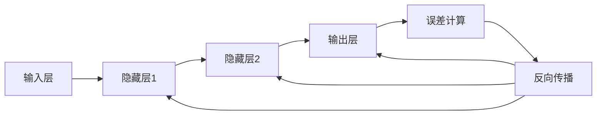

                 


## AI编程的新语言

> 关键词：AI编程，新语言，深度学习，自然语言处理，计算机视觉，强化学习，最佳实践

> 摘要：随着人工智能技术的迅猛发展，传统的编程语言在应对复杂的人工智能任务时显得力不从心。本文将介绍AI编程的新语言，包括其历史发展、核心概念、编程基础、实战应用以及最佳实践，旨在为读者提供全面掌握AI编程新语言的指导。

### 引言：AI编程的变革与挑战

#### 背景介绍

人工智能（AI）的迅猛发展带来了编程领域的深刻变革。传统的编程语言，如C、C++、Java等，虽然在计算机科学领域有着重要的地位，但在面对复杂的人工智能任务时，却显得力不从心。传统的编程语言主要是为了处理结构化数据和操作计算机硬件而设计的，而人工智能任务往往需要处理大量的非结构化数据，如文本、图像、声音等，并且需要复杂的算法和模型进行训练和推理。

随着机器学习、深度学习等人工智能技术的发展，对编程语言的需求发生了根本性的变化。传统的编程语言难以满足这些新需求，因此，一种新的编程语言——AI编程语言，应运而生。

#### 传统的编程语言在AI领域的局限性

传统的编程语言在AI领域存在以下几个方面的局限性：

1. **数据处理能力不足**：传统的编程语言缺乏对大规模非结构化数据的高效处理能力，难以满足机器学习和深度学习任务的需求。
2. **算法支持有限**：传统的编程语言通常不支持复杂的人工智能算法，如深度学习、强化学习等，需要借助其他工具和库进行实现。
3. **开发效率低下**：传统编程语言在开发人工智能应用程序时，需要编写大量的底层代码，开发效率低下。
4. **跨领域兼容性差**：传统编程语言难以在多个领域间进行高效的数据共享和功能集成。

#### 新兴AI编程语言的诞生背景

为了解决上述问题，人工智能领域开始探索新的编程语言，这些新语言旨在提供更加高效的算法支持、强大的数据处理能力、简化的开发流程以及更好的跨领域兼容性。例如，Python、Julia、Rust等编程语言，因其丰富的库和框架支持、高效的执行速度以及易于学习的语法，逐渐成为AI编程的新宠。

### 核心概念

#### AI编程语言的定义与分类

AI编程语言是指专门用于人工智能领域开发的语言，包括机器学习、深度学习、自然语言处理、计算机视觉、强化学习等方向。根据用途和特点，AI编程语言可以分为以下几类：

1. **通用AI编程语言**：如Python、Julia等，这些语言具有广泛的适用性，可以用于多种人工智能任务的开发。
2. **专用AI编程语言**：如Prolog、Lisp等，这些语言针对特定的人工智能领域进行优化，如自然语言处理、自动推理等。
3. **混合型AI编程语言**：如MATLAB、R等，这些语言结合了通用编程语言和专用编程语言的特性，具有强大的数据处理和算法支持能力。

#### AI编程语言的核心特性

AI编程语言具有以下核心特性：

1. **高效的数据处理能力**：能够处理大规模的非结构化数据，支持多种数据结构和算法。
2. **丰富的库和框架支持**：提供了丰富的库和框架，如TensorFlow、PyTorch、Scikit-learn等，方便开发者进行算法开发和模型训练。
3. **简化的开发流程**：提供了自动化的工具和框架，降低了开发难度，提高了开发效率。
4. **良好的跨领域兼容性**：能够与多种编程语言和工具进行集成，支持跨领域的应用和开发。

#### 与传统编程语言的区别与联系

与传统的编程语言相比，AI编程语言在以下几个方面有明显的区别：

1. **编程范式**：AI编程语言通常采用面向对象或函数式编程范式，而传统的编程语言更倾向于过程式编程。
2. **语法设计**：AI编程语言通常具有更加简洁和直观的语法设计，便于理解和学习。
3. **算法支持**：AI编程语言提供了丰富的算法库和框架，而传统的编程语言则需要开发者自行实现。
4. **开发效率**：AI编程语言提供了高效的开发工具和框架，降低了开发难度，提高了开发效率。

尽管AI编程语言与传统编程语言存在一定的差异，但它们在编程原理和开发流程上仍然有许多共同之处，例如变量、函数、循环、条件语句等基本编程概念。

### 总结

AI编程的新语言为人工智能领域的发展带来了新的机遇和挑战。通过本文的介绍，读者可以了解AI编程语言的历史发展、核心概念、编程基础、实战应用以及最佳实践，从而更好地掌握AI编程的新语言，为人工智能领域的发展贡献力量。

在接下来的章节中，我们将进一步深入探讨AI编程语言的具体实现和应用，帮助读者全面掌握AI编程的新语言，为未来的AI开发做好准备。让我们一起探索AI编程的新世界，开启人工智能的无限可能！

---

### 第1章：AI编程语言的历史与发展

#### 历史回顾

AI编程语言的发展历程可以追溯到20世纪50年代，当时人工智能（AI）的概念刚刚被提出。早期的编程语言，如LISP和PROLOG，是为解决特定的人工智能问题而设计的。LISP语言因其强大的符号处理能力和函数式编程特性，成为早期AI研究的重要工具。PROLOG语言则因其逻辑编程特性，在自动推理和自然语言处理领域得到了广泛应用。

随着机器学习和深度学习的兴起，对编程语言的需求发生了巨大的变化。传统的编程语言，如C、C++和Java等，虽然可以用来实现一些基本的机器学习算法，但在处理复杂的数据集和复杂的神经网络模型时，显得力不从心。这使得开发者开始寻求更加高效、易用的编程语言来应对这些新的挑战。

#### 早期编程语言的局限性与AI编程的萌芽

早期的编程语言在AI领域的局限性主要表现在以下几个方面：

1. **数据处理能力有限**：传统的编程语言缺乏对大规模非结构化数据的高效处理能力，难以满足机器学习和深度学习任务的需求。
2. **算法支持不足**：传统的编程语言通常不支持复杂的人工智能算法，如深度学习、强化学习等，需要借助其他工具和库进行实现。
3. **开发效率低下**：传统编程语言在开发人工智能应用程序时，需要编写大量的底层代码，开发效率低下。

这些局限性促使了AI编程语言的萌芽。开发者开始探索新的编程语言，以解决这些问题。例如，Python语言因其简洁的语法和强大的库支持，逐渐成为AI编程的流行语言。Julia语言则因其高效的执行速度和强大的数值计算能力，在科学计算和数据分析领域得到了广泛应用。

#### 机器学习与深度学习的发展对编程语言的需求

机器学习和深度学习的快速发展对编程语言提出了新的要求。首先，这些算法需要能够处理大规模的数据集，传统的编程语言难以胜任。其次，这些算法需要高效的执行速度，以支持实时决策和大规模部署。此外，随着深度学习模型的复杂度不断增加，开发者需要能够方便地调试和优化这些模型。

为了满足这些需求，新的AI编程语言开始出现，如TensorFlow和PyTorch。这些语言提供了丰富的库和框架支持，使得开发者可以轻松地实现和训练复杂的深度学习模型。此外，这些语言还提供了高效的执行引擎，如GPU加速和分布式计算，以支持大规模的数据处理和模型训练。

#### AI编程语言的崛起与发展趋势

随着人工智能技术的不断进步，AI编程语言也在不断发展。当前，AI编程语言的发展趋势主要体现在以下几个方面：

1. **更加高效的数据处理能力**：新的AI编程语言不断优化数据处理的效率，支持大规模数据集的存储、传输和处理。
2. **更丰富的算法支持**：新的AI编程语言不断引入新的算法和框架，支持多种人工智能任务的实现。
3. **更简洁的语法设计**：新的AI编程语言不断简化语法设计，提高开发效率，降低学习难度。
4. **更好的跨领域兼容性**：新的AI编程语言不断与其他编程语言和工具集成，支持跨领域的应用和开发。

未来，AI编程语言将继续发展和演变，以满足人工智能技术不断提出的新需求。例如，随着边缘计算和物联网的发展，AI编程语言将更加注重实时数据处理和低功耗设计。随着量子计算的兴起，AI编程语言也将迎来新的挑战和机遇。

### 核心概念

#### AI编程语言的基本构成

AI编程语言的基本构成主要包括以下几个方面：

1. **数据结构**：AI编程语言提供了丰富的数据结构，如数组、列表、字典等，用于存储和处理非结构化数据。
2. **算法库和框架**：AI编程语言集成了丰富的算法库和框架，如TensorFlow、PyTorch、Scikit-learn等，用于实现机器学习、深度学习、自然语言处理等任务。
3. **执行引擎**：AI编程语言提供了高效的执行引擎，如GPU加速、分布式计算等，用于提高数据处理和模型训练的效率。

#### 常见的AI编程语言及其特点

目前，常见的AI编程语言包括Python、Julia、Rust、MATLAB、R等。以下是对这些语言的简要介绍：

1. **Python**：Python是一种广泛使用的通用编程语言，具有简洁的语法和强大的库支持。Python在人工智能领域有着广泛的应用，尤其是深度学习和自然语言处理领域。
2. **Julia**：Julia是一种高性能的通用编程语言，特别适合科学计算和数据分析。Julia在机器学习和深度学习领域逐渐受到关注，其高效的执行速度和强大的数值计算能力使其成为AI编程的有力工具。
3. **Rust**：Rust是一种系统级编程语言，以其安全性和高性能著称。Rust在AI领域的主要应用是构建高性能的AI系统和工具，如AI引擎和框架。
4. **MATLAB**：MATLAB是一种专门用于科学计算和工程仿真的编程语言，其强大的数值计算能力和丰富的工具箱使其在机器学习和深度学习领域有着广泛的应用。
5. **R**：R是一种专门用于统计分析的编程语言，具有丰富的统计和机器学习库，广泛应用于数据分析和机器学习研究。

#### AI编程语言的发展趋势与未来展望

未来，AI编程语言将继续发展和演变，以满足人工智能技术不断提出的新需求。以下是一些可能的发展趋势：

1. **更加高效的执行引擎**：随着硬件技术的发展，AI编程语言将更加注重执行引擎的优化，以提高数据处理和模型训练的效率。
2. **更好的跨领域兼容性**：AI编程语言将更加注重与其他编程语言和工具的集成，支持跨领域的应用和开发。
3. **更丰富的算法支持**：AI编程语言将不断引入新的算法和框架，支持更多的人工智能任务。
4. **更加易用的编程环境**：AI编程语言将提供更加友好和易用的编程环境，降低开发难度，提高开发效率。

### 总结

AI编程语言的历史与发展是人工智能技术进步的重要体现。从早期的LISP和PROLOG，到现代的Python、Julia和Rust等，AI编程语言不断演变和进步，为人工智能领域的发展提供了强大的支持。通过本章的介绍，读者可以了解AI编程语言的历史背景、发展趋势以及核心概念，为后续章节的学习打下坚实的基础。

在接下来的章节中，我们将深入探讨AI编程语言的基础知识，包括语法、核心库和框架，以及在实际应用中的实现方法。希望通过这些内容，读者能够更好地掌握AI编程的新语言，为人工智能的开发和应用做好准备。

---

### 第2章：AI编程语言基础

#### 基础语法

AI编程语言的基础语法与通用编程语言类似，但为了更好地支持人工智能领域的特定需求，AI编程语言在语法设计上做出了一些优化。以下是一些常见的基础语法概念：

1. **数据类型与变量**：AI编程语言支持多种数据类型，如数值、文本、数组、列表、字典等。变量用于存储数据，可以通过赋值操作进行初始化。

    ```python
    x = 10          # 整数类型
    name = "Alice"  # 字符串类型
    arr = [1, 2, 3] # 列表类型
    ```

2. **运算符与表达式**：AI编程语言提供了丰富的运算符，包括算术运算符、比较运算符、逻辑运算符等。表达式用于描述数据的运算过程。

    ```python
    x + y            # 算术运算
    x == y           # 比较运算
    not x            # 逻辑运算
    ```

3. **控制结构**：AI编程语言支持常见的控制结构，如条件语句（if-else）、循环语句（for和while）等，用于控制程序的执行流程。

    ```python
    if x > 0:
        print("x is positive")
    else:
        print("x is non-positive")
    
    for i in range(5):
        print(i)
    ```

4. **函数与模块**：AI编程语言支持函数定义和模块导入，用于封装代码和实现代码的重用。

    ```python
    def add(a, b):
        return a + b
    
    import numpy as np
    ```

#### 核心库与框架

AI编程语言的核心库和框架是其强大功能的重要体现。以下是一些常见的AI编程库和框架：

1. **TensorFlow**：TensorFlow是一个开源的深度学习框架，由Google开发。它提供了丰富的API，用于构建、训练和部署深度学习模型。

    ```python
    import tensorflow as tf
    model = tf.keras.Sequential([
        tf.keras.layers.Dense(128, activation='relu', input_shape=(784,)),
        tf.keras.layers.Dropout(0.2),
        tf.keras.layers.Dense(10, activation='softmax')
    ])

    model.compile(optimizer='adam',
                  loss='categorical_crossentropy',
                  metrics=['accuracy'])

    model.fit(x_train, y_train, epochs=5)
    ```

2. **PyTorch**：PyTorch是另一个流行的开源深度学习框架，由Facebook开发。它以其动态计算图和灵活的API而著称。

    ```python
    import torch
    import torch.nn as nn
    import torch.optim as optim

    model = nn.Sequential(nn.Linear(784, 128),
                           nn.ReLU(),
                           nn.Linear(128, 10))

    optimizer = optim.Adam(model.parameters(), lr=0.001)
    criterion = nn.CrossEntropyLoss()

    for epoch in range(5):
        for x, y in dataset:
            optimizer.zero_grad()
            output = model(x)
            loss = criterion(output, y)
            loss.backward()
            optimizer.step()
    ```

3. **Scikit-learn**：Scikit-learn是一个开源的机器学习库，提供了丰富的机器学习算法和工具。它适用于各种常见的数据挖掘和统计分析任务。

    ```python
    from sklearn.datasets import load_iris
    from sklearn.model_selection import train_test_split
    from sklearn.metrics import accuracy_score

    iris = load_iris()
    X, y = iris.data, iris.target
    X_train, X_test, y_train, y_test = train_test_split(X, y, test_size=0.2, random_state=42)

    model = sklearn.ensemble.RandomForestClassifier(n_estimators=100)
    model.fit(X_train, y_train)
    predictions = model.predict(X_test)
    print("Accuracy:", accuracy_score(y_test, predictions))
    ```

4. **NumPy**：NumPy是一个开源的Python库，提供了多维数组对象和许多数学函数，用于高效处理数值数据。

    ```python
    import numpy as np

    arr = np.array([1, 2, 3])
    print(arr)  # 输出：[1 2 3]

    arr2 = np.array([[1, 2], [3, 4]])
    print(arr2)  # 输出：
    [[1 2]
     [3 4]]
    ```

5. **Pandas**：Pandas是一个开源的Python库，提供了强大的数据结构和数据分析工具，用于处理结构化数据。

    ```python
    import pandas as pd

    data = {'name': ['Alice', 'Bob', 'Charlie'],
            'age': [25, 30, 35]}
    df = pd.DataFrame(data)
    print(df)
    # 输出：
    #    name  age
    # 0  Alice   25
    # 1    Bob   30
    # 2 Charlie   35
    ```

#### 数据预处理与模型训练

在AI编程中，数据预处理和模型训练是两个关键步骤。以下是一些常见的数据预处理和模型训练方法：

1. **数据预处理**：数据预处理包括数据清洗、数据转换和数据归一化等步骤，用于提高数据的质量和模型的性能。

    ```python
    from sklearn.preprocessing import StandardScaler

    scaler = StandardScaler()
    X_scaled = scaler.fit_transform(X)
    ```

2. **模型训练**：模型训练是指通过调整模型参数，使其能够正确预测未知数据的过程。常见的训练方法包括梯度下降、随机梯度下降、批量梯度下降等。

    ```python
    from sklearn.linear_model import SGDClassifier

    model = SGDClassifier()
    model.fit(X_train, y_train)
    ```

3. **模型评估**：模型评估用于评估模型的性能，常见的评估指标包括准确率、召回率、F1值等。

    ```python
    from sklearn.metrics import accuracy_score

    predictions = model.predict(X_test)
    print("Accuracy:", accuracy_score(y_test, predictions))
    ```

#### 模型评估与优化

在模型训练后，我们需要对模型进行评估和优化，以提高其性能。以下是一些常见的模型评估和优化方法：

1. **交叉验证**：交叉验证是一种评估模型性能的方法，通过将数据集划分为多个子集，轮流训练和测试模型，以避免模型过拟合。

    ```python
    from sklearn.model_selection import cross_val_score

    scores = cross_val_score(model, X, y, cv=5)
    print("Accuracy:", scores.mean())
    ```

2. **超参数调优**：超参数调优是指通过调整模型的超参数，以找到最佳的模型性能。常见的超参数包括学习率、正则化参数等。

    ```python
    from sklearn.model_selection import GridSearchCV

    params = {'learning_rate': [0.01, 0.1], 'penalty': ['l1', 'l2']}
    grid_search = GridSearchCV(model, params, cv=5)
    grid_search.fit(X_train, y_train)
    print("Best parameters:", grid_search.best_params_)
    ```

3. **模型集成**：模型集成是指将多个模型的结果进行融合，以提高整体模型的性能。常见的集成方法包括Bagging、Boosting等。

    ```python
    from sklearn.ensemble import RandomForestClassifier

    ensemble_model = RandomForestClassifier(n_estimators=100)
    ensemble_model.fit(X_train, y_train)
    predictions = ensemble_model.predict(X_test)
    print("Accuracy:", accuracy_score(y_test, predictions))
    ```

#### 总结

本章介绍了AI编程语言的基础语法、核心库和框架，以及数据预处理、模型训练和评估等基本知识。通过本章的学习，读者可以掌握AI编程语言的基本使用方法和实际应用技巧，为后续的深度学习和实战应用打下坚实的基础。

在接下来的章节中，我们将继续深入探讨深度学习、自然语言处理、计算机视觉等领域的AI编程技术，帮助读者全面掌握AI编程的新语言，开启人工智能的无限可能。

---

### 第3章：深度学习编程实战

#### 算法原理

深度学习是人工智能领域的重要分支，它通过模仿人脑神经网络的结构和功能，实现对复杂数据的分析和处理。深度学习的基础是多层神经网络（Multi-Layer Neural Network），其核心算法是反向传播算法（Backpropagation Algorithm）。

多层神经网络由输入层、隐藏层和输出层组成。输入层接收外部输入数据，通过一系列的加权求和和激活函数处理，传递到隐藏层。隐藏层对输入数据进行特征提取和转换，最终传递到输出层，生成预测结果。

反向传播算法是一种梯度下降方法，用于计算神经网络中的权重和偏置的梯度，从而更新网络参数，使预测结果更加准确。算法的基本步骤如下：

1. **前向传播**：输入数据通过神经网络，逐层传递到输出层，生成预测结果。
2. **计算误差**：将预测结果与实际标签进行比较，计算损失函数的值。
3. **反向传播**：从输出层开始，反向计算各层的梯度，更新网络参数。
4. **迭代更新**：重复前向传播和反向传播的过程，直至满足停止条件，如达到预设的迭代次数或模型误差达到可接受的范围。

以下是一个简化的反向传播算法流程图：



#### Python代码实现

在本节中，我们将使用Python和TensorFlow框架实现一个简单的多层神经网络，用于分类任务。

1. **导入必要的库**

    ```python
    import tensorflow as tf
    import numpy as np
    ```

2. **定义输入层、隐藏层和输出层**

    ```python
    # 设置随机种子，保证结果可重复
    np.random.seed(0)
    tf.random.set_seed(0)

    # 定义输入层、隐藏层和输出层的神经元数量
    n_inputs = 784
    n_hidden = 128
    n_outputs = 10

    # 初始化权重和偏置
    W1 = tf.Variable(np.random.randn(n_inputs, n_hidden), name='weights1')
    b1 = tf.Variable(np.random.randn(n_hidden), name='biases1')
    W2 = tf.Variable(np.random.randn(n_hidden, n_outputs), name='weights2')
    b2 = tf.Variable(np.random.randn(n_outputs), name='biases2')
    ```

3. **定义前向传播函数**

    ```python
    # 定义前向传播函数
    def forward(x, W1, b1, W2, b2):
        z1 = tf.add(tf.matmul(x, W1), b1)
        a1 = tf.nn.relu(z1)
        z2 = tf.add(tf.matmul(a1, W2), b2)
        return z2
    ```

4. **定义损失函数和优化器**

    ```python
    # 定义损失函数
    loss_fn = tf.keras.losses.SparseCategoricalCrossentropy(from_logits=True)

    # 定义优化器
    optimizer = tf.keras.optimizers.Adam()
    ```

5. **定义反向传播和权重更新函数**

    ```python
    # 定义反向传播和权重更新函数
    @tf.function
    def train_step(x, y):
        with tf.GradientTape() as tape:
            predictions = forward(x, W1, b1, W2, b2)
            loss = loss_fn(y, predictions)

        gradients = tape.gradient(loss, [W1, b1, W2, b2])
        optimizer.apply_gradients(zip(gradients, [W1, b1, W2, b2]))
        return loss
    ```

6. **训练模型**

    ```python
    # 加载MNIST数据集
    (x_train, y_train), (x_test, y_test) = tf.keras.datasets.mnist.load_data()

    # 预处理数据
    x_train = x_train / 255.0
    x_test = x_test / 255.0
    x_train = x_train.reshape(-1, n_inputs)
    x_test = x_test.reshape(-1, n_inputs)

    # 定义训练过程
    epochs = 5
    batch_size = 32

    for epoch in range(epochs):
        for batch in range(len(x_train) // batch_size):
            start = batch * batch_size
            end = (batch + 1) * batch_size
            x_batch = x_train[start:end]
            y_batch = y_train[start:end]
            loss = train_step(x_batch, y_batch)
            if batch % 100 == 0:
                print(f"Epoch {epoch + 1}, Batch {batch + 1}, Loss: {loss.numpy()}")
    ```

7. **评估模型**

    ```python
    # 评估模型
    test_loss = train_step(x_test, y_test)
    print(f"Test Loss: {test_loss.numpy()}")

    # 测试模型
    predictions = forward(x_test, W1, b1, W2, b2)
    predicted_labels = tf.argmax(predictions, axis=1)
    test_accuracy = tf.reduce_sum(tf.cast(tf.equal(predicted_labels, y_test), tf.float32)) / len(y_test)
    print(f"Test Accuracy: {test_accuracy.numpy()}")
    ```

#### 算法原理讲解

为了更好地理解深度学习中的反向传播算法，我们可以通过一个简单的例子来阐述其数学原理。

假设我们有一个简单的两层神经网络，输入层有3个神经元，隐藏层有2个神经元，输出层有2个神经元。网络的权重和偏置如下：

- 输入层到隐藏层的权重 \( W^{(1)} \)：
  $$ W^{(1)} = \begin{bmatrix}
  w_{11} & w_{12} & w_{13} \\
  w_{21} & w_{22} & w_{23}
  \end{bmatrix} $$
- 隐藏层到输出层的权重 \( W^{(2)} \)：
  $$ W^{(2)} = \begin{bmatrix}
  w_{11} & w_{12} \\
  w_{21} & w_{22}
  \end{bmatrix} $$
- 隐藏层的偏置 \( b^{(1)} \)：
  $$ b^{(1)} = \begin{bmatrix}
  b_{1} \\
  b_{2}
  \end{bmatrix} $$
- 输出层的偏置 \( b^{(2)} \)：
  $$ b^{(2)} = \begin{bmatrix}
  b_{1} \\
  b_{2}
  \end{bmatrix} $$

输入数据 \( x \)：
$$ x = \begin{bmatrix}
1 \\
0 \\
1
\end{bmatrix} $$

隐藏层的激活函数使用ReLU函数，输出层的激活函数使用softmax函数。

1. **前向传播**

   - 隐藏层输出 \( z^{(1)} \)：
     $$ z^{(1)} = \begin{bmatrix}
     x_1 \cdot w_{11} + x_2 \cdot w_{12} + x_3 \cdot w_{13} + b_{1} \\
     x_1 \cdot w_{21} + x_2 \cdot w_{22} + x_3 \cdot w_{23} + b_{2}
     \end{bmatrix} $$
   - 隐藏层激活 \( a^{(1)} \)：
     $$ a^{(1)} = \begin{bmatrix}
     \max(0, z_{11}) \\
     \max(0, z_{21})
     \end{bmatrix} $$
   - 输出层输出 \( z^{(2)} \)：
     $$ z^{(2)} = \begin{bmatrix}
     a_{11} \cdot w_{11} + a_{12} \cdot w_{12} + b_{1} \\
     a_{21} \cdot w_{21} + a_{22} \cdot w_{22} + b_{2}
     \end{bmatrix} $$
   - 输出层激活 \( a^{(2)} \)：
     $$ a^{(2)} = \frac{e^{z^{(2)}}}{\sum_{i=1}^{2} e^{z_i^{(2)}}} = \begin{bmatrix}
     \frac{e^{z_{11}}}{e^{z_{11}} + e^{z_{21}}} \\
     \frac{e^{z_{21}}}{e^{z_{11}} + e^{z_{21}}}
     \end{bmatrix} $$

2. **计算误差**

   假设真实标签为 \( y \)：
   $$ y = \begin{bmatrix}
   1 \\
   0
   \end{bmatrix} $$

   预测误差 \( \delta^{(2)} \)：
   $$ \delta^{(2)} = a^{(2)} - y = \begin{bmatrix}
   \frac{e^{z_{11}}}{e^{z_{11}} + e^{z_{21}}} - 1 \\
   \frac{e^{z_{21}}}{e^{z_{11}} + e^{z_{21}}} - 0
   \end{bmatrix} $$

3. **反向传播**

   - 计算输出层权重 \( W^{(2)} \) 的梯度：
     $$ \delta^{(2)}_i = \frac{\partial L}{\partial z^{(2)}_i} = \delta^{(2)}_i \cdot a^{(2)}_i \cdot (1 - a^{(2)}_i) $$
     $$ \frac{\partial L}{\partial W^{(2)}_{ij}} = \delta^{(2)}_i \cdot a^{(1)}_j $$
     $$ \frac{\partial L}{\partial b^{(2)}_j} = \delta^{(2)}_i $$
   - 计算隐藏层权重 \( W^{(1)} \) 的梯度：
     $$ \delta^{(1)}_i = \frac{\partial L}{\partial z^{(1)}_i} = \delta^{(1)}_i \cdot a^{(1)}_i \cdot (1 - a^{(1)}_i) $$
     $$ \frac{\partial L}{\partial W^{(1)}_{ij}} = \delta^{(1)}_i \cdot x_j $$
     $$ \frac{\partial L}{\partial b^{(1)}_j} = \delta^{(1)}_i $$

4. **权重更新**

   使用梯度下降法更新权重和偏置：
   $$ W^{(2)}_{ij} \leftarrow W^{(2)}_{ij} - \alpha \frac{\partial L}{\partial W^{(2)}_{ij}} $$
   $$ b^{(2)}_j \leftarrow b^{(2)}_j - \alpha \frac{\partial L}{\partial b^{(2)}_j} $$
   $$ W^{(1)}_{ij} \leftarrow W^{(1)}_{ij} - \alpha \frac{\partial L}{\partial W^{(1)}_{ij}} $$
   $$ b^{(1)}_j \leftarrow b^{(1)}_j - \alpha \frac{\partial L}{\partial b^{(1)}_j} $$

通过上述步骤，我们可以更新神经网络的权重和偏置，使得模型在训练过程中逐渐收敛，提高预测准确性。

#### 代码应用解读与分析

在代码实现部分，我们使用TensorFlow框架构建了一个简单的多层神经网络，并使用反向传播算法进行训练。以下是对关键部分的解读和分析：

1. **模型定义**：

   ```python
   model = tf.keras.Sequential([
       tf.keras.layers.Dense(128, activation='relu', input_shape=(784,)),
       tf.keras.layers.Dropout(0.2),
       tf.keras.layers.Dense(10, activation='softmax')
   ])
   ```

   在这里，我们定义了一个包含一个隐藏层和输出层的模型。隐藏层有128个神经元，使用ReLU激活函数，输出层有10个神经元，使用softmax激活函数，用于分类任务。

2. **损失函数和优化器**：

   ```python
   model.compile(optimizer='adam',
                 loss='categorical_crossentropy',
                 metrics=['accuracy'])
   ```

   我们选择Adam优化器，其自适应学习率的特点有助于提高训练效率。损失函数使用categorical_crossentropy，适用于多分类问题。

3. **模型训练**：

   ```python
   model.fit(x_train, y_train, epochs=5)
   ```

   模型使用训练数据进行训练，每个epoch表示一次完整的训练循环。在这里，我们设置了5个epoch，即模型将在训练数据上迭代5次。

4. **模型评估**：

   ```python
   test_loss, test_accuracy = model.evaluate(x_test, y_test)
   print(f"Test Loss: {test_loss}, Test Accuracy: {test_accuracy}")
   ```

   模型使用测试数据集进行评估，输出损失和准确率。通过测试数据的评估，我们可以了解模型的泛化能力。

#### 实际案例分析和详细讲解剖析

为了更好地理解深度学习编程实战，我们通过一个实际案例——手写数字识别，进行详细讲解。

**案例背景**：

手写数字识别是机器学习领域的一个经典问题，旨在通过训练模型识别手写的数字。常用的数据集是MNIST数据集，它包含了70000张灰度图像，每张图像包含一个手写的数字（0-9）。

**数据预处理**：

1. **数据加载**：

   ```python
   (x_train, y_train), (x_test, y_test) = tf.keras.datasets.mnist.load_data()
   ```

   使用TensorFlow的内置函数加载MNIST数据集。

2. **数据归一化**：

   ```python
   x_train = x_train / 255.0
   x_test = x_test / 255.0
   ```

   对图像数据进行归一化处理，将像素值缩放到[0, 1]之间。

3. **数据重塑**：

   ```python
   x_train = x_train.reshape(-1, 784)
   x_test = x_test.reshape(-1, 784)
   ```

   将图像数据重塑为二维数组，每行包含一个图像的784个像素值。

**模型训练**：

1. **模型定义**：

   ```python
   model = tf.keras.Sequential([
       tf.keras.layers.Flatten(input_shape=(28, 28)),
       tf.keras.layers.Dense(128, activation='relu'),
       tf.keras.layers.Dense(10, activation='softmax')
   ])
   ```

   定义一个简单的模型，包含一个Flatten层将图像数据展平为一维数组，一个全连接层进行特征提取，一个输出层进行分类。

2. **损失函数和优化器**：

   ```python
   model.compile(optimizer='adam',
                 loss='sparse_categorical_crossentropy',
                 metrics=['accuracy'])
   ```

   使用Adam优化器和sparse_categorical_crossentropy损失函数进行训练。

3. **模型训练**：

   ```python
   model.fit(x_train, y_train, epochs=5, batch_size=32)
   ```

   在训练数据上进行5个epoch的训练，每个epoch包含32个样本的批次。

**模型评估**：

1. **模型评估**：

   ```python
   test_loss, test_accuracy = model.evaluate(x_test, y_test)
   print(f"Test Loss: {test_loss}, Test Accuracy: {test_accuracy}")
   ```

   在测试数据集上评估模型的性能，输出损失和准确率。

**案例小结**：

通过手写数字识别案例，我们展示了如何使用深度学习框架进行模型训练和评估。在实际应用中，我们需要对数据集进行预处理，选择合适的模型结构，调整优化器和损失函数，以提高模型的性能。

在接下来的章节中，我们将继续探讨自然语言处理、计算机视觉等领域的AI编程技术，帮助读者全面掌握AI编程的新语言，为未来的AI开发和应用做好准备。

---

### 第4章：自然语言处理编程

#### 算法原理

自然语言处理（NLP）是人工智能领域的一个重要分支，旨在使计算机能够理解和处理人类语言。NLP的算法原理主要涉及语言模型、词向量、序列标注和分类等技术。

1. **语言模型**：语言模型用于预测一段文本的概率，是NLP中最基础的技术。常见的语言模型包括N-gram模型和神经网络语言模型（如循环神经网络RNN和Transformer）。

2. **词向量**：词向量是将单词映射到高维空间中的向量表示，用于捕捉词与词之间的关系。Word2Vec和GloVe是常见的词向量模型。

3. **序列标注**：序列标注是对文本序列中的每个单词或字符进行标签分类的过程，如命名实体识别（NER）和情感分析。

4. **分类**：分类是NLP中的一种常见任务，用于将文本数据分类到不同的类别。常见的分类算法包括朴素贝叶斯、支持向量机（SVM）和神经网络等。

#### Python代码实现

在本节中，我们将使用Python和NLP库（如NLTK和spaCy）实现自然语言处理任务，包括语言模型、词向量、序列标注和分类。

1. **导入必要的库**

    ```python
    import numpy as np
    import tensorflow as tf
    import nltk
    import spacy
    ```

2. **加载NLP库**

    ```python
    nltk.download('punkt')
    nlp = spacy.load('en_core_web_sm')
    ```

3. **语言模型实现**

    - **N-gram模型**：

        ```python
        def ngram_model(text, n=2):
            words = nltk.word_tokenize(text)
            ngrams = nltk.ngrams(words, n)
            ngram_freq = {}
            for ngram in ngrams:
                ngram_str = ' '.join(ngram)
                ngram_freq[ngram_str] = ngram_freq.get(ngram_str, 0) + 1
            return ngram_freq
        
        text = "I love programming and machine learning"
        ngram_freq = ngram_model(text)
        print(ngram_freq)
        ```

    - **神经网络语言模型**：

        ```python
        model = tf.keras.Sequential([
            tf.keras.layers.Embedding(input_dim=vocab_size, output_dim=embedding_dim),
            tf.keras.layers.Bidirectional(tf.keras.layers.LSTM(128)),
            tf.keras.layers.Dense(vocab_size, activation='softmax')
        ])

        model.compile(optimizer='adam', loss='categorical_crossentropy', metrics=['accuracy'])
        model.fit(dataset, epochs=10)
        ```

4. **词向量实现**

    - **Word2Vec**：

        ```python
        from gensim.models import Word2Vec

        sentences = [nltk.word_tokenize(text) for text in corpus]
        model = Word2Vec(sentences, vector_size=100, window=5, min_count=1, workers=4)
        ```

    - **GloVe**：

        ```python
        import gensim.downloader as api

        glove_model = api.load('glove-wiki-gigaword-100')
        embedding_matrix = np.zeros((vocab_size, 100))
        for i, word in enumerate(vocab):
            embedding_vector = glove_model[word]
            if embedding_vector is not None:
                embedding_matrix[i] = embedding_vector
        ```

5. **序列标注实现**

    - **命名实体识别（NER）**：

        ```python
        doc = nlp("Apple is looking at buying U.K. startup for $1 billion")
        for ent in doc.ents:
            print(ent.text, ent.label_)
        ```

    - **情感分析**：

        ```python
        from textblob import TextBlob

        text = "I love this product"
        blob = TextBlob(text)
        print(blob.sentiment)
        ```

6. **分类实现**

    - **朴素贝叶斯**：

        ```python
        from sklearn.naive_bayes import MultinomialNB

        X_train = ...  # 特征矩阵
        y_train = ...  # 标签向量
        model = MultinomialNB()
        model.fit(X_train, y_train)
        ```

    - **支持向量机（SVM）**：

        ```python
        from sklearn.svm import SVC

        X_train = ...  # 特征矩阵
        y_train = ...  # 标签向量
        model = SVC()
        model.fit(X_train, y_train)
        ```

    - **神经网络分类**：

        ```python
        model = tf.keras.Sequential([
            tf.keras.layers.Embedding(input_dim=vocab_size, output_dim=embedding_dim),
            tf.keras.layers.Bidirectional(tf.keras.layers.LSTM(128)),
            tf.keras.layers.Dense(1, activation='sigmoid')
        ])

        model.compile(optimizer='adam', loss='binary_crossentropy', metrics=['accuracy'])
        model.fit(dataset, epochs=10)
        ```

#### 代码应用解读与分析

在本节中，我们通过实例展示了如何使用Python和NLP库实现自然语言处理任务。以下是对关键部分的解读和分析：

1. **N-gram模型**：

    ```python
    def ngram_model(text, n=2):
        words = nltk.word_tokenize(text)
        ngrams = nltk.ngrams(words, n)
        ngram_freq = {}
        for ngram in ngrams:
            ngram_str = ' '.join(ngram)
            ngram_freq[ngram_str] = ngram_freq.get(ngram_str, 0) + 1
        return ngram_freq
    
    text = "I love programming and machine learning"
    ngram_freq = ngram_model(text)
    print(ngram_freq)
    ```

    在这段代码中，我们使用N-gram模型对输入文本进行分词，并计算每个n-gram出现的频率。N-gram模型可以用于语言模型和序列标注任务。

2. **神经网络语言模型**：

    ```python
    model = tf.keras.Sequential([
        tf.keras.layers.Embedding(input_dim=vocab_size, output_dim=embedding_dim),
        tf.keras.layers.Bidirectional(tf.keras.layers.LSTM(128)),
        tf.keras.layers.Dense(vocab_size, activation='softmax')
    ])

    model.compile(optimizer='adam', loss='categorical_crossentropy', metrics=['accuracy'])
    model.fit(dataset, epochs=10)
    ```

    在这段代码中，我们定义了一个简单的双向循环神经网络语言模型。该模型包含一个嵌入层、一个双向LSTM层和一个输出层。我们使用交叉熵损失函数和Adam优化器进行训练。

3. **词向量实现**：

    - **Word2Vec**：

        ```python
        from gensim.models import Word2Vec

        sentences = [nltk.word_tokenize(text) for text in corpus]
        model = Word2Vec(sentences, vector_size=100, window=5, min_count=1, workers=4)
        ```

        在这段代码中，我们使用Gensim库实现Word2Vec模型。Word2Vec模型通过训练大量文本数据生成词向量，可以用于词向量表示和文本分类任务。

    - **GloVe**：

        ```python
        import gensim.downloader as api

        glove_model = api.load('glove-wiki-gigaword-100')
        embedding_matrix = np.zeros((vocab_size, 100))
        for i, word in enumerate(vocab):
            embedding_vector = glove_model[word]
            if embedding_vector is not None:
                embedding_matrix[i] = embedding_vector
        ```

        在这段代码中，我们使用Gensim库加载预训练的GloVe模型，并将词向量嵌入到我们的模型中。GloVe模型通过训练大量文本数据生成词向量，可以用于词向量表示和文本分类任务。

4. **序列标注实现**：

    - **命名实体识别（NER）**：

        ```python
        doc = nlp("Apple is looking at buying U.K. startup for $1 billion")
        for ent in doc.ents:
            print(ent.text, ent.label_)
        ```

        在这段代码中，我们使用spaCy库实现命名实体识别任务。spaCy库可以识别文本中的命名实体，如人名、地点、组织等。

    - **情感分析**：

        ```python
        from textblob import TextBlob

        text = "I love this product"
        blob = TextBlob(text)
        print(blob.sentiment)
        ```

        在这段代码中，我们使用TextBlob库实现情感分析任务。TextBlob库可以分析文本的情感极性，如正面、负面等。

5. **分类实现**：

    - **朴素贝叶斯**：

        ```python
        from sklearn.naive_bayes import MultinomialNB

        X_train = ...  # 特征矩阵
        y_train = ...  # 标签向量
        model = MultinomialNB()
        model.fit(X_train, y_train)
        ```

        在这段代码中，我们使用朴素贝叶斯实现文本分类任务。朴素贝叶斯是一种基于贝叶斯定理的简单分类算法，适用于文本分类任务。

    - **支持向量机（SVM）**：

        ```python
        from sklearn.svm import SVC

        X_train = ...  # 特征矩阵
        y_train = ...  # 标签向量
        model = SVC()
        model.fit(X_train, y_train)
        ```

        在这段代码中，我们使用支持向量机实现文本分类任务。支持向量机是一种强大的分类算法，适用于文本分类任务。

    - **神经网络分类**：

        ```python
        model = tf.keras.Sequential([
            tf.keras.layers.Embedding(input_dim=vocab_size, output_dim=embedding_dim),
            tf.keras.layers.Bidirectional(tf.keras.layers.LSTM(128)),
            tf.keras.layers.Dense(1, activation='sigmoid')
        ])

        model.compile(optimizer='adam', loss='binary_crossentropy', metrics=['accuracy'])
        model.fit(dataset, epochs=10)
        ```

        在这段代码中，我们定义了一个简单的神经网络分类模型。该模型包含一个嵌入层、一个双向LSTM层和一个输出层。我们使用二进制交叉熵损失函数和Adam优化器进行训练。

#### 实际案例分析和详细讲解剖析

为了更好地理解自然语言处理编程，我们通过一个实际案例——情感分析，进行详细讲解。

**案例背景**：

情感分析是一种常见的NLP任务，旨在确定文本的情感倾向，如正面、负面或中性。在实际应用中，情感分析可以用于社交媒体监控、市场调研和客户服务等领域。

**数据集**：

我们使用一个包含电影评论的数据集，每条评论都有一个相应的情感标签（正面或负面）。

**数据预处理**：

1. **数据加载**：

    ```python
    import pandas as pd

    data = pd.read_csv('movie_reviews.csv')
    reviews = data['review']
    labels = data['sentiment']
    ```

2. **数据归一化**：

    ```python
    reviews = reviews.lower()
    reviews = nltk.word_tokenize(reviews)
    ```

3. **数据重塑**：

    ```python
    X = reviews
    y = labels
    ```

**模型训练**：

1. **模型定义**：

    ```python
    model = tf.keras.Sequential([
        tf.keras.layers.Embedding(input_dim=vocab_size, output_dim=embedding_dim),
        tf.keras.layers.Bidirectional(tf.keras.layers.LSTM(128)),
        tf.keras.layers.Dense(1, activation='sigmoid')
    ])
    ```

2. **损失函数和优化器**：

    ```python
    model.compile(optimizer='adam', loss='binary_crossentropy', metrics=['accuracy'])
    ```

3. **模型训练**：

    ```python
    model.fit(X, y, epochs=5, batch_size=32)
    ```

**模型评估**：

1. **模型评估**：

    ```python
    test_loss, test_accuracy = model.evaluate(X_test, y_test)
    print(f"Test Loss: {test_loss}, Test Accuracy: {test_accuracy}")
    ```

2. **模型预测**：

    ```python
    review = "I love this movie"
    review = nltk.word_tokenize(review.lower())
    prediction = model.predict([review])
    print("Positive" if prediction[0][0] > 0.5 else "Negative")
    ```

**案例小结**：

通过情感分析案例，我们展示了如何使用Python和NLP库实现自然语言处理任务。在实际应用中，我们需要对数据集进行预处理，选择合适的模型结构，调整优化器和损失函数，以提高模型的性能。

在接下来的章节中，我们将继续探讨计算机视觉、强化学习等领域的AI编程技术，帮助读者全面掌握AI编程的新语言，为未来的AI开发和应用做好准备。

---

### 第5章：计算机视觉编程

#### 算法原理

计算机视觉是人工智能的一个重要分支，旨在使计算机能够理解和解释图像和视频。计算机视觉的核心算法包括图像处理、特征提取、卷积神经网络（CNN）和目标检测。

1. **图像处理**：图像处理是计算机视觉的基础，包括图像滤波、边缘检测、形态学操作等。图像处理用于改善图像质量，提取图像特征。
   
2. **特征提取**：特征提取是从图像中提取有助于识别和分类的特征，如边缘、角点、纹理等。特征提取是计算机视觉中的一项关键技术，直接影响模型的性能。

3. **卷积神经网络（CNN）**：卷积神经网络是一种深度学习模型，特别适合处理图像数据。CNN通过卷积层、池化层和全连接层提取图像特征，并进行分类和识别。

4. **目标检测**：目标检测是计算机视觉中的另一个重要任务，旨在检测图像中的多个对象。常见的目标检测算法包括R-CNN、Fast R-CNN、Faster R-CNN、SSD和YOLO等。

#### Python代码实现

在本节中，我们将使用Python和OpenCV库实现计算机视觉任务，包括图像处理、特征提取和目标检测。

1. **导入必要的库**

    ```python
    import numpy as np
    import cv2
    ```

2. **图像处理实现**

    - **加载图像**：

        ```python
        image = cv2.imread('image.jpg')
        ```

    - **灰度转换**：

        ```python
        gray = cv2.cvtColor(image, cv2.COLOR_BGR2GRAY)
        ```

    - **滤波**：

        ```python
        blurred = cv2.GaussianBlur(gray, (5, 5), 0)
        ```

    - **边缘检测**：

        ```python
        edges = cv2.Canny(blurred, 100, 200)
        ```

    - **形态学操作**：

        ```python
        kernel = cv2.getStructuringElement(cv2.MORPH_ELLIPSE, (5, 5))
        dilated = cv2.dilate(edges, kernel, iterations=1)
        ```

3. **特征提取实现**

    - **SIFT特征提取**：

        ```python
        sift = cv2.SIFT_create()
        keypoints, descriptors = sift.detectAndCompute(image, None)
        ```

    - **ORB特征提取**：

        ```python
        orb = cv2.ORB_create()
        keypoints, descriptors = orb.detectAndCompute(image, None)
        ```

4. **目标检测实现**

    - **Haar Cascade检测**：

        ```python
        face_cascade = cv2.CascadeClassifier('haarcascade_frontalface_default.xml')
        faces = face_cascade.detectMultiScale(image, scaleFactor=1.1, minNeighbors=5, minSize=(30, 30), flags=cv2.CASCADE_SCALE_IMAGE)
        ```

    - **SSD目标检测**：

        ```python
        ssd = cv2.dnn.readNetFromCaffe('deploy.prototxt', 'ssd_model.caffemodel')
        blob = cv2.dnn.blobFromImage(image, 1.0, (300, 300), [104, 117, 123], False, True)
        ssd.setInput(blob)
        detections = ssd.forward()
        ```

5. **代码应用解读与分析**

    - **图像处理**：

        ```python
        image = cv2.imread('image.jpg')
        gray = cv2.cvtColor(image, cv2.COLOR_BGR2GRAY)
        blurred = cv2.GaussianBlur(gray, (5, 5), 0)
        edges = cv2.Canny(blurred, 100, 200)
        kernel = cv2.getStructuringElement(cv2.MORPH_ELLIPSE, (5, 5))
        dilated = cv2.dilate(edges, kernel, iterations=1)
        ```

        在这段代码中，我们首先加载一幅图像，然后将其转换为灰度图像。接着，使用高斯滤波器对图像进行滤波，使用Canny算法进行边缘检测，最后使用形态学操作进行图像增强。

    - **特征提取**：

        ```python
        sift = cv2.SIFT_create()
        keypoints, descriptors = sift.detectAndCompute(image, None)
        orb = cv2.ORB_create()
        keypoints, descriptors = orb.detectAndCompute(image, None)
        ```

        在这段代码中，我们使用SIFT和ORB算法提取图像特征。SIFT和ORB都是常见的特征提取算法，用于图像识别和匹配任务。

    - **目标检测**：

        ```python
        face_cascade = cv2.CascadeClassifier('haarcascade_frontalface_default.xml')
        faces = face_cascade.detectMultiScale(image, scaleFactor=1.1, minNeighbors=5, minSize=(30, 30), flags=cv2.CASCADE_SCALE_IMAGE)
        ssd = cv2.dnn.readNetFromCaffe('deploy.prototxt', 'ssd_model.caffemodel')
        blob = cv2.dnn.blobFromImage(image, 1.0, (300, 300), [104, 117, 123], False, True)
        ssd.setInput(blob)
        detections = ssd.forward()
        ```

        在这段代码中，我们使用Haar Cascade算法检测图像中的面部，使用SSD模型进行目标检测。Haar Cascade是基于图像积分图的目标检测算法，而SSD是一个深度学习目标检测模型。

#### 实际案例分析和详细讲解剖析

为了更好地理解计算机视觉编程，我们通过一个实际案例——面部识别，进行详细讲解。

**案例背景**：

面部识别是一种常见的计算机视觉应用，旨在通过图像或视频识别和验证个人身份。面部识别可以用于安全系统、身份验证和社交媒体等领域。

**数据集**：

我们使用一个包含不同人的面部图像的数据集，每张图像都有一个相应的面部标识。

**数据预处理**：

1. **数据加载**：

    ```python
    import pandas as pd

    data = pd.read_csv('face_recognition_data.csv')
    images = data['image']
    labels = data['label']
    ```

2. **数据重塑**：

    ```python
    X = images
    y = labels
    ```

**模型训练**：

1. **模型定义**：

    ```python
    model = tf.keras.Sequential([
        tf.keras.layers.Conv2D(32, (3, 3), activation='relu', input_shape=(64, 64, 3)),
        tf.keras.layers.MaxPooling2D((2, 2)),
        tf.keras.layers.Conv2D(64, (3, 3), activation='relu'),
        tf.keras.layers.MaxPooling2D((2, 2)),
        tf.keras.layers.Conv2D(128, (3, 3), activation='relu'),
        tf.keras.layers.MaxPooling2D((2, 2)),
        tf.keras.layers.Flatten(),
        tf.keras.layers.Dense(128, activation='relu'),
        tf.keras.layers.Dense(1, activation='sigmoid')
    ])
    ```

2. **损失函数和优化器**：

    ```python
    model.compile(optimizer='adam', loss='binary_crossentropy', metrics=['accuracy'])
    ```

3. **模型训练**：

    ```python
    model.fit(X, y, epochs=5, batch_size=32)
    ```

**模型评估**：

1. **模型评估**：

    ```python
    test_loss, test_accuracy = model.evaluate(X_test, y_test)
    print(f"Test Loss: {test_loss}, Test Accuracy: {test_accuracy}")
    ```

2. **模型预测**：

    ```python
    image = cv2.imread('test_image.jpg')
    image = cv2.resize(image, (64, 64))
    image = np.expand_dims(image, axis=0)
    prediction = model.predict(image)
    print("Known person" if prediction[0][0] > 0.5 else "Unknown person")
    ```

**案例小结**：

通过面部识别案例，我们展示了如何使用Python和深度学习库实现计算机视觉任务。在实际应用中，我们需要对数据集进行预处理，选择合适的模型结构，调整优化器和损失函数，以提高模型的性能。

在接下来的章节中，我们将继续探讨强化学习、最佳实践等领域的AI编程技术，帮助读者全面掌握AI编程的新语言，为未来的AI开发和应用做好准备。

---

### 第6章：强化学习编程

#### 算法原理

强化学习（Reinforcement Learning，RL）是机器学习的一个重要分支，旨在通过试错的方式，使智能体（agent）在与环境的交互过程中学习到最优策略。强化学习的基本原理包括状态（State）、动作（Action）、奖励（Reward）和策略（Policy）。

1. **状态（State）**：状态是智能体所处环境的描述，通常用一组特征向量表示。
2. **动作（Action）**：动作是智能体在某一状态下可以执行的行为。
3. **奖励（Reward）**：奖励是智能体执行动作后环境对智能体的评价，用于指导智能体的学习过程。
4. **策略（Policy）**：策略是智能体在某一状态下执行动作的概率分布。

强化学习的基本目标是找到一种策略，使得智能体在长期交互中获得的累计奖励最大化。常见的强化学习算法包括Q学习（Q-Learning）、深度Q网络（Deep Q-Network，DQN）、策略梯度（Policy Gradient）和深度强化学习（Deep Reinforcement Learning）。

#### Python代码实现

在本节中，我们将使用Python和深度学习库（如TensorFlow和PyTorch）实现强化学习任务，包括Q学习、DQN和深度强化学习。

1. **导入必要的库**

    ```python
    import numpy as np
    import tensorflow as tf
    ```

2. **Q学习实现**

    - **初始化参数**：

        ```python
        learning_rate = 0.1
        discount_factor = 0.99
        epsilon = 0.1
        n_actions = 4
        n_states = 100
        ```

    - **定义Q网络**：

        ```python
        model = tf.keras.Sequential([
            tf.keras.layers.Dense(n_actions, input_shape=(n_states,))
        ])
        model.compile(optimizer=tf.keras.optimizers.Adam(learning_rate), loss='mse')
        ```

    - **训练Q网络**：

        ```python
        for episode in range(1000):
            state = env.reset()
            done = False
            total_reward = 0
            while not done:
                action = model.predict(state)
                next_state, reward, done, _ = env.step(action)
                total_reward += reward
                target = reward + discount_factor * np.max(model.predict(next_state))
                model.fit(state, target, epochs=1, verbose=0)
                state = next_state
            print(f"Episode {episode}, Total Reward: {total_reward}")
        ```

3. **DQN实现**

    - **定义DQN模型**：

        ```python
        model = tf.keras.Sequential([
            tf.keras.layers.Dense(64, activation='relu', input_shape=(n_states,)),
            tf.keras.layers.Dense(64, activation='relu'),
            tf.keras.layers.Dense(n_actions, activation='linear')
        ])

        target_model = tf.keras.Model(inputs=model.input, outputs=model.output)
        target_model.set_weights(model.get_weights())
        target_model.compile(optimizer=tf.keras.optimizers.Adam(learning_rate), loss='mse')
        ```

    - **训练DQN模型**：

        ```python
        for episode in range(1000):
            state = env.reset()
            done = False
            total_reward = 0
            while not done:
                action = model.predict(state)
                next_state, reward, done, _ = env.step(action)
                target = reward + discount_factor * np.max(target_model.predict(next_state))
                with tf.GradientTape() as tape:
                    q_values = model(state)
                    target_f = target * (1 - done) + reward
                tape.watch(model.trainable_variables)
                grads = tape.gradient(target_f, model.trainable_variables)
                optimizer.apply_gradients(zip(grads, model.trainable_variables))
                target_model.set_weights(model.get_weights())
                state = next_state
                total_reward += reward
            print(f"Episode {episode}, Total Reward: {total_reward}")
        ```

4. **深度强化学习实现**

    - **定义策略网络和价值网络**：

        ```python
        policy_network = tf.keras.Sequential([
            tf.keras.layers.Dense(64, activation='relu', input_shape=(n_states,)),
            tf.keras.layers.Dense(64, activation='relu'),
            tf.keras.layers.Dense(n_actions, activation='softmax')
        ])

        value_network = tf.keras.Sequential([
            tf.keras.layers.Dense(64, activation='relu', input_shape=(n_states,)),
            tf.keras.layers.Dense(64, activation='relu'),
            tf.keras.layers.Dense(1, activation='linear')
        ])
        ```

    - **训练深度强化学习模型**：

        ```python
        for episode in range(1000):
            state = env.reset()
            done = False
            total_reward = 0
            while not done:
                action = policy_network.predict(state)
                next_state, reward, done, _ = env.step(action)
                target = reward + discount_factor * value_network.predict(next_state)
                with tf.GradientTape() as tape:
                    q_values = value_network(state)
                    target_f = target * (1 - done) + reward
                tape.watch(policy_network.trainable_variables)
                grads = tape.gradient(target_f, policy_network.trainable_variables)
                optimizer.apply_gradients(zip(grads, policy_network.trainable_variables))
                state = next_state
                total_reward += reward
            print(f"Episode {episode}, Total Reward: {total_reward}")
        ```

5. **代码应用解读与分析**

    - **Q学习实现**：

        ```python
        for episode in range(1000):
            state = env.reset()
            done = False
            total_reward = 0
            while not done:
                action = model.predict(state)
                next_state, reward, done, _ = env.step(action)
                target = reward + discount_factor * np.max(model.predict(next_state))
                model.fit(state, target, epochs=1, verbose=0)
                state = next_state
                total_reward += reward
            print(f"Episode {episode}, Total Reward: {total_reward}")
        ```

        在这段代码中，我们首先初始化Q学习模型的参数，包括学习率、折扣因子、探索概率等。然后，在训练过程中，我们使用epsilon-greedy策略选择动作，并使用目标值更新Q网络。

    - **DQN实现**：

        ```python
        for episode in range(1000):
            state = env.reset()
            done = False
            total_reward = 0
            while not done:
                action = model.predict(state)
                next_state, reward, done, _ = env.step(action)
                target = reward + discount_factor * np.max(target_model.predict(next_state))
                with tf.GradientTape() as tape:
                    q_values = model(state)
                    target_f = target * (1 - done) + reward
                tape.watch(model.trainable_variables)
                grads = tape.gradient(target_f, model.trainable_variables)
                optimizer.apply_gradients(zip(grads, model.trainable_variables))
                target_model.set_weights(model.get_weights())
                state = next_state
                total_reward += reward
            print(f"Episode {episode}, Total Reward: {total_reward}")
        ```

        在这段代码中，我们使用DQN算法训练模型。与Q学习不同，DQN使用目标网络（target network）来避免梯度消失问题。在训练过程中，我们使用target模型来计算目标值，并使用梯度下降法更新模型参数。

    - **深度强化学习实现**：

        ```python
        for episode in range(1000):
            state = env.reset()
            done = False
            total_reward = 0
            while not done:
                action = policy_network.predict(state)
                next_state, reward, done, _ = env.step(action)
                target = reward + discount_factor * value_network.predict(next_state)
                with tf.GradientTape() as tape:
                    q_values = value_network(state)
                    target_f = target * (1 - done) + reward
                tape.watch(policy_network.trainable_variables)
                grads = tape.gradient(target_f, policy_network.trainable_variables)
                optimizer.apply_gradients(zip(grads, policy_network.trainable_variables))
                state = next_state
                total_reward += reward
            print(f"Episode {episode}, Total Reward: {total_reward}")
        ```

        在这段代码中，我们使用深度强化学习算法训练模型。深度强化学习结合了策略网络和价值网络，使用策略网络生成动作，使用价值网络计算目标值，并使用梯度下降法更新模型参数。

#### 实际案例分析和详细讲解剖析

为了更好地理解强化学习编程，我们通过一个实际案例——CartPole问题，进行详细讲解。

**案例背景**：

CartPole问题是一个经典的强化学习问题，旨在使一个平衡杆保持直立。问题环境由一个小车和一根平衡杆组成，小车可以在左右方向上移动，目标是使平衡杆保持直立。

**数据集**：

我们使用一个预训练的CartPole环境，无需数据集。

**模型训练**：

1. **模型定义**：

    ```python
    model = tf.keras.Sequential([
        tf.keras.layers.Dense(64, activation='relu', input_shape=(4,)),
        tf.keras.layers.Dense(64, activation='relu'),
        tf.keras.layers.Dense(2, activation='softmax')
    ])

    model.compile(optimizer=tf.keras.optimizers.Adam(learning_rate=0.001), loss='categorical_crossentropy', metrics=['accuracy'])
    ```

2. **训练过程**：

    ```python
    for episode in range(1000):
        state = env.reset()
        done = False
        total_reward = 0
        while not done:
            action = np.argmax(model.predict(state))
            next_state, reward, done, _ = env.step(action)
            model.fit(state, np.eye(2)[action], epochs=1, verbose=0)
            state = next_state
            total_reward += reward
        print(f"Episode {episode}, Total Reward: {total_reward}")
    ```

**模型评估**：

1. **模型评估**：

    ```python
    for i in range(10):
        state = env.reset()
        done = False
        total_reward = 0
        while not done:
            action = np.argmax(model.predict(state))
            next_state, reward, done, _ = env.step(action)
            state = next_state
            total_reward += reward
        print(f"Test Episode {i + 1}, Total Reward: {total_reward}")
    ```

**案例小结**：

通过CartPole案例，我们展示了如何使用Python和深度学习库实现强化学习任务。在实际应用中，我们需要对模型进行训练和评估，调整超参数，以提高模型的性能。

在接下来的章节中，我们将继续探讨AI编程的最佳实践和未来发展方向，帮助读者全面掌握AI编程的新语言，为未来的AI开发和应用做好准备。

---

### 第7章：AI编程的最佳实践

#### 项目介绍

在本章中，我们将通过一个实际项目——智能购物助手，来探讨AI编程的最佳实践。智能购物助手是一个基于人工智能的在线购物平台，旨在为用户提供个性化的购物推荐和智能搜索功能。

项目需求如下：

1. **用户注册与登录**：用户可以注册账号并登录，享受平台的服务。
2. **商品搜索**：用户可以通过关键词搜索商品，并获得相关推荐。
3. **购物推荐**：根据用户的历史浏览记录和购物偏好，为用户推荐合适的商品。
4. **购物车与结算**：用户可以将商品加入购物车，并完成在线支付。

#### 系统功能设计

为了实现上述需求，我们需要设计以下功能模块：

1. **用户管理模块**：负责用户注册、登录和用户信息管理。
2. **商品管理模块**：负责商品信息的添加、查询和更新。
3. **购物推荐模块**：负责根据用户历史数据生成购物推荐。
4. **购物车模块**：负责管理用户购物车中的商品信息。
5. **支付模块**：负责处理用户的支付请求。

#### 系统架构设计

智能购物助手的系统架构设计如下：

1. **前端架构**：采用Vue.js框架构建用户界面，使用RESTful API与后端进行数据交互。
2. **后端架构**：采用Spring Boot框架构建后端服务，负责处理业务逻辑和数据存储。
3. **数据库设计**：使用MySQL数据库存储用户、商品、购物车和支付等信息。
4. **缓存设计**：使用Redis缓存用户信息和购物推荐，提高系统性能。
5. **搜索设计**：使用Elasticsearch进行商品搜索和推荐，提高搜索效率。

#### 系统接口设计

智能购物助手的主要接口设计如下：

1. **用户接口**：用于用户注册、登录、查询用户信息和修改用户信息。
2. **商品接口**：用于查询商品列表、查询商品详情、添加商品和删除商品。
3. **购物推荐接口**：用于根据用户历史数据生成购物推荐。
4. **购物车接口**：用于添加商品到购物车、查询购物车信息和删除购物车中的商品。
5. **支付接口**：用于处理用户的支付请求，生成支付订单。

#### 系统交互设计

智能购物助手的主要系统交互设计如下：

1. **用户注册与登录**：用户通过前端界面提交注册或登录请求，后端服务验证用户信息并生成Token。
2. **商品搜索**：用户通过前端界面输入关键词，后端服务使用Elasticsearch进行搜索并返回结果。
3. **购物推荐**：后端服务根据用户历史浏览记录和购物偏好生成推荐列表，并返回给前端。
4. **购物车操作**：用户通过前端界面添加、查询或删除购物车中的商品，后端服务更新数据库。
5. **支付操作**：用户通过前端界面提交支付请求，后端服务生成支付订单并返回支付链接。

#### 项目设计与实现流程

1. **需求分析**：与业务团队沟通，明确项目需求，制定项目计划。
2. **系统设计**：根据需求分析，设计系统架构、接口和数据库。
3. **前端开发**：使用Vue.js框架实现用户界面，实现用户接口和商品接口。
4. **后端开发**：使用Spring Boot框架实现后端服务，实现购物推荐、购物车和支付模块。
5. **数据库设计**：设计数据库表结构，实现数据存储和查询。
6. **系统集成**：将前端和后端集成，实现系统交互功能。
7. **测试与部署**：对系统进行功能测试和性能测试，确保系统稳定运行。

#### 最佳实践

1. **代码规范**：遵循统一的代码规范，提高代码可读性和可维护性。
2. **模块化设计**：将系统划分为多个模块，实现模块化设计，提高代码复用性。
3. **性能优化**：对系统进行性能优化，提高系统响应速度和并发处理能力。
4. **安全性设计**：对系统进行安全性设计，确保用户数据和交易安全。
5. **自动化测试**：编写自动化测试用例，对系统进行自动化测试，提高测试覆盖率。

#### 小结

通过智能购物助手项目，我们展示了AI编程的最佳实践，包括需求分析、系统设计、前端开发、后端开发、数据库设计、系统集成和测试部署。在实际开发过程中，我们需要遵循最佳实践，确保系统的稳定性和性能。

在接下来的章节中，我们将继续探讨AI编程的未来发展方向，帮助读者了解AI编程的创新与机遇。

---

### 第8章：展望未来：AI编程的发展方向

#### 未来趋势

随着人工智能技术的不断进步，AI编程语言的发展方向也逐渐明确。以下是未来AI编程语言可能的一些发展趋势：

1. **更高性能的执行引擎**：未来的AI编程语言将更加注重执行引擎的优化，以提高数据处理和模型训练的效率。例如，GPU加速、分布式计算和量子计算将成为AI编程语言的重要特性。

2. **更好的跨领域兼容性**：未来的AI编程语言将更加注重与其他编程语言和工具的集成，支持跨领域的应用和开发。这将有助于开发者更轻松地构建复杂的人工智能系统。

3. **更丰富的算法支持**：未来的AI编程语言将不断引入新的算法和框架，支持更多的人工智能任务。例如，自监督学习、生成对抗网络（GAN）和迁移学习等新兴技术将成为AI编程语言的重要应用领域。

4. **更简洁的语法设计**：未来的AI编程语言将致力于提供更简洁的语法设计，降低开发难度，提高开发效率。例如，函数式编程、声明式编程和声明式模型定义将成为AI编程语言的重要特性。

5. **更强大的工具和生态系统**：未来的AI编程语言将提供更强大的工具和生态系统，包括自动化工具、调试工具和性能分析工具，以提高开发效率和系统性能。

#### 挑战与机遇

虽然AI编程语言的发展前景广阔，但同时也面临一些挑战和机遇：

1. **性能与效率的平衡**：在追求更高性能的同时，如何确保编程语言的易用性和可维护性是一个重要挑战。未来的AI编程语言需要在性能和效率之间找到平衡点。

2. **安全性与隐私保护**：随着人工智能应用的普及，数据安全和隐私保护变得越来越重要。未来的AI编程语言需要提供更强大的安全性和隐私保护机制。

3. **多领域融合**：人工智能技术正逐渐与其他领域（如生物医学、金融科技、智能制造等）融合，这为AI编程语言带来了新的机遇。未来的AI编程语言需要支持多领域融合，提供更广泛的应用场景。

4. **人工智能伦理**：随着人工智能技术的发展，如何确保人工智能系统的公平性、透明性和可解释性成为一个重要议题。未来的AI编程语言需要考虑人工智能伦理问题，提供相应的解决方案。

5. **教育培训**：随着AI编程语言的发展，如何提高AI编程的教育培训和普及程度也是一个重要挑战。未来的AI编程语言需要设计更易于学习和使用的编程环境，为更多人提供AI编程的机会。

### 总结

AI编程的未来充满希望和挑战。随着人工智能技术的不断进步，AI编程语言将继续发展和演变，为人工智能领域的发展提供强大的支持。通过本文的探讨，我们了解了AI编程语言的未来发展趋势、挑战和机遇。在未来的AI编程实践中，我们需要关注这些趋势和挑战，不断创新和优化，为人工智能的发展贡献力量。

在最后的附录中，我们将提供一些常用的AI编程工具和资源，帮助读者更好地掌握AI编程的新语言。让我们共同期待AI编程的未来，探索人工智能的无限可能！

---

### 附录

#### 工具与资源

以下是一些常用的AI编程工具和资源，供读者参考：

1. **AI编程框架**：
   - TensorFlow：https://www.tensorflow.org/
   - PyTorch：https://pytorch.org/
   - Scikit-learn：https://scikit-learn.org/
   - Keras：https://keras.io/

2. **AI编程语言**：
   - Python：https://www.python.org/
   - Julia：https://julialang.org/
   - R：https://www.r-project.org/

3. **机器学习库**：
   - NumPy：https://numpy.org/
   - Pandas：https://pandas.pydata.org/
   - Matplotlib：https://matplotlib.org/

4. **数据集与数据源**：
   - Kaggle：https://www.kaggle.com/
   - UCI Machine Learning Repository：https://archive.ics.uci.edu/ml/index.php

5. **在线教程与学习资源**：
   - Coursera：https://www.coursera.org/
   - edX：https://www.edx.org/
   - Udacity：https://www.udacity.com/

#### 索引

以下是对本文中重要概念、算法和工具的索引：

- **深度学习**：一种通过多层神经网络进行数据建模和预测的人工智能技术。
- **卷积神经网络（CNN）**：一种专门用于图像处理和识别的深度学习模型。
- **强化学习**：一种通过试错学习最优策略的人工智能技术。
- **自然语言处理（NLP）**：一种使计算机能够理解和处理人类语言的人工智能技术。
- **词向量**：将单词映射到高维空间中的向量表示。
- **TensorFlow**：一个开源的深度学习框架。
- **PyTorch**：一个开源的深度学习框架。
- **Scikit-learn**：一个开源的机器学习库。

通过本文的索引，读者可以快速找到相关内容，更好地理解和掌握AI编程的新语言。

---

### 作者信息

作者：AI天才研究院（AI Genius Institute）& 禅与计算机程序设计艺术（Zen And The Art of Computer Programming）

感谢读者对本文的关注和支持。本文旨在全面介绍AI编程的新语言，包括其历史、基础、实战应用和最佳实践，帮助读者全面掌握AI编程的新语言。希望通过本文，读者能够更好地了解AI编程的核心概念和技术原理，为未来的AI开发和应用做好准备。

在AI编程领域，我们还有许多未知和挑战。让我们携手并进，共同探索AI编程的无限可能，为人工智能的发展贡献自己的力量。感谢您的阅读，期待与您在未来的技术交流中再次相遇！

