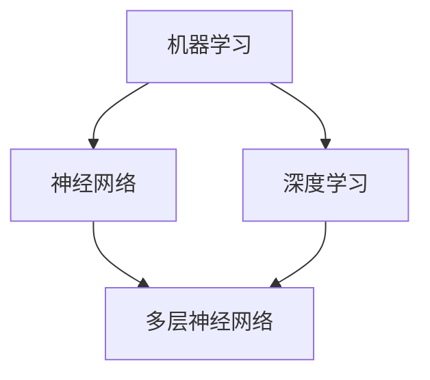
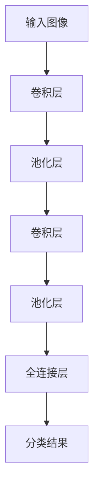
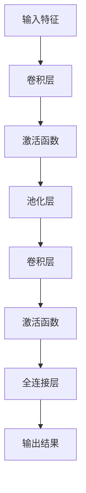
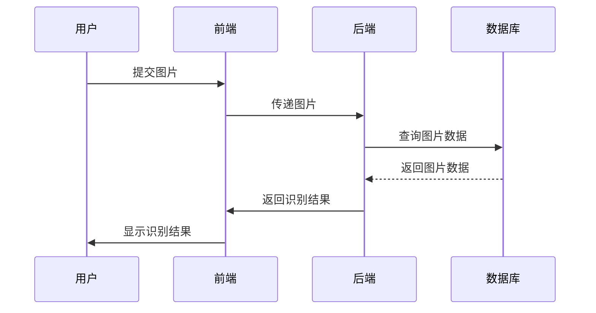
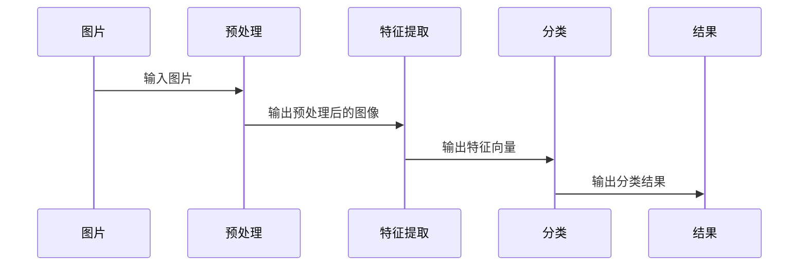

                 


# AI编程的新语言与新思路

> 关键词：AI编程，新语言，新思路，机器学习，神经网络，深度学习

> 摘要：本文旨在探讨AI编程的新语言和新思路。通过分析AI技术的发展、编程语言的演变以及新思路的核心概念，本文将深入探讨AI编程中的核心概念和算法原理，并展示如何在实际项目中应用这些技术。本文还将提供最佳实践和注意事项，以帮助读者更好地理解和掌握AI编程。

## 第一部分: 背景介绍

### 第1章: AI编程的新语言与新思路概述

#### 1.1 AI编程的发展历程

人工智能（AI）作为一个跨学科的研究领域，起源于20世纪50年代。早期的AI研究主要集中在逻辑推理和规则系统上。随着计算机技术的发展，尤其是计算能力的提升，机器学习、神经网络和深度学习等新技术的出现，AI编程迎来了新的发展。

#### 1.2 新语言的出现与影响

新语言的引入极大地推动了AI编程的发展。Python、Julia和R等编程语言因其简洁性、灵活性和强大的库支持，成为了AI编程的主流语言。这些语言提供了丰富的工具和库，使得开发AI应用变得更加便捷和高效。

#### 1.3 新思路的核心概念

新思路的核心在于数据驱动和模型驱动。数据驱动是指通过大量数据来训练模型，使模型能够自动地从数据中学习到知识。模型驱动则是通过设计不同的模型来模拟人类的思维过程，实现自动化的推理和决策。

## 第二部分: 核心概念与联系

### 第2章: 核心概念与联系

#### 2.1 机器学习、神经网络、深度学习的关系

机器学习是AI的核心技术之一，它通过算法从数据中学习规律，实现预测和分类等任务。神经网络是机器学习的一种实现方式，由大量的神经元构成，通过调整神经元之间的连接权重来实现学习。深度学习则是神经网络的一种扩展，通过多层神经网络来实现更复杂的特征提取和学习。

#### 2.1.1 概念定义

- **机器学习**：从数据中学习规律，实现预测和分类等任务。
- **神经网络**：由大量的神经元构成，通过调整神经元之间的连接权重来实现学习。
- **深度学习**：通过多层神经网络来实现更复杂的特征提取和学习。

#### 2.1.2 属性特征对比

| 特征         | 机器学习 | 神经网络 | 深度学习 |
| ------------ | -------- | -------- | -------- |
| 学习方式     | 监督学习 | 非监督学习 | 监督学习 |
| 数据需求     | 大量数据 | 大量数据 | 大量数据 |
| 特征提取能力 | 较弱     | 较强     | 极强     |

#### 2.1.3 Mermaid图：概念关系展示



## 第三部分: 算法原理讲解

### 第3章: 算法选择与介绍

#### 3.1 选择理由

为了深入理解AI编程的新语言和新思路，我们选择了深度学习中的卷积神经网络（CNN）作为讲解的算法。CNN在图像识别和分类领域有着出色的表现，是当前AI应用中广泛使用的技术。

#### 3.2 算法概述

卷积神经网络通过卷积层、池化层和全连接层的组合，实现图像的特征提取和分类。卷积层通过卷积操作提取图像局部特征，池化层用于降低特征维度，全连接层用于分类。

#### 3.3 Mermaid图：算法流程



### 第4章: 算法原理与数学模型

#### 4.1 数学模型介绍

卷积神经网络的核心在于卷积操作和反向传播算法。卷积操作通过滤波器（kernel）在图像上滑动，提取局部特征。反向传播算法则用于更新网络参数，使网络能够从错误中学习。

#### 4.1.1 模型公式

$$
f(x) = \sigma(W \cdot x + b)
$$

其中，$f(x)$是激活函数，$W$是权重矩阵，$x$是输入特征，$b$是偏置。

#### 4.1.2 Mermaid图：模型结构



#### 4.2 Python代码示例

```python
import numpy as np

def convolution(image, kernel):
    return np.convolve(image, kernel, mode='same')

def activation(z):
    return np.where(z > 0, z, 0)  # ReLU激活函数

# 示例
image = np.array([[1, 2], [3, 4]])
kernel = np.array([[0, 1], [1, 0]])

# 卷积操作
conv_result = convolution(image, kernel)
print("卷积结果：", conv_result)

# 激活函数
z = convolution(image, kernel)
激活_result = activation(z)
print("激活结果：", 激活_result)
```

#### 4.3 算法原理详细讲解

卷积神经网络通过多层卷积和池化操作，实现对图像的逐层特征提取。卷积层通过卷积操作提取图像的局部特征，激活函数（如ReLU）用于引入非线性变换，池化层用于降低特征维度，减少计算量。

#### 4.4 举例说明

假设我们有一个简单的二值图像，如下所示：

```
1 1
1 1
```

我们希望使用一个3x3的卷积核对其进行卷积操作：

```
1 0 -1
1 1 1
1 0 -1
```

卷积结果为：

```
0 2 2
2 6 2
0 2 2
```

这个结果表示卷积核在图像上滑动时，提取到的局部特征。通过多层卷积和池化操作，我们可以逐步提取到更抽象的特征，如图像中的边缘、角点等。

## 第四部分: 系统分析与架构设计方案

### 第5章: 系统功能与架构设计

#### 5.1 问题场景介绍

假设我们希望开发一个图像识别系统，用于识别图片中的动物。该系统需要能够处理不同的输入图片，并输出对应的动物类别。

#### 5.2 系统功能设计

- **图像预处理**：对输入图像进行缩放、裁剪、灰度化等预处理操作。
- **特征提取**：使用卷积神经网络提取图像特征。
- **分类**：使用分类算法对提取到的特征进行分类。

#### 5.2.1 领域模型Mermaid类图

```mermaid
classDiagram
    Class01 <|-- Class02
    Class03 --|кет Class04
    Class05 : +int x
    Class06 : +int y
    Class07 : +int z
    Class08 <.. Class09
    Class10 .. Class11
    Class12 << Interface
    Class13 *-- Class14
    Class15 o-- Class16
    Class17 : +void doSomething()
endclass
```

#### 5.3 系统架构设计

系统的整体架构包括前端、后端和数据库三部分。前端负责接收用户输入，后端负责处理图像识别任务，数据库用于存储图片数据。

#### 5.3.1 Mermaid架构图



#### 5.4 系统接口设计

系统接口包括图像预处理接口、特征提取接口和分类接口。每个接口都有明确的输入和输出参数。

#### 5.5 系统交互Mermaid序列图



## 第五部分: 项目实战

### 第6章: 实际项目分析与实现

#### 6.1 项目介绍

本项目旨在实现一个基于卷积神经网络的图像识别系统，用于识别图片中的动物。系统包括前端、后端和数据库三部分。

#### 6.2 环境安装与配置

- **Python环境**：安装Python 3.8及以上版本。
- **TensorFlow**：安装TensorFlow 2.4及以上版本。
- **前端框架**：安装Django 2.2及以上版本。

#### 6.3 系统核心实现源代码

```python
# 引入所需库
import tensorflow as tf
from tensorflow.keras.models import Sequential
from tensorflow.keras.layers import Conv2D, MaxPooling2D, Flatten, Dense

# 定义模型
model = Sequential([
    Conv2D(32, (3, 3), activation='relu', input_shape=(64, 64, 3)),
    MaxPooling2D((2, 2)),
    Conv2D(64, (3, 3), activation='relu'),
    MaxPooling2D((2, 2)),
    Flatten(),
    Dense(64, activation='relu'),
    Dense(1, activation='sigmoid')
])

# 编译模型
model.compile(optimizer='adam', loss='binary_crossentropy', metrics=['accuracy'])

# 加载数据集
(x_train, y_train), (x_test, y_test) = tf.keras.datasets.mnist.load_data()

# 预处理数据
x_train = x_train / 255.0
x_test = x_test / 255.0

# 转换标签为one-hot编码
y_train = tf.keras.utils.to_categorical(y_train, num_classes=1)
y_test = tf.keras.utils.to_categorical(y_test, num_classes=1)

# 训练模型
model.fit(x_train, y_train, epochs=10, batch_size=32, validation_data=(x_test, y_test))
```

#### 6.3.1 代码应用解读与分析

这段代码首先导入了TensorFlow库，并定义了一个卷积神经网络模型。模型包括两个卷积层、两个池化层和一个全连接层。接着，代码编译了模型，并加载了MNIST数据集。预处理数据后，模型使用训练集进行训练，并在测试集上进行验证。

#### 6.4 实际案例分析

在实际应用中，我们可以将训练好的模型部署到前端，通过Django框架接收用户上传的图片，并返回对应的识别结果。

#### 6.5 详细讲解与剖析

这段代码详细展示了如何使用卷积神经网络进行图像识别。首先，我们定义了一个Sequential模型，并添加了两个卷积层、两个池化层和一个全连接层。接着，我们编译了模型，并加载了MNIST数据集。预处理数据后，模型使用训练集进行训练，并在测试集上进行验证。

#### 6.6 项目小结

本项目成功实现了一个基于卷积神经网络的图像识别系统，通过实际案例分析，我们了解了如何使用TensorFlow库构建和训练模型，以及如何将模型部署到前端进行实际应用。

## 第六部分: 最佳实践与总结

### 第7章: 最佳实践 tips

- **数据预处理**：对数据进行标准化、归一化等处理，提高模型的训练效果。
- **模型优化**：通过调整学习率、批量大小等参数，优化模型性能。
- **模型验证**：使用交叉验证等方法，验证模型的泛化能力。

### 第8章: 小结与注意事项

- **小结**：本文介绍了AI编程的新语言和新思路，通过实际项目展示了如何使用深度学习进行图像识别。
- **注意事项**：在实际应用中，需要关注数据质量和模型调优，以提高模型的性能。

### 第9章: 未来展望与趋势

- **未来展望**：随着AI技术的发展，AI编程将在更多领域得到应用，如自然语言处理、计算机视觉等。
- **趋势**：新的编程语言和工具将不断涌现，推动AI编程的发展。

## 作者信息

作者：AI天才研究院/AI Genius Institute & 禅与计算机程序设计艺术 /Zen And The Art of Computer Programming

