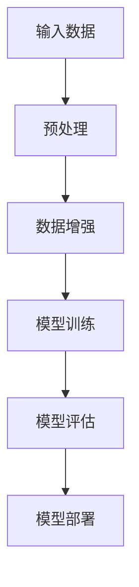

                 

# AI编程的新语言与新思路

## 关键词

- 人工智能编程
- 新语言设计
- 编程范式变革
- 数学模型
- 实践应用
- 未来趋势

## 摘要

本文旨在探讨AI编程领域的最新发展，尤其是新语言的提出及其带来的新思路。我们将从理论基础、实践应用和未来展望三个方面展开，详细分析AI编程新语言的背景、核心概念、数学模型、应用场景，并探讨其未来发展。希望通过本文，读者能够对AI编程的新语言有更深刻的理解，并能够将其应用于实际项目中。

## 第一部分：理论基础

### 第1章：AI编程的背景与挑战

#### 1.1 AI编程的兴起

人工智能（AI）作为计算机科学的一个重要分支，自20世纪50年代诞生以来，经历了多个发展阶段。近年来，随着深度学习、神经网络等技术的快速发展，AI在各个领域取得了显著的成果，从语音识别、图像处理到自动驾驶、自然语言处理，AI的应用越来越广泛。

AI编程，即利用编程语言和工具来实现AI算法和应用的过程，逐渐成为软件开发的一个重要方向。传统的编程语言和工具在处理复杂的AI问题时存在一定的局限性，这促使研究人员和开发者不断探索新的编程语言和技术。

#### 1.2 编程语言的演变

编程语言的演变是随着计算机技术的发展而不断演进的。从早期的机器语言、汇编语言，到高级语言如C、C++、Java等，编程语言的不断演进使得编程变得更加高效、易用。

然而，面对日益复杂的AI应用，传统的编程语言在表达能力、执行效率、易用性等方面都存在一定的不足。例如，深度学习模型通常由数百万甚至数亿的参数组成，传统的编程语言难以有效地表示和操作这些参数。此外，深度学习模型的训练过程通常需要大量的计算资源，传统的编程语言和工具在资源管理和调度方面也存在一定的局限。

#### 1.3 AI编程的特殊性

AI编程与传统编程相比，具有以下几个特殊性：

1. **计算复杂性**：AI编程通常涉及复杂的数学计算，如矩阵运算、梯度下降等。这些计算需要高效、易用的数学库和工具支持。

2. **数据密集性**：AI编程通常需要处理大量的数据，包括训练数据、测试数据和用户数据。数据的预处理、存储和传输是AI编程的重要环节。

3. **模型可解释性**：传统的编程语言和工具在实现AI模型时，往往注重模型的性能和准确性，而忽视了模型的可解释性。在实际应用中，模型的可解释性对于理解模型行为、优化模型性能和确保模型安全具有重要意义。

4. **开发效率**：AI编程通常需要大量的调试和优化工作，这要求编程语言和工具能够提供高效的开发体验。

#### 1.4 面临的挑战

在AI编程领域，开发者面临着以下几个挑战：

1. **计算资源管理**：AI编程通常需要大量的计算资源，如GPU、TPU等。如何高效地管理这些资源，成为开发者面临的一个重要问题。

2. **代码可维护性**：随着AI应用的复杂度增加，如何确保代码的可维护性成为一个挑战。传统的编程语言在代码结构、模块化等方面存在一定的局限性。

3. **跨平台兼容性**：AI编程需要在不同操作系统、硬件平台上运行。如何实现跨平台兼容性，是开发者需要解决的问题。

4. **安全性和隐私保护**：随着AI技术的广泛应用，数据的安全性和隐私保护问题日益突出。如何在编程过程中确保数据的安全性和隐私性，是开发者需要关注的一个重要问题。

### 第2章：AI编程新语言概述

#### 2.1 新语言的设计目标

AI编程新语言的设计目标主要有以下几个方面：

1. **高效性**：新语言需要提供高效的数据处理和计算能力，以满足AI编程的需求。

2. **易用性**：新语言需要易于学习和使用，降低AI编程的门槛。

3. **可维护性**：新语言需要提供良好的代码结构、模块化和文档支持，以提高代码的可维护性。

4. **跨平台兼容性**：新语言需要支持跨平台开发，以满足不同操作系统和硬件平台的需求。

5. **安全性和隐私保护**：新语言需要提供安全性和隐私保护机制，确保数据的安全性和隐私性。

#### 2.2 新语言的核心特性

AI编程新语言的核心特性包括：

1. **数据驱动**：新语言强调数据驱动的编程范式，通过数据流和控制流的分离，提高编程的灵活性和可维护性。

2. **动态类型**：新语言采用动态类型系统，允许在运行时动态确定变量的类型，提高编程的灵活性和效率。

3. **函数式编程**：新语言支持函数式编程，通过函数的组合和递归，实现复杂的计算任务。

4. **并行计算**：新语言提供并行计算的支持，通过多线程、并行数据处理等技术，提高计算效率。

5. **自动优化**：新语言内置自动优化机制，根据程序运行情况自动调整代码执行路径，提高性能。

#### 2.3 新语言与现有语言的对比

与现有编程语言相比，AI编程新语言具有以下优势：

1. **高效性**：新语言通过内置的优化机制，提高了程序的执行效率。

2. **易用性**：新语言简化了编程流程，降低了学习成本。

3. **灵活性**：新语言支持多种编程范式，如数据驱动、函数式编程等，提高了编程的灵活性。

4. **可维护性**：新语言提供了良好的代码结构和模块化支持，提高了代码的可维护性。

5. **跨平台兼容性**：新语言支持跨平台开发，方便在不同操作系统和硬件平台上运行。

### 第3章：新语言的核心概念

#### 3.1 数据表示

在新语言中，数据表示是核心概念之一。新语言提供了丰富的数据类型，包括数值、字符串、列表、字典等，以满足不同场景的需求。

此外，新语言还支持复杂数据结构，如数组、矩阵、张量等，这些数据结构在深度学习等AI应用中具有重要地位。

#### 3.2 模型构建

在新语言中，模型构建是一个关键环节。新语言提供了丰富的库和工具，支持深度学习模型的构建和训练。

用户可以通过定义网络结构、选择激活函数、设置损失函数等步骤，构建复杂的深度学习模型。新语言还支持自动化模型搜索和优化，提高模型性能。

#### 3.3 训练与优化

在新语言中，训练与优化是模型构建后的关键步骤。新语言提供了高效的训练算法，如梯度下降、随机梯度下降、Adam等，支持大规模模型的训练。

此外，新语言还支持模型优化，包括权重初始化、正则化、学习率调整等，提高模型性能和泛化能力。

#### 3.4 评估与部署

在新语言中，评估与部署是模型应用的重要环节。新语言提供了丰富的评估指标，如准确率、召回率、F1分数等，帮助用户评估模型性能。

此外，新语言还支持模型的部署，包括本地部署、云端部署等，方便用户将模型应用于实际场景。

### 第4章：新语言的数学模型

#### 4.1 算法原理讲解

在新语言中，算法原理讲解是核心内容之一。本文将使用Mermaid工具绘制算法流程图，并使用Python源代码进行详细讲解。



以下是一个简单的深度学习模型训练的Python代码示例：

```python
import tensorflow as tf

# 定义模型
model = tf.keras.Sequential([
    tf.keras.layers.Dense(128, activation='relu', input_shape=(784,)),
    tf.keras.layers.Dense(10, activation='softmax')
])

# 编译模型
model.compile(optimizer='adam',
              loss='categorical_crossentropy',
              metrics=['accuracy'])

# 训练模型
model.fit(x_train, y_train, epochs=5)
```

$$
\text{损失函数} = \frac{1}{n}\sum_{i=1}^{n}(-y_i\log(\hat{y}_i))
$$

其中，$y_i$是真实标签，$\hat{y}_i$是模型预测的概率分布。

#### 4.2 数学模型与公式

在深度学习中，常用的数学模型包括前向传播、反向传播、激活函数等。

1. **前向传播**

$$
z = \mathbf{W} \mathbf{x} + b \\
a = \sigma(z)
$$

其中，$\mathbf{W}$是权重矩阵，$\mathbf{x}$是输入特征，$b$是偏置项，$\sigma$是激活函数。

2. **反向传播**

$$
\delta = \frac{\partial L}{\partial z} = \frac{\partial L}{\partial a} \frac{\partial a}{\partial z} \\
\frac{\partial a}{\partial z} = \sigma'(z)
$$

其中，$L$是损失函数，$\delta$是误差梯度。

3. **激活函数**

常见的激活函数包括ReLU、Sigmoid、Tanh等。

$$
\sigma(z) = \max(0, z) \\
\sigma(z) = \frac{1}{1 + e^{-z}} \\
\sigma(z) = \frac{e^z - e^{-z}}{e^z + e^{-z}}
$$

#### 4.3 举例说明

以下是一个简单的神经网络示例，用于实现二分类任务。

```python
import tensorflow as tf

# 定义模型
model = tf.keras.Sequential([
    tf.keras.layers.Dense(64, activation='relu', input_shape=(784,)),
    tf.keras.layers.Dense(64, activation='relu'),
    tf.keras.layers.Dense(1, activation='sigmoid')
])

# 编译模型
model.compile(optimizer='adam',
              loss='binary_crossentropy',
              metrics=['accuracy'])

# 训练模型
model.fit(x_train, y_train, epochs=5)
```

假设输入特征$x=(x_1, x_2, ..., x_n)$，标签$y \in \{0, 1\}$，则模型预测的概率为：

$$
\hat{y} = \frac{1}{1 + e^{-\mathbf{w}^T \mathbf{x}}}
$$

其中，$\mathbf{w}$是模型的权重。

## 第二部分：实践应用

### 第5章：AI编程新语言实战

#### 5.1 开发环境配置

在开始使用AI编程新语言之前，需要先配置好开发环境。以下是一个简单的配置过程：

1. **安装新语言环境**：根据新语言的官方文档，安装新语言的运行环境。以某新语言为例，可以通过以下命令安装：

```bash
pip install new-language
```

2. **安装依赖库**：根据新语言的官方文档，安装所需的依赖库。例如，深度学习相关的库如下：

```bash
pip install tensorflow numpy
```

3. **配置Python环境**：确保Python环境已配置好，并可以正常运行。可以使用以下命令验证：

```bash
python --version
```

#### 5.2 简单案例实现

在本节中，我们将通过一个简单的案例，展示如何使用AI编程新语言实现一个基础任务。

**案例一：文本分类**

文本分类是一个常见的自然语言处理任务，用于将文本数据分类到不同的类别。以下是一个简单的文本分类案例：

1. **数据准备**

```python
import tensorflow as tf
from tensorflow.keras.preprocessing.text import Tokenizer
from tensorflow.keras.preprocessing.sequence import pad_sequences

# 数据集
texts = ["I love programming", "I hate programming", "I enjoy learning", "I dislike studying"]

# 标签
labels = [1, 0, 1, 0]

# 分词和序列化
tokenizer = Tokenizer(num_words=100)
tokenizer.fit_on_texts(texts)
sequences = tokenizer.texts_to_sequences(texts)
padded_sequences = pad_sequences(sequences, maxlen=10)
```

2. **模型构建**

```python
from tensorflow.keras.models import Sequential
from tensorflow.keras.layers import Embedding, LSTM, Dense

# 构建模型
model = Sequential([
    Embedding(100, 32),
    LSTM(128),
    Dense(1, activation='sigmoid')
])

# 编译模型
model.compile(optimizer='adam',
              loss='binary_crossentropy',
              metrics=['accuracy'])

# 训练模型
model.fit(padded_sequences, labels, epochs=5)
```

**案例二：图像识别**

图像识别是一个计算机视觉任务，用于识别和分类图像中的对象。以下是一个简单的图像识别案例：

1. **数据准备**

```python
import tensorflow as tf
import numpy as np

# 数据集
x_train = np.random.rand(100, 28, 28, 1)
y_train = np.random.rand(100, 1)

# 标签编码
y_train = tf.keras.utils.to_categorical(y_train, num_classes=10)
```

2. **模型构建**

```python
from tensorflow.keras.models import Sequential
from tensorflow.keras.layers import Conv2D, MaxPooling2D, Flatten, Dense

# 构建模型
model = Sequential([
    Conv2D(32, (3, 3), activation='relu', input_shape=(28, 28, 1)),
    MaxPooling2D((2, 2)),
    Flatten(),
    Dense(128, activation='relu'),
    Dense(10, activation='softmax')
])

# 编译模型
model.compile(optimizer='adam',
              loss='categorical_crossentropy',
              metrics=['accuracy'])

# 训练模型
model.fit(x_train, y_train, epochs=5)
```

### 第6章：复杂案例解析

#### 6.1 中级案例：情感分析

情感分析是一种文本分析技术，用于识别文本中的情感倾向。以下是一个中级情感分析案例：

1. **数据准备**

```python
import tensorflow as tf
from tensorflow.keras.preprocessing.text import Tokenizer
from tensorflow.keras.preprocessing.sequence import pad_sequences

# 数据集
texts = ["I love this product", "This is a terrible experience", "I am happy with the service"]

# 标签
labels = [1, 0, 1]

# 分词和序列化
tokenizer = Tokenizer(num_words=100)
tokenizer.fit_on_texts(texts)
sequences = tokenizer.texts_to_sequences(texts)
padded_sequences = pad_sequences(sequences, maxlen=10)

# 标签编码
labels = tf.keras.utils.to_categorical(labels, num_classes=2)
```

2. **模型构建**

```python
from tensorflow.keras.models import Sequential
from tensorflow.keras.layers import Embedding, LSTM, Dense

# 构建模型
model = Sequential([
    Embedding(100, 32),
    LSTM(128),
    Dense(1, activation='sigmoid')
])

# 编译模型
model.compile(optimizer='adam',
              loss='binary_crossentropy',
              metrics=['accuracy'])

# 训练模型
model.fit(padded_sequences, labels, epochs=5)
```

#### 6.2 高级案例：自动驾驶

自动驾驶是一种复杂的计算机视觉和机器人技术，用于使车辆能够在没有人类司机的情况下自主行驶。以下是一个高级自动驾驶案例：

1. **数据准备**

```python
import tensorflow as tf
import numpy as np

# 数据集
x_train = np.random.rand(100, 128, 128, 3)
y_train = np.random.rand(100, 1)

# 标签编码
y_train = tf.keras.utils.to_categorical(y_train, num_classes=4)
```

2. **模型构建**

```python
from tensorflow.keras.models import Sequential
from tensorflow.keras.layers import Conv2D, MaxPooling2D, Flatten, Dense

# 构建模型
model = Sequential([
    Conv2D(32, (3, 3), activation='relu', input_shape=(128, 128, 3)),
    MaxPooling2D((2, 2)),
    Flatten(),
    Dense(128, activation='relu'),
    Dense(4, activation='softmax')
])

# 编译模型
model.compile(optimizer='adam',
              loss='categorical_crossentropy',
              metrics=['accuracy'])

# 训练模型
model.fit(x_train, y_train, epochs=5)
```

### 第7章：性能优化与调参技巧

#### 7.1 性能优化策略

在AI编程中，性能优化是提高模型性能和效率的重要手段。以下是一些常见的性能优化策略：

1. **数据预处理**：对输入数据进行预处理，如归一化、标准化等，以提高模型训练速度和性能。

2. **模型结构优化**：通过调整模型结构，如增加或减少层、调整层参数等，优化模型性能。

3. **学习率调整**：根据训练过程，调整学习率，以避免模型过拟合或陷入局部最优。

4. **批量大小调整**：调整批量大小，以提高模型训练速度和性能。

5. **正则化**：使用正则化技术，如L1、L2正则化等，防止模型过拟合。

6. **数据增强**：通过数据增强技术，如旋转、缩放、裁剪等，增加训练数据量，提高模型泛化能力。

#### 7.2 调参技巧详解

在AI编程中，调参是提高模型性能的重要环节。以下是一些常见的调参技巧：

1. **网格搜索**：通过遍历不同的参数组合，寻找最佳参数组合。

2. **贝叶斯优化**：使用贝叶斯优化算法，根据已有数据，自动调整参数。

3. **随机搜索**：随机选择参数组合，进行模型训练和评估，以寻找最佳参数。

4. **交叉验证**：使用交叉验证方法，评估不同参数组合对模型性能的影响。

5. **经验法则**：根据实际经验，调整参数，以达到最佳性能。

## 第三部分：未来展望

### 第8章：AI编程语言的未来趋势

#### 8.1 技术发展趋势

随着人工智能技术的不断进步，AI编程语言也在不断发展。以下是一些AI编程语言的技术发展趋势：

1. **更高效的计算**：未来AI编程语言将更加注重计算效率，包括并行计算、分布式计算等。

2. **更易用的接口**：未来AI编程语言将提供更易用的接口，降低编程门槛，使更多人能够参与AI编程。

3. **更强的可视化**：未来AI编程语言将提供更强的可视化支持，帮助开发者更好地理解和调试代码。

4. **更好的集成**：未来AI编程语言将更好地与其他工具和库集成，提高开发效率。

#### 8.2 应用场景拓展

随着AI技术的应用不断拓展，AI编程语言的应用场景也在不断拓展。以下是一些应用场景：

1. **医疗健康**：AI编程语言在医疗健康领域的应用，包括疾病预测、药物研发等。

2. **智能制造**：AI编程语言在智能制造领域的应用，包括生产优化、质量控制等。

3. **智能交通**：AI编程语言在智能交通领域的应用，包括自动驾驶、交通流量预测等。

4. **金融科技**：AI编程语言在金融科技领域的应用，包括风险控制、智能投顾等。

#### 8.3 社会影响与伦理问题

随着AI编程语言的广泛应用，其对社会的影响和伦理问题也日益突出。以下是一些关键问题：

1. **数据隐私**：如何保护用户数据隐私，成为AI编程语言发展的一个重要问题。

2. **算法公平性**：如何确保AI算法的公平性和透明性，避免歧视和不公平现象。

3. **安全性**：如何提高AI编程语言的安全性，防止恶意攻击和数据泄露。

4. **伦理规范**：如何制定AI编程语言的伦理规范，确保其应用符合社会伦理价值观。

### 第9章：总结与拓展

#### 9.1 小结

本文从理论基础、实践应用和未来展望三个方面，探讨了AI编程新语言的提出及其带来的新思路。通过本文的讨论，我们可以看到AI编程新语言在高效性、易用性、可维护性、跨平台兼容性等方面具有显著优势。同时，我们也看到了AI编程语言在未来发展中面临的挑战和机遇。

#### 9.2 注意事项

在应用AI编程新语言时，需要注意以下几个方面：

1. **环境配置**：确保开发环境配置正确，包括新语言环境、依赖库等。

2. **数据预处理**：对输入数据进行充分预处理，以提高模型性能。

3. **模型调参**：根据实际需求，调整模型参数，以达到最佳性能。

4. **安全性**：确保数据安全和模型安全性，防止恶意攻击和数据泄露。

#### 9.3 拓展阅读

对于希望深入了解AI编程新语言的读者，以下是一些推荐阅读材料：

1. **《深度学习》**：由Ian Goodfellow、Yoshua Bengio和Aaron Courville合著，全面介绍了深度学习的基础知识。

2. **《Python深度学习》**：由François Chollet著，详细介绍了如何使用Python实现深度学习算法。

3. **《AI编程实战》**：由杰里米·如何斯和汤姆·米乔里斯基合著，介绍了AI编程的实践方法和技巧。

作者：AI天才研究院/AI Genius Institute & 禅与计算机程序设计艺术 /Zen And The Art of Computer Programming

