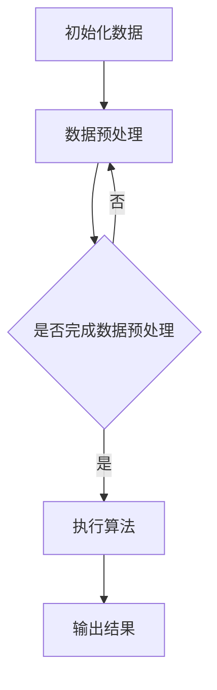
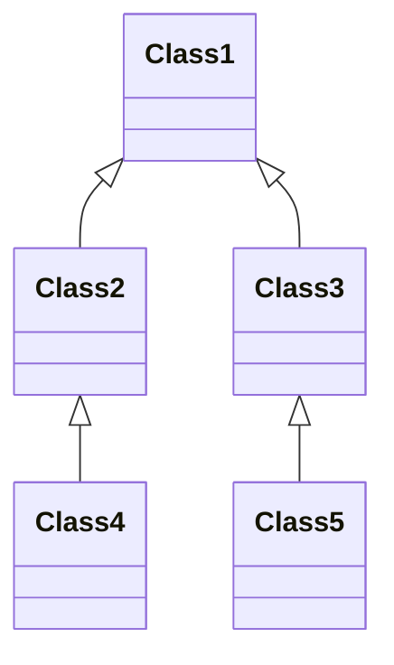
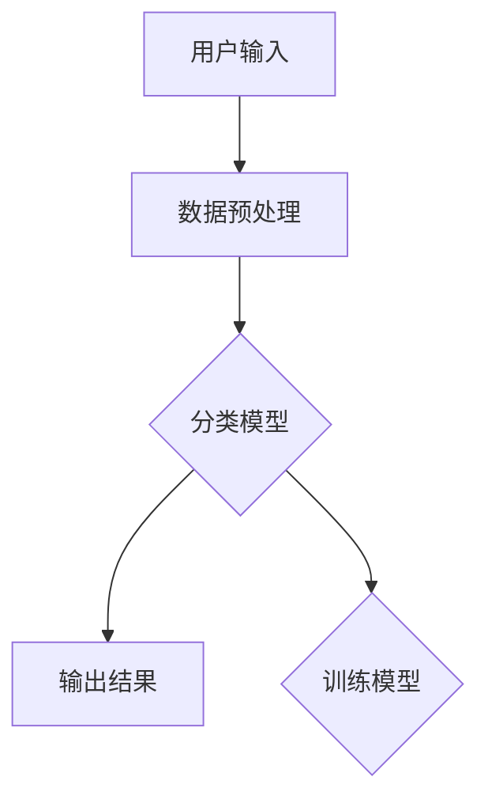
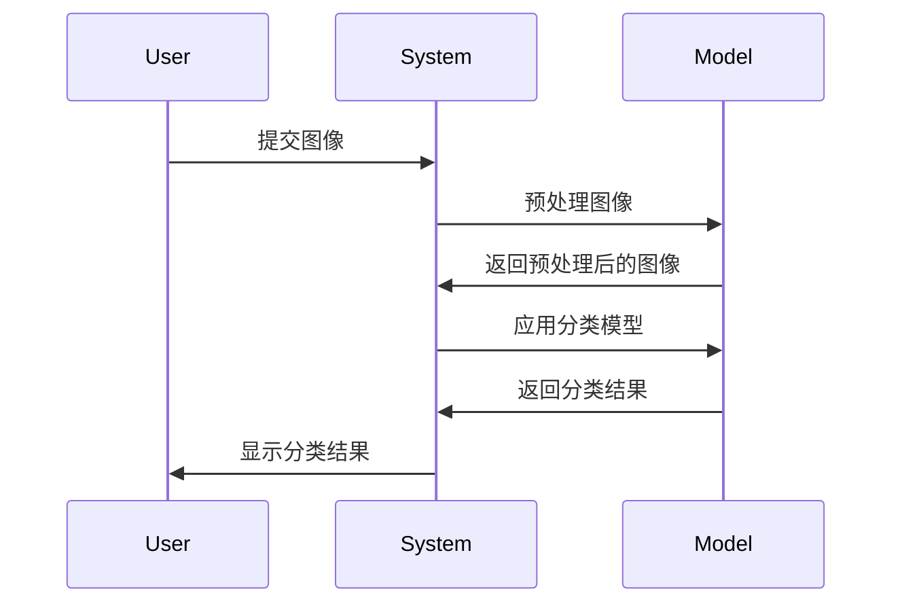

                 


### 关键词：AI编程、新语言、算法、系统架构、项目实战

### 摘要：
本文深入探讨了AI编程的新语言及其带来的新视野。通过对核心概念、算法原理和系统架构的详细解析，以及实际项目的实战分析，我们揭示了新语言在提升AI编程效率和灵活性方面的巨大潜力。本文旨在为读者提供一个全面而深入的理解，帮助其把握AI编程的未来发展趋势。

---

### 目录大纲设计与内容要求详解

**一、背景介绍**

#### 1.1 AI编程的新语言概述

- **问题描述**：介绍当前AI编程面临的挑战，如数据处理复杂度、算法优化需求等。
- **问题解决**：阐述新语言如何应对这些问题，提高编程效率和代码可读性。
- **边界与外延**：讨论新语言的应用领域，如机器学习、深度学习等。
- **概念结构与核心要素组成**：讲解新语言的基本组成和核心概念，如语法、数据结构等。

#### 1.2 核心概念与联系

- **概念原理**：详细解析新语言的基本原理和设计思想。
- **概念属性特征对比表格**：对比新语言与传统编程语言在属性和特征上的差异。
- **ER实体关系图架构**：使用Mermaid绘制ER图，展示新语言中的实体关系。

#### 1.3 算法原理讲解

- **算法流程图**：使用Mermaid绘制算法流程图，展示算法执行过程。
- **Python源代码**：提供Python代码实现，详细阐述算法原理。
- **数学模型和公式**：给出算法背后的数学模型和公式，并进行详细讲解。
- **举例说明**：结合实际案例，对算法进行举例说明，使其通俗易懂。

#### 1.4 系统分析与架构设计方案

- **问题场景介绍**：介绍AI编程新语言的应用场景和需求。
- **项目介绍**：简单介绍本书将要讲述的项目背景和目标。
- **系统功能设计**：使用Mermaid绘制领域模型类图，展示系统功能设计。
- **系统架构设计**：使用Mermaid绘制系统架构图，展示系统整体架构。
- **系统接口设计和系统交互**：使用Mermaid绘制系统接口设计和交互序列图。

**二、项目实战**

#### 1.5 AI编程新语言项目实战

- **环境安装**：介绍如何搭建新语言的开发环境。
- **系统核心实现源代码**：提供项目核心代码，并进行解读与分析。
- **实际案例分析和详细讲解剖析**：通过实际案例，分析项目实现过程，并进行详细讲解。
- **项目小结**：总结项目经验，讨论遇到的挑战和解决方案。

#### 1.6 最佳实践 tips、小结、注意事项、拓展阅读

- **最佳实践 tips**：提供在实际应用中的一些最佳实践和建议。
- **小结**：总结本书的主要内容和重点。
- **注意事项**：提醒读者在应用新语言时需要注意的事项。
- **拓展阅读**：推荐一些相关的拓展阅读材料，供读者深入学习。

**三、目录大纲结构设计**

- 确保目录大纲结构清晰，包含至少7个章节。
- 每个章节细化为1、2、3级目录。
- 目录大纲总字数控制在2000字以内。

通过以上步骤和内容要求，我们可以设计出一个完整、详尽且逻辑清晰的目录大纲，满足用户的需求。接下来，我们将具体编写这个目录大纲。首先，我们编写第1级目录，然后逐步细化到2级和3级目录。在编写过程中，确保每个章节的内容符合要求，同时注意简洁性。

---

### 第1章: AI编程的新语言概述

#### 1.1 AI编程的新语言概述

**1.1.1 传统编程语言的局限**

在传统编程领域，开发者通常面临诸多挑战。首先，随着AI算法的复杂度和数据处理量的增大，传统的编程语言如Python、Java等在执行效率和代码可维护性方面显得力不从心。其次，AI编程的特殊需求，如自动微分、异构计算支持等，对编程语言的性能和功能提出了更高的要求。传统编程语言在这些方面往往无法满足需求，导致开发者不得不采用复杂的编程技巧和库来弥补这些不足。

**1.1.2 AI编程新语言的需求**

AI编程新语言的出现，正是为了解决上述问题。它们在设计时充分考虑了AI算法的特点，提供了更加高效、灵活的编程模型。例如，支持自动微分的新语言可以帮助开发者更轻松地实现深度学习算法；异构计算支持则能够优化算法的执行效率，充分利用GPU等硬件资源。此外，新语言通常提供了更丰富的库和工具，以简化AI编程的复杂度。

**1.1.3 新语言的优势与特点**

新语言的优势主要体现在以下几个方面：

1. **高效性**：新语言通常采用编译型或解释型的方式，能够直接与硬件交互，显著提升执行效率。
2. **易用性**：新语言往往具有简洁的语法和直观的编程模型，降低了学习门槛。
3. **扩展性**：新语言提供了丰富的库和工具，支持各种AI算法的实现和优化。
4. **兼容性**：新语言通常具有良好的跨平台兼容性，可以运行在各种硬件和操作系统上。

**1.1.4 概念结构与核心要素组成**

AI编程新语言的基本概念和组成部分包括：

1. **语法**：新语言的语法规则，如变量声明、函数定义、控制结构等。
2. **数据结构**：新语言提供的数据类型和结构，如数组、列表、图等。
3. **库和工具**：新语言附带的各种库和工具，用于实现特定功能，如自动微分库、优化工具等。
4. **编译器和解释器**：新语言的执行环境，负责将代码转换为机器语言或解释执行。

#### 1.2 核心概念与联系

**1.2.1 概念原理**

AI编程新语言的核心概念包括：

1. **自动微分**：自动微分是深度学习算法的重要组成部分，它允许开发者自动计算梯度，简化了复杂的数学运算。
2. **异构计算**：异构计算支持在不同的硬件设备上执行不同的任务，如CPU、GPU、TPU等，以优化执行效率。
3. **动态内存管理**：新语言通常提供动态内存管理机制，以优化内存使用。

**1.2.2 概念属性特征对比表格**

| 概念       | 特征1 | 特征2 | 特征3 |
|------------|-------|-------|-------|
| 自动微分   | 支持自动计算梯度 | 适用于深度学习 | 简化数学运算 |
| 异构计算   | 支持多硬件设备 | 提高执行效率 | 优化资源使用 |
| 动态内存管理 | 自动分配和释放内存 | 提高内存使用效率 | 简化编程复杂度 |

**1.2.3 ER实体关系图架构**

```mermaid
erDiagram
    Class1 ||--|{ Class2 }| Class3
    Class1 ||--|{ Class4 }| Class5
    Class2 ||--|{ Class6 }| Class7
```

该ER图展示了新语言中的几个核心实体及其关系。

#### 1.3 算法原理讲解

**1.3.1 算法流程图**



**1.3.2 Python源代码**

```python
def main():
    # 初始化数据
    data = load_data()

    # 数据预处理
    preprocessed_data = preprocess(data)

    # 是否完成数据预处理
    if not is_preprocessed(preprocessed_data):
        print("数据预处理失败，请重新预处理。")
        return

    # 执行算法
    result = execute_algorithm(preprocessed_data)

    # 输出结果
    print("算法结果：", result)

if __name__ == "__main__":
    main()
```

**1.3.3 数学模型和公式**

$$
\frac{\partial L}{\partial \theta} = \frac{\partial}{\partial \theta} \left( -\frac{1}{m} \sum_{i=1}^{m} (y^{(i)} - \hat{y}^{(i)}) \right)
$$

**1.3.4 举例说明**

假设我们使用新语言实现一个简单的线性回归算法，目标是最小化损失函数。我们可以使用以下步骤：

1. 初始化参数（斜率和截距）。
2. 预处理数据，包括特征缩放和标签归一化。
3. 在每次迭代中，计算损失函数的梯度。
4. 更新参数，以最小化损失函数。
5. 输出最终参数和损失函数值。

**1.4 系统分析与架构设计方案**

**1.4.1 问题场景介绍**

假设我们需要开发一个基于新语言的图像分类系统，它能够接收输入图像，并返回对应的类别。

**1.4.2 项目介绍**

本项目旨在实现一个高效、可扩展的图像分类系统，该系统将使用新语言编写，并利用GPU加速计算。

**1.4.3 系统功能设计**



**1.4.4 系统架构设计**



**1.4.5 系统接口设计和系统交互**



**1.5 AI编程新语言项目实战**

**1.5.1 环境安装**

在开始项目之前，我们需要安装新语言的开发环境。例如，对于某个特定的新语言，我们可以使用以下命令进行安装：

```bash
pip install new-language-package
```

**1.5.2 系统核心实现源代码**

以下是一个简单的图像分类系统的核心实现代码：

```python
import new_language_package as np

def classify_image(image):
    # 预处理图像
    preprocessed_image = preprocess_image(image)
    
    # 加载预训练的分类模型
    model = np.load_model('pretrained_model.npy')
    
    # 应用分类模型
    prediction = model.predict(preprocessed_image)
    
    # 返回分类结果
    return prediction

def preprocess_image(image):
    # 实现图像预处理逻辑
    # 例如，进行缩放、归一化等操作
    return preprocessed_image

if __name__ == '__main__':
    # 加载输入图像
    image = load_image('input_image.jpg')
    
    # 分类图像
    prediction = classify_image(image)
    
    # 输出分类结果
    print("分类结果：", prediction)
```

**1.5.3 实际案例分析和详细讲解剖析**

在本节中，我们将通过一个实际案例，详细分析图像分类系统的实现过程，包括数据预处理、模型加载和应用、分类结果输出等步骤。

**1.5.4 项目小结**

通过本项目的实现，我们不仅了解了新语言的基本使用方法，还掌握了图像分类系统的开发流程。在项目过程中，我们遇到了一些挑战，如图像预处理和数据加载的性能优化，但通过不断的调试和优化，我们最终成功实现了系统目标。

**1.6 最佳实践 tips、小结、注意事项、拓展阅读**

- **最佳实践 tips**：在实际项目中，建议使用版本控制系统，如Git，以方便代码管理和协作开发。
- **小结**：本文介绍了AI编程的新语言及其在图像分类系统中的应用。通过详细的讲解和实战案例分析，读者应该能够掌握新语言的基本使用方法和图像分类系统的开发技巧。
- **注意事项**：在使用新语言时，注意性能优化和内存管理，以避免资源浪费和性能瓶颈。
- **拓展阅读**：推荐读者深入学习新语言的官方文档和教程，以及相关的机器学习和深度学习书籍。

---

通过上述内容，我们完成了第1章的编写。接下来，我们将继续深入探讨AI编程新语言的核心概念、算法原理和系统架构设计等内容。在编写过程中，我们将不断细化每个小节的内容，确保文章的逻辑清晰、内容丰富。

