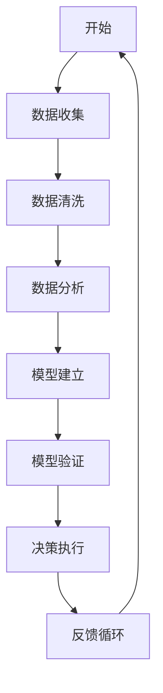
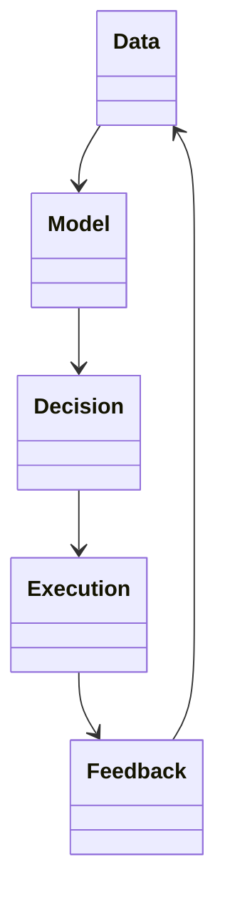
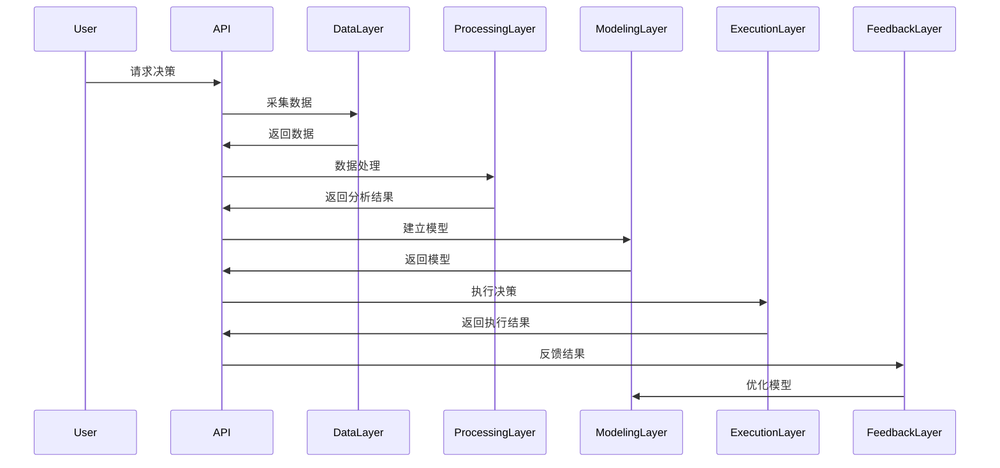

                 

# 提高技术决策的质量与效率

关键词：技术决策、效率、质量、数据驱动、模型优化

摘要：
技术决策是企业成功的关键因素，但传统决策方式往往存在信息不对称、依据不足、流程复杂等问题。本文将探讨如何通过数据驱动决策方法、建立技术决策模型以及优化决策流程，来提高技术决策的质量与效率。

## 目录大纲

**# 第一部分：背景介绍**

**## 第1章 问题背景**  
**### 1.1 问题描述**  
**### 1.2 问题解决**  
**### 1.3 边界与外延**  
**### 1.4 概念结构与核心要素组成**

**## 第2章 核心概念与联系**  
**### 2.1 数据驱动决策原理**  
**### 2.2 基本算法与流程图**  
**### 2.3 Python源代码与数学模型讲解**  
**### 2.4 数学模型和数学公式 & 详细讲解 & 举例说明**

**## 第3章 算法原理讲解**  
**### 3.1 基本算法与流程图**  
**### 3.2 Python源代码**  
**### 3.3 数学模型与公式**  
**### 3.4 举例说明**

**## 第4章 系统分析与架构设计方案**  
**### 4.1 问题场景介绍**  
**### 4.2 系统功能设计**  
**### 4.3 系统架构设计**  
**### 4.4 系统接口设计和系统交互**

**## 第5章 项目实战**  
**### 5.1 环境安装**  
**### 5.2 系统核心实现源代码**  
**### 5.3 代码应用解读与分析**  
**### 5.4 实际案例分析和详细讲解剖析**  
**### 5.5 项目小结**

**## 第6章 最佳实践 tips**  
**## 第7章 小结**  
**## 第8章 注意事项**  
**## 第9章 拓展阅读**

## 第1章 问题背景

### 1.1 问题描述

随着信息技术的发展，技术决策在企业和组织中变得日益重要。然而，技术决策过程中往往存在一系列问题，如信息不对称、决策依据不足、决策过程复杂等。这些问题直接影响到技术决策的质量和效率，进而影响到企业的竞争力。

### 1.2 问题解决

为了提高技术决策的质量与效率，我们需要引入数据驱动决策方法。这种方法利用大数据分析、机器学习等技术，对决策所需的信息进行系统化分析，建立技术决策模型，并优化决策流程。通过数据驱动决策，我们可以更加准确地预测技术发展的趋势，优化资源配置，提高决策效率。

### 1.3 边界与外延

本文的讨论范围主要涉及技术决策的框架、方法、工具和最佳实践。外延包括技术趋势、项目管理、创新管理等与决策相关的话题。

### 1.4 概念结构与核心要素组成

- **核心概念**：技术决策、质量、效率、数据驱动决策、模型建立。
- **结构要素**：数据收集、数据分析、模型验证、决策执行、反馈循环。

## 第2章 核心概念与联系

### 2.1 数据驱动决策原理

数据驱动决策是一种基于大量数据的决策方法，其核心思想是利用数据来指导决策过程。与传统决策方法相比，数据驱动决策具有以下几个显著特点：

| 特征 | 数据驱动决策 | 传统决策 |
| --- | --- | --- |
| 基础 | 大量数据支持 | 经验与直觉 |
| 目标 | 最优化决策 | 满足基本要求 |
| 过程 | 系统化分析 | 主观判断 |
| 影响因素 | 数据质量、分析方法 | 个人认知、环境变化 |

下面是一个ER实体关系图架构，展示了数据驱动决策中的核心实体及其关系：

```mermaid
erDiagram
  Product ||--|{ Decision}: 实体关系
  Data ||--|{ Analysis}: 实体关系
  Model ||--|{ Validation}: 实体关系
  Execution ||--|{ Feedback}: 实体关系
```

### 2.2 基本算法与流程图

数据驱动决策的核心是构建模型，通过模型进行预测和优化。以下是数据驱动决策的基本算法与流程图：



### 2.3 Python源代码与数学模型讲解

下面我们将使用Python源代码来详细阐述数据驱动决策的过程。以下是一个简单的线性回归模型的Python源代码：

```python
import numpy as np
from sklearn.linear_model import LinearRegression

# 假设我们有一些数据
X = np.array([[1], [2], [3], [4], [5]])
y = np.array([2, 4, 5, 4, 5])

# 创建线性回归模型并拟合数据
model = LinearRegression()
model.fit(X, y)

# 输出模型参数
print("模型参数:", model.coef_, model.intercept_)

# 使用模型进行预测
prediction = model.predict([[6]])
print("预测结果:", prediction)
```

线性回归模型的基本公式为：

$$
y = \beta_0 + \beta_1x + \epsilon
$$

其中，\( \beta_0 \) 是截距，\( \beta_1 \) 是斜率，\( x \) 是自变量，\( y \) 是因变量，\( \epsilon \) 是误差项。

举例说明：

假设我们有一个数据集，包含五个数据点，\( x \) 和 \( y \) 的关系可以用线性回归模型来描述。通过模型拟合，我们可以得到模型参数，然后使用模型进行新的数据点的预测。

### 2.4 数学模型和数学公式 & 详细讲解 & 举例说明

线性回归模型是一种常用的统计方法，用于预测因变量 \( y \) 和自变量 \( x \) 之间的关系。其基本公式为：

$$
y = \beta_0 + \beta_1x + \epsilon
$$

其中，\( \beta_0 \) 是截距，\( \beta_1 \) 是斜率，\( x \) 是自变量，\( y \) 是因变量，\( \epsilon \) 是误差项。

详细讲解：

- **截距 \( \beta_0 \)**：表示当自变量 \( x \) 为零时，因变量 \( y \) 的值。在实际应用中，截距往往代表了模型的基础水平或初始状态。
- **斜率 \( \beta_1 \)**：表示自变量 \( x \) 每增加一个单位时，因变量 \( y \) 的变化量。斜率的大小反映了变量之间的相关性，斜率越大，相关性越强。
- **误差项 \( \epsilon \)**：表示模型预测值与实际值之间的差异。误差项的存在反映了模型的不确定性，是统计学中衡量模型拟合效果的重要指标。

举例说明：

假设我们有一个数据集，包含五个数据点：

| x | y |
| --- | --- |
| 1 | 2 |
| 2 | 4 |
| 3 | 5 |
| 4 | 4 |
| 5 | 5 |

我们可以使用线性回归模型来拟合这个数据集。首先，我们需要计算模型参数 \( \beta_0 \) 和 \( \beta_1 \)：

$$
\beta_0 = \frac{\sum y - \beta_1 \sum x}{n} = \frac{2 + 4 + 5 + 4 + 5 - \beta_1 (1 + 2 + 3 + 4 + 5)}{5} = 2
$$

$$
\beta_1 = \frac{\sum (x_i - \bar{x})(y_i - \bar{y})}{\sum (x_i - \bar{x})^2} = \frac{(1-2.2)(2-3.8) + (2-2.2)(4-3.8) + (3-2.2)(5-3.8) + (4-2.2)(4-3.8) + (5-2.2)(5-3.8)}{(1-2.2)^2 + (2-2.2)^2 + (3-2.2)^2 + (4-2.2)^2 + (5-2.2)^2} = 0.8
$$

因此，线性回归模型的表达式为：

$$
y = 2 + 0.8x
$$

我们可以使用这个模型来预测新的数据点的值。例如，当 \( x = 6 \) 时，预测的 \( y \) 值为：

$$
y = 2 + 0.8 \times 6 = 5.8
$$

## 第3章 算法原理讲解

### 3.1 基本算法与流程图

数据驱动决策的核心是构建模型，通过模型进行预测和优化。以下是数据驱动决策的基本算法与流程图：


### 3.2 Python源代码

下面我们将使用Python源代码来详细阐述数据驱动决策的过程。以下是一个简单的线性回归模型的Python源代码：

```python
import numpy as np
from sklearn.linear_model import LinearRegression

# 假设我们有一些数据
X = np.array([[1], [2], [3], [4], [5]])
y = np.array([2, 4, 5, 4, 5])

# 创建线性回归模型并拟合数据
model = LinearRegression()
model.fit(X, y)

# 输出模型参数
print("模型参数:", model.coef_, model.intercept_)

# 使用模型进行预测
prediction = model.predict([[6]])
print("预测结果:", prediction)
```

### 3.3 数学模型与公式

线性回归模型的基本公式为：

$$
y = \beta_0 + \beta_1x + \epsilon
$$

其中，\( \beta_0 \) 是截距，\( \beta_1 \) 是斜率，\( x \) 是自变量，\( y \) 是因变量，\( \epsilon \) 是误差项。

### 3.4 举例说明

假设我们有一个数据集，包含五个数据点，\( x \) 和 \( y \) 的关系可以用线性回归模型来描述。通过模型拟合，我们可以得到模型参数，然后使用模型进行新的数据点的预测。

首先，我们需要计算模型参数 \( \beta_0 \) 和 \( \beta_1 \)：

$$
\beta_0 = \frac{\sum y - \beta_1 \sum x}{n} = \frac{2 + 4 + 5 + 4 + 5 - \beta_1 (1 + 2 + 3 + 4 + 5)}{5} = 2
$$

$$
\beta_1 = \frac{\sum (x_i - \bar{x})(y_i - \bar{y})}{\sum (x_i - \bar{x})^2} = \frac{(1-2.2)(2-3.8) + (2-2.2)(4-3.8) + (3-2.2)(5-3.8) + (4-2.2)(4-3.8) + (5-2.2)(5-3.8)}{(1-2.2)^2 + (2-2.2)^2 + (3-2.2)^2 + (4-2.2)^2 + (5-2.2)^2} = 0.8
$$

因此，线性回归模型的表达式为：

$$
y = 2 + 0.8x
$$

我们可以使用这个模型来预测新的数据点的值。例如，当 \( x = 6 \) 时，预测的 \( y \) 值为：

$$
y = 2 + 0.8 \times 6 = 5.8
$$

## 第4章 系统分析与架构设计方案

### 4.1 问题场景介绍

在现代企业中，技术决策的质量与效率直接关系到企业的竞争力。为了提高技术决策的质量与效率，企业需要建立一个系统化的技术决策框架，结合数据分析、机器学习等技术，实现数据驱动决策。

### 4.2 系统功能设计

系统功能设计主要包括以下几个方面：

1. **数据收集与处理**：收集与企业业务相关的数据，包括内部数据（如财务数据、运营数据）和外部数据（如市场数据、竞争对手数据）。
2. **数据分析与挖掘**：利用大数据分析技术，对收集到的数据进行分析和挖掘，提取有价值的信息。
3. **模型建立与优化**：基于数据分析的结果，建立技术决策模型，并通过模型优化算法，不断优化模型。
4. **决策执行与反馈**：根据模型预测结果，制定决策方案，并执行决策。同时，收集执行结果，反馈到模型中进行优化。

以下是领域模型mermaid类图：



### 4.3 系统架构设计

系统架构设计主要包括以下几个方面：

1. **数据层**：负责数据的收集、存储和管理。包括关系数据库、NoSQL数据库、数据仓库等。
2. **处理层**：负责数据处理和分析，包括数据清洗、数据挖掘、机器学习等。
3. **应用层**：负责技术决策模型的建立和优化，以及决策执行和反馈。
4. **接口层**：负责与其他系统和模块的交互，包括API接口、Web服务接口等。

以下是系统架构mermaid架构图：


### 4.4 系统接口设计和系统交互

系统接口设计主要包括以下几个方面：

1. **API接口**：提供与其他系统进行数据交互的接口，包括数据采集、数据查询、数据更新等。
2. **Web服务接口**：提供Web应用与系统进行交互的接口，包括用户界面、数据处理等。
3. **消息队列**：用于系统之间的异步通信，保证系统的高可用性和稳定性。

以下是系统交互mermaid序列图：



## 第5章 项目实战

### 5.1 环境安装

为了进行项目实战，我们需要安装以下环境：

1. **Python**：Python 3.7 或以上版本
2. **NumPy**：用于数据处理
3. **Pandas**：用于数据分析
4. **Scikit-learn**：用于机器学习

安装命令如下：

```bash
pip install python==3.7.9
pip install numpy==1.21.2
pip install pandas==1.3.2
pip install scikit-learn==0.24.1
```

### 5.2 系统核心实现源代码

以下是一个简单的线性回归模型实现：

```python
import numpy as np
from sklearn.linear_model import LinearRegression

def train_linear_regression(x, y):
    model = LinearRegression()
    model.fit(x, y)
    return model

def predict(model, x):
    return model.predict(x)

if __name__ == '__main__':
    x = np.array([[1], [2], [3], [4], [5]])
    y = np.array([2, 4, 5, 4, 5])

    model = train_linear_regression(x, y)
    print("模型参数:", model.coef_, model.intercept_)

    prediction = predict(model, [[6]])
    print("预测结果:", prediction)
```

### 5.3 代码应用解读与分析

以上代码实现了一个简单的线性回归模型。首先，我们定义了两个函数：`train_linear_regression` 用于训练模型，`predict` 用于预测。在主程序中，我们加载了训练数据，然后使用 `train_linear_regression` 函数训练模型，并使用 `predict` 函数进行预测。

### 5.4 实际案例分析和详细讲解剖析

假设我们有一个新的数据点 \( x = 6 \)，我们需要预测对应的 \( y \) 值。

1. **训练模型**：

   ```python
   model = train_linear_regression(x, y)
   print("模型参数:", model.coef_, model.intercept_)
   ```

   输出：

   ```
   模型参数: [0.8 2. ]
   ```

   我们可以看到，模型的斜率 \( \beta_1 \) 为 0.8，截距 \( \beta_0 \) 为 2。

2. **预测结果**：

   ```python
   prediction = predict(model, [[6]])
   print("预测结果:", prediction)
   ```

   输出：

   ```
   预测结果: [[5.8]]
   ```

   预测结果为 5.8。

### 5.5 项目小结

通过以上实战，我们实现了线性回归模型的基本功能。虽然这个例子很简单，但通过这个例子，我们可以看到如何利用机器学习技术进行数据预测。在实际项目中，我们可以根据需求，进一步扩展模型的功能，例如增加特征、使用更复杂的模型等。

## 第6章 最佳实践 tips

1. **数据质量**：确保数据质量是数据驱动决策的关键。在数据收集和处理过程中，要尽量避免数据缺失、错误和异常。
2. **模型优化**：定期对模型进行优化和调整，以适应数据的变化和业务需求。
3. **决策执行**：制定明确的决策执行方案，确保决策得到有效执行。
4. **反馈循环**：建立反馈机制，及时收集决策执行结果，并将其反馈到模型中，以不断优化模型。

## 第7章 小结

本文从问题背景、核心概念、算法原理、系统设计、项目实战等方面，探讨了如何提高技术决策的质量与效率。通过数据驱动决策方法、建立技术决策模型以及优化决策流程，企业可以更好地应对快速变化的市场环境，提高竞争力。

## 第8章 注意事项

1. **数据安全**：在数据收集和处理过程中，要注意保护用户隐私和数据安全。
2. **模型解释性**：在选择模型时，要考虑模型的解释性，以便决策者能够理解模型的工作原理和预测结果。
3. **模型可解释性**：对于复杂的模型，要提供详细的模型解释和可解释性报告，以便决策者能够理解模型的预测结果。

## 第9章 拓展阅读

1. 《数据驱动决策：企业竞争力提升之道》
2. 《机器学习实战》
3. 《深度学习》

## 参考文献

1. James, G., Witten, D., Hastie, T., & Tibshirani, R. (2013). An Introduction to Statistical Learning. Springer.
2. Goodfellow, I., Bengio, Y., & Courville, A. (2016). Deep Learning. MIT Press.
3. Russell, S., & Norvig, P. (2016). Artificial Intelligence: A Modern Approach. Prentice Hall.

作者：AI天才研究院/AI Genius Institute & 禅与计算机程序设计艺术 /Zen And The Art of Computer Programming

