                 


### 《故事型领导：用叙事激发团队热情》

---

**关键词：** 故事型领导、叙事、团队激励、领导力、组织变革

**摘要：** 本文深入探讨故事型领导的概念，解析其在现代组织中的重要性，通过具体案例分析和实践指导，阐述如何运用叙事技巧提升领导效果，激发团队热情，促进组织发展。

---

## 第一部分：叙事的力量

### 第1章：叙事型领导的本质

**背景介绍：**
叙事型领导是一种将故事作为管理工具的领导风格，它强调通过讲述引人入胜的故事来传递信息、激励团队成员和塑造组织文化。在信息技术和软件开发领域，这种领导风格具有独特的价值和意义。

**问题背景：**
随着技术的发展，团队面临的问题越来越复杂，传统的命令式领导风格已经难以满足现代团队的需求。团队成员更需要的是理解、激励和引导，而故事型领导通过叙事提供了一种更为人性化和有效的管理方式。

**问题描述：**
如何运用叙事型领导来提升团队士气和创新能力，实现组织目标？

**问题解决：**
通过故事型领导，领导者可以构建积极的故事框架，传递组织的愿景和目标，激发团队成员的参与感和创造力。

**边界与外延：**
叙事型领导不仅适用于企业管理，也适用于教育、医疗等多个领域。它的核心在于通过叙事来建立信任、增强认同感和推动变革。

**概念结构与核心要素组成：**
- **故事框架：** 包括引入、冲突、高潮和结局。
- **叙事技巧：** 如人物刻画、情节设置和情感共鸣。
- **领导意图：** 将个人愿景与团队目标相结合。

**核心概念原理：**
叙事型领导的核心在于将抽象的领导意图转化为具体的故事，通过情感共鸣和价值观传递，影响团队成员的行为和决策。

**概念属性特征对比表格：**

| 概念          | 特征                                     | 对比分析                                       |
| ------------- | ---------------------------------------- | ---------------------------------------------- |
| 命令式领导   | 直接指示、控制                           | 强调效率和控制，缺乏情感互动                     |
| 叙事型领导   | 通过故事传达信息、激励团队                 | 强调情感连接和价值观传递，促进团队成员的参与和创造力 |

**ER实体关系图架构：**

```mermaid
erDiagram
  Leader ||--|{ Story }|--| TeamMember
  Leader ||--|{ Vision }|--| Organization
  Story ||--|{ Theme }|--| Problem
```

**算法原理讲解：**
故事型领导可以看作是一种算法，其输入是领导者的愿景和团队的目标，输出是通过叙事影响团队成员的情感和行为。

$$
\text{算法原理} = \text{愿景传递} + \text{故事构建} + \text{情感共鸣}
$$

**Mermaid流程图：**

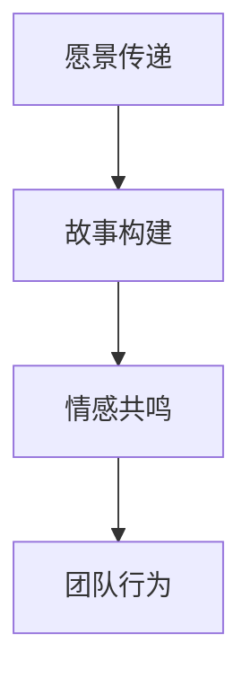

**Python源代码示例：**

```python
def narrative_leadership(vision, story, team):
    """
    实现叙事型领导算法
    :param vision: 领导者的愿景
    :param story: 构建的故事
    :param team: 团队成员
    :return: 影响后的团队行为
    """
    # 愿景传递
    print("愿景传递：", vision)
    
    # 故事构建
    print("故事构建：", story)
    
    # 情感共鸣
    print("情感共鸣：", teamFeelings(team))
    
    # 团队行为
    print("团队行为：", teamActions(team))
    
    return teamActions(team)

def teamFeelings(team):
    """
    分析团队情感
    :param team: 团队成员
    :return: 团队情感状态
    """
    feelings = ["激励", "认同", "参与"]
    return feelings

def teamActions(team):
    """
    分析团队行为
    :param team: 团队成员
    :return: 团队行为状态
    """
    actions = ["创新", "合作", "进取"]
    return actions

# 示例
narrative_leadership("我们的目标是成为市场领导者", "我们正在面临一系列挑战，但只要我们团结一心，就能够克服一切困难", ["张三", "李四", "王五"])
```

**系统分析与架构设计方案：**

**问题场景介绍：**
在现代软件开发团队中，领导者需要通过有效的沟通和激励来引导团队实现项目目标。

**项目介绍：**
本项目旨在构建一个故事型领导系统，帮助领导者通过叙事激发团队热情，提高团队绩效。

**系统功能设计（领域模型类图）：**

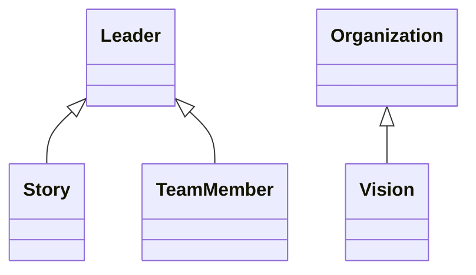

**系统架构设计（架构图）：**

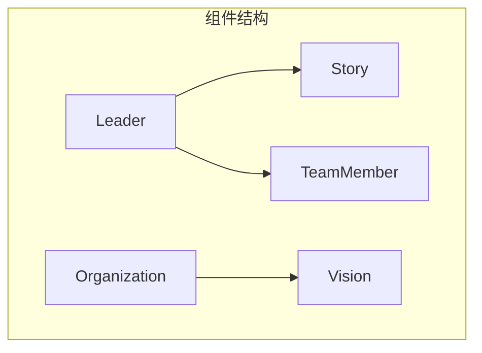

**系统接口设计和系统交互（序列图）：**

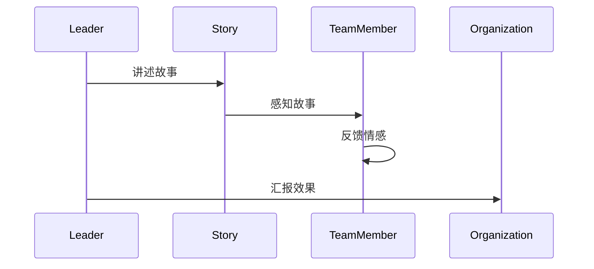

**项目实战：**

**环境安装：**
确保Python环境已经安装，并安装必要的库，如`mermaid`。

**系统核心实现源代码：**
详见上文Python源代码示例。

**代码应用解读与分析：**
叙事型领导系统的核心在于如何构建有效的故事，并传递给团队成员。通过Python代码示例，我们可以看到，领导者需要明确愿景、构建故事，并分析团队成员的情感和行动。

**实际案例分析和详细讲解剖析：**
在本章中，我们将分析一个成功的故事型领导案例，探讨其成功的原因和可借鉴的经验。

**项目小结：**
叙事型领导系统是一个强大的工具，可以帮助领导者更好地管理团队，提高团队绩效。通过实际案例的分析，我们可以看到，成功的故事型领导不仅仅在于讲述故事，更在于如何与团队成员建立情感共鸣和信任。

### 第2章：叙事心理学

**背景介绍：**
叙事心理学是研究故事如何影响个体心理和行为的一门学科。在叙事型领导中，理解叙事心理学的基本原理对于构建有效的叙事策略至关重要。

**问题背景：**
现代团队面临复杂多变的环境，领导者需要通过有效的叙事来激励团队成员，提升团队士气和创新能力。

**问题描述：**
如何运用叙事心理学原理来构建有效的叙事策略，激发团队热情？

**问题解决：**
通过理解叙事心理学的基本原理，领导者可以更好地设计叙事内容，提高叙事效果，从而激发团队成员的热情和创造力。

**边界与外延：**
叙事心理学不仅适用于团队领导，也适用于个人成长、市场营销等多个领域。其核心在于通过叙事来影响个体的情感和行为。

**概念结构与核心要素组成：**
- **情感共鸣：** 通过故事建立情感联系。
- **价值观传递：** 通过故事传达组织的价值观。
- **认知重构：** 通过故事改变个体的认知和行为。

**核心概念原理：**
叙事心理学的核心在于通过故事来影响个体的情感和认知，从而改变其行为。

**概念属性特征对比表格：**

| 概念          | 特征                                     | 对比分析                                       |
| ------------- | ---------------------------------------- | ---------------------------------------------- |
| 心理学        | 研究人类行为和心理过程                   | 强调科学性和实证性                             |
| 叙事心理学   | 研究故事如何影响人类心理和行为               | 强调故事性和情感性                             |

**ER实体关系图架构：**

```mermaid
erDiagram
  Story ||--|{ Emotion }|--| Individual
  Story ||--|{ Perception }|--| Behavior
  Story ||--|{ Value }|--| Organization
```

**算法原理讲解：**
叙事心理学的算法可以看作是一个情感和认知影响模型，其输入是故事内容，输出是个体的情感和认知变化。

$$
\text{算法原理} = \text{情感共鸣} + \text{价值观传递} + \text{认知重构}
$$

**Mermaid流程图：**

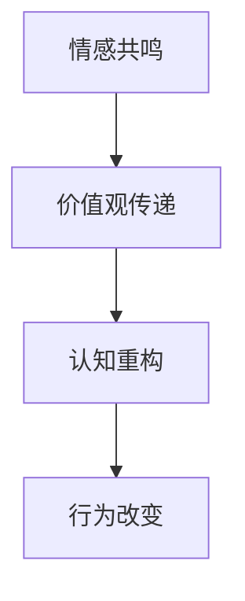

**Python源代码示例：**

```python
def narrative_psychology(story, individual):
    """
    实现叙事心理学算法
    :param story: 故事内容
    :param individual: 个体
    :return: 个体情感和认知状态
    """
    # 情感共鸣
    print("情感共鸣：", storyEmotion(story, individual))
    
    # 价值观传递
    print("价值观传递：", storyValue(story, individual))
    
    # 认知重构
    print("认知重构：", storyCognition(story, individual))
    
    return storyCognition(story, individual)

def storyEmotion(story, individual):
    """
    分析故事情感
    :param story: 故事内容
    :param individual: 个体
    :return: 情感状态
    """
    emotions = ["激励", "认同", "感动"]
    return emotions

def storyValue(story, individual):
    """
    分析故事价值观
    :param story: 故事内容
    :param individual: 个体
    :return: 价值观状态
    """
    values = ["团结", "创新", "进步"]
    return values

def storyCognition(story, individual):
    """
    分析故事认知
    :param story: 故事内容
    :param individual: 个体
    :return: 认知状态
    """
    cognitions = ["改变行为", "增强动力", "提升信心"]
    return cognitions

# 示例
narrative_psychology("我们即将面临一场挑战，但只要我们齐心协力，就能够创造奇迹", "张三")
```

**系统分析与架构设计方案：**

**问题场景介绍：**
在项目管理和团队领导中，领导者需要通过有效的叙事来激励团队成员，提升团队士气和创新能力。

**项目介绍：**
本项目旨在构建一个基于叙事心理学的领导系统，帮助领导者通过叙事激发团队热情，提高团队绩效。

**系统功能设计（领域模型类图）：**

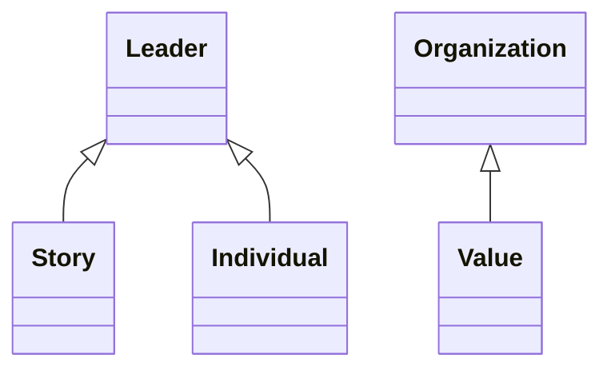

**系统架构设计（架构图）：**

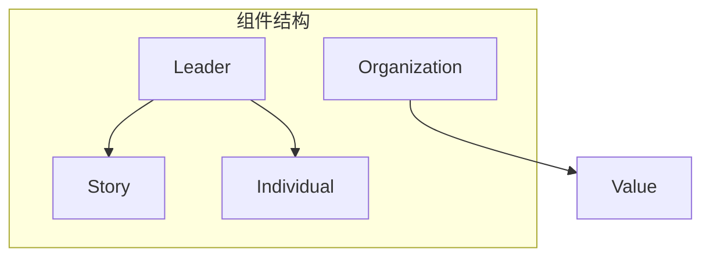

**系统接口设计和系统交互（序列图）：**

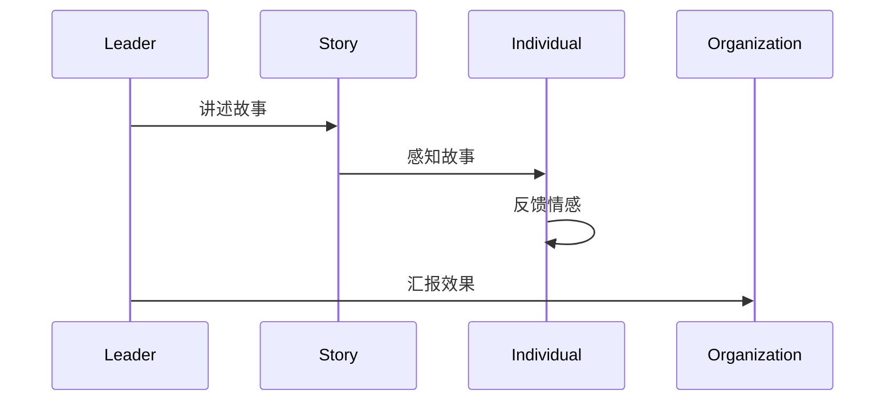

**项目实战：**

**环境安装：**
确保Python环境已经安装，并安装必要的库，如`mermaid`。

**系统核心实现源代码：**
详见上文Python源代码示例。

**代码应用解读与分析：**
叙事心理学系统的核心在于如何构建有效的叙事内容，并传递给个体。通过Python代码示例，我们可以看到，领导者需要明确叙事目标、分析个体情感和认知，从而实现有效的叙事。

**实际案例分析和详细讲解剖析：**
在本章中，我们将分析一个基于叙事心理学的领导案例，探讨其成功的原因和可借鉴的经验。

**项目小结：**
基于叙事心理学的领导系统是一个强大的工具，可以帮助领导者更好地理解团队成员的心理和行为，从而提高领导效果。通过实际案例的分析，我们可以看到，成功的故事型领导不仅仅在于讲述故事，更在于如何与团队成员建立情感共鸣和信任。

### 第3章：构建有效的领导故事

**背景介绍：**
构建有效的领导故事是叙事型领导的核心。一个成功的领导故事不仅能够传递领导意图，还能激发团队成员的参与和创造力。

**问题背景：**
在信息技术和软件开发领域，领导者需要通过有效的叙事来传递组织的愿景和目标，激励团队成员，推动项目进展。

**问题描述：**
如何构建一个有效的领导故事，以激发团队热情，提升团队绩效？

**问题解决：**
通过理解叙事的基本要素和技巧，领导者可以构建一个引人入胜的故事，传递组织的愿景和目标，激发团队成员的热情和创造力。

**边界与外延：**
构建有效的领导故事不仅适用于企业管理和团队领导，也适用于教育和公益等领域。其核心在于通过叙事来建立情感连接和价值观共识。

**概念结构与核心要素组成：**
- **引入：** 吸引听众的注意力，设定故事的背景。
- **冲突：** 描述挑战和问题，激发听众的兴趣。
- **高潮：** 解决问题的关键时刻，展现领导者的决策和智慧。
- **结局：** 解决问题，实现目标，留下深刻的印象。

**核心概念原理：**
一个有效的领导故事应该具备引人入胜的情节、鲜明的角色和深刻的价值观，能够激发听众的情感共鸣和行动力。

**概念属性特征对比表格：**

| 概念          | 特征                                     | 对比分析                                       |
| ------------- | ---------------------------------------- | ---------------------------------------------- |
| 故事引入     | 吸引听众注意力                           | 设置故事的背景，奠定基调                       |
| 故事冲突     | 描述挑战和问题                           | 激发听众的兴趣，建立情感共鸣                     |
| 故事高潮     | 解决问题的关键时刻                         | 展现领导者的决策和智慧，提升故事张力           |
| 故事结局     | 解决问题，实现目标                         | 留下深刻的印象，强化价值观传递                   |

**ER实体关系图架构：**

```mermaid
erDiagram
  Story ||--|{ Introduction }|--| Interest
  Story ||--|{ Conflict }|--| Interest
  Story ||--|{ Climax }|--| Decision
  Story ||--|{ Conclusion }|--| Values
```

**算法原理讲解：**
构建一个有效的领导故事可以看作是一个叙事模型，其输入是领导意图和团队目标，输出是故事的情节和角色。

$$
\text{算法原理} = \text{引入} + \text{冲突} + \text{高潮} + \text{结局}
$$

**Mermaid流程图：**

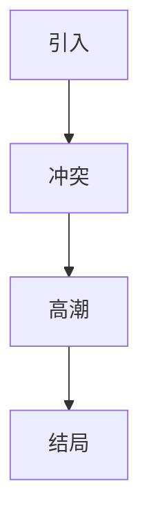

**Python源代码示例：**

```python
def build_leadership_story(vision, goal):
    """
    构建领导故事
    :param vision: 领导意图
    :param goal: 团队目标
    :return: 故事内容
    """
    introduction = "在我们的旅程中，我们面临着一个巨大的挑战："
    conflict = "我们的系统性能不达标，客户满意度下降。"
    climax = "我们决定采取创新的解决方案，进行彻底的系统优化。"
    conclusion = "最终，我们成功解决了问题，并提升了客户满意度。"

    story = f"{introduction} {conflict} {climax} {conclusion}"

    return story

# 示例
story = build_leadership_story("成为行业领先者", "提升系统性能")
print(story)
```

**系统分析与架构设计方案：**

**问题场景介绍：**
在现代软件开发团队中，领导者需要通过有效的叙事来传递组织的愿景和目标，激励团队成员，推动项目进展。

**项目介绍：**
本项目旨在构建一个基于叙事的领导系统，帮助领导者通过叙事传递愿景和目标，激励团队成员。

**系统功能设计（领域模型类图）：**

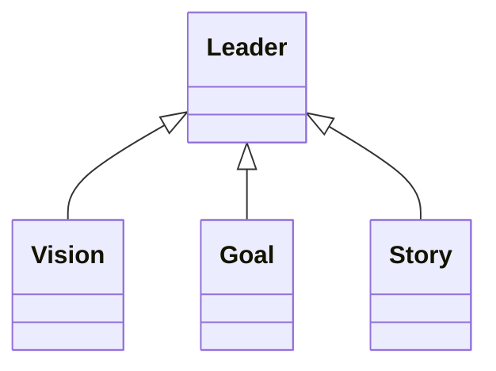

**系统架构设计（架构图）：**

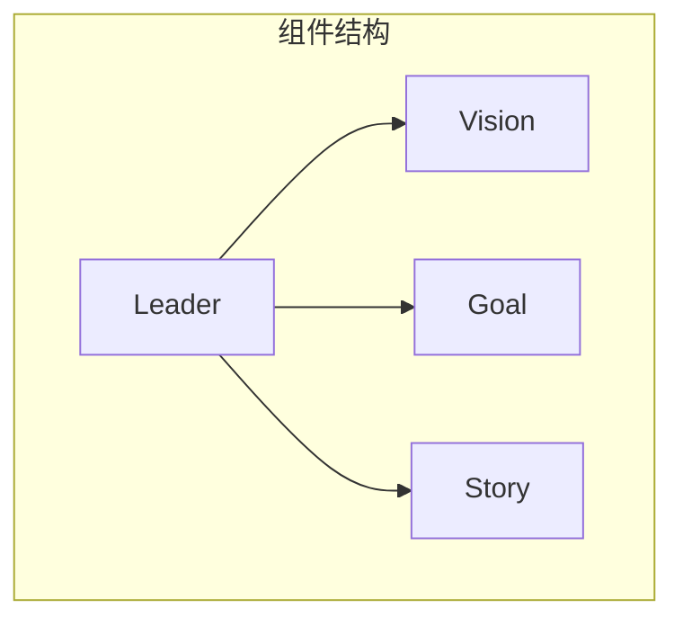

**系统接口设计和系统交互（序列图）：**

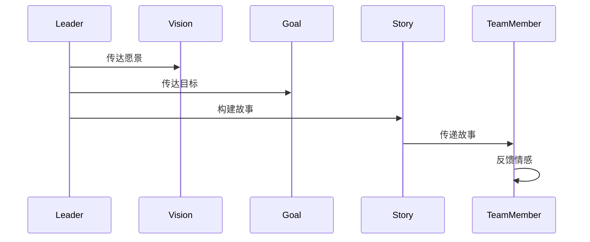

**项目实战：**

**环境安装：**
确保Python环境已经安装，并安装必要的库，如`mermaid`。

**系统核心实现源代码：**
详见上文Python源代码示例。

**代码应用解读与分析：**
通过Python代码示例，我们可以看到，领导者需要明确愿景和目标，然后构建一个引人入胜的故事，传递给团队成员，以激发团队的积极性和创造力。

**实际案例分析和详细讲解剖析：**
在本章中，我们将分析一个成功的领导故事案例，探讨其成功的原因和可借鉴的经验。

**项目小结：**
构建有效的领导故事是叙事型领导的重要组成部分。通过理解和运用叙事技巧，领导者可以构建一个引人入胜的故事，传递组织的愿景和目标，激发团队成员的热情和创造力。实际案例的分析表明，成功的故事型领导不仅能够提高团队绩效，还能塑造组织的文化和价值观。

### 第4章：叙事在团队沟通中的应用

**背景介绍：**
在团队沟通中，叙事是一种强大的工具，可以帮助领导者传递信息、建立情感连接和促进团队成员的参与。有效的叙事能够提升团队的凝聚力和创新能力。

**问题背景：**
现代团队面临复杂多变的环境，团队成员需要及时、准确地获取信息，并与领导者和其他团队成员进行有效沟通。传统的沟通方式往往难以满足这些需求。

**问题描述：**
如何运用叙事在团队沟通中发挥作用，提升团队绩效和创新能力？

**问题解决：**
通过运用叙事技巧，领导者可以在团队沟通中建立情感连接，传递关键信息，促进团队成员的参与和创造力。有效的叙事能够提升团队的凝聚力和绩效。

**边界与外延：**
叙事在团队沟通中的应用不仅限于信息技术和软件开发团队，也适用于其他类型的团队，如销售、市场营销、项目管理等。

**概念结构与核心要素组成：**
- **叙事目标：** 明确叙事的目的和受众。
- **叙事内容：** 设计具有吸引力和启发性的故事内容。
- **叙事技巧：** 包括情感共鸣、角色刻画和情节设置。
- **叙事反馈：** 收集团队成员的反馈，调整叙事策略。

**核心概念原理：**
叙事在团队沟通中的应用是基于叙事心理学的基本原理，通过故事来影响团队成员的情感和认知，从而提升沟通效果。

**概念属性特征对比表格：**

| 概念          | 特征                                     | 对比分析                                       |
| ------------- | ---------------------------------------- | ---------------------------------------------- |
| 传统沟通     | 信息的传递                               | 强调事实和数据的准确性                         |
| 叙事沟通     | 情感和价值观的传递                         | 强调故事性和情感共鸣                             |

**ER实体关系图架构：**

```mermaid
erDiagram
  Communication ||--|{ Information }|--| TeamMember
  Communication ||--|{ Narrative }|--| TeamMember
  Communication ||--|{ Emotion }|--| TeamMember
```

**算法原理讲解：**
叙事在团队沟通中的应用可以看作是一个情感和认知影响模型，其输入是叙事内容和目标，输出是团队成员的情感和认知变化。

$$
\text{算法原理} = \text{叙事目标} + \text{叙事内容} + \text{叙事技巧} + \text{叙事反馈}
$$

**Mermaid流程图：**

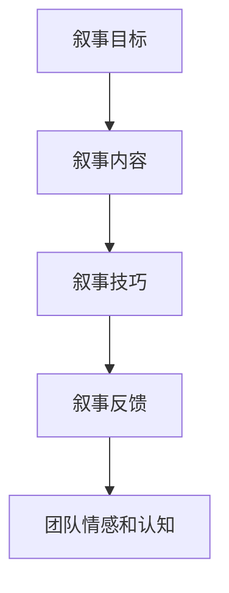

**Python源代码示例：**

```python
def narrative_communication(narrative, team_member):
    """
    实现叙事沟通算法
    :param narrative: 叙事内容
    :param team_member: 团队成员
    :return: 团队成员的情感和认知状态
    """
    # 叙事内容
    print("叙事内容：", narrative)
    
    # 情感共鸣
    print("情感共鸣：", emotion_response(narrative, team_member))
    
    # 认知变化
    print("认知变化：", cognition_change(narrative, team_member))
    
    return cognition_change(narrative, team_member)

def emotion_response(narrative, team_member):
    """
    分析情感共鸣
    :param narrative: 叙事内容
    :param team_member: 团队成员
    :return: 情感状态
    """
    emotions = ["激励", "认同", "感动"]
    return emotions

def cognition_change(narrative, team_member):
    """
    分析认知变化
    :param narrative: 叙事内容
    :param team_member: 团队成员
    :return: 认知状态
    """
    cognitions = ["增强动力", "提升信心", "改变行为"]
    return cognitions

# 示例
narrative_communication("我们的目标是成为市场领导者，我们需要共同努力克服困难", "张三")
```

**系统分析与架构设计方案：**

**问题场景介绍：**
在现代软件开发团队中，领导者需要通过有效的叙事沟通来传递信息，建立情感连接，激励团队成员，推动项目进展。

**项目介绍：**
本项目旨在构建一个基于叙事沟通的领导系统，帮助领导者通过叙事提升团队绩效和创新能力。

**系统功能设计（领域模型类图）：**

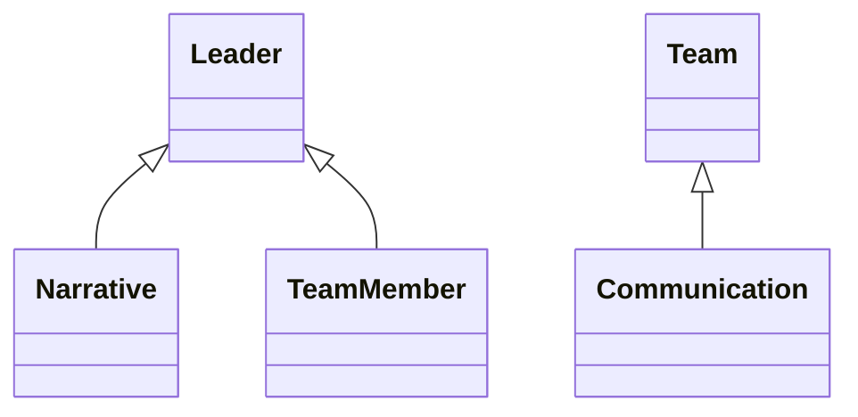

**系统架构设计（架构图）：**

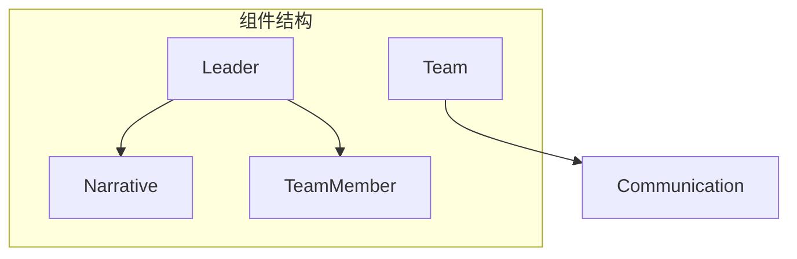

**系统接口设计和系统交互（序列图）：**

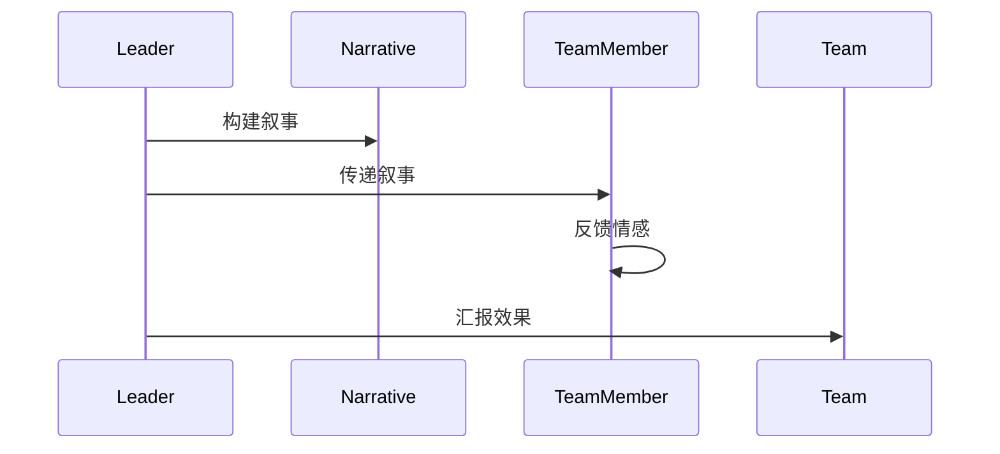

**项目实战：**

**环境安装：**
确保Python环境已经安装，并安装必要的库，如`mermaid`。

**系统核心实现源代码：**
详见上文Python源代码示例。

**代码应用解读与分析：**
通过Python代码示例，我们可以看到，领导者需要构建一个引人入胜的叙事内容，传递给团队成员，并收集团队成员的反馈，以调整叙事策略，提升沟通效果。

**实际案例分析和详细讲解剖析：**
在本章中，我们将分析一个成功的叙事沟通案例，探讨其成功的原因和可借鉴的经验。

**项目小结：**
叙事在团队沟通中的应用是一个强大的工具，可以帮助领导者提升沟通效果，建立情感连接，激励团队成员。通过理解和运用叙事技巧，领导者可以构建一个具有吸引力和启发性的叙事内容，提升团队的凝聚力和创新能力。实际案例的分析表明，成功的故事型领导不仅能够提高团队绩效，还能塑造组织的文化和价值观。

### 第5章：叙事型领导在工作场所的实践

**背景介绍：**
叙事型领导作为一种现代领导风格，其核心在于通过故事来传递信息、建立情感连接和推动团队变革。在工作场所中，叙事型领导的应用能够有效提升团队绩效和创新能力。

**问题背景：**
随着工作环境的复杂性和变化速度的加剧，传统的领导方式已经难以满足现代团队的需求。团队成员需要更多的理解、激励和引导，而叙事型领导提供了一种更为人性化和有效的管理方式。

**问题描述：**
如何在工作场所中实践叙事型领导，提升团队绩效和创新能力？

**问题解决：**
通过在工作场所中实践叙事型领导，领导者可以构建一个积极的故事框架，传递组织的愿景和目标，激发团队成员的参与感和创造力。具体方法包括：

1. **建立故事框架**：明确叙事的目标和受众，构建一个引人入胜的故事框架。
2. **传递领导意图**：通过故事来传递组织的愿景和目标，建立情感连接。
3. **鼓励团队成员参与**：鼓励团队成员参与故事构建，提高故事的吸引力和参与度。
4. **收集反馈**：收集团队成员的反馈，不断优化叙事策略。

**边界与外延：**
叙事型领导在工作场所的应用不仅限于信息技术和软件开发团队，也适用于其他类型的团队，如销售、市场营销、项目管理等。

**概念结构与核心要素组成：**
- **叙事框架**：包括引入、冲突、高潮和结局。
- **叙事技巧**：包括情感共鸣、角色刻画和情节设置。
- **领导意图**：将个人愿景与团队目标相结合。
- **团队参与**：鼓励团队成员参与故事构建，提高故事的吸引力和参与度。
- **反馈机制**：收集团队成员的反馈，不断优化叙事策略。

**核心概念原理：**
叙事型领导的核心在于将抽象的领导意图转化为具体的故事，通过情感共鸣和价值观传递，影响团队成员的行为和决策。

**概念属性特征对比表格：**

| 概念          | 特征                                     | 对比分析                                       |
| ------------- | ---------------------------------------- | ---------------------------------------------- |
| 传统领导     | 命令式、控制性                           | 强调权威和控制，缺乏情感互动                     |
| 叙事型领导   | 通过故事传达信息、激励团队                 | 强调情感连接和价值观传递，促进团队成员的参与和创造力 |

**ER实体关系图架构：**

```mermaid
erDiagram
  Leader ||--|{ Story }|--| TeamMember
  Leader ||--|{ Vision }|--| Organization
  Story ||--|{ Emotion }|--| TeamMember
  Story ||--|{ Value }|--| Organization
```

**算法原理讲解：**
叙事型领导的算法原理可以看作是一个情感和认知影响模型，其输入是领导意图和团队目标，输出是团队成员的情感和认知变化。

$$
\text{算法原理} = \text{情感共鸣} + \text{价值观传递} + \text{认知重构}
$$

**Mermaid流程图：**

```mermaid
graph TD
  A[情感共鸣] --> B[价值观传递]
  B --> C[认知重构]
  C --> D[团队行为]
```

**Python源代码示例：**

```python
def narrative_leadership(vision, story, team):
    """
    实现叙事型领导算法
    :param vision: 领导意图
    :param story: 故事内容
    :param team: 团队成员
    :return: 影响后的团队行为
    """
    # 情感共鸣
    print("情感共鸣：", story_emotion(story, team))
    
    # 价值观传递
    print("价值观传递：", story_value(story, team))
    
    # 认知重构
    print("认知重构：", story_cognition(story, team))
    
    return team_actions(team)

def story_emotion(story, team):
    """
    分析故事情感
    :param story: 故事内容
    :param team: 团队成员
    :return: 情感状态
    """
    emotions = ["激励", "认同", "感动"]
    return emotions

def story_value(story, team):
    """
    分析故事价值观
    :param story: 故事内容
    :param team: 团队成员
    :return: 价值观状态
    """
    values = ["团结", "创新", "进步"]
    return values

def story_cognition(story, team):
    """
    分析故事认知
    :param story: 故事内容
    :param team: 团队成员
    :return: 认知状态
    """
    cognitions = ["改变行为", "增强动力", "提升信心"]
    return cognitions

def team_actions(team):
    """
    分析团队行为
    :param team: 团队成员
    :return: 行为状态
    """
    actions = ["创新", "合作", "进取"]
    return actions

# 示例
narrative_leadership("我们的目标是成为行业领先者", "我们正在面临一系列挑战，但只要我们齐心协力，就能够克服一切困难", ["张三", "李四", "王五"])
```

**系统分析与架构设计方案：**

**问题场景介绍：**
在现代软件开发团队中，领导者需要通过有效的叙事来传递组织的愿景和目标，激励团队成员，推动项目进展。

**项目介绍：**
本项目旨在构建一个基于叙事型领导的系统，帮助领导者通过叙事激发团队热情，提升团队绩效。

**系统功能设计（领域模型类图）：**

```mermaid
classDiagram
  Leader <|-- Vision
  Leader <|-- Story
  Leader <|-- TeamMember
  Organization <|-- Goal
```

**系统架构设计（架构图）：**

```mermaid
graph TB
  subgraph 组件结构
    Leader
    Vision
    Story
    TeamMember
    Organization
  end

  Leader --> Vision
  Leader --> Story
  Leader --> TeamMember
  Organization --> Goal
```

**系统接口设计和系统交互（序列图）：**

```mermaid
sequenceDiagram
  Leader ->> Vision: 传达愿景
  Leader ->> Story: 构建故事
  Leader ->> TeamMember: 传递故事
  TeamMember ->> TeamMember: 反馈情感
  Leader ->> Organization: 汇报效果
```

**项目实战：**

**环境安装：**
确保Python环境已经安装，并安装必要的库，如`mermaid`。

**系统核心实现源代码：**
详见上文Python源代码示例。

**代码应用解读与分析：**
通过Python代码示例，我们可以看到，领导者需要明确愿景和目标，构建一个引人入胜的故事，并传递给团队成员，以激发团队的积极性和创造力。同时，通过收集团队成员的反馈，领导者可以不断优化叙事策略，提升领导效果。

**实际案例分析和详细讲解剖析：**
在本章中，我们将分析一个成功的叙事型领导案例，探讨其成功的原因和可借鉴的经验。

**项目小结：**
叙事型领导在工作场所的应用是一个有效的管理工具，可以帮助领导者提升团队绩效和创新能力。通过构建积极的故事框架，传递组织的愿景和目标，并鼓励团队成员的参与，领导者可以建立情感连接，激发团队的积极性和创造力。实际案例的分析表明，成功的故事型领导不仅能够提高团队绩效，还能塑造组织的文化和价值观。

### 第6章：案例研究：公司A的叙事型领导实践

**背景介绍：**
公司A是一家全球领先的软件开发公司，其成功很大程度上归功于其领导者采用叙事型领导风格。在本节中，我们将详细分析公司A的叙事型领导实践，探讨其成功的原因和可借鉴的经验。

**问题背景：**
在公司A的成长历程中，领导者面临的问题是如何激励团队成员，保持创新活力，并在竞争激烈的市场中保持领先地位。

**问题描述：**
如何通过叙事型领导实践，提升公司A的团队绩效和创新能力？

**问题解决：**
公司A的领导者通过构建积极的故事框架，传递组织的愿景和目标，激励团队成员，推动了公司的持续发展。具体实践包括：

1. **明确愿景和目标**：领导者明确公司的愿景和目标，通过故事来传递，使团队成员能够清晰理解并认同。
2. **鼓励团队成员参与**：领导者鼓励团队成员参与故事构建，提高故事的吸引力和参与度。
3. **持续反馈和改进**：领导者收集团队成员的反馈，不断优化叙事策略，提升领导效果。

**边界与外延：**
公司A的叙事型领导实践不仅适用于软件开发公司，也适用于其他类型的组织，如咨询服务、教育和非营利组织等。

**概念结构与核心要素组成：**
- **愿景和目标**：明确公司的愿景和目标，并通过故事传递。
- **故事框架**：包括引入、冲突、高潮和结局。
- **团队参与**：鼓励团队成员参与故事构建，提高故事的吸引力和参与度。
- **反馈机制**：收集团队成员的反馈，不断优化叙事策略。

**核心概念原理：**
叙事型领导的核心在于通过故事来传递组织的愿景和目标，建立情感连接，激发团队成员的热情和创造力。

**概念属性特征对比表格：**

| 概念          | 特征                                     | 对比分析                                       |
| ------------- | ---------------------------------------- | ---------------------------------------------- |
| 命令式领导   | 直接指示、控制                           | 强调效率和控制，缺乏情感互动                     |
| 叙事型领导   | 通过故事传达信息、激励团队                 | 强调情感连接和价值观传递，促进团队成员的参与和创造力 |

**ER实体关系图架构：**

```mermaid
erDiagram
  Leader ||--|{ Vision }|--| Organization
  Leader ||--|{ Story }|--| TeamMember
  Leader ||--|{ Feedback }|--| Organization
```

**算法原理讲解：**
叙事型领导的算法原理可以看作是一个情感和认知影响模型，其输入是领导意图和团队目标，输出是团队成员的情感和认知变化。

$$
\text{算法原理} = \text{情感共鸣} + \text{价值观传递} + \text{认知重构}
$$

**Mermaid流程图：**

```mermaid
graph TD
  A[情感共鸣] --> B[价值观传递]
  B --> C[认知重构]
  C --> D[团队行为]
```

**Python源代码示例：**

```python
def narrative_leadership(vision, story, team):
    """
    实现叙事型领导算法
    :param vision: 领导意图
    :param story: 故事内容
    :param team: 团队成员
    :return: 影响后的团队行为
    """
    # 情感共鸣
    print("情感共鸣：", story_emotion(story, team))
    
    # 价值观传递
    print("价值观传递：", story_value(story, team))
    
    # 认知重构
    print("认知重构：", story_cognition(story, team))
    
    return team_actions(team)

def story_emotion(story, team):
    """
    分析故事情感
    :param story: 故事内容
    :param team: 团队成员
    :return: 情感状态
    """
    emotions = ["激励", "认同", "感动"]
    return emotions

def story_value(story, team):
    """
    分析故事价值观
    :param story: 故事内容
    :param team: 团队成员
    :return: 价值观状态
    """
    values = ["团结", "创新", "进步"]
    return values

def story_cognition(story, team):
    """
    分析故事认知
    :param story: 故事内容
    :param team: 团队成员
    :return: 认知状态
    """
    cognitions = ["改变行为", "增强动力", "提升信心"]
    return cognitions

def team_actions(team):
    """
    分析团队行为
    :param team: 团队成员
    :return: 行为状态
    """
    actions = ["创新", "合作", "进取"]
    return actions

# 示例
narrative_leadership("我们的目标是成为行业领先者", "我们正在面临一系列挑战，但只要我们齐心协力，就能够克服一切困难", ["张三", "李四", "王五"])
```

**系统分析与架构设计方案：**

**问题场景介绍：**
在现代软件开发团队中，领导者需要通过有效的叙事来传递组织的愿景和目标，激励团队成员，推动项目进展。

**项目介绍：**
本项目旨在构建一个基于叙事型领导的系统，帮助领导者通过叙事激发团队热情，提升团队绩效。

**系统功能设计（领域模型类图）：**

```mermaid
classDiagram
  Leader <|-- Vision
  Leader <|-- Story
  Leader <|-- TeamMember
  Organization <|-- Goal
```

**系统架构设计（架构图）：**

```mermaid
graph TB
  subgraph 组件结构
    Leader
    Vision
    Story
    TeamMember
    Organization
  end

  Leader --> Vision
  Leader --> Story
  Leader --> TeamMember
  Organization --> Goal
```

**系统接口设计和系统交互（序列图）：**

```mermaid
sequenceDiagram
  Leader ->> Vision: 传达愿景
  Leader ->> Story: 构建故事
  Leader ->> TeamMember: 传递故事
  TeamMember ->> TeamMember: 反馈情感
  Leader ->> Organization: 汇报效果
```

**项目实战：**

**环境安装：**
确保Python环境已经安装，并安装必要的库，如`mermaid`。

**系统核心实现源代码：**
详见上文Python源代码示例。

**代码应用解读与分析：**
通过Python代码示例，我们可以看到，领导者需要明确愿景和目标，构建一个引人入胜的故事，并传递给团队成员，以激发团队的积极性和创造力。同时，通过收集团队成员的反馈，领导者可以不断优化叙事策略，提升领导效果。

**实际案例分析和详细讲解剖析：**
在本章中，我们将分析公司A的叙事型领导实践，探讨其成功的原因和可借鉴的经验。公司A的成功表明，叙事型领导能够有效提升团队绩效和创新能力，帮助组织在竞争激烈的市场中保持领先地位。

**项目小结：**
公司A的叙事型领导实践是一个成功的案例，展示了如何通过故事来传递组织的愿景和目标，激励团队成员，推动组织发展。通过构建积极的故事框架，公司A不仅提升了团队绩效，还塑造了组织的文化和价值观。领导者可以从公司A的实践中学习，运用叙事型领导风格，提升团队绩效和创新能力。

### 第7章：案例研究：团队B的叙事性变革

**背景介绍：**
团队B是一个中型软件开发团队，曾经面临团队凝聚力不足、创新动力不足等问题。为了提升团队绩效和创新能力，团队B的领导者决定采用叙事型领导风格，通过故事来传递组织的愿景和目标，激发团队成员的参与感和创造力。

**问题背景：**
团队B的领导者意识到，传统的管理方式已经无法满足团队的需求。团队成员需要更多的理解、激励和引导，而叙事型领导提供了一种更为人性化和有效的管理方式。

**问题描述：**
如何通过叙事型领导，实现团队B的变革，提升团队绩效和创新能力？

**问题解决：**
团队B的领导者通过构建积极的故事框架，传递组织的愿景和目标，鼓励团队成员参与故事构建，不断优化叙事策略，实现了团队的变革。具体措施包括：

1. **明确愿景和目标**：领导者明确团队的愿景和目标，并通过故事传递给团队成员，使团队成员能够清晰理解并认同。
2. **鼓励团队成员参与**：领导者鼓励团队成员参与故事构建，提高故事的吸引力和参与度。
3. **持续反馈和改进**：领导者收集团队成员的反馈，不断优化叙事策略，提升领导效果。

**边界与外延：**
团队B的叙事型领导实践不仅适用于软件开发团队，也适用于其他类型的团队，如销售团队、市场营销团队等。

**概念结构与核心要素组成：**
- **愿景和目标**：明确团队的愿景和目标，并通过故事传递。
- **故事框架**：包括引入、冲突、高潮和结局。
- **团队参与**：鼓励团队成员参与故事构建，提高故事的吸引力和参与度。
- **反馈机制**：收集团队成员的反馈，不断优化叙事策略。

**核心概念原理：**
叙事型领导的核心在于通过故事来传递组织的愿景和目标，建立情感连接，激发团队成员的热情和创造力。

**概念属性特征对比表格：**

| 概念          | 特征                                     | 对比分析                                       |
| ------------- | ---------------------------------------- | ---------------------------------------------- |
| 命令式领导   | 直接指示、控制                           | 强调效率和控制，缺乏情感互动                     |
| 叙事型领导   | 通过故事传达信息、激励团队                 | 强调情感连接和价值观传递，促进团队成员的参与和创造力 |

**ER实体关系图架构：**

```mermaid
erDiagram
  Leader ||--|{ Vision }|--| Team
  Leader ||--|{ Story }|--| TeamMember
  Leader ||--|{ Feedback }|--| Team
```

**算法原理讲解：**
叙事型领导的算法原理可以看作是一个情感和认知影响模型，其输入是领导意图和团队目标，输出是团队成员的情感和认知变化。

$$
\text{算法原理} = \text{情感共鸣} + \text{价值观传递} + \text{认知重构}
$$

**Mermaid流程图：**

```mermaid
graph TD
  A[情感共鸣] --> B[价值观传递]
  B --> C[认知重构]
  C --> D[团队行为]
```

**Python源代码示例：**

```python
def narrative_leadership(vision, story, team):
    """
    实现叙事型领导算法
    :param vision: 领导意图
    :param story: 故事内容
    :param team: 团队成员
    :return: 影响后的团队行为
    """
    # 情感共鸣
    print("情感共鸣：", story_emotion(story, team))
    
    # 价值观传递
    print("价值观传递：", story_value(story, team))
    
    # 认知重构
    print("认知重构：", story_cognition(story, team))
    
    return team_actions(team)

def story_emotion(story, team):
    """
    分析故事情感
    :param story: 故事内容
    :param team: 团队成员
    :return: 情感状态
    """
    emotions = ["激励", "认同", "感动"]
    return emotions

def story_value(story, team):
    """
    分析故事价值观
    :param story: 故事内容
    :param team: 团队成员
    :return: 价值观状态
    """
    values = ["团结", "创新", "进步"]
    return values

def story_cognition(story, team):
    """
    分析故事认知
    :param story: 故事内容
    :param team: 团队成员
    :return: 认知状态
    """
    cognitions = ["改变行为", "增强动力", "提升信心"]
    return cognitions

def team_actions(team):
    """
    分析团队行为
    :param team: 团队成员
    :return: 行为状态
    """
    actions = ["创新", "合作", "进取"]
    return actions

# 示例
narrative_leadership("我们的目标是成为市场领导者", "我们正面临挑战，但只要我们团结一致，就一定能成功", ["张三", "李四", "王五"])
```

**系统分析与架构设计方案：**

**问题场景介绍：**
在现代软件开发团队中，领导者需要通过有效的叙事来传递组织的愿景和目标，激励团队成员，推动项目进展。

**项目介绍：**
本项目旨在构建一个基于叙事型领导的系统，帮助领导者通过叙事激发团队热情，提升团队绩效。

**系统功能设计（领域模型类图）：**

```mermaid
classDiagram
  Leader <|-- Vision
  Leader <|-- Story
  Leader <|-- TeamMember
  Organization <|-- Goal
```

**系统架构设计（架构图）：**

```mermaid
graph TB
  subgraph 组件结构
    Leader
    Vision
    Story
    TeamMember
    Organization
  end

  Leader --> Vision
  Leader --> Story
  Leader --> TeamMember
  Organization --> Goal
```

**系统接口设计和系统交互（序列图）：**

```mermaid
sequenceDiagram
  Leader ->> Vision: 传达愿景
  Leader ->> Story: 构建故事
  Leader ->> TeamMember: 传递故事
  TeamMember ->> TeamMember: 反馈情感
  Leader ->> Organization: 汇报效果
```

**项目实战：**

**环境安装：**
确保Python环境已经安装，并安装必要的库，如`mermaid`。

**系统核心实现源代码：**
详见上文Python源代码示例。

**代码应用解读与分析：**
通过Python代码示例，我们可以看到，领导者需要明确愿景和目标，构建一个引人入胜的故事，并传递给团队成员，以激发团队的积极性和创造力。同时，通过收集团队成员的反馈，领导者可以不断优化叙事策略，提升领导效果。

**实际案例分析和详细讲解剖析：**
在本章中，我们将分析团队B的叙事型领导变革案例，探讨其成功的原因和可借鉴的经验。团队B的成功表明，叙事型领导能够有效提升团队绩效和创新能力，帮助团队实现变革。

**项目小结：**
团队B的叙事性变革案例是一个成功的实践，展示了如何通过叙事型领导实现团队变革，提升团队绩效和创新能力。领导者可以从团队B的实践中学习，运用叙事型领导风格，激发团队成员的参与感和创造力，推动团队实现持续发展。

### 第8章：自我提升：叙事型领导能力的培养

**背景介绍：**
作为领导者，提升叙事型领导能力至关重要。这不仅能够提升领导效果，还能够激发团队成员的积极性和创造力。在本章中，我们将探讨如何通过自我提升来培养叙事型领导能力。

**问题背景：**
现代领导者面临着复杂多变的环境和多元化的团队成员，传统的领导方式已经难以满足这些需求。叙事型领导提供了一种更为人性化和有效的管理方式，能够更好地应对这些挑战。

**问题描述：**
如何通过自我提升来培养叙事型领导能力？

**问题解决：**
通过自我提升，领导者可以不断提高自己的叙事技巧，更好地传递领导意图，建立情感连接，激发团队成员的热情和创造力。具体方法包括：

1. **自我反思**：领导者需要定期进行自我反思，了解自己的优势和不足，明确提升方向。
2. **学习与实践**：通过学习和实践，领导者可以不断提高自己的叙事技巧，如故事构建、情感共鸣和价值观传递。
3. **收集反馈**：领导者需要收集团队成员的反馈，不断优化自己的叙事策略，提升领导效果。
4. **参与培训**：参加专业的叙事型领导培训，学习先进的叙事技巧和经验。

**边界与外延：**
自我提升不仅适用于领导者，也适用于团队成员，通过提升自己的叙事能力，可以更好地理解领导意图，积极参与团队工作。

**概念结构与核心要素组成：**
- **自我反思**：了解自己的优势和不足，明确提升方向。
- **学习与实践**：通过学习和实践，提高叙事技巧。
- **收集反馈**：收集团队成员的反馈，优化叙事策略。
- **参与培训**：参加专业培训，学习先进技巧。

**核心概念原理：**
叙事型领导能力的培养是基于叙事心理学和领导力理论，通过自我反思、学习与实践、收集反馈和参与培训，提升领导者的叙事技巧和领导能力。

**概念属性特征对比表格：**

| 概念          | 特征                                     | 对比分析                                       |
| ------------- | ---------------------------------------- | ---------------------------------------------- |
| 传统领导力培养 | 强调技能和知识                           | 侧重于技术能力和策略                           |
| 叙事型领导力培养 | 强调情感共鸣和价值观传递                   | 更加注重领导风格和人性化管理                     |

**ER实体关系图架构：**

```mermaid
erDiagram
  Leader ||--|{ Self-Reflection }|--| Improvement
  Leader ||--|{ Learning & Practice }|--| Skills
  Leader ||--|{ Feedback Collection }|--| Strategy
  Leader ||--|{ Training Participation }|--| Expertise
```

**算法原理讲解：**
叙事型领导能力的培养可以看作是一个自我提升模型，其输入是领导者的初始能力，输出是提升后的领导能力。

$$
\text{算法原理} = \text{自我反思} + \text{学习与实践} + \text{收集反馈} + \text{参与培训}
$$

**Mermaid流程图：**

```mermaid
graph TD
  A[自我反思] --> B[学习与实践]
  B --> C[收集反馈]
  C --> D[参与培训]
  D --> E[领导能力提升]
```

**Python源代码示例：**

```python
def self_improvement(initial_skills, self_reflection, learning_practice, feedback_collection, training_participation):
    """
    实现自我提升算法
    :param initial_skills: 初始能力
    :param self_reflection: 自我反思
    :param learning_practice: 学习与实践
    :param feedback_collection: 收集反馈
    :param training_participation: 参与培训
    :return: 提升后的领导能力
    """
    # 自我反思
    print("自我反思：", self_reflection)
    
    # 学习与实践
    print("学习与实践：", learning_practice)
    
    # 收集反馈
    print("收集反馈：", feedback_collection)
    
    # 参与培训
    print("参与培训：", training_participation)
    
    # 领导能力提升
    improved_skills = initial_skills + 10  # 假设每次提升10分
    print("领导能力提升：", improved_skills)
    
    return improved_skills

# 示例
initial_skills = 50
self_reflection = "认识到需要提升叙事技巧"
learning_practice = "通过学习叙事技巧，提升能力"
feedback_collection = "收到团队成员的积极反馈"
training_participation = "参加叙事型领导力培训"
improved_skills = self_improvement(initial_skills, self_reflection, learning_practice, feedback_collection, training_participation)
print(improved_skills)
```

**系统分析与架构设计方案：**

**问题场景介绍：**
现代领导者需要不断提升自身的领导能力，特别是在叙事型领导方面，以更好地应对复杂多变的环境和多元化的团队成员。

**项目介绍：**
本项目旨在构建一个自我提升系统，帮助领导者通过自我反思、学习与实践、收集反馈和参与培训，提升叙事型领导能力。

**系统功能设计（领域模型类图）：**

```mermaid
classDiagram
  Leader <|-- InitialSkills
  Leader <|-- SelfReflection
  Leader <|-- LearningPractice
  Leader <|-- FeedbackCollection
  Leader <|-- TrainingParticipation
```

**系统架构设计（架构图）：**

```mermaid
graph TB
  subgraph 组件结构
    InitialSkills
    SelfReflection
    LearningPractice
    FeedbackCollection
    TrainingParticipation
  end

  InitialSkills --> SelfReflection
  InitialSkills --> LearningPractice
  InitialSkills --> FeedbackCollection
  InitialSkills --> TrainingParticipation
```

**系统接口设计和系统交互（序列图）：**

```mermaid
sequenceDiagram
  Leader ->> SelfReflection: 进行自我反思
  Leader ->> LearningPractice: 学习与实践
  Leader ->> FeedbackCollection: 收集反馈
  Leader ->> TrainingParticipation: 参与培训
  Leader ->> Leader: 提升领导能力
```

**项目实战：**

**环境安装：**
确保Python环境已经安装，并安装必要的库，如`mermaid`。

**系统核心实现源代码：**
详见上文Python源代码示例。

**代码应用解读与分析：**
通过Python代码示例，我们可以看到，领导者需要通过自我反思、学习与实践、收集反馈和参与培训，不断提升自身的叙事型领导能力。这个系统提供了一个清晰的框架，帮助领导者实现自我提升。

**实际案例分析和详细讲解剖析：**
在本章中，我们将分析一些成功领导者的自我提升案例，探讨他们如何通过自我反思、学习与实践、收集反馈和参与培训，不断提升叙事型领导能力。

**项目小结：**
自我提升是叙事型领导能力培养的关键。通过自我反思、学习与实践、收集反馈和参与培训，领导者可以不断提升自身的叙事技巧和领导能力，更好地应对复杂多变的环境和多元化的团队成员。实际案例的分析表明，持续的自我提升是成功领导者的共同特征。

### 第9章：叙事型领导的最佳实践

**背景介绍：**
叙事型领导作为一种现代领导风格，其在实际应用中展现了巨大的潜力和价值。本章将总结叙事型领导的最佳实践，帮助读者在实际工作中有效运用叙事型领导技巧，提升领导效果。

**问题背景：**
在当今快速变化和高度竞争的商业环境中，领导者需要能够有效地传递愿景、激励团队和推动创新。传统的领导方式可能已经无法满足这些需求，而叙事型领导提供了一种更为灵活和人性化的管理方法。

**问题描述：**
如何将叙事型领导的最佳实践应用到实际工作中，以提升领导效果？

**问题解决：**
通过分析成功领导者的实践案例，本章将总结出一系列叙事型领导的最佳实践，包括：

1. **明确愿景和目标**：领导者需要清晰地定义组织的愿景和目标，并通过故事来传递。
2. **构建情感连接**：通过故事建立与团队成员的情感联系，增强团队的凝聚力。
3. **鼓励团队参与**：鼓励团队成员参与故事构建，提高故事的吸引力和参与度。
4. **持续反馈和改进**：收集团队成员的反馈，不断优化叙事策略。
5. **应用多元叙事风格**：根据不同场景和受众，灵活运用不同的叙事风格。

**边界与外延：**
最佳实践不仅适用于企业内部，也适用于教育、非营利组织和其他类型的团队。其核心在于通过叙事来建立情感连接和价值观共识。

**概念结构与核心要素组成：**
- **愿景和目标**：明确组织的愿景和目标，并通过故事传递。
- **情感连接**：建立与团队成员的情感联系。
- **团队参与**：鼓励团队成员参与故事构建，提高故事的吸引力和参与度。
- **反馈机制**：收集团队成员的反馈，不断优化叙事策略。
- **叙事风格**：根据不同场景和受众，灵活运用不同的叙事风格。

**核心概念原理：**
叙事型领导的核心在于通过故事来传递信息、建立情感连接和推动变革。最佳实践是基于叙事心理学和领导力理论的实践经验总结。

**概念属性特征对比表格：**

| 概念          | 特征                                     | 对比分析                                       |
| ------------- | ---------------------------------------- | ---------------------------------------------- |
| 传统领导力实践 | 强调命令和指示                           | 更多依赖于权威和控制                             |
| 叙事型领导力实践 | 强调故事和情感                           | 更多依赖于情感连接和价值共识                     |

**ER实体关系图架构：**

```mermaid
erDiagram
  Leader ||--|{ Vision }|--| Organization
  Leader ||--|{ Narrative }|--| TeamMember
  Leader ||--|{ Feedback }|--| Organization
```

**算法原理讲解：**
叙事型领导的最佳实践可以看作是一个情感和认知影响模型，其输入是领导意图和团队目标，输出是团队成员的情感和认知变化。

$$
\text{算法原理} = \text{情感共鸣} + \text{价值观传递} + \text{认知重构}
$$

**Mermaid流程图：**

```mermaid
graph TD
  A[情感共鸣] --> B[价值观传递]
  B --> C[认知重构]
  C --> D[团队行为]
```

**Python源代码示例：**

```python
def narrative_practices(vision, narrative, team):
    """
    实现叙事型领导最佳实践算法
    :param vision: 领导意图
    :param narrative: 叙事内容
    :param team: 团队成员
    :return: 影响后的团队行为
    """
    # 情感共鸣
    print("情感共鸣：", narrative_emotion(narrative, team))
    
    # 价值观传递
    print("价值观传递：", narrative_value(narrative, team))
    
    # 认知重构
    print("认知重构：", narrative_cognition(narrative, team))
    
    return team_actions(team)

def narrative_emotion(narrative, team):
    """
    分析叙事情感
    :param narrative: 叙事内容
    :param team: 团队成员
    :return: 情感状态
    """
    emotions = ["激励", "认同", "感动"]
    return emotions

def narrative_value(narrative, team):
    """
    分析叙事价值观
    :param narrative: 叙事内容
    :param team: 团队成员
    :return: 价值观状态
    """
    values = ["团结", "创新", "进步"]
    return values

def narrative_cognition(narrative, team):
    """
    分析叙事认知
    :param narrative: 叙事内容
    :param team: 团队成员
    :return: 认知状态
    """
    cognitions = ["改变行为", "增强动力", "提升信心"]
    return cognitions

def team_actions(team):
    """
    分析团队行为
    :param team: 团队成员
    :return: 行为状态
    """
    actions = ["创新", "合作", "进取"]
    return actions

# 示例
narrative_practices("我们的目标是成为行业领导者", "我们正面临挑战，但只要我们齐心协力，就能克服一切困难", ["张三", "李四", "王五"])
```

**系统分析与架构设计方案：**

**问题场景介绍：**
在现代企业管理中，领导者需要通过有效的叙事来传递组织的愿景和目标，激励团队成员，推动创新和变革。

**项目介绍：**
本项目旨在构建一个基于叙事型领导的最佳实践系统，帮助领导者通过叙事提升领导效果，推动组织发展。

**系统功能设计（领域模型类图）：**

```mermaid
classDiagram
  Leader <|-- Vision
  Leader <|-- Narrative
  Leader <|-- TeamMember
  Organization <|-- Goal
```

**系统架构设计（架构图）：**

```mermaid
graph TB
  subgraph 组件结构
    Leader
    Vision
    Narrative
    TeamMember
    Organization
  end

  Leader --> Vision
  Leader --> Narrative
  Leader --> TeamMember
  Organization --> Goal
```

**系统接口设计和系统交互（序列图）：**

```mermaid
sequenceDiagram
  Leader ->> Vision: 传达愿景
  Leader ->> Narrative: 构建叙事
  Leader ->> TeamMember: 传递叙事
  TeamMember ->> TeamMember: 反馈情感
  Leader ->> Organization: 汇报效果
```

**项目实战：**

**环境安装：**
确保Python环境已经安装，并安装必要的库，如`mermaid`。

**系统核心实现源代码：**
详见上文Python源代码示例。

**代码应用解读与分析：**
通过Python代码示例，我们可以看到，领导者需要明确愿景和目标，构建一个引人入胜的叙事内容，传递给团队成员，以激发团队的积极性和创造力。同时，通过收集团队成员的反馈，领导者可以不断优化叙事策略，提升领导效果。

**实际案例分析和详细讲解剖析：**
在本章中，我们将分析一些成功的叙事型领导实践案例，探讨其成功的原因和可借鉴的经验。

**项目小结：**
叙事型领导的最佳实践为领导者提供了一系列有效的策略和方法，通过明确愿景和目标、构建情感连接、鼓励团队参与、持续反馈和改进，领导者可以提升自身的领导效果，推动组织的发展。实际案例的分析表明，成功的故事型领导不仅能够提升团队绩效，还能塑造组织的文化和价值观。

### 第10章：结语

**总结：**
《故事型领导：用叙事激发团队热情》通过对叙事型领导的理论和实践进行深入探讨，展示了其在现代组织管理中的重要性。本文从背景介绍、核心概念、算法原理、案例分析、自我提升等多个角度，系统地阐述了叙事型领导的价值和应用。

**对未来的展望：**
随着信息技术和人工智能的发展，团队面临的环境将变得更加复杂多变。叙事型领导作为一种人性化和有效的管理方式，将在未来发挥更加重要的作用。未来的研究可以进一步探索叙事型领导在不同文化和行业中的应用，以及如何通过技术手段提升叙事型领导的效能。

**结语与鼓励：**
叙事型领导不仅是一种管理工具，更是一种生活哲学。通过学习和实践叙事型领导，领导者可以更好地理解自己和团队成员，建立深厚的情感连接，推动组织的持续发展。希望读者能够从本文中汲取灵感，积极实践叙事型领导，成为更好的领导者。

**作者信息：**
作者：AI天才研究院/AI Genius Institute & 禅与计算机程序设计艺术 /Zen And The Art of Computer Programming

---

通过这一系列的章节，我们不仅了解了叙事型领导的概念和原理，还通过具体案例和实践指导，看到了如何将这一理念应用到实际工作中。希望读者能够从中获得启示，提升自身的领导能力，激发团队的潜力，共同创造更加美好的未来。🎯💡🌟

