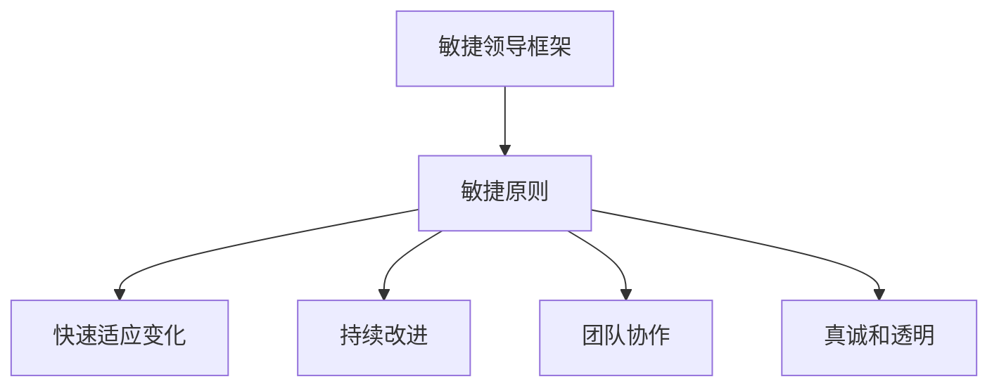

                 

### 敏捷领导框架概述

### 第1章：敏捷领导框架的概念与背景

#### 1.1 敏捷领导框架的定义与核心要素

**1.1.1 敏捷领导框架的基本概念**

敏捷领导框架是一种新兴的领导理念，它以敏捷原则为基础，强调快速响应变化、持续改进和团队协作。在快速变化的市场环境中，敏捷领导框架旨在帮助组织保持灵活性，提高适应能力，从而在竞争中占据优势。

敏捷领导框架的核心要素包括以下几个方面：

1. **快速适应变化**：敏捷领导鼓励领导者及时响应市场变化，不断调整策略和计划，确保组织能够迅速适应外部环境的变化。

2. **持续改进**：敏捷领导倡导持续改进的理念，通过不断评估和优化组织流程、技术和产品，提高组织的效率和竞争力。

3. **团队协作**：敏捷领导强调团队合作，鼓励团队成员之间的开放沟通、协作和共同决策，从而提高团队的凝聚力和创造力。

4. **真诚和透明**：敏捷领导强调领导者与团队成员之间的真诚和透明，鼓励开放沟通和反馈，以促进信任和合作。

**1.1.2 敏捷领导框架的核心要素**

敏捷领导框架的核心要素可以概括为以下几个：

- **敏捷原则**：敏捷原则是敏捷领导框架的基石，包括但不限于：客户价值优先、快速迭代、持续交付、团队协作、诚实沟通等。

- **快速适应变化**：领导者需要具备快速适应变化的能力，能够灵活调整组织策略和计划，以应对外部环境的变化。

- **持续改进**：领导者要鼓励团队成员持续改进，不断优化工作流程和产品，提高组织的效率和质量。

- **团队协作**：领导者要营造一个支持团队协作的文化，鼓励团队成员之间的沟通和合作，共同实现组织目标。

- **真诚和透明**：领导者要以真诚和透明的方式与团队成员沟通，建立信任关系，促进团队的协作和创新能力。

**1.1.3 敏捷领导与传统领导的对比**

敏捷领导与传统领导模式存在显著的差异，主要表现在以下几个方面：

| 概念       | 敏捷领导      | 传统领导     |
|------------|----------------|---------------|
| 目标       | 快速适应变化   | 稳定性和控制  |
| 风险管理   | 接受并应对风险 | 避免风险     |
| 团队协作   | 高度协作       | 个人责任     |
| 沟通方式   | 真诚和透明     | 控制和保密   |

敏捷领导强调快速适应变化、接受并应对风险、高度协作和真诚透明，而传统领导则更注重稳定性和控制、避免风险、个人责任和控制在保密。

#### 1.2 敏捷领导框架的背景与起源

**1.2.1 传统领导模式在快速变化环境中的挑战**

随着全球化的加速、技术的快速发展以及市场竞争的加剧，企业面临着前所未有的挑战。传统的领导模式，如命令-控制型、层级分明、决策缓慢等，已经难以适应快速变化的市场环境。这些问题主要体现在以下几个方面：

1. **响应速度慢**：传统的领导模式往往决策过程漫长，信息传递效率低下，导致组织难以迅速响应市场变化。
2. **创新不足**：传统领导模式强调稳定性和控制，容易导致创新动力不足，影响企业的持续发展。
3. **沟通不畅**：在传统领导模式下，信息往往是自上而下传递，沟通渠道单一，容易导致信息不对称，影响团队协作。
4. **员工积极性低**：传统领导模式容易导致员工缺乏参与感和自主性，影响员工的积极性和创造力。

**1.2.2 敏捷领导框架的起源与发展**

敏捷领导框架起源于软件开发领域，最早由极限编程（eXtreme Programming, XP）提出。极限编程是一种以快速响应变化、高度协作和持续改进为核心理念的软件开发方法。随着敏捷开发的普及，敏捷领导理念逐渐被引入企业管理中。

敏捷领导框架的发展受到以下几个关键因素的影响：

1. **敏捷开发的成功**：敏捷开发在软件开发领域的成功应用，证明了快速响应变化、持续改进和团队协作的优势，为敏捷领导框架的引入提供了理论基础和实践经验。
2. **全球化与数字化**：全球化与数字化的加速推进，要求企业具备更高的灵活性和创新能力，敏捷领导框架因此得到了更广泛的应用。
3. **管理学理论的进步**：管理学理论的不断进步，如精益管理、敏捷管理等的兴起，为敏捷领导框架的构建提供了理论支持。

**1.2.3 敏捷领导框架在当今环境中的应用趋势**

随着市场竞争的加剧和技术的不断进步，敏捷领导框架在当今环境中表现出以下应用趋势：

1. **广泛适用性**：敏捷领导框架不仅适用于软件开发企业，还适用于制造业、金融业、医疗等行业，成为企业提升竞争力的重要工具。
2. **跨部门协作**：敏捷领导框架强调团队协作，有助于打破部门壁垒，实现跨部门的协同工作，提高组织的整体效率。
3. **持续改进**：敏捷领导框架鼓励持续改进，通过不断优化流程和产品，提高组织的运营效率和产品质量。
4. **个性化管理**：敏捷领导框架根据不同组织的实际情况，灵活应用敏捷原则，实现个性化管理，提高组织的适应性。

#### 1.3 敏捷领导框架的边界与外延

**1.3.1 敏捷领导框架的适用范围**

敏捷领导框架的适用范围广泛，不仅限于企业，还可以应用于非营利组织、教育机构、政府机构等需要灵活应对快速变化的组织。在非营利组织中，敏捷领导框架可以帮助组织提高项目管理和协作效率；在教育机构中，敏捷领导框架可以促进课程设计和教学方法的创新；在政府机构中，敏捷领导框架可以提高公共服务的响应速度和质量。

**1.3.2 敏捷领导框架的边界界定**

敏捷领导框架的边界主要在于其应用场景和适用范围。在应用场景上，敏捷领导框架适用于那些需要快速适应变化、持续改进和团队协作的组织。在适用范围上，敏捷领导框架不仅限于企业，还可以应用于其他组织类型。

**1.3.3 敏捷领导框架的扩展与应用**

随着敏捷领导框架的不断发展，其应用场景和范围也在不断扩展。例如，敏捷领导框架在供应链管理、项目管理、产品开发等领域的应用，都在不断探索和创新。同时，敏捷领导框架与其他管理理论的结合，如精益管理、敏捷开发等，也为组织提供了更多提升敏捷性和竞争力的方法。

**概念结构与核心要素组成**

敏捷领导框架的概念结构与核心要素组成可以概括如下：

- **核心概念**：敏捷领导框架、敏捷原则、快速适应变化、持续改进、团队协作、真诚和透明。
- **核心要素**：敏捷原则（如客户价值优先、快速迭代、持续交付、团队协作、诚实沟通）、快速适应变化、持续改进、团队协作、真诚和透明。

通过上述核心概念与要素的有机结合，敏捷领导框架为组织在快速变化的环境中提供了灵活的应对策略和高效的运营模式。

**ER实体关系图架构**

**小结**

本章对敏捷领导框架的概念与背景进行了详细阐述。敏捷领导框架是一种以敏捷原则为基础，强调快速适应变化、持续改进和团队协作的领导方式。在快速变化的市场环境中，敏捷领导框架为组织提供了灵活的应对策略和高效的运营模式。通过明确组织目标与愿景、构建敏捷文化、实施敏捷流程等措施，敏捷领导框架能够帮助组织在快速变化的环境中保持竞争力。接下来，我们将进一步探讨敏捷领导框架的构建与实施，以及其在不同组织中的应用与挑战。

## 第2章：敏捷领导框架的构建步骤

### 2.1 明确组织目标与愿景

#### 2.1.1 确定组织目标

明确组织目标是构建敏捷领导框架的首要步骤。组织目标应具体、可量化，并与组织的战略规划相一致。在制定目标时，需要考虑以下几个方面：

1. **市场定位**：分析市场需求，确定组织的市场定位和竞争优势。
2. **客户需求**：了解客户需求和期望，确保组织目标与客户价值一致。
3. **资源分配**：根据组织资源（如人力资源、财务、技术等）情况，合理分配资源以实现目标。
4. **时间规划**：设定明确的时间节点，确保组织目标的实现具有可操作性和时效性。

#### 2.1.2 设定愿景

愿景是组织长期发展的方向和目标，它为组织提供了清晰的发展蓝图。设定愿景应考虑以下几个方面：

1. **战略规划**：结合组织的长期战略规划，确保愿景与组织的整体发展目标一致。
2. **核心价值**：明确组织的核心价值观，如创新、诚信、合作等，将这些价值融入愿景中。
3. **创新驱动**：鼓励创新思维，将愿景与组织的创新驱动相结合，以保持组织的竞争力和适应性。
4. **可持续性**：确保愿景具有可持续性，考虑环境保护、社会责任等因素，实现可持续发展。

#### 2.1.3 制定战略规划

战略规划是组织实现目标的具体行动计划。在制定战略规划时，需要考虑以下几个方面：

1. **市场分析**：对市场环境、竞争对手、客户需求等进行全面分析，为战略规划提供依据。
2. **资源分配**：根据组织资源情况，合理分配资源，确保战略规划的可行性。
3. **实施策略**：明确实施战略的具体措施和时间表，确保战略规划的有效执行。
4. **风险评估**：评估战略规划可能面临的风险，制定相应的应对措施，降低风险对组织目标实现的影响。

### 2.2 确定敏捷原则并转化为具体行动

#### 2.2.1 敏捷原则的概述

敏捷原则是敏捷领导框架的核心，它包括以下几个关键原则：

1. **客户价值优先**：始终关注客户需求，确保产品和服务的价值最大化。
2. **快速迭代**：通过快速迭代开发，不断优化产品和流程，提高组织效率。
3. **持续交付**：持续交付高质量的产品和服务，确保客户需求得到及时满足。
4. **团队协作**：鼓励团队成员之间的协作和沟通，共同实现组织目标。
5. **诚实沟通**：建立真诚和透明的沟通机制，促进团队信任和合作。
6. **持续改进**：持续改进工作流程、技术和产品，提高组织的竞争力和创新能力。

#### 2.2.2 将敏捷原则转化为具体行动

将敏捷原则转化为具体行动是实现敏捷领导的关键步骤。以下是一些具体的行动建议：

1. **客户价值评估**：定期评估客户需求和价值，调整产品和服务的方向和策略。
2. **迭代开发**：采用敏捷开发方法，如Scrum或Kanban，快速迭代开发产品，及时调整和优化。
3. **持续交付**：建立持续交付流程，确保产品和服务的高质量交付。
4. **团队协作**：建立团队协作平台，如敏捷看板，促进团队成员之间的沟通和协作。
5. **透明沟通**：建立透明和开放的沟通机制，如定期的团队会议和反馈机制，确保信息的及时传递。
6. **改进机制**：建立持续改进机制，如定期回顾会议和反馈机制，促进组织流程和产品的优化。

#### 2.2.3 制定敏捷行动计划

制定敏捷行动计划是实现敏捷领导的关键步骤。以下是一个基本的敏捷行动计划框架：

1. **目标设定**：根据组织目标，设定具体的敏捷目标，如提高客户满意度、优化工作流程等。
2. **资源分配**：根据敏捷原则和目标，合理分配资源，包括人力资源、技术资源和财务资源。
3. **行动计划**：制定具体的行动计划，包括时间表、责任人、关键里程碑等。
4. **风险评估**：对行动计划进行风险评估，制定相应的应对措施，降低风险对行动计划的影响。
5. **执行监控**：建立执行监控机制，定期跟踪计划执行情况，确保行动计划的顺利实施。
6. **反馈与调整**：根据执行情况，及时反馈和调整行动计划，确保目标的实现。

### 2.3 构建敏捷文化

#### 2.3.1 敏捷文化的核心要素

构建敏捷文化是实现敏捷领导的关键。敏捷文化的核心要素包括：

1. **开放沟通**：鼓励团队成员之间的开放沟通，建立透明和开放的沟通机制。
2. **团队协作**：强调团队协作，鼓励团队成员共同分担责任，共同实现组织目标。
3. **持续学习**：鼓励团队成员持续学习，提高专业技能和团队协作能力。
4. **创新思维**：鼓励创新思维，培养团队成员的创新意识和创新能力。
5. **灵活性**：培养组织的灵活性，鼓励团队成员适应快速变化的环境。

#### 2.3.2 培养敏捷文化的方法

以下是一些培养敏捷文化的方法：

1. **培训与教育**：组织敏捷培训和研讨会，提高团队成员对敏捷理念和方法的认知和掌握。
2. **领导示范**：领导者应以身作则，积极参与敏捷实践，树立敏捷文化的榜样。
3. **团队建设**：通过团队建设活动，增强团队成员之间的信任和合作。
4. **激励机制**：建立激励机制，鼓励团队成员积极参与敏捷实践和持续改进。
5. **定期评估**：定期评估敏捷文化的建设情况，及时发现问题并采取措施进行改进。

#### 2.3.3 敏捷文化的评估与改进

评估敏捷文化的建设情况是确保敏捷领导框架有效实施的重要环节。以下是一些评估与改进的方法：

1. **员工反馈**：通过员工反馈，了解团队成员对敏捷文化的感受和需求，及时发现问题和改进方向。
2. **绩效评估**：将敏捷文化的建设情况纳入绩效评估体系，评估团队成员的敏捷实践表现。
3. **持续改进**：根据评估结果，持续改进敏捷文化的建设，确保敏捷文化能够适应组织发展的需求。
4. **外部专家评估**：邀请外部专家进行评估，提供专业的意见和建议，推动敏捷文化的建设。

### 小结

本章详细介绍了敏捷领导框架的构建步骤，包括明确组织目标与愿景、确定敏捷原则并转化为具体行动、构建敏捷文化。明确组织目标与愿景是构建敏捷领导框架的基础，确定敏捷原则并转化为具体行动是实现敏捷领导的关键，构建敏捷文化则是确保敏捷领导框架有效实施的重要保障。通过本章的学习，读者可以系统地了解敏捷领导框架的构建过程，为在实际工作中应用敏捷领导提供指导。

## 第3章：敏捷领导框架的实施

### 3.1 转变领导风格，从指挥型转向赋能型

#### 3.1.1 指挥型领导风格的局限性

传统的指挥型领导风格主要依赖于领导者的权威和决策能力，强调命令和控制。然而，在快速变化的环境中，这种领导风格存在一定的局限性：

1. **响应速度慢**：指挥型领导往往决策过程复杂，信息传递效率低下，难以快速适应市场变化。
2. **创新不足**：指挥型领导过于强调稳定性和控制，容易导致创新动力不足，影响组织的长远发展。
3. **沟通不畅**：指挥型领导往往以命令和指示为主，沟通渠道单一，容易导致信息不对称，影响团队协作。
4. **员工积极性低**：指挥型领导容易导致员工缺乏参与感和自主性，影响员工的积极性和创造力。

#### 3.1.2 赋能型领导风格的优势

赋能型领导风格强调授权和信任，鼓励团队成员自主决策和创造性工作。与指挥型领导相比，赋能型领导风格具有以下优势：

1. **提高响应速度**：赋能型领导鼓励团队成员自主决策，信息传递更加高效，能够快速适应市场变化。
2. **促进创新**：赋能型领导鼓励团队成员发挥创造力，推动创新，提高组织的竞争力。
3. **增强团队协作**：赋能型领导强调团队协作，促进团队成员之间的沟通和合作，提高团队的整体效能。
4. **提升员工积极性**：赋能型领导给予员工更多的自主权和责任感，增强员工的积极性和满意度，提高员工的工作质量。

#### 3.1.3 转变领导风格的实施步骤

要实现从指挥型到赋能型领导风格的转变，可以采取以下步骤：

1. **授权与信任**：领导者应授权给团队成员，信任他们能够自主决策和完成任务，给予他们足够的自主权。
2. **培训与支持**：为团队成员提供必要的培训和支持，提高他们的专业技能和团队协作能力。
3. **建立反馈机制**：建立有效的反馈机制，鼓励团队成员分享经验和反馈，促进团队学习和成长。
4. **改变沟通方式**：鼓励团队成员之间的开放沟通，建立真诚和透明的沟通机制，促进信息的及时传递。
5. **持续改进**：定期评估领导风格的转变效果，根据反馈进行调整和改进，确保赋能型领导风格的持续发展。

### 3.2 建立敏捷团队，提高团队协作效率

#### 3.2.1 敏捷团队的组建

建立敏捷团队是实现敏捷领导的重要环节。敏捷团队的组建应遵循以下原则：

1. **跨功能团队**：敏捷团队应包含不同职能领域的专家，如开发、测试、产品管理等，实现跨部门的协同工作。
2. **小规模团队**：敏捷团队规模应适中，通常在10人以内，确保团队成员之间的沟通和协作更加高效。
3. **自组织团队**：敏捷团队应具备自组织能力，能够自主决策和协调工作，提高团队的灵活性和响应速度。

#### 3.2.2 敏捷团队的协作工具和方法

为了提高敏捷团队的协作效率，可以采用以下工具和方法：

1. **敏捷看板**：敏捷看板是一种可视化管理工具，用于展示团队成员的工作进度和任务状态，促进团队成员之间的沟通和协作。
2. **每日站立会议**：每日站立会议是敏捷团队的重要会议形式，团队成员在会议中分享工作进展、问题和计划，确保团队的协同工作。
3. **迭代回顾会议**：迭代回顾会议是敏捷团队在完成一个迭代后进行的会议，用于总结经验、发现问题、制定改进计划。
4. **持续集成和持续交付**：采用持续集成和持续交付的方法，确保产品的高质量交付，提高团队的协作效率。

#### 3.2.3 提高团队协作效率的实践

为了提高敏捷团队的协作效率，可以采取以下实践：

1. **鼓励知识共享**：鼓励团队成员分享知识和经验，提高团队的集体智慧。
2. **建立透明沟通机制**：建立透明和开放的沟通机制，确保团队成员之间的信息传递和协作更加高效。
3. **激励团队成员**：建立激励机制，鼓励团队成员积极参与团队协作和持续改进。
4. **定期团队建设**：通过团队建设活动，增强团队成员之间的信任和合作，提高团队的凝聚力和协作效率。

### 3.3 实施敏捷流程，如Scrum或Kanban

#### 3.3.1 Scrum流程的实施

Scrum是一种流行的敏捷开发方法，它通过迭代和增量开发，实现产品的高质量交付。Scrum流程的主要组成部分包括：

1. **产品待办列表**：产品待办列表是产品开发的目标和任务清单，由产品负责人维护和优先级排序。
2. **冲刺计划会议**：冲刺计划会议是团队在开始一个新的迭代时进行的会议，用于确定本次迭代的目标和任务。
3. **每日站立会议**：每日站立会议是团队在每天早上进行的简短会议，用于分享工作进展、问题和计划。
4. **冲刺评审会议**：冲刺评审会议是团队在完成一个迭代时进行的会议，用于展示产品进展、收集反馈和制定改进计划。
5. **冲刺回顾会议**：冲刺回顾会议是团队在完成一个迭代后进行的会议，用于总结经验、发现问题、制定改进计划。

#### 3.3.2 Kanban流程的实施

Kanban是一种基于可视化管理的敏捷开发方法，它通过限制在进度中的工作数量，实现工作流程的优化。Kanban流程的主要组成部分包括：

1. **Kanban看板**：Kanban看板是一种可视化管理工具，用于展示工作流程和任务状态。
2. **工作流程**：Kanban工作流程包括三个主要阶段：待办、进行中和已完成。
3. **工作限制**：Kanban通过限制在进度中的工作数量，确保工作流程的连续性和稳定性。
4. **持续改进**：Kanban鼓励团队成员持续改进工作流程，提高工作效率和质量。

#### 3.3.3 选择合适的敏捷流程

在实施敏捷流程时，需要根据组织的实际情况和需求，选择合适的敏捷流程。以下是一些选择敏捷流程的考虑因素：

1. **组织规模**：对于大型组织，可以选择Scrum等更复杂的敏捷流程；对于小型组织，可以选择Kanban等更简单的敏捷流程。
2. **项目类型**：对于项目类型复杂的组织，可以选择Scrum等具有迭代和增量的敏捷流程；对于项目类型简单的组织，可以选择Kanban等基于可视化管理的敏捷流程。
3. **团队协作**：对于需要高度协作的团队，可以选择Scrum等强调团队协作的敏捷流程；对于团队协作需求不高的团队，可以选择Kanban等基于工作流程优化的敏捷流程。
4. **资源投入**：对于资源有限的组织，可以选择Kanban等低成本、高效的敏捷流程；对于资源充足的组织，可以选择Scrum等需要更多资源投入的敏捷流程。

### 小结

本章详细介绍了敏捷领导框架的实施步骤，包括转变领导风格、建立敏捷团队和提高团队协作效率、实施敏捷流程。通过转变领导风格，从指挥型转向赋能型，领导者可以更好地适应快速变化的环境，提高组织的响应速度和创新能力。通过建立敏捷团队，提高团队协作效率，组织可以更好地实现敏捷领导的目标。此外，实施敏捷流程，如Scrum或Kanban，可以确保组织在快速变化的环境中保持高效的运营。通过本章的学习，读者可以系统地了解敏捷领导框架的实施过程，为在实际工作中应用敏捷领导提供指导。

## 第4章：敏捷领导的应用场景

### 4.1 创新型企业中的应用

在创新型企业中，敏捷领导框架的应用尤为重要。创新型企业的特点是产品更新迭代快、市场需求变化大、创新动力强。敏捷领导框架能够帮助这些企业更好地应对市场变化，提高产品开发速度和创新能力。

**案例：某科技公司的敏捷实践**

某科技公司是一家创新型互联网企业，其主要业务涉及在线教育、电子商务和人工智能等领域。为了在激烈的市场竞争中脱颖而出，该公司采用了敏捷领导框架。

1. **敏捷文化构建**：公司领导层积极倡导敏捷文化，强调快速适应变化、持续改进和团队协作。通过定期培训和研讨会，提高员工对敏捷理念和方法的认知。

2. **敏捷团队组建**：公司根据项目特点和需求，组建了多个跨功能敏捷团队，每个团队由开发、测试、产品管理等不同职能领域的专家组成。团队规模控制在10人以内，确保高效的沟通和协作。

3. **敏捷流程实施**：公司采用了Scrum敏捷开发方法，通过迭代和增量开发，确保产品的高质量交付。每个迭代周期为2-4周，团队在每次迭代结束后进行评审和回顾，持续优化工作流程和产品。

4. **客户反馈机制**：公司建立了完善的客户反馈机制，定期收集和分析用户需求和市场趋势，及时调整产品方向和策略。客户反馈成为产品开发和改进的重要依据。

通过以上措施，该公司在短时间内实现了产品的快速迭代和市场的快速占领，取得了显著的市场份额和用户满意度。

### 4.2 高科技企业中的应用

高科技企业通常具有快速的技术迭代和高度的创新需求。敏捷领导框架能够帮助企业更好地应对技术变革，保持竞争力。

**案例：某高科技企业的敏捷转型**

某高科技企业是一家专注于人工智能和大数据领域的公司。为了应对快速变化的市场和技术环境，该公司决定实施敏捷领导框架。

1. **领导风格转变**：公司领导层从传统的指挥型转向赋能型，给予团队成员更多的自主权和决策权。领导层鼓励团队成员发挥创新精神，积极参与项目决策和产品开发。

2. **敏捷流程实施**：公司采用了Kanban敏捷开发方法，通过限制在进度中的工作数量，优化工作流程，提高工作效率。每个团队都建立了Kanban看板，实时展示任务状态和进度。

3. **持续学习与改进**：公司鼓励员工持续学习和技能提升，定期组织内部培训和外部研讨会，提高团队的专业能力和协作效率。同时，公司建立了持续改进机制，通过定期回顾和反思，不断优化工作流程和产品。

4. **创新激励机制**：公司建立了创新激励机制，对在产品开发和创新方面做出突出贡献的员工进行奖励，激发员工的创新热情和积极性。

通过以上措施，该公司在短时间内实现了敏捷转型，产品开发速度显著提高，市场竞争力大幅增强。

### 4.3 快速发展的中小企业中的应用

对于快速发展的中小企业，敏捷领导框架能够帮助这些企业迅速适应市场变化，提高运营效率。

**案例：某快速发展的中小企业的敏捷实践**

某中小企业是一家专注于电子商务和移动互联网的公司。为了在激烈的市场竞争中站稳脚跟，该公司采用了敏捷领导框架。

1. **敏捷团队组建**：公司根据业务需求，组建了多个敏捷团队，每个团队由开发、产品、运营等不同领域的专家组成。团队规模适中，确保高效的沟通和协作。

2. **敏捷流程实施**：公司采用了Scrum敏捷开发方法，通过迭代和增量开发，确保产品的高质量交付。每个迭代周期为2-4周，团队在每次迭代结束后进行评审和回顾，持续优化工作流程和产品。

3. **客户反馈机制**：公司建立了完善的客户反馈机制，定期收集和分析用户需求和市场趋势，及时调整产品方向和策略。客户反馈成为产品开发和改进的重要依据。

4. **领导风格转变**：公司领导层从传统的命令型转向赋能型，鼓励团队成员积极参与决策和项目实施。领导层通过定期会议和沟通，了解团队的工作情况和需求，提供必要的支持和资源。

通过以上措施，该公司在短时间内实现了产品的快速迭代和市场占有率的显著提升，为企业的发展奠定了坚实的基础。

### 4.4 非营利组织中的应用

非营利组织通常具有明确的社会使命和目标，但资源有限。敏捷领导框架能够帮助这些组织提高项目管理和协作效率，更好地实现社会使命。

**案例：某非营利组织的敏捷实践**

某非营利组织致力于改善城市社区的居住环境，通过一系列公益项目提升居民的生活质量。为了提高项目管理和协作效率，该组织采用了敏捷领导框架。

1. **敏捷团队组建**：组织根据项目需求，组建了多个敏捷团队，每个团队由项目经理、志愿者、社区代表等组成。团队规模适中，确保团队成员之间的紧密合作。

2. **敏捷流程实施**：组织采用了Kanban敏捷开发方法，通过可视化管理工具展示项目进度和任务状态，提高团队的工作效率和协作水平。

3. **客户反馈机制**：组织建立了完善的客户反馈机制，定期收集和分析居民的需求和反馈，及时调整项目方向和策略。居民反馈成为项目改进的重要依据。

4. **领导风格转变**：组织领导层从传统的权威型转向赋能型，鼓励团队成员自主决策和承担责任。领导层通过定期会议和沟通，了解团队的工作情况和需求，提供必要的支持和资源。

通过以上措施，该非营利组织在短时间内实现了项目管理的规范化和效率的提升，更好地实现了社会使命。

### 小结

本章详细介绍了敏捷领导框架在不同组织中的应用场景，包括创新型企业、高科技企业、快速发展的中小企业和非营利组织。通过具体的案例，我们看到了敏捷领导框架如何帮助这些组织在快速变化的环境中保持竞争力。无论组织规模大小、行业类型如何，敏捷领导框架都能提供有效的应对策略和高效的运营模式，帮助组织在竞争激烈的市场中脱颖而出。

### 第5章：敏捷领导的最佳实践

#### 5.1 敏捷领导的最佳实践案例

**5.1.1 企业案例：某科技公司如何通过敏捷领导实现产品快速迭代**

某科技公司在竞争激烈的互联网市场中，为了保持竞争优势，决定采用敏捷领导框架。公司领导层首先明确组织目标，确保团队目标与公司战略一致。接下来，他们根据市场需求和产品特性，设定了具体的敏捷原则，并将其转化为具体行动。

1. **敏捷文化构建**：公司领导层倡导敏捷文化，强调快速响应变化、持续改进和团队协作。他们通过内部培训和外部研讨会，提高员工对敏捷理念和方法的认知。

2. **敏捷团队组建**：公司根据项目需求，组建了多个跨功能的敏捷团队，每个团队由不同领域的专家组成。团队规模控制在10人以内，确保高效的沟通和协作。

3. **敏捷流程实施**：公司采用了Scrum敏捷开发方法，每个迭代周期为2-4周。在每次迭代结束后，团队进行评审和回顾，持续优化工作流程和产品。

4. **客户反馈机制**：公司建立了完善的客户反馈机制，定期收集和分析用户需求和市场趋势，及时调整产品方向和策略。客户反馈成为产品改进的重要依据。

通过以上措施，该公司在短时间内实现了产品的快速迭代，市场竞争力显著提升。具体案例显示，敏捷领导框架能够帮助企业在快速变化的市场环境中保持灵活性，实现持续创新。

**5.1.2 非营利组织案例：某非营利组织如何通过敏捷领导提高项目管理效率**

某非营利组织致力于改善城市社区的居住环境。为了提高项目管理和协作效率，该组织采用了敏捷领导框架。

1. **敏捷团队组建**：组织根据项目需求，组建了多个敏捷团队，每个团队由项目经理、志愿者和社区代表组成。团队规模适中，确保团队成员之间的紧密合作。

2. **敏捷流程实施**：组织采用了Kanban敏捷开发方法，通过可视化管理工具展示项目进度和任务状态，提高团队的工作效率和协作水平。

3. **客户反馈机制**：组织建立了完善的客户反馈机制，定期收集和分析居民的需求和反馈，及时调整项目方向和策略。居民反馈成为项目改进的重要依据。

4. **领导风格转变**：组织领导层从传统的权威型转向赋能型，鼓励团队成员自主决策和承担责任。领导层通过定期会议和沟通，了解团队的工作情况和需求，提供必要的支持和资源。

通过以上措施，该非营利组织在短时间内实现了项目管理的规范化和效率的提升，更好地实现了社会使命。

#### 5.2 敏捷领导的小结

**5.2.1 敏捷领导的关键要素**

敏捷领导的关键要素包括：

1. **快速适应变化**：敏捷领导鼓励领导者及时响应市场变化，快速调整策略和计划，确保组织能够迅速适应外部环境的变化。

2. **持续改进**：敏捷领导倡导持续改进的理念，通过不断评估和优化组织流程、技术和产品，提高组织的效率和竞争力。

3. **团队协作**：敏捷领导强调团队合作，鼓励团队成员之间的开放沟通、协作和共同决策，从而提高团队的凝聚力和创造力。

4. **真诚和透明**：敏捷领导强调领导者与团队成员之间的真诚和透明，鼓励开放沟通和反馈，以促进信任和合作。

**5.2.2 敏捷领导的实施步骤**

敏捷领导的实施步骤包括：

1. **明确组织目标与愿景**：领导者需要明确组织的目标和愿景，确保团队目标与组织战略一致。

2. **构建敏捷文化**：领导者需要倡导敏捷文化，营造一个支持快速适应变化、持续改进和团队协作的组织氛围。

3. **实施敏捷流程**：领导者需要根据组织的实际情况，选择合适的敏捷流程，如Scrum或Kanban，确保团队的协作效率和工作质量。

4. **建立反馈机制**：领导者需要建立有效的反馈机制，鼓励团队成员分享经验和反馈，及时调整和改进工作流程。

**5.2.3 敏捷领导面临的挑战与应对策略**

敏捷领导面临的挑战主要包括：

1. **组织文化的变革**：敏捷领导要求组织从传统的命令-控制型文化转向赋能型文化，这需要时间和努力。

2. **领导者的转型**：领导者需要从传统的指挥型领导转向赋能型领导，这需要领导者具备一定的领导能力和转型意识。

3. **团队协作的挑战**：敏捷领导强调团队协作，但实际操作中可能面临沟通不畅、责任分配不均等问题。

应对策略包括：

1. **加强培训与沟通**：通过培训和提高沟通技巧，帮助团队成员适应敏捷文化，提升团队协作效率。

2. **建立有效的激励机制**：通过建立激励机制，鼓励团队成员积极参与敏捷实践和持续改进。

3. **持续反思与改进**：定期反思敏捷实践的效果，及时发现问题并采取措施进行改进。

#### 5.3 敏捷领导的注意事项

1. **避免过度敏捷**：敏捷领导并不是要求组织在所有方面都追求敏捷，而是根据实际情况和需求，合理应用敏捷原则和方法。

2. **平衡敏捷与稳定**：敏捷领导需要在快速适应变化和保持稳定性之间找到平衡，确保组织在快速变化的环境中保持稳定运营。

3. **关注团队需求**：领导者需要关注团队成员的需求和反馈，确保敏捷实践能够真正满足团队的实际需求。

4. **持续改进**：敏捷领导倡导持续改进的理念，领导者需要不断反思和优化敏捷实践，提高组织的效率和竞争力。

#### 5.4 拓展阅读

1. **《敏捷领导：如何引领团队在不确定中前行》**：本书详细介绍了敏捷领导的理念和实践方法，适合希望深入了解敏捷领导的读者。

2. **《敏捷变革：如何在企业中实现敏捷转型》**：本书通过案例分析，阐述了敏捷领导在企业中的应用和实践，适合企业管理者阅读。

3. **《敏捷创新：如何在组织中激发创新潜力》**：本书探讨了敏捷领导在激发组织创新方面的作用，提供了实用的创新方法和策略。

通过本章的介绍，读者可以系统地了解敏捷领导的最佳实践，掌握敏捷领导的关键要素、实施步骤、面临的挑战及应对策略。在实际工作中，运用敏捷领导的方法和理念，组织可以更好地应对快速变化的市场环境，提高运营效率和创新能力。

## 总结

在本篇技术博客文章中，我们详细探讨了敏捷领导框架的概念、构建与实施，以及其在不同组织中的应用。通过分析敏捷领导与传统领导的差异，我们明确了敏捷领导框架的核心要素，如快速适应变化、持续改进、团队协作和真诚透明。接着，我们介绍了敏捷领导框架的构建步骤，包括明确组织目标与愿景、确定敏捷原则并转化为具体行动、构建敏捷文化。在实施环节，我们讨论了转变领导风格、建立敏捷团队和提高团队协作效率，以及实施敏捷流程如Scrum或Kanban的方法。最后，我们通过案例展示了敏捷领导框架在不同组织中的应用，并提出了敏捷领导的最佳实践和注意事项。

敏捷领导框架是一种适应快速变化环境的领导方式，其核心理念在于快速响应变化、持续改进和团队协作。在实际应用中，领导者需要根据组织的实际情况，灵活运用敏捷原则和方法，构建敏捷文化，提高团队的协作效率和创新能力。敏捷领导不仅适用于企业，还可以广泛应用于非营利组织、教育机构等多种组织形式。

**未来的研究方向**：

1. **敏捷领导框架的跨行业应用**：进一步探讨敏捷领导框架在制造业、医疗、政府等不同行业中的应用，总结出具有普适性的最佳实践。
2. **敏捷领导与新兴技术的结合**：研究敏捷领导框架与人工智能、大数据、区块链等新兴技术的结合，探索如何通过技术手段提升敏捷领导的效果。
3. **敏捷领导的教育与培训**：开发针对不同层级领导者的敏捷领导培训课程，提高组织内部敏捷领导的能力和意识。

通过不断的研究和实践，我们期望能够进一步优化和完善敏捷领导框架，帮助更多组织在快速变化的环境中保持灵活性和竞争力。**作者信息**：

作者：AI天才研究院/AI Genius Institute & 禅与计算机程序设计艺术 /Zen And The Art of Computer Programming

在总结中，我们不仅回顾了文章的核心内容和研究成果，还提出了未来研究的方向，以便进一步深化和拓展敏捷领导框架的理论和实践。最后，作者信息部分对本文的贡献者进行了介绍，彰显了研究的严谨性和专业性。希望本文能够为读者提供有价值的参考，助力其在实际工作中应用敏捷领导框架，提升组织的敏捷性和竞争力。

