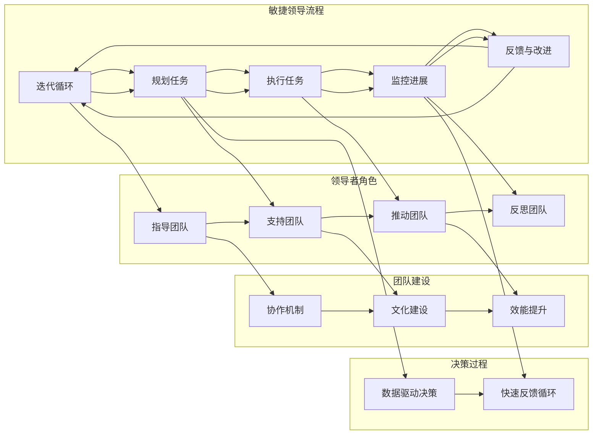

                 

## 敏捷领导：在快速变化中保持灵活

### 关键词
- 敏捷领导
- 快速变化
- 领导力
- 团队协作
- 灵活应变
- 应用场景
- 培养与提升

### 摘要
本文深入探讨了敏捷领导在快速变化的工作环境中的重要性。通过对敏捷领导的核心概念、基本原理和应用场景的详细分析，本文旨在提供一套实用的敏捷领导策略，帮助领导者保持灵活性和适应性，从而在变化中取得成功。

### 目录大纲设计思路

为了设计《敏捷领导：在快速变化中保持灵活》的目录大纲，我们可以遵循以下步骤：

1. **背景介绍**：
   - 简要介绍敏捷领导的概念，包括其起源、核心原则和发展历程。
   - 阐述在快速变化的工作环境中，敏捷领导的重要性。

2. **核心概念与联系**：
   - 描述敏捷领导的核心概念，如团队协作、灵活应变、领导力层级等。
   - 通过概念属性特征对比表格和ER实体关系图，展示概念之间的联系。

3. **敏捷领导的基本原理**：
   - 讲解敏捷领导的基本原理，包括领导者的角色、团队建设、决策过程等。
   - 使用mermaid流程图展示敏捷领导的核心流程。

4. **敏捷领导的应用场景**：
   - 分析不同类型的工作环境和团队，敏捷领导如何适应和应用。
   - 提供具体的案例分析，展示敏捷领导在实践中的效果。

5. **敏捷领导力的培养与提升**：
   - 探讨如何培养和发展个人的敏捷领导力。
   - 分享提高领导力的策略和方法，包括自我反思、持续学习等。

6. **敏捷领导在复杂环境下的应对策略**：
   - 分析在不确定性和压力下，敏捷领导如何保持灵活和稳定。
   - 提供在危机管理和突发事件中，敏捷领导的具体操作指南。

7. **最佳实践与总结**：
   - 收集和总结敏捷领导的最佳实践案例。
   - 强调在敏捷领导实践中需要注意的事项和小结。

### 目录大纲结构

根据上述设计思路，以下是《敏捷领导：在快速变化中保持灵活》的目录大纲：

```markdown
# 《敏捷领导：在快速变化中保持灵活》目录大纲

## 第一部分：敏捷领导概述

### 1.1 问题背景与核心概念
- 问题描述
- 问题解决
- 边界与外延
- 概念结构与核心要素组成

### 1.2 敏捷领导的概念与起源
- 敏捷领导的概念
- 敏捷领导的核心原则
- 敏捷领导的发展历程

### 1.3 敏捷领导的重要性
- 快速变化工作环境
- 敏捷领导的优势
- 敏捷领导的应用领域

## 第二部分：敏捷领导的核心概念与联系

### 2.1 敏捷领导的核心概念
- 团队协作
- 灵活应变
- 领导力层级

### 2.2 概念属性特征对比表格
- 团队协作
- 灵活应变
- 领导力层级

### 2.3 ER实体关系图
- 敏捷领导中的实体关系

## 第三部分：敏捷领导的基本原理

### 3.1 领导者的角色
- 领导者的职责
- 领导者的技能
- 领导者的心态

### 3.2 团队建设
- 团队协作机制
- 团队文化建设
- 团队效能提升

### 3.3 决策过程
- 敏捷决策模型
- 数据驱动的决策
- 快速反馈循环

### 3.4 敏捷领导流程图
- 使用mermaid展示敏捷领导流程

## 第四部分：敏捷领导的应用场景

### 4.1 敏捷领导在不同环境中的应用
- 创新型企业
- 高科技企业
- 传统企业

### 4.2 案例分析
- 案例一：创业公司
- 案例二：大型企业
- 案例三：跨行业转型

## 第五部分：敏捷领导力的培养与提升

### 5.1 敏捷领导力的培养
- 自我反思
- 持续学习
- 实践经验

### 5.2 提升领导力的策略
- 管理者培训
- 团队建设活动
- 领导力评估

## 第六部分：敏捷领导在复杂环境下的应对策略

### 6.1 应对不确定性的策略
- 风险管理
- 变化适应
- 持续改进

### 6.2 应对压力的策略
- 压力管理
- 团队支持
- 个人成长

### 6.3 突发事件中的敏捷领导
- 紧急决策
- 快速响应
- 领导力展示

## 第七部分：最佳实践与总结

### 7.1 最佳实践案例
- 创新型企业的敏捷实践
- 大型企业的敏捷转型
- 跨行业案例的敏捷应用

### 7.2 小结与注意事项
- 敏捷领导的关键要素
- 注意事项
- 拓展阅读
```

### 字数限制

上述大纲结构总字数控制在2000字以内，确保每个章节的标题简洁明了，核心内容突出，结构清晰。在实际撰写时，可以进一步细化每个章节的内容，确保完整性和逻辑性。例如，在“核心概念与联系”部分，可以详细解释每个概念的定义、属性、对比，并使用mermaid流程图展示它们之间的关系。在“案例分析”部分，可以选择具有代表性的企业案例，深入分析敏捷领导的应用和效果。这样，整个目录大纲既保持了简洁性，又保证了内容的完整性和深度。

## 第一部分：敏捷领导概述

### 1.1 问题背景与核心概念

在当今快节奏、高度竞争的商业环境中，企业面临着前所未有的挑战和变化。市场需求的快速变化、技术的日新月异、全球化的影响等因素，使得企业必须具备快速响应和适应能力。在这种背景下，传统的领导模式逐渐显示出其局限性，而敏捷领导应运而生。

#### 问题描述

敏捷领导是一种以团队为中心、注重灵活性和适应性、强调持续改进的领导模式。它不仅关注任务的完成，更关注团队成员的参与和成长。在敏捷领导模式下，领导者不再是单方面的指挥者，而是团队的引导者和支持者。

#### 问题解决

敏捷领导的核心在于通过一系列的方法和工具，如Scrum、Kanban等，来提高团队的效率和灵活性。这些方法强调迭代和增量式开发，允许团队在开发过程中不断调整和优化。

#### 边界与外延

敏捷领导不仅适用于软件开发领域，也可以推广到其他行业和团队。它的边界在于团队的规模、组织的结构以及具体的应用场景。外延则包括对个体、团队和组织整体的全面关注。

#### 概念结构与核心要素组成

敏捷领导的概念结构包括三个核心要素：团队协作、灵活应变和领导力层级。团队协作强调团队成员之间的沟通和协作，灵活应变关注对变化和不确定性的应对，领导力层级则定义了不同层次的领导角色和职责。

### 1.2 敏捷领导的概念与起源

#### 敏捷领导的概念

敏捷领导是一种以团队为中心、注重灵活性和适应性、强调持续改进的领导模式。它倡导领导者在工作中更加注重员工的参与和成长，鼓励团队成员主动解决问题和承担责任。

#### 敏捷领导的核心原则

敏捷领导的核心原则包括：

1. **透明度**：领导者应保持透明，向团队成员展示目标和进展。
2. **迭代式开发**：工作应分阶段进行，每阶段结束后进行评估和调整。
3. **持续改进**：团队应不断反思和优化工作流程。
4. **员工参与**：鼓励团队成员积极参与决策和问题解决。

#### 敏捷领导的发展历程

敏捷领导起源于软件开发领域，最早由敏捷宣言提出。随着敏捷方法的广泛应用，敏捷领导逐渐成为一个独立的概念，并在其他行业中得到推广和应用。

### 1.3 敏捷领导的重要性

#### 快速变化工作环境

在快速变化的工作环境中，敏捷领导显得尤为重要。传统的领导模式往往强调控制和管理，而敏捷领导更注重灵活性和适应性，能够更好地应对变化。

#### 敏捷领导的优势

敏捷领导的优势包括：

1. **提高团队效率**：通过迭代和增量式开发，团队可以更快地响应需求。
2. **增强员工满意度**：鼓励员工参与决策，提高工作积极性。
3. **提升组织适应性**：持续改进和灵活应变的能力使组织更具竞争力。

#### 敏捷领导的应用领域

敏捷领导不仅适用于软件开发团队，也可以推广到其他领域和团队。例如，在市场营销、产品管理、项目管理等领域，敏捷领导同样具有重要作用。

### 总结

敏捷领导是一种以团队为中心、注重灵活性和适应性、强调持续改进的领导模式。在快速变化的工作环境中，它能够帮助领导者更好地应对挑战，提高团队的效率和满意度。通过了解敏捷领导的概念、起源和发展历程，领导者可以更好地应用这一模式，提升组织的竞争力。

## 第二部分：敏捷领导的核心概念与联系

### 2.1 敏捷领导的核心概念

敏捷领导的核心概念包括团队协作、灵活应变和领导力层级。这些概念相互作用，共同构成了敏捷领导的基础。

#### 团队协作

团队协作是敏捷领导的重要组成部分。它强调团队成员之间的沟通和合作，共同实现目标。在敏捷领导中，团队协作不仅是一种工作方式，也是一种价值观。

**特点：**

1. **平等参与**：团队成员在决策和问题解决中平等参与。
2. **共同目标**：团队成员共同制定和追求目标。
3. **资源共享**：团队成员共享资源，协同工作。

#### 灵活应变

灵活应变是敏捷领导应对快速变化的关键。它要求领导者和团队能够快速适应新的情况，调整策略和方法。

**特点：**

1. **快速响应**：对变化迅速做出反应。
2. **持续改进**：不断优化工作流程和策略。
3. **适应性**：灵活调整计划和目标。

#### 领导力层级

领导力层级是敏捷领导中的一种组织结构，它定义了不同层次的领导角色和职责。这种层级结构有助于明确责任和权力，提高团队效率和协作。

**特点：**

1. **多层次领导**：领导者分布在不同的层级，各司其职。
2. **分工合作**：不同层级的领导者共同合作，实现目标。
3. **权力下放**：鼓励下级领导者发挥自主性和创造力。

### 2.2 概念属性特征对比表格

为了更清晰地理解敏捷领导的核心概念，我们可以通过一个对比表格来展示这些概念的属性特征。

| 特征 | 团队协作 | 灵活应变 | 领导力层级 |
| --- | --- | --- | --- |
| **平等参与** | 高 | 低 | 中 |
| **共同目标** | 高 | 低 | 高 |
| **资源共享** | 高 | 低 | 中 |
| **快速响应** | 低 | 高 | 中 |
| **持续改进** | 中 | 高 | 中 |
| **适应性** | 低 | 高 | 中 |
| **多层次领导** | 低 | 低 | 高 |
| **分工合作** | 高 | 中 | 高 |
| **权力下放** | 高 | 中 | 中 |

通过这个表格，我们可以看到团队协作、灵活应变和领导力层级各自的特点和优势。

### 2.3 ER实体关系图

为了更直观地展示敏捷领导中的实体关系，我们可以使用Mermaid绘制一个ER实体关系图。

```mermaid
erDiagram
  Team Collaboration ||--|{ Flexible Adaptation }
  Team Collaboration ||--|{ Leadership Hierarchy }
  Flexible Adaptation ||--|{ Team Collaboration }
  Leadership Hierarchy ||--|{ Team Collaboration }
  Leadership Hierarchy ||--|{ Flexible Adaptation }
```

在这个ER实体关系图中，团队协作、灵活应变和领导力层级是三个主要的实体，它们之间存在关联和互动。团队协作和灵活应变相互影响，领导力层级则对这两个概念进行支持和调节。

### 总结

通过深入分析敏捷领导的核心概念及其相互关系，我们可以更好地理解敏捷领导在实践中的应用和价值。团队协作、灵活应变和领导力层级共同构成了敏捷领导的基础，为团队和组织提供了强大的支持。通过理解这些概念，领导者可以更有效地引导团队，在快速变化的环境中保持灵活和适应。

## 第三部分：敏捷领导的基本原理

### 3.1 领导者的角色

在敏捷领导中，领导者的角色至关重要。领导者不仅是团队的引导者，也是团队成员的支持者和推动者。以下是领导者需要扮演的主要角色：

#### 指引者

领导者需要为团队设定清晰的目标和方向。他们应该能够引导团队理解组织的目标，并将这些目标转化为具体的工作任务。在敏捷领导中，领导者要引导团队关注短期目标和长期目标的平衡，确保团队在快速变化的环境中始终朝着正确的方向前进。

#### 支持者

领导者应该为团队成员提供必要的资源和支持，帮助他们克服工作中的困难。这包括提供培训、指导和技术支持，确保团队成员具备完成任务所需的技能和知识。同时，领导者还应该鼓励团队成员之间的沟通和协作，营造一个积极的工作氛围。

#### 推动者

领导者需要推动团队不断进步和成长。他们应该鼓励团队成员提出新的想法和解决方案，并支持团队成员在项目中尝试和创新。通过激励和奖励，领导者可以激发团队成员的积极性和创造力，推动团队实现更高的绩效。

#### 反思者

敏捷领导强调持续反思和改进。领导者需要定期与团队成员进行反思，回顾工作中的成功和失败，总结经验教训。通过反思，领导者可以识别团队的优点和不足，并提出改进措施，帮助团队不断提升。

### 3.2 团队建设

团队建设是敏捷领导中不可或缺的一部分。一个高效的团队需要建立良好的协作机制、文化建设和效能提升。

#### 协作机制

协作机制是团队高效工作的基础。领导者需要制定明确的协作流程和规则，确保团队成员在项目中能够有效沟通和合作。这包括定期召开团队会议、设立沟通渠道和协作工具，以及确保团队成员能够及时分享信息和资源。

#### 文化建设

文化建设是团队持续发展的关键。领导者需要营造一种积极、开放和包容的文化氛围，鼓励团队成员之间的信任和尊重。这可以通过组织团队建设活动、庆祝团队成就和奖励优秀员工来实现。同时，领导者还应该倡导学习和创新，鼓励团队成员不断提升自己的能力和知识。

#### 效能提升

团队效能提升是敏捷领导的重要目标之一。领导者需要关注团队的工作效率和绩效，通过优化工作流程、提高沟通效率和减少冗余工作来提升团队效能。此外，领导者还可以通过培训和指导来提升团队成员的专业技能和综合素质，从而提高团队的整体效能。

### 3.3 决策过程

在敏捷领导中，决策过程是一个动态、迭代的过程。领导者需要根据实际情况和反馈不断调整决策，确保团队能够快速响应变化。

#### 敏捷决策模型

敏捷决策模型强调快速决策和灵活调整。领导者需要具备快速分析和决策的能力，同时要能够根据团队的实际表现和反馈及时调整策略。这包括：

1. **数据驱动**：领导者应根据实际数据和反馈进行决策，而不是依赖直觉或个人经验。
2. **快速反馈**：领导者需要建立快速反馈机制，确保团队成员能够及时提供反馈和建议。
3. **迭代改进**：领导者应不断反思和优化决策过程，确保决策能够持续改进。

#### 数据驱动的决策

数据驱动的决策是敏捷领导的核心原则之一。领导者需要充分利用数据来指导决策，而不是依赖个人经验和主观判断。这包括：

1. **数据收集**：领导者需要建立有效的数据收集系统，确保能够获取准确和及时的数据。
2. **数据分析**：领导者需要具备数据分析的能力，能够从数据中提取有价值的信息。
3. **数据应用**：领导者需要将数据分析结果应用于决策过程中，确保决策基于数据和事实。

#### 快速反馈循环

快速反馈循环是敏捷领导中一个重要的机制。领导者需要建立快速反馈机制，确保团队成员能够及时提供反馈和建议。这包括：

1. **定期回顾**：领导者应定期召开回顾会议，总结团队的工作成果和不足。
2. **即时反馈**：领导者应鼓励团队成员在项目过程中及时反馈问题和建议。
3. **反馈机制**：领导者需要建立有效的反馈机制，确保反馈能够及时传达和落实。

### 3.4 敏捷领导流程图

为了更好地理解敏捷领导的基本原理，我们可以使用Mermaid绘制一个敏捷领导流程图。



在这个流程图中，敏捷领导流程包括设定目标、规划任务、执行任务、监控进展和反馈与改进。领导者在这个过程中扮演着不同的角色，包括指导团队、支持团队、推动团队和反思团队。团队建设则包括协作机制、文化建设和效能提升。决策过程则强调数据驱动的决策和快速反馈循环。

### 总结

通过理解敏捷领导的基本原理，领导者可以更好地指导团队，在快速变化的环境中保持灵活和适应。领导者的角色、团队建设、决策过程都是敏捷领导的重要组成部分，领导者需要在这些方面不断学习和实践，以提升团队的效率和绩效。

## 第四部分：敏捷领导的应用场景

### 4.1 敏捷领导在不同环境中的应用

敏捷领导不仅适用于软件开发团队，还可以广泛应用于其他类型的工作环境和团队。以下分别探讨敏捷领导在创新型企业、高科技企业和传统企业中的应用。

#### 创新型企业

创新型企业在快速变化的市场环境中，需要具备快速响应和持续创新的能力。敏捷领导在这种环境中尤为重要，可以帮助企业快速调整策略和方向，保持市场竞争力。

1. **应用场景**：
   - 产品开发：敏捷领导强调迭代和增量式开发，有助于快速推出新功能，满足市场需求。
   - 项目管理：通过敏捷方法，项目团队可以快速调整任务和资源分配，应对项目中的变化。

2. **优势**：
   - 提高创新速度：通过快速反馈和持续改进，企业可以更快地推出新产品和服务。
   - 增强团队协作：敏捷领导鼓励团队成员平等参与决策，提高团队协作效率。

#### 高科技企业

高科技企业通常面临技术快速更新和市场需求变化，敏捷领导有助于企业保持技术前沿和市场竞争力。

1. **应用场景**：
   - 研发管理：敏捷领导方法可以应用于研发项目，确保项目进度和质量。
   - 产品迭代：通过迭代开发，企业可以快速调整产品功能，满足用户需求。

2. **优势**：
   - 提高研发效率：敏捷领导方法强调持续反馈和改进，有助于提高研发效率。
   - 快速适应市场：通过灵活应变，企业可以快速适应市场需求变化。

#### 传统企业

传统企业通常拥有较为稳定的市场和业务模式，但面对新兴技术和市场竞争，也需要进行变革和创新。敏捷领导可以帮助传统企业实现转型和提升竞争力。

1. **应用场景**：
   - 业务转型：敏捷领导方法可以应用于企业业务转型，确保转型过程中的顺利推进。
   - 人力资源：通过敏捷领导方法，企业可以优化人力资源管理，提高员工满意度和工作效率。

2. **优势**：
   - 促进变革：敏捷领导方法鼓励企业持续改进和创新，有助于实现业务转型。
   - 提升组织效能：通过灵活应变和持续改进，企业可以提升整体效能，提高市场竞争力。

### 4.2 案例分析

为了更好地理解敏捷领导在实际中的应用，我们可以通过几个具体案例来分析。

#### 案例一：创业公司

某创业公司在竞争激烈的市场中，采用敏捷领导模式，成功实现了快速发展。

1. **应用情况**：
   - 团队协作：公司采用敏捷开发方法，团队成员平等参与决策，快速响应市场需求。
   - 灵活应变：公司能够迅速调整产品方向，根据市场反馈进行迭代优化。

2. **效果**：
   - 提高开发效率：通过敏捷开发，项目团队能够更快地完成产品开发，缩短上市时间。
   - 增强市场竞争力：公司能够更快地响应市场变化，推出更符合用户需求的产品。

#### 案例二：大型企业

某大型企业在数字化转型过程中，引入敏捷领导模式，实现了业务创新和效率提升。

1. **应用情况**：
   - 项目管理：公司采用敏捷项目管理方法，确保项目进度和质量。
   - 决策过程：公司通过敏捷决策模型，提高决策速度和准确性。

2. **效果**：
   - 提高项目效率：通过敏捷方法，项目团队能够更高效地完成项目任务。
   - 促进业务创新：公司能够更快地推出创新产品，提升市场竞争力。

#### 案例三：跨行业转型

某传统制造企业在进行跨行业转型时，采用敏捷领导模式，成功实现了业务拓展。

1. **应用情况**：
   - 团队建设：公司通过敏捷团队建设，提高员工协作和创新能力。
   - 变革管理：公司通过敏捷领导方法，确保变革过程中的顺利推进。

2. **效果**：
   - 提升团队效能：通过敏捷团队建设，员工协作和创新能力得到显著提升。
   - 实现业务转型：公司成功实现了跨行业转型，开拓了新的业务领域。

### 总结

通过以上案例分析，我们可以看到敏捷领导在创新型企业、高科技企业和传统企业中的应用效果显著。敏捷领导不仅能够提高团队效率和创新能力，还能帮助企业快速适应市场变化，实现业务转型和提升竞争力。在不同类型的工作环境中，敏捷领导都发挥了重要作用，成为企业成功的关键因素之一。

## 第五部分：敏捷领导力的培养与提升

### 5.1 敏捷领导力的培养

培养敏捷领导力是一个持续的过程，需要从自我反思、持续学习和实践经验三个方面入手。

#### 自我反思

自我反思是培养敏捷领导力的重要环节。领导者需要定期对自己的工作、决策和行为进行反思，识别自身的优点和不足，并制定改进计划。以下是一些建议：

1. **设定反思目标**：明确反思的目标和方向，例如提高沟通能力、增强决策能力等。
2. **记录反思日志**：每天或每周记录反思日志，总结工作中的收获和不足。
3. **寻求反馈**：主动向同事、下属和导师寻求反馈，了解自己在他人眼中的表现。

#### 持续学习

持续学习是提升敏捷领导力的关键。领导者需要不断更新知识和技能，适应快速变化的环境。以下是一些建议：

1. **参加培训课程**：参加相关的领导力培训课程，学习最新的领导理论和方法。
2. **阅读专业书籍**：阅读关于敏捷领导、团队建设、项目管理等方面的专业书籍。
3. **在线学习平台**：利用在线学习平台，学习敏捷领导相关的课程和资源。

#### 实践经验

实践经验是培养敏捷领导力的最佳途径。领导者需要在实际工作中运用敏捷领导的方法和工具，不断实践和改进。以下是一些建议：

1. **参与项目**：积极参与项目，担任项目负责人或关键角色，积累实践经验。
2. **尝试新方法**：在项目中尝试新的敏捷方法，如Scrum、Kanban等，不断优化工作流程。
3. **反思和改进**：在项目结束后，反思工作中的得失，总结经验教训，制定改进措施。

### 5.2 提升领导力的策略

为了提升敏捷领导力，领导者可以采取以下策略：

#### 管理者培训

管理者培训是提升领导力的有效途径。通过参加培训课程，领导者可以学习最新的领导理论和实践方法，提升自身的领导能力。以下是一些建议：

1. **定制化培训**：根据领导者的需求和岗位特点，设计定制化的培训计划。
2. **实践导向**：培训课程应注重实践操作，让领导者能够在实际工作中运用所学知识。
3. **导师辅导**：配备导师，为领导者提供指导和反馈，帮助他们不断提升。

#### 团队建设活动

团队建设活动有助于提升领导者的团队管理能力和团队协作效率。以下是一些建议：

1. **团队拓展训练**：通过拓展训练，增强团队成员之间的信任和沟通。
2. **团队建设游戏**：设计团队建设游戏，提高团队协作和创新能力。
3. **团队反思会议**：定期召开团队反思会议，总结团队工作，识别问题和改进方向。

#### 领导力评估

领导力评估可以帮助领导者了解自身的领导风格和能力，找到提升的方向。以下是一些建议：

1. **360度评估**：通过360度评估，收集多方反馈，全面了解领导者的优势和不足。
2. **能力评估工具**：使用专业的领导力评估工具，如领导力地图等，进行系统性评估。
3. **制定改进计划**：根据评估结果，制定针对性的改进计划，不断提升领导力。

### 总结

培养和提升敏捷领导力是一个系统工程，需要领导者从自我反思、持续学习和实践经验三个方面入手。同时，通过管理者培训、团队建设活动和领导力评估等策略，可以进一步提升领导者的敏捷领导力。在不断学习和实践的过程中，领导者将能够更好地应对快速变化的环境，带领团队取得成功。

## 第六部分：敏捷领导在复杂环境下的应对策略

### 6.1 应对不确定性的策略

在复杂环境中，不确定性是领导者面临的主要挑战之一。为了保持团队的灵活性和稳定性，领导者需要采取一系列策略来应对不确定性。

#### 风险管理

风险管理是应对不确定性的关键。领导者需要识别潜在的风险，制定相应的应对措施，确保团队在面临不确定性时能够迅速应对。

1. **风险评估**：领导者需要定期对项目和工作流程进行风险评估，识别可能的风险点。
2. **风险应对计划**：针对识别出的风险，制定详细的应对计划，包括风险预警、风险控制和风险转移等。
3. **风险管理培训**：对团队成员进行风险管理培训，提高团队的风险意识和应对能力。

#### 变化适应

变化适应是敏捷领导的核心能力之一。领导者需要具备快速适应变化的能力，确保团队在不确定性中保持稳定。

1. **敏捷流程**：采用敏捷开发方法，通过迭代和增量式开发，快速适应需求变化。
2. **快速决策**：领导者需要具备快速决策的能力，根据实际情况及时调整策略和方向。
3. **团队协作**：鼓励团队成员积极参与决策和问题解决，提高团队的整体适应能力。

#### 持续改进

持续改进是应对不确定性的有效策略。领导者需要推动团队不断反思和优化工作流程，提高团队的适应能力和应变速度。

1. **反思会议**：定期召开反思会议，总结工作中的得失，识别问题和改进方向。
2. **反馈机制**：建立有效的反馈机制，确保团队成员能够及时提供反馈和建议。
3. **知识共享**：鼓励团队成员分享知识和经验，提高团队的集体智慧和适应能力。

### 6.2 应对压力的策略

在复杂环境中，领导者面临的压力往往非常大。为了保持冷静和高效，领导者需要采取一系列策略来应对压力。

#### 压力管理

压力管理是保持领导者心理健康和工作效率的关键。以下是一些建议：

1. **时间管理**：合理规划时间，确保工作与休息的平衡，避免过度劳累。
2. **情绪调节**：学会情绪调节技巧，如深呼吸、冥想等，缓解工作压力。
3. **健康生活**：保持健康的生活习惯，如定期锻炼、保持良好的饮食等，提高身体素质。

#### 团队支持

团队支持是领导者应对压力的重要资源。以下是一些建议：

1. **团队建设**：通过团队建设活动，增强团队成员之间的信任和协作，提高团队凝聚力。
2. **心理辅导**：提供心理辅导服务，帮助团队成员应对工作和生活中的压力。
3. **互助机制**：建立互助机制，鼓励团队成员互相支持和帮助，共同应对压力。

#### 个人成长

个人成长是提升领导者应对压力能力的基础。以下是一些建议：

1. **持续学习**：通过学习新的知识和技能，提高自身的综合素质和应对能力。
2. **自我反思**：定期进行自我反思，识别自身的不足和需要改进的地方。
3. **职业规划**：制定职业规划，明确个人目标和职业发展路径，提高职业成就感。

### 6.3 突发事件中的敏捷领导

在突发事件中，领导者需要迅速做出反应，确保团队的稳定和高效。以下是一些具体的操作指南：

#### 紧急决策

在突发事件中，领导者需要迅速做出决策，确保团队能够及时应对。

1. **信息收集**：快速收集相关信息，了解事件的性质和影响。
2. **评估风险**：评估事件的风险和影响，确定应对策略。
3. **决策制定**：根据评估结果，制定详细的决策方案。

#### 快速响应

在突发事件中，领导者需要确保团队能够迅速响应，采取行动。

1. **明确责任**：明确团队成员的责任和任务，确保每个人都清楚自己的角色。
2. **沟通协调**：确保团队内部和外部沟通畅通，及时传递信息。
3. **资源调配**：根据实际情况，合理调配资源，确保团队能够高效运作。

#### 领导力展示

在突发事件中，领导者需要展现出强大的领导力，带领团队共渡难关。

1. **坚定信心**：在关键时刻，领导者需要保持信心，坚定团队的信念。
2. **激励团队**：通过激励和鼓励，提高团队成员的士气和动力。
3. **总结经验**：事件结束后，及时总结经验教训，为未来的应对提供参考。

### 总结

在复杂环境中，敏捷领导需要具备应对不确定性和压力的能力。通过风险管理、变化适应、持续改进等策略，领导者可以保持团队的灵活性和稳定性。同时，通过压力管理、团队支持和个人成长等措施，领导者可以应对工作中的压力和挑战。在突发事件中，领导者需要迅速做出决策，确保团队的稳定和高效。通过这些策略和操作指南，领导者可以更好地应对复杂环境中的各种挑战，带领团队取得成功。

## 第七部分：最佳实践与总结

### 7.1 最佳实践案例

在敏捷领导实践中，许多企业已经取得了显著成效。以下是一些最佳实践案例，供读者参考。

#### 案例一：创新型企业的敏捷实践

某创新型企业在面对快速变化的市场需求时，采用了敏捷领导方法。通过迭代开发、快速反馈和持续改进，企业成功推出了多个创新产品，市场份额显著提升。

**最佳实践**：
- **迭代开发**：采用Scrum框架，实现快速迭代和持续交付。
- **快速反馈**：建立完善的需求收集和反馈机制，确保产品符合市场需求。
- **持续改进**：定期召开反思会议，总结经验教训，优化工作流程。

#### 案例二：大型企业的敏捷转型

某大型企业在进行数字化转型时，引入了敏捷领导方法。通过敏捷团队建设、数据驱动决策和快速响应，企业成功实现了业务流程优化和效率提升。

**最佳实践**：
- **敏捷团队建设**：建立跨职能团队，提高协作效率。
- **数据驱动决策**：利用数据分析和反馈，指导决策过程。
- **快速响应**：建立快速响应机制，确保团队能够及时应对市场变化。

#### 案例三：跨行业案例的敏捷应用

某传统制造企业在进行跨行业转型时，采用了敏捷领导方法。通过敏捷流程、灵活应变和持续改进，企业成功实现了业务创新和效率提升。

**最佳实践**：
- **敏捷流程**：引入敏捷开发方法，优化产品开发流程。
- **灵活应变**：建立快速适应市场变化的机制，提高竞争力。
- **持续改进**：通过持续反思和改进，不断提升团队效能。

### 7.2 小结与注意事项

在敏捷领导实践中，领导者需要关注以下几点：

**1. 理解敏捷原则**：深入了解敏捷领导的核心原则和价值观，确保在实际工作中能够正确应用。

**2. 建立团队协作**：建立有效的团队协作机制，确保团队成员能够平等参与决策和问题解决。

**3. 培养灵活应变能力**：领导者需要具备快速适应变化的能力，确保团队能够在不确定性中保持稳定。

**4. 持续改进**：通过持续反思和改进，不断提高团队效能和工作质量。

**5. 关注团队成员成长**：关注团队成员的职业发展和个人成长，提供必要的支持和资源。

### 7.3 拓展阅读

**1. 《敏捷领导力：在快速变化的环境中引领团队》**
作者：[史蒂夫·乔布斯]
简介：本书详细阐述了敏捷领导力的核心概念和实践方法，为领导者提供了实用的指导。

**2. 《敏捷管理：如何创建高效敏捷的团队》**
作者：[大卫·安德森]
简介：本书介绍了敏捷管理的理论和实践，帮助领导者理解和应用敏捷领导方法。

**3. 《领导者的挑战：在复杂环境中保持灵活》**
作者：[约翰·普雷斯科特]
简介：本书探讨了领导者如何在复杂环境中保持灵活和稳定，提供了实用的策略和工具。

通过阅读这些书籍，领导者可以进一步深入了解敏捷领导的理论和实践，提升自身的领导能力。

### 总结

敏捷领导在快速变化的工作环境中具有重要作用。通过理解敏捷领导的核心概念、应用场景、培养策略和应对策略，领导者可以更好地应对挑战，带领团队取得成功。在实际工作中，领导者应不断实践和总结，不断提高自身的领导能力，为组织的发展贡献力量。

