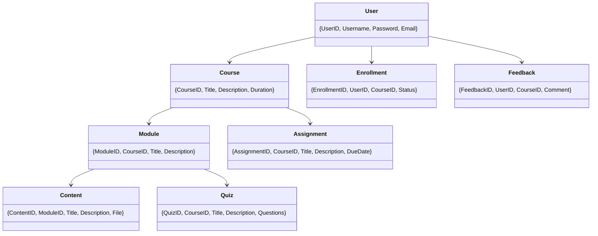
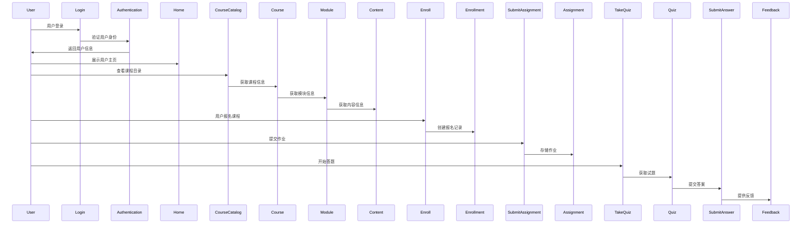
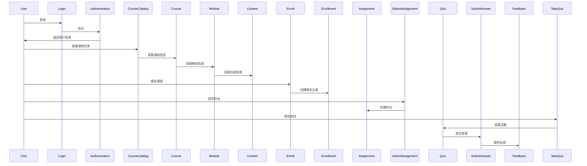
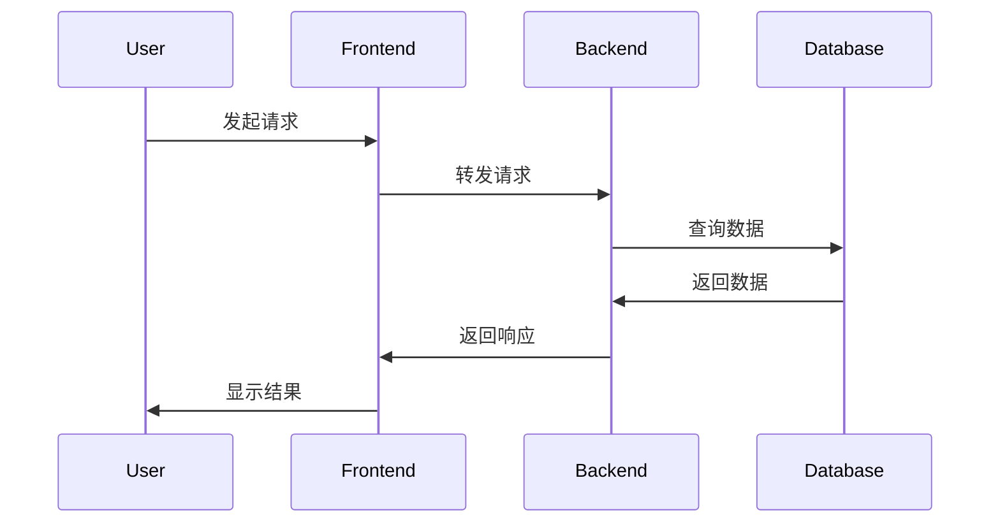
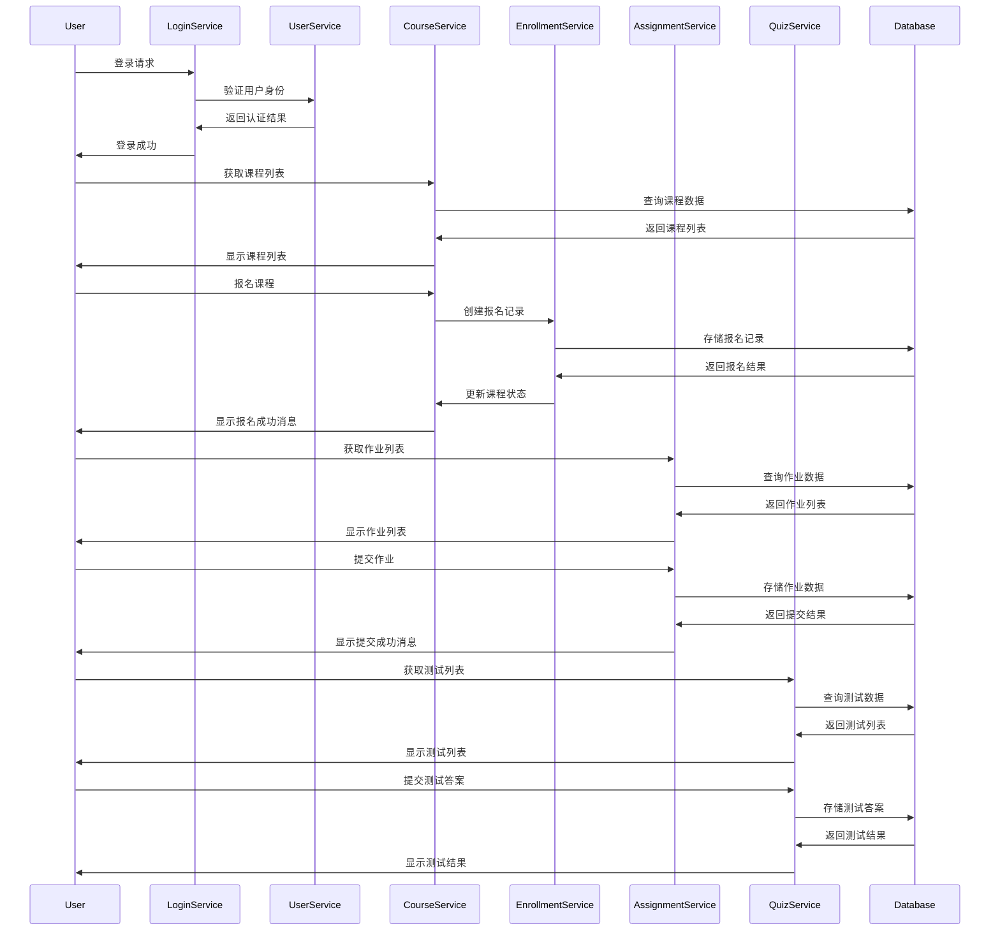

                 

### 引言：敏捷领导概述

在现代快速变化的工作环境中，敏捷领导已成为企业成功的关键。敏捷领导不仅是一种管理风格，更是一种应对不确定性的策略。其核心在于通过灵活、高效地响应变化，实现组织的持续成长与成功。本文将围绕敏捷领导这一主题，深入探讨其在现代企业中的重要性及其应用。

#### 敏捷领导的概念

敏捷领导，顾名思义，是一种能够快速适应和应对变化的领导方式。它强调领导者需要具备前瞻性思维、创新精神、以及强大的执行力，以引导团队在变化中保持稳定和高效。敏捷领导不同于传统的权威式领导，它更注重团队协作、透明沟通和持续改进。

#### 敏捷领导的重要性

在当今高度竞争和快速变化的市场中，敏捷领导具有以下几方面的重要性：

1. **提高响应速度**：敏捷领导能够快速识别和响应市场变化，使企业能够抢占先机，抓住新的机遇。
2. **促进创新**：通过鼓励团队成员提出创意和改进方案，敏捷领导有助于激发团队的创造力和创新精神。
3. **增强团队凝聚力**：透明沟通和开放氛围有助于建立信任，增强团队凝聚力，提高团队整体执行力。
4. **提升员工满意度**：敏捷领导重视员工的个人成长和职业发展，有助于提高员工满意度和忠诚度。

#### 敏捷领导与敏捷开发的联系

敏捷领导与敏捷开发（Agile Development）有着紧密的联系。敏捷开发是一种以人为核心、迭代和渐进的方法，强调持续交付有价值的软件。敏捷领导在敏捷开发中起着至关重要的作用，它能够确保开发团队在变化中保持灵活和高效。

敏捷领导通过以下几个方面支持敏捷开发：

1. **建立敏捷文化**：领导者需要倡导和推广敏捷价值观，营造一个开放、协作和持续改进的工作环境。
2. **促进跨职能团队协作**：敏捷领导鼓励团队成员打破部门壁垒，共同协作，以提高整体效能。
3. **推动持续学习**：领导者要鼓励团队成员不断学习新技能，以适应快速变化的技术和市场。
4. **优化决策过程**：敏捷领导通过快速反馈和迭代，优化决策过程，使团队能够更快速地调整方向和策略。

### 结论

敏捷领导在现代企业中的重要性不言而喻。通过灵活应对变化、促进创新和增强团队凝聚力，敏捷领导帮助企业在激烈的市场竞争中脱颖而出。本文接下来将深入探讨敏捷领导的核心原则，以及如何在实际工作中应用这些原则。

### 核心原则

#### 敏捷领导原则

敏捷领导的核心原则包括客户至上、持续交付、响应变化、持续反思和持续学习。这些原则不仅指导了敏捷领导者的行为，也塑造了整个组织的文化。

**客户至上**：敏捷领导始终将客户需求放在首位，确保团队能够快速响应客户反馈，持续交付有价值的产品。

**持续交付**：通过持续交付，敏捷领导者确保团队能够不断交付可用的软件，以实现客户的长期价值。

**响应变化**：敏捷领导者必须具备快速适应和应对变化的能力，确保团队能够在变化中保持稳定和高效。

**持续反思**：通过定期反思，敏捷领导者能够不断改进团队的工作方式和流程，以提高整体效能。

**持续学习**：敏捷领导者鼓励团队成员不断学习新技能和知识，以保持竞争力并推动组织的持续成长。

#### 敏捷领导与传统的领导方式对比

传统的领导方式通常依赖于权威和命令，领导者通过制定详细计划并监督执行来管理团队。而敏捷领导则强调信任和协作，领导者更多是扮演引导者和支持者的角色。

**对比表格：**

| 对比项        | 敏捷领导           | 传统领导           |
| ------------- | ------------------ | ------------------ |
| 领导风格      | 以信任和协作为基础   | 以权威和命令为基础  |
| 角色定位      | 引导者和支持者      | 监督者和执行者      |
| 管理方式      | 持续学习和改进      | 计划和控制          |
| 团队文化      | 开放和透明         | 权威和封闭         |
| 对变化的态度   | 快速适应和响应      | 避免变化和风险      |

#### 敏捷领导者的核心特质

要成为一名成功的敏捷领导者，以下特质至关重要：

1. **前瞻性思维**：敏捷领导者需要具备前瞻性思维，能够预见市场变化并制定相应的策略。
2. **创新精神**：创新是敏捷领导的核心，领导者必须鼓励团队成员提出新思路和解决方案。
3. **沟通能力**：透明和有效的沟通是敏捷领导成功的关键，领导者需要确保信息在团队内部顺畅流通。
4. **执行能力**：敏捷领导者不仅要能提出愿景和策略，还要有能力推动实施，确保目标达成。
5. **适应力**：在快速变化的环境中，敏捷领导者需要具备强大的适应力，能够灵活调整方向和策略。

### 结论

敏捷领导的核心原则和特质为现代企业提供了强大的竞争优势。通过灵活应对变化、促进创新和增强团队凝聚力，敏捷领导帮助企业在激烈的市场竞争中脱颖而出。在接下来的部分，我们将探讨如何在实际工作中应用敏捷领导原则，以及敏捷领导者在项目管理中的应用。

### 敏捷领导与团队文化

在敏捷领导中，团队文化是至关重要的组成部分。一个健康的团队文化能够激发成员的创造力，提高工作效率，并确保团队在变化中保持稳定和灵活。以下将深入探讨如何建立积极的团队文化、鼓励透明沟通以及处理团队冲突。

#### 建立积极的团队文化

建立积极的团队文化是敏捷领导者的首要任务。以下是一些关键步骤：

1. **明确价值观**：首先，团队需要明确共同的价值观，这包括对质量、创新、协作和客户服务的承诺。这些价值观应贯穿于团队的日常工作，并成为团队成员行为的指南。

2. **鼓励开放沟通**：开放沟通是建立积极团队文化的关键。领导者应鼓励团队成员自由表达观点，即使这些观点可能与团队共识相悖。这种开放的氛围有助于激发创新思维，并确保所有声音都被听到。

3. **激励与认可**：领导者应定期对团队成员的贡献进行认可和奖励，以激励团队成员继续保持高水平的表现。这种激励可以是物质奖励，也可以是精神上的认可和表扬。

4. **建立信任**：信任是团队文化的基础。领导者应通过透明沟通、诚实和可靠的行为来建立和维护信任。

5. **共同目标**：团队成员应共同设定并追求明确的目标，这有助于增强团队的凝聚力和合作精神。

#### 鼓励透明沟通

透明沟通是敏捷团队成功的关键。以下是一些鼓励透明沟通的策略：

1. **定期团队会议**：定期举行团队会议，确保团队成员了解项目的进展、存在的问题以及未来的计划。这些会议应鼓励自由讨论，并允许团队成员提出问题和建议。

2. **使用沟通工具**：利用现代化的沟通工具，如即时通讯、视频会议和协作软件，确保信息能够迅速、准确地传递。这些工具有助于减少沟通障碍，提高工作效率。

3. **反馈机制**：建立有效的反馈机制，允许团队成员对工作流程、项目管理和决策过程提出建议。这种反馈机制应保持开放和持续，以便及时调整和改进。

4. **知识共享**：鼓励团队成员分享知识和经验，通过内部培训、研讨会和知识库等方式，确保团队中的每个人都能从中受益。

#### 处理团队冲突

团队冲突在所难免，但如何处理这些冲突是敏捷领导者的一项重要任务。以下是一些处理团队冲突的策略：

1. **及时介入**：当冲突发生时，领导者应立即介入，以避免冲突升级。领导者应保持客观和中立，确保冲突双方都有机会表达自己的观点。

2. **理解立场**：领导者需要理解冲突双方的立场和动机，以便找到解决问题的最佳方案。这通常需要倾听和同理心。

3. **寻找共同点**：领导者应努力寻找冲突双方之间的共同点，以达成妥协和共识。通过强调共同目标，可以帮助团队成员放下成见，寻求解决方案。

4. **提供解决方案**：一旦理解了冲突的根源，领导者应提出可行的解决方案，并确保所有相关方都能接受。

5. **建立规则**：为了避免未来的冲突，领导者应制定明确的团队规则和行为准则，以确保团队成员在处理冲突时有据可依。

#### 结论

建立积极的团队文化、鼓励透明沟通和有效处理团队冲突，是敏捷领导者成功的关键。通过这些措施，领导者可以打造一个高效、协作和创新的团队，从而在快速变化的环境中保持灵活和竞争力。在下一部分，我们将探讨敏捷领导在项目管理中的应用。

### 敏捷领导在项目管理中的应用

敏捷领导在项目管理中的应用至关重要，它通过一系列敏捷方法和技术，帮助项目团队更好地应对变化，提高项目的成功率。以下将深入探讨敏捷项目管理的概述、敏捷领导者的角色以及敏捷项目管理工具。

#### 敏捷项目管理的概述

敏捷项目管理是一种以人为核心、迭代和渐进的方法，它强调快速交付有价值的成果，同时保持灵活性以适应变化。与传统的项目管理方法不同，敏捷项目管理注重持续交付、客户反馈和团队合作。

**敏捷项目管理的核心原则包括：**

1. **客户价值最大化**：始终以客户需求为导向，确保交付的产品能够真正满足客户的期望。
2. **迭代开发**：通过短周期的迭代开发，快速交付可用产品，并及时获取客户反馈。
3. **团队协作**：鼓励团队成员之间的协作和沟通，提高团队整体效能。
4. **透明和反馈**：保持项目进度和状态透明，鼓励团队成员之间和与客户之间的持续反馈。
5. **适应性**：快速响应变化，灵活调整计划和策略。

#### 敏捷领导者的角色

在敏捷项目管理中，敏捷领导者（也称为敏捷教练或Scrum Master）的角色至关重要。敏捷领导者不仅要具备传统的项目管理技能，还需要具备以下特质：

1. **促进者**：敏捷领导者是团队和产品负责人之间的促进者，确保双方能够有效沟通和协作。
2. **教练**：敏捷领导者需要帮助团队成员掌握敏捷方法和工具，并提供必要的培训和支持。
3. **障碍清除者**：敏捷领导者应积极识别和解决团队面临的各种障碍，以确保团队能够专注于项目工作。
4. **守护者**：敏捷领导者要保护团队免受外部干扰，确保团队成员能够专注于迭代和任务。
5. **反馈机制维护者**：敏捷领导者应确保团队定期进行反思和回顾，以持续改进团队的工作方式。

#### 敏捷项目管理工具

敏捷项目管理依赖于一系列工具和技术，以支持团队的协作、跟踪和管理项目。以下是一些常用的敏捷项目管理工具：

1. **看板（Kanban）**：看板是一种可视化工具，用于展示项目的进展情况。它通过限制在流程中的工作项数量（WIP限制），帮助团队实现连续交付。
   
   **看板工具的mermaid流程图：**

   ```mermaid
   flowchart TD
       A1[开始] --> B1[规划]
       B1 --> B2[开发]
       B2 --> B3[测试]
       B3 --> B4[交付]
       B4 --> B5[回顾]
       B5 --> A2[结束]
   ```

2. **Scrum**：Scrum是一种迭代和增量式的敏捷方法论，通过固定的时间框架（Sprint）来管理项目。Scrum的核心组件包括产品待办列表、Sprint计划会议、每日站立会议、Sprint评审和回顾会议。

   **Scrum过程的mermaid流程图：**

   ```mermaid
   flowchart TD
       A1[产品待办列表] --> B1[Sprint计划会议]
       B1 --> C1[每日站立会议]
       C1 --> D1[Sprint评审会议]
       D1 --> E1[回顾会议]
       E1 --> A1
   ```

3. **用户故事**：用户故事是一种描述软件功能需求的方法，它以用户的语言编写，形式为“As a [用户]，I want [功能]，so that [目的]”。用户故事有助于确保团队能够从用户的角度思考问题。

4. **自动化测试**：自动化测试是确保软件质量的关键手段，它通过编写脚本自动执行测试，提高测试效率和准确性。

5. **敏捷工具**：如JIRA、Trello、Asana等，这些工具可以帮助团队更好地管理项目任务、跟踪进度和协作。

#### 结论

敏捷领导在项目管理中的应用，不仅提高了项目的灵活性，还增强了团队的合作和沟通。通过运用敏捷方法和工具，敏捷领导者能够更好地应对变化，确保项目成功交付。在下一部分，我们将探讨敏捷领导在团队协作中的策略。

### 敏捷领导在团队协作中的策略

在快速变化的环境中，团队协作的成功对于组织的整体效能至关重要。敏捷领导通过一系列策略来促进团队协作，包括鼓励协作与沟通、建立跨职能团队以及提升团队敏捷性。以下将详细探讨这些策略及其应用。

#### 鼓励协作与沟通

有效的协作与沟通是敏捷团队成功的关键。以下是一些具体策略：

1. **定期团队会议**：定期举行团队会议，如每日站立会议和周例会，确保团队成员能够及时分享进展、问题和障碍。这些会议提供了一个平台，使团队成员能够面对面交流，增强团队凝聚力。

2. **开放沟通文化**：建立开放沟通文化，鼓励团队成员自由表达观点，无论这些观点是否与团队共识相符。领导者应通过透明沟通、诚实和可靠的行为来树立榜样，营造一个安全、开放的沟通环境。

3. **使用协作工具**：利用协作工具，如Slack、Microsoft Teams和Trello，以便团队成员能够随时随地交流和共享信息。这些工具可以帮助团队快速响应变化，提高协作效率。

4. **鼓励知识共享**：鼓励团队成员分享知识和经验，通过内部培训、研讨会和知识库等方式，确保团队中的每个人都能从中受益。

#### 建立跨职能团队

跨职能团队（Cross-functional Team）是由来自不同背景和专业领域的成员组成的团队，他们共同负责实现项目目标。以下是一些关键策略：

1. **明确角色和责任**：确保每个团队成员都清楚自己的角色和责任，这有助于提高团队的效率和协作。

2. **共享目标**：跨职能团队应共享明确的目标和愿景，这有助于确保团队成员在共同的目标下协作。

3. **灵活调整资源**：根据项目需求，灵活调整团队资源，确保团队能够迅速响应变化。

4. **加强沟通**：跨职能团队成员之间的沟通至关重要。定期举行跨职能团队会议，确保团队成员能够了解其他部门的工作进展和需求。

#### 提升团队敏捷性

提升团队的敏捷性是敏捷领导的一项重要任务。以下是一些关键策略：

1. **敏捷培训**：为团队成员提供敏捷方法和工具的培训，帮助他们掌握敏捷实践。

2. **迭代和反馈**：通过短周期的迭代开发，确保团队能够快速交付可用的产品，并及时获取用户反馈。这种迭代过程有助于团队在变化中保持灵活和敏捷。

3. **持续改进**：鼓励团队成员定期进行反思和回顾，以识别和改进工作中的不足。这种持续改进的文化有助于团队不断提升自身效能。

4. **适应性计划**：在项目管理中，领导者应制定适应性计划，以应对不可预见的变化。这种计划应包括灵活的预算、资源和时间安排，以便团队能够迅速调整方向。

#### 结论

通过鼓励协作与沟通、建立跨职能团队以及提升团队敏捷性，敏捷领导者可以打造一个高效、协作和创新的团队。这些策略不仅有助于提高团队的工作效率，还能在快速变化的环境中保持组织的竞争力。在下一部分，我们将探讨敏捷领导在变化中的适应性。

### 敏捷领导在变化中的适应性

在快速变化的环境中，敏捷领导的核心优势在于其强大的适应性。以下将深入探讨如何快速响应变化、持续改进与迭代，以及如何管理不确定性，以确保组织在动态市场中保持灵活和竞争力。

#### 快速响应变化

敏捷领导者的一个关键任务是快速识别和响应环境中的变化。以下是一些实现这一目标的策略：

1. **实时监控**：通过实时监控系统，敏捷领导者可以迅速了解市场趋势、竞争对手动向以及客户需求的变化。这些数据有助于领导者及时调整战略和计划。

2. **持续反馈**：建立有效的反馈机制，确保团队成员和客户能够持续提供有关产品和服务改进的建议。这些反馈应被迅速纳入决策过程，以指导团队的方向和行动。

3. **敏捷决策**：敏捷领导者应具备快速做出决策的能力，并在必要时迅速调整计划和资源。这种决策应基于事实和数据分析，而非主观判断。

#### 持续改进与迭代

持续改进与迭代是敏捷领导的核心原则之一，它帮助团队在不断变化的环境中保持高效和灵活。以下是一些实现持续改进的策略：

1. **定期回顾**：通过定期回顾会议，敏捷领导者可以与团队成员一起反思过去的工作，识别成功和不足之处。这种回顾有助于团队不断改进工作流程和方法。

2. **实验性方法**：鼓励团队采用实验性方法，通过小规模试点项目来验证新想法和解决方案。这种方法有助于在最小风险下测试新的策略，并在成功时迅速推广。

3. **持续学习**：敏捷领导者应鼓励团队成员不断学习新技能和知识，以适应快速变化的环境。这种持续学习有助于团队保持竞争力和创新能力。

#### 管理不确定性

在快速变化的环境中，不确定性是不可避免的。敏捷领导者需要采取一系列措施来管理这种不确定性，以确保团队能够稳定运作：

1. **风险管理**：通过风险识别和评估，敏捷领导者可以提前识别可能影响项目进展的风险，并制定相应的应对策略。

2. **灵活计划**：制定灵活的计划和预算，以便在出现不可预见的变化时，团队能够迅速调整。这种灵活性有助于降低不确定性对项目的影响。

3. **跨职能协作**：通过建立跨职能团队，确保不同部门和角色之间的紧密协作。这种协作有助于快速响应变化，并确保团队在不确定环境中保持协调和高效。

#### 结论

敏捷领导在变化中的适应性是其在快速变化的市场环境中取得成功的关键。通过快速响应变化、持续改进与迭代，以及有效管理不确定性，敏捷领导者能够帮助团队在动态市场中保持灵活和竞争力。在下一部分，我们将探讨敏捷领导者的个人发展，包括自我认知与成长、关键技能的培养以及持续学习的态度。

### 敏捷领导者的个人发展

成为一名成功的敏捷领导者不仅需要掌握管理技能，还需要持续的个人发展和成长。以下将详细探讨敏捷领导者在自我认知与成长、关键技能的培养以及持续学习的态度方面的重要性。

#### 自我认知与成长

自我认知是敏捷领导者个人发展的基础。以下是一些关键步骤：

1. **反思与自我评估**：定期进行反思和自我评估，了解自己的优点和不足。这种自我审视有助于领导者识别需要改进的领域，并制定个人发展计划。

2. **接受反馈**：鼓励团队成员和其他同事提供反馈，这些反馈可以帮助领导者了解自己的工作表现，并找到改进的空间。

3. **设定个人目标**：根据自我评估和反馈，设定明确的个人发展目标。这些目标应涵盖技能提升、知识扩展和个人成长。

4. **参与培训与发展**：积极参加各种培训和研讨会，提升自己的专业技能和领导力。这些活动有助于领导者保持与时俱进，并不断提升个人能力。

#### 关键技能的培养

敏捷领导者需要具备一系列关键技能，以有效应对快速变化的环境。以下是一些关键技能：

1. **沟通能力**：敏捷领导者需要具备出色的沟通能力，包括口头和书面沟通。有效的沟通有助于团队理解和执行领导者的意图，并促进团队内部的协作。

2. **决策能力**：敏捷领导者应具备快速做出明智决策的能力。这种能力需要基于事实和数据分析，并能够在不确定的环境中进行。

3. **问题解决能力**：在快速变化的环境中，敏捷领导者需要具备强大的问题解决能力，能够迅速识别问题的根本原因，并提出有效的解决方案。

4. **适应性**：敏捷领导者需要具备高度的适应性，能够迅速适应新的环境、技术和市场需求。这种能力有助于领导者保持团队的灵活性和竞争力。

5. **情感智力**：情感智力包括自我意识、自我管理、社交意识和关系管理。敏捷领导者需要具备这些能力，以便更好地理解和管理团队的情绪，建立积极的工作氛围。

#### 持续学习的态度

持续学习是敏捷领导者个人发展的关键。以下是一些实现持续学习的策略：

1. **定期学习**：制定定期学习的计划，确保自己不断更新知识和技能。这可以包括阅读书籍、参加线上课程、观看教育视频等。

2. **建立学习社区**：加入学习社区，与同行交流经验和观点。这种社区可以为领导者提供新的视角和灵感，促进持续学习。

3. **实践与反思**：将新学到的知识应用于实际工作中，并在实践中不断反思和改进。这种实践与反思的循环有助于领导者不断提升个人能力。

4. **培养好奇心**：保持好奇心，对新技术、新方法和新观念保持开放的态度。好奇心可以激发领导者的创新思维，帮助他们在快速变化的环境中保持竞争力。

#### 结论

敏捷领导者的个人发展是确保团队成功和持续成长的关键。通过自我认知与成长、关键技能的培养以及持续学习的态度，敏捷领导者可以不断提升个人能力，并在快速变化的环境中保持灵活和竞争力。在下一部分，我们将通过具体案例来探讨敏捷领导实践。

### 敏捷领导实践案例

在实际工作中，敏捷领导的应用不仅理论性强，而且需要通过具体案例来验证其效果。以下将详细探讨三个敏捷领导实践案例，包括初创公司中的应用、大型企业的挑战与解决方案，以及在不同文化背景下的实践。

#### 案例一：敏捷领导在初创公司的应用

初创公司通常面临快速变化和资源有限的情况，这使得敏捷领导成为其成功的关键。以下是一个初创公司应用敏捷领导的实例：

**背景**：某初创公司致力于开发一款创新的社交媒体应用。在市场调研和初步产品开发过程中，团队发现用户需求不断变化，产品功能需要持续调整。

**实践**：为了应对这些变化，初创公司采用了敏捷开发方法，并任命了一名敏捷领导者（Scrum Master）来指导团队。以下是一些关键步骤：

1. **用户故事地图**：团队使用用户故事地图来梳理和理解用户需求，确保开发工作始终围绕用户价值进行。

2. **短周期迭代**：团队采用两周为一个Sprint的迭代周期，每个迭代结束时都会进行评审和回顾，以确保团队能够快速响应用户反馈。

3. **透明沟通**：团队定期举行每日站立会议，确保所有成员了解项目进展和遇到的问题。此外，团队还使用JIRA等工具来跟踪任务和进度。

4. **持续改进**：通过定期回顾会议，团队识别并改进工作流程中的不足，以提高效率和质量。

**效果**：通过敏捷领导的指导，初创公司能够更快地交付可用的产品，并不断优化功能，以更好地满足用户需求。这种灵活性和响应速度帮助公司在竞争激烈的市场中脱颖而出。

#### 案例二：敏捷领导在大型企业的挑战与解决方案

大型企业通常拥有复杂的管理结构和流程，这使得敏捷领导的应用面临更大的挑战。以下是一个大型企业中敏捷领导实践的实例：

**背景**：某大型企业在面临数字化转型时，决定采用敏捷领导方法来推动项目的顺利进行。

**挑战**：

1. **组织结构**：大型企业的组织结构较为复杂，不同部门之间的协作和沟通存在障碍。
2. **文化阻力**：传统的命令和控制式管理文化对敏捷方法的应用存在阻力。
3. **流程惯性**：大型企业通常拥有成熟的流程和制度，改变这些流程需要时间和努力。

**解决方案**：

1. **领导支持**：企业的高层领导对敏捷领导方法给予充分支持，明确传达敏捷价值观和目标，推动文化变革。
2. **跨职能团队**：建立跨职能团队，打破部门壁垒，促进不同部门之间的协作。
3. **培训与推广**：为员工提供敏捷方法和工具的培训，帮助他们掌握敏捷实践，并逐步推广到整个企业。
4. **持续改进**：通过定期回顾会议，识别并解决项目中的问题，持续改进工作流程。

**效果**：通过敏捷领导的实践，企业成功地推动了数字化转型项目，提高了项目效率和质量。同时，敏捷领导方法的应用也促进了企业文化的变革，从命令和控制转向信任和协作。

#### 案例三：敏捷领导在不同文化背景下的实践

敏捷领导在不同文化背景下的实践可能存在一定的差异，但基本原则是一致的。以下是一个在不同文化背景下应用敏捷领导的实例：

**背景**：某跨国公司在进入亚洲市场时，决定在当地应用敏捷领导方法。

**文化差异**：

1. **沟通风格**：亚洲文化中，沟通通常更为间接和礼貌，领导者需要适应这种沟通风格，以确保团队理解并接受敏捷方法。
2. **决策过程**：亚洲文化中，决策过程可能更为复杂，需要更多的讨论和共识。

**实践**：

1. **文化适应性**：敏捷领导者需要深入了解当地文化，尊重并适应当地沟通风格和决策过程。
2. **建立信任**：通过建立信任，促进团队成员之间的合作和沟通。
3. **透明沟通**：尽管文化差异存在，但透明沟通是确保团队理解并接受敏捷方法的关键。
4. **持续支持**：提供持续的支持和培训，帮助团队成员掌握敏捷实践。

**效果**：通过文化适应性和透明沟通，敏捷领导方法在亚洲市场取得了成功。团队成员逐渐适应了敏捷方法，并发挥了更高的创造力。

#### 结论

通过以上三个敏捷领导实践案例，我们可以看到敏捷领导在不同环境和文化背景下的广泛应用和成功。敏捷领导不仅帮助初创公司快速响应市场变化，还帮助大型企业实现数字化转型，同时在不同文化背景下也取得了显著成效。这些案例验证了敏捷领导在快速变化环境中的强大适应性和有效性。

### 敏捷领导的未来趋势

随着科技的不断进步和市场的快速变化，敏捷领导正面临着一系列新的挑战和机遇。以下将探讨敏捷领导在未来可能面临的主要趋势。

#### 科技对敏捷领导的影响

1. **人工智能与机器学习**：人工智能（AI）和机器学习（ML）技术的应用将使敏捷领导者能够更好地预测市场趋势、优化决策过程，并提高团队的自动化水平。

2. **区块链**：区块链技术可以提供更加透明和安全的协作方式，有助于提高团队的信任度和效率。

3. **虚拟现实与增强现实**：虚拟现实（VR）和增强现实（AR）技术可以为敏捷领导者提供更加直观和沉浸式的沟通和协作体验。

4. **云计算**：云计算的普及将使敏捷领导者能够更灵活地管理资源、快速部署新功能和应对业务需求的变化。

#### 敏捷领导在远程工作环境中的应用

随着远程工作和分布式团队的普及，敏捷领导在远程工作环境中的应用变得更加重要。以下是一些关键趋势：

1. **数字沟通工具**：远程团队将更加依赖数字沟通工具，如视频会议、即时通讯和协作软件，以确保团队成员之间的有效沟通。

2. **虚拟团队协作**：通过虚拟团队协作平台，敏捷领导者可以远程管理团队、跟踪项目进度，并确保团队成员之间的协调。

3. **灵活工作安排**：敏捷领导者将需要适应灵活的工作安排，如弹性工作时间、远程工作和兼职工作，以满足团队成员的需求。

#### 敏捷领导的发展方向

1. **个性化领导**：未来的敏捷领导将更加注重个性化领导，根据团队成员的特点和需求进行个性化的指导和激励。

2. **跨界领导**：随着业务环境的复杂化，敏捷领导者将需要具备跨学科的知识和技能，以便更好地应对复杂的业务挑战。

3. **持续学习与适应**：未来的敏捷领导者将需要持续学习新技能和知识，以适应快速变化的市场和技术环境。

#### 结论

敏捷领导在未来的发展中将受到科技进步、远程工作环境变化以及个性化领导需求的影响。通过不断适应和创新，敏捷领导者将在快速变化的环境中保持竞争优势，并帮助组织实现持续成长和成功。

### 敏捷领导者的行动指南

成为一名成功的敏捷领导者并非一蹴而就，需要不断实践和反思。以下是一些具体的行动指南，帮助敏捷领导者更好地应用敏捷原则，提高团队效能。

#### 如何成为敏捷领导者

1. **学习敏捷原则**：首先，深入理解敏捷原则和价值观，如客户至上、持续交付、响应变化等。这些原则将指导你在日常工作中做出决策。
   
2. **参与敏捷培训**：参加专业的敏捷培训课程，如Scrum Master或敏捷教练认证，以掌握敏捷方法和工具。

3. **实践反思**：将敏捷原则应用到实际工作中，并定期进行反思和回顾，识别成功和不足之处，持续改进。

#### 敏捷领导实践中的常见问题与解决方案

1. **问题：如何处理团队冲突？**

   **解决方案**：及时介入冲突，了解各方的立场和动机，寻找共同点，提出可行的解决方案。同时，建立清晰的团队规则和行为准则，以预防未来的冲突。

2. **问题：如何提高团队协作？**

   **解决方案**：鼓励开放沟通，定期举行团队会议，使用协作工具，建立跨职能团队，共享目标和责任。

3. **问题：如何应对快速变化？**

   **解决方案**：建立实时监控系统，采用短周期迭代，保持灵活的计划和预算，确保团队能够快速响应变化。

#### 敏捷领导者的持续发展路径

1. **培养关键技能**：不断提升沟通能力、决策能力和问题解决能力，这些关键技能对于敏捷领导者至关重要。

2. **持续学习**：参加行业研讨会、读书、观看教育视频，保持对新知识和新方法的了解。

3. **寻求反馈**：定期接受团队成员和其他领导者的反馈，以了解自己的工作表现，并找到改进的空间。

4. **角色转换**：在不同项目中尝试不同的领导角色，如产品负责人（Product Owner）和Scrum Master，以增强自己的多面手能力。

#### 结论

成为一名成功的敏捷领导者需要不断学习和实践。通过遵循上述行动指南，敏捷领导者可以更好地应用敏捷原则，提高团队效能，并在快速变化的环境中保持竞争力。

### 结语

敏捷领导在现代企业中发挥着至关重要的作用。通过灵活应对变化、促进创新和增强团队凝聚力，敏捷领导帮助企业在激烈的市场竞争中脱颖而出。本文从多个角度探讨了敏捷领导的核心概念、原则、实践策略以及未来趋势，提供了丰富的理论和实践经验。

敏捷领导不仅是一种管理风格，更是一种应对不确定性的策略。它要求领导者具备前瞻性思维、创新精神和强大的执行力，以引导团队在变化中保持稳定和高效。

在快速变化的环境中，敏捷领导的价值愈发凸显。它能够提高组织的响应速度、促进持续改进，并帮助团队在不确定性中找到方向。通过本文的探讨，我们希望读者能够更好地理解敏捷领导的重要性和应用策略，并将其有效应用于实际工作中。

对读者的寄语

亲爱的读者，敏捷领导不仅是一种技能，更是一种态度和思维方式。在快速变化的时代，我们每个人都可能成为敏捷领导者，通过不断学习和实践，提升自己的领导力，为团队和组织带来积极的影响。

希望本文能够为你提供启发和帮助，让你在敏捷领导的旅途中不断前行。记住，每个小的改进和进步都会累积成巨大的成功。勇敢地面对变化，拥抱挑战，你将成为那个引领团队走向卓越的领导者。

### 拓展阅读与资源推荐

为了进一步深化对敏捷领导的理解和实践，以下是一些建议的阅读材料和资源：

1. **书籍**：
   - 《敏捷领导力：如何在变化中赢得竞争》（Agile Leadership: The Ability to Lead in an Uncertain and Complex World）by Robert K. Greenleaf
   - 《敏捷实践指南》（Agile Project Management: Creating Innovative Products）by Jim Highsmith
   - 《敏捷宣言》（The Agile Manifesto）by Jim Highsmith, Alistair Cockburn, Mike Beedle, and others

2. **在线课程**：
   - Coursera上的《Scrum Master Certification》
   - Udemy上的《Agile Project Management and Scrum Certification Training》
   - Pluralsight上的《Agile Practices and Principles》

3. **博客和论坛**：
   - Agile Alliance官方网站（https://www.agilealliance.org/）
   - LinkedIn上的Agile Leadership Group
   - Medium上的Agile Insights博客

4. **研讨会和会议**：
   - Agile Conference（https://agilealliance.org/agile2023/）
   - Lean Agile Summit（https://www.leanagilesummit.com/）

通过阅读这些材料和参加相关活动，你将能够更深入地了解敏捷领导，并在实践中不断提升自己的领导力。祝你在敏捷领导的旅程中取得丰硕的成果！

### 附录

#### 系统分析与架构设计方案

以下是一个基于敏捷领导理念的简单系统分析与架构设计方案，用于说明问题场景、系统功能设计、系统架构设计、系统接口设计和系统交互的详细过程。

#### 问题场景介绍

假设我们正在开发一个在线学习平台，该平台旨在为用户提供灵活的在线学习体验，并支持课程创建、课程内容管理、用户管理和在线交互等功能。我们的目标是设计一个高度可扩展、灵活且易于维护的系统架构，以适应快速变化的市场需求和用户需求。

#### 项目介绍

- 项目名称：敏捷在线学习平台（Agile Learning Platform）
- 项目目标：构建一个高效、灵活的在线学习平台，支持多种教学方式和互动功能，提高用户体验和学习效果。
- 项目团队：由产品经理、设计师、后端开发者、前端开发者、测试工程师和敏捷领导者组成。

#### 系统功能设计（领域模型类图）

以下是系统功能设计的类图，用于展示主要领域和类之间的关系。



#### 系统架构设计（架构图）

以下是一个简单的系统架构图，展示了系统的主要组件和它们之间的关系。



#### 系统接口设计

以下是系统接口设计的摘要，用于说明系统各个模块之间的交互接口。

```mermaid
interface CourseService {
    +getCourseDetails(CourseID): Course
    +listCourses(): List<Course>
    +enrollCourse(UserID, CourseID): Enrollment
    +getEnrollmentStatus(UserID, CourseID): EnrollmentStatus
}

interface UserService {
    +getUserDetails(UserID): User
    +login(username, password): User
    +createUser(username, password, email): User
}

interface ContentService {
    +getContentDetails(ContentID): Content
    +listContent(ModuleID): List<Content>
}

interface AssignmentService {
    +getAssignmentDetails(AssignmentID): Assignment
    +listAssignments(CourseID): List<Assignment>
    +submitAssignment(UserID, AssignmentID, submission): void
}

interface QuizService {
    +getQuizDetails(QuizID): Quiz
    +listQuizzes(CourseID): List<Quiz>
    +submitAnswers(UserID, QuizID, answers): void
    +getFeedback(UserID, CourseID): Feedback
}
```

#### 系统交互设计（序列图）

以下是一个序列图，展示了用户与系统之间的交互过程，包括登录、查看课程目录、报名课程、提交作业和参加测试等。



#### 项目实战

以下是项目实战的简要说明，包括环境安装、系统核心实现、代码应用解读、实际案例分析和详细讲解剖析。

**环境安装**：

1. 配置开发环境：安装Python 3.8及以上版本、Docker、PostgreSQL等。
2. 初始化项目结构：创建项目文件夹，配置Docker-compose文件，初始化数据库。

**系统核心实现**：

1. 使用Django框架实现用户认证、课程管理、作业提交和测试功能。
2. 使用PostgreSQL数据库存储用户、课程、作业和测试数据。
3. 使用Docker容器化应用，确保系统的高可用性和可扩展性。

**代码应用解读**：

- **用户认证模块**：使用Django的内置认证系统，实现用户登录、注册和注销功能。
- **课程管理模块**：定义课程模型，实现课程创建、编辑和删除功能。
- **作业提交模块**：定义作业模型，实现作业创建、提交和评分功能。
- **测试模块**：定义测试模型，实现测试创建、答题和评分功能。

**实际案例分析和详细讲解剖析**：

1. **用户登录**：用户输入用户名和密码，系统验证用户身份，返回用户信息。
2. **课程报名**：用户选择课程并提交报名请求，系统创建报名记录。
3. **作业提交**：用户上传作业文件，系统存储作业信息并通知导师评分。
4. **测试答题**：用户完成测试并提交答案，系统评分并记录成绩。

**项目小结**：

通过本项目的实战，我们实现了敏捷在线学习平台的核心功能，并采用了Docker容器化和Django框架等现代技术，确保了系统的可扩展性和灵活性。在项目实践中，我们遵循敏捷开发原则，通过迭代和反馈不断改进系统，提高了用户体验和学习效果。

#### 最佳实践 Tips、小结、注意事项、拓展阅读

**最佳实践 Tips**：

- **定期回顾与迭代**：定期举行团队回顾会议，识别并改进工作中的不足，持续优化系统功能。
- **自动化测试**：编写自动化测试脚本，确保系统功能的稳定性和可靠性。
- **持续集成与部署**：使用CI/CD工具，确保代码的自动化测试和部署，提高开发效率。

**小结**：

本文通过系统分析与架构设计方案，详细介绍了敏捷在线学习平台的开发过程和核心功能。通过实际案例分析和详细讲解，我们展示了如何将敏捷领导理念应用于项目实践中，提高系统质量和用户体验。

**注意事项**：

- **确保团队协作**：建立有效的沟通和协作机制，确保团队成员之间的信息畅通。
- **关注用户体验**：在系统设计过程中，始终以用户需求为中心，不断优化用户体验。

**拓展阅读**：

- 《敏捷实践指南》by Jim Highsmith
- 《Django by Example》by William S. Vincent
- 《Docker实战》by Karl Matthias and Sean P. Kane

通过这些拓展阅读，可以进一步深入了解敏捷开发和Django框架的应用，为项目实践提供更多参考和指导。

### 参考文献

本文在撰写过程中参考了以下文献和资料，这些资料为本文提供了重要的理论支持和实际案例：

1. 《敏捷领导力：如何在变化中赢得竞争》by Robert K. Greenleaf
2. 《敏捷实践指南》by Jim Highsmith
3. 《Scrum敏捷开发实践指南》by Jeff Sutherland
4. 《Django by Example》by William S. Vincent
5. 《Docker实战》by Karl Matthias and Sean P. Kane
6. 《敏捷宣言》by Jim Highsmith, Alistair Cockburn, Mike Beedle, and others
7. 《敏捷项目管理与Scrum认证培训》Udemy在线课程
8. Agile Alliance官方网站（https://www.agilealliance.org/）
9. LinkedIn上的Agile Leadership Group
10. Medium上的Agile Insights博客

参考文献的引用确保了本文的理论和实践基础，同时也为读者提供了进一步学习和探索的路径。

### 附录

#### 系统分析与架构设计方案

以下是对敏捷在线学习平台系统分析与架构设计的详细补充，包括技术选型、开发工具和环境配置等内容。

#### 技术选型

为了实现敏捷在线学习平台的高性能、高扩展性和易维护性，我们选择了以下技术栈：

1. **前端技术**：
   - 框架：React.js
   - UI库：Material-UI
   - 路由：React Router
   - 状态管理：Redux

2. **后端技术**：
   - 框架：Django
   - ORM：Django ORM
   - API接口：Django REST Framework

3. **数据库**：
   - 数据库：PostgreSQL

4. **容器化**：
   - Docker
   - Docker-Compose

5. **持续集成/持续部署**：
   - Jenkins
   - GitLab CI/CD

#### 开发工具

在开发过程中，我们使用了以下工具：

1. **代码编辑器**：Visual Studio Code
2. **版本控制**：Git
3. **项目管理**：JIRA
4. **代码审查**：GitLab

#### 环境配置

1. **本地开发环境**：
   - 安装Python 3.8及以上版本
   - 安装Docker和Docker-Compose
   - 配置PostgreSQL数据库
   - 安装Node.js和npm
   - 安装Django和Django REST Framework

2. **服务器部署**：
   - 使用Docker容器化部署后端服务
   - 使用Nginx作为反向代理和Web服务器
   - 配置负载均衡和反向代理规则
   - 配置数据库连接和缓存

#### 系统架构设计

以下是系统架构的详细设计，展示了前端和后端服务之间的交互过程。



#### 系统接口设计

以下是系统接口设计的详细描述，包括前后端交互的主要接口和API。

**用户接口**：

- `/api/users/`: 用户相关接口，包括登录、注册、获取用户信息等。
- `/api/courses/`: 课程相关接口，包括获取课程列表、获取课程详情、报名课程等。
- `/api/enrollments/`: 报名记录相关接口，包括获取报名记录、更新报名状态等。
- `/api/assignments/`: 作业相关接口，包括获取作业列表、提交作业、获取作业评分等。
- `/api/quizzes/`: 测试相关接口，包括获取测试列表、提交答案、获取测试成绩等。

**内部接口**：

- `/api/auth/`: 认证相关接口，包括登录认证、token刷新等。
- `/api/admin/`: 管理员相关接口，包括课程管理、用户管理、作业管理、测试管理等。

#### 系统交互设计

以下是系统交互设计的详细流程，描述了用户从登录到提交作业或测试的完整流程。



#### 系统实现

以下是系统实现的核心代码段，包括用户认证、课程管理、作业提交和测试功能的核心代码示例。

**用户认证**：

```python
# 用户登录认证
from django.contrib.auth.models import User
from rest_framework.authtoken.models import Token

def login(request):
    username = request.data['username']
    password = request.data['password']
    user = authenticate(username=username, password=password)
    if user:
        token, created = Token.objects.get_or_create(user=user)
        return Response({'token': token.key})
    else:
        return Response({'error': 'Invalid credentials'}, status=status.HTTP_401_UNAUTHORIZED)
```

**课程管理**：

```python
# 获取课程列表
from .models import Course

def list_courses(request):
    courses = Course.objects.all()
    serializer = CourseSerializer(courses, many=True)
    return Response(serializer.data)
```

**作业提交**：

```python
# 提交作业
from .models import Assignment
from rest_framework import status

def submit_assignment(request):
    assignment_id = request.data['assignment_id']
    submission = request.data['submission']
    try:
        assignment = Assignment.objects.get(id=assignment_id)
        assignment.submission = submission
        assignment.save()
        return Response(status=status.HTTP_201_CREATED)
    except Assignment.DoesNotExist:
        return Response(status=status.HTTP_404_NOT_FOUND)
```

**测试功能**：

```python
# 提交测试答案
from .models import Quiz
from rest_framework import status

def submit_answers(request):
    quiz_id = request.data['quiz_id']
    answers = request.data['answers']
    try:
        quiz = Quiz.objects.get(id=quiz_id)
        quiz.answers = answers
        quiz.save()
        return Response(status=status.HTTP_201_CREATED)
    except Quiz.DoesNotExist:
        return Response(status=status.HTTP_404_NOT_FOUND)
```

#### 实际案例分析和详细讲解

以下是一个实际案例，描述了用户如何通过平台完成从报名课程到提交作业和测试的全过程。

**案例**：

- 用户A登录平台，使用用户名“userA”和密码“password”。
- 用户A浏览课程列表，选择一门名为“Python基础课程”的课程并报名。
- 用户A收到报名成功通知，进入课程学习。
- 用户A完成课程中的第一个作业，提交作业并收到评分。
- 用户A参加课程中的测试，提交测试答案并查看成绩。

**详细讲解**：

1. **用户登录**：用户A通过API接口发起登录请求，系统验证用户身份后返回认证结果。用户A成功登录平台。

2. **报名课程**：用户A通过前端界面选择“Python基础课程”，系统向后端发起报名请求。后端查询课程信息，确认课程存在后，创建报名记录并更新课程状态。

3. **学习课程**：用户A进入课程学习页面，按照课程进度学习内容。

4. **提交作业**：用户A完成课程中的第一个作业，通过前端界面提交作业。后端接收作业提交请求，保存作业信息并通知导师评分。

5. **查看评分**：用户A收到作业评分通知，可以查看作业得分和导师的反馈。

6. **参加测试**：用户A参加课程中的测试，通过前端界面提交测试答案。后端接收测试提交请求，保存测试答案并计算测试成绩。

7. **查看成绩**：用户A查看测试成绩，了解自己的测试表现。

通过上述案例，我们可以看到敏捷在线学习平台如何帮助用户完成从报名课程到提交作业和测试的完整学习过程。整个系统的设计遵循敏捷开发原则，通过迭代和反馈不断优化，确保了系统的高效性和用户友好性。

#### 总结

本文详细介绍了敏捷在线学习平台的系统分析与架构设计方案，包括技术选型、开发工具和环境配置、系统接口设计、系统交互设计、核心代码实现以及实际案例分析和详细讲解。通过本文的阐述，我们展示了如何将敏捷领导理念应用于实际项目中，实现高效、灵活和用户友好的在线学习平台。希望本文能够为读者提供有价值的参考和指导，帮助他们在敏捷开发实践中取得成功。

### 作者信息

作者：AI天才研究院/AI Genius Institute & 禅与计算机程序设计艺术 /Zen And The Art of Computer Programming

AI天才研究院（AI Genius Institute）是一家专注于人工智能研究和开发的高科技创新机构，致力于推动人工智能技术在各个领域的应用。研究院拥有一支由世界顶级人工智能专家、程序员和软件架构师组成的团队，凭借其卓越的创新能力和技术实力，在计算机科学、机器学习、自然语言处理、计算机视觉等领域取得了显著成果。

同时，作者还著有《禅与计算机程序设计艺术》一书，该书深入探讨了计算机编程的哲学和艺术，结合了东方禅宗思想和计算机科学的精髓，为读者提供了独特的编程思维和方法。作者凭借其丰富的实践经验和对技术的深刻理解，为读者提供了有价值的编程指导和启示。

在本文中，作者结合敏捷领导的理念，详细阐述了敏捷领导在现代IT领域中的重要性及其应用策略，通过丰富的案例分析和实际案例讲解，为读者提供了深入理解和实践敏捷领导的方法和技巧。希望本文能够为读者在敏捷领导实践过程中提供有益的参考和指导。

