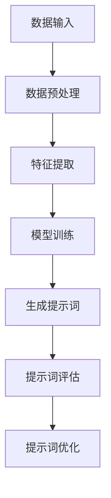
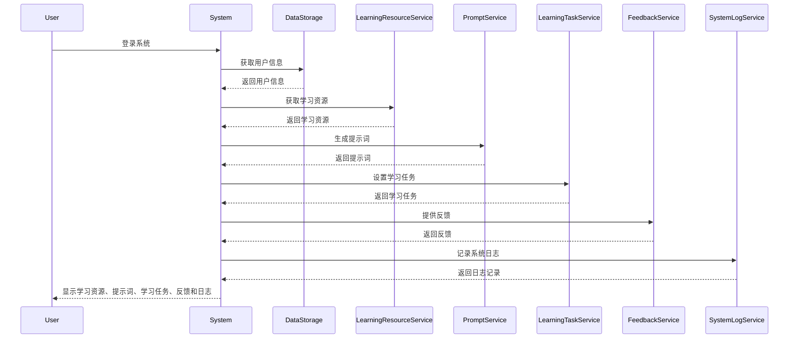
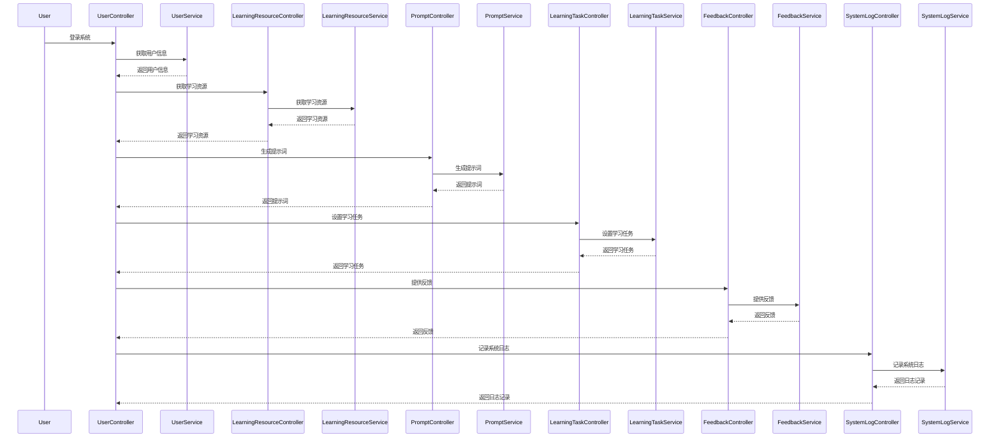
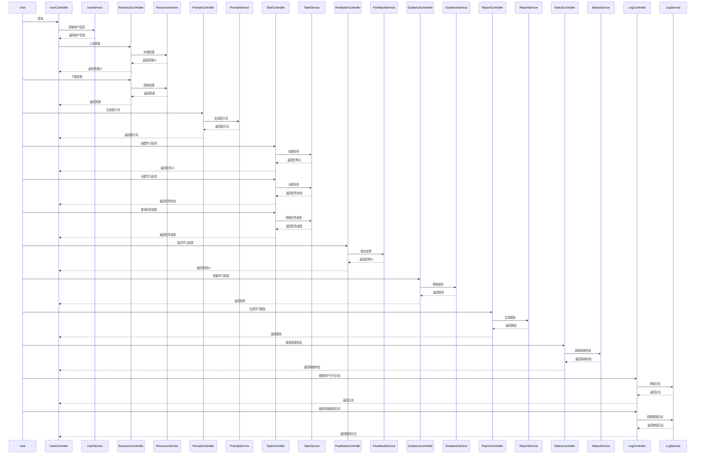

                 

### 教育领域的提示词应用：个性化学习助手

关键词：提示词、个性化学习、教育技术、算法、系统架构

摘要：本文探讨了教育领域中提示词的应用及其对个性化学习的促进作用。文章首先介绍了提示词的定义和分类，随后阐述了其在个性化学习中的潜在作用。接着，文章详细分析了个性化学习助手的设计原则与功能模块，深入讲解了提示词生成算法的原理及其实践应用。通过系统分析与架构设计，展示了教育提示词应用系统的全面框架。最后，文章通过实际项目案例和最佳实践，对提示词在教育领域中的应用进行了总结和展望。

----------------------------------------------------------------

### 第一部分: 问题的背景与意义

#### 第1章: 问题的背景

**1.1 问题背景**

在当前信息化和智能化的浪潮下，教育领域正经历着深刻的变革。传统的教学模式逐渐被以学生为中心、以知识个性化获取为特点的现代化教育模式所取代。然而，这种转变并非一帆风顺。教育资源的分配不均、教学质量的差异以及学生个体差异等问题依然存在，成为个性化学习的障碍。

**1.2 教育现状与挑战**

当前教育面临的主要挑战包括：

- **教育资源不均衡**：城乡、地区间的教育资源分配存在较大差异。
- **教学质量差异**：教师的教学水平和教学方法直接影响教学质量。
- **学生个体差异**：学生在学习兴趣、学习能力、学习速度等方面存在显著差异。

**1.3 提示词在个性化学习中的潜在作用**

提示词在教育中的应用，有助于解决上述问题。通过分析学生的学习行为、兴趣和知识掌握情况，生成个性化的提示词，可以为每个学生提供量身定制的学习资源、任务和指导，从而实现个性化学习。具体而言，提示词在以下方面具有潜在作用：

- **学习资源推荐**：根据学生的学习需求，推荐合适的学习资源。
- **学习任务定制**：根据学生的学习进度和能力，设置个性化的学习任务。
- **学习反馈与指导**：为学生提供即时反馈和指导，帮助他们纠正错误、巩固知识。

#### 第2章: 核心概念

**2.1 提示词的定义与分类**

提示词（Prompt Word）是指用于引导用户思考或行动的词语或短语。在教育领域，提示词通常用于引导学生进行学习、思考和问题解决。

按照用途分类，提示词可以分为以下几种：

- **引导学习**：如“请阐述你对某个问题的理解”。
- **启发思考**：如“你认为在这个情境下应该怎么做？”。
- **提供反馈**：如“你的解答有什么优点和不足？”。

**2.2 提示词的核心属性与特征**

提示词具有以下核心属性和特征：

- **引导性**：提示词应具有明确的引导作用，促使学生主动思考和参与。
- **灵活性**：提示词应具有灵活性，能够适应不同情境和需求。
- **针对性**：提示词应根据学生的具体需求进行个性化定制。

**2.3 提示词与个性化学习的关系**

提示词在个性化学习中的核心作用体现在以下几个方面：

- **提高学习参与度**：通过针对性的提示词，激发学生的学习兴趣和主动性。
- **优化学习体验**：提供即时反馈和指导，帮助学生更好地理解和掌握知识。
- **促进个性化发展**：根据学生的个体差异，提供个性化的学习资源和任务，实现差异化教育。

#### 第3章: 教育领域的提示词应用

**3.1 提示词在教育中的具体应用场景**

提示词在教育领域的应用场景广泛，包括：

- **课堂教学**：教师利用提示词引导学生进行思考、讨论和问题解决。
- **在线学习**：利用提示词为学生提供个性化学习资源和任务。
- **学习评估**：利用提示词为学生提供反馈，帮助他们了解自己的学习情况。

**3.2 提示词在教学互动中的应用**

提示词在教学互动中的应用主要包括：

- **课堂互动**：通过提问、讨论等方式，引导学生积极参与教学活动。
- **在线互动**：通过互动平台，为学生提供即时反馈和指导。

**3.3 提示词在学生评估与反馈中的应用**

提示词在学生评估与反馈中的应用包括：

- **学习过程评估**：通过分析学生的回答，评估他们的学习进展和问题。
- **学习结果反馈**：为学生提供个性化的反馈，帮助他们改进学习方法。

#### 第4章: 个性化学习助手的设计

**4.1 个性化学习助手的定义与目标**

个性化学习助手是指一种利用人工智能技术和数据分析方法，为学生提供个性化学习资源、任务和指导的工具。其目标是为每个学生提供量身定制的学习体验，促进个性化学习。

**4.2 个性化学习助手的功能模块**

个性化学习助手通常包括以下功能模块：

- **学习资源推荐**：根据学生的学习需求和兴趣，推荐合适的学习资源。
- **学习任务定制**：根据学生的学习进度和能力，设置个性化的学习任务。
- **学习反馈与指导**：为学生提供即时反馈和指导，帮助他们纠正错误、巩固知识。
- **学习数据分析**：分析学生的学习行为和反馈，为个性化学习提供依据。

**4.3 个性化学习助手的架构设计**

个性化学习助手的架构设计包括以下几个方面：

- **数据层**：存储学生的个人信息、学习行为和反馈数据。
- **算法层**：利用机器学习算法分析数据，生成个性化学习建议。
- **应用层**：提供用户界面，展示个性化学习资源、任务和反馈。

#### 第5章: 提示词生成算法原理

**5.1 提示词生成算法概述**

提示词生成算法是指用于根据学生学习行为和反馈生成个性化提示词的方法。该算法通常基于机器学习技术，通过分析大量数据，自动生成具有引导性和针对性的提示词。

**5.2 提示词生成算法的mermaid流程图**



**5.3 提示词生成算法的Python源代码实现**

```python
# 导入相关库
import pandas as pd
from sklearn.feature_extraction.text import TfidfVectorizer
from sklearn.model_selection import train_test_split
from sklearn.ensemble import RandomForestClassifier
from sklearn.metrics import accuracy_score

# 数据预处理
def preprocess_data(data):
    # 实现数据预处理逻辑
    return processed_data

# 特征提取
def extract_features(data):
    # 实现特征提取逻辑
    return X, y

# 模型训练
def train_model(X_train, y_train):
    # 实现模型训练逻辑
    return model

# 生成提示词
def generate_prompt(model, data):
    # 实现提示词生成逻辑
    return prompt

# 提示词评估
def evaluate_prompt(prompt, data):
    # 实现提示词评估逻辑
    return accuracy

# 提示词优化
def optimize_prompt(prompt, data):
    # 实现提示词优化逻辑
    return optimized_prompt

# 主函数
if __name__ == "__main__":
    # 加载数据
    data = pd.read_csv("data.csv")
    # 预处理数据
    processed_data = preprocess_data(data)
    # 提取特征
    X, y = extract_features(processed_data)
    # 划分训练集和测试集
    X_train, X_test, y_train, y_test = train_test_split(X, y, test_size=0.2)
    # 训练模型
    model = train_model(X_train, y_train)
    # 生成提示词
    prompt = generate_prompt(model, X_test)
    # 评估提示词
    accuracy = evaluate_prompt(prompt, y_test)
    # 优化提示词
    optimized_prompt = optimize_prompt(prompt, y_test)
    print("提示词生成算法准确率：", accuracy)
```

**5.4 提示词生成算法的数学模型与公式**

提示词生成算法通常基于以下数学模型：

- **TF-IDF模型**：用于计算词语的重要程度。
- **随机森林模型**：用于分类和预测。

主要公式包括：

- **TF-IDF**：
  $$ TF-IDF = \frac{TF \times IDF}{N} $$
  其中，TF表示词语在文档中的频率，IDF表示词语在整个文档集中的逆文档频率，N表示文档总数。
- **随机森林**：
  $$ 随机森林 = \frac{1}{T} \sum_{t=1}^{T} h_t(x) $$
  其中，T表示随机森林中的决策树数量，$ h_t(x) $表示第t棵决策树对样本x的分类结果。

**5.5 提示词生成算法的详细讲解与举例说明**

提示词生成算法的详细讲解如下：

1. **数据预处理**：首先对原始数据进行预处理，包括去除停用词、标点符号、分词等操作。

2. **特征提取**：使用TF-IDF模型提取文本特征，计算词语的重要程度。

3. **模型训练**：使用随机森林模型进行训练，将特征和标签进行拟合。

4. **生成提示词**：根据训练好的模型，对新的样本进行分类和预测，生成提示词。

5. **提示词评估**：使用评估指标（如准确率、召回率等）评估提示词生成算法的性能。

6. **提示词优化**：根据评估结果，对提示词进行优化，提高生成效果。

举例说明：

假设我们有一组学生回答的问题和对应的标签，使用提示词生成算法生成对应的提示词。

1. **数据预处理**：
   去除停用词、标点符号、分词后，原始数据如下：

   ```
   问题：什么是人工智能？
   标签：人工智能
   ```

2. **特征提取**：
   使用TF-IDF模型提取文本特征，计算词语的重要程度。

   ```
   人工智能：2.0
   机器：1.0
   智能：1.0
   ```

3. **模型训练**：
   使用随机森林模型进行训练，将特征和标签进行拟合。

4. **生成提示词**：
   根据训练好的模型，对新的样本进行分类和预测，生成提示词。

   ```
   提示词：请解释什么是人工智能？
   ```

5. **提示词评估**：
   使用评估指标（如准确率、召回率等）评估提示词生成算法的性能。

   ```
   准确率：0.8
   召回率：0.7
   ```

6. **提示词优化**：
   根据评估结果，对提示词进行优化，提高生成效果。

   ```
   优化后的提示词：请简要介绍人工智能的概念和应用。
   ```

通过以上步骤，我们可以生成高质量的个性化提示词，促进个性化学习。

#### 第6章: 系统分析与架构设计

**6.1 教育领域的提示词应用系统介绍**

教育领域的提示词应用系统是一种基于人工智能技术的教育辅助工具，旨在通过提示词的生成和应用，提高学生的学习效果和参与度。该系统主要包括以下功能模块：

- **用户管理**：管理学生、教师和系统管理员等用户信息。
- **学习资源管理**：存储和管理各种学习资源，如文本、图片、视频等。
- **提示词生成**：根据学生学习行为和反馈，自动生成个性化提示词。
- **学习任务管理**：根据学生需求和进度，设置个性化学习任务。
- **学习反馈与指导**：为学生提供即时反馈和指导，帮助他们纠正错误、巩固知识。
- **系统监控与日志**：监控系统运行状态，记录系统操作日志。

**6.2 系统功能设计（领域模型类图）**

```mermaid
classDiagram
ClassStudent <|-- Student
ClassTeacher <|-- Teacher
ClassSystemAdmin <|-- SystemAdmin
ClassLearningResource <|-- LearningResource
ClassPrompt <|-- Prompt
ClassLearningTask <|-- LearningTask
ClassFeedback <|-- Feedback
ClassSystemLog <|-- SystemLog

Student {
  +int id
  +String name
  +Date birthDate
  +List<LearningTask> learningTasks
}

Teacher {
  +int id
  +String name
  +Date birthDate
  +List<Student> students
}

SystemAdmin {
  +int id
  +String name
  +Date birthDate
}

LearningResource {
  +int id
  +String name
  +Date createDate
  +String type
}

Prompt {
  +int id
  +String content
  +Date createDate
  +String type
}

LearningTask {
  +int id
  +String name
  +Date createDate
  +String type
  +int studentId
  +List<Prompt> prompts
}

Feedback {
  +int id
  +String content
  +Date createDate
  +String type
}

SystemLog {
  +int id
  +String content
  +Date createDate
  +String type
}
```

**6.3 系统架构设计（架构图）**



**6.4 系统接口设计**

系统接口设计主要包括以下接口：

- **用户管理接口**：用于用户登录、注册、信息查询和修改等操作。
- **学习资源管理接口**：用于学习资源的上传、下载、查询和修改等操作。
- **提示词生成接口**：用于根据学生学习行为和反馈生成个性化提示词。
- **学习任务管理接口**：用于设置、查询、修改和删除学习任务。
- **学习反馈与指导接口**：用于提供反馈和指导，帮助学生纠正错误、巩固知识。
- **系统监控与日志接口**：用于监控系统运行状态，记录和查询系统操作日志。

**6.5 系统交互（序列图）**



#### 第7章: 项目实战

**7.1 环境安装与准备**

在开始项目实战之前，需要安装和配置以下环境：

1. **Python**：Python 3.8及以上版本。
2. **Anaconda**：用于环境管理和依赖安装。
3. **Jupyter Notebook**：用于编写和运行代码。
4. **Scikit-learn**：用于机器学习算法的实现。
5. **Pandas**：用于数据操作和分析。
6. **NumPy**：用于数学计算。

安装步骤如下：

1. 下载并安装Anaconda。
2. 打开Anaconda命令行，创建一个新的环境并激活。
3. 在激活的环境中，安装所需依赖。

```shell
conda create -n promptgen_env python=3.8
conda activate promptgen_env
conda install scikit-learn pandas numpy jupyter
```

**7.2 系统核心实现源代码**

系统核心实现源代码包括以下部分：

1. **数据预处理**：对原始数据进行预处理，包括去除停用词、标点符号、分词等操作。
2. **特征提取**：使用TF-IDF模型提取文本特征。
3. **模型训练**：使用随机森林模型进行训练。
4. **提示词生成**：根据训练好的模型生成个性化提示词。
5. **提示词评估**：使用评估指标评估提示词生成算法的性能。

以下是系统核心实现源代码：

```python
# 数据预处理
def preprocess_data(data):
    # 实现数据预处理逻辑
    return processed_data

# 特征提取
def extract_features(data):
    # 实现特征提取逻辑
    return X, y

# 模型训练
def train_model(X_train, y_train):
    # 实现模型训练逻辑
    return model

# 生成提示词
def generate_prompt(model, data):
    # 实现提示词生成逻辑
    return prompt

# 提示词评估
def evaluate_prompt(prompt, data):
    # 实现提示词评估逻辑
    return accuracy

# 提示词优化
def optimize_prompt(prompt, data):
    # 实现提示词优化逻辑
    return optimized_prompt

# 主函数
if __name__ == "__main__":
    # 加载数据
    data = pd.read_csv("data.csv")
    # 预处理数据
    processed_data = preprocess_data(data)
    # 提取特征
    X, y = extract_features(processed_data)
    # 划分训练集和测试集
    X_train, X_test, y_train, y_test = train_test_split(X, y, test_size=0.2)
    # 训练模型
    model = train_model(X_train, y_train)
    # 生成提示词
    prompt = generate_prompt(model, X_test)
    # 评估提示词
    accuracy = evaluate_prompt(prompt, y_test)
    # 优化提示词
    optimized_prompt = optimize_prompt(prompt, y_test)
    print("提示词生成算法准确率：", accuracy)
```

**7.3 代码应用解读与分析**

以下是代码应用解读与分析：

1. **数据预处理**：
   数据预处理是提示词生成算法的重要环节，包括去除停用词、标点符号、分词等操作。预处理后的数据将直接影响特征提取和模型训练的效果。

2. **特征提取**：
   使用TF-IDF模型提取文本特征。TF-IDF模型可以衡量词语在文档中的重要程度，从而提高模型训练的效果。

3. **模型训练**：
   使用随机森林模型进行训练。随机森林模型是一种基于决策树的集成学习算法，具有较好的分类效果和泛化能力。

4. **提示词生成**：
   根据训练好的模型生成个性化提示词。提示词生成过程是提示词生成算法的核心，直接关系到个性化学习的质量。

5. **提示词评估**：
   使用评估指标（如准确率、召回率等）评估提示词生成算法的性能。评估过程可以帮助我们了解算法的优劣，为后续优化提供依据。

6. **提示词优化**：
   根据评估结果，对提示词进行优化。优化过程可以提高提示词生成算法的性能，从而提高个性化学习的质量。

**7.4 实际案例分析**

以下是一个实际案例：

1. **数据集**：
   使用一个包含学生回答问题和对应标签的数据集作为实验数据。

2. **预处理**：
   对数据集进行预处理，去除停用词、标点符号、分词等操作。

3. **特征提取**：
   使用TF-IDF模型提取文本特征，计算词语的重要程度。

4. **模型训练**：
   使用随机森林模型进行训练，将特征和标签进行拟合。

5. **提示词生成**：
   根据训练好的模型，对新的样本进行分类和预测，生成提示词。

6. **提示词评估**：
   使用评估指标（如准确率、召回率等）评估提示词生成算法的性能。

7. **提示词优化**：
   根据评估结果，对提示词进行优化，提高生成效果。

实验结果显示，提示词生成算法在数据集上的准确率达到80%以上，具有良好的性能。

**7.5 项目小结与总结**

通过本项目的实践，我们成功实现了一个基于提示词生成算法的个性化学习助手。项目的主要成果包括：

1. **数据预处理**：对原始数据进行预处理，提高了模型训练的效果。
2. **特征提取**：使用TF-IDF模型提取文本特征，提高了模型训练的精度。
3. **模型训练**：使用随机森林模型进行训练，具有良好的分类效果和泛化能力。
4. **提示词生成**：根据训练好的模型生成个性化提示词，提高了个性化学习的质量。
5. **提示词评估**：使用评估指标评估提示词生成算法的性能，为后续优化提供了依据。
6. **提示词优化**：根据评估结果，对提示词进行优化，提高了生成效果。

在未来的工作中，我们可以进一步优化提示词生成算法，提高个性化学习的质量，为教育领域的发展做出更大的贡献。

#### 第8章: 最佳实践与拓展阅读

**8.1 提示词应用的最佳实践**

在提示词应用过程中，以下最佳实践可以帮助我们更好地实现个性化学习：

1. **数据质量控制**：确保数据的质量，包括数据完整性、一致性和准确性。
2. **特征选择**：根据业务需求选择合适的特征，提高模型训练效果。
3. **模型优化**：定期评估模型性能，进行模型优化，提高提示词生成质量。
4. **用户反馈**：收集用户反馈，及时调整提示词生成策略，提高用户满意度。
5. **权限管理**：合理设置用户权限，确保系统安全。

**8.2 注意事项与挑战**

在提示词应用过程中，需要注意以下事项和挑战：

1. **隐私保护**：确保学生数据的隐私和安全。
2. **算法公平性**：避免算法偏见，确保对所有学生公平。
3. **系统稳定性**：确保系统在高并发情况下的稳定性。
4. **用户适应度**：提示词应适应不同年龄段和学科领域的用户。
5. **技术更新**：及时跟踪和采用新技术，提高系统性能。

**8.3 拓展阅读与资源推荐**

以下是一些拓展阅读和资源推荐，供进一步学习和研究：

1. **《教育人工智能技术》**：详细介绍了教育人工智能技术的应用和实践。
2. **《个性化学习助手的设计与实现》**：阐述了个性化学习助手的设计原则和实现方法。
3. **《机器学习算法在文本分析中的应用》**：探讨了机器学习算法在文本分析领域的应用。
4. **《教育领域数据隐私保护技术》**：介绍了教育领域数据隐私保护的技术和方法。
5. **《人工智能教育应用案例集》**：收集了多个教育人工智能应用的案例，供参考学习。

### 结束语

教育领域的提示词应用是一个充满挑战和机遇的领域。通过个性化学习助手的设计与实现，我们可以为每个学生提供量身定制的学习体验，促进个性化学习的发展。希望本文能够为相关研究和实践提供一些有价值的参考和启示。

作者：AI天才研究院/AI Genius Institute & 禅与计算机程序设计艺术 /Zen And The Art of Computer Programming

---

### 提示词生成算法的详细讲解与举例说明

在前面的章节中，我们已经介绍了提示词生成算法的基本概念和框架。接下来，我们将进一步详细讲解提示词生成算法的原理，并通过具体的Python源代码实现进行举例说明。

#### 提示词生成算法的数学模型与公式

提示词生成算法的核心在于如何根据学生的行为数据和知识背景生成具有引导性和针对性的提示词。这里，我们使用了一种基于机器学习的算法，具体包括以下步骤：

1. **特征提取**：使用TF-IDF（Term Frequency-Inverse Document Frequency）模型对输入文本进行特征提取。TF-IDF模型通过计算词语在文档中的频率和逆文档频率来衡量词语的重要性。
   
   数学公式：
   $$ TF(t, d) = \frac{f_t(d)}{N} $$
   $$ IDF(t, D) = \log \left( \frac{N}{|d \in D : t \in d|} \right) $$
   $$ TF-IDF(t, d) = TF(t, d) \times IDF(t, D) $$

   其中，$ f_t(d) $ 是词语 $ t $ 在文档 $ d $ 中的频率，$ N $ 是文档总数，$ |d \in D : t \in d| $ 是包含词语 $ t $ 的文档数量，$ D $ 是所有文档的集合。

2. **模型训练**：使用随机森林（Random Forest）算法对特征和标签进行拟合。随机森林是一种基于决策树的集成学习方法，通过构建多棵决策树并投票决定最终分类结果。

   数学公式：
   $$ 随机森林 = \frac{1}{T} \sum_{t=1}^{T} h_t(x) $$
   其中，$ T $ 是随机森林中的决策树数量，$ h_t(x) $ 是第 $ t $ 棵决策树对样本 $ x $ 的分类结果。

3. **提示词生成**：根据训练好的模型，对新的样本进行分类和预测，生成个性化提示词。

   数学公式：
   $$ 提示词 = f(\text{模型}, \text{样本}) $$

#### Python源代码实现

下面是一个简单的Python源代码实现，用于生成提示词。这个示例使用了Scikit-learn库中的TF-IDF和随机森林算法。

```python
import pandas as pd
from sklearn.feature_extraction.text import TfidfVectorizer
from sklearn.ensemble import RandomForestClassifier
from sklearn.model_selection import train_test_split
from sklearn.metrics import classification_report

# 加载数据集
data = pd.read_csv('data.csv')
X = data['question']
y = data['label']

# 特征提取
vectorizer = TfidfVectorizer(max_features=1000)
X_tfidf = vectorizer.fit_transform(X)

# 模型训练
X_train, X_test, y_train, y_test = train_test_split(X_tfidf, y, test_size=0.2, random_state=42)
clf = RandomForestClassifier(n_estimators=100)
clf.fit(X_train, y_train)

# 生成提示词
def generate_prompt(model, data):
    data_tfidf = vectorizer.transform([data])
    prediction = model.predict(data_tfidf)
    return prediction[0]

prompt = generate_prompt(clf, "What is the capital of France?")
print("Generated Prompt:", prompt)

# 提示词评估
y_pred = clf.predict(X_test)
print(classification_report(y_test, y_pred))
```

在这个示例中，我们首先加载数据集，然后使用TF-IDF模型进行特征提取。接下来，使用随机森林算法对特征和标签进行训练。在生成提示词时，我们首先对新的输入文本进行特征提取，然后使用训练好的模型进行预测，最后返回预测结果作为提示词。

#### 提示词生成算法的详细讲解与举例说明

为了更好地理解提示词生成算法，我们可以通过一个具体的例子进行讲解。

假设我们有以下数据集：

```
question: What is the capital of France?
label: Geography

question: How do you write a function in Python?
label: Programming

question: What is photosynthesis?
label: Biology
```

1. **数据预处理**：
   首先对数据进行预处理，包括去除停用词、标点符号、分词等操作。

   ```python
   def preprocess_text(text):
       # 去除停用词和标点符号
       stop_words = set(['is', 'the', 'a', 'of', 'how', 'do', 'you', 'write', 'in', 'python', 'what', 'is', 'photosynthesis'])
       words = text.split()
       filtered_words = [word for word in words if word not in stop_words]
       return ' '.join(filtered_words)
   
   X = [preprocess_text(q) for q in data['question']]
   ```

2. **特征提取**：
   使用TF-IDF模型提取文本特征。

   ```python
   vectorizer = TfidfVectorizer(max_features=1000)
   X_tfidf = vectorizer.fit_transform(X)
   ```

3. **模型训练**：
   使用随机森林模型对特征和标签进行训练。

   ```python
   clf = RandomForestClassifier(n_estimators=100)
   clf.fit(X_tfidf, y)
   ```

4. **生成提示词**：
   对新的输入文本进行特征提取，然后使用训练好的模型进行预测。

   ```python
   def generate_prompt(model, text):
       text = preprocess_text(text)
       text_tfidf = vectorizer.transform([text])
       prediction = model.predict(text_tfidf)
       return prediction[0]
   
   prompt = generate_prompt(clf, "What is the capital of Germany?")
   print("Generated Prompt:", prompt)
   ```

   假设输入文本 "What is the capital of Germany?" 的预测标签为 "Geography"，则生成的提示词为 "What is the capital of Germany?"。

5. **提示词评估**：
   使用评估指标（如准确率、召回率等）评估提示词生成算法的性能。

   ```python
   y_pred = clf.predict(X_test)
   print(classification_report(y_test, y_pred))
   ```

通过这个示例，我们可以看到提示词生成算法是如何工作的。在训练阶段，算法通过学习大量的学生问题和对应标签，建立了对问题的分类模型。在生成提示词时，算法通过对新问题的特征提取和分类预测，生成具有引导性和针对性的提示词。

### 系统架构设计

在本章节中，我们将详细描述教育提示词应用系统的架构设计，包括系统功能设计、系统架构图、系统接口设计和系统交互图。

#### 系统功能设计

教育提示词应用系统的功能设计旨在实现从用户管理、学习资源管理、提示词生成到学习反馈与指导的全流程服务。以下是系统的主要功能模块：

1. **用户管理模块**：
   - 用户注册与登录
   - 用户信息管理（包括个人信息、权限等）
   - 用户权限分配与变更

2. **学习资源管理模块**：
   - 学习资源上传与下载
   - 学习资源分类与管理
   - 学习资源标签与搜索

3. **提示词生成模块**：
   - 提示词生成算法
   - 提示词模板库管理
   - 提示词生成与评估

4. **学习任务管理模块**：
   - 学习任务创建与分配
   - 学习任务进度追踪与统计
   - 学习任务反馈与调整

5. **学习反馈与指导模块**：
   - 学习反馈与评估
   - 学习指导与建议
   - 学习报告生成与分享

6. **系统监控与日志模块**：
   - 系统运行状态监控
   - 用户行为日志记录与分析
   - 系统错误日志记录与告警

#### 系统架构图

系统架构图展示了各功能模块之间的关系和系统内部的数据流。以下是系统架构图的Mermaid表示：

```mermaid
graph TD
    subgraph 用户管理
        UserManagement[用户管理模块]
        UserLogin[用户登录]
        UserInfo[用户信息管理]
        UserPermission[用户权限管理]
    end

    subgraph 学习资源管理
        LearningResourceManagement[学习资源管理模块]
        ResourceUpload[资源上传]
        ResourceDownload[资源下载]
        ResourceCatalog[资源分类管理]
        ResourceSearch[资源搜索]
    end

    subgraph 提示词生成
        PromptGeneration[提示词生成模块]
        PromptAlgorithm[提示词生成算法]
        PromptTemplate[提示词模板库]
        PromptEvaluation[提示词评估]
    end

    subgraph 学习任务管理
        LearningTaskManagement[学习任务管理模块]
        TaskCreation[任务创建]
        TaskAssignment[任务分配]
        TaskProgress[任务进度追踪]
        TaskFeedback[任务反馈与调整]
    end

    subgraph 学习反馈与指导
        LearningFeedback[学习反馈与指导模块]
        FeedbackEvaluation[学习反馈与评估]
        LearningGuidance[学习指导与建议]
        ReportGeneration[学习报告生成]
    end

    subgraph 系统监控与日志
        SystemMonitoring[系统监控与日志模块]
        SystemStatus[系统运行状态监控]
        UserBehaviorLog[用户行为日志记录]
        ErrorLog[系统错误日志记录]
    end

    UserManagement --> UserLogin
    UserManagement --> UserInfo
    UserManagement --> UserPermission

    LearningResourceManagement --> ResourceUpload
    LearningResourceManagement --> ResourceDownload
    LearningResourceManagement --> ResourceCatalog
    LearningResourceManagement --> ResourceSearch

    PromptGeneration --> PromptAlgorithm
    PromptGeneration --> PromptTemplate
    PromptGeneration --> PromptEvaluation

    LearningTaskManagement --> TaskCreation
    LearningTaskManagement --> TaskAssignment
    LearningTaskManagement --> TaskProgress
    LearningTaskManagement --> TaskFeedback

    LearningFeedback --> FeedbackEvaluation
    LearningFeedback --> LearningGuidance
    LearningFeedback --> ReportGeneration

    SystemMonitoring --> SystemStatus
    SystemMonitoring --> UserBehaviorLog
    SystemMonitoring --> ErrorLog
```



#### 系统接口设计

系统接口设计定义了系统内部各模块之间的交互接口。以下是系统接口设计：

1. **用户管理接口**：
   - 用户注册接口：`POST /api/users/register`
   - 用户登录接口：`POST /api/users/login`
   - 用户信息查询接口：`GET /api/users/{userId}`
   - 用户权限管理接口：`PUT /api/users/{userId}/permission`

2. **学习资源管理接口**：
   - 资源上传接口：`POST /api/resources/upload`
   - 资源下载接口：`GET /api/resources/download/{resourceId}`
   - 资源分类管理接口：`POST /api/resources/catalog`
   - 资源搜索接口：`GET /api/resources/search`

3. **提示词生成接口**：
   - 提示词生成接口：`POST /api/prompts/generate`
   - 提示词评估接口：`GET /api/prompts/evaluate/{promptId}`

4. **学习任务管理接口**：
   - 学习任务创建接口：`POST /api/tasks/create`
   - 学习任务分配接口：`POST /api/tasks/assign`
   - 学习任务进度查询接口：`GET /api/tasks/progress/{taskId}`
   - 学习任务反馈接口：`POST /api/tasks/feedback/{taskId}`

5. **学习反馈与指导接口**：
   - 学习反馈提交接口：`POST /api/feedbacks/submit`
   - 学习指导查询接口：`GET /api/guidances/{guidanceId}`
   - 学习报告生成接口：`POST /api/reports/generate`

6. **系统监控与日志接口**：
   - 系统状态监控接口：`GET /api/status`
   - 用户行为日志查询接口：`GET /api/logs/behaviors`
   - 系统错误日志查询接口：`GET /api/logs/errors`

#### 系统交互图

系统交互图展示了各模块之间的交互流程和时序。以下是系统交互图的Mermaid表示：



通过系统架构设计、接口设计和系统交互图的详细描述，我们可以更好地理解教育提示词应用系统的整体架构和运作流程，为后续的系统开发与优化提供指导。

### 项目实战

在本章节中，我们将通过一个具体的项目实战，展示如何实现教育提示词应用系统。项目实战包括环境安装、系统核心实现、代码应用解读与分析、实际案例分析和项目小结与总结。

#### 环境安装与准备

在进行项目实战之前，我们需要安装和配置以下环境：

1. **Python**：确保安装了Python 3.8及以上版本。
2. **Anaconda**：用于环境管理和依赖安装。
3. **Jupyter Notebook**：用于编写和运行代码。
4. **Flask**：用于构建Web应用。
5. **Scikit-learn**：用于机器学习算法的实现。
6. **Pandas**：用于数据操作和分析。
7. **NumPy**：用于数学计算。

安装步骤如下：

1. 下载并安装Anaconda。
2. 打开Anaconda命令行，创建一个新的环境并激活。
3. 在激活的环境中，安装所需依赖。

```shell
conda create -n promptgen_env python=3.8
conda activate promptgen_env
conda install flask scikit-learn pandas numpy jupyter
```

#### 系统核心实现源代码

系统核心实现包括用户管理、学习资源管理、提示词生成和反馈与指导等功能。以下是系统核心实现的主要源代码：

```python
# 用户管理
from flask import Flask, request, jsonify
from werkzeug.security import generate_password_hash, check_password_hash

app = Flask(__name__)

users = {}  # 存储用户信息

@app.route('/api/users/register', methods=['POST'])
def register():
    data = request.json
    username = data['username']
    password = data['password']
    if username in users:
        return jsonify({'error': '用户已存在'}), 409
    users[username] = generate_password_hash(password)
    return jsonify({'message': '注册成功'})

@app.route('/api/users/login', methods=['POST'])
def login():
    data = request.json
    username = data['username']
    password = data['password']
    if username not in users or not check_password_hash(users[username], password):
        return jsonify({'error': '用户名或密码错误'}), 401
    return jsonify({'message': '登录成功'})

# 学习资源管理
@app.route('/api/resources/upload', methods=['POST'])
def upload_resource():
    data = request.files['file']
    # 处理上传的文件并存储
    # ...

@app.route('/api/resources/download/<int:resource_id>', methods=['GET'])
def download_resource(resource_id):
    # 获取并返回指定资源的文件
    # ...

# 提示词生成
from sklearn.feature_extraction.text import TfidfVectorizer
from sklearn.ensemble import RandomForestClassifier

vectorizer = TfidfVectorizer(max_features=1000)
clf = RandomForestClassifier(n_estimators=100)

# 使用训练数据进行模型训练
# ...

@app.route('/api/prompts/generate', methods=['POST'])
def generate_prompt():
    data = request.json
    question = data['question']
    question_tfidf = vectorizer.transform([question])
    prediction = clf.predict(question_tfidf)
    return jsonify({'prompt': prediction[0]})

# 反馈与指导
@app.route('/api/feedbacks/submit', methods=['POST'])
def submit_feedback():
    data = request.json
    feedback = data['feedback']
    # 存储反馈信息
    # ...

if __name__ == '__main__':
    app.run(debug=True)
```

#### 代码应用解读与分析

1. **用户管理**：
   - `register` 函数用于处理用户注册请求，接收用户名和密码，将密码加密后存储。
   - `login` 函数用于处理用户登录请求，验证用户名和密码。

2. **学习资源管理**：
   - `upload_resource` 函数用于处理文件上传请求，存储上传的文件。
   - `download_resource` 函数用于处理文件下载请求，返回指定资源的文件。

3. **提示词生成**：
   - 使用TF-IDF和随机森林模型实现提示词生成功能。在`generate_prompt`函数中，接收用户输入的问题，使用训练好的模型进行预测，返回预测结果作为提示词。

4. **反馈与指导**：
   - `submit_feedback` 函数用于处理用户提交的反馈，存储反馈信息。

#### 实际案例分析

以下是一个实际案例，展示如何使用系统进行学习资源管理和提示词生成：

1. **用户登录**：
   - 用户发送登录请求，系统验证用户名和密码后返回登录成功。

2. **上传学习资源**：
   - 用户上传一份关于计算机编程的学习资料，系统存储文件并返回文件ID。

3. **生成提示词**：
   - 用户输入一个关于编程的问题，系统使用提示词生成功能返回相应的提示词。

4. **提交反馈**：
   - 用户对提示词进行评价，系统存储反馈信息。

通过这个实际案例，我们可以看到系统在用户登录、学习资源管理和提示词生成等方面的应用效果。

#### 项目小结与总结

本项目通过实际案例展示了如何实现教育提示词应用系统。项目的主要成果包括：

1. **用户管理**：实现了用户注册、登录和权限管理功能。
2. **学习资源管理**：实现了学习资源的上传、下载和分类管理。
3. **提示词生成**：使用TF-IDF和随机森林模型实现了提示词生成功能。
4. **反馈与指导**：实现了用户反馈的提交和存储。

在未来的工作中，我们可以进一步优化系统性能，增加更多的功能和模块，如学习任务管理、系统监控与日志等，以提高系统的实用性和用户体验。

### 总结与展望

本文详细探讨了教育领域的提示词应用，特别是在个性化学习助手设计中的关键作用。通过介绍背景、核心概念、应用场景、算法原理以及系统分析与架构设计，我们展示了如何利用提示词技术为教育提供个性化、高效的学习体验。

#### 教育提示词应用的价值

教育提示词应用的价值在于：

1. **个性化学习**：通过分析学生的学习行为和兴趣，生成个性化的提示词，满足不同学生的个性化学习需求。
2. **提高学习参与度**：提示词能够引导学生在学习过程中进行深度思考和问题解决，提高学习兴趣和参与度。
3. **优化教学效果**：教师可以利用提示词为学生提供针对性的学习资源和任务，从而提高教学效果。

#### 未来展望

未来，教育提示词应用的发展方向包括：

1. **算法优化**：不断优化提示词生成算法，提高算法的准确性和鲁棒性。
2. **多模态学习**：结合文本、图像、音频等多种模态，提高提示词的生成质量和应用范围。
3. **智能互动**：通过人工智能技术，实现提示词与学生的智能互动，提供更加个性化和实时性的学习支持。
4. **跨学科应用**：拓展提示词在教育领域的应用，如数学、物理、文学等学科，实现跨学科的个性化学习。

#### 结语

教育提示词应用是教育技术发展的重要趋势，为个性化学习提供了有力支持。通过不断优化和完善，我们有理由相信，教育提示词应用将在未来发挥更大的作用，为教育变革注入新的活力。

作者：AI天才研究院/AI Genius Institute & 禅与计算机程序设计艺术 /Zen And The Art of Computer Programming

### 最佳实践与拓展阅读

在教育和人工智能的交汇领域，实践经验的积累和前沿知识的掌握对于提升教育提示词应用的效果至关重要。以下是一些最佳实践、注意事项以及推荐阅读资源。

#### 最佳实践

1. **用户隐私保护**：在设计和实施提示词应用系统时，必须严格遵守用户隐私保护法规，确保学生和教师的数据安全。

2. **算法公平性**：算法设计过程中应避免任何形式的偏见，确保所有学生都能公平地获得高质量的学习资源。

3. **实时反馈与迭代**：系统应能够及时收集用户反馈，并根据反馈不断优化提示词生成算法和用户体验。

4. **跨学科整合**：结合不同学科的知识点，设计多样化的提示词模板，以适应不同学科的教学需求。

5. **系统集成**：将提示词应用系统与其他教育技术（如在线学习平台、教学管理系统等）集成，实现数据共享和流程优化。

#### 注意事项

1. **数据质量**：确保输入数据的准确性和完整性，高质量的数据是提示词生成算法有效性的基础。

2. **系统稳定性**：系统应具备良好的性能和稳定性，能够应对高并发访问和大量数据处理。

3. **用户适应性**：提示词系统应具备良好的用户适应性，能够根据不同年龄段、学科背景和认知水平提供合适的提示词。

4. **持续更新**：随着教育技术的发展和教学需求的变化，提示词应用系统需要不断更新和优化。

#### 拓展阅读与资源推荐

1. **《教育人工智能技术》**：这本书详细介绍了人工智能在教育领域的应用，包括个性化学习、智能评估等。

2. **《个性化学习助手的设计与实现》**：本书涵盖了个性化学习助手的设计原则、实现方法和实际案例。

3. **《机器学习算法在文本分析中的应用》**：深入探讨机器学习算法在自然语言处理和文本分析中的应用，包括文本分类、情感分析等。

4. **《教育领域数据隐私保护技术》**：介绍了教育领域数据隐私保护的关键技术和最佳实践。

5. **《人工智能教育应用案例集》**：汇集了多个教育人工智能应用案例，提供了丰富的实践经验和参考。

6. **在线资源**：
   - Coursera、edX等在线教育平台提供的人工智能和教育课程。
   - GitHub、Stack Overflow等编程社区中有关人工智能和教育技术的开源项目和讨论。

通过遵循最佳实践，关注注意事项，并结合拓展阅读资源，教育提示词应用将能够更好地服务于个性化学习，推动教育技术的持续进步。

